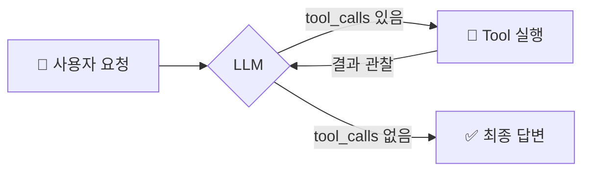

# Chapter 2 · Step 1 — 단일 Agent Loop (샘플)

> 이 페이지는 **빌드 파이프라인 데모**입니다 — 단일소스 코드 임베드(`<<<`), 슬라이드, 퀴즈, mermaid가
> 실제로 동작함을 보여줍니다. 정식 챕터 내용은 콘텐츠 마이그레이션(`/lec-cycle`)에서 채워집니다.

::: info 이 페이지의 목표
LangChain으로 가장 간단한 Agent를 만들어 **ReAct 루프**(Thought → Action → Observation)를
손으로 구현해 봅니다.
:::



## 개념 슬라이드 (PPT형)

<Slides :slides="[
  { emoji: '🤔', title: '1. Thought', text: 'LLM이 무엇을 할지 판단한다.' },
  { emoji: '🔧', title: '2. Action', text: '<code>tool_calls</code>가 있으면 Tool을 호출한다.' },
  { emoji: '👀', title: '3. Observation', text: '결과를 <code>ToolMessage</code>로 대화에 추가한다.' },
  { emoji: '🔁', title: '4. 반복/종료', text: '또 있으면 반복, 없으면 최종 답변으로 빠져나온다.' },
]" />

## 실습 코드 — 단일 소스 임베드

아래 코드는 본문에 복붙한 사본이 **아니라** 저장소의 실제 파일
`ch2-langgraph-agent/step1_basic_agent.py`를 빌드 시점에 그대로 끌어온 것입니다(`<<<`).

<<< ../../ch2-langgraph-agent/step1_basic_agent.py{python}

## 셀프 체크

<Quiz
  question="LLM이 Tool을 더 호출하지 않을 때 Agent 루프는?"
  :options="[
    { text: '에러를 던지고 멈춘다', correct: false },
    { text: 'response.content를 최종 답변으로 반환한다', correct: true },
    { text: '무조건 max_iterations까지 반복한다', correct: false },
  ]"
/>

## ▶ 실행

```bash
uv run python3 ch2-langgraph-agent/step1_basic_agent.py
```
