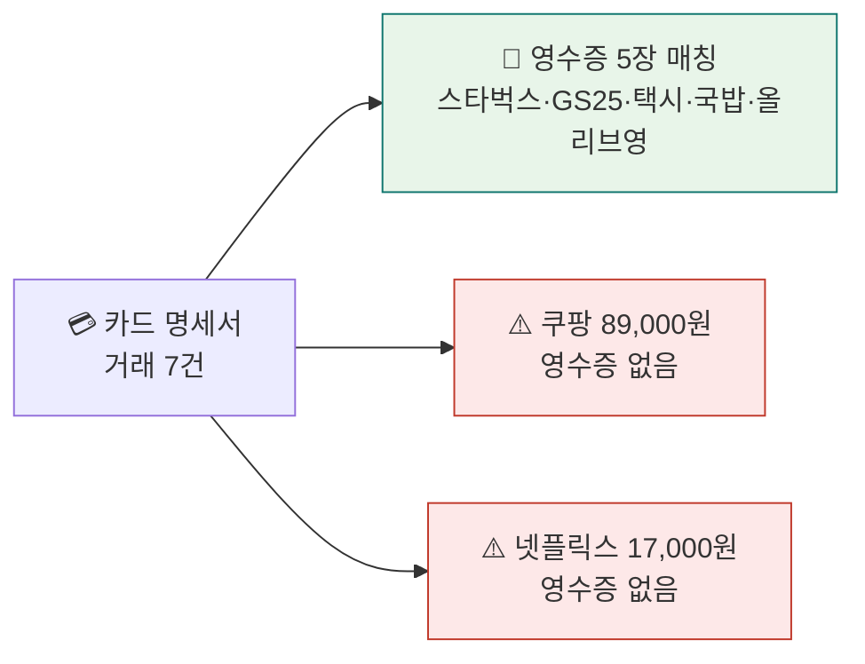
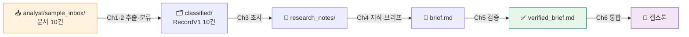

<div class="lec">
<div class="deck">

<section class="slide hero">
<div>
<div class="eyebrow">Chapter 0 · 환경 셋업</div>

# 인박스 한 통,<br>열어볼 준비

<p class="lead">앞으로 8시간 동안 만들 인박스 리서치 애널리스트는 메일과 스캔 폴더로 들어온 영수증·명세서·계약서를 스스로 읽고 정리합니다.<br>
Ch0에서는 그 바탕을 마련합니다. 도구를 설치하고, 모델을 한 번 불러 보고, 분석에 쓸 문서를 준비합니다.</p>

<div class="kicker">
<div class="metric"><span class="num">20</span><strong>분</strong><span>설치 · 작업공간 · 첫 호출</span><span class="clk">예상 9:00–9:20</span></div>
<div class="metric"><span class="num">10</span><strong>건의 문서</strong><span>영수증·명세서·계약·리포트</span></div>
<div class="metric"><span class="num">1</span><strong>데이터 계약</strong><span>전 챕터가 공유하는 RecordV1</span></div>
</div>
</div>

<div class="board">
<div class="board-header"><span>이 챕터가 끝나면</span><span class="status-pill">체크리스트</span></div>
<div class="stack">
<div class="row"><div class="code">1</div><div class="copy"><strong>.venv + .env</strong><p>uv로 의존성 설치, API 키 한 곳에</p></div><div class="store">동작</div></div>
<div class="row"><div class="code">2</div><div class="copy"><strong>첫 LLM 호출</strong><p>Gemini 3.5 Flash 라우팅 확인</p></div><div class="store">응답</div></div>
<div class="row"><div class="code">3</div><div class="copy"><strong>analyst/sample_inbox/</strong><p>분석할 문서 10건 확보</p></div><div class="store">10건</div></div>
</div>
</div>
</section>

<section class="slide">
<div class="section-head">
<div>
<div class="eyebrow">Step 1 · 한 줄 설치 · 3분</div>

## 도구는 한 번에 깐다

</div>
<p class="section-note">런타임은 WSL2(Ubuntu 24.04) · Python 3.12 · uv · Node입니다. setup.sh가 가상환경 생성·의존성 설치·.env 템플릿까지 한 번에 처리하니, 실행한 뒤 키만 채우면 됩니다.<br>
<strong>왜 pip이 아니라 uv?</strong> Ubuntu 24.04는 시스템 Python을 보호하려고 전역 <code>pip install</code>을 막습니다(PEP 668, <code>externally-managed-environment</code> 에러). uv는 레포 <code>.venv</code>에 격리 설치하고 <code>uv run</code>이 자동으로 그 환경을 쓰므로, 가상환경을 깜빡할 일이 없습니다. 그래서 이 과정은 처음부터 uv만 씁니다.</p>
</div>

```bash
bash scripts/setup.sh        # .venv 생성 · uv sync · .env 템플릿
```

<div class="cue do">
<div class="cue-head"><span class="cue-label">✋ 직접 해보기</span><span class="cue-time">~3분</span></div>
<div class="cue-body">지금 이 명령을 실행하세요. 끝까지 돌면 프리플라이트 점검표가 뜨고, <code>❌ OPENROUTER_API_KEY</code> 한 줄만 빨갛고 나머지가 모두 ✅면 성공입니다. 키는 다음 단계에서 채웁니다.</div>
</div>

<div class="grid-3">
<div class="panel"><div class="panel-head"><strong>uv sync</strong><span>의존성 설치</span></div><div class="panel-body"><div class="list">
<p>deepagents · langchain · langgraph</p>
<p>mcp · a2a-sdk · pydantic</p>
<p>레포-로컬 <code>.venv</code> (전역 오염 없음)</p>
</div></div></div>
<div class="panel"><div class="panel-head"><strong>.env</strong><span>API 키 한 곳에</span></div><div class="panel-body"><div class="list">
<p><code>OPENROUTER_API_KEY</code> 한 줄만 채우면 시작합니다. <code>OPENAI_API_KEY</code>·<code>OPENAI_API_BASE</code>도 같은 값으로 채워 두는데, deepagents가 OpenAI 호환 경로로 OpenRouter를 부를 때 이 변수를 읽기 때문입니다</p>
<p><code>MAIL_BACKEND=mock</code> — 메일은 실제 서버 대신 미리 준비한 가짜(mock) 데이터를 쓰므로 외부 메일 서버가 필요 없습니다</p>
<p>레포-로컬 파일이라 <code>~/.bashrc</code>를 안 건드리고 git에도 안 올라갑니다(<code>.gitignore</code>)</p>
</div></div></div>
<div class="panel"><div class="panel-head"><strong>검증</strong><span>준비됐을까</span></div><div class="panel-body"><div class="list">
<p>Python 3.12 · uv 버전 확인</p>
<p><code>uv run python -c "import deepagents"</code></p>
<p>키가 잘 읽히는지 확인</p>
</div></div></div>
</div>

<p class="section-note" style="margin-top:18px">설치가 끝나면 마지막에 프리플라이트 점검표가 뜹니다. API 키 한 줄 빼고 모두 ✅면 준비가 된 겁니다.<br>
키는 다음 단계에서 채웁니다.</p>

```text
▶ Preflight 점검
  ✅ Python 3.12+        ✅ langgraph import
  ✅ uv 설치됨           ✅ deepagents import
  ❌ OPENROUTER_API_KEY  ✅ langchain_mcp_adapters
  ✅ langchain import
  ── 결과: ✅ 6 / ❌ 1 ──
```
</section>

<section class="slide">
<div class="section-head">
<div>
<div class="eyebrow">Step 2 · 작업 공간 · 4분</div>

## 에디터를 WSL에 붙인다

</div>
<p class="section-note">남은 8시간 동안 코드는 전부 WSL 안에서 돕니다. VSCode를 WSL에 연결해 두면 리눅스 쪽 파일과 방금 만든 <code>.venv</code>를 그대로 열어 실행할 수 있습니다.<br>
윈도우와 리눅스 경로가 엉키는 문제도 이때 사라집니다. 한 번만 맞춰 두면 됩니다.</p>
</div>

```bash
# WSL 터미널에서 레포 폴더로 간 다음
code .          # VSCode가 'WSL: Ubuntu' 모드로 열린다
```

<div class="grid-3">
<div class="panel"><div class="panel-head"><strong>① 연결</strong><span>WSL 원격 모드</span></div><div class="panel-body"><div class="list">
<p>왼쪽 아래 모서리에 <code>WSL: Ubuntu</code>가 보이면 연결된 상태입니다</p>
<p>안 보이면 확장 <code>WSL</code>(ms-vscode-remote)을 설치합니다</p>
</div></div></div>
<div class="panel"><div class="panel-head"><strong>② 확장</strong><span>두 개면 충분</span></div><div class="panel-body"><div class="list">
<p><code>Python</code> — 실행·디버그·인텔리센스</p>
<p><code>Jupyter</code> — 노트북 셀 실행</p>
<p>확장은 WSL 쪽에 설치합니다(창 안내를 따르면 됩니다)</p>
</div></div></div>
<div class="panel"><div class="panel-head"><strong>③ 인터프리터</strong><span>.venv 지정</span></div><div class="panel-body"><div class="list">
<p><code>Ctrl+Shift+P</code> → <code>Python: Select Interpreter</code></p>
<p>레포 안 <code>.venv/bin/python</code>을 고릅니다(없으면 <code>Developer: Reload Window</code>)</p>
<p>이걸 골라야 설치한 라이브러리가 잡힙니다</p>
</div></div></div>
</div>

<div class="board" style="margin-top:18px">
<div class="board-header"><span>실행은 두 갈래</span><span class="status-pill">.py 와 .ipynb</span></div>
<div class="stack">
<div class="row"><div class="code">py</div><div class="copy"><strong>스크립트 — 터미널에서</strong><p>완성된 부품은 .py로 둡니다. <code>uv run python3 ch1-llm-basics/classify_one.py</code>처럼 실행하면 <code>.venv</code>를 거쳐 도므로 키와 의존성이 그대로 잡힙니다.</p></div><div class="store">부품</div></div>
<div class="row"><div class="code">nb</div><div class="copy"><strong>노트북 — 셀 단위로</strong><p>실험과 비교는 <code>.ipynb</code>에서 합니다. 노트북을 열고 오른쪽 위 커널을 <code>.venv</code>로 맞춘 뒤 셀을 하나씩 돌려 결과를 눈으로 확인합니다.</p></div><div class="store">실험</div></div>
</div>
</div>

<div class="board" style="margin-top:18px">
<div class="board-header"><span>따라 하기 — 처음 한 번</span><span class="status-pill">5단계</span></div>
<div class="stack">
<div class="row"><div class="code">1</div><div class="copy"><strong>WSL 터미널 열기</strong><p>Windows 시작 메뉴 → <code>Ubuntu</code> 실행. 프롬프트가 <code>~$</code>면 리눅스 안입니다(윈도우 <code>C:\</code>가 아님).</p></div><div class="store">WSL</div></div>
<div class="row"><div class="code">2</div><div class="copy"><strong>레포 받기 → 셋업</strong><p><code>git clone https://github.com/Yo-sure/deepagents-handson ~/lecture</code> → <code>cd ~/lecture</code> → <code>bash scripts/setup.sh</code>. 프리플라이트가 ❌ OPENROUTER 한 줄만 남기면 정상입니다.</p></div><div class="store">.venv</div></div>
<div class="row"><div class="code">3</div><div class="copy"><strong>VSCode를 WSL로 열기</strong><p>같은 폴더에서 <code>code .</code>. 첫 실행이면 VSCode가 WSL 서버를 자동 설치합니다(1분). 왼쪽 아래에 <code>WSL: Ubuntu</code>가 뜨면 성공.</p></div><div class="store">붙음</div></div>
<div class="row"><div class="code">4</div><div class="copy"><strong>인터프리터 = .venv</strong><p><code>Ctrl+Shift+P</code> → <code>Python: Select Interpreter</code> → <code>./.venv/bin/python</code>. 안 보이면 <code>Developer: Reload Window</code> 한 번. 이걸 골라야 설치한 라이브러리가 잡힙니다.</p></div><div class="store">지정</div></div>
<div class="row"><div class="code">5</div><div class="copy"><strong>키 발급 → 채우기 → 첫 실행</strong><p><code>openrouter.ai</code> 가입 → <strong>Keys</strong>에서 키 발급 → <code>.env</code>의 <code>OPENROUTER_API_KEY=</code> 줄 뒤에 붙여넣기. 그다음 VSCode에서 <strong>새 파일을 만들어 <code>first_call.py</code>로 저장</strong>(다음 Step 코드)하고 <code>uv run python3 first_call.py</code>. 한 줄 응답이 뜨면 환경 설정 끝.</p></div><div class="store">✅</div></div>
</div>
</div>

<div class="ask" style="margin-top:18px"><strong>생각해보기 (30초).</strong> 같은 코드를 그냥 <code>python3 first_call.py</code>로 돌렸더니 <code>ModuleNotFoundError: langchain_openai</code>가 났습니다. 무엇이 빠졌을까요?</div>

<details>
<summary>정답 확인</summary>
<div class="reveal">
<p>전역 Python으로 실행돼 레포 <code>.venv</code>를 안 거쳤기 때문입니다. 의존성은 <code>.venv</code>에만 깔려 있으므로 <code>uv run python3 ...</code>로 돌리거나, VSCode에서 인터프리터를 <code>.venv</code>로 지정한 뒤 실행해야 합니다.</p>
<p><code>uv run</code>은 매번 자동으로 <code>.venv</code>를 활성화해 줍니다 — <code>source .venv/bin/activate</code>를 잊어도 됩니다. 그래서 이 과정의 실행 명령은 전부 <code>uv run</code>으로 시작합니다.</p>
</div>
</details>

<div class="board" style="margin-top:18px">
<div class="board-header"><span>막히면 — 자주 나는 것</span><span class="status-pill">트러블슈팅</span></div>
<div class="stack">
<div class="row"><div class="code">!</div><div class="copy"><strong><code>code .</code>가 안 먹힘</strong><p>WSL 터미널이 아니라 Windows CMD에서 친 경우입니다. Ubuntu 앱 안에서 다시 실행하세요.</p></div><div class="store">WSL</div></div>
<div class="row"><div class="code">!</div><div class="copy"><strong><code>uv: command not found</code></strong><p>설치 직후 PATH가 안 잡힌 것. <code>source ~/.bashrc</code> 또는 터미널을 새로 여세요(<code>~/.local/bin</code>).</p></div><div class="store">PATH</div></div>
<div class="row"><div class="code">!</div><div class="copy"><strong>인터프리터에 <code>.venv</code>가 안 보임</strong><p><code>uv sync</code>가 끝나기 전 VSCode를 연 경우. 셋업 완료 후 <code>Developer: Reload Window</code>.</p></div><div class="store">새로고침</div></div>
<div class="row"><div class="code">!</div><div class="copy"><strong><code>externally-managed-environment</code></strong><p><code>pip install</code>을 직접 친 경우(Ubuntu 24.04 차단). 항상 <code>uv add</code>/<code>uv sync</code>를 쓰세요.</p></div><div class="store">PEP668</div></div>
</div>
</div>
</section>

<section class="slide">
<div class="section-head">
<div>
<div class="eyebrow">Step 3 · 첫 호출 · 4분</div>

## 모델이 살아있나

</div>
<p class="section-note">기본 실습 모델은 비용이 낮은 Gemini 3.5 Flash입니다. OpenRouter 게이트웨이로 한 번 불러 보면 키와 경로, 모델 라우팅이 제대로 잡혔는지 30초 안에 확인됩니다.<br>
더 비싼 모델은 비교가 필요할 때만 사용합니다.</p>
</div>

```python
from dotenv import load_dotenv
from langchain_openai import ChatOpenAI
import os

load_dotenv()                       # .env의 키를 환경에 올린다 (uv run은 .env를 자동 로드하지 않는다)

llm = ChatOpenAI(
    model="google/gemini-3.5-flash",
    base_url="https://openrouter.ai/api/v1",
    api_key=os.environ["OPENROUTER_API_KEY"],
)
resp = llm.invoke("한 문장으로 자기소개 해줘")
print(resp.content)
print("→ model:", resp.response_metadata.get("model_name"))   # 실제 라우팅된 모델 확인
```

<div class="cue do">
<div class="cue-head"><span class="cue-label">✋ 직접 해보기</span><span class="cue-time">~1분</span></div>
<div class="cue-body">이 코드를 <code>first_call.py</code>로 저장하고 <code>uv run python3 first_call.py</code>로 실행하세요. <code>.env</code>의 <code>OPENROUTER_API_KEY</code>를 먼저 채워야 합니다.</div>
</div>

<div class="cue wait">
<div class="cue-head"><span class="cue-label">⏳ 기다렸다 확인</span><span class="cue-time">~20초</span></div>
<div class="cue-body">OpenRouter 응답이 돌아올 때까지 잠깐 기다립니다. 자기소개 한 줄과 <code>→ model:</code> 줄이 같이 뜨면, 키·연결뿐 아니라 모델 라우팅까지 정상입니다.</div>
</div>

<div class="board">
<div class="board-header"><span>응답이 오면 키·연결은 정상</span><span class="status-pill">기대 출력</span></div>
<div class="panel-body"><div class="list">
<p>응답 한 줄이 출력되면 키 로드와 OpenRouter 연결은 정상입니다. 다만 응답이 왔다고 슬러그까지 맞은 건 아니어서(게이트웨이가 다른 모델로 폴백할 수 있음), 실제 라우팅은 <code>response_metadata</code>의 <code>model_name</code>으로 확인합니다(LangChain이 OpenAI raw의 <code>model</code> 키를 <code>model_name</code>으로 정규화합니다).</p>
<p><span class="badge red">오류</span> 401이면 키를, 404면 모델 슬러그를, 빈 응답이면 네트워크를 살펴봅니다. <code>load_dotenv()</code>를 빠뜨리면 <code>KeyError: 'OPENROUTER_API_KEY'</code>가 납니다.</p>
</div></div>
</div>
</section>

<section class="slide">
<div class="section-head">
<div>
<div class="eyebrow">Step 4 · 데이터 표면 · 3분</div>

## 분석할 문서 더미를 받는다

</div>
<p class="section-note">실습 내내 같은 입력을 씁니다. 2026년 5월 한 사람의 인박스 열 건 — 이미지(png) 6 + PDF 4입니다.<br>
멀티모달 입력이라 한 장(또는 한 PDF) 안에서 판매처·금액·항목을 그대로 읽어 냅니다.</p>
</div>

<div class="grid-4">
<div class="panel"><div class="panel-head"><strong>영수증 ×5</strong><span>이미지(png)</span></div><div class="panel-body"><div class="list">
<p>카페·편의점·택시·식당·드럭스토어</p>
<p><span class="badge">멀티모달</span> 한 장에서 판매처·금액·항목을 읽어 냅니다</p>
</div></div></div>
<div class="panel"><div class="panel-head"><strong>명세서 ×3</strong><span>카드·은행·청구서</span></div><div class="panel-body"><div class="list">
<p>카드·은행 명세서는 PDF, 용역대금 청구서(invoice_photo)는 사진입니다</p>
<p>셋 다 <code>문서유형: 명세서</code>로 정규화됩니다 — RecordV1엔 청구서·세금계산서 같은 세부 유형이 따로 없습니다</p>
<p>거래가 여러 줄이라 <code>항목</code>도 여러 개입니다</p>
</div></div></div>
<div class="panel"><div class="panel-head"><strong>계약서 ×1</strong><span>PDF</span></div><div class="panel-body"><div class="list">
<p>용역 계약. 발행처·계약금·날짜가 적혀 있습니다</p>
</div></div></div>
<div class="panel"><div class="panel-head"><strong>리포트 ×1</strong><span>PDF</span></div><div class="panel-body"><div class="list">
<p>시장 리포트. 금액이 없는 문서도 다룹니다</p>
</div></div></div>
</div>

<div class="board" style="margin-top:18px">
<div class="board-header"><span>문서가 서로 연결된다</span><span class="status-pill">교차 참조</span></div>
<div class="panel-body">
<p>카드 명세서의 거래 항목은 개별 영수증과 금액이 맞물리고, 은행 명세서는 계약서·청구서와 이어집니다. 일부러 짝이 어긋나게 설계돼 있어, 명세서엔 있지만 영수증이 없는 거래가 Ch3 조사의 표적이 됩니다.</p>



</div>
</div>
</section>

<section class="slide">
<div class="section-head">
<div>
<div class="eyebrow">Step 5 · 데이터 계약 · 4분</div>

## 한 곳에서 정의한다 — RecordV1

</div>
<p class="section-note">문서가 영수증이든 계약서든 읽고 나면 모두 이 RecordV1 구조로 정규화됩니다. 그다음부터 모든 챕터는 파일 포맷이 아니라 이 계약 하나에만 기댑니다.<br>
코드가 정본입니다. 교재는 그 파일을 그대로 가져와 임베드합니다. 복사해 붙인 게 아닙니다.</p>
</div>

<div class="panel">
<div class="panel-head"><strong>analyst/schema.py</strong><span>repo 루트의 공유 패키지 · 단일 소스</span></div>
<div class="panel-body">

<<< ../../analyst/schema.py{python}

</div>
</div>

<div class="board" style="margin-top:18px">
<div class="board-header"><span>파이프라인 경로 — 각 챕터가 한 단계씩 채운다</span><span class="status-pill">디렉터리 규약</span></div>
<div class="panel-body">



<p style="margin-top:12px">입력(<code>analyst/sample_inbox/</code>)만 저장소에 들어 있고, 만들어 내는 산출물은 모두 <code>workspace/</code> 아래에 쌓입니다.</p>
</div>
</div>
</section>

<section class="slide">
<div class="section-head">
<div>
<div class="eyebrow">마무리 · 2분</div>

## 다음 — 영수증을 읽게 만든다

</div>
<p class="section-note">환경과 문서, 계약이 모두 준비됐습니다. Ch1에서는 영수증 이미지 한 장을 모델에게 보여 주고 방금 본 RecordV1 구조로 뽑아냅니다.<br>
애널리스트의 첫 번째 부품입니다.</p>
</div>

<div class="grid-3">
<div class="panel"><div class="panel-head"><strong>지금 손에 든 것</strong></div><div class="panel-body"><div class="list">
<p>동작하는 <code>.venv</code> · <code>.env</code></p>
<p>문서 10건 + RecordV1 계약</p>
</div></div></div>
<div class="panel"><div class="panel-head"><strong>Ch1에서 할 것</strong></div><div class="panel-body"><div class="list">
<p>영수증 1장 → RecordV1 추출</p>
<p>모델 티어 3종 비용·정확도 비교</p>
</div></div></div>
<div class="panel"><div class="panel-head"><strong>최종 목적지</strong></div><div class="panel-body"><div class="list">
<p>인박스 한 통 → 검증된 브리프</p>
<p>Ch6 통합 캡스톤</p>
</div></div></div>
</div>
</section>


<nav class="chapnav">
<div class="board" style="margin-top:8px">
<div style="display:grid;grid-template-columns:1fr auto 1fr;gap:14px;align-items:center">
<span></span>
<a href="/deepagents-handson/toc" style="color:var(--forest);text-decoration:none;font-weight:900;font-size:13px;background:rgba(148,210,189,.3);border:1px solid rgba(15,118,110,.24);border-radius:99px;padding:7px 16px">목차</a>
<a href="/deepagents-handson/chapters/chapter-1" style="color:inherit;text-decoration:none;font-weight:900;font-size:14px;text-align:right">Ch1 · 에이전트 패러다임 →</a>
</div>
</div>
</nav>

</div>
</div>
