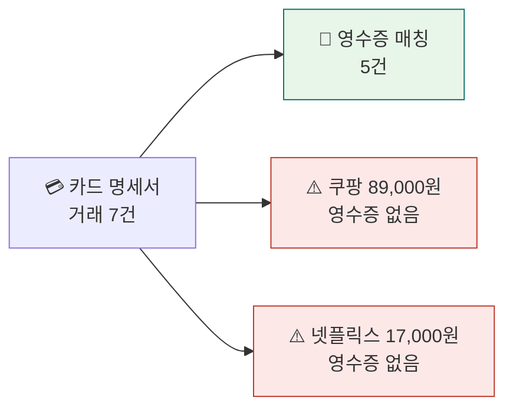
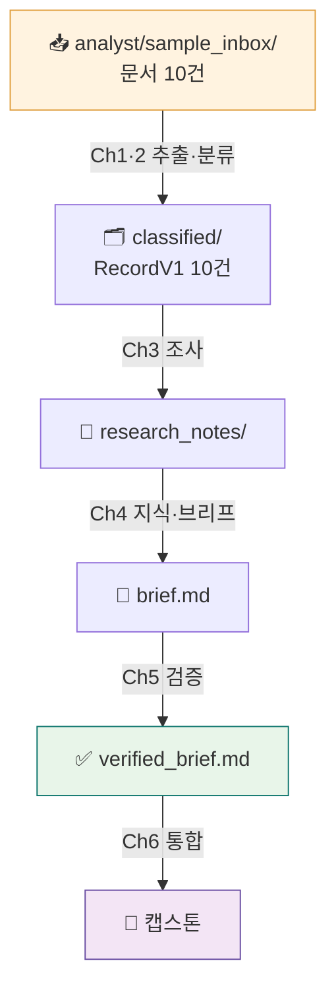

<div class="lec">
<div class="deck">

<section class="slide hero">
<div>
<div class="eyebrow">Chapter 0 · 환경 셋업</div>

# 인박스 한 통,<br>열어볼 준비

<p class="lead">앞으로 8시간 동안 만들 인박스 리서치 애널리스트는 메일과 스캔 폴더로 들어온 영수증·명세서·계약서를 읽고 정리합니다.<br>
Ch0에서는 그 바탕을 마련합니다. 도구를 설치하고, 모델을 한 번 불러 보고, 분석에 쓸 문서를 준비합니다.</p>

<div class="kicker">
<div class="metric"><span class="num">20</span><strong>분</strong><span>설치 · 작업공간 · 첫 호출</span><span class="clk">예상 9:00–9:20 · Windows WSL 최초 설치는 선행</span></div>
<div class="metric"><span class="num">10</span><strong>건의 문서</strong><span>영수증·명세서·계약·리포트</span></div>
<div class="metric"><span class="num">1</span><strong>데이터 계약</strong><span>전 챕터가 공유하는 RecordV1</span></div>
</div>
</div>

<div class="board">
<div class="board-header"><span>이 챕터가 끝나면</span><span class="status-pill">체크리스트</span></div>
<div class="stack">
<div class="row"><div class="code">1</div><div class="copy"><strong>.venv + .env</strong><p>uv로 의존성 설치, API 키 한 곳에</p></div><div class="store">동작</div></div>
<div class="row"><div class="code">2</div><div class="copy"><strong>첫 LLM 호출</strong><p>Gemini 3.5 Flash 라우팅 확인</p></div><div class="store">응답</div></div>
<div class="row"><div class="code">3</div><div class="copy"><strong>analyst/sample_inbox/</strong><p>분석할 문서 10건 확보</p></div><div class="store">10건</div></div>
</div>
</div>
</section>

<section class="slide">
<div class="section-head">
<div>
<div class="eyebrow">Step 0 · WSL2 진입 · Windows 전용 · 최초 1회</div>

## 먼저 Ubuntu(WSL2) 터미널 안으로 들어옵니다

</div>
<p class="section-note">이 과정의 모든 명령은 <strong>Windows가 아니라 WSL2의 Ubuntu 24.04 터미널 안</strong>에서 실행합니다. Ch3·Ch6이 Linux를 전제하기 때문입니다.<br>
<strong>macOS·Linux 사용자는 이 단계를 건너뜁니다</strong> — 바로 Step 1로 가세요. 아래는 Windows 사용자만 해당합니다.</p>
</div>

<p class="section-note">다음 <code>wsl</code> 명령은 <strong>Windows PowerShell</strong>에서 칩니다(관리자 권한 권장). 이미 Ubuntu-24.04가 있으면 설치는 건너뛰고 진입만 하면 됩니다.</p>

```powershell
# 1) 이미 설치돼 있는지 확인 (Windows PowerShell)
wsl --list --verbose
#   NAME            STATE     VERSION
#   Ubuntu-24.04    Stopped   2      ← 이미 있으면 설치 건너뛰고 3)으로

# 2) 없을 때만 설치 — 끝나면 사용자명·비밀번호를 만든다(sudo에 쓰이니 기억할 것)
wsl --install -d Ubuntu-24.04

# 3) Ubuntu로 진입 (또는 시작 메뉴의 'Ubuntu-24.04' 실행)
wsl -d Ubuntu-24.04
```

<div class="cue do">
<div class="cue-head"><span class="cue-label">✋ 직접 해보기</span><span class="cue-time">최초 5~15분 · 보통 수업 전</span></div>
<div class="cue-body">진입한 뒤 <code>whoami</code>를 쳐서 <strong>만든 사용자명</strong>(예: <code>student</code>)이 나오면 Ubuntu 안입니다. PowerShell에서 <code>wsl -d</code>로 들어오면 보통 프롬프트가 <code>…:/mnt/c/Users/…$</code>처럼 <strong>윈도우 경로</strong>로 시작합니다 — 정상입니다. 다음 Step 1이 <code>cd ~</code>로 리눅스 홈으로 옮겨 주니 그대로 진행하면 됩니다. 이제부터 모든 명령은 이 터미널에서 칩니다. 최초 설치는 재부팅이 한 번 필요할 수 있습니다.</div>
</div>

<div class="board">
<div class="board-header"><span>자주 막히는 곳</span><span class="status-pill">트러블슈팅</span></div>
<div class="stack">
<div class="row"><div class="code">!</div><div class="copy"><strong>VERSION이 1로 잡힘</strong><p>PowerShell에서 <code>wsl --set-version Ubuntu-24.04 2</code>로 올립니다. 본 과정은 WSL2 기준입니다.</p></div><div class="store">v2</div></div>
<div class="row"><div class="code">!</div><div class="copy"><strong>sudo 비밀번호를 잊음</strong><p>PowerShell에서 <code>wsl -d Ubuntu-24.04 -u root</code>로 root 진입 후 <code>passwd 사용자명</code>으로 재설정합니다.</p></div><div class="store">root</div></div>
<div class="row"><div class="code">!</div><div class="copy"><strong><code>python: command not found</code></strong><p>Ubuntu 24.04는 <code>python</code> 대신 <code>python3</code>를 씁니다. 본 과정의 모든 명령은 <code>python3</code> 또는 <code>uv run python3</code>입니다.</p></div><div class="store">python3</div></div>
</div>
</div>
</section>

<section class="slide">
<div class="section-head">
<div>
<div class="eyebrow">Step 1 · 한 줄 설치 · 3~6분</div>

## 도구를 한 번에 설치합니다

</div>
<p class="section-note">처음이면 먼저 레포 폴더로 들어옵니다. 그 다음 <code>bash scripts/setup.sh</code>를 실행합니다.<br>
런타임은 WSL2(Ubuntu 24.04) · Python 3.12 · uv · Node 18+입니다. setup.sh가 uv, Node/npm, 가상환경, Python·book 의존성, .env 템플릿까지 처리하니, 실행한 뒤 키만 채우면 됩니다.<br>
<strong>왜 pip이 아니라 uv?</strong> Ubuntu 24.04는 시스템 Python을 보호하려고 전역 <code>pip install</code>을 막습니다(PEP 668, <code>externally-managed-environment</code> 에러). uv는 레포 <code>.venv</code>에 격리 설치하고 <code>uv run</code>이 자동으로 그 환경을 쓰므로, 가상환경을 깜빡할 일이 없습니다. 그래서 이 과정은 처음부터 uv만 씁니다.</p>
</div>

```bash
cd ~                                                                # 홈으로 — 최초 진입은 보통 /mnt/c(윈도우 경로)라 먼저 빠져나온다
git --version || (sudo apt-get update && sudo apt-get install -y git)
git clone https://github.com/Yo-sure/deepagents-handson ~/lecture   # ~/lecture 폴더를 새로 만든다
cd ~/lecture
bash scripts/setup.sh                                               # .venv 생성 · uv sync · .env 템플릿
```

<div class="cue do">
<div class="cue-head"><span class="cue-label">✋ 직접 해보기</span><span class="cue-time">~3–6분</span></div>
<div class="cue-body">레포 폴더(<code>~/lecture</code>) 안에서 이 명령을 실행하세요. 첫 실행은 의존성(deepagents·langchain·langgraph·mcp·a2a-sdk와 book 뷰어)을 내려받느라 네트워크에 따라 수 분 걸립니다. Node/npm이 없으면 apt로 설치하므로 sudo 비밀번호가 한 번 필요할 수 있습니다. 끝까지 돌면 프리플라이트 점검표가 뜹니다. 키 입력 전이라면 <code>OPENROUTER_API_KEY</code>와 <code>OpenAI 호환 라우팅</code> 두 줄만 빨갛고 나머지가 모두 ✅여야 합니다. 이 상태가 부분 준비 완료입니다. 키는 다음 단계에서 채웁니다.</div>
</div>

<div class="grid-3">
<div class="panel"><div class="panel-head"><strong>uv sync</strong><span>의존성 설치</span></div><div class="panel-body"><div class="list">
<p>deepagents · langchain · langgraph</p>
<p>mcp · a2a-sdk · pydantic</p>
<p>레포-로컬 <code>.venv</code> (전역 오염 없음)</p>
</div></div></div>
<div class="panel"><div class="panel-head"><strong>.env</strong><span>API 키 한 곳에</span></div><div class="panel-body"><div class="list">
<p>학생 기본 경로는 OpenRouter입니다. 직접 수정할 줄은 <code>OPENROUTER_API_KEY</code> 하나이고, setup/preflight가 OpenAI 호환 변수(<code>OPENAI_API_KEY</code>·<code>OPENAI_API_BASE</code>)를 같은 OpenRouter 키와 <code>https://openrouter.ai/api/v1</code>로 맞춰 재현성을 보장합니다. 다른 게이트웨이를 쓰려면 preflight와 모델 슬러그까지 강사용으로 별도 조정합니다</p>
<p>이번 실습의 '메일'은 코드에 내장된 샘플 데이터(mock)라 외부 메일 서버가 필요 없습니다. <code>.env</code>의 <code>MAIL_BACKEND</code>는 나중에 실제 메일을 붙일 예약 자리일 뿐, 지금 코드 동작을 바꾸지는 않습니다</p>
<p>레포-로컬 파일이라 <code>~/.bashrc</code>를 안 건드리고 git에도 안 올라갑니다(<code>.gitignore</code>)</p>
</div></div></div>
<div class="panel"><div class="panel-head"><strong>검증</strong><span>준비됐을까</span></div><div class="panel-body"><div class="list">
<p>Python 3.12 · uv 버전 확인</p>
<p><code>uv run python -c "import deepagents"</code></p>
<p>키가 잘 읽히는지 확인</p>
</div></div></div>
</div>

<p class="section-note" style="margin-top:18px">설치가 끝나면 마지막에 프리플라이트 점검표가 뜹니다. 키 관련 두 줄만 빼고 모두 ✅면 설치 단계는 성공입니다.<br>
키를 채운 뒤에는 <code>bash scripts/preflight.sh</code>를 다시 실행해 <strong>✅ 14 / ❌ 0</strong>을 확인합니다. 이 기본 점검은 로컬 의존성·샘플 10건·계약 테스트·키 로딩뿐 아니라 실제 OpenRouter live 호출과 기본 모델 라우팅까지 확인합니다. 키 입력 전 설치 단계만 확인할 때는 setup.sh가 내부적으로 <code>--local</code> 점검을 씁니다.</p>

```text
▶ Preflight 점검
  ✅ Python 3.12+            ✅ book npm 의존성
  ✅ 샘플 문서 10건
  ✅ 샘플 계약 테스트
  ✅ uv 설치됨               ❌ OPENROUTER_API_KEY
  ✅ Node 18+ 설치됨         ❌ OpenAI 호환 라우팅
  ✅ npm 설치됨              ✅ langchain import
  ✅ langgraph import        ✅ deepagents import
  ✅ langchain_mcp_adapters
  ── 결과: ✅ 11 / ❌ 2 ──
  ⚠️  키 입력 전 부분 준비 완료 — .env의 OPENROUTER_API_KEY를 채운 뒤 다시 실행하세요.
```
</section>

<section class="slide">
<div class="section-head">
<div>
<div class="eyebrow">Step 2 · 작업 공간 · 4분</div>

## 에디터를 WSL에 붙인다

</div>
<p class="section-note">남은 8시간 동안 코드는 전부 WSL 안에서 실행됩니다. VSCode를 WSL에 연결해 두면 리눅스 쪽 파일과 방금 만든 <code>.venv</code>를 그대로 열어 실행할 수 있습니다.<br>
윈도우와 리눅스 경로가 엉키는 문제도 이때 사라집니다. 한 번만 맞춰 두면 됩니다.</p>
</div>

```bash
# WSL 터미널에서 레포 폴더로 간 다음
code .          # VSCode가 'WSL: Ubuntu' 모드로 열린다
```

<div class="grid-3">
<div class="panel"><div class="panel-head"><strong>① 연결</strong><span>WSL 원격 모드</span></div><div class="panel-body"><div class="list">
<p>왼쪽 아래 모서리에 <code>WSL: Ubuntu</code>가 보이면 연결된 상태입니다</p>
<p>안 보이면 확장 <code>WSL</code>(ms-vscode-remote)을 설치합니다</p>
</div></div></div>
<div class="panel"><div class="panel-head"><strong>② 확장</strong><span>두 개면 충분</span></div><div class="panel-body"><div class="list">
<p><code>Python</code> — 실행·디버그·인텔리센스</p>
<p><code>Jupyter</code> — 노트북 셀 실행</p>
<p>확장은 WSL 쪽에 설치합니다(창 안내를 따르면 됩니다)</p>
</div></div></div>
<div class="panel"><div class="panel-head"><strong>③ 인터프리터</strong><span>.venv 지정</span></div><div class="panel-body"><div class="list">
<p><code>Ctrl+Shift+P</code> → <code>Python: Select Interpreter</code></p>
<p>레포 안 <code>.venv/bin/python</code>을 고릅니다(없으면 <code>Developer: Reload Window</code>)</p>
<p>이걸 골라야 설치한 라이브러리가 잡힙니다</p>
</div></div></div>
</div>

<div class="board" style="margin-top:18px">
<div class="board-header"><span>실행은 두 갈래</span><span class="status-pill">.py 와 .ipynb</span></div>
<div class="stack">
<div class="row"><div class="code">py</div><div class="copy"><strong>스크립트 — 터미널에서</strong><p>완성된 모듈은 .py로 둡니다. <code>uv run python3 ch1-llm-basics/classify_one.py</code>처럼 실행하면 <code>.venv</code>를 거쳐 돌므로 키와 의존성이 그대로 잡힙니다.</p></div><div class="store">모듈</div></div>
<div class="row"><div class="code">nb</div><div class="copy"><strong>노트북 — 셀 단위로</strong><p>실험과 비교는 <code>.ipynb</code>에서 합니다. 노트북을 열고 오른쪽 위 커널을 <code>.venv</code>로 맞춘 뒤 셀을 하나씩 돌려 결과를 눈으로 확인합니다.</p></div><div class="store">실험</div></div>
</div>
</div>

<div class="board" style="margin-top:18px">
<div class="board-header"><span>따라 하기 — 처음 한 번</span><span class="status-pill">5단계</span></div>
<div class="stack">
<div class="row"><div class="code">1</div><div class="copy"><strong>WSL 터미널 열기</strong><p>Windows 시작 메뉴 → <code>Ubuntu</code> 실행. Ubuntu가 없다면 Windows PowerShell을 관리자 권한으로 열어 <code>wsl --install -d Ubuntu-24.04</code>를 먼저 실행한 뒤 재부팅합니다. 프롬프트가 <code>~$</code>면 리눅스 안입니다(윈도우 <code>C:\</code>가 아님).</p></div><div class="store">WSL</div></div>
<div class="row"><div class="code">2</div><div class="copy"><strong>레포 받기 → 셋업</strong><p><code>git</code>이 없다면 먼저 <code>sudo apt-get update && sudo apt-get install -y git</code>. 그 다음 <code>git clone https://github.com/Yo-sure/deepagents-handson ~/lecture</code> → <code>cd ~/lecture</code> → <code>bash scripts/setup.sh</code>. 프리플라이트가 키 관련 두 줄만 남기면 정상입니다.</p></div><div class="store">.venv</div></div>
<div class="row"><div class="code">3</div><div class="copy"><strong>VSCode를 WSL로 열기</strong><p>같은 폴더에서 <code>code .</code>. 첫 실행이면 VSCode가 WSL 서버를 자동 설치합니다(1분). 왼쪽 아래에 <code>WSL: Ubuntu</code>가 뜨면 성공.</p></div><div class="store">붙음</div></div>
<div class="row"><div class="code">4</div><div class="copy"><strong>인터프리터 = .venv</strong><p><code>Ctrl+Shift+P</code> → <code>Python: Select Interpreter</code> → <code>./.venv/bin/python</code>. 안 보이면 <code>Developer: Reload Window</code> 한 번. 이걸 골라야 설치한 라이브러리가 잡힙니다.</p></div><div class="store">지정</div></div>
<div class="row"><div class="code">5</div><div class="copy"><strong>키 발급 → .env 채우기</strong><p><code>openrouter.ai</code> 가입 → 결제/크레딧 한도 확인 → <strong>Keys</strong>에서 키 발급 → <code>.env</code>의 <code>OPENROUTER_API_KEY=sk-or-...</code> 줄에서 <code>sk-or-...</code> 전체를 지우고 새 키로 바꿉니다. 여기까지가 환경 준비입니다. 모델을 실제로 한 번 불러 보는 첫 호출은 바로 다음 Step 3에서 합니다. 교재 화면은 <code>npm --prefix book run dev</code>로 엽니다.</p></div><div class="store">키</div></div>
</div>
</div>

<div class="ask" style="margin-top:18px"><strong>생각해보기 (30초).</strong> 곧 Step 3에서 만들 코드를 <code>uv run</code> 없이 그냥 <code>python3 first_call.py</code>로 돌리면 <code>ModuleNotFoundError: langchain_openai</code>가 납니다. 무엇이 빠졌을까요?</div>

<details>
<summary>정답 확인</summary>
<div class="reveal">
<p>전역 Python으로 실행돼 레포 <code>.venv</code>를 안 거쳤기 때문입니다. 의존성은 <code>.venv</code>에만 깔려 있으므로 <code>uv run python3 ...</code>로 돌리거나, VSCode에서 인터프리터를 <code>.venv</code>로 지정한 뒤 실행해야 합니다.</p>
<p><code>uv run</code>은 매번 자동으로 <code>.venv</code>를 활성화하므로 <code>source .venv/bin/activate</code>를 잊어도 됩니다. 그래서 이 과정의 실행 명령은 전부 <code>uv run</code>으로 시작합니다.</p>
</div>
</details>

<div class="board" style="margin-top:18px">
<div class="board-header"><span>막히면 — 자주 나는 것</span><span class="status-pill">트러블슈팅</span></div>
<div class="stack">
<div class="row"><div class="code">!</div><div class="copy"><strong><code>code .</code>가 안 먹힘</strong><p>Ubuntu 앱 안에서 실행했는지 먼저 확인합니다. 그래도 안 되면 VSCode 설치, Remote - WSL 확장, PATH 연동을 확인한 뒤 Windows에서 VSCode를 한 번 열고 WSL 터미널을 새로 여세요.</p></div><div class="store">WSL</div></div>
<div class="row"><div class="code">!</div><div class="copy"><strong><code>uv: command not found</code></strong><p>설치 직후 PATH가 안 잡힌 것. <code>source ~/.bashrc</code> 또는 터미널을 새로 여세요(<code>~/.local/bin</code>).</p></div><div class="store">PATH</div></div>
<div class="row"><div class="code">!</div><div class="copy"><strong><code>WSL2 환경이 아닌 것 같습니다</code></strong><p>Windows Git Bash/macOS/일반 Linux에서 실수로 실행하면 <code>setup.sh</code>가 중단합니다. 수업 기준은 WSL2 Ubuntu 24.04입니다. 연구실 Linux 등에서 의도적으로 돌릴 때만 <code>ACDC_ALLOW_NON_WSL=1 bash scripts/setup.sh</code>로 우회하세요.</p></div><div class="store">격리</div></div>
<div class="row"><div class="code">!</div><div class="copy"><strong><code>/mnt/c/...</code> 경로에서 실행 중</strong><p>윈도우 파일시스템 위라 느리고 파일감시가 흔들릴 수 있습니다. Ubuntu 터미널에서 <code>git clone ... ~/lecture</code>로 WSL 홈에 다시 받는 게 기준입니다. 의도적으로 우회할 때만 <code>ACDC_ALLOW_MNTC=1</code>을 씁니다.</p></div><div class="store">경로</div></div>
<div class="row"><div class="code">!</div><div class="copy"><strong>인터프리터에 <code>.venv</code>가 안 보임</strong><p><code>uv sync</code>가 끝나기 전 VSCode를 연 경우. 셋업 완료 후 <code>Developer: Reload Window</code>.</p></div><div class="store">새로고침</div></div>
<div class="row"><div class="code">!</div><div class="copy"><strong><code>externally-managed-environment</code></strong><p><code>pip install</code>을 직접 친 경우(Ubuntu 24.04 차단). 항상 <code>uv add</code>/<code>uv sync</code>를 쓰세요.</p></div><div class="store">PEP668</div></div>
</div>
</div>
</section>

<section class="slide">
<div class="section-head">
<div>
<div class="eyebrow">Step 3 · 첫 호출 · 4분</div>

## 모델 호출을 확인합니다

</div>
<p class="section-note">기본 실습 모델은 Gemini 3.5 Flash입니다. OpenRouter 게이트웨이로 한 번 불러 보면 키와 경로, 모델 라우팅이 제대로 잡혔는지 30초 안에 확인됩니다.<br>
더 비싼 모델은 비교가 필요할 때만 사용합니다.</p>
</div>

<<< ../../analyst/first_call.py{python}

<div class="cue do">
<div class="cue-head"><span class="cue-label">✋ 직접 해보기</span><span class="cue-time">~1분</span></div>
<div class="cue-body">위 코드는 레포에 들어 있는 <code>analyst/first_call.py</code>입니다. 따로 만들 필요 없이 <code>uv run python3 analyst/first_call.py</code>로 바로 실행합니다. 이게 학생이 직접 보는 첫 LLM 호출입니다. 통과하면 이어서 <code>bash scripts/preflight.sh</code>로 종합 live 점검 <code>✅ 14 / ❌ 0</code>을 확인하세요. <code>.env</code>의 <code>OPENROUTER_API_KEY</code>를 먼저 채워야 합니다. Gemini 3.5 Flash는 과금 모델이라 OpenRouter 계정에 크레딧이나 결제 한도가 없으면 402/credit 계열 오류가 날 수 있습니다.</div>
</div>

<div class="cue wait">
<div class="cue-head"><span class="cue-label">⏳ 기다렸다 확인</span><span class="cue-time">~20초</span></div>
<div class="cue-body">OpenRouter 응답이 돌아올 때까지 잠깐 기다립니다. 자기소개 한 줄과 <code>→ model:</code> 줄이 같이 뜨면, 키·연결뿐 아니라 모델 라우팅까지 정상입니다.</div>
</div>

<div class="board">
<div class="board-header"><span>응답이 오면 키·연결은 정상</span><span class="status-pill">기대 출력</span></div>
<div class="panel-body"><div class="list">
<p>응답 한 줄이 출력되면 키 로드와 OpenRouter 연결은 정상입니다. 다만 응답이 왔다고 슬러그까지 맞은 건 아니어서(게이트웨이가 다른 모델로 폴백할 수 있음), 실제 라우팅은 <code>response_metadata</code>의 <code>model_name</code>으로 확인합니다(LangChain이 OpenAI raw의 <code>model</code> 키를 <code>model_name</code>으로 정규화합니다).</p>
<p><span class="badge red">오류</span> 401이면 키를, 402/credit이면 OpenRouter 크레딧·결제 한도를, 404면 모델 슬러그를, 빈 응답이면 네트워크를 살펴봅니다. <code>load_dotenv()</code>를 빠뜨리면 <code>KeyError: 'OPENROUTER_API_KEY'</code>가 납니다.</p>
</div></div>
</div>

<div class="board" style="margin-top:18px">
<div class="board-header"><span>이 과정의 실행 규약 — live가 기본, <code>--mock</code>은 결정론 보조</span><span class="status-pill">전 챕터 공통</span></div>
<div class="panel-body"><div class="list">
<p>키를 받았으니 <strong>기본은 live 실행</strong>입니다. 실제 모델이 영수증을 읽고 분류합니다. 이 교재는 여러분이 키를 가졌다고 전제하고 <em>live 동작을 기준으로</em> 쓰여 있습니다. <code>--mock</code>은 주 경로가 아니라 보조입니다. 쓰는 자리는 둘뿐입니다. ① 키·네트워크가 없거나 모델이 흔들릴 때(장애·오프라인·CI)의 대비, ② 표현이 매번 달라지면 비교가 안 되는 곳에서 구조를 <em>결정론적으로 고정해 보여 줄 때</em>(예: Ch3 fan-out이 스레드로 동시에 도는 모양). 그 둘이 아니면 live로 보세요. 메커니즘 점검용 <code>--show</code>·<code>--protocol</code>·<code>--card</code>는 키가 필요 없지만 이건 mock과 달리 <em>실제 코드 경로</em>를 출력합니다.</p>
<p>그래서 교재의 출력 패널엔 두 종류가 있습니다. ① <strong>모델이 추출하는 값</strong>(판매처·금액·신뢰도·ReAct 트레이스)은 live면 같은 입력에도 표현·값이 조금씩 다릅니다(Ch1의 temperature=0도 완전 결정론은 아니다). 교재가 그런 값을 보일 땐 대표 예시이고, 글자 그대로의 결정론 기준이 필요하면 <code>--mock</code>을 봅니다. ② <strong>코드가 정하는 출력</strong>(<code>--list</code> 도구 목록·<code>--trace</code> 하네스 구성·영수증 없는 거래 gap 계산·검증 PASS/NEEDS_REVISION 판정)은 키와 무관하게 항상 같습니다. 이건 화면과 글자 단위로 일치해야 합니다.</p>
</div></div>
</div>
</section>

<section class="slide">
<div class="section-head">
<div>
<div class="eyebrow">Step 4 · 데이터 표면 · 3분</div>

## 분석할 샘플 문서를 확인합니다

</div>
<p class="section-note">실습 내내 같은 입력을 씁니다. 2026년 5월 한 사람의 인박스 열 건, 이미지(png) 6 + PDF 4입니다.<br>
멀티모달 입력이라 한 장(또는 한 PDF) 안에서 판매처·금액·항목을 그대로 읽어 냅니다.</p>
</div>

<div class="grid-4">
<div class="panel"><div class="panel-head"><strong>영수증 ×5</strong><span>이미지(png)</span></div><div class="panel-body"><div class="list">
<p>카페·편의점·택시·식당·드럭스토어</p>
<p><span class="badge">멀티모달</span> 한 장에서 판매처·금액·항목을 읽어 냅니다</p>
</div></div></div>
<div class="panel"><div class="panel-head"><strong>명세서 ×3</strong><span>카드·은행·청구서</span></div><div class="panel-body"><div class="list">
<p>카드·은행 명세서는 PDF, 용역대금 청구서(invoice_photo)는 사진입니다</p>
<p>셋 다 <code>문서유형: 명세서</code>로 정규화됩니다. RecordV1엔 청구서·세금계산서 같은 세부 유형이 따로 없습니다</p>
<p>거래가 여러 줄이라 <code>항목</code>도 여러 개입니다</p>
</div></div></div>
<div class="panel"><div class="panel-head"><strong>계약서 ×1</strong><span>PDF</span></div><div class="panel-body"><div class="list">
<p>용역 계약. 발행처·계약금·날짜가 적혀 있습니다</p>
</div></div></div>
<div class="panel"><div class="panel-head"><strong>리포트 ×1</strong><span>PDF</span></div><div class="panel-body"><div class="list">
<p>시장 리포트. 금액이 없는 문서도 다룹니다</p>
</div></div></div>
</div>

<div class="board" style="margin-top:18px">
<div class="board-header"><span>실제 입력 미리보기 — 모델이 읽는 문서</span><span class="status-pill">sample_inbox</span></div>
<div class="panel-body">
<p class="section-note">아래가 실습 내내 모델이 그대로 받아 읽는 입력입니다. 영수증 5장과 사진 청구서 하나입니다. 이 픽셀에서 판매처·금액·항목을 뽑아 RecordV1로 채웁니다. (나머지 카드·은행 명세서·계약서·리포트는 PDF라 여기선 생략합니다.)</p>
<div class="inbox-gallery">
<figure><figcaption>스타벅스 · 11,500원</figcaption></figure>
<figure><figcaption>GS25 · 8,400원</figcaption></figure>
<figure><figcaption>카카오T 택시 · 14,300원</figcaption></figure>
<figure><figcaption>광화문 국밥 · 27,000원</figcaption></figure>
<figure><figcaption>올리브영 · 38,700원</figcaption></figure>
<figure><figcaption>용역 청구서(사진) · 1,650,000원</figcaption></figure>
</div>
</div>
</div>

<div class="board" style="margin-top:18px">
<div class="board-header"><span>문서가 서로 연결된다</span><span class="status-pill">교차 참조</span></div>
<div class="panel-body">
<p>카드 명세서의 거래 항목은 개별 영수증과 금액이 맞물리고, 은행 명세서는 계약서·청구서와 이어집니다. 일부러 짝이 어긋나게 설계돼 있어, 명세서엔 있지만 영수증이 없는 거래가 Ch3 조사의 표적이 됩니다.</p>



</div>
</div>
</section>

<section class="slide">
<div class="section-head">
<div>
<div class="eyebrow">Step 5 · 데이터 계약 · 4분</div>

## 한 곳에서 정의한다 — RecordV1

</div>
<p class="section-note">문서가 영수증이든 계약서든 읽고 나면 모두 이 RecordV1 구조로 정규화됩니다. 그다음부터 모든 챕터는 파일 포맷이 아니라 이 계약 하나에만 의존합니다.<br>
코드가 정본입니다. 교재는 그 파일을 그대로 가져와 임베드합니다. 복사해 붙인 게 아닙니다.</p>
</div>

<div class="panel">
<div class="panel-head"><strong>analyst/schema.py</strong><span>repo 루트의 공유 패키지 · 단일 소스</span></div>
<div class="panel-body">

<<< ../../analyst/schema.py{python}

</div>
</div>

<details class="deep">
<summary>🔬 심화 — 왜 추출은 영문인데 저장은 한글인가: 현지화를 출력 경계 한 곳에만 두는 <code>alias</code> <span style="color:var(--muted)">(RecordV1 내부)</span></summary>
<div class="reveal">
<p>각 필드가 <em>영문 이름</em>(<code>merchant</code>)과 <em>한글 alias</em>(<code>판매처</code>)를 둘 다 가진다. 우연이 아니라 <strong>서로 충돌하는 두 요구</strong>를 한 줄로 가른 것이다.</p>
<table>
<thead><tr><th>요구</th><th>해법</th></tr></thead>
<tbody>
<tr><td>산출물 JSON을 사람이 읽기 좋게</td><td>직렬화 키 = <strong>한글 alias</strong>(<code>classified/*.json</code>에 <code>"판매처"</code>로 나감)</td></tr>
<tr><td>코드 내부 식별자는 영문이 안전</td><td>필드 이름 = <strong>영문</strong>(<code>rec.merchant</code> — 파이썬 관례와 IDE·타입 검사에 맞춤)</td></tr>
</tbody>
</table>
<p><strong>둘을 잇는 게 <code>ConfigDict(populate_by_name=True)</code>다.</strong> 한글 alias로도, 영문 이름으로도 객체를 만들 수 있다. 그래서 mock은 gold(한글 키 dict)를 <code>model_validate</code>로 그대로 적재하고, 코드는 <code>rec.merchant</code>로 접근한다. 같은 객체, 두 입구.</p>
<p><strong>LLM·코드 계약은 영문, 한글은 저장에서만.</strong> <code>schema_json()</code>은 <code>RecordV1.model_json_schema(by_alias=False)</code>라 모델이 받는 structured-output 스키마의 키가 <code>merchant·total…</code> 영문이다. 모델은 영문으로 추출하고, 한글은 사람이 읽는 산출물을 저장할 때 <code>model_dump(by_alias=True)</code>에서만 입는다. 즉 현지화가 LLM·코드 경계로 새지 않고 <em>출력 경계 한 곳</em>에 머문다. 추출은 영문, 한글은 추출 후 변형이다.</p>
<p><strong>두 디테일.</strong> ① <code>use_enum_values=True</code>라 <code>doc_type</code>이 <code>DocType.receipt</code> 객체가 아니라 문자열 <code>"영수증"</code>으로 직렬화된다(JSON에 그대로 들어간다). ② 최상위 <code>total</code>의 alias는 <code>총액</code>, <code>LineItem.amount</code>의 alias는 <code>단가</code>로 서로 다르다. 같은 한글이 두 뜻으로 겹치지 않는다. 그래서 Ch1의 합계 검산이 <strong>Σ(단가 × 수량) == 총액</strong>으로 깔끔히 읽힌다. 광화문 국밥은 순대국밥 <code>단가 9,000원 × 수량 3 = 27,000원</code>(=총액)이라, 수량을 빼먹고 9,000원만 더하면 27,000원과 어긋나 <em>멀쩡한 영수증을 틀렸다고</em> 잡는다. 단가·수량·총액 셋을 함께 봐야 검산이 선다.</p>
<p class="muted"><strong>핵심 정리.</strong> <code>alias</code> + <code>populate_by_name</code> = 코드·LLM 계약은 영문(<code>merchant·total</code>), 사람용 산출물만 저장할 때 한글로 변형(<code>by_alias</code>). 현지화는 출력 경계 한 곳에. 지금은 schema.py를 읽고 추출·코드는 영문, 저장 출력만 한글이라는 점만 잡으면 됩니다.</p>
</div>
</details>

<div class="board" style="margin-top:18px">
<div class="board-header"><span>파이프라인 경로 — 각 챕터가 한 단계씩 채운다</span><span class="status-pill">디렉터리 규약</span></div>
<div class="panel-body">



<p style="margin-top:12px">입력(<code>analyst/sample_inbox/</code>)만 저장소에 들어 있고, 만들어 내는 산출물은 모두 <code>workspace/</code> 아래에 쌓입니다.</p>
</div>
</div>
</section>

<section class="slide">
<div class="section-head">
<div>
<div class="eyebrow">스스로 점검 · 3분</div>

## 넘어가기 전에 — 환경 확인

</div>
<p class="section-note">Ch1로 가기 전, 환경과 계약이 정말 손에 잡혔는지 다섯 문항으로 점검합니다. 막히면 위 단계로 돌아가세요.</p>
</div>

<div class="board" style="margin-top:18px">
<div class="board-header"><span>스스로 점검</span><span class="status-pill">5문항</span></div>
<div class="panel-body"><div class="list">
<p><strong>Q1.</strong> 왜 <code>pip install</code>이 아니라 <code>uv</code>를 쓰나? 한 줄로.</p>
<p><strong>Q2.</strong> 실습 코드를 <code>python3 x.py</code>가 아니라 <code>uv run python3 x.py</code>로 도는 이유는?</p>
<p><strong>Q3.</strong> <code>.env</code>에 반드시 채워야 하는 키 한 줄은? 나머지 항목은 왜 그대로 둬도 되나?</p>
<p><strong>Q4.</strong> 첫 호출에서 <code>401</code>·<code>404</code>·빈 응답은 각각 무엇을 의심하나?</p>
<p><strong>Q5.</strong> 모든 챕터가 공유하는 데이터 계약의 이름과, 그게 정의된 파일 경로는?</p>
</div></div>
</div>

<details>
<summary>정답 확인</summary>
<div class="reveal">
<p><strong>A1.</strong> Ubuntu 24.04는 전역 <code>pip install</code>을 막는다(PEP 668). <code>uv</code>는 레포 <code>.venv</code>에 격리 설치한다.</p>
<p><strong>A2.</strong> <code>uv run</code>이 자동으로 <code>.venv</code>를 거치므로 의존성이 잡힌다. 키는 코드의 <code>load_dotenv()</code> 또는 <code>analyst</code> import가 <code>.env</code>를 읽어 올린다. 전역 Python으로 돌면 <code>ModuleNotFoundError</code>가 난다.</p>
<p><strong>A3.</strong> 반드시 직접 채울 키는 <code>OPENROUTER_API_KEY</code> 한 줄이다. 실습 패키지가 OpenAI 호환 경로용 <code>OPENAI_API_KEY</code>/<code>OPENAI_API_BASE</code>가 비어 있을 때만 OpenRouter 값으로 맞춘다. <code>MAIL_BACKEND=mock</code>은 실제 메일 서버를 붙일 자리라 지금 실습에선 그대로 둔다.</p>
<p><strong>A4.</strong> 401=키, 402/credit=크레딧·결제 한도, 404=모델 슬러그, 빈 응답=네트워크.</p>
<p><strong>A5.</strong> <code>RecordV1</code> — <code>analyst/schema.py</code>.</p>
</div>
</details>
</section>

<section class="slide">
<div class="section-head">
<div>
<div class="eyebrow">마무리 · 2분</div>

## 다음 — 영수증을 읽게 만든다

</div>
<p class="section-note">환경과 문서, 계약이 모두 준비됐습니다. Ch1에서는 영수증 이미지 한 장을 모델에게 보여 주고 방금 본 RecordV1 구조로 뽑아냅니다.<br>
애널리스트의 첫 번째 모듈입니다.</p>
</div>

<div class="grid-3">
<div class="panel"><div class="panel-head"><strong>이번 챕터 결과</strong></div><div class="panel-body"><div class="list">
<p>동작하는 <code>.venv</code> · <code>.env</code></p>
<p>문서 10건 + RecordV1 계약</p>
</div></div></div>
<div class="panel"><div class="panel-head"><strong>Ch1에서 할 것</strong></div><div class="panel-body"><div class="list">
<p>영수증 1장 → RecordV1 추출</p>
<p>모델 티어 3종 비용·정확도 비교</p>
</div></div></div>
<div class="panel"><div class="panel-head"><strong>최종 목적지</strong></div><div class="panel-body"><div class="list">
<p>인박스 한 통 → 검증된 브리프</p>
<p>Ch6 통합 캡스톤</p>
</div></div></div>
</div>
</section>


<nav class="chapnav">
<div class="board" style="margin-top:8px">
<div style="display:grid;grid-template-columns:1fr auto 1fr;gap:14px;align-items:center">
<span></span>
<a href="/deepagents-handson/toc" style="color:var(--forest);text-decoration:none;font-weight:900;font-size:13px;background:rgba(148,210,189,.3);border:1px solid rgba(15,118,110,.24);border-radius:99px;padding:7px 16px">목차</a>
<a href="/deepagents-handson/chapters/chapter-1" style="color:inherit;text-decoration:none;font-weight:900;font-size:14px;text-align:right">Ch1 · 에이전트 패러다임 →</a>
</div>
</div>
</nav>

</div>
</div>
