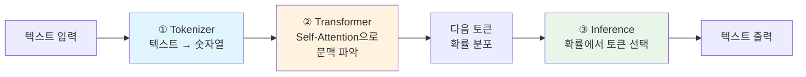
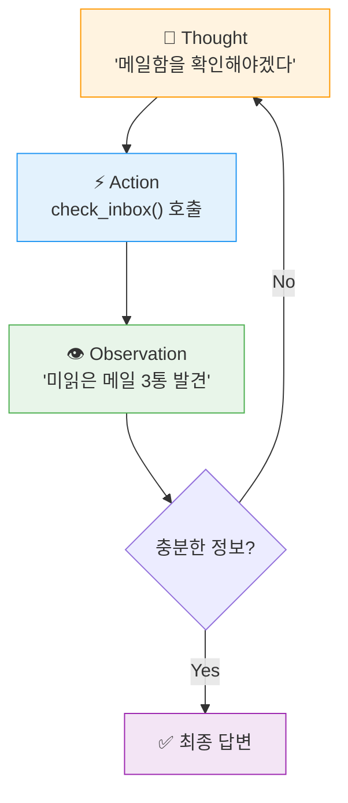

# Chapter 1. Kick-off & Agent 패러다임

> **학습 목표**
> - [ ] LLM의 동작 원리(토큰 예측, 디코딩)와 4가지 시스템적 한계를 설명할 수 있다
> - [ ] ReAct 패턴(Thought → Action → Observation)으로 Agent가 LLM 한계를 극복하는 방식을 설명할 수 있다
> - [ ] Framework(LangChain) → Runtime(LangGraph) → Harness(DeepAgents) 3계층의 역할을 비교할 수 있다
> - [ ] 작업 복잡도에 따라 단순 LLM 호출부터 Agent까지 적합한 패턴을 구분할 수 있다

| 소요시간 | 학습방법 |
|---------|---------|
| 1.0h | 이론 |

---

<p align="right"><sub style="color:gray">⏱ 09:00 – 시작</sub></p>

## 0. 왜 지금 Agent인가? — Phase Shift

### Karpathy의 선언 (2025년 12월)

**Andrej Karpathy** — Tesla 자율주행 AI 총괄 출신, OpenAI 창립 연구팀 멤버 — 는 2025년을 AI가 **능력 임계점을 넘은 해**로 평가했습니다.

*“2025년은 AI가 단순히 영어로만 지시해도 온갖 인상적인 프로그램을 만들어낼 수 있는 역량 임계점을 넘어선 해이며, 이제는 코드라는 것이 존재한다는 사실조차 잊게 되는 해다.”*
> *"2025 is the year that AI crossed a capability threshold necessary to build all kinds of impressive programs simply via English, forgetting that the code even exists."*
> — Andrej Karpathy, [2025 Year in Review](https://karpathy.bearblog.dev/year-in-review-2025/)


이 임계점이 **Agent 영역**에서 구체적으로 어떻게 나타났는지, 수치로 확인해보겠습니다.

### 수치로 보는 변화 — Agent가 실제 엔지니어링 문제를 푼다

**[SWE-Bench Verified](https://www.swebench.com)** — Princeton NLP 팀이 만든 소프트웨어 엔지니어링 벤치마크입니다. 실제 오픈소스 GitHub 이슈(Django, scikit-learn 등 12개 라이브러리)를 주고, 코드를 읽고 → 버그를 찾고 → 패치를 작성하고 → 테스트를 통과해야 합니다. Verified 서브셋은 500문제를 93명의 개발자가 교차 검증한 고품질 부분집합입니다.

**성능 변화 추이** (Verified 기준, [swebench.com](https://www.swebench.com) 2026-02 스냅샷):

| 시점          | 최고 성능    | 대표 시스템                                                       |
| ----------- | -------- | ------------------------------------------------------------ |
| 2024년 초     | ~14%\*   | Devin (Cognition AI)                                         |
| 2024년 말     | ~49%     | Claude 3.5 Sonnet 기반                                         |
| 2025년 초     | ~62%     | Claude 3.7 Sonnet                                            |
| 2025년 중     | ~70%     | Claude 4 계열                                                  |
| **2026년 초** | **76.8%** | **Claude 4.5 Opus** (mini-SWE-agent v2 기준 1위) |

> \*2024년 초 Devin의 수치는 Verified 이전의 Full SWE-Bench(2,294문제) 기준. 이후 행은 모두 Verified 기준입니다. 수치는 리더보드 상위 시스템 스냅샷이며, 최신 값은 [swebench.com](https://www.swebench.com)에서 확인하세요.

![[images/swebench-verified-leaderboard-202603.png]]
*SWE-bench Verified 리더보드 (2026-03 스냅샷, mini-SWE-agent v2 기준). Claude 4.5 Opus 76.8%, Gemini 3 Flash 75.8%, Claude Opus 4.6 75.6% 순.*

> **이 교재를 쓰는 동안에도 세상은 바뀌고 있습니다.** 위 표를 작성한 2026년 2월 기준 Claude 4.5 Opus가 정상이었지만, 불과 수주 만에 **GPT-5.4**(OpenAI)와 **Claude Opus 4.6**(Anthropic)이 새로 출시되었습니다. 리더보드 상위 10개 모델이 70~77% 대에 밀집해 있어, 이제는 **모델 단독 성능보다 Agent Harness(실행 환경)의 설계가 순위를 좌우**하는 구간에 진입했습니다.

### 현장의 변화

Karpathy의 경험 ([X, 2026-01](https://x.com/karpathy/status/2015883857489522876)): **"80% 수동+자동완성, 20% Agent" → "80% Agent 코딩, 20% 수정·터치업"** (2025년 11→12월 변화)

- 반복적 코딩 작업의 대부분을 Agent가 처리
- 개발자 역할: 코드 작성자 → **편집자·검토자(Editor/Reviewer)**
- 새로운 병목: 지능(Intelligence) 문제는 해결 → 통합(Integration), 조직(Workflow) 문제로 이동

이 변화는 코딩에만 국한되지 않습니다. "Agent가 코드를 잘 짠다"에서 시작된 역량이 **이메일 관리, 문서 처리, 브라우저 자동화 등 일반 업무 전반**으로 확산되고 있습니다. 아래 제품들이 그 예입니다.

### Phase Shift가 낳은 제품들 (2026년 1~2월)

이 변화를 가장 빠르게 체감할 수 있는 곳은 오픈소스 커뮤니티와 제품 시장이었습니다.

| 제품 | 출시 | 설명 |
|------|------|------|
| **[OpenClaw](https://openclaw.ai/)** | 2025-11 | 오픈소스 자율 AI Agent. 이메일·캘린더·터미널을 LLM으로 제어. 2026-01 리브랜딩 후 **10일 만에 GitHub Stars 210K** 돌파 — 역대 가장 빠른 성장. |
| **[Claude Cowork](https://www.anthropic.com/webinars/future-of-ai-at-work-introducing-cowork)** | 2026-01 | Anthropic의 범용 AI Agent. *"Claude Code for the rest of your work"*. macOS에서 파일 관리·문서 처리·브라우저 자동화를 자율 실행. Max 구독자 대상으로 시작, **4일 만에 Pro($20/월)로 확대**. |

두 제품의 공통점은 단순 챗봇이 아니라 **다단계 작업을 스스로 계획하고 실행하는 Agent Harness** 구조라는 점입니다. Ch3에서 실습할 DeepAgents도 같은 계층에 해당합니다.

이런 Agent Harness가 어떻게 동작하는지 이해하려면, 먼저 그 핵심 엔진인 **LLM이 무엇이고 어떤 한계가 있는지** 알아야 합니다. Agent는 LLM의 한계를 극복하기 위해 존재하고, Harness는 그 Agent를 안정적으로 운영하기 위해 존재하기 때문입니다.

---

<p align="right"><sub style="color:gray">⏱ 09:08</sub></p>

## 1. LLM 동작 방식 복습

### 1.1 LLM의 본질: 다음 토큰 예측기

LLM(Large Language Model)의 핵심 동작은 한 문장으로 요약됩니다.
> **"지금까지의 텍스트를 보고, 다음에 올 토큰을 예측한다."**

```
입력: "오늘 서울의 날씨는"
     ↓ [확률 분포 계산]
출력: "맑습니다" (p=0.42), "흐립니다" (p=0.31), "좋습니다" (p=0.18), ...
```
메커니즘 자체는 단순하지만, **학습 데이터·파라미터·연산량을 수천억 규모로 키우면** 학습 과정에서 예상하지 못한 능력이 나타납니다. 이를 **창발적 능력(Emergent Abilities)** 이라 부릅니다.
- 논리적 추론 (Chain-of-Thought)
- 코드 생성 및 디버깅
- 다국어 번역
- 수학적 계산

> **학술 균형 메모**: 창발적 능력은 널리 쓰이는 설명이지만, Schaeffer et al. (2023)은 일부 현상이 평가 메트릭의 비선형성에서 오는 "착시"일 수 있다고 반박합니다. 본 과정에서는 "창발은 관측되는 현상"으로 다루되, 해석에는 논쟁이 있음을 전제로 합니다.

### 1.2 LLM 내부는 어떻게 생겼나? — Karpathy의 microGPT

> *"GPT를 243줄 순수 Python으로 구현할 수 있다."* (번역·의역)
> — Andrej Karpathy, 2026년 2월 ([microGPT](https://karpathy.ai/microgpt.html))

Karpathy는 GPT의 핵심 구조를 라이브러리 없이 약 243줄로 구현했습니다. 243줄이라는 코드 길이가 아니라, 그 코드가 드러내는 **동작 원리**가 핵심입니다. LLM은 입력 토큰들의 통계적 관계를 학습한 가중치를 바탕으로 다음 토큰을 예측할 뿐, 사실을 "알고" 답하는 것이 아닙니다. 이 특성이 아래에서 다룰 Hallucination의 근본 원인이자, Agent가 필요한 이유입니다.


#### LLM의 핵심 부품 3가지

Agent 개발자가 알아야 할 LLM의 핵심 구조는 세 가지입니다.



**① Tokenizer** — 텍스트를 숫자로 변환합니다. GPT/Claude는 BPE 방식(자주 붙는 조합을 하나의 토큰으로 묶어 효율 향상)을 씁니다.

**② Transformer** — 각 토큰이 다른 토큰들을 얼마나 참고할지 계산하는 **Self-Attention**이 핵심입니다.

```
"팀장님이 회의를 취소했다"

  "취소했다"는 주어가 필요 → 모든 토큰과 관련도 계산
  → "팀장님"에 높은 가중치 부여 → 주어 파악
```

이 과정(수조 개 텍스트로 수십억 번 반복 학습)을 통해 언어의 통계 패턴이 가중치에 압축됩니다.

**③ Inference** — 학습된 가중치로 "다음 토큰의 확률 분포"를 출력하고, 그 분포에서 하나를 뽑습니다.

```
"한국의 수도는" → Transformer 계산 → "서울"(0.97), "부산"(0.01), ... → 샘플링 → "서울"
```

> **심화**: 학습 과정(역전파/옵티마이저)과 Attention 수학(Q·K·V)이 궁금하다면 [microGPT 전체 코드](https://karpathy.ai/microgpt.html)를 참고하세요.

---

<p align="right"><sub style="color:gray">⏱ 09:15</sub></p>

### 디코딩 전략 — "왜 LLM은 매번 다른 답을 내는가?"

확률 분포에서 **어떤 토큰을 고를지**는 디코딩 전략이 결정합니다. 상용 API에서 직접 조절하는 파라미터는 **Temperature**와 **Top-p** 두 가지입니다.

```
확률 분포 예시: "오늘 날씨가" 다음 토큰

  확률
  0.4 ┤ ██
  0.3 ┤ ██  ██
  0.2 ┤ ██  ██
  0.1 ┤ ██  ██  ██  ██
  0.0 ┤ ██  ██  ██  ██  ██  ██
      └─맑──흐──좋──추──화──기── ...
        습  립  습  웠  창  대
        니  니  니  습  합  됩
        다  다  다  니  니  니
                   다  다  다

  ← temperature 낮으면 "맑습니다"에 집중 (결정론적)
  → temperature 높으면 분포가 평탄해져 다양한 토큰 선택 (확률적)
```

| 전략 | 방식 | API 파라미터 |
|------|------|------------|
| **Temperature** | 분포를 날카롭게(→결정론적) / 부드럽게(→다양성) 조절 후 샘플링 | `temperature=0~2` |
| **Top-p (Nucleus)** | 누적 확률 p까지의 후보만 남기고 그 안에서 샘플링 | `top_p=0~1` |

>[!todo] 직접 실험해 볼까요? (5분)
> `code/ch1-llm-basics/llm_experiment.ipynb`의 **실험 1**과 **실험 2**를 열어보세요. 실험 1에서는 `logprobs`로 LLM이 각 토큰 위치에서 고려한 후보와 확률을 직접 확인합니다. 실험 2에서는 temperature를 바꿔가며 같은 질문에 다른 답이 나오는지 관찰합니다.

> **`temperature=0` ≈ Greedy, 하지만 완전한 결정론은 아닙니다.**
> 학술 문헌의 Greedy Decoding(최고 확률 토큰만 선택)이나 Beam Search(상위 k개 경로 병렬 탐색)는 상용 API에서 직접 노출되지 않으며, `temperature=0`이 사실상 Greedy와 동일한 효과를 냅니다. 그러나 **동일 입력이라도 미세하게 다른 결과가 나올 수 있습니다**.
> - **부동소수점 비결합성**: GPU 병렬 연산의 덧셈 순서 변동 → 반올림 오차로 확률 순위가 뒤바뀜
> - **배치 크기 변동**: 서버 부하에 따라 GPU 커널의 reduction 전략이 달라짐 ([Thinking Machines Lab, 2025](https://thinkingmachines.ai/blog/defeating-nondeterminism-in-llm-inference/))
> - **MoE 라우팅 경쟁**: Mixture-of-Experts 아키텍처에서 토큰이 어느 전문가에게 할당될지가 배치 내 경쟁으로 결정됨
>
> OpenAI: *"Determinism is not guaranteed"* ([Cookbook](https://developers.openai.com/cookbook/examples/reproducible_outputs_with_the_seed_parameter)). Anthropic: *"Even with temperature set to 0, the results will not be fully deterministic"* ([Glossary](https://platform.claude.com/docs/en/about-claude/glossary)). 프로덕션에서는 출력 검증 로직을 별도로 설계해야 합니다.

```
입력: "오늘 날씨가"

temperature=0   → "맑습니다." (대부분 동일하나, 드물게 달라질 수 있음)
temperature=1.0 → "맑고 따뜻합니다." or "흐릴 것 같네요."    (적당한 다양성)
temperature=2.0 → "눈부시게 황홀한 하늘빛이군요!"            (오류 위험 ↑)
```

>[!question] 생각해보기 (30초)
> LLM이 "다음 토큰 예측기"라면, **"오늘 달러/원 환율은?"** 이라는 질문에 정확히 답할 수 있을까요? 그 이유는 무엇일까요?
> *먼저 직접 생각한 뒤, 아래 정답을 확인하세요.*

---

**생각 정리**: <mark style="background: #CACFD9A6;">답할 수 없습니다. LLM의 가중치는 학습 시점의 통계 패턴만 담고 있어, 실시간 데이터(환율, 주가, 날씨)에는 접근할 방법이 없습니다. 이것이 바로 아래에서 다룰 Hallucination의 근본 원인이며, 나아가 Agent가 필요한 이유입니다.</mark>

---

### 왜 이것이 중요한가?

```
"한국의 수도는" → "서울" (p=0.97)     ✅ 학습 패턴 = 현실
"오늘 달러/원 환율은" → 실시간 값 없음  ❌ 학습 패턴 ≠ 현실 → 환각
```

**Hallucination의 정체**: 모델은 진실의 개념이 없습니다. 가중치에 압축된 통계 패턴이 현실과 일치할 때만 사실처럼 보일 뿐입니다.

실무에서는 두 가지로 구분합니다.
- **Faithfulness hallucination**: 입력/Tool 결과와 모순되는 출력 — Agent에서 특히 치명적
- **Factuality hallucination**: 외부 현실 사실과 모순되는 출력

프로덕션에서는 근거가 불충분하면 답변을 보류(abstention)하는 정책이 기본입니다.

그렇다면 이 환각은 왜 불가피한 것일까요? 1.2절에서 본 것처럼, microGPT든 GPT-4든 핵심 원리는 동일합니다: **Tokenize → Attend → Predict**. 규모가 커져도 이 구조 자체가 바뀌지 않기 때문에, 환각은 모델 크기와 무관한 **구조적 현상**입니다.

Agent의 Tool Use는 **Factuality hallucination**(외부 사실과 다른 출력)을 크게 줄일 수 있습니다. 그러나 Tool이 정확한 데이터를 반환해도 모델이 이를 무시하거나 왜곡하는 **Faithfulness hallucination**은 별도로 관리해야 합니다. 따라서 프로덕션 Agent에서는 Tool Use + 검증 레이어 + 답변 보류(abstention) 정책을 조합합니다.

**참고: 환각의 근본 원인**

> Kalai et al. (2025, "Why Language Models Hallucinate")은 환각이 단순한 버그가 아니라 **훈련·평가 구조 자체가 추측을 장려하기 때문**이라고 밝혔습니다. 벤치마크가 이진 채점(맞으면 1점, "모르겠다"도 0점)을 사용하므로, 모델은 불확실해도 자신 있게 추측하도록 학습됩니다. Xu et al. (2025)은 환각이 LLM의 본질적 한계임을 수학적으로 증명했습니다.

![[화면 캡처 2025-08-27 200244.png]]


<p align="right"><sub style="color:gray">⏱ 09:22</sub></p>

### 1.3 LLM의 4가지 시스템적 한계

Hallucination은 LLM의 한계 중 하나입니다. Agent를 설계하려면 이것 외에도 반드시 알아야 할 구조적 한계가 세 가지 더 있습니다.

| #   | 한계                   | 설명                                                                    | 실제 영향                       | Agent 해결책                                                                               |
| --- | -------------------- | --------------------------------------------------------------------- | --------------------------- | --------------------------------------------------------------------------------------- |
| 1   | **Stateless**        | 이전 대화를 기억하지 못함. 모델 자체는 stateless며, <br>앱이 히스토리를 매번 재주입해 "기억하는 것처럼" 구현 | 매 요청마다 전체 컨텍스트를 다시 전달해야 함   | Checkpointer로 세션 간 상태 유지                                                                |
| 2   | **Context Window**   | 한 번에 처리할 수 있는 정보량 제한                                                  | 대규모 코드베이스, 긴 문서는 한 번에 처리 불가 | Filesystem Backend로 컨텍스트 밖 저장, <br>Skills의 Progressive Loading<br>(필요한 지침만 단계적 로드, Ch4) |
| 3   | **Hallucination**    | 통계적 패턴이 현실과 다름 (1.2절 참고)                                              | 신뢰 불가 → 외부 검증 필수            | Tool Use로 실제 데이터 조회·검증                                                                  |
| 4   | **Knowledge Cutoff** | 학습 시점 이후 정보를 모름                                                       | 실시간 정보 접근 불가                | 실시간 검색/API Tool 연결                                                                      |
```python
# 개념 예시 (의사코드) — 실행 코드는 Ch2 Step 1에서 작성합니다
# ❌ Stateless 문제 - LLM은 이전 대화를 기억 못함
response1 = llm("제 이름은 김철수입니다.")
response2 = llm("제 이름이 뭐였죠?")  # → 대답 불가!

# ✅ 해결: 대화 기록을 직접 관리하여 매번 전달
history = [
    {"role": "user", "content": "제 이름은 김철수입니다."},
    {"role": "assistant", "content": "안녕하세요 김철수님!"},
]
response = llm(history + [{"role": "user", "content": "제 이름이 뭐였죠?"}])
# → "김철수님이라고 하셨습니다."
```

→ 이 한계를 극복하기 위한 시스템이 바로 **Agent**입니다.

>[!question] 체크포인트 1 (1분)
> LLM의 4가지 한계와 Agent가 제공하는 해결책을 연결해보세요.
>
> | LLM 한계 | Agent 해결책은? |
> |----------|---------------|
> | Stateless | ??? |
> | Context Window | ??? |
> | Hallucination | ??? |
> | Knowledge Cutoff | ??? |
>
> *먼저 직접 생각한 뒤, 아래 정답을 확인하세요.*

---

**정답:**
- **Stateless** → 대화 히스토리를 매번 전달하여 상태를 유지합니다. Ch2에서 배울 Checkpointer가 이를 자동화합니다.
- **Context Window** → Filesystem Backend로 컨텍스트 밖에 데이터를 저장/로드합니다.
- **Hallucination** → Tool Use로 외부 데이터를 조회하여 Factuality hallucination을 줄입니다. 단, Tool이 정확한 정보를 줘도 모델이 왜곡할 수 있는 Faithfulness hallucination은 별도 검증이 필요합니다.
- **Knowledge Cutoff** → 실시간 검색/API Tool을 연결합니다.

---

<p align="right"><sub style="color:gray">⏱ 09:27</sub></p>

## 2. "Agent"란? — ReAct & Tool 사용 개념

이 교재에서 Agent는 "LLM+Tool"을 넘어, **부분 관측 환경에서 Observation → Belief Update → Action 루프를 반복하며 목표를 달성하는 폐루프 의사결정 시스템**으로 정의합니다.

### 2.1 ReAct 패턴: Thought → Action → Observation

2022년 Yao et al.의 **ReAct(Reason + Act)** 가 현대 Agent 루프의 기초를 제시했고, ICLR 2023에 정식 게재되었습니다 (Princeton + Google Research/Brain team).

Agent는 단순히 "답변"을 생성하는 것이 아니라, **생각하고(Thought) → 행동하고(Action) → 관찰(Observation)하는 루프**를 반복합니다.

실습에서는 내부 Thought를 직접 출력하지 않고, 다음 신호로 ReAct 단계를 확인합니다.
- Thought(추론): Tool 호출 직전 assistant 메시지의 의도/계획 문맥
- Action(행동): `tool_calls` 이벤트 (도구명/인자)
- Observation(관찰): `ToolMessage` 또는 tool result payload



> **참고**: ReAct 외에 Reflexion(자기 반성 루프), Plan-and-Execute(계획 후 실행 분리) 등의 Agent 패턴도 연구되었으나, 현재 상용 프레임워크(LangGraph, OpenAI Agents SDK 등)의 기본 구조는 대부분 **ReAct 또는 그 변형**입니다. 본 과정에서도 ReAct를 기본으로 다룹니다.

### 2.2 예시: 전통적 LLM vs Agent

```python
# 개념 예시 (의사코드) — 실행 코드는 Ch2 Step 2에서 작성합니다
# ❌ 전통적 LLM - 실시간 정보 접근 불가
response = llm("내 메일함에 중요한 메일이 있나요?")
# → "죄송하지만, 저는 귀하의 메일에 접근할 수 없습니다..."

# ✅ Agent (ReAct 패턴) - Tool을 사용하여 실제 작업 수행
# Thought: 메일함을 확인하려면 mail API를 호출해야 한다
action_result = check_inbox(filter="unread")
# Observation: [{"from": "팀장님", "subject": "긴급: 서버 점검"}, ...]

# Thought: 긴급 메일이 있으니 사용자에게 알려야 한다
final = llm(f"관찰 결과: {action_result}\n→ 사용자에게 요약해주세요")
# → "긴급 메일이 1통 있습니다. 팀장님이 보낸 '서버 점검' 관련입니다."
```

### 2.3 Agent의 핵심 구성요소
![[images/Pasted image 20260227011047.png]]
OpenAI는 ["A Practical Guide to Building Agents"](https://openai.com/business/guides-and-resources/a-practical-guide-to-building-ai-agents/) (2025)에서 Agent를 **Model + Instructions + Tools**의 3요소로 정의합니다. Google의 Agents Whitepaper(2024)는 **Model + Orchestration + Tools**의 3계층을, Lilian Weng(OpenAI Research Lead)은 **LLM(두뇌) + Planning + Memory + Tool Use**의 구조를 제시합니다. 소스마다 분류가 다르지만, 실무에서 공통으로 등장하는 핵심 구성요소를 정리하면 다음과 같습니다.

| 구성요소                  | 역할                                 | 없으면?                                   | 예시                      |
| --------------------- | ---------------------------------- | -------------------------------------- | ----------------------- |
| **Model (Reasoning)** | 상황 분석, 다음 행동 판단, 계획 수립 — Agent의 두뇌 | 도구 선택, 계획 수립, 결과 평가 등 의사결정 불가          | GPT, Claude, Gemini     |
| **Instructions**      | Agent의 목적, 행동 범위, 가드레일을 정의         | 방향 없이 표류 — 어떤 도구를 쓸지, 어떤 톤으로 답할지 결정 불가 | System prompt, SKILL.md |
| **Tools**             | 외부 시스템과 상호작용하는 수단                  | "생각만 하는 존재"에 머묾, 실제 행동 불가              | API 호출, 파일 읽기/쓰기, DB 조회 |
| **Memory**            | 단기(현재 대화) + 장기(과거 경험) 기억           | 매 턴마다 처음부터 시작, 이전 맥락 활용 불가             | 대화 기록, 작업 상태, 사용자 선호    |

![[images/Pasted image 20260227011109.png]]

동일한 모델과 도구를 사용해도 **Instructions가 다르면 완전히 다른 Agent**가 됩니다 (Ch4의 SKILL.md가 바로 이 역할). Memory 없이는 어제 분석한 결과를 오늘 활용할 수 없습니다.

>[!todo] 직접 실험해 볼까요? (5분)
> `code/ch1-llm-basics/llm_experiment.ipynb`의 **실험 3**을 열어서, 같은 질문("메일함에 뭐가 왔어?")에 System Prompt를 3가지로 바꿔보세요. Instructions가 Agent의 행동을 얼마나 바꾸는지 체감합니다.

이 네 가지 중 **Model**은 API 키 하나로 바로 사용할 수 있고, **Instructions**는 Ch4(SKILL.md)에서, **Memory**는 Ch2(Checkpointer)와 Ch3(FilesystemBackend)에서 깊이 다룹니다. 여기서는 Agent의 가장 특징적인 요소이면서 실무에서 혼동이 많은 **Tools의 내부 동작**을 먼저 살펴봅니다.

#### 2.3.1 Tools는 내부적으로 어떻게 동작하는가?

핵심은 단순합니다. **LLM이 "툴 호출"이라는 특별한 형식의 텍스트(구조화된 토큰)를 생성**하고, 런타임이 그 형식을 읽어 실제 함수를 실행합니다.

```text
1) 개발자: Tool 스키마 제공 (이름, 설명, 인자 JSON 스키마)
2) LLM: 일반 답변 대신 tool_call(name, args) 생성
3) 런타임: args 검증 후 실제 함수/API 실행
4) 런타임: 실행 결과를 ToolMessage로 다시 LLM에 전달
5) LLM: 관찰 결과를 바탕으로 다음 행동 또는 최종 답변 생성
```

즉, Tool Use는 "모델이 직접 코드를 실행"하는 것이 아니라, **모델이 실행 지시를 구조화해서 내고 시스템이 대신 실행**하는 방식입니다.

![[images/anthropic-augmented-llm.png]]
*Anthropic "Building Effective Agents" 
— Augmented LLM. LLM이 Retrieval(검색), Tools(도구 호출), Memory(기억)와 양방향으로 상호작용하는 기본 구조입니다.*

>[!todo] 직접 실험해 볼까요? (3분)
> `code/ch1-llm-basics/llm_experiment.ipynb`의 **실험 4**를 열어서, `check_weather` Tool을 바인딩한 LLM에게 "서울 날씨 알려줘"(Tool 필요)와 "안녕하세요"(Tool 불필요)를 각각 보내보세요. `tool_calls` 필드가 언제 채워지는지 관찰합니다.

<p align="right"><sub style="color:gray">⏱ 09:35</sub></p>

### 2.4 Anthropic의 핵심 교훈: Agent는 마지막 수단

Anthropic의 ["Building Effective Agents"](https://www.anthropic.com/engineering/building-effective-agents) (2024)에서 강조하는 핵심 원칙:

> 단순한 구성으로 해결되는 문제에 불필요한 복잡성을 더하지 마라. 가장 단순하고 신뢰할 수 있는 구현을 우선하라.
> — Anthropic (의역)

Anthropic이 수백 개의 Agent 프로덕션 사례를 분석한 결과를 기반으로, **워크플로우를 복잡도 순서로 단계화**할 수 있습니다. 단순한 작업을 무조건 Agent로 만드는 것은 비효율적입니다.

Anthropic은 ["Building Effective Agents"](https://www.anthropic.com/engineering/building-effective-agents) (2024)에서 "Agentic Systems"를 **Workflows**와 **Agents** 두 범주로 명확히 구분합니다.

- **Workflows**: 실행 흐름이 **코드로 사전 정의**된 시스템
- **Agents**: LLM이 **자율적으로** 프로세스와 도구 사용을 지휘하는 시스템

#### Workflows (실행 흐름이 사전 정의됨)

[1] 단일 LLM 호출
    입력 → LLM → 출력
    입력: "아래 메일 3통을 요약해줘: [메일 본문]"
    출력: "1. 서버 점검 안내  2. 워크숍 일정  3. 미팅 요청"
![[images/Pasted image 20260227004610.png]]

[2] 프롬프트 체이닝
    입력 → LLM₁ → [Gate: 검증] → LLM₂ → LLM₃ → 출력
    LLM₁: "메일 5통을 긴급/일반/마케팅으로 분류해"
    Gate: 분류 결과가 유효한가? (Pass → 계속 / Fail → 조기 종료)
    LLM₂: "긴급 메일의 상세 내용을 가져와"
    LLM₃: "결과를 종합하여 보고서 작성"
![[images/Pasted image 20260227004618.png]]

[3] 라우팅
    입력 → 분류 LLM(Router) → 전문 LLM 선택 → 출력 (하나만 실행)
    입력: "새 메일 도착"
    Router 분류 결과에 따라:
      → "긴급 문의" → 즉시 답장 생성 LLM
      → "환불 요청" → 환불 절차 안내 LLM
      → "일반 질문" → FAQ 매칭 LLM (경량 모델로 처리)
![[images/Pasted image 20260227004640.png]]

[4] 병렬화
    입력 ─┬→ LLM_A ─┐
           ├→ LLM_B ─┤→ 통합 → 출력
           └→ LLM_C ─┘
    입력: "오늘 업무 현황" → A: 메일 분석 / B: 캘린더 확인 / C: 슬랙 조회 → 통합 보고
![[images/Pasted image 20260227004652.png]]

[5] 오케스트레이터-워커
    중앙 LLM이 작업을 동적으로 분해하고 워커 LLM에 위임
    입력: "메일 100통 분석해줘" → 오케스트레이터: "10통씩 나눠서 처리" → 워커들이 병렬 분석
![[images/Pasted image 20260227004732.png]]

> **참고**: Anthropic 원문에는 [6] 평가자-최적화자(Evaluator-optimizer) 패턴도 있습니다 — 생성 LLM과 평가 LLM이 반복 피드백 루프를 도는 구조입니다. 본 교재에서는 [1]~[5]에 집중합니다.

#### Agents (LLM이 자율적으로 지휘)

Workflows는 실행 흐름의 **구조**가 코드로 사전 정의되어 있지만(분해→위임→종합), Agents는 LLM이 **스스로 계획을 세우고, 어떤 도구를 쓸지, 몇 번 반복할지, 언제 멈출지를 자율 결정**합니다.

![[images/anthropic-autonomous-agent.png]]
*Anthropic "Building Effective Agents" — Autonomous Agent. 
Human과 상호작용하며, LLM이 Environment에 Action을 보내고 Feedback을 받는 루프를 자율 반복합니다.*

"오늘 업무 전체를 알아서 처리해줘" 같은 열린 작업이 Agent의 영역입니다. Ch5(A2A)에서 Check Agent와 Notify Agent를 연결하는 실습이 이 패턴의 축소판입니다.

**오늘의 실습은 Agent에 집중합니다.** 단, Workflows로 충분한 문제에 Agent를 강요하지 않아야 합니다. Agent는 자율 판단을 위해 매 호출마다 수천 토큰의 시스템 프롬프트와 대화 기록을 재전송하므로, 동일 작업을 Workflow로 처리할 때보다 **토큰 비용이 수 배** 높아집니다. (Ch3에서 실제 수치를 확인합니다.)

| 상황 | 권장 방식 |
|------|---------|
| 정해진 순서의 작업 | 프롬프트 체이닝 [2] |
| 종류에 따라 다른 처리 | 라우팅 [3] |
| 독립적인 여러 작업 | 병렬화 [4] |
| 작업 분해가 필요하지만 흐름은 예측 가능 | 오케스트레이터-워커 [5] |
| **예측 불가한 복잡한 작업, 자율 판단 필요** | **Agent** |

>[!question] 빠른 판단 연습 (2분)
> 아래 상황에서 Workflow([1]~[5])와 Agent 중 어느 패턴이 가장 적합한지 고르세요.
>
> | 상황 | 답 |
> |------|-----|
> | 수신된 계약서를 번역한 뒤 법률팀 양식에 맞춰 요약 | ??? |
> | 접수 메일이 "기술 문의"인지 "주문 문의"인지에 따라 다른 LLM으로 처리 | ??? |
> | "오늘 팀 전체 메일을 확인하고, 중요한 건 알림, 일반 건은 정리, 답장이 필요한 건 초안 작성해줘" | ??? |
>
> *먼저 직접 답을 적어본 뒤, 아래 정답을 확인하세요.*

---

**정답:**
- 계약서 번역→요약 → **[2] 프롬프트 체이닝** (Workflow) — 번역→요약의 순서가 사전에 고정
- 기술 문의 vs 주문 문의 → **[3] 라우팅** (Workflow) — 입력 종류에 따른 분기
- 팀 메일 전체 처리 → **Agent** — 사전에 정해지지 않은 동적 판단과 여러 도구 사용, 자율 계획 필요


---

<p align="right"><sub style="color:gray">⏱ 09:40</sub></p>

## 3. LLM → Agent → Agent Harness 변화

### 3.1 왜 Agent만으로는 부족한가?

ReAct Agent는 강력하지만, **실제 프로덕션 환경**에서는 새로운 문제가 발생합니다.

```
[단순 Agent의 한계]

1. 컨텍스트 윈도우 소진
   - 메일 100통 분석하다 보면 컨텍스트가 가득 참
   - 이전 분석 결과가 날아감

2. 장기 실행 불가
   - "매일 아침 9시에 메일 체크" 같은 반복 작업
   - 하나의 LLM 호출로는 불가능

3. 상태 관리의 복잡성
   - 작업 중 실패 시 어디서부터 재시작?
   - 여러 단계에 걸친 작업의 진행 상황 추적

4. 확장성
   - 새로운 기능(Skill) 추가가 어려움
   - Agent 간 협업 방법 부재
```

이 네 가지 문제는 **하나의 ReAct 루프 안에서는 해결할 수 없습니다**. 각각 다른 계층의 해법이 필요합니다.

| 문제 | 해결 계층 | 해법 |
|------|----------|------|
| 컨텍스트 소진 | **Harness** | Filesystem Backend로 컨텍스트 밖에 저장 |
| 장기 실행 불가 | **Runtime + Harness** | Checkpointer(상태 저장) + 폴링/스케줄링 |
| 상태 관리 복잡성 | **Harness** | Planning 미들웨어(TODO 추적) + 파일 기반 진행 관리 |
| 확장성 | **Harness** | Skills 모듈화 + Subagent 위임 + A2A 통신 |

이를 체계적으로 해결하기 위해, Agent 기술은 3단계 계층으로 진화해왔습니다.

### 3.2 Framework → Runtime → Harness 3계층

같은 예제를 기준으로 보면 경계는 다음과 같습니다.
- Framework: `llm = ChatOpenAI(...)`, `@tool`, `llm.bind_tools(...)`  
- Runtime: `StateGraph(...)`, `add_node`, `add_edge`, `add_conditional_edges`, `checkpointer`  
- Harness: 파일시스템/Planning/Skills/Subagent를 조합해 장기 실행을 운영하는 계층

![[images/Pasted image 20260227012432.png]]

위 그림을 안쪽(Framework)부터 바깥쪽(Harness)으로 설명하면 다음과 같습니다.

- **Framework (가장 안쪽)** — LLM 통합, Tool 바인딩, 프롬프트 관리. `ChatOpenAI(...)`, `@tool`, `bind_tools()`가 이 계층입니다.
- **Runtime (중간)** — 상태 관리, 조건부 분기, 순환, 체크포인트. `StateGraph`, `add_conditional_edges`, `checkpointer`가 여기에 해당합니다.
- **Harness (가장 바깥)** — Long-Running 실행, Skills 관리, 파일시스템 메모리, Planning 자동화, 하위 Agent 위임, 외부 상태 저장. `FilesystemBackend`, `skills=[...]`로 접근하는 모든 것이 이 계층입니다.

| 계층 | 대표 기술 | 해결하는 문제 | 비유 |
|------|----------|-------------|------|
| **Framework** | LangChain, LlamaIndex | LLM과 Tool 연결, 기본 체이닝 | 도구 상자 (망치, 드라이버) |
| **Runtime** | LangGraph, AutoGen | 상태 관리, 순환, 조건부 라우팅 | 작업 공정표 (순서, 조건) |
| **Harness** | DeepAgents, Claude Code | Long-Running, Planning, Skills, 파일시스템 | 작업 현장 관리자 |

> 주의: 이 3계층은 **LangChain 생태계에서 자주 쓰는 설명 프레임**이며, 업계 전체의 단일 표준 taxonomy는 아닙니다. 다른 프레임워크는 runtime/framework 경계를 다르게 정의할 수 있습니다.

**왜 이 기술 스택인가?** 본 과정에서 LangChain → LangGraph → DeepAgents를 선택한 이유는 3계층이 명확히 분리되어 있어 각 계층의 역할을 개별적으로 학습하기에 적합하기 때문입니다. CrewAI나 AutoGen 같은 대안도 있지만, 이들은 여러 계층이 하나로 묶여 있어 "어디까지가 Framework이고 어디서부터 Harness인지" 구분하기 어렵습니다.

### 3.3 각 계층의 역할

#### Framework (LangChain)
```python
# Framework = LLM과 Tool을 연결하는 기본 인프라
from langchain_openai import ChatOpenAI
from langchain_core.tools import tool

llm = ChatOpenAI(model="gpt-4o")

@tool
def check_inbox():
    """메일함의 미읽은 메일을 확인합니다."""
    ...

# LLM에 Tool을 바인딩
llm_with_tools = llm.bind_tools([check_inbox])
```

#### Runtime (LangGraph)
```python
# Runtime = 상태 관리 + 실행 흐름 제어
from langgraph.graph import StateGraph

# 노드(작업)와 엣지(흐름)로 Agent의 실행 경로를 정의
graph = StateGraph(AgentState)
graph.add_node("check", check_node)
graph.add_node("analyze", analyze_node)
graph.add_conditional_edges("analyze", should_continue)
# → 상태에 따라 순환, 분기, 중단이 가능
```

#### Harness (DeepAgents)
```python
# Harness = Agent 실행 전체를 관리하는 인프라
# - 파일시스템에 상태 저장 → 컨텍스트 윈도우 한계 극복
# - Planning 도구로 작업 추적 → Long-Running 가능
# - Skills로 절차적 지식 모듈화 → 확장성
# - 하위 Agent 위임 → 복잡한 작업 분할
from deepagents.backends import FilesystemBackend

agent = create_deep_agent(
    model="openai:google/gemini-3-flash-preview",
    backend=FilesystemBackend(root_dir="./workspace", virtual_mode=True),
    skills=["./skills/mail_skill"],
)
```

위 코드는 Ch3와 동일한 **실행 가능한 문법**으로 맞췄습니다. 강의 전체에서 `backend=...`, `skills=[...]` 형태를 표준으로 사용합니다.

>[!question] 체크포인트 2 (1분)
> 아래 코드 조각이 3계층 중 어디에 해당하는지 연결해보세요.
>
> | 코드 | 계층은? |
> |------|------|
> | `llm.bind_tools([check_inbox])` | ??? |
> | `graph.add_conditional_edges(...)` | ??? |
> | `backend=FilesystemBackend(...)` | ??? |
>
> *먼저 직접 답을 적어본 뒤, 아래 정답을 확인하세요.*

---
**정답:**
- `llm.bind_tools(...)` → **Framework** — LLM에 Tool을 연결
- `graph.add_conditional_edges(...)` → **Runtime** — 조건부 분기를 정의
- `backend=FilesystemBackend(...)` → **Harness** — 파일시스템으로 컨텍스트 밖 상태 관리
---

### 3.3.1 Framework 계층의 다른 선택지 — Pydantic AI

본 과정에서는 LangChain을 Framework로 사용하지만, 2025년 하반기부터 **[Pydantic AI](https://ai.pydantic.dev/)** 가 빠르게 부상하고 있어 알아둘 필요가 있습니다.

**Pydantic AI**는 Python 검증 라이브러리 [Pydantic](https://docs.pydantic.dev/)을 만든 팀이 개발한 경량 Agent 프레임워크입니다 (2025년 9월 v1.0 출시, 2026년 3월 GitHub Stars 15k+). 핵심 철학은 **"FastAPI가 웹 개발에 가져온 경험을 Agent 개발에도"** — Python 타입 힌트와 Pydantic 검증을 전면 활용하여, 입력·출력·Tool 인자까지 모두 타입 안전하게 정의합니다.

| | LangChain | Pydantic AI |
|---|---|---|
| **설계 철학** | 파이프라인·체인 중심, 풍부한 생태계 | 타입·함수 중심, 경량 도구킷 |
| **비유** | Django (배터리 포함) | FastAPI (집중·간결) |
| **3계층 위치** | Framework (+Runtime은 LangGraph) | Framework 전용 (Runtime/Harness는 외부 조합) |

```python
# Pydantic AI 예시 — 같은 Tool 정의가 타입 안전하게 작성됩니다
from pydantic_ai import Agent

agent = Agent(
    "openai:gpt-4o",
    system_prompt="당신은 메일 관리 비서입니다.",
)

@agent.tool_plain
def check_inbox() -> str:
    """메일함의 미읽은 메일을 확인합니다."""
    return "미읽은 메일 3통"
```

Pydantic AI는 Framework 계층에 집중하므로, LangGraph 같은 Runtime이나 DeepAgents 같은 Harness를 **별도로 조합**해야 합니다. 본 과정에서 LangChain을 선택한 이유는 3계층이 하나의 생태계(LangChain → LangGraph → DeepAgents)로 연결되어 학습 흐름이 자연스럽기 때문입니다. 실무에서는 프로젝트 성격에 따라 Pydantic AI를 선택하는 팀도 늘고 있으니, Framework 계층의 대안으로 기억해두세요.

### 3.4 왜 Harness가 필요한가?

Agent Harness는 AI Agent의 실행을 감싸는 **제어 평면(control plane)** 입니다. 모델을 교체하지 않고, 모델이 동작하는 **환경과 조건**을 설계합니다. Birgitta Bockeler는 [martinfowler.com](https://martinfowler.com/articles/exploring-gen-ai/harness-engineering.html)에서 이를 "AI 에이전트를 통제하기 위해 사용하는 도구와 관행(tooling and practices to keep AI agents in check)"이라고 정의합니다.

Harness가 없는 Agent는 다음과 같은 문제에 부딪힙니다:

```
[Harness 없이 Agent를 운영하면?]

1. 컨텍스트 소진  — 메일 100통 분석하다 윈도우가 가득 차서 이전 결과 소실
2. 무한 재시도    — 같은 에러를 반복하며 비용만 소모 (doom loop)
3. 상태 소실      — 작업 중 실패 시 처음부터 재시작
4. 장기 실행 불가  — "매일 아침 메일 체크" 같은 반복 작업을 하나의 호출로 처리 불가
5. 보안 취약      — 도구가 시스템 전체에 접근 가능 (디렉토리 traversal, 키 노출)
6. 관찰 불가      — 에이전트가 왜 그렇게 판단했는지 추적 불가
```

**Harness가 해결하는 문제 영역:**

| 영역 | Harness의 해법 | 없으면? |
|------|---------------|--------|
| **컨텍스트 관리** | 자동 요약, 파일시스템으로 대형 출력 퇴피 | 매번 컨텍스트에 모든 데이터를 넣어야 함 |
| **에러 복구** | 루프 감지, 재시도 전략, 폴백 행동 정의 | 동일 실패를 무한 반복 |
| **상태 지속** | 파일시스템/체크포인트 기반 진행 추적 | 진행 상황을 추적할 방법 없음 |
| **계획 강제** | TODO 리스트로 계획-실행-검증 루프 강제 | 모델이 검증 없이 근시안적 행동 |
| **Skills** | 절차적 지식을 SKILL.md로 모듈화 | 매번 프롬프트에 절차를 설명해야 함 |
| **Subagent** | 복잡한 작업을 하위 Agent에게 위임 | 하나의 Agent가 모든 것을 처리해야 함 |
| **보안** | 경로 검증, 도구 권한 제어, 샌드박스 실행 | 도구가 시스템 전체에 무제한 접근 |
| **비용 제어** | 예산 설정, 반복 횟수 제한 | 무한 루프로 비용 폭주 |

> LangChain이 DeepAgents(Harness)를 도입하여 같은 모델·Runtime으로 Terminal Bench 점수 52.8% → 66.5%, Top 30 밖 → Top 5로 올라갔습니다 (자세한 내용은 Ch3 참고). OpenAI도 Codex에 Harness를 적용하여 3명의 엔지니어가 5개월간 100만 줄 코드, 1,500 PR을 생성했습니다. **모델이 아니라 Harness가 차이를 만듭니다.**

![[images/anthropic-coding-agent-flow.png]]
*Anthropic "Building Effective Agents" — Coding Agent의 실행 흐름. 
Human이 Query를 보내면 Interface가 LLM에 Context를 전달하고, LLM은 파일을 검색·코드를 작성·테스트를 반복한 뒤 결과를 반환합니다. 이 전체 과정을 관리하는 것이 Harness의 역할입니다.*

---

<p align="right"><sub style="color:gray">⏱ 09:47</sub></p>

## 4. 오늘의 로드맵

오늘 하루 동안 아래 순서로 Agent의 3계층을 직접 체험합니다.

```
시간   Chapter                              체험하는 계층
─────  ─────────────────────────────────    ─────────────
1.0h   Ch1. Kick-off & Agent 패러다임       (지금 여기!) 이론
       ─────────────────────────────────
2.0h   Ch2. LangChain/LangGraph Agent       Framework + Runtime
       ├─ Step 1: 단일 Agent Loop            └─ LangChain 기초
       ├─ Step 2: Tool 호출 / 상태 관리      └─ LangGraph 기초
       ├─ Step 3: 상태·재시도·중단            └─ 체크포인터, HITL
       └─ Step 4: Long-Running Agent         └─ "직접 만들면 힘들다!"
       ─────────────────────────────────
2.0h   Ch3. DeepAgents & Harness             Harness
       ├─ Step 1: Agent 초기화                └─ 기본 설정
       ├─ Step 2: Filesystem 활용             └─ 외부 메모리
       ├─ Step 3: Planning 도구               └─ 작업 추적
       └─ Step 4: 폴링 구성                   └─ 반복 실행
       ─────────────────────────────────
1.0h   Ch4. Skills & MCP 연계                Skills + MCP
       └─ 메일 체크 시나리오 구현
       ─────────────────────────────────
1.0h   Ch5. A2A로 역할 분리                  Agent 간 통신
       └─ Check Agent ↔ Notify Agent
       ─────────────────────────────────
1.0h   Ch6. 통합 Demo & Wrap-up             전체 통합
       └─ End-to-End 메일 Agent
```

**스토리라인**:
- **오전**: LangChain/LangGraph로 Agent를 직접 만들며 "왜 힘든지" 체감 → DeepAgents로 "이렇게 쉬워진다" 체험
- **오후**: Skills/MCP로 메일 체크 기능 구현 → A2A로 Agent 간 협업 → 전체 통합

---

<p align="right"><sub style="color:gray">⏱ 09:48 – 마무리</sub></p>

## 핵심 요약

| 개념 | 핵심 포인트 |
|------|-----------|
| **LLM** | 다음 토큰 예측기. Stateless, Context Window, Hallucination, Knowledge Cutoff 4가지 한계 |
| **Agent** | ReAct(Thought→Action→Observation) 루프로 LLM의 한계를 극복하는 시스템 |
| **Framework** | LLM과 Tool을 연결하는 기본 인프라 (LangChain) |
| **Runtime** | 상태 관리, 순환, 조건부 분기를 지원하는 실행 엔진 (LangGraph) |
| **Harness** | Agent 실행의 신뢰성·확장성을 관리하는 제어 평면 (DeepAgents) |

**실무 적용 팁**:
- **프로토타이핑 시작점**: 새 프로젝트에서 Agent가 필요한지 판단하려면 위 복잡도 단계([1]~[5])를 먼저 체크하세요. 대부분의 업무는 [2] 프롬프트 체이닝이나 [3] 라우팅으로 충분합니다.
- **temperature 설정**: 정확한 분류/추출 작업에는 `temperature=0`, 창의적 생성에는 `0.7~1.0`이 실무 기본값입니다. Agent의 Tool 호출 판단에는 반드시 낮은 temperature를 사용하세요.

> **다음 Chapter**: LangChain과 LangGraph로 직접 Agent를 만들어보며, Framework와 Runtime의 역할을 체험합니다.

---

<p align="right"><sub style="color:gray">⏱ 09:50~10:00 쉬는 시간</sub></p>

## 참고 자료

- [ReAct: Synergizing Reasoning and Acting in Language Models (2022)](https://arxiv.org/abs/2210.03629)
- [LangChain 공식 문서](https://docs.langchain.com/oss/python/langchain/overview)
- [LangGraph 공식 문서](https://docs.langchain.com/oss/python/langgraph/overview)
- [DeepAgents GitHub](https://github.com/langchain-ai/deepagents)
- [Anthropic - Building Effective Agents](https://www.anthropic.com/engineering/building-effective-agents)
- [Karpathy microGPT](https://karpathy.ai/microgpt.html)
- [Karpathy 2025 LLM Year in Review](https://karpathy.bearblog.dev/year-in-review-2025/)
- [SWE-Bench 리더보드](https://www.swebench.com) — 본문 벤치마크 수치 출처
- [LangChain Deep Agents 블로그](https://blog.langchain.com/deep-agents/) — Terminal Bench 결과 수치 출처
- [Are Emergent Abilities of Large Language Models a Mirage? (Schaeffer et al., 2023)](https://arxiv.org/abs/2304.15004)
- [A Survey on Hallucination in Large Language Models (Huang et al., 2023)](https://arxiv.org/abs/2311.05232)
- [Why Language Models Hallucinate (Kalai et al., OpenAI, 2025)](https://arxiv.org/abs/2509.04664) — 훈련·평가 인센티브가 환각을 조장하는 메커니즘
- [Hallucination is Inevitable (Xu et al., 2025)](https://arxiv.org/abs/2401.11817) — 환각이 LLM의 본질적 한계임을 수학적 증명
- [OpenAI - A Practical Guide to Building Agents](https://openai.com/business/guides-and-resources/a-practical-guide-to-building-ai-agents/) — Agent 구성요소(Model+Instructions+Tools) 정의
- [LLM 기반 자율 에이전트 | 릴 로그](https://lilianweng.github.io/posts/2023-06-23-agent/)
- [OpenAI - Harness Engineering: Leveraging Codex](https://openai.com/index/harness-engineering/) — Codex Harness 사례
- [Martin Fowler - Harness Engineering](https://martinfowler.com/articles/exploring-gen-ai/harness-engineering.html) — Harness 정의와 범주
- [GeekNews - Codex 하네스 활용하기](https://news.hada.io/topic?id=26956) — OpenAI App Server 아키텍처 한국어 해설
- [딥에이전트에 더 투자하다](https://blog.langchain.com/doubling-down-on-deepagents/)
- [Karpathy on X — "80% Agent 코딩" (2026-01)](https://x.com/karpathy/status/2015883857489522876)
- [OpenClaw AI](https://openclaw.ai/) — 오픈소스 자율 AI Agent
- [Claude Cowork (Anthropic)](https://www.anthropic.com/webinars/future-of-ai-at-work-introducing-cowork) — 범용 AI Agent
- [Defeating Nondeterminism in LLM Inference (Thinking Machines Lab, 2025)](https://thinkingmachines.ai/blog/defeating-nondeterminism-in-llm-inference/) — GPU 비결정성 분석
- [OpenAI Cookbook — Reproducible Outputs with Seed](https://developers.openai.com/cookbook/examples/reproducible_outputs_with_the_seed_parameter)
- [Anthropic Glossary — Temperature](https://platform.claude.com/docs/en/about-claude/glossary) — "Even with temperature set to 0, results will not be fully deterministic"
- [Pydantic AI 공식 문서](https://ai.pydantic.dev/) — 경량 Agent 프레임워크
- [Pydantic 공식 문서](https://docs.pydantic.dev/)
- [Google Agents Whitepaper (2024)](https://services.google.com/fh/files/misc/the_agents_companion.pdf) — Model + Orchestration + Tools 3계층 정의

