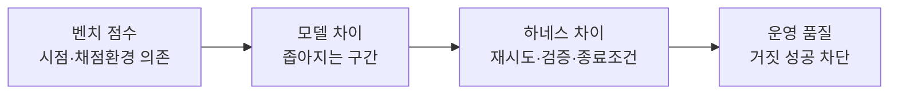
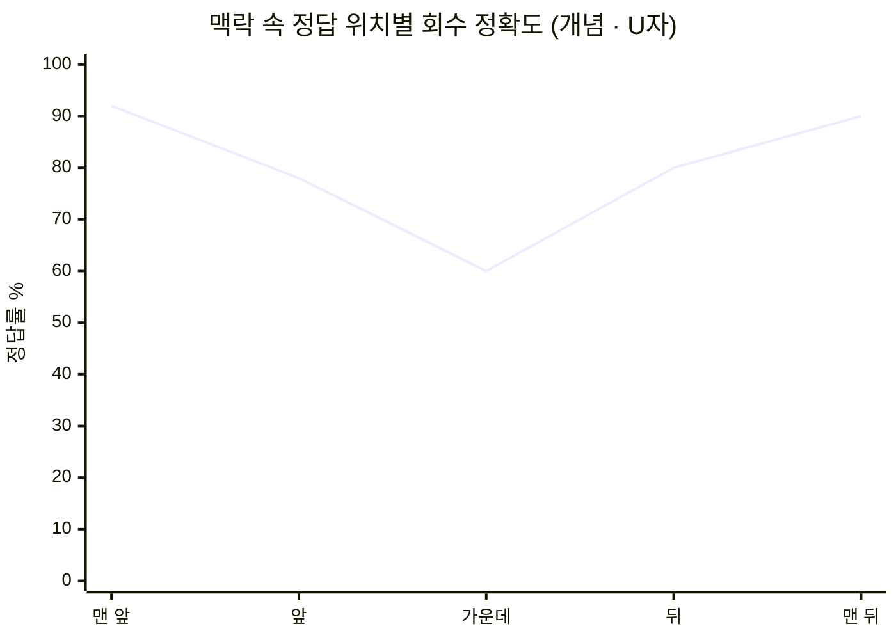
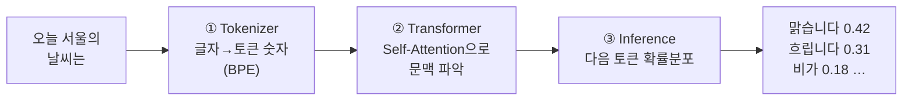
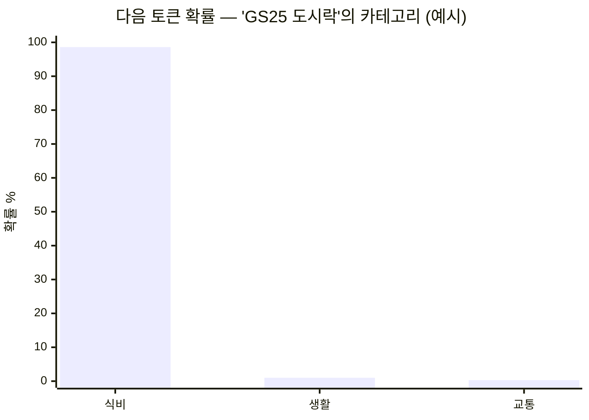
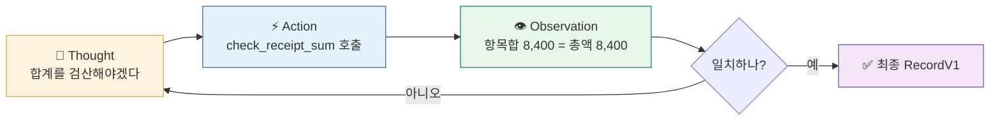
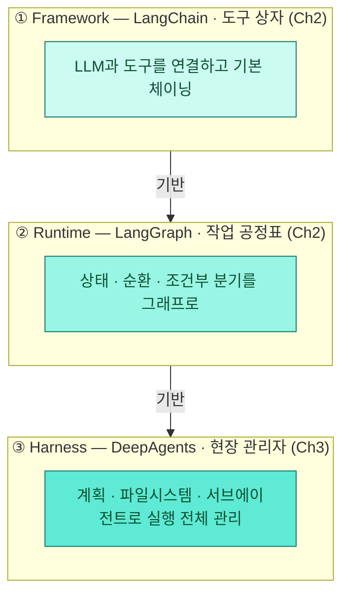

<div class="lec">
<div class="deck">

<section class="slide hero">
<div>
<div class="eyebrow">Chapter 1 · 에이전트 패러다임</div>

# 영수증을 읽고,<br>판단하게 만든다

<p class="lead">애널리스트의 첫 일은 문서를 읽어 숫자로 바꾸는 것입니다. 이 챕터에서는 영수증 이미지와 PDF 문서를 모델에 보여 주고 RecordV1 구조로 뽑아냅니다.<br>
그 과정에서 LLM이 왜 혼자서는 부족한지, 에이전트가 무엇을 더하는지를 손으로 확인합니다.</p>

<div class="kicker">
<div class="metric"><span class="num">45</span><strong>분</strong><span>이론 26 · 핸즈온 17 · 마무리 2</span><span class="clk">예상 9:20–10:05</span></div>
<div class="metric"><span class="num">4</span><strong>한계</strong><span>LLM이 에이전트를 부르는 이유</span></div>
<div class="metric"><span class="num">1</span><strong>첫 모듈</strong><span>classify_one.py</span></div>
</div>
</div>

<div class="board">
<div class="board-header"><span>이 챕터가 끝나면</span><span class="status-pill">산출물</span></div>
<div class="stack">
<div class="row"><div class="code">1</div><div class="copy"><strong>문서 → RecordV1</strong><p>이미지/PDF 한 장을 읽어 판매처·총액·항목으로 구조화</p></div><div class="store">추출</div></div>
<div class="row"><div class="code">2</div><div class="copy"><strong>단발 vs ReAct</strong><p>합계 검증 루프가 왜 필요한지 비교</p></div><div class="store">루프</div></div>
<div class="row"><div class="code">3</div><div class="copy"><strong>모델 비교표</strong><p>같은 문서를 사용 가능한 모델에 물어 핵심 필드·항목 정확도를 비교한다</p></div><div class="store">선택</div></div>
</div>
</div>
</section>

<section class="slide">
<div class="section-head">
<div>
<div class="eyebrow">오늘의 로드맵 · 2분</div>

## 8시간, 한 인박스를 끝까지

</div>
<p class="section-note">하루는 하나의 파이프라인을 단계별로 완성하는 구조입니다. <strong>오전</strong>은 "왜 LLM만으론 부족한가"를 체감하고 추출·파이프라인을 세웁니다. <strong>오후</strong>는 그 위에 지식·연결·역할 분리를 얹어 검증된 브리프까지 잇습니다. 지금 어디쯤인지 이 표로 가늠하세요.</p>
</div>

<div class="board">
<div class="board-header"><span>Ch0 → Ch6 · 약 440분 + 휴식</span><span class="status-pill">오전 · 오후</span></div>
<div class="panel-body">

| 시간대 | 챕터 | 핵심 | 계층 | 산출물 |
|---|---|---|---|---|
| 오전 | **Ch0** 환경 (20분) | uv·.env·VSCode·데이터 계약 | — | `.venv` · sample_inbox |
| 오전 | **Ch1** 패러다임 (45분) | LLM 한계 → ReAct → 추출 | LLM | `classify_one.py` |
| 오전 | **Ch2** LangGraph (70분) | 상태·분기·재시도·HITL | Framework·Runtime | `intake_graph.py` |
| 오전 | **Ch3** DeepAgents (67분) | 하네스·fan-out·컨텍스트 외주 | Harness | `research_orchestrator.py` |
| 오후 | **Ch4** Skills·MCP (80분) | 절차·연결·지식 표준화 | 지식·연결 | MCP 서버 · OKF |
| 오후 | **Ch5** A2A (70분) | 역할 분리·독립 검증 | 협업 | `verified_brief.md` |
| 오후 | **Ch6** 통합 (95분) | 모듈 배선·엔드투엔드·랩업 | 전체 | 검증된 브리프 |

</div>
</div>


<p class="section-note" style="margin-top:6px">이게 8시간의 전체 지도입니다. 인박스 입력은 디렉터리 단계를 지나 검증된 브리프로 바뀝니다. <strong>오늘(Ch1)은 노란 칸 — 이미지/PDF 문서 한 장을 RecordV1 JSON으로 읽는 첫 모듈</strong>입니다. 파일로 모아 <code>classified/</code>에 저장하는 일은 Ch2가 맡습니다.</p>

<p class="section-note" style="margin-top:14px">하루의 기준 축은 <strong>Framework(LangChain) → Runtime(LangGraph) → Harness(DeepAgents)</strong>입니다. 이 위에 Skills·MCP·A2A를 얹고, Ch6에서 하나의 파이프라인으로 합칩니다.</p>
</section>

<section class="slide">
<div class="section-head">
<div>
<div class="eyebrow">0 · 먼저 실행 · 3분</div>

## 한 장을 바로 읽어 본다

</div>
<p class="section-note">이 장의 목표는 이론을 외우는 것이 아니라, 이미지/PDF 한 장을 실제 LLM 호출로 RecordV1 JSON에 맞춰 읽게 만드는 것입니다. 아래 명령을 먼저 실행해 오늘 만들 물건의 모양을 봅니다.</p>
</div>

<div class="stack">
<div class="row"><div class="code">1</div><div class="copy"><strong>live 기본</strong><p><code>uv run python3 ch1-llm-basics/classify_one.py --doc receipt_gs25.png</code><br><span style="color:var(--muted)">성공 기준: 판매처·총액·항목·문서유형이 있는 RecordV1 JSON이 한글 키로 출력된다. 키·크레딧·모델 슬러그가 막히면 오류 종류가 표시된다.</span></p></div><div class="store">LLM API</div></div>
<div class="row"><div class="code">2</div><div class="copy"><strong>진단 보조</strong><p><code>uv run python3 ch1-llm-basics/classify_one.py --doc receipt_gs25.png --mock</code><br><span style="color:var(--muted)">mock은 주 경로가 아닙니다. live가 막혔을 때 파일 경로·스키마·검증 코드가 정상인지 분리 확인하는 고정 기준입니다.</span></p></div><div class="store">보조</div></div>
</div>

<p class="section-note" style="margin-top:12px">이제부터 나오는 모델·토큰·하네스 이야기는 방금 본 JSON을 왜 그렇게 안정적으로 만들기 위한 장치인지 설명합니다.</p>
</section>

<section class="slide">
<div class="section-head">
<div>
<div class="eyebrow">1 · 지금 · 2분</div>

## 순위를 가르는 건 모델이 아니다

</div>
<p class="section-note">SWE-bench Verified는 실제 GitHub 이슈를 주고 코드를 고쳐 테스트를 통과시키는 벤치마크입니다. 최근 주력 모델들은 좁은 구간에 몰려 있고, 최상위 프런티어도 벤치마크 포화의 영향을 받습니다.<br>
모델 단독 점수가 비슷해지면서 무게중심이 옮겨 갔습니다. 같은 모델이라도 어떤 실행 환경으로 감싸느냐가 결과를 가릅니다.</p>
</div>

<div class="grid-2">
<div class="panel"><div class="panel-head"><strong>성능은 평평해졌다</strong><span>공개 벤치 흐름</span></div><div class="panel-body"><div class="list">
<p>주력 모델 정확도가 좁은 구간에 빽빽이 몰렸습니다(아래 그림은 개념 흐름).</p>
<p>저비용 모델도 많은 실무 분류·추출 작업에서는 충분한 기준선이 됩니다 — 프런티어 주력끼리는 체감 차이가 하네스에 묻히기도 합니다.</p>
<p>기존 벤치가 포화될수록 더 어려운 변형·상위 벤치가 등장합니다. 그래서 단일 순위보다, 같은 모델을 어떤 하네스로 실행하고 검증했는지를 함께 봐야 합니다.</p>
<p>정확한 수치와 순위는 벤치 버전·채점 환경·시점마다 바뀝니다.</p>
</div></div></div>
<div class="panel"><div class="panel-head"><strong>그래서 하네스다</strong><span>이 과정의 무게중심</span></div><div class="panel-body"><div class="list">
<p>공개 사례들에서 모델을 그대로 두고도 하네스(재시도·검증·종료 조건)를 손보면 벤치 결과가 크게 달라졌습니다.</p>
<p>가장 흔한 실패는 "코드를 쓰고 자기 코드를 다시 보고 괜찮다며 멈추는" 식의 거짓 완료입니다. 그래서 <strong>종료 전 검증을 강제</strong>하는 하네스가 점수를 가릅니다.</p>
<p>오늘 ReAct 검산 루프로 확인할 패턴입니다.</p>
</div></div></div>
</div>

<p class="section-note" style="margin-top:14px"><strong>점수 자체도 의심합니다.</strong> 에이전트 벤치는 채점 환경·정답 접근·격리 설정에 민감합니다. 문제를 푸는 능력이 아니라 채점 파이프라인의 빈틈을 타면 숫자가 부풀 수 있습니다. 그래서 점수를 인용할 땐 <strong>격리 실행·정답 차단</strong>이 전제이고, 단일 숫자보다 추세(주력끼리 몰렸다)를 봅니다.</p>

<div class="board" style="margin-top:18px">
<div class="board-header"><span>주력 모델이 좁은 구간에 몰렸다 — 그래서 모델보다 하네스</span><span class="status-pill">개념도</span></div>
<div class="panel-body">



<p style="margin-top:8px">정확한 순위와 숫자는 시점·게이트웨이·평가 설정에 따라 바뀝니다. 여기서 볼 것은 특정 모델명이 아니라, 모델 단독 점수 차이가 줄수록 비교 기준이 "어떤 모델인가"에서 "<strong>어떤 하네스로 실행하는가</strong>"로 옮겨 간다는 흐름입니다.</p>
</div>
</div>

<details class="deep" style="margin-top:18px">
<summary>🔬 심화 — 20B 오픈 모델이 하네스로 강한 검색 기준선과 겨룬 사례</summary>
<div class="reveal">
<p><strong>무엇인가.</strong> UIUC·UC버클리·Chroma가 <strong>gpt-oss-20B</strong> 위에 검색 하네스를 얹은 <em>리서치 검색 서브에이전트</em>입니다.<br>
질문에 직접 답하지 않고, 근거가 될 문서를 찾아 추려 내는 일만 합니다 — 답은 뒤단의 다른 모델이 냅니다.</p>
<p><strong>어떻게 끌어올렸나.</strong> 핵심은 <strong>상태의 외부화</strong>입니다.<br>
· 20B 모델은 <em>의미 판단</em>만 합니다 — 무엇을 검색할지, 어느 문서를 남기고 버릴지, 언제 멈출지.<br>
· <em>기록 관리</em>(후보 풀·추려낸 문서셋 최대 30건·증거 그래프·검증 캐시)는 전부 하네스가 떠맡습니다.<br>
· 모델은 한 번에 한 동작(8개 도구 중 하나)만 내고, 하네스가 실행해 다음 상태를 정리해 보여 줍니다.<br>
· 이 하네스 <em>안에서</em> 강화학습으로 검색 습관을 훈련했고, 학습 데이터는 4,400여 건뿐이었습니다.</p>
<p><strong>결과.</strong> 논문은 작은 모델도 상태 외부화 하네스를 얹으면 강한 검색 에이전트 기준선과 겨룰 수 있음을 보였습니다.<br>
답을 맞히는 점수가 아니라 <em>근거를 잘 모았는지</em>를 재는 검색 지표라는 점, 모델 순위가 아니라 하네스 설계의 효과를 보는 사례라는 점만 잡습니다.</p>
<p><strong>교훈.</strong> 20B가 프런티어급 검색과 겨루는 건 모델이 더 똑똑해서가 아니라 <strong>하네스 설계 + 환경 안에서의 학습</strong> 덕입니다.<br>
기록을 모델 머릿속이 아니라 바깥에 두는 이 발상을, Ch2 체크포인터·Ch3 파일 퇴피에서 더 작은 형태로 다시 만납니다.</p>
</div>
</details>

<p class="section-note" style="margin-top:18px">코딩 에이전트에서 먼저 보인 변화는 "문서를 읽고 판단해 행동으로 옮긴다"는 지식 업무 전반으로 번지고 있습니다. 우리가 만들 인박스 애널리스트도 그 한 갈래이고, 같은 패턴을 다른 업무로 옮겨 쓸 수 있습니다.</p>
</section>

<section class="slide">
<div class="section-head">
<div>
<div class="eyebrow">1 · 한계 · 4분</div>

## LLM의 기본 출력은 다음 토큰 예측이다

</div>
<p class="section-note">LLM의 기본 출력 방식은 한 문장으로 줄어듭니다. 지금까지의 입력을 보고 다음 토큰을 예측합니다.<br>
모델은 입력 문맥에서 그럴듯한 다음 출력을 만듭니다. 그래서 최신 사실, 실제 계산, 장기 상태는 바깥 도구와 검증으로 보강해야 합니다. 여기서 네 가지 한계가 나오고, 이 넷이 에이전트의 존재 이유입니다.</p>
</div>

<div class="grid-4">
<div class="panel"><div class="panel-head"><strong>Stateless</strong><span>기억이 없다</span></div><div class="panel-body"><div class="list">
<p>매 요청마다 맥락을 다시 넣어야 합니다</p>
<p><span class="badge blue">Ch2</span> Checkpointer · <strong>메모리 모듈</strong> 활발(MemGPT·Letta·mem0)</p>
</div></div></div>
<div class="panel"><div class="panel-head"><strong>Context Window</strong><span>한 번에 담는 양 제한</span></div><div class="panel-body"><div class="list">
<p>문서를 많이 넣을수록 가운데 정보가 흐려집니다</p>
<p><span class="badge blue">Ch3·4</span> 파일시스템 퇴피·점진 로딩</p>
</div></div></div>
<div class="panel"><div class="panel-head"><strong>Hallucination</strong><span>패턴 ≠ 현실</span></div><div class="panel-body"><div class="list">
<p>그럴듯하지만 틀린 값을 자신 있게 냅니다</p>
<p><span class="badge blue">Ch2·5</span> Tool로 조회·검증</p>
</div></div></div>
<div class="panel"><div class="panel-head"><strong>Knowledge Cutoff</strong><span>학습 이후를 모름</span></div><div class="panel-body"><div class="list">
<p>이번 달 영수증은 가중치에 없습니다</p>
<p><span class="badge blue">Ch4</span> 외부 데이터 연결</p>
</div></div></div>
</div>

<div class="board" style="margin-top:18px">
<div class="board-header"><span>환각은 한 종류가 아니다</span><span class="status-pill">왜 검증이 필요한가</span></div>
<div class="panel-body">
<div class="grid-2">
<div class="panel"><div class="panel-head"><strong>두 종류로 나눈다</strong><span>Huang 외 2023</span></div><div class="panel-body"><div class="list">
<p><strong>Factuality</strong> — 세상 사실과 어긋남. Tool로 실제 값을 조회하면 크게 줄어듭니다.</p>
<p><strong>Faithfulness</strong> — Tool이 옳은 값을 줘도 모델이 무시·왜곡함. 도구만으론 안 잡혀 <em>검증·보류</em>가 따로 필요합니다.</p>
</div></div></div>
<div class="panel"><div class="panel-head"><strong>왜 안 사라지나</strong><span>구조적 현상</span></div><div class="panel-body"><div class="list">
<p>이진 채점이 "자신 있는 추측"을 보상해 습관이 남습니다(Kalai 외 2025). 모르면 0점이니 일단 찍는 쪽이 점수에 유리합니다.</p>
<p>Xu 외(2024)는 환각이 LLM의 <strong>본질적 한계</strong>임을 이론적으로 보였습니다 — 그래서 "답을 보류(abstention)"가 기본 정책이 됩니다.</p>
</div></div></div>
</div>
<p style="margin-top:10px">처방은 둘을 겹칩니다 — Tool 조회로 factuality를 줄이고, 독립 검증·보류로 faithfulness를 잡습니다. 이 챕터의 ReAct 합계 검증이 그 가장 작은 형태입니다.</p>
</div>
</div>

<div class="ask"><strong>생각해보기 (30초).</strong> LLM이 "다음 토큰 예측기"라면, "오늘 달러·원 환율 알려줘"에 정확히 답할 수 있을까요? 답하거나 못 답한다면 그 이유는 위 네 한계 중 무엇일까요?</div>

<details>
<summary>정답 확인</summary>
<div class="reveal">
<p>답할 수 없습니다. 가중치에는 학습 시점까지의 통계 패턴만 들어 있어 <strong>실시간 값(환율·주가·내 영수증)</strong>에 닿을 길이 없습니다. 이건 4번 Knowledge Cutoff이자 3번 Hallucination의 뿌리입니다.</p>
<p>그럼에도 모델은 "모릅니다" 대신 그럴듯한 숫자를 자신 있게 내놓곤 합니다. 그래서 Tool로 실제 환율 API를 붙여 주는 에이전트가 필요합니다. 우리 실습에서는 같은 원리를 영수증 합계 검증으로 체험합니다.</p>
</div>
</details>
</section>

<section class="slide">
<div class="section-head">
<div>
<div class="eyebrow">1.2 · 더 들여다보면 · 3분</div>

## 네 한계가 설계로 이어지는 방식

</div>
<p class="section-note">앞 표가 한계의 목록이라면, 여기서는 각 한계가 이 과정의 어떤 설계로 이어지는지 봅니다.</p>
</div>

<div class="stack">
<div class="row"><div class="code">S</div><div class="copy"><strong>Stateless — 호출 사이에 상태가 없다</strong><p>호출 사이에 상태가 없으니 같은 맥락을 매번 다시 보냅니다. 이 장에서는 한 가지만 잡습니다. <strong>모델은 자동으로 기억하지 않으므로</strong> 필요한 맥락을 코드가 다시 넣거나, Ch2처럼 체크포인터에 상태를 남겨야 합니다.</p>
<p>비용을 줄이는 프리픽스 캐싱, 길어진 대화를 줄이는 요약, 별도 메모리 모듈은 모두 이 한계에 대한 다른 대응입니다. 단 캐시는 기억이 아니고, 요약은 손실 압축입니다. 그래서 Ch3에서는 원본 산출물을 파일로 남깁니다.</p></div></div>
<div class="row"><div class="code">C</div><div class="copy"><strong>Context Window — 담기느냐가 아니라 고르게 쓰느냐</strong><p>요즘 롱컨텍스트엔 문서 10건쯤은 그냥 들어갑니다. 문제는 "담기느냐"가 아니라 "고르게 쓰느냐"입니다.</p>
<p>· 중간에 둔 정보일수록 모델이 덜 씁니다 — 시작·끝은 잘 보고 가운데는 흘립니다(<strong>Lost in the Middle</strong>, U자 곡선).<br>
· 관련 없어 보이는 문단이 끼면 정답도 흔들립니다(<strong>distractor</strong>).<br>
· 창이 안 차도 <em>입력이 길수록</em> 출력 품질이 측정 가능하게 떨어집니다(<strong>context rot</strong> — Chroma가 18개 프런티어 모델에서 확인). "바늘 찾기(NIAH)" 점수는 좁은 능력만 재서 이 저하를 가립니다.<br>
· 맥락이 길수록 <strong>KV 캐시</strong>가 그만큼 커져 메모리·비용이 길이에 비례해 늘어납니다.</p>
<p>그래서 다 욱여넣기보다 <strong>필요한 것만 골라 점진 로딩</strong>합니다(Ch3·4). <span class="badge blue">Liu 2307.03172</span> <span class="badge blue">Shi 2302.00093</span> <span class="badge blue">vLLM 2309.06180</span></p></div></div>
<div class="row"><div class="code">H</div><div class="copy"><strong>Hallucination — 확률과 채점이 함께 만든다</strong><p>모델은 "모르겠다"가 기본이 아니라 늘 최상위 토큰을 골라 답을 냅니다. 이진 채점 벤치마크가 <strong>"자신 있는 추측"을 보상</strong>해 그 습관이 학습 뒤에도 남습니다(Kalai). 환각이 이렇게 <strong>다음-토큰 확률·샘플링</strong>과 이어진다는 걸 바로 다음 1.5절에서 <code>logprobs</code>로 직접 봅니다. 처방은 둘 — 추출은 온도를 낮춰 흔들림을 줄이고, Tool로 실제 값을 조회·검증합니다(Ch2·5). <span class="badge blue">Kalai 2509.04664</span></p></div></div>
<div class="row"><div class="code">K</div><div class="copy"><strong>Knowledge Cutoff — 못 고치는 천장이라 도구를 쓴다</strong><p>가중치는 학습 시점에 얼어붙습니다. 그 뒤 사실(이번 달 영수증, 오늘 환율)은 파라미터에 없고, 이건 더 학습하기 전엔 못 고치는 천장입니다. 그래서 외부 저장소에서 그때그때 끌어오는 <strong>비파라미터 지식</strong>(검색·도구)이 필요합니다. RAG가 바로 이 "파라미터 vs 비파라미터" 분리를 정식화했습니다(Ch4 지식 연결). <span class="badge blue">Lewis 2005.11401</span></p></div></div>
</div>

<div class="board" style="margin-top:18px">
<div class="board-header"><span>Lost in the Middle — 정답이 어디 있느냐로 정답률이 갈린다</span><span class="status-pill">개념 곡선</span></div>
<div class="panel-body">



<p style="margin-top:8px">같은 정보라도 <strong>맥락의 가운데</strong>에 두면 모델이 덜 봅니다(U자 바닥). 그래서 길게 다 넣기보다, 필요한 조각을 <strong>앞·뒤 눈에 띄는 자리</strong>에 골라 넣는 게 낫습니다(C행 "고르게 쓰느냐"의 근거). 수치는 경향을 보이는 개념값입니다.</p>
</div>
</div>

<div class="board" style="margin-top:18px">
<div class="board-header"><span>압축하면 안 되나? — 캐시와의 실제 관계</span><span class="status-pill">바로잡기</span></div>
<div class="panel-body"><div class="list">
<p><strong>충돌은 딱 한 지점입니다.</strong> 캐시는 프리픽스가 <strong>글자 단위로 같아야</strong> 적중하는데, 요약은 그 앞부분을 고쳐 쓰니 <em>요약하는 순간 그 프리픽스의 캐시가 깨집니다</em>(다시 전체 요금 + 새 캐시 쓰기 비용). 충돌은 그 한 지점뿐 — "압축하지 마라"가 아닙니다.</p>
<p>오히려 압축은 자주 <strong>필수</strong>입니다. 컨텍스트가 창을 넘으면 압축(또는 파일 퇴피·검색)은 선택이 아니고, 길어질수록 가운데를 흘려(lost-in-the-middle) 품질로도 줄이는 게 낫습니다. 비용도 — 긴 기록은 캐시 읽기(~10%)라도 길이에 비례해 매 턴 쌓이지만, 한 번 줄이면 그 작은 프리픽스를 다시 캐시할 수 있어 <strong>턴이 쌓이면 대개 압축이 이깁니다</strong>(게다가 캐시는 TTL 5분~1시간 지나면 어차피 만료).</p>
<p>그래서 운영 규칙은 "<strong>너무 자주 요약하지 마라</strong>"입니다. 매 턴 요약하면 캐시가 본전을 뽑기 전에 계속 깨집니다. 안 바뀌는 머리(시스템 프롬프트·고정 문서)는 캐시로 얼리고, 휘발성 꼬리는 쌓일 때 <strong>한꺼번에(batch)</strong> 요약합니다. 둘은 적이 아니라 분업입니다. <span style="color:var(--muted)">(공급사마다 다릅니다 — Anthropic은 캐시 읽기가 원본의 ~10%(90%↓)지만 캐시 <em>쓰기</em>에 1.25×~2×를 더 받아 같은 프리픽스를 대략 5회 이상 재사용해야 본전. OpenAI는 1,024토큰 넘으면 <em>자동</em>으로 캐시 입력 ~50% 할인·쓰기료 없음 — Anthropic보다 얕지만 설정이 필요 없습니다.)</span></p>
</div></div>
</div>
</section>

<section class="slide">
<div class="section-head">
<div>
<div class="eyebrow">1.5 · 들여다보기 · 2분</div>

## "예측"을 눈으로 — logprobs와 temperature

</div>
<p class="section-note">"다음 토큰 예측기"가 추상이 아니라는 걸 짧게 확인합니다. <code>logprobs</code>로 모델이 토큰을 어떤 확률로 고르는지 보고, <code>temperature</code>로 그 선택이 얼마나 흔들리는지 봅니다.</p>
</div>

<div class="board">
<div class="board-header"><span>그 확률은 어디서 나오나 — 토큰이 만들어지는 3단계</span><span class="status-pill">Tokenizer → Transformer → Inference</span></div>
<div class="panel-body">



<p style="margin-top:10px">모델이 보는 건 글자가 아니라 토큰 숫자입니다(①). 그 토큰들이 서로를 참고해(②) 문맥을 만들고, 마지막에 <strong>다음 토큰의 확률분포</strong>가 나옵니다(③). 아래 <code>logprobs</code> 막대가 바로 이 ③의 분포이고, <code>temperature</code>는 그 분포에서 <em>얼마나 모험적으로</em> 하나를 고를지의 손잡이입니다. <code>classify_one</code>이 <code>temperature=0</code>인 건 이 분포에서 늘 최상위만 골라 재현성을 얻으려는 것입니다.</p>
<p class="tiny" style="margin-top:6px;color:var(--muted)">엄밀히는 ③의 확률분포도 ②Transformer 마지막 층(LM head)이 만들어 냅니다 — ①~③은 '글자→숫자→문맥→다음 토큰'의 흐름을 끊어 본 단계 구분입니다.</p>
</div>
</div>

<div class="grid-2">
<div class="panel"><div class="panel-head"><strong>logprobs — 확신의 정체</strong><span>토큰 확률 분포</span></div><div class="panel-body"><div class="list">
<p>분류처럼 답이 또렷하면 한 토큰에 확률이 몰립니다(예: '식비' 98.6%).</p>
<p>애매하면 후보로 퍼집니다. 그래도 모델은 늘 최상위를 골라 답합니다 — "모르겠다"가 기본이 아닙니다. 이게 Kalai의 "자신 있는 추측".</p>
</div></div></div>
<div class="panel"><div class="panel-head"><strong>temperature — 왜 0인가</strong><span>추출의 재현성</span></div><div class="panel-body"><div class="list">
<p>온도가 0이면 늘 최상위 토큰, 높을수록 아래 후보도 뽑힙니다.</p>
<p>같은 영수증 → 같은 RecordV1이어야 하니 <code>classify_one</code>은 <code>temperature=0</code>. 창의가 필요한 글쓰기에서만 온도를 올립니다.</p>
<p>디코딩 손잡이는 둘입니다 — 다른 하나가 <code>top_p</code>(누적확률 상위 토큰만 후보로 남기는 nucleus 샘플링). 보통 <code>temperature</code>나 <code>top_p</code> 중 하나만 조절하며, 결정적 추출은 <code>temperature=0</code>으로 충분합니다. <span style="color:var(--muted)">(오픈·로컬 모델에선 <code>min-p</code>(0.05~0.1)가 top_p의 '고온에서 분포가 평평해지면 헛토큰이 새는' 결함을 보완하는 세 번째 손잡이로 쓰입니다(ICLR 2025). API·<code>temperature=0</code>인 이 과정엔 무관.)</span></p>
</div></div></div>
</div>

<div class="board" style="margin-top:18px">
<div class="board-header"><span>토큰 확률 분포 — "GS25 도시락"은 무슨 비용?</span><span class="status-pill">logprobs</span></div>
<div class="panel-body">



<p style="margin-top:12px">분류처럼 답이 또렷하면 한 토큰에 확률이 거의 몰립니다(확신). 반대로 "오늘 서울 날씨는"처럼 이어질 말이 여럿이면 여러 후보로 넓게 퍼집니다(불확실). 모델은 보통 가장 그럴듯한 후보를 골라 답합니다. "모르겠다"가 기본 정책은 아닙니다. 노트북 실험1을 돌리면 이 막대가 실제 숫자로 찍힙니다.</p>
</div>
</div>

<div class="board" style="margin-top:18px">
<div class="board-header"><span>주의 — 추론형 모델은 온도 손잡이가 없다</span><span class="status-pill">2026 함정</span></div>
<div class="panel-body"><div class="list">
<p>추론형 모델은 내부 추론 단계가 길어 사용자가 <code>temperature</code>로 무작위성을 조절하는 의미가 작아졌습니다. 특히 <strong>o 시리즈</strong>(o1·o3 등)는 OpenAI 직결 시 1이 아닌 값을 주면 <strong>400 에러</strong>로 거부합니다. <code>logprobs</code>도 추론형에선 대개 노출되지 않습니다(온도와는 별개 제약). 그래서 토큰 확률을 직접 보는 1.5절 실험은 비추론 모델 <code>gpt-4o-mini</code>로 합니다.</p>
<p>게다가 게이트웨이가 한 겹 더 가립니다. <strong>OpenRouter는 모델이 지원하지 않는 파라미터를 조용히 떨어뜨립니다</strong> — 추론형 모델에 <code>temperature=0</code>을 줘도 에러 없이 무시될 수 있어 "0으로 고정했다"고 착각하기 쉽습니다. 반대로 비추론 모델(이 과정 기본 <code>gemini-3.5-flash</code>)에선 <code>temperature=0</code>이 정상 적용되니, 결정적 추출은 그쪽을 씁니다.</p>
</div></div>
</div>

<div class="board" style="margin-top:18px">
<div class="board-header"><span>temperature=0도 완전 결정론은 아니다</span><span class="status-pill">현실</span></div>
<div class="panel-body"><div class="list">
<p>추출에서는 흔들림을 줄이려고 <code>temperature=0</code>을 씁니다. 그래도 같은 입력이 드물게 다르게 나올 수 있습니다. 서버가 요청을 묶어 처리하는 방식, 수치 계산 순서, MoE 라우팅이 조금씩 달라지면 최종 logit도 달라질 수 있기 때문입니다. 2025년 Thinking Machines는 이 흔들림의 큰 원인을 배치 변동으로 보고, batch-invariant 커널로 결정론을 복원하는 방법을 보였습니다.</p>
<p>그래서 "0 = 비트 단위 재현"은 아닙니다(OpenAI Cookbook·Anthropic Glossary도 명시). 추출은 <code>temperature=0</code>으로 흔들림을 <em>최소화</em>하되, 마지막 신뢰는 스키마 검증(<code>model_validate</code>)에 둡니다.</p>
</div></div>
</div>

<div class="board" style="margin-top:18px">
<div class="board-header"><span>직접 관찰</span><span class="status-pill">노트북</span></div>
<div class="panel-body"><div class="list">
<p>VSCode에서 <code>ch1-llm-basics/llm_internals.ipynb</code>를 열고 커널을 <code>.venv</code>로 맞춘 뒤 셀을 차례로 실행합니다. 실험1(logprobs)·실험2(temperature) 두 개입니다.</p>
<p>logprobs는 OpenAI 계열에서만 노출돼 <code>openai/gpt-4o-mini</code>로 관찰합니다. 확신해도 정답 보장이 아니라는 점, 추출은 0으로 고정한다는 점이 손에 잡힙니다.</p>
</div></div>
</div>

<div class="cue do">
<div class="cue-head"><span class="cue-label">✋ 직접 해보기</span><span class="cue-time">노트북 · 5분</span></div>
<div class="cue-body"><code>llm_internals.ipynb</code>를 열고 커널을 <code>.venv</code>로 맞춘 뒤 <strong>실험1</strong> 셀을 실행하세요. <code>openai/gpt-4o-mini</code>로 요청이 한 번 나갑니다. <strong>이 노트북은 키가 필요합니다</strong>(<code>--mock</code> 경로가 없어 첫 셀에서 <code>OPENROUTER_API_KEY</code>를 읽습니다). 키가 없으면 아래 고정 관찰 예시를 보고 핵심만 확인합니다.</div>
</div>

<div class="cue wait">
<div class="cue-head"><span class="cue-label">⏳ 기다렸다 확인</span><span class="cue-time">~15초</span></div>
<div class="cue-body">응답이 오면 확률 막대가 그려집니다. <strong>'식비' 토큰에 확률이 크게 몰려 있는지</strong> 눈으로 확인하고 넘어가세요(상위 토큰 하나가 대부분을 차지). 확신이 높아도 정답 보장은 아니라는 게 이 실험의 핵심입니다.</div>
</div>

<details>
<summary>키가 없을 때 보는 고정 관찰 예시</summary>
<div class="reveal">
<p>분류 프롬프트가 "GS25 도시락은 무슨 비용인가?"처럼 답이 또렷하면 상위 후보가 한쪽으로 몰립니다.</p>

```text
식비   ████████████████████  98.6%
생활   ▎                     1.0%
교통   ▏                     0.3%
```

<p>여기서 배울 것은 숫자 자체가 아니라 모양입니다. 모델은 확률분포에서 하나를 고르고, 분류처럼 쉬운 문제는 최상위 후보가 압도적입니다. 그래도 실제 업무에서는 영수증 합계·스키마·대사 규칙으로 한 번 더 검증합니다.</p>
</div>
</details>
</section>

<section class="slide">
<div class="section-head">
<div>
<div class="eyebrow">2 · 루프 · 4분</div>

## 에이전트는 한 번에 답하지 않는다

</div>
<p class="section-note">2022년 ReAct(Yao 외)가 제시한 구조가 지금 에이전트 루프의 기초입니다. 핵심은 <strong>모델이</strong> 추론하고, 도구 호출 여부를 정하고, 결과를 보고 다음을 판단한다는 점입니다.<br>
영수증으로 옮기면 이렇습니다. 모델이 항목을 뽑은 뒤 검산 도구를 호출해 확인하고, 어긋나면 다시 읽도록 루프가 이어집니다. 프롬프트는 검산을 강하게 유도하고, live 실행에서 도구 호출 제안은 모델이 냅니다. 다만 하니스는 최종 JSON이 영수증이면 <strong>검산이 실제로 수행됐고 합계가 맞는지</strong>를 런타임에서 다시 강제합니다. <code>--mock</code>은 이 루프의 모양을 고정 규칙으로 재현하는 보조 경로입니다.</p>
</div>



<div class="board" style="margin-top:18px">
<div class="board-header"><span>도구는 모델이 직접 실행하지 않는다</span><span class="status-pill">Tool Use의 실제</span></div>
<div class="panel-body"><div class="list">
<p>모델은 함수를 실행하는 대신 "이 함수를 이 인자로 부르라"는 구조화된 호출(<code>tool_calls</code>)을 냅니다. 런타임이 그걸 읽어 실제 함수를 돌리고 결과를 <code>ToolMessage</code>로 되돌려 줍니다.</p>
<p>그래서 Action은 모델이 낸 <code>tool_calls</code>, Observation은 런타임이 돌려준 <code>ToolMessage</code>입니다. 무엇을·언제 부를지는 모델이 제안합니다. 단 영수증 검산처럼 깨지면 안 되는 불변식은 런타임이 최종 JSON에서 한 번 더 확인합니다 — ReAct는 모델 제안과 하니스 검증이 같이 있어야 안전합니다.</p>
</div></div>
</div>

<div class="board" style="margin-top:18px">
<div class="board-header"><span>에이전트의 네 구성요소</span><span class="status-pill">구성요소</span></div>
<div class="panel-body">
<div class="grid-4">
<div class="panel"><div class="panel-head"><strong>Model</strong><span>두뇌</span></div><div class="panel-body"><div class="list"><p>추론·도구 선택. 없으면 판단이 없습니다.</p></div></div></div>
<div class="panel"><div class="panel-head"><strong>Instructions</strong><span>가드레일</span></div><div class="panel-body"><div class="list"><p>역할·절차·형식. 없으면 제멋대로 — <span class="badge blue">Ch4</span> SKILL.md.</p></div></div></div>
<div class="panel"><div class="panel-head"><strong>Tools</strong><span>손발</span></div><div class="panel-body"><div class="list"><p>외부 조회·실행. 없으면 환각만 — <span class="badge blue">Ch4·5</span> MCP·A2A.</p></div></div></div>
<div class="panel"><div class="panel-head"><strong>Memory</strong><span>기억</span></div><div class="panel-body"><div class="list"><p>단기(맥락)+장기(저장). 없으면 매번 백지 — <span class="badge blue">Ch2</span> checkpointer.</p></div></div></div>
</div>
<p style="margin-top:8px">OpenAI(Model+Instructions+Tools)·Google·Lilian Weng(LLM+Planning+Memory+Tool) 모두 같은 골격을 다르게 부릅니다. 오늘 하루가 이 네 구성요소를 하나씩 붙이는 과정입니다.</p>
</div>
</div>
</section>

<section class="slide">
<div class="section-head">
<div>
<div class="eyebrow">3 · 절제 · 2분</div>

## 에이전트는 마지막 수단

</div>
<p class="section-note">Anthropic은 가장 단순하고 신뢰할 수 있는 구현을 먼저 쓰라고 강조합니다. 실행 순서가 코드로 정해지는 워크플로와, 모델이 자율로 지휘하는 에이전트를 구분합니다.<br>
에이전트는 매 호출마다 시스템 프롬프트와 기록을 다시 보내므로 같은 일을 워크플로로 할 때보다 토큰이 몇 배 듭니다. 충분한 문제에 굳이 에이전트를 쓰지 않습니다.</p>
</div>

<div class="grid-2">
<div class="panel"><div class="panel-head"><strong>워크플로 — 실행 순서를 코드로 고정</strong><span>예측 가능·저비용</span></div><div class="panel-body"><div class="list">
<p>단일 호출 — "이 문서 한 장을 구조화"</p>
<p>체이닝 — "분류 → 정규화 → 적재" 순서 고정</p>
<p>라우팅 — 문서 유형에 따라 다른 처리</p>
<p>병렬화 — 여러 문서를 동시에 처리해 합산</p>
<p>오케스트레이터–워커 — 주제를 나눠 워커가 처리(<span class="badge amber">Ch3</span> fan-out)</p>
</div></div></div>
<div class="panel"><div class="panel-head"><strong>에이전트 — 모델이 자율 지휘</strong><span>유연·고비용</span></div><div class="panel-body"><div class="list">
<p>분해 — "이 인박스를 분석해 브리프로 정리"</p>
<p>사전에 정해지지 않은 판단과 도구 선택이 필요할 때</p>
<p><span class="badge amber">Ch3</span> fan-out 조사에서 실측해 봅니다</p>
</div></div></div>
</div>

<p class="section-note" style="margin-top:18px">이 과정의 파이프라인은 대부분 워크플로입니다. 분류·정규화는 순서가 정해져 있습니다. 에이전트가 필요한 곳은 "여러 문서를 나눠 조사하고 교차 검산"하는 Ch3 한 구간입니다. 도구를 고를 때 이 구분이 첫 질문이 됩니다.</p>

<div class="cue solve">
<div class="cue-head"><span class="cue-label">✏️ 풀어보기</span><span class="cue-time">~2분</span></div>
<div class="cue-body">다음 셋은 워크플로(단일 호출·체이닝·라우팅)일까요, 에이전트일까요?<br>
① 문서 한 장을 RecordV1로 구조화 &nbsp;② 문서가 영수증인지 명세서인지에 따라 다른 처리로 분기 &nbsp;③ "이 인박스를 조사해 브리프로 정리"</div>
</div>

<details>
<summary>정답 확인</summary>
<div class="reveal">
<p>① <strong>단일 호출</strong> — 입력 하나 → 출력 하나. 반복도 도구도 필요 없습니다(Ch1 classify_one의 단발 모드).</p>
<p>② <strong>라우팅</strong> — 입력 종류에 따라 길이 갈릴 뿐, 각 길은 미리 정해져 있습니다.</p>
<p>③ <strong>에이전트</strong> — 몇 갈래로 볼지, 무슨 도구를 쓸지 사전에 못 박을 수 없습니다. 모델이 계획하고 반복합니다(Ch3 fan-out).</p>
<p>실무에서는 대부분 ①②로 충분합니다. ③이 정말 필요할 때만 비용을 감수하고 에이전트를 씁니다.</p>
</div>
</details>
</section>

<section class="slide">
<div class="section-head">
<div>
<div class="eyebrow">4 · 모델 · 2분</div>

## 제일 똑똑한 모델이 정답은 아니다

</div>
<p class="section-note">에이전트의 두뇌는 모델입니다. 다만 가장 비싼 모델을 항상 쓰는 건 속도와 비용에서 손해입니다.<br>
역량과 단가로 세 자리를 잡아 두고 작업에 맞춰 올리고 내립니다. 분류·라우팅은 싼 모델로, 본 작업은 균형 모델로, 막히는 난제만 최상위로 올립니다.</p>
</div>

<div class="panel">
<div class="panel-head"><strong>모델 자리표</strong><span>수업 당일 호출 가능한 슬러그로 확정</span></div>
<div class="panel-body">

| 자리 | 정하는 방식 | 강점 | 쓰는 곳 |
|---|---|---|---|
| 기본 실습 | <code>classify_one.py</code>의 <code>DEFAULT_MODEL</code> | 빠른 반복·저비용 | Ch1·Ch2 |
| 비교 모델 | <code>ANALYST_COMPARE_MODELS</code>에 넣은 슬러그 | 같은 입력의 품질·비용 비교 | 비교표 |
| 고난도/심화 | 수업 당일 계정에서 통과한 상위 모델 | 막힌 문서 재시도·토론 | 선택 실습 |
| 라우터/서브태스크 | Ch3 이후 각 모듈의 설정값 | 대량 분류·요약·대사 | Ch3·Ch6 |

</div>
</div>

<p class="section-note" style="margin-top:8px">모델 ID와 단가는 수업 당일 OpenRouter 모델 페이지와 계정 라우팅이 최종 기준입니다. 실제 수업 전에는 <code>bash scripts/preflight.sh</code>로 기본 모델 호출을 확인합니다. 비교 모델은 코드에 못 박지 않고 <code>ANALYST_COMPARE_MODELS</code> 환경변수로 그날 계정에서 되는 슬러그를 넣습니다. 사용할 수 없는 모델은 비교표에서 <code>skip</code>으로 넘어갑니다.</p>

<div class="board" style="margin-top:18px">
<div class="board-header"><span>기본값은 빠른 저비용 모델</span><span class="status-pill">실무 휴리스틱</span></div>
<div class="panel-body"><div class="list">
<p>저렴하고 빨라 8시간 내내 반복 실습에 맞는 모델을 기본으로 둡니다. 비교가 필요한 대목에서만 그날 호출 가능한 상위 모델로 올립니다.</p>
<p>점수 5%를 더 얻으려고 비용을 3배 쓰는 건 대개 손해입니다. 그래서 한 모델로 통일하지 않고 자리를 섞습니다. 이 챕터 끝의 비교표가 그 감각을 데이터로 줍니다.</p>
</div></div>
</div>
</section>

<section class="slide">
<div class="section-head">
<div>
<div class="eyebrow">5 · 3계층 · 2분</div>

## Framework → Runtime → Harness

</div>
<p class="section-note">ReAct 루프만으로는 프로덕션 요구를 감당하기 어렵습니다. 컨텍스트가 차고, 장기 실행이 어렵고, 실패 후 재시작 지점이 모호합니다.<br>
그래서 세 계층을 나눠 봅니다. 오늘은 Framework, Runtime, Harness를 차례로 다룹니다.</p>
</div>



<p class="section-note" style="margin-top:8px">아래(①)가 위(③)의 기반입니다. LLM·도구 연결(Framework) 위에 상태·분기(Runtime), 그 위에 계획·파일·서브에이전트(Harness)를 둡니다.</p>

<p class="section-note" style="margin-top:18px">이 3계층은 LangChain 생태계에서 자주 쓰는 설명 틀이고 업계 단일 표준은 아닙니다. 다른 프레임워크는 경계를 다르게 둡니다. 이 과정이 이 스택을 고른 이유는 세 역할이 또렷이 나뉘어 따로 배우기 좋기 때문입니다.</p>

<details class="deep">
<summary>🔬 심화 — "하네스가 차이를 만든다"는 무슨 뜻인가: 8영역과 없을 때의 사고 <span style="color:var(--muted)">(이 챕터의 핵심 명제)</span></summary>
<div class="reveal">
<p>하네스(Harness)는 LLM을 감싸 <strong>일이 되게 만드는 통제층(control plane)</strong>이다. 모델은 한 번에 "다음 한 수"만 정하고, 그 한 수가 실제로 굴러가게 하는 여덟 가지를 하네스가 떠맡는다. 이 과정은 그 여덟을 챕터별로 하나씩 짓는다:</p>
<table>
<thead><tr><th>영역</th><th>하네스가 하는 일</th><th>이 과정에서</th></tr></thead>
<tbody>
<tr><td>컨텍스트 관리</td><td>유한한 창을 파일로 외부화·압축·선택</td><td>Ch3</td></tr>
<tr><td>에러 복구</td><td>도구 실패·틀린 출력을 재시도·검산·fail-closed</td><td>Ch2</td></tr>
<tr><td>상태 지속</td><td>죽어도 이어가게 체크포인터·파일에 저장</td><td>Ch2·Ch3</td></tr>
<tr><td>계획 강제</td><td>즉흥 대신 <code>write_todos</code>로 계획을 먼저</td><td>Ch3</td></tr>
<tr><td>Skills(절차)</td><td>매번 처음부터 대신 절차를 점진 공개로 주입</td><td>Ch4</td></tr>
<tr><td>Subagent 위임</td><td>한 창에 다 못 담을 일을 격리 워커로 fan-out</td><td>Ch3</td></tr>
<tr><td>보안</td><td>외부 데이터·도구에 권한 스코프·HITL·샌드박스</td><td>Ch4·Ch5</td></tr>
<tr><td>비용 제어</td><td>호출당 토큰을 캐싱·압축·갈래 수로 억제</td><td>Ch3·Ch6</td></tr>
</tbody>
</table>
<p><strong>하네스 없이 모델만 루프 돌리면</strong> 여섯 가지가 차례로 깨진다 — ① <strong>컨텍스트 소진</strong>(대화가 한도를 넘어 멈춤) · ② <strong>doom loop</strong>(같은 실패를 무한 반복) · ③ <strong>상태 소실</strong>(중간에 죽으면 처음부터) · ④ <strong>장기 실행 불가</strong>(몇 시간짜리 작업을 못 버팀) · ⑤ <strong>보안 취약</strong>(인젝션·과권한 호출) · ⑥ <strong>관찰 불가</strong>(무엇을 왜 했는지 추적 안 됨). 앞의 SWE-bench·Terminal-Bench 사례에서 "모델 고정, 하네스만 손봐 점수 상승"이 가능했던 건 바로 위 표의 여덟 통제 영역을 더 잘 짰기 때문이다 — 이 여섯 가지 깨짐을 그 여덟 영역이 막는다.</p>
<p class="muted"><strong>핵심 정리</strong> — "모델은 다음 한 동작만 정하고, 하네스가 나머지를 떠맡는다. 이 여덟이 없으면 데모는 되지만 운영은 안 된다." 이 표가 곧 <em>오늘 하루의 지도</em>입니다. 각 칸을 한 챕터씩 짓습니다.</p>
</div>
</details>
</section>

<section class="slide">
<div class="section-head">
<div>
<div class="eyebrow">핸즈온 ① · 코드 정독 · 4분</div>

## 멀티모달 호출을 뜯어본다

</div>
<p class="section-note">영수증 이미지나 PDF 한 장을 모델에 보여 주고 RecordV1로 받습니다. 먼저 호출의 모양을 한 줄씩 읽습니다. 텍스트 프롬프트와 문서 파일을 <strong>한 메시지에 함께</strong> 실어 보내는 게 핵심입니다.</p>
</div>

<div class="board">
<div class="board-header"><span>먼저 — 만들 물건과 처음 보는 말</span><span class="status-pill">RecordV1 · 용어</span></div>
<div class="panel-body">
<p class="section-note" style="margin-top:0">이 코드가 뽑아내는 <strong>RecordV1</strong>은 이렇게 생긴 한 덩어리입니다(저장 출력은 사람이 읽기 좋게 한글 키 — 코드·LLM 계약은 영문이고, 저장할 때만 한글로 변형합니다. Ch0 데이터 계약). 지금은 한 줄씩 이해할 필요 없이 <em>판매처·총액·항목·문서유형 칸이 정해져 있다</em>는 것만 보세요(아래는 <code>--mock</code> 결정론 출력 — live로 같은 영수증을 돌리면 신뢰도나 표현이 조금 다를 수 있지만 칸은 같습니다):</p>

```json
{
  "판매처": "GS25 역삼점", "총액": 8400.0, "통화": "KRW",
  "날짜": "2026-05-13", "문서유형": "영수증",
  "항목": [{"이름": "도시락(제육)", "단가": 4900.0, "수량": 1.0},
          {"이름": "삼각김밥", "단가": 1200.0, "수량": 1.0},
          {"이름": "컵라면", "단가": 1500.0, "수량": 1.0},
          {"이름": "생수 500ml", "단가": 800.0, "수량": 1.0}],
  "신뢰도": 1.0, "원본경로": "sample_inbox/receipt_gs25.png"
}
```

<p class="section-note" style="margin-top:10px">코드에 처음 나오는 말은 행동으로 묶어 보면 쉽습니다. 이미지는 <code>image_url</code>, PDF는 <code>file_data</code>로 보내고, 출력 칸은 RecordV1 형식(<code>schema_json()</code>)으로 미리 알려 줍니다. 모델이 답에 붙인 <code>```json</code> 울타리는 코드의 <code>_strip_fences</code>로 벗기고, 마지막에는 <code>model_validate_json</code>으로 계약에 맞는지 확인합니다. PDF 입력은 모델·게이트웨이 지원을 타므로, 같은 키로 이미지가 통과하는데 PDF만 실패하면 모델 슬러그를 바꾸거나 Ch2의 PDF 한 건 명령으로 범위를 좁힙니다.</p>
</div>
</div>

<<< ../../ch1-llm-basics/classify_one.py#singleshot{python}

<div class="grid-2">
<div class="panel"><div class="panel-head"><strong>왜 이렇게 쓰나</strong><span>설계 결정</span></div><div class="panel-body"><div class="list">
<p><strong><code>temperature=0</code></strong> — 같은 영수증은 늘 같은 값으로 읽혀야 합니다. 재현성이 추출의 기본 요구입니다.</p>
<p><strong>스키마를 프롬프트에</strong>(<code>schema_json()</code>) — 모델이 RecordV1 <strong>영문 키</strong>(merchant·total…) 스키마에 맞춰 JSON을 내도록 형식을 못 박습니다. 한글은 추출이 아니라 저장할 때 입힙니다(<code>by_alias=True</code>).</p>
<p><strong><code>model_validate_json</code></strong> — 모델 출력을 믿지 않고 계약으로 검증합니다. 필드가 빠지거나 타입이 틀리면 여기서 걸립니다.</p>
</div></div></div>
<div class="panel"><div class="panel-head"><strong>두 가지 함정</strong><span>자주 막히는 곳</span></div><div class="panel-body"><div class="list">
<p>문서는 확장자에 맞는 <code>data:&lt;mime&gt;;base64,...</code> 형태의 data URL로 넣습니다. 경로 문자열이 아닙니다.</p>
<p>모델이 <code>```json … ```</code> 울타리를 붙여 답할 때가 있어 <code>_strip_fences</code>로 벗긴 뒤 파싱합니다.</p>
</div></div></div>
</div>

<p class="section-note" style="margin-top:14px">사실 요즘은 더 단단한 길이 있습니다 — 제공자 <strong>네이티브 structured outputs</strong>(OpenAI 2024·Anthropic 2025-11 베타)는 JSON 스키마를 문법으로 컴파일해 <em>스키마를 어기는 토큰 자체를 못 내게</em> 합니다. 그러면 울타리·설명문 혼입이 구조적으로 사라집니다. 다만 모델·게이트웨이마다 지원이 갈려서, 이 과정은 어디서나 도는 <strong>프롬프트+사후검증</strong> 경로를 씁니다 — <code>_strip_fences</code>는 그 호환을 위한 안전망입니다.</p>
</section>

<section class="slide">
<div class="section-head">
<div>
<div class="eyebrow">핸즈온 ② · 코드 정독 · 4분</div>

## 합계를 검증한다 — ReAct

</div>
<p class="section-note">ReAct에서는 모델이 "검산 도구를 부르겠다"는 호출을 내고(Action), 런타임이 실제 함수를 실행해 결과를 돌려줍니다(Observation). 그 결과를 보고 모델이 다음 행동을 정합니다. 우리는 모델에 <code>check_receipt_sum</code> 도구를 제공하고 루프를 돌립니다.</p>
</div>

<div class="panel">
<div class="panel-head"><strong>classify_one.py — check_receipt_sum</strong><span>모델이 호출할 수 있는 검산 도구</span></div>
<div class="panel-body">

<<< ../../ch1-llm-basics/classify_one.py#react-tool{python}

</div>
</div>

<div class="panel" style="margin-top:16px">
<div class="panel-head"><strong>classify_one.py — extract_react 루프</strong><span>Thought → Action → Observation → Final</span></div>
<div class="panel-body">

<<< ../../ch1-llm-basics/classify_one.py#react-loop{python}

</div>
</div>

<div class="grid-3" style="margin-top:16px">
<div class="panel"><div class="panel-head"><strong>무엇이 ReAct인가</strong></div><div class="panel-body"><div class="list">
<p>도구 선택을 <strong>모델이</strong> 합니다. <code>tool_calls</code>가 Action, <code>ToolMessage</code>가 Observation입니다.</p>
<p class="tiny" style="color:var(--muted)">단, 원논문은 Thought를 <em>평문</em>으로 끼워 넣었지만, 요즘 함수호출 API는 추론을 <code>tool_calls</code> 결정 안으로 옮겨 — 대개 <code>content</code>가 빈 채 도구만 부릅니다. 그래서 <code>[Thought]</code> 줄은 모델이 텍스트와 도구를 <em>같은 턴에</em> 낼 때만 보이고, 안 보여도 정상입니다.</p>
</div></div></div>
<div class="panel"><div class="panel-head"><strong>단발과 무엇이 다른가</strong></div><div class="panel-body"><div class="list">
<p>단발은 한 번 생성하고 끝납니다. ReAct는 검산이 불일치하면 다시 읽고 고치는 루프를 탑니다.</p>
<p class="tiny" style="color:var(--muted)">이 검산은 교육용 영수증처럼 할인·쿠폰·음수 조정이 없는 문서에 맞춘 단순 합계입니다. 실제 영수증은 할인·서비스료·반올림 때문에 맞게 읽어도 불일치가 날 수 있어, Ch2처럼 재시도와 보류 큐를 함께 둡니다.</p>
</div></div></div>
<div class="panel"><div class="panel-head"><strong>왜 max_steps</strong></div><div class="panel-body"><div class="list">
<p>모델이 도구를 무한 반복하지 않도록 상한을 둡니다. 한계 설정이 하네스의 일입니다.</p>
</div></div></div>
</div>
</section>

<section class="slide">
<div class="section-head">
<div>
<div class="eyebrow">핸즈온 ③ · 단계별 실행 · 9분</div>

## 돌리고, 관찰하고, 바꿔 본다

</div>
<p class="section-note">기본은 키를 넣고 실제 추출을 보는 것입니다. <code>--mock</code>은 키·네트워크 문제가 있을 때 구조를 먼저 확인하거나, live 결과와 비교할 결정론 기준이 필요할 때만 씁니다. 각 단계마다 무엇이 보이면 성공인지 적었습니다.</p>
</div>

<div class="stack">
<div class="row"><div class="code">1</div><div class="copy"><strong>live 추출 — 단발 호출</strong><p><code>uv run python3 ch1-llm-basics/classify_one.py --doc receipt_gs25.png</code> <span style="color:var(--muted)">(장애·오프라인 확인: 끝에 <code>--mock</code>)</span><br><span style="color:var(--muted)">성공 기준: 위 RecordV1 예시처럼 판매처·총액·항목이 든 JSON이 한글 키로 출력된다(최상위 키는 <code>총액</code>, 항목 안은 품목 <code>단가</code>). 실제 모델이 영수증을 읽으므로 값·신뢰도는 조금 다를 수 있고, <em>칸 구조</em>는 같습니다. <code>--mock</code>은 고정 출력으로 코드 경로를 확인하는 보조입니다.</span></p></div><div class="store">live</div></div>
<div class="row"><div class="code">2</div><div class="copy"><strong>live 추출 — PDF 한 건</strong><p><code>uv run python3 ch1-llm-basics/classify_one.py --doc statement_card_2026-05.pdf</code> <span style="color:var(--muted)">(PDF 라우팅 진단)</span><br><span style="color:var(--muted)">성공 기준: PDF 명세서도 같은 RecordV1 칸으로 출력된다. 이미지가 되는데 PDF만 실패하면 모델·게이트웨이의 PDF 지원 문제로 좁혀 보고, Ch2에서도 같은 문서를 한 건만 다시 돌려 본다.</span></p></div><div class="store">PDF</div></div>
<div class="row"><div class="code">3</div><div class="copy"><strong>ReAct 추출 — 도구로 검산</strong><p><code>uv run python3 ch1-llm-basics/classify_one.py --doc receipt_gs25.png --react</code> <span style="color:var(--muted)">(장애·오프라인 확인: 끝에 <code>--mock</code>)</span><br><span style="color:var(--muted)"><strong>증명:</strong> 한 번에 답하지 않고 <em>도구로 검산</em>한다. live면 모델이 직접 도구 호출 여부와 횟수를 정하므로 표현·검산 횟수가 달라질 수 있습니다. <code>--mock</code>이면 gold로 검산 한 번을 고정 재현해, live 실패가 모델/키 문제인지 코드 문제인지 가르는 데 씁니다.</span></p></div><div class="store">루프</div></div>
<div class="row"><div class="code">4</div><div class="copy"><strong>모델 비교</strong><p><code>uv run python3 ch1-llm-basics/classify_one.py --doc receipt_gs25.png --compare</code><br><span style="color:var(--muted)">성공 기준: 기본 모델의 정확도가 표로 나온다. 여러 모델을 비교하려면 실행 전 <code>ANALYST_COMPARE_MODELS="google/gemini-3.5-flash,..."</code>처럼 그날 계정에서 되는 슬러그를 쉼표로 넣는다. 이 단계는 실호출이라 키가 필요하고, 실패 원인은 <code>auth/key</code>·<code>credit</code>·<code>model-slug</code>·<code>json/schema</code>로 표시된다.</span></p></div><div class="store">키 필요</div></div>
</div>

<div class="cue solve" style="margin-top:18px">
<div class="cue-head"><span class="cue-label">✏️ 풀어보기</span><span class="cue-time">~6분</span></div>
<div class="cue-body"><p>① <code>--doc invoice_photo.png --react</code>로 명세서(고액 청구서)를 뽑아 보세요(검산 도구는 <code>--react</code> 경로에만 있습니다). 모델이 검산 도구 <code>check_receipt_sum</code>을 부를까요, 건너뛸까요? <span style="color:var(--muted)">(키가 있을 때 질문입니다. <code>--mock</code>으로는 "영수증이면 검산, 아니면 건너뜀"이라는 <em>고정 규칙</em>대로 명세서는 <code>[Action]</code> 없이 <code>[Final]</code>만 찍힙니다 — live에서 비로소 "모델이 정한다"가 드러납니다.)</span></p><p>② 코드를 고치지 말고, 아래 <code>관찰 포인트</code>의 식 <code>abs(항목합 − 총액) &lt; tol</code>을 기준으로 생각해 보세요. <code>tol=0.0</code>이면 완전히 일치하는 영수증도 통과할까요?</p></div>
</div>

<details>
<summary>관찰 포인트</summary>
<div class="reveal">
<p>① 정답은 <strong>"도구 호출 제안은 모델이 정하고, 영수증 안전 조건은 런타임이 강제한다"</strong>입니다. 시스템 프롬프트는 "명세서·계약서처럼 항목합이 총액과 무관한 문서면 검산을 건너뛰라"고 일러둡니다. invoice_photo는 <em>명세서로 분류되지만</em> 항목 2개(공급가액 1,500,000 + 부가세 150,000)가 총액 1,650,000원과 정확히 맞아떨어지는 경계 사례라, 모델에 따라 "검산할 수 있는 문서"로 보고 도구를 부르기도 합니다. 반대로 최종 JSON이 영수증인데 도구를 안 불렀거나 합계가 안 맞으면 하니스가 실패시킵니다.</p>
<p>② 정답은 <strong>"하나도 통과하지 못한다"</strong>입니다. 정확히 맞아떨어지는 영수증조차 불일치로 떨어집니다. 검산은 <code>abs(항목합 − 총액) &lt; tol</code>인데, <code>tol=0.0</code>이면 절댓값(항상 0 이상)이 <code>0.0</code>보다 작을 수 없어서(완전 일치라도 <code>abs(0) &lt; 0.0</code>은 거짓) 어떤 영수증도 통과하지 못합니다. 즉 허용 오차는 "얼마나 깐깐하게 볼까"의 손잡이인데, 0으로 두면 '완벽히 일치'마저 못 통과시키는 과조임입니다. 반대로 너무 크면 실제 오류를 놓칩니다. (정수 원화라 기본값 <code>1.0</code>은 사실상 "1원이라도 어긋나면 불일치, 정확히 맞으면 통과"로 작동합니다.)</p>
</div>
</details>
</section>

<section class="slide">
<div class="section-head">
<div>
<div class="eyebrow">핸즈온 ④ · 트러블슈팅 · 참고</div>

## 막히면 여기부터

</div>
<p class="section-note">실호출에서 자주 만나는 네 가지입니다. 대부분 키·슬러그·네트워크 셋 중 하나입니다.</p>
</div>

<div class="grid-2">
<div class="panel"><div class="panel-head"><strong>401 Unauthorized</strong><span>인증</span></div><div class="panel-body"><div class="list">
<p><code>.env</code>의 <code>OPENROUTER_API_KEY</code>가 비었거나 <code>sk-or-...</code> placeholder 그대로입니다. 실제 키로 채웠는지 확인합니다.</p>
</div></div></div>
<div class="panel"><div class="panel-head"><strong>404 Model not found</strong><span>슬러그</span></div><div class="panel-body"><div class="list">
<p>모델 슬러그 오타입니다. <code>google/gemini-3.5-flash</code>처럼 제공자/모델 형태가 맞는지 봅니다.</p>
</div></div></div>
<div class="panel"><div class="panel-head"><strong>JSON 파싱 오류</strong><span>출력 형식</span></div><div class="panel-body"><div class="list">
<p>모델이 설명 문장을 덧붙였을 수 있습니다. <code>_strip_fences</code>가 앞뒤 설명과 울타리를 걷어내지만, 그래도 실패하면 <code>json/schema</code>로 표시됩니다.</p>
</div></div></div>
<div class="panel"><div class="panel-head"><strong>빈 응답 · 타임아웃</strong><span>네트워크</span></div><div class="panel-body"><div class="list">
<p>네트워크나 게이트웨이 일시 문제입니다. 잠시 후 재시도하거나 <code>--mock</code>으로 구조만 먼저 확인합니다.</p>
</div></div></div>
</div>

<div class="board" style="margin-top:18px">
<div class="board-header"><span>이 챕터 결과</span><span class="status-pill">체크</span></div>
<div class="panel-body"><div class="list">
<p>문서 이미지/PDF → RecordV1 추출기 · 단발과 ReAct의 차이 · 모델 비교 감각</p>
<p>전체 실행 파일은 <code>ch1-llm-basics/classify_one.py</code> 하나에 추출·검증·채점·비교가 다 들어 있습니다.</p>
</div></div>
</div>

<div class="board" style="margin-top:18px">
<div class="board-header"><span>스스로 점검 — 넘어가기 전에</span><span class="status-pill">5문항</span></div>
<div class="panel-body"><div class="list">
<p><strong>Q1.</strong> LLM의 네 한계 중, "이번 달 영수증 금액"을 모델이 가중치만으로 답할 수 없는 <em>직접</em> 원인은?</p>
<p><strong>Q2.</strong> <code>classify_one.py</code>가 추출에 <code>temperature=0</code>을 쓰는 이유를 한 줄로. 그래도 "비트 단위 재현"은 왜 아닌가?</p>
<p><strong>Q3.</strong> ReAct가 "틀리면 그냥 한 번 더" 식 재시도 루프와 갈리는 한 지점은?</p>
<p><strong>Q4.</strong> 다음 셋을 워크플로/에이전트로 분류: ① 영수증 1장 → RecordV1 ② 영수증인지 명세서인지로 분기 ③ "인박스를 조사해 브리프로".</p>
<p><strong>Q5.</strong> <code>check_receipt_sum</code>의 허용 오차를 <code>1.0</code>→<code>0.0</code>으로 바꾸면 어떤 영수증이 통과하나?</p>
</div></div>
</div>

<details>
<summary>정답 확인</summary>
<div class="reveal">
<p><strong>A1.</strong> Knowledge Cutoff. 학습 시점 이후의 사실은 파라미터에 없다 — 도구로 외부를 조회해야 닿는다(Hallucination이 겹쳐 보이지만 뿌리는 cutoff).</p>
<p><strong>A2.</strong> 같은 영수증은 늘 같은 RecordV1로 읽혀야 하므로(재현성). 단 <code>0</code>도 하드웨어·배치 등으로 비트 단위 결정론은 아니다. <code>model_validate_json</code>은 구조·타입 계약을 검증할 뿐 OCR 값의 사실성을 보장하지 않으므로, 금액 검산 같은 별도 검증을 겹친다.</p>
<p><strong>A3.</strong> 검산 도구 호출은 모델이 <em>제안</em>한다. Action은 모델이 낸 <code>tool_calls</code>, Observation은 런타임이 돌려준 결과다. 다만 최종 JSON이 영수증이면 런타임이 검산 수행·합계 일치를 강제한다.</p>
<p><strong>A4.</strong> ① 단일 호출(워크플로) ② 라우팅(워크플로) ③ 에이전트. 대부분 ①②로 충분하고, ③만 비용을 감수하고 에이전트로 간다.</p>
<p><strong>A5.</strong> 하나도 못 통과한다. <code>abs(항목합−총액) &lt; 0.0</code>은 완전 일치(<code>abs=0</code>)에서도 거짓이라 전부 불일치로 떨어진다 — 과조임.</p>
</div>
</details>
</section>

<section class="slide">
<div class="section-head">
<div>
<div class="eyebrow">마무리 · 2분</div>

## 다음 — 파이프라인을 그래프로 정의한다

</div>
<p class="section-note">문서 한 장을 RecordV1로 읽는 모듈이 생겼습니다. 다음은 문서 묶음 전체를 분류하고 정규화하는 파이프라인입니다.<br>
Ch2에서 LangGraph로 이 단발 추출을 상태·재시도·중단점이 있는 파이프라인으로 묶습니다. 고액이나 저신뢰 건은 사람에게 멈춰 묻습니다.</p>
</div>

<div class="grid-3">
<div class="panel"><div class="panel-head"><strong>이번 챕터 결과</strong></div><div class="panel-body"><div class="list">
<p>이미지/PDF → RecordV1 추출기</p>
<p>단발 vs ReAct · 모델 비교 감각</p>
</div></div></div>
<div class="panel"><div class="panel-head"><strong>Ch2에서 할 것</strong></div><div class="panel-body"><div class="list">
<p>분류·정규화 StateGraph</p>
<p>checkpointer 재개 · interrupt() HITL</p>
</div></div></div>
<div class="panel"><div class="panel-head"><strong>최종 목적지</strong></div><div class="panel-body"><div class="list">
<p>인박스 한 통 → 검증된 브리프</p>
<p>Ch6 통합 캡스톤</p>
</div></div></div>
</div>

<div class="board" style="margin-top:18px">
<div class="board-header"><span>참고 자료</span><span class="status-pill">출처</span></div>
<div class="panel-body"><div class="list">
<p><a href="https://arxiv.org/abs/2210.03629">ReAct (Yao 외, 2022)</a> · <a href="https://www.anthropic.com/engineering/building-effective-agents">Anthropic — Building Effective Agents</a></p>
<p><strong>LLM 내부 — 더 깊이</strong> · <a href="https://www.0xkato.xyz/how-llms-actually-work">How LLMs Actually Work (0xkato)</a> — 토큰화·어텐션·FFN·다음-토큰 예측을 수식 없이 그림으로. 이 챕터의 "다음 토큰 예측"·logprobs·lost-in-the-middle이 왜 그런지 한 층 아래에서 보고 싶을 때.</p>
<p><strong>환각</strong> · <a href="https://arxiv.org/abs/2509.04664">Why Language Models Hallucinate (Kalai 외, 2025)</a> · <a href="https://arxiv.org/abs/2311.05232">환각 서베이: factuality vs faithfulness (Huang 외, 2023)</a> · <a href="https://arxiv.org/abs/2401.11817">Hallucination is Inevitable (Xu 외, 2024)</a></p>
<p><strong>메모리</strong> · <a href="https://arxiv.org/abs/2310.08560">MemGPT (Packer 외, 2023)</a> · <a href="https://github.com/mem0ai/mem0">mem0</a> · <a href="https://www.letta.com/">Letta</a> · <a href="https://docs.claude.com/en/docs/agents-and-tools/tool-use/memory-tool">Anthropic memory tool</a></p>
<p><strong>컨텍스트 — 1차 출처</strong> · <a href="https://arxiv.org/abs/2307.03172">Lost in the Middle (Liu 외, 2023)</a> · <a href="https://arxiv.org/abs/2302.00093">Distracted by Irrelevant Context (Shi 외, 2023)</a> · <a href="https://arxiv.org/abs/2309.06180">PagedAttention/vLLM (Kwon 외, 2023)</a> · <a href="https://arxiv.org/abs/2005.11401">RAG (Lewis 외, 2020)</a> · <a href="https://llm-stats.com/benchmarks/swe-bench-verified">SWE-bench Verified</a></p>
<p><a href="https://blog.langchain.com/improving-deep-agents-with-harness-engineering/">LangChain — Improving Deep Agents with Harness Engineering</a> (Terminal-Bench 2.0 52.8→66.5) · <a href="https://martinfowler.com/articles/exploring-gen-ai/harness-engineering.html">Fowler — Harness Engineering</a></p>
<p><strong>하네스 사례</strong> — <a href="https://arxiv.org/abs/2606.02373">Harness-1: Reinforcement Learning for Search Agents with State-Externalizing Harnesses (UIUC·UC Berkeley·Chroma, 2026)</a></p>
</div></div>
</div>
</section>


<nav class="chapnav">
<div class="board" style="margin-top:8px">
<div style="display:grid;grid-template-columns:1fr auto 1fr;gap:14px;align-items:center">
<a href="/deepagents-handson/chapters/chapter-0" style="color:inherit;text-decoration:none;font-weight:900;font-size:14px">← Ch0 · 환경 셋업</a>
<a href="/deepagents-handson/toc" style="color:var(--forest);text-decoration:none;font-weight:900;font-size:13px;background:rgba(148,210,189,.3);border:1px solid rgba(15,118,110,.24);border-radius:99px;padding:7px 16px">목차</a>
<a href="/deepagents-handson/chapters/chapter-2" style="color:inherit;text-decoration:none;font-weight:900;font-size:14px;text-align:right">Ch2 · LangGraph 하네스 →</a>
</div>
</div>
</nav>

</div>
</div>
