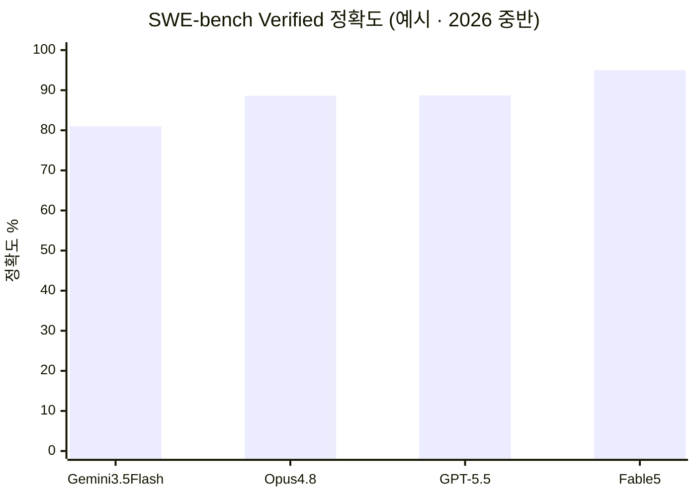
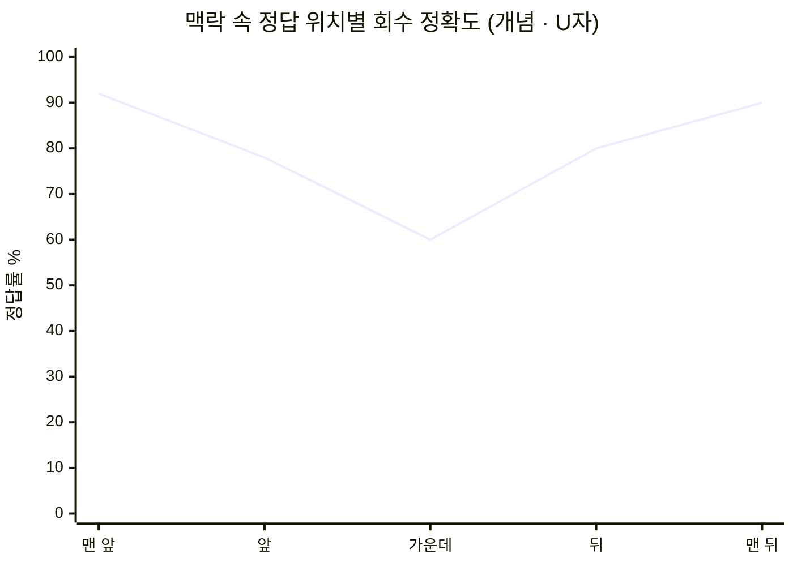
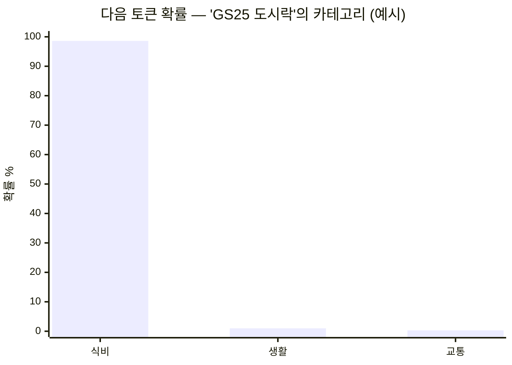
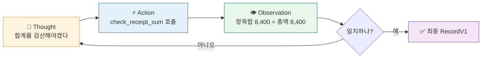
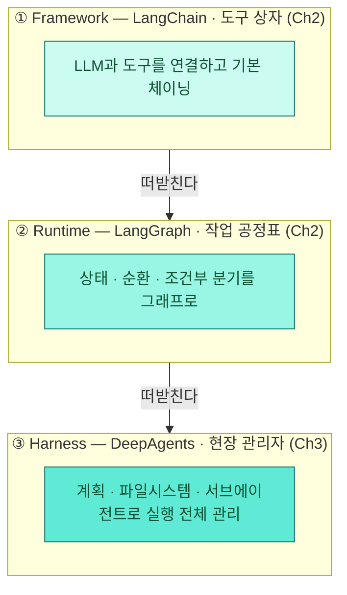

<div class="lec">
<div class="deck">

<section class="slide hero">
<div>
<div class="eyebrow">Chapter 1 · 에이전트 패러다임</div>

# 영수증을 읽고,<br>판단하게 만든다

<p class="lead">애널리스트의 첫 일은 문서를 읽어 숫자로 바꾸는 것입니다. 이 챕터에서는 영수증 이미지 한 장을 모델에 보여 주고 RecordV1 구조로 뽑아냅니다.<br>
그 과정에서 LLM이 왜 혼자서는 부족한지, 에이전트가 무엇을 더하는지를 손으로 확인합니다.</p>

<div class="kicker">
<div class="metric"><span class="num">45</span><strong>분</strong><span>이론 25 · 핸즈온 20</span></div>
<div class="metric"><span class="num">4</span><strong>한계</strong><span>LLM이 에이전트를 부르는 이유</span></div>
<div class="metric"><span class="num">1</span><strong>첫 부품</strong><span>classify_one.py</span></div>
</div>
</div>

<div class="board">
<div class="board-header"><span>이 챕터가 끝나면</span><span class="status-pill">산출물</span></div>
<div class="stack">
<div class="row"><div class="code">1</div><div class="copy"><strong>영수증 → RecordV1</strong><p>이미지 한 장을 읽어 판매처·금액·항목으로 구조화</p></div><div class="store">추출</div></div>
<div class="row"><div class="code">2</div><div class="copy"><strong>단발 vs ReAct</strong><p>합계를 스스로 검증하는 루프가 왜 필요한지 비교</p></div><div class="store">루프</div></div>
<div class="row"><div class="code">3</div><div class="copy"><strong>모델 비교표</strong><p>같은 영수증을 모델 3종에 물어 정확도·비용을 잰다</p></div><div class="store">선택</div></div>
</div>
</div>
</section>

<section class="slide">
<div class="section-head">
<div>
<div class="eyebrow">오늘의 로드맵</div>

## 8시간, 한 인박스를 끝까지

</div>
<p class="section-note">하루를 한 줄기로 봅니다. <strong>오전</strong>은 "왜 LLM만으론 부족한가"를 체감하고 추출·파이프라인을 세웁니다. <strong>오후</strong>는 그 위에 지식·연결·역할 분리를 얹어 검증된 브리프까지 잇습니다. 지금 어디쯤인지 이 표로 가늠하세요.</p>
</div>

<div class="board">
<div class="board-header"><span>Ch0 → Ch6 · 약 440분 + 휴식</span><span class="status-pill">오전 · 오후</span></div>
<div class="panel-body">

| 시간대 | 챕터 | 핵심 | 계층 | 산출물 |
|---|---|---|---|---|
| 오전 | **Ch0** 환경 (20분) | uv·.env·VSCode·데이터 계약 | — | `.venv` · sample_inbox |
| 오전 | **Ch1** 패러다임 (45분) | LLM 한계 → ReAct → 추출 | LLM | `classify_one.py` |
| 오전 | **Ch2** LangGraph (70분) | 상태·분기·재시도·HITL | Framework·Runtime | `intake_graph.py` |
| 오전 | **Ch3** DeepAgents (65분) | 하네스·fan-out·컨텍스트 외주 | Harness | `research_orchestrator.py` |
| 오후 | **Ch4** Skills·MCP (80분) | 절차·연결·지식 표준화 | 지식·연결 | MCP 서버 · OKF |
| 오후 | **Ch5** A2A (70분) | 역할 분리·독립 검증 | 협업 | `verified_brief.md` |
| 오후 | **Ch6** 통합 (90분) | 부품 배선·엔드투엔드·랩업 | 전체 | 검증된 브리프 |

</div>
</div>


<p class="section-note" style="margin-top:6px">이게 8시간의 전체 지도입니다. 한 인박스가 디렉터리를 따라 흐르며 점점 검증된 브리프로 익어갑니다. <strong>오늘(Ch1)은 노란 칸 — 영수증 한 장을 <code>classified/</code>의 RecordV1로 만드는 첫 부품</strong>입니다. 나머지 화살표는 이후 챕터가 하나씩 채웁니다.</p>

<p class="section-note" style="margin-top:14px">한 가지 축이 하루를 관통합니다 — <strong>Framework(LangChain) → Runtime(LangGraph) → Harness(DeepAgents)</strong>를 아래에서 위로 직접 밟고, 그 위에 Skills·MCP·A2A를 얹습니다. Ch6에서 전부 한 줄기로 모입니다.</p>
</section>

<section class="slide">
<div class="section-head">
<div>
<div class="eyebrow">0 · 지금</div>

## 순위를 가르는 건 모델이 아니다

</div>
<p class="section-note">SWE-bench Verified는 실제 GitHub 이슈를 주고 코드를 고쳐 테스트를 통과시키는 벤치마크입니다. 1년 전 70%대였던 상위권이 지금은 90% 안팎에 몰려 있습니다.<br>
모델 단독 점수가 비슷해지면서 무게중심이 옮겨 갔습니다. 같은 모델이라도 어떤 실행 환경으로 감싸느냐가 결과를 가릅니다.</p>
</div>

<div class="grid-2">
<div class="panel"><div class="panel-head"><strong>성능은 평평해졌다</strong><span>SWE-bench Verified · 2026 중반</span></div><div class="panel-body"><div class="list">
<p>상위 모델 정확도가 90% 안팎 한 덩어리로 몰렸습니다(아래 막대).</p>
<p>저비용 <strong>Gemini 3.5 Flash(약 81%)</strong>도 상위권에 근접 — 격차가 한 자릿수로.</p>
<p>수치는 게이트웨이·시점마다 달라지는 <strong>대략·예시값</strong>입니다.</p>
</div></div></div>
<div class="panel"><div class="panel-head"><strong>그래서 하네스다</strong><span>이 과정의 무게중심</span></div><div class="panel-body"><div class="list">
<p>LangChain은 모델(GPT-5.2-Codex)을 고정한 채 하네스만 손봐 Terminal-Bench 2.0을 52.8%→66.5%로 올렸습니다(Top 30 → Top 5).</p>
<p>가장 흔한 실패가 "코드를 쓰고 자기 코드를 다시 보고 괜찮다며 멈추는" 것이었고, <strong>종료 전 검증을 강제</strong>하자 13.7점이 올랐습니다.</p>
<p>오늘 우리가 ReAct 검산 루프로 손에 익힐 바로 그 패턴입니다.</p>
</div></div></div>
</div>

<div class="board" style="margin-top:18px">
<div class="board-header"><span>상위 모델이 90% 안팎에 몰렸다 — 그래서 모델보다 하네스</span><span class="status-pill">예시 수치</span></div>
<div class="panel-body">



<p style="margin-top:8px">막대 끝이 한 줄에 가깝게 붙어 있는 게 핵심입니다 — 모델 단독 점수론 더는 크게 안 벌어집니다. 그래서 무게중심이 "어떤 모델이냐"에서 "<strong>어떤 하네스로 감싸느냐</strong>"로 옮겨 갔습니다.</p>
</div>
</div>

<div class="board" style="margin-top:18px">
<div class="board-header"><span>사례 — 20B 오픈 모델이 하네스로 프런티어급과 겨룬다</span><span class="status-pill">Harness-1 · 2026-06</span></div>
<div class="panel-body"><div class="list">
<p><strong>무엇인가.</strong> UIUC·UC버클리·Chroma가 <strong>gpt-oss-20B</strong> 위에 검색 하네스를 얹은 <em>리서치 검색 서브에이전트</em>입니다.<br>
질문에 직접 답하지 않고, 근거가 될 문서를 찾아 추려 내는 일만 합니다 — 답은 뒤단의 다른 모델이 냅니다.</p>
<p><strong>어떻게 끌어올렸나.</strong> 핵심은 <strong>상태의 외부화</strong>입니다.<br>
· 20B 모델은 <em>의미 판단</em>만 합니다 — 무엇을 검색할지, 어느 문서를 남기고 버릴지, 언제 멈출지.<br>
· <em>기록 관리</em>(후보 풀·추려낸 문서셋 최대 30건·증거 그래프·검증 캐시)는 전부 하네스가 떠맡습니다.<br>
· 모델은 한 번에 한 동작(8개 도구 중 하나)만 내고, 하네스가 실행해 다음 상태를 정리해 보여 줍니다.<br>
· 이 하네스 <em>안에서</em> 강화학습으로 검색 습관을 훈련했고, 학습 데이터는 4,400여 건뿐이었습니다.</p>
<p><strong>결과.</strong> 추려낸 문서의 적중률(curated recall) 0.730.<br>
GPT-5.4(0.709)·Sonnet 4.6(0.688)을 앞섰지만, Opus 4.6(0.764)에는 근소하게 밀렸습니다.<br>
답을 맞히는 점수가 아니라 <em>근거를 잘 모았는지</em>를 재는 검색 지표라는 점, Opus엔 졌다는 점은 정확히 짚어 둡니다.</p>
<p><strong>교훈.</strong> 20B가 프런티어급 검색과 겨루는 건 모델이 더 똑똑해서가 아니라 <strong>하네스 설계 + 환경 안에서의 학습</strong> 덕입니다.<br>
기록을 모델 머릿속이 아니라 바깥에 두는 이 발상을, Ch2 체크포인터·Ch3 파일 퇴피에서 더 작은 형태로 다시 만납니다.</p>
</div></div>
</div>

<p class="section-note" style="margin-top:18px">Karpathy는 2025년을 영어만으로 프로그램을 짜는 임계점을 넘은 해로 평가했습니다. 코딩에서 먼저 터진 이 변화는 "문서를 읽고 판단해 행동으로 옮긴다"는 같은 골격을 공유하는 지식 업무 전반으로 번지고 있습니다. 우리가 만들 인박스 애널리스트도 그 한 갈래이고, 같은 패턴을 다른 업무로 옮겨 쓸 수 있습니다.</p>
</section>

<section class="slide">
<div class="section-head">
<div>
<div class="eyebrow">1 · 한계</div>

## LLM은 다음 토큰을 예측할 뿐

</div>
<p class="section-note">LLM의 동작은 한 문장으로 줄어듭니다. 지금까지의 텍스트를 보고 다음 토큰을 예측합니다.<br>
사실을 알고 답하는 게 아니라 통계 패턴을 따라갑니다. 여기서 네 가지 한계가 곧바로 나오고, 이 넷이 에이전트의 존재 이유입니다.</p>
</div>

<div class="grid-4">
<div class="panel"><div class="panel-head"><strong>Stateless</strong><span>기억이 없다</span></div><div class="panel-body"><div class="list">
<p>매 요청마다 맥락을 다시 넣어야 합니다</p>
<p><span class="badge blue">Ch2</span> Checkpointer · <strong>메모리 모듈</strong> 활발(MemGPT·Letta·mem0)</p>
</div></div></div>
<div class="panel"><div class="panel-head"><strong>Context Window</strong><span>한 번에 담는 양 제한</span></div><div class="panel-body"><div class="list">
<p>문서 10건을 한 프롬프트에 다 못 넣습니다</p>
<p><span class="badge blue">Ch3·4</span> 파일시스템 퇴피·점진 로딩</p>
</div></div></div>
<div class="panel"><div class="panel-head"><strong>Hallucination</strong><span>패턴 ≠ 현실</span></div><div class="panel-body"><div class="list">
<p>그럴듯하지만 틀린 값을 자신 있게 냅니다</p>
<p><span class="badge blue">Ch2·5</span> Tool로 조회·검증</p>
</div></div></div>
<div class="panel"><div class="panel-head"><strong>Knowledge Cutoff</strong><span>학습 이후를 모름</span></div><div class="panel-body"><div class="list">
<p>이번 달 영수증은 가중치에 없습니다</p>
<p><span class="badge blue">Ch4</span> 외부 데이터 연결</p>
</div></div></div>
</div>

<div class="board" style="margin-top:18px">
<div class="board-header"><span>환각은 한 종류가 아니다</span><span class="status-pill">왜 검증이 필요한가</span></div>
<div class="panel-body">
<div class="grid-2">
<div class="panel"><div class="panel-head"><strong>두 종류로 나눈다</strong><span>Huang 외 2023</span></div><div class="panel-body"><div class="list">
<p><strong>Factuality</strong> — 세상 사실과 어긋남. Tool로 실제 값을 조회하면 크게 줄어듭니다.</p>
<p><strong>Faithfulness</strong> — Tool이 옳은 값을 줘도 모델이 무시·왜곡함. 도구만으론 안 잡혀 <em>검증·보류</em>가 따로 필요합니다.</p>
</div></div></div>
<div class="panel"><div class="panel-head"><strong>왜 안 사라지나</strong><span>구조적 현상</span></div><div class="panel-body"><div class="list">
<p>이진 채점이 "자신 있는 추측"을 보상해 습관이 남습니다(Kalai 외 2025). 모르면 0점이니 일단 찍는 쪽이 점수에 유리합니다.</p>
<p>Xu 외(2024)는 환각이 LLM의 <strong>본질적 한계</strong>임을 이론적으로 보였습니다 — 그래서 "답을 보류(abstention)"가 기본 정책이 됩니다.</p>
</div></div></div>
</div>
<p style="margin-top:10px">처방은 둘을 겹칩니다 — Tool 조회로 factuality를 줄이고, 독립 검증·보류로 faithfulness를 잡습니다. 이 챕터의 ReAct 합계 검증이 그 가장 작은 형태입니다.</p>
</div>
</div>

<div class="ask"><strong>생각해보기 (30초).</strong> LLM이 "다음 토큰 예측기"라면, "오늘 달러·원 환율 알려줘"에 정확히 답할 수 있을까요? 답하거나 못 답한다면 그 이유는 위 네 한계 중 무엇일까요?</div>

<details>
<summary>정답 확인</summary>
<div class="reveal">
<p>답할 수 없습니다. 가중치에는 학습 시점까지의 통계 패턴만 들어 있어 <strong>실시간 값(환율·주가·내 영수증)</strong>에 닿을 길이 없습니다. 이건 4번 Knowledge Cutoff이자 3번 Hallucination의 뿌리입니다.</p>
<p>그럼에도 모델은 "모릅니다" 대신 그럴듯한 숫자를 자신 있게 내놓곤 합니다. 그래서 Tool로 실제 환율 API를 붙여 주는 에이전트가 필요합니다. 우리 실습에서는 같은 원리를 영수증 합계 검증으로 체험합니다.</p>
</div>
</details>
</section>

<section class="slide">
<div class="section-head">
<div>
<div class="eyebrow">1.2 · 더 들여다보면</div>

## 네 한계의 진짜 결

</div>
<p class="section-note">앞 표가 "무엇"이라면, 여기선 "그래서 어떻게"를 폅니다. 각 한계가 이 과정의 어떤 설계로 이어지는지가 핵심입니다.</p>
</div>

<div class="stack">
<div class="row"><div class="code">S</div><div class="copy"><strong>Stateless — 캐시하고, 요약은 의심하고, 메모리를 붙인다</strong><p>호출 사이에 상태가 없으니 같은 맥락을 매번 다시 보냅니다. 대응은 층이 다른 둘로 갈립니다 — <strong>①·② 재전송 비용을 줄이는 쪽</strong>(캐싱·요약. 상태를 복원하진 않고 매번 다시 보내되 싸게), <strong>③ 진짜로 상태를 더하는 쪽</strong>(메모리 모듈·체크포인터). 캐싱을 "기억"으로 오해하기 쉬운데, 캐시는 같은 프리픽스를 싸게 다시 보낼 뿐 모델에 기억을 주지는 않습니다.</p>
<p>① <strong>프리픽스 캐싱</strong> — 바뀌지 않는 앞부분(시스템 프롬프트·문서)을 재사용합니다. Anthropic·OpenAI의 <strong>프롬프트 캐시(API read cache)</strong>가 정확히 이것 — 캐시에서 읽은 토큰은 훨씬 싸게 청구됩니다.</p>
<p>② <strong>요약</strong> — 길어진 대화를 줄입니다. 단 요약은 <strong>손실 압축</strong>이라(정보가 빠지고 없던 내용이 끼기도 해) 원본을 그대로 대체하진 못합니다. "요약이 늘 정답"은 아니어서 원본을 파일로 남깁니다(Ch3).</p>
<p>③ <strong>메모리 모듈</strong> — 지금 활발히 연구되는 영역입니다. MemGPT는 컨텍스트를 RAM, 외부 저장소를 디스크로 보고 둘 사이를 페이징하며 에이전트가 자기 메모리를 직접 편집합니다. 이 흐름이 Letta·mem0, Anthropic memory tool(2025)로 이어집니다. <span class="badge blue">MemGPT 2310.08560</span> <span class="badge blue">Letta·mem0</span></p></div></div>
<div class="row"><div class="code">C</div><div class="copy"><strong>Context Window — 담기느냐가 아니라 고르게 쓰느냐</strong><p>요즘 롱컨텍스트엔 문서 10건쯤은 그냥 들어갑니다. 진짜 문제는 "담기느냐"가 아니라 "고르게 쓰느냐"입니다.</p>
<p>· 중간에 둔 정보일수록 모델이 덜 씁니다 — 시작·끝은 잘 보고 가운데는 흘립니다(<strong>Lost in the Middle</strong>, U자 곡선).<br>
· 관련 없어 보이는 문단이 끼면 정답도 흔들립니다(<strong>distractor</strong>).<br>
· 맥락이 길수록 <strong>KV 캐시</strong>가 그만큼 커져 메모리·비용이 길이에 비례해 늘어납니다.</p>
<p>그래서 다 욱여넣기보다 <strong>필요한 것만 골라 점진 로딩</strong>합니다(Ch3·4). <span class="badge blue">Liu 2307.03172</span> <span class="badge blue">Shi 2302.00093</span> <span class="badge blue">vLLM 2309.06180</span></p></div></div>
<div class="row"><div class="code">H</div><div class="copy"><strong>Hallucination — 확률과 채점이 함께 만든다</strong><p>모델은 "모르겠다"가 기본이 아니라 늘 최상위 토큰을 골라 답을 냅니다. 이진 채점 벤치마크가 <strong>"자신 있는 추측"을 보상</strong>해 그 습관이 학습 뒤에도 남습니다(Kalai). 환각이 이렇게 <strong>다음-토큰 확률·샘플링</strong>과 이어진다는 걸 바로 다음 1.5절에서 <code>logprobs</code>로 직접 봅니다. 처방은 둘 — 추출은 온도를 낮춰 흔들림을 줄이고, Tool로 실제 값을 조회·검증합니다(Ch2·5). <span class="badge blue">Kalai 2509.04664</span></p></div></div>
<div class="row"><div class="code">K</div><div class="copy"><strong>Knowledge Cutoff — 못 고치는 천장이라 도구를 쓴다</strong><p>가중치는 학습 시점에 얼어붙습니다. 그 뒤 사실(이번 달 영수증, 오늘 환율)은 파라미터에 없고, 이건 더 학습하기 전엔 못 고치는 천장입니다. 그래서 외부 저장소에서 그때그때 끌어오는 <strong>비파라미터 지식</strong>(검색·도구)이 필요합니다. RAG가 바로 이 "파라미터 vs 비파라미터" 분리를 정식화했습니다(Ch4 지식 연결). <span class="badge blue">Lewis 2005.11401</span></p></div></div>
</div>

<div class="board" style="margin-top:18px">
<div class="board-header"><span>Lost in the Middle — 정답이 어디 있느냐로 정답률이 갈린다</span><span class="status-pill">개념 곡선</span></div>
<div class="panel-body">



<p style="margin-top:8px">같은 정보라도 <strong>맥락의 가운데</strong>에 두면 모델이 덜 봅니다(U자 바닥). 그래서 길게 다 넣기보다, 필요한 조각을 <strong>앞·뒤 눈에 띄는 자리</strong>에 골라 넣는 게 낫습니다(C행 "고르게 쓰느냐"의 근거). 수치는 경향을 보이는 개념값입니다.</p>
</div>
</div>

<div class="board" style="margin-top:18px">
<div class="board-header"><span>압축하면 안 되나? — 캐시와의 실제 관계</span><span class="status-pill">바로잡기</span></div>
<div class="panel-body"><div class="list">
<p><strong>충돌은 딱 한 지점입니다.</strong> 캐시는 프리픽스가 <strong>글자 단위로 같아야</strong> 적중하는데, 요약은 그 앞부분을 고쳐 쓰니 <em>요약하는 순간 그 프리픽스의 캐시가 깨집니다</em>(다시 전체 요금 + 새 캐시 쓰기 비용). 충돌은 그 한 지점뿐 — "압축하지 마라"가 아닙니다.</p>
<p>오히려 압축은 자주 <strong>필수</strong>입니다. 컨텍스트가 창을 넘으면 압축(또는 파일 퇴피·검색)은 선택이 아니고, 길어질수록 가운데를 흘려(lost-in-the-middle) 품질로도 줄이는 게 낫습니다. 비용도 — 긴 기록은 캐시 읽기(~10%)라도 길이에 비례해 매 턴 쌓이지만, 한 번 줄이면 그 작은 프리픽스를 다시 캐시할 수 있어 <strong>턴이 쌓이면 대개 압축이 이깁니다</strong>(게다가 캐시는 TTL 5분~1시간 지나면 어차피 만료).</p>
<p>그래서 진짜 규칙은 "<strong>너무 자주 요약하지 마라</strong>"입니다 — 매 턴 요약하면 캐시가 본전을 뽑기 전에 계속 깨집니다. 안 바뀌는 머리(시스템 프롬프트·고정 문서)는 캐시로 얼리고, 휘발성 꼬리는 쌓일 때 <strong>한꺼번에(batch)</strong> 요약 — 둘은 적이 아니라 분업입니다. <span style="color:var(--muted)">(캐시 읽기 ~10% Anthropic·50~90%↓ OpenAI, 쓰기 1.25×~2×, 같은 프리픽스 TTL 안 2회 재사용이면 본전.)</span></p>
</div></div>
</div>
</section>

<section class="slide">
<div class="section-head">
<div>
<div class="eyebrow">1.5 · 들여다보기</div>

## "예측"을 눈으로 — logprobs와 temperature

</div>
<p class="section-note">"다음 토큰 예측기"가 추상이 아니라는 걸 짧게 확인합니다. <code>logprobs</code>로 모델이 토큰을 어떤 확률로 고르는지 보고, <code>temperature</code>로 그 선택이 얼마나 흔들리는지 봅니다.</p>
</div>

<div class="grid-2">
<div class="panel"><div class="panel-head"><strong>logprobs — 확신의 정체</strong><span>토큰 확률 분포</span></div><div class="panel-body"><div class="list">
<p>분류처럼 답이 또렷하면 한 토큰에 확률이 몰립니다(예: '식비' 98.6%).</p>
<p>애매하면 후보로 퍼집니다. 그래도 모델은 늘 최상위를 골라 답합니다 — "모르겠다"가 기본이 아닙니다. 이게 Kalai의 "자신 있는 추측".</p>
</div></div></div>
<div class="panel"><div class="panel-head"><strong>temperature — 왜 0인가</strong><span>추출의 재현성</span></div><div class="panel-body"><div class="list">
<p>온도가 0이면 늘 최상위 토큰, 높을수록 아래 후보도 뽑힙니다.</p>
<p>같은 영수증 → 같은 RecordV1이어야 하니 <code>classify_one</code>은 <code>temperature=0</code>. 창의가 필요한 글쓰기에서만 온도를 올립니다.</p>
</div></div></div>
</div>

<div class="board" style="margin-top:18px">
<div class="board-header"><span>토큰 확률 분포 — "GS25 도시락"은 무슨 비용?</span><span class="status-pill">logprobs</span></div>
<div class="panel-body">



<p style="margin-top:12px">분류처럼 답이 또렷하면 한 토큰에 확률이 거의 몰립니다(확신). 반대로 "오늘 서울 날씨는"처럼 이어질 말이 여럿이면 여러 후보로 넓게 퍼집니다(불확실). 그래도 모델은 늘 <strong>최상위 토큰</strong>을 골라 답합니다 — "모르겠다"가 기본이 아닙니다. 노트북 실험1을 돌리면 이 막대가 실제 숫자로 찍힙니다.</p>
</div>
</div>

<div class="board" style="margin-top:18px">
<div class="board-header"><span>주의 — 추론형 모델은 온도 손잡이가 없다</span><span class="status-pill">2026 함정</span></div>
<div class="panel-body"><div class="list">
<p>추론형 모델은 내부에서 스스로 길게 사고하며 탐색하기 때문에 사용자가 <code>temperature</code>로 무작위성을 정하는 의미가 옅어졌습니다. 특히 <strong>o 시리즈</strong>(o1·o3 등)는 OpenAI 직결 시 1이 아닌 값을 주면 <strong>400 에러</strong>로 거부합니다. <code>logprobs</code>도 추론형에선 대개 노출되지 않고요(온도와는 별개 제약). 그래서 토큰 확률을 직접 보는 1.5절 실험은 비추론 모델 <code>gpt-4o-mini</code>로 합니다.</p>
<p>게다가 게이트웨이가 한 겹 더 가립니다. <strong>OpenRouter는 모델이 지원하지 않는 파라미터를 조용히 떨어뜨립니다</strong> — 추론형 모델에 <code>temperature=0</code>을 줘도 에러 없이 무시될 수 있어 "0으로 고정했다"고 착각하기 쉽습니다. 반대로 비추론 모델(이 과정 기본 <code>gemini-3.5-flash</code>)에선 <code>temperature=0</code>이 정상 적용되니, 결정적 추출은 그쪽을 씁니다.</p>
</div></div>
</div>

<div class="board" style="margin-top:18px">
<div class="board-header"><span>temperature=0도 완전 결정론은 아니다</span><span class="status-pill">현실</span></div>
<div class="panel-body"><div class="list">
<p>온도 0이면 늘 최상위 토큰을 고르지만, 같은 입력이 드물게 다르게 나올 수 있습니다. 원인은 셋 — <strong>부동소수점 비결합성</strong>(덧셈 순서로 미세 차이), <strong>배치 크기 변동</strong>(함께 묶인 요청에 따라 커널 경로가 바뀜), <strong>MoE 라우팅 경쟁</strong>(어느 전문가로 갈지가 배치 내 경쟁으로 정해짐).</p>
<p>그래서 "0 = 비트 단위 재현"은 아닙니다(OpenAI Cookbook·Anthropic Glossary도 명시). 추출은 <code>temperature=0</code>으로 흔들림을 <em>최소화</em>하되, 최종 신뢰는 스키마 검증(<code>model_validate</code>)에 둡니다.</p>
</div></div>
</div>

<div class="board" style="margin-top:18px">
<div class="board-header"><span>직접 관찰</span><span class="status-pill">노트북</span></div>
<div class="panel-body"><div class="list">
<p>VSCode에서 <code>ch1-llm-basics/llm_internals.ipynb</code>를 열고 커널을 <code>.venv</code>로 맞춘 뒤 셀을 차례로 실행합니다. 실험1(logprobs)·실험2(temperature) 두 개입니다.</p>
<p>logprobs는 OpenAI 계열에서만 노출돼 <code>openai/gpt-4o-mini</code>로 관찰합니다. 확신해도 정답 보장이 아니라는 점, 추출은 0으로 고정한다는 점이 손에 잡힙니다.</p>
</div></div>
</div>

<div class="cue do">
<div class="cue-head"><span class="cue-label">✋ 직접 해보기</span><span class="cue-time">노트북 · 5분</span></div>
<div class="cue-body"><code>llm_internals.ipynb</code>를 열고 커널을 <code>.venv</code>로 맞춘 뒤 <strong>실험1</strong> 셀을 실행하세요. <code>openai/gpt-4o-mini</code>로 요청이 한 번 나갑니다.</div>
</div>

<div class="cue wait">
<div class="cue-head"><span class="cue-label">⏳ 기다렸다 확인</span><span class="cue-time">~15초</span></div>
<div class="cue-body">응답이 오면 확률 막대가 그려집니다. <strong>'식비' 토큰에 확률이 몰려 있는지</strong>(약 98.6%) 눈으로 확인하고 넘어가세요 — 확신이 높아도 정답 보장은 아니라는 게 이 실험의 핵심입니다.</div>
</div>
</section>

<section class="slide">
<div class="section-head">
<div>
<div class="eyebrow">2 · 루프</div>

## 에이전트는 한 번에 답하지 않는다

</div>
<p class="section-note">2022년 ReAct(Yao 외)가 제시한 구조가 지금 에이전트 루프의 기초입니다. 핵심은 <strong>모델이</strong> 추론하고, 도구를 부를지 스스로 정하고, 결과를 보고 다음을 판단한다는 점입니다.<br>
영수증으로 옮기면 이렇습니다. 모델이 항목을 뽑은 뒤 검산 도구를 직접 불러 확인하고, 어긋나면 스스로 다시 읽습니다. 이 되돌아가는 고리가 ReAct입니다.</p>
</div>



<div class="board" style="margin-top:18px">
<div class="board-header"><span>도구는 모델이 직접 실행하지 않는다</span><span class="status-pill">Tool Use의 실제</span></div>
<div class="panel-body"><div class="list">
<p>모델은 함수를 실행하는 대신 "이 함수를 이 인자로 부르라"는 구조화된 호출(<code>tool_calls</code>)을 냅니다. 런타임이 그걸 읽어 실제 함수를 돌리고 결과를 <code>ToolMessage</code>로 되돌려 줍니다.</p>
<p>그래서 Action은 모델이 낸 <code>tool_calls</code>, Observation은 런타임이 돌려준 <code>ToolMessage</code>입니다. 무엇을·언제 부를지는 모델이 정합니다 — 이게 단순 재시도 루프와 ReAct를 가르는 선입니다.</p>
</div></div>
</div>

<div class="board" style="margin-top:18px">
<div class="board-header"><span>에이전트의 네 부품</span><span class="status-pill">구성요소</span></div>
<div class="panel-body">
<div class="grid-4">
<div class="panel"><div class="panel-head"><strong>Model</strong><span>두뇌</span></div><div class="panel-body"><div class="list"><p>추론·도구 선택. 없으면 판단이 없습니다.</p></div></div></div>
<div class="panel"><div class="panel-head"><strong>Instructions</strong><span>가드레일</span></div><div class="panel-body"><div class="list"><p>역할·절차·형식. 없으면 제멋대로 — <span class="badge blue">Ch4</span> SKILL.md.</p></div></div></div>
<div class="panel"><div class="panel-head"><strong>Tools</strong><span>손발</span></div><div class="panel-body"><div class="list"><p>외부 조회·실행. 없으면 환각만 — <span class="badge blue">Ch4·5</span> MCP·A2A.</p></div></div></div>
<div class="panel"><div class="panel-head"><strong>Memory</strong><span>기억</span></div><div class="panel-body"><div class="list"><p>단기(맥락)+장기(저장). 없으면 매번 백지 — <span class="badge blue">Ch2</span> checkpointer.</p></div></div></div>
</div>
<p style="margin-top:8px">OpenAI(Model+Instructions+Tools)·Google·Lilian Weng(LLM+Planning+Memory+Tool) 모두 같은 골격을 다르게 부릅니다. 오늘 하루가 이 네 부품을 하나씩 붙이는 과정입니다.</p>
</div>
</div>
</section>

<section class="slide">
<div class="section-head">
<div>
<div class="eyebrow">3 · 절제</div>

## 에이전트는 마지막 수단

</div>
<p class="section-note">Anthropic은 가장 단순하고 신뢰할 수 있는 구현을 먼저 쓰라고 강조합니다. 실행 흐름이 코드로 정해지는 워크플로와, 모델이 자율로 지휘하는 에이전트를 구분합니다.<br>
에이전트는 매 호출마다 시스템 프롬프트와 기록을 다시 보내므로 같은 일을 워크플로로 할 때보다 토큰이 몇 배 듭니다. 충분한 문제에 굳이 에이전트를 쓰지 않습니다.</p>
</div>

<div class="grid-2">
<div class="panel"><div class="panel-head"><strong>워크플로 — 흐름을 코드로 고정</strong><span>예측 가능·저비용</span></div><div class="panel-body"><div class="list">
<p>단일 호출 — "이 영수증 한 장을 구조화"</p>
<p>체이닝 — "분류 → 정규화 → 적재" 순서 고정</p>
<p>라우팅 — 문서 유형에 따라 다른 처리</p>
<p>병렬화 — 여러 문서를 동시에 처리해 합산</p>
<p>오케스트레이터–워커 — 주제를 나눠 워커가 처리(<span class="badge amber">Ch3</span> fan-out)</p>
</div></div></div>
<div class="panel"><div class="panel-head"><strong>에이전트 — 모델이 자율 지휘</strong><span>유연·고비용</span></div><div class="panel-body"><div class="list">
<p>분해 — "이 인박스를 알아서 분석해 브리프로"</p>
<p>사전에 정해지지 않은 판단과 도구 선택이 필요할 때</p>
<p><span class="badge amber">Ch3</span> fan-out 조사에서 실측해 봅니다</p>
</div></div></div>
</div>

<p class="section-note" style="margin-top:18px">이 과정의 파이프라인은 대부분 워크플로입니다. 분류·정규화는 흐름이 정해져 있습니다. 에이전트가 빛나는 곳은 "여러 문서를 나눠 조사하고 교차 검산"하는 Ch3 한 구간입니다. 도구를 고를 때 이 구분이 첫 질문이 됩니다.</p>

<div class="ask"><strong>빠른 판단 연습 (2분).</strong> 다음 셋은 워크플로(단일 호출·체이닝·라우팅)일까요, 에이전트일까요?<br>
① 영수증 한 장을 RecordV1로 구조화 &nbsp;② 문서가 영수증인지 명세서인지에 따라 다른 처리로 분기 &nbsp;③ "이 인박스를 알아서 조사해 브리프로 정리"</div>

<details>
<summary>정답 확인</summary>
<div class="reveal">
<p>① <strong>단일 호출</strong> — 입력 하나 → 출력 하나. 반복도 도구도 필요 없습니다(Ch1 classify_one의 단발 모드).</p>
<p>② <strong>라우팅</strong> — 입력 종류에 따라 길이 갈릴 뿐, 각 길은 미리 정해져 있습니다.</p>
<p>③ <strong>에이전트</strong> — 몇 갈래로 볼지, 무슨 도구를 쓸지 사전에 못 박을 수 없습니다. 모델이 계획하고 반복합니다(Ch3 fan-out).</p>
<p>실무에서는 대부분 ①②로 충분합니다. ③이 정말 필요할 때만 비용을 감수하고 에이전트를 씁니다.</p>
</div>
</details>
</section>

<section class="slide">
<div class="section-head">
<div>
<div class="eyebrow">4 · 모델</div>

## 제일 똑똑한 모델이 정답은 아니다

</div>
<p class="section-note">에이전트의 두뇌는 모델입니다. 다만 가장 비싼 모델을 항상 쓰는 건 속도와 비용에서 손해입니다.<br>
역량과 단가로 세 자리를 잡아 두고 작업에 맞춰 올리고 내립니다. 분류·라우팅은 싼 모델로, 본 작업은 균형 모델로, 막히는 난제만 최상위로 올립니다.</p>
</div>

<div class="panel">
<div class="panel-head"><strong>2026년 중반 모델 자리표</strong><span>단가 = 입력/출력 · 1M 토큰 · 게이트웨이마다 다름</span></div>
<div class="panel-body">

| 자리 | 대표 모델 (ID) | 강점 | 대략 단가 | 쓰는 곳 |
|---|---|---|---|---|
| 프런티어급 | Fable 5 (`claude-fable-5`) | 최상위 추론·장기 코딩 (~95%) | ~$10 / ~$50 | 막판 난제 |
| 범용 주력 | Opus 4.8 (`claude-opus-4-8`) | 균형 잡힌 고성능 (88.6%) | ~$5 / ~$25 | 비교·심화 |
| 범용 주력 | GPT-5.5 (`gpt-5.5`) | 강한 범용 추론 (~88.7%) | ~$5 / ~$30 | 비교축 |
| 범용 주력 | **Gemini 3.5 Flash** (`google/gemini-3.5-flash`) | 빠르고 저렴 (~81%) | ~$1.5 / ~$9 | **이 과정 기본** |
| 경량 | Haiku 4.5 (`claude-haiku-4-5`) | 분류·대량 처리 | 최저가대 | 라우터·서브에이전트 |

</div>
</div>

<div class="board" style="margin-top:18px">
<div class="board-header"><span>기본값은 Gemini 3.5 Flash</span><span class="status-pill">실무 휴리스틱</span></div>
<div class="panel-body"><div class="list">
<p>저렴하고 빨라 8시간 내내 반복 실습에 맞습니다. 비교가 필요한 대목에서만 Opus 4.8로 올립니다.</p>
<p>점수 5%를 더 얻으려고 비용을 3배 쓰는 건 대개 손해입니다. 그래서 한 모델로 통일하지 않고 자리를 섞습니다. 이 챕터 끝의 비교표가 그 감각을 데이터로 줍니다.</p>
</div></div>
</div>
</section>

<section class="slide">
<div class="section-head">
<div>
<div class="eyebrow">5 · 3계층</div>

## Framework → Runtime → Harness

</div>
<p class="section-note">ReAct 루프는 강력하지만 프로덕션에서 또 막힙니다. 컨텍스트가 차고, 장기 실행이 어렵고, 실패 후 재시작 지점이 모호합니다.<br>
그래서 기술이 세 계층으로 자랐습니다. 오늘 하루가 이 세 계층을 아래에서 위로 직접 밟는 길입니다.</p>
</div>



<p class="section-note" style="margin-top:8px">아래(①)가 위(③)를 떠받칩니다 — LLM·도구 연결(Framework) 위에 상태·분기(Runtime), 그 위에 계획·파일·서브에이전트(Harness). 오늘 하루가 이 셋을 아래에서 위로 직접 밟는 길입니다.</p>

<p class="section-note" style="margin-top:18px">이 3계층은 LangChain 생태계에서 자주 쓰는 설명 틀이고 업계 단일 표준은 아닙니다. 다른 프레임워크는 경계를 다르게 둡니다. 이 과정이 이 스택을 고른 이유는 세 역할이 또렷이 나뉘어 따로 배우기 좋기 때문입니다.</p>
</section>

<section class="slide">
<div class="section-head">
<div>
<div class="eyebrow">핸즈온 ① · 코드 정독</div>

## 멀티모달 호출을 뜯어본다

</div>
<p class="section-note">영수증 이미지 한 장을 모델에 보여 주고 RecordV1로 받습니다. 먼저 호출의 모양을 한 줄씩 읽습니다. 텍스트 프롬프트와 이미지를 <strong>한 메시지에 함께</strong> 실어 보내는 게 핵심입니다.</p>
</div>

```python
key = os.environ["OPENROUTER_API_KEY"]          # ① 키는 .env에서 (코드에 안 박는다)
llm = ChatOpenAI(model="google/gemini-3.5-flash",
                 base_url="https://openrouter.ai/api/v1",
                 api_key=key, temperature=0)     # ② temperature=0 — 추출은 매번 같아야 한다

prompt = EXTRACT_PROMPT.format(schema=schema_json(), source_path=...)  # ③ RecordV1 스키마를 지시에 끼움
msg = llm.invoke([{
    "role": "user",
    "content": [
        {"type": "text", "text": prompt},                       # ④ 무엇을 뽑을지
        {"type": "image_url", "image_url": {"url": data_url}},   # ⑤ 영수증 이미지(base64 data URL)
    ],
}])
record = RecordV1.model_validate_json(strip_fences(msg.content))  # ⑥ 받은 JSON을 계약으로 검증
```

<div class="grid-2">
<div class="panel"><div class="panel-head"><strong>왜 이렇게 쓰나 — ②③⑥</strong><span>설계 결정</span></div><div class="panel-body"><div class="list">
<p><strong>② temperature=0</strong> — 같은 영수증은 늘 같은 값으로 읽혀야 합니다. 재현성이 추출의 기본 요구입니다.</p>
<p><strong>③ 스키마를 프롬프트에</strong> — 모델이 RecordV1 한글 키(판매처·금액…)에 맞춰 JSON을 내도록 형식을 못 박습니다.</p>
<p><strong>⑥ model_validate_json</strong> — 모델 출력을 믿지 않고 계약으로 검증합니다. 필드가 빠지거나 타입이 틀리면 여기서 걸립니다.</p>
</div></div></div>
<div class="panel"><div class="panel-head"><strong>두 가지 함정 — ④⑤⑥</strong><span>자주 막히는 곳</span></div><div class="panel-body"><div class="list">
<p>이미지는 <code>data:image/png;base64,...</code> 형태의 data URL로 넣습니다. 경로 문자열이 아닙니다.</p>
<p>모델이 <code>```json … ```</code> 울타리를 붙여 답할 때가 있어 <code>strip_fences</code>로 벗긴 뒤 파싱합니다.</p>
</div></div></div>
</div>
</section>

<section class="slide">
<div class="section-head">
<div>
<div class="eyebrow">핸즈온 ② · 코드 정독</div>

## 합계를 스스로 검증한다 — ReAct

</div>
<p class="section-note">진짜 ReAct는 우리가 검증 함수를 부르는 게 아닙니다. <strong>모델이</strong> 추론 끝에 도구 호출을 결정하고(Action), 그 결과를 보고(Observation), 다음 행동을 정합니다. 모델에 <code>check_receipt_sum</code> 도구를 쥐여 주고 루프를 돌립니다.</p>
</div>

<div class="panel">
<div class="panel-head"><strong>ch1-llm-basics/classify_one.py</strong><span>모델이 도구를 직접 호출하는 ReAct 루프</span></div>
<div class="panel-body">

```python
@tool
def check_receipt_sum(items: list[dict], total: float) -> str:
    """영수증 항목 합계가 총액과 맞는지 검산한다. 추출 직후 반드시 호출하라."""
    s = sum((it.get("amount") or 0) * (it.get("qty") or 1)
            for it in items if (it.get("amount") or 0) > 0)
    ok = abs(s - total) < 1.0
    return f"항목합={s:,.0f} 총액={total:,.0f} → " + ("일치" if ok else "불일치. 다시 보라")

def extract_react(doc, model, max_steps=5):
    llm = ChatOpenAI(model=model, ...).bind_tools([check_receipt_sum])  # 도구를 쥐여 준다
    messages = [SystemMessage(REACT_SYSTEM), HumanMessage([text, image])]
    for _ in range(max_steps):
        ai = llm.invoke(messages); messages.append(ai)
        if ai.tool_calls:                              # Action — 모델이 호출을 결정
            for tc in ai.tool_calls:
                obs = check_receipt_sum.invoke(tc["args"])   # 런타임이 실제 실행
                print(f"  [Observation] {obs}")
                messages.append(ToolMessage(obs, tool_call_id=tc["id"]))
            continue                                   # 관측을 들고 다시 모델에게
        return RecordV1.model_validate_json(strip_fences(ai.content))  # 도구 안 부름 = 최종
    raise RuntimeError("max_steps 초과")                  # 무한 도구 호출 방지(하네스의 상한)
```

</div>
</div>

<div class="grid-3" style="margin-top:16px">
<div class="panel"><div class="panel-head"><strong>무엇이 ReAct인가</strong></div><div class="panel-body"><div class="list">
<p>도구 선택을 <strong>모델이</strong> 합니다. <code>tool_calls</code>가 Action, <code>ToolMessage</code>가 Observation입니다.</p>
</div></div></div>
<div class="panel"><div class="panel-head"><strong>단발과 무엇이 다른가</strong></div><div class="panel-body"><div class="list">
<p>단발은 한 번 뱉고 끝. ReAct는 검산이 불일치면 모델이 스스로 다시 읽어 고칩니다.</p>
</div></div></div>
<div class="panel"><div class="panel-head"><strong>왜 max_steps</strong></div><div class="panel-body"><div class="list">
<p>모델이 도구를 무한 반복하지 않도록 상한을 둡니다. 한계 설정이 하네스의 일입니다.</p>
</div></div></div>
</div>
</section>

<section class="slide">
<div class="section-head">
<div>
<div class="eyebrow">핸즈온 ③ · 단계별 실행</div>

## 돌리고, 관찰하고, 바꿔 본다

</div>
<p class="section-note">키 없이 파이프라인부터 확인하고, 키를 넣어 실제 추출을 본 뒤, 모델을 비교합니다. 각 단계마다 무엇이 보이면 성공인지 적었습니다.</p>
</div>

<div class="stack">
<div class="row"><div class="code">1</div><div class="copy"><strong>키 없이 — 파이프라인 확인</strong><p><code>uv run python3 ch1-llm-basics/classify_one.py --doc receipt_starbucks.png --mock</code><br><span style="color:var(--muted)">성공 기준: 판매처·금액·항목이 든 RecordV1 JSON이 한글 키로 출력된다.</span></p></div><div class="store">mock</div></div>
<div class="row"><div class="code">2</div><div class="copy"><strong>키 넣고 — ReAct 추출</strong><p><code>uv run python3 ch1-llm-basics/classify_one.py --doc receipt_gs25.png --react</code><br><span style="color:var(--muted)">성공 기준: <code>[Action] check_receipt_sum 호출</code> → <code>[Observation] 항목합=8,400원 총액=8,400원 → 일치</code> → <code>[Final]</code>, "정확도 100%". 모델이 도구를 스스로 부른 것.</span></p></div><div class="store">실호출</div></div>
<div class="row"><div class="code">3</div><div class="copy"><strong>모델 3종 비교</strong><p><code>uv run python3 ch1-llm-basics/classify_one.py --doc receipt_gs25.png --compare</code><br><span style="color:var(--muted)">성공 기준: 세 모델의 정확도가 표로 나온다(비용 감각의 출발점).</span></p></div><div class="store">선택</div></div>
</div>

<div class="cue solve" style="margin-top:18px">
<div class="cue-head"><span class="cue-label">✏️ 풀어보기</span><span class="cue-time">~6분</span></div>
<div class="cue-body"><p>① <code>--doc invoice_photo.png</code>로 바꿔 명세서(고액 청구서)를 뽑아 보세요. 모델이 검산 도구 <code>check_receipt_sum</code>을 부를까요, 건너뛸까요?</p><p>② 검산 도구의 허용 오차 <code>1.0</code>을 <code>0.0</code>으로 바꾸면 어떤 영수증이 불일치로 떨어질까요?</p></div>
</div>

<details>
<summary>관찰 포인트</summary>
<div class="reveal">
<p>① 이 경우 모델은 <strong><code>check_receipt_sum</code>을 부릅니다</strong>. invoice_photo는 명세서지만 항목 2개가 총액(1,650,000원)과 정확히 맞아떨어지는 구조라, 모델이 "검산할 수 있는 문서"로 보고 도구를 부른 뒤 통과시킵니다. 핵심은 <code>extract_react</code>에 <em>doc_type을 보는 강제 <code>if</code>는 없다</em>는 점입니다 — 무엇을·언제 검산할지는 모델이 문서 구조를 보고 정합니다(ReAct의 성질). 시스템 프롬프트는 "항목합이 총액과 무관한 문서면 검산을 건너뛰라"고 일러두므로, 항목이 총액과 안 맞물리는 문서였다면 모델은 검산 없이 바로 냈을 것입니다.</p>
<p>② 모델이 항목을 살짝 다르게 읽으면 1원 단위 오차가 생길 수 있습니다. 허용 오차는 "얼마나 깐깐하게 볼까"의 손잡이입니다. 너무 0에 가까우면 정상도 불일치로 떨어지고, 너무 크면 진짜 오류를 놓칩니다.</p>
</div>
</details>
</section>

<section class="slide">
<div class="section-head">
<div>
<div class="eyebrow">핸즈온 ④ · 트러블슈팅</div>

## 막히면 여기부터

</div>
<p class="section-note">실호출에서 자주 만나는 네 가지입니다. 대부분 키·슬러그·네트워크 셋 중 하나입니다.</p>
</div>

<div class="grid-2">
<div class="panel"><div class="panel-head"><strong>401 Unauthorized</strong><span>인증</span></div><div class="panel-body"><div class="list">
<p><code>.env</code>의 <code>OPENROUTER_API_KEY</code>가 비었거나 <code>sk-or-...</code> placeholder 그대로입니다. 실제 키로 채웠는지 확인합니다.</p>
</div></div></div>
<div class="panel"><div class="panel-head"><strong>404 Model not found</strong><span>슬러그</span></div><div class="panel-body"><div class="list">
<p>모델 슬러그 오타입니다. <code>google/gemini-3.5-flash</code>처럼 제공자/모델 형태가 맞는지 봅니다.</p>
</div></div></div>
<div class="panel"><div class="panel-head"><strong>JSON 파싱 오류</strong><span>출력 형식</span></div><div class="panel-body"><div class="list">
<p>모델이 설명 문장을 덧붙였을 수 있습니다. <code>strip_fences</code>가 울타리는 벗기지만, 프롬프트에 "JSON만 출력"을 더 강하게 둘 수도 있습니다.</p>
</div></div></div>
<div class="panel"><div class="panel-head"><strong>빈 응답 · 타임아웃</strong><span>네트워크</span></div><div class="panel-body"><div class="list">
<p>네트워크나 게이트웨이 일시 문제입니다. 잠시 후 재시도하거나 <code>--mock</code>으로 흐름만 먼저 확인합니다.</p>
</div></div></div>
</div>

<div class="board" style="margin-top:18px">
<div class="board-header"><span>이 챕터에서 손에 든 것</span><span class="status-pill">체크</span></div>
<div class="panel-body"><div class="list">
<p>영수증 이미지 → RecordV1 추출기 · 단발과 ReAct의 차이 · 모델 3종의 정확도 감각</p>
<p>전체 실행 파일은 <code>ch1-llm-basics/classify_one.py</code> 하나에 추출·검증·채점·비교가 다 들어 있습니다.</p>
</div></div>
</div>
</section>

<section class="slide">
<div class="section-head">
<div>
<div class="eyebrow">마무리</div>

## 다음 — 흐름을 그래프로 묶는다

</div>
<p class="section-note">영수증 한 장을 RecordV1로 읽는 부품이 생겼습니다. 다음은 문서 더미 전체를 분류하고 정규화하는 흐름입니다.<br>
Ch2에서 LangGraph로 이 단발 추출을 상태·재시도·중단점이 있는 파이프라인으로 묶습니다. 고액이나 저신뢰 건은 사람에게 멈춰 묻습니다.</p>
</div>

<div class="grid-3">
<div class="panel"><div class="panel-head"><strong>지금 손에 든 것</strong></div><div class="panel-body"><div class="list">
<p>영수증 → RecordV1 추출기</p>
<p>단발 vs ReAct · 모델 비교 감각</p>
</div></div></div>
<div class="panel"><div class="panel-head"><strong>Ch2에서 할 것</strong></div><div class="panel-body"><div class="list">
<p>분류·정규화 StateGraph</p>
<p>checkpointer 재개 · interrupt() HITL</p>
</div></div></div>
<div class="panel"><div class="panel-head"><strong>최종 목적지</strong></div><div class="panel-body"><div class="list">
<p>인박스 한 통 → 검증된 브리프</p>
<p>Ch6 통합 캡스톤</p>
</div></div></div>
</div>

<div class="board" style="margin-top:18px">
<div class="board-header"><span>참고 자료</span><span class="status-pill">출처</span></div>
<div class="panel-body"><div class="list">
<p><a href="https://arxiv.org/abs/2210.03629">ReAct (Yao 외, 2022)</a> · <a href="https://www.anthropic.com/engineering/building-effective-agents">Anthropic — Building Effective Agents</a></p>
<p><strong>환각</strong> · <a href="https://arxiv.org/abs/2509.04664">Why Language Models Hallucinate (Kalai 외, 2025)</a> · <a href="https://arxiv.org/abs/2311.05232">환각 서베이: factuality vs faithfulness (Huang 외, 2023)</a> · <a href="https://arxiv.org/abs/2401.11817">Hallucination is Inevitable (Xu 외, 2024)</a></p>
<p><strong>메모리</strong> · <a href="https://arxiv.org/abs/2310.08560">MemGPT (Packer 외, 2023)</a> · <a href="https://github.com/mem0ai/mem0">mem0</a> · <a href="https://www.letta.com/">Letta</a> · <a href="https://docs.claude.com/en/docs/agents-and-tools/tool-use/memory-tool">Anthropic memory tool</a></p>
<p><strong>컨텍스트 — 1차 출처</strong> · <a href="https://arxiv.org/abs/2307.03172">Lost in the Middle (Liu 외, 2023)</a> · <a href="https://arxiv.org/abs/2302.00093">Distracted by Irrelevant Context (Shi 외, 2023)</a> · <a href="https://arxiv.org/abs/2309.06180">PagedAttention/vLLM (Kwon 외, 2023)</a> · <a href="https://arxiv.org/abs/2005.11401">RAG (Lewis 외, 2020)</a> · <a href="https://llm-stats.com/benchmarks/swe-bench-verified">SWE-bench Verified</a></p>
<p><a href="https://blog.langchain.com/improving-deep-agents-with-harness-engineering/">LangChain — Improving Deep Agents with Harness Engineering</a> (Terminal-Bench 2.0 52.8→66.5) · <a href="https://martinfowler.com/articles/exploring-gen-ai/harness-engineering.html">Fowler — Harness Engineering</a></p>
<p><strong>하네스 사례</strong> — <a href="https://arxiv.org/abs/2606.02373">Harness-1: Reinforcement Learning for Search Agents with State-Externalizing Harnesses (UIUC·UC Berkeley·Chroma, 2026)</a></p>
</div></div>
</div>
</section>


<nav class="chapnav">
<div class="board" style="margin-top:8px">
<div style="display:grid;grid-template-columns:1fr auto 1fr;gap:14px;align-items:center">
<a href="/deepagents-handson/chapters/chapter-0" style="color:inherit;text-decoration:none;font-weight:900;font-size:14px">← Ch0 · 환경 셋업</a>
<a href="/deepagents-handson/toc" style="color:var(--forest);text-decoration:none;font-weight:900;font-size:13px;background:rgba(148,210,189,.3);border:1px solid rgba(15,118,110,.24);border-radius:99px;padding:7px 16px">목차</a>
<a href="/deepagents-handson/chapters/chapter-2" style="color:inherit;text-decoration:none;font-weight:900;font-size:14px;text-align:right">Ch2 · LangGraph 하네스 →</a>
</div>
</div>
</nav>

</div>
</div>
