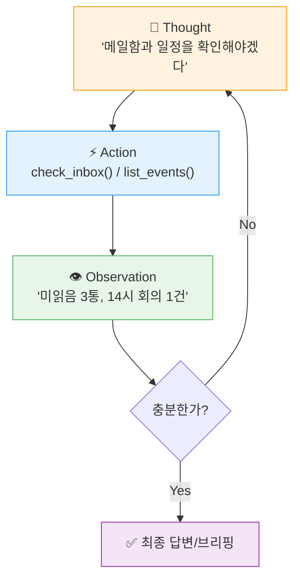

# Chapter 1. Kick-off & Agent 패러다임

> **학습 목표**
> - [ ] LLM의 4가지 시스템적 한계를 설명하고, 각 한계를 Agent가 어떻게 보완하는지 연결할 수 있다
> - [ ] ReAct 루프(Thought → Action → Observation)로 Agent가 목표를 달성하는 과정을 설명할 수 있다
> - [ ] Framework → Runtime → Harness 3계층의 역할을 구분하고, 코드 조각을 각 계층에 배치할 수 있다
> - [ ] 2026년 모델 지형도(천장 / 워크호스 / 예산 티어)를 비용-역량 기준으로 비교해 작업에 맞는 모델을 고를 수 있다

| 소요 시간 | 학습 방법 | 우리가 만들 것 |
|---|---|---|
| 45분 | 이론 + 라이브 리더보드 탐색 | **"내 하루를 관리하는 퍼스널 워크플로 어시스턴트"** (메일·캘린더·문서) — Ch6까지 이어지는 한 줄기 시나리오 |

---

## 0. 왜 지금 Agent인가? — Phase Shift

### Karpathy의 선언 (2025년 12월)

**Andrej Karpathy**(Tesla 자율주행 AI 총괄 출신, OpenAI 창립 연구팀 멤버)는 2025년을 AI가 **능력 임계점을 넘은 해**로 평가했습니다.

> *"2025 is the year that AI crossed a capability threshold necessary to build all kinds of impressive programs simply via English, forgetting that the code even exists."*
> — Andrej Karpathy, [2025 Year in Review](https://karpathy.bearblog.dev/year-in-review-2025/)

이 임계점이 **Agent 영역**에서 어떻게 나타났는지 수치로 확인해 보겠습니다.

### 수치로 보는 변화 — Agent가 실제 엔지니어링 문제를 푼다

**[SWE-Bench Verified](https://www.swebench.com)** — Princeton NLP 팀이 만든 소프트웨어 엔지니어링 벤치마크입니다. 실제 GitHub 이슈(Django, scikit-learn 등)를 주고 코드를 읽고 → 버그를 찾고 → 패치를 작성하고 → 테스트를 통과해야 합니다. 500문제를 93명이 교차 검증한 고품질 부분집합입니다.

**성능 변화 추이** (Verified 기준):

| 시점 | 최고 성능 | 대표 시스템 |
|---|---|---|
| 2024년 초 | ~14%* | Devin (Cognition AI) |
| 2024년 말 | ~49% | Claude 3.5 Sonnet 기반 |
| 2025년 초 | ~62% | Claude 3.7 Sonnet |
| 2025년 중 | ~70% | Claude 4 계열 |
| **2026년 중** | **~88~95%** | **Fable 5 · Claude Opus 4.8 · GPT-5.5** |

> *2024년 초 Devin 수치는 Verified 이전의 Full SWE-Bench(2,294문제) 기준. 이후 행은 모두 Verified 기준이며, 상위 시스템 스냅샷입니다. 최신 값은 [llm-stats.com](https://llm-stats.com/benchmarks/swe-bench-verified)·[swebench.com](https://www.swebench.com)에서 확인하세요(2026-06 기준 Fable 5 약 95%, Opus 4.8 88.6%, GPT-5.5 약 88.7%, Gemini 3.5 Flash 약 81%).*

::: warning 이 교재를 쓰는 동안에도 세상은 바뀌고 있습니다
불과 1년 전 70%대였던 SWE-bench가 이제 상위권은 **90% 안팎**에 밀집했습니다. 모델 단독 점수 차이가 좁아지면서, 이제는 **모델보다 Agent Harness(실행 환경)의 설계가 순위를 좌우**하는 구간에 들어섰습니다. 그래서 이 과정의 무게중심도 "어떤 모델을 쓰는가"가 아니라 "**어떤 하니스로 감싸는가**"에 있습니다.
:::

### 현장의 변화

Karpathy의 경험([X, 2026-01](https://x.com/karpathy/status/2015883857489522876)): **"80% 수동+자동완성, 20% Agent" → "80% Agent 코딩, 20% 수정·터치업"**.

- 반복 작업의 대부분을 Agent가 처리
- 개발자 역할: 코드 작성자 → **편집자·검토자(Editor / Reviewer)**
- 새 병목: 지능(Intelligence) 문제는 완화 → **통합(Integration)·워크플로(Workflow)** 문제로 이동

이 변화는 코딩에 국한되지 않습니다. "Agent가 코드를 잘 짠다"에서 출발한 역량이 **메일 관리, 일정 조율, 문서 처리** 등 일반 업무 전반으로 번지고 있습니다.

### Phase Shift가 낳은 제품들

| 제품 | 설명 |
|---|---|
| **[OpenClaw](https://openclaw.ai/)** | 오픈소스 자율 AI Agent. 메일·캘린더·터미널을 LLM으로 제어. 리브랜딩 후 폭발적으로 성장해 GitHub Stars **30만+** 돌파. |
| **[Claude Cowork](https://www.anthropic.com/webinars/future-of-ai-at-work-introducing-cowork)** | Anthropic의 범용 업무 Agent — *"Claude Code for the rest of your work"*. Computer Use + Claude in Chrome으로 **Gmail·캘린더·문서**를 자율 처리. |

두 제품의 공통점은 단순 챗봇이 아니라 **다단계 작업을 스스로 계획·실행하는 Agent Harness** 구조라는 점입니다. 우리가 오늘 만들 어시스턴트, 그리고 Ch3에서 실습할 DeepAgents가 정확히 같은 계층에 있습니다.

이제 그 엔진인 **LLM이 무엇이고 어떤 한계가 있는지** — Agent가 왜 필요한지를 한계에서부터 풀어보겠습니다.

---

## 1. LLM 빠른 복습 — 4가지 한계가 Agent를 부른다

LLM(Large Language Model)의 동작은 한 문장으로 요약됩니다.

> **"지금까지의 텍스트를 보고, 다음에 올 토큰을 예측한다."**

```
입력: "오늘 서울의 날씨는"  →  [확률 분포]  →  "맑습니다"(0.42) "흐립니다"(0.31) ...
```

규모를 키우면 추론·코드 생성·번역 같은 **창발적 능력(emergent abilities)** 이 나타나지만, 본질은 여전히 "다음 토큰 예측"입니다. 사실을 *알고* 답하는 게 아니라 통계 패턴을 따라가는 것 — 이 단순한 본질에서 곧바로 **4가지 시스템적 한계**가 나옵니다. 그리고 **이 4가지가 바로 Agent의 존재 이유**입니다.

| # | 한계 | 왜 생기나 | 실제 영향 | Agent의 해결책 | 배우는 곳 |
|---|---|---|---|---|---|
| 1 | **Stateless** | 모델 자체엔 기억이 없음 | 매 요청마다 전체 맥락 재주입 | Checkpointer로 세션 상태 유지 | Ch2 |
| 2 | **Context Window** | 한 번에 처리할 정보량 제한 | 긴 문서·대량 메일 한 번에 불가 | Filesystem 백엔드 + Skills 점진 로딩 | Ch3·Ch4 |
| 3 | **Hallucination** | 통계 패턴 ≠ 현실 | 신뢰 불가 → 외부 검증 필수 | Tool Use로 실제 데이터 조회·검증 | Ch2·Ch4 |
| 4 | **Knowledge Cutoff** | 학습 시점 이후를 모름 | 실시간 정보 접근 불가 | 검색·API Tool 연결 | Ch4 |

**Hallucination 한 걸음 더.** 모델에는 "진실"이라는 개념이 없습니다. 가중치에 압축된 패턴이 현실과 맞을 때만 사실처럼 보일 뿐입니다. 실무에서는 둘로 나눕니다.

- **Factuality hallucination** — 외부 현실과 모순. Tool Use(실데이터 조회)로 크게 줄일 수 있음
- **Faithfulness hallucination** — Tool 결과·입력과 모순. Tool이 정확해도 모델이 무시·왜곡할 수 있어 **별도 검증** 필요

> Kalai et al.(2025, [*Why Language Models Hallucinate*](https://arxiv.org/abs/2509.04664))은 환각이 버그가 아니라 **이진 채점 벤치마크가 "자신 있는 추측"을 보상**하기 때문에 생긴다고 분석합니다. 그래서 프로덕션 Agent는 *Tool Use + 검증 레이어 + 답변 보류(abstention)* 를 함께 씁니다.

::: info 💭 생각해보기 (30초)
LLM이 "다음 토큰 예측기"라면, **"오늘 달러/원 환율은?"** 에 정확히 답할 수 있을까요? 그 이유는?
:::

::: details 정답 확인
답할 수 없습니다. 가중치는 학습 시점의 통계 패턴만 담고 있어 **실시간 데이터(환율·주가·날씨·내 메일함)** 에 접근할 방법이 없습니다. 이것이 4번 한계(Knowledge Cutoff)이자 3번(Hallucination)의 뿌리이며, 곧 **Tool Use를 가진 Agent가 필요한 이유**입니다.
:::

```python
# 개념 예시 (의사코드) — 실행 코드는 Ch2에서 직접 작성합니다
# ❌ Stateless: 모델은 이전 대화를 기억하지 못함
llm("제 이름은 김철수입니다.")
llm("제 이름이 뭐였죠?")          # → 대답 불가

# ✅ 해결: 히스토리를 매번 함께 전달 (Ch2의 Checkpointer가 자동화)
history = [
    {"role": "user", "content": "제 이름은 김철수입니다."},
    {"role": "assistant", "content": "안녕하세요 김철수님!"},
]
llm(history + [{"role": "user", "content": "제 이름이 뭐였죠?"}])  # → "김철수님"
```

<Quiz
  question="'어제 분석한 회의록을 오늘도 참고하려는데 매 요청마다 전체를 다시 넣어야 한다.' 이건 어떤 한계이고, 해결 계층은?"
  :options="[
    { text: 'Hallucination — Tool Use로 해결', correct: false },
    { text: 'Stateless / Context Window — Checkpointer·Filesystem 백엔드로 해결', correct: true },
    { text: 'Knowledge Cutoff — 실시간 검색으로 해결', correct: false },
  ]"
/>

---

## 2. "Agent"란? — ReAct & Tool 사용

이 교재에서 Agent는 "LLM + Tool"을 넘어, **부분 관측 환경에서 Observation → 판단 갱신 → Action 루프를 반복하며 목표를 달성하는 폐루프 의사결정 시스템**으로 정의합니다.

### 2.1 ReAct 패턴: Thought → Action → Observation

2022년 Yao et al.의 **ReAct(Reason + Act)** 가 현대 Agent 루프의 기초를 제시했고 ICLR 2023에 게재되었습니다. Agent는 "답변"을 한 번에 내지 않고, **생각(Thought) → 행동(Action) → 관찰(Observation)** 을 반복합니다.

<Slides :slides="[
  { emoji: '🧠', title: '1. Thought', text: '무엇을 할지 판단한다. — \'미읽은 메일과 오늘 일정을 먼저 봐야겠다\'' },
  { emoji: '⚡', title: '2. Action', text: 'Tool을 호출한다. — <code>check_inbox()</code>, <code>list_events(today)</code>' },
  { emoji: '👁', title: '3. Observation', text: '결과를 관찰한다. — \'미읽음 3통, 14시 회의 1건\'' },
  { emoji: '🔁', title: '4. 반복/종료', text: '정보가 충분하면 최종 답변, 아니면 다시 Thought로.' },
]" />



실습에서는 내부 Thought를 직접 출력하지 않고 다음 신호로 ReAct 단계를 확인합니다 — Thought는 Tool 호출 직전 메시지 맥락, Action은 `tool_calls` 이벤트, Observation은 `ToolMessage`.

> ReAct 외에 Reflexion·Plan-and-Execute 등도 있으나, 상용 프레임워크(LangGraph, OpenAI Agents SDK 등)의 기본 구조는 대부분 **ReAct 또는 그 변형**입니다.

### 2.2 전통적 LLM vs Agent

```python
# 개념 예시 (의사코드)
# ❌ 전통적 LLM — 실시간 정보 접근 불가
llm("내 메일함에 급한 게 있고, 오늘 일정과 안 겹치나?")
# → "죄송하지만 메일·캘린더에 접근할 수 없습니다…"

# ✅ Agent (ReAct) — Tool로 실제 작업 수행
# Thought: 메일과 일정을 모두 확인해야 한다
mails  = check_inbox(filter="unread")          # Observation: [{from:'팀장', subj:'긴급 점검'}, ...]
events = list_events(when="today")             # Observation: [{14:00, '제품 리뷰 회의'}]
# Thought: 급한 메일이 14시 회의와 충돌하는지 판단해 알린다
llm(f"메일:{mails}\n일정:{events}\n→ 충돌 여부와 함께 요약")
# → "긴급 메일 1통(팀장·서버 점검). 14시 회의와는 안 겹칩니다."
```

이 "메일 + 캘린더 + 문서를 함께 보는 비서"가 오늘부터 Ch6까지 키워갈 시나리오입니다.

### 2.3 Agent의 핵심 구성요소

![[images/Pasted image 20260227011047.png]]

소스마다 분류는 다르지만(OpenAI: Model+Instructions+Tools / Google: Model+Orchestration+Tools / Lilian Weng: LLM+Planning+Memory+Tool), 실무 공통 핵심은 넷입니다.

| 구성요소 | 역할 | 없으면? | 이 과정에서 |
|---|---|---|---|
| **Model** | 상황 분석·판단·계획 (두뇌) | 의사결정 불가 | Ch1 모델 지형도 |
| **Instructions** | 목적·범위·가드레일 | 방향 없이 표류 | Ch4 SKILL.md |
| **Tools** | 외부 시스템과 상호작용 | "생각만" 하고 행동 불가 | Ch2~Ch4 (MCP) |
| **Memory** | 단기(대화)+장기(경험) | 매 턴 처음부터 | Ch2 Checkpointer · Ch5 Mem0 |

동일 모델·도구라도 **Instructions가 다르면 완전히 다른 Agent**가 됩니다(Ch4 SKILL.md의 역할). 여기서는 실무 혼동이 잦은 **Tools의 내부 동작**만 짚고 넘어갑니다.

#### Tools는 내부적으로 어떻게 동작하는가?

핵심은 단순합니다. **LLM이 "툴 호출"이라는 구조화된 텍스트를 생성**하고, 런타임이 그걸 읽어 실제 함수를 실행합니다.

```text
1) 개발자: Tool 스키마 제공 (이름, 설명, 인자 JSON 스키마)
2) LLM   : 일반 답변 대신 tool_call(name, args) 생성
3) 런타임: args 검증 후 실제 함수/API 실행
4) 런타임: 결과를 ToolMessage로 LLM에 전달
5) LLM   : 관찰 결과로 다음 행동 또는 최종 답변
```

즉 Tool Use는 모델이 직접 코드를 실행하는 게 아니라, **모델이 실행 지시를 구조화해 내고 시스템이 대신 실행**하는 방식입니다.

![[images/anthropic-augmented-llm.png]]
*Anthropic "Building Effective Agents" — Augmented LLM. LLM이 Retrieval·Tools·Memory와 양방향으로 상호작용하는 기본 구조.*

### 2.4 Anthropic의 핵심 교훈: Agent는 마지막 수단

Anthropic은 ["Building Effective Agents"](https://www.anthropic.com/engineering/building-effective-agents)에서 *"가장 단순하고 신뢰할 수 있는 구현을 우선하라"* 고 강조하며, 자율 Agent 이전의 **Workflows**(실행 흐름이 코드로 사전 정의)와 **Agents**(LLM이 자율 지휘)를 구분합니다.

| 패턴 | 한 줄 | 퍼스널 어시스턴트 예시 |
|---|---|---|
| [1] 단일 LLM 호출 | 입력→LLM→출력 | "이 메일 3통 요약" |
| [2] 프롬프트 체이닝 | 단계 고정 + 게이트 | "메일 분류 → 긴급건 상세 → 보고서" |
| [3] 라우팅 | 종류별 분기 | "문의 유형 따라 다른 처리" |
| [4] 병렬화 | 독립 작업 동시 | "메일·캘린더·문서 동시 점검 → 통합" |
| [5] 오케스트레이터-워커 | 동적 분해·위임 | "메일 100통을 10통씩 나눠 분석" |
| **Agent** | **자율 계획·도구·반복·종료** | **"오늘 하루를 알아서 정리·브리핑해줘"** |

::: info ⚡ 빠른 판단 연습 (2분)
각 상황에 Workflow([1]~[5])와 Agent 중 무엇이 적합할까요?
1. 계약서를 번역한 뒤 법률팀 양식으로 요약
2. 접수 메일이 "기술 문의"인지 "주문 문의"인지에 따라 다른 처리
3. "오늘 팀 메일을 확인해 중요 건은 알림, 일반 건은 정리, 답장 필요 건은 초안 작성"
:::

::: details 정답 확인
1. **[2] 프롬프트 체이닝** — 번역→요약 순서가 고정
2. **[3] 라우팅** — 입력 종류에 따른 분기
3. **Agent** — 사전에 정해지지 않은 동적 판단 + 여러 도구 + 자율 계획
:::

::: warning 비용 감각
Agent는 매 호출마다 수천 토큰의 시스템 프롬프트·대화 기록을 재전송하므로 같은 작업을 Workflow로 처리할 때보다 **토큰 비용이 수 배** 듭니다. *Workflow로 충분한 문제에 Agent를 강요하지 마세요.* (Ch3에서 실측합니다.)
:::

---

## 3. 모델 지형도 — 천장·워크호스·예산 (2026년 중반)

Agent의 두뇌는 모델입니다. 하지만 "제일 똑똑한 모델"을 무조건 쓰는 건 비용·속도 면에서 비효율입니다. 2026년 모델 지형도를 **3개 티어의 멘탈 모델**로 잡아 둡니다.

<Slides :slides="[
  { emoji: '🏔️', title: '천장 (Frontier)', text: 'Fable 5 — 가장 어려운 추론·장기 코딩. 비싸다. 정말 막힐 때만.' },
  { emoji: '🐎', title: '워크호스 (Workhorse)', text: 'Opus 4.8 · GPT-5.5 · Gemini 3.5 Flash — 실무 Agent의 주력. 역량·비용 균형.' },
  { emoji: '🪙', title: '예산 (Budget)', text: 'Haiku 4.5 — 분류·라우팅·대량 처리. 싸고 빠르다.' },
  { emoji: '🎯', title: '고르는 법', text: '먼저 워크호스로 시작 → 막히면 천장으로 승급, 단순 반복은 예산으로 강등.' },
]" />

| 티어 | 대표 모델 (ID) | 강점 | 대략 단가(입력/출력, 1M토큰) | 쓰는 곳 |
|---|---|---|---|---|
| 🏔️ 천장 | **Fable 5** (`claude-fable-5`) | 최상위 추론·장기 코딩 (SWE-bench 약 95%) | ~$10 / ~$50 | 막판 난제, 복잡한 캡스톤 |
| 🐎 워크호스 | **Claude Opus 4.8** (`claude-opus-4-8`) | 균형 잡힌 고성능 (88.6%) | ~$5 / ~$25 | 비교·심화 실습 |
| 🐎 워크호스 | **GPT-5.5** (`gpt-5.5`) | 강한 범용 추론 (~88.7%) | ~$5 / ~$30 | 비교축 |
| 🐎 워크호스 | **Gemini 3.5 Flash** (`google/gemini-3.5-flash`) | 빠르고 저렴한 주력 (~81%) | ~$1.5 / ~$9 | **이 과정 기본 실습 모델** |
| 🪙 예산 | **Haiku 4.5** (`claude-haiku-4-5`) | 분류·라우팅·대량 처리 | 최저가대 | 라우터·서브에이전트 |

> 수치는 [llm-stats.com](https://llm-stats.com/benchmarks/swe-bench-verified)·각 사 공식 모델 페이지 기준(2026-06)이며 빠르게 바뀝니다. 단가는 게이트웨이·리전에 따라 다릅니다.

**이 과정의 기본값 = Gemini 3.5 Flash.** 저렴하고 빨라 8시간 내내 반복 실습에 적합합니다. 비교·심화가 필요한 대목에서만 Opus 4.8로 올립니다. 우리는 OpenRouter 게이트웨이를 통해 `openai:google/gemini-3.5-flash` 형태로 호출합니다(Ch0 환경 설정에서 키 등록).

::: tip 🔭 라이브 리더보드 탐색 (3분)
[llm-stats.com](https://llm-stats.com)을 열고 **SWE-bench Verified** 정렬을 보세요. 그리고 스스로 답해 봅니다.
- 지금 1위는? 이 표와 얼마나 다른가? (교재는 늘 한발 늦습니다 — 그래서 *리더보드를 읽는 법*이 모델 이름 암기보다 중요합니다.)
- 1위와 "워크호스" 티어의 **점수 차이 vs 가격 차이**는? 그 격차가 당신의 작업에 그만한 값을 하나?
:::

**비용-역량 트레이드오프 — 실무 휴리스틱.** 점수 5%를 더 얻으려고 비용을 3배 쓰는 건 대개 손해입니다. 그래서 실무 Agent는 **한 모델로 통일하지 않고 티어를 섞습니다**: 라우팅·분류는 예산 티어, 본 작업은 워크호스, 막히는 난제만 천장으로 승급. 이 "모델 믹스"가 Harness 설계의 핵심 레버 중 하나이며, Ch5에서 평가(LangSmith)로 그 선택을 데이터로 검증합니다.

---

## 4. LLM → Agent → Agent Harness 3계층

### 4.1 왜 Agent만으로는 부족한가?

ReAct Agent는 강력하지만 프로덕션에선 새 문제가 생깁니다 — 컨텍스트 소진(메일 100통 분석 중 윈도우 가득), 장기 실행 불가("매일 아침 9시 브리핑"), 실패 후 재시작 지점 모호, 확장(새 기능·Agent 협업)의 어려움. **하나의 ReAct 루프 안에서는 풀 수 없고, 계층별 해법이 필요합니다.**

이를 위해 Agent 기술은 3계층으로 진화했습니다.

![[images/Pasted image 20260227012432.png]]

| 계층 | 대표 기술 | 해결 | 비유 |
|---|---|---|---|
| **Framework** | LangChain, LlamaIndex | LLM·Tool 연결, 기본 체이닝 | 도구 상자 |
| **Runtime** | LangGraph, AutoGen | 상태·순환·조건부 분기 | 작업 공정표 |
| **Harness** | DeepAgents, Claude Code | Long-Running·Planning·Skills·파일시스템 | 작업 현장 관리자 |

> 이 3계층은 **LangChain 생태계에서 자주 쓰는 설명 프레임**이며 업계 단일 표준은 아닙니다. 다른 프레임워크는 경계를 다르게 둡니다. 본 과정이 이 스택을 고른 이유는 **3계층이 명확히 분리**돼 각 역할을 따로 학습하기 좋기 때문입니다.

### 4.2 각 계층의 모습 (같은 어시스턴트, 세 계층)

```python
# ── Framework (LangChain): LLM과 Tool 연결 ──
from langchain.chat_models import init_chat_model
from langchain_core.tools import tool

llm = init_chat_model("openai:google/gemini-3.5-flash")  # 이 과정 기본 모델

@tool
def check_inbox() -> str:
    """Return the user's unread emails as a short list."""
    ...

llm_with_tools = llm.bind_tools([check_inbox])
```

```python
# ── Runtime (LangGraph): 상태 + 실행 흐름 ──
from langgraph.graph import StateGraph

graph = StateGraph(AgentState)
graph.add_node("check", check_node)
graph.add_node("brief", brief_node)
graph.add_conditional_edges("check", should_continue)  # 상태 따라 순환·분기·중단
```

```python
# ── Harness (DeepAgents): 실행 전체를 관리 ──
from deepagents import create_deep_agent

agent = create_deep_agent(
    model="openai:google/gemini-3.5-flash",
    backend=FilesystemBackend(root_dir="./workspace"),  # 컨텍스트 밖 메모리
    skills=["./skills/daily_brief"],                     # 절차적 지식 모듈
)
```

위 문법은 Ch2~Ch3의 **실행 가능한 형태**와 맞췄습니다. 강의 전반에서 `bind_tools(...)`·`StateGraph(...)`·`create_deep_agent(...)`를 표준으로 씁니다.

<Quiz
  question="다음 코드 조각이 속한 계층을 고르세요: backend=FilesystemBackend(...)"
  :options="[
    { text: 'Framework — LLM에 Tool 연결', correct: false },
    { text: 'Runtime — 조건부 분기 정의', correct: false },
    { text: 'Harness — 파일시스템으로 컨텍스트 밖 상태 관리', correct: true },
  ]"
/>

### 4.3 왜 Harness가 차이를 만드는가?

Agent Harness는 실행을 감싸는 **제어 평면(control plane)** 입니다. 모델을 바꾸지 않고 모델이 동작하는 **환경과 조건**을 설계합니다(Birgitta Bockeler, [martinfowler.com](https://martinfowler.com/articles/exploring-gen-ai/harness-engineering.html): *"AI 에이전트를 통제하기 위한 도구와 관행"*).

| 영역 | Harness의 해법 |
|---|---|
| 컨텍스트 관리 | 자동 요약 + 파일시스템으로 대형 출력 퇴피 |
| 에러 복구 | 루프 감지·재시도·폴백 |
| 상태 지속 | 체크포인트/파일 기반 진행 추적 |
| 계획 강제 | TODO로 계획-실행-검증 루프 |
| Skills | 절차적 지식을 SKILL.md로 모듈화 |
| Subagent | 복잡한 작업을 하위 Agent에 위임 |
| 보안·비용 | 경로 검증·권한 제어·예산/반복 제한 |

> LangChain이 DeepAgents(Harness)를 도입해 같은 모델·Runtime으로 Terminal Bench **52.8% → 66.5%**, Top 30 밖 → Top 5로 올랐습니다(Ch3에서 자세히). **모델이 아니라 Harness가 차이를 만듭니다** — 0절에서 본 "상위권이 90%에 밀집" 현상과 같은 이야기입니다.

![[images/anthropic-coding-agent-flow.png]]
*Anthropic "Building Effective Agents" — Coding Agent 흐름. 검색·작성·테스트 반복 전체를 관리하는 것이 Harness.*

---

## 5. 오늘의 로드맵

오늘 하루, 아래 순서로 **하나의 퍼스널 워크플로 어시스턴트**를 키우며 3계층을 직접 체험합니다.

```
시간   Chapter                                  체험하는 계층 / 시나리오 진척
─────  ─────────────────────────────────────    ──────────────────────────────
45분   Ch1. Kick-off & Agent 패러다임           (지금) 이론 + 모델 지형도
70분   Ch2. LangChain/LangGraph 코어            Framework + Runtime
       └ create_agent · StateGraph · checkpointer · interrupt() HITL
65분   Ch3. DeepAgents 0.6 하니스               Harness
       └ create_deep_agent · filesystem · write_todos
80분   Ch4. Skills + MCP + 지식 레이어          도구·절차·지식
       └ SKILL.md · MCP 메일/캘린더 서버 · OKF(llm-wiki) 지식 랩
70분   Ch5. 메모리·자기진화·평가                기억·품질
       └ Mem0/LangMem · SkillOpt 데모 · LangSmith · 일일 브리핑 cron
90분   Ch6. A2A 멀티에이전트 + 통합 캡스톤       전체 통합
       └ 서명 Agent Card · mail+calendar+docs 통합 어시스턴트
```

**스토리라인**: 오전엔 LangChain/LangGraph로 Agent를 직접 만들며 "왜 힘든지"를 체감하고 DeepAgents로 "이렇게 쉬워진다"를 경험합니다. 오후엔 Skills·MCP·지식 레이어로 능력을 붙이고, 메모리·평가로 다듬은 뒤, A2A로 역할을 나눠 **"스킬을 갈아끼우고 도구는 재사용하는"** 연속 진화형 어시스턴트로 통합합니다.

---

## 핵심 요약

| 개념 | 핵심 포인트 |
|---|---|
| **LLM** | 다음 토큰 예측기. Stateless·Context Window·Hallucination·Knowledge Cutoff 4한계 → Agent의 존재 이유 |
| **Agent** | ReAct(Thought→Action→Observation) 루프로 한계를 보완 |
| **모델 지형도** | 천장(Fable 5) / 워크호스(Opus 4.8·GPT-5.5·**Gemini 3.5 Flash**) / 예산(Haiku 4.5). 티어를 섞어 쓴다 |
| **3계층** | Framework(LangChain) → Runtime(LangGraph) → Harness(DeepAgents) |
| **핵심 통찰** | 상위 모델이 밀집한 지금, **순위를 가르는 건 모델이 아니라 Harness** |

**실무 팁** — 새 작업엔 먼저 복잡도 단계([1]~[5])부터 점검하세요. 대부분 [2] 체이닝·[3] 라우팅으로 충분합니다. 모델은 워크호스에서 시작해 필요할 때만 천장으로 올리고, 분류·라우팅은 예산 티어로 내립니다.

> **다음 Chapter**: LangChain과 LangGraph로 직접 Agent를 만들며 Framework·Runtime의 역할을 손으로 체험합니다.

---

## 참고 자료

- [ReAct (Yao et al., 2022)](https://arxiv.org/abs/2210.03629)
- [Anthropic — Building Effective Agents](https://www.anthropic.com/engineering/building-effective-agents)
- [Martin Fowler — Harness Engineering](https://martinfowler.com/articles/exploring-gen-ai/harness-engineering.html)
- [LangChain Deep Agents 블로그](https://blog.langchain.com/deep-agents/) — Terminal Bench 수치 출처
- [llm-stats.com — SWE-bench Verified](https://llm-stats.com/benchmarks/swe-bench-verified) · [swebench.com](https://www.swebench.com) — 벤치마크 수치
- [Why Language Models Hallucinate (Kalai et al., 2025)](https://arxiv.org/abs/2509.04664)
- [OpenAI — A Practical Guide to Building Agents](https://openai.com/business/guides-and-resources/a-practical-guide-to-building-ai-agents/)
- [Karpathy — 2025 Year in Review](https://karpathy.bearblog.dev/year-in-review-2025/)
- [OpenClaw](https://openclaw.ai/) · [Claude Cowork](https://www.anthropic.com/webinars/future-of-ai-at-work-introducing-cowork)
