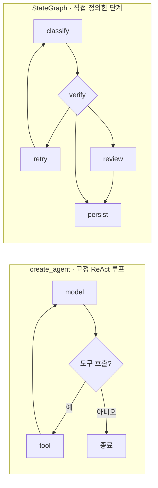
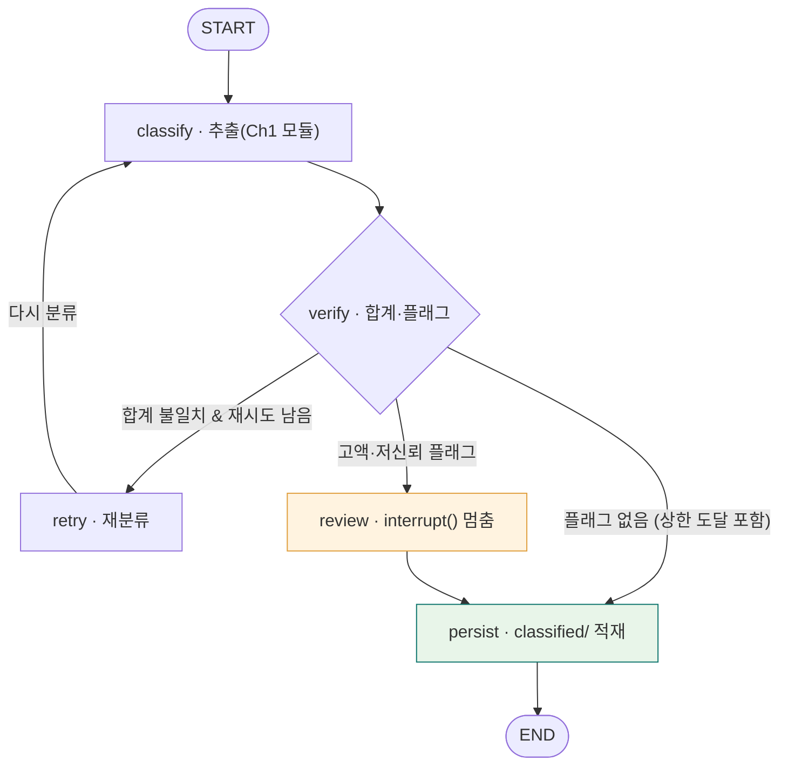
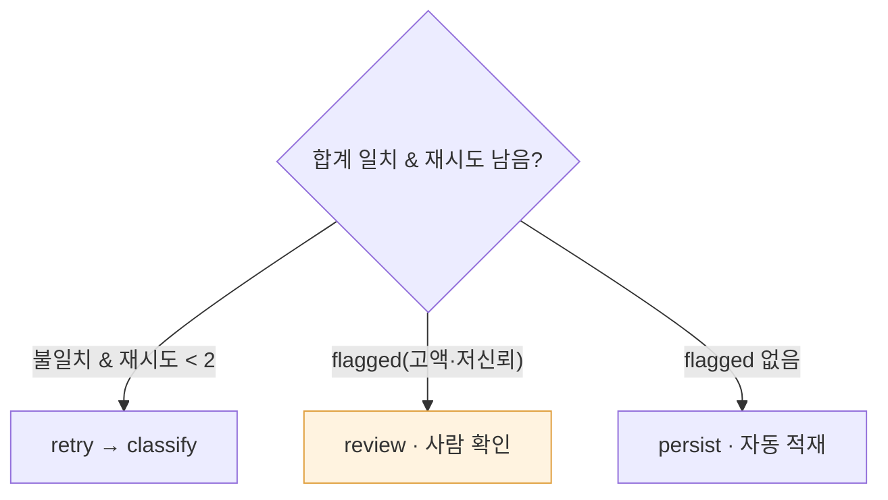
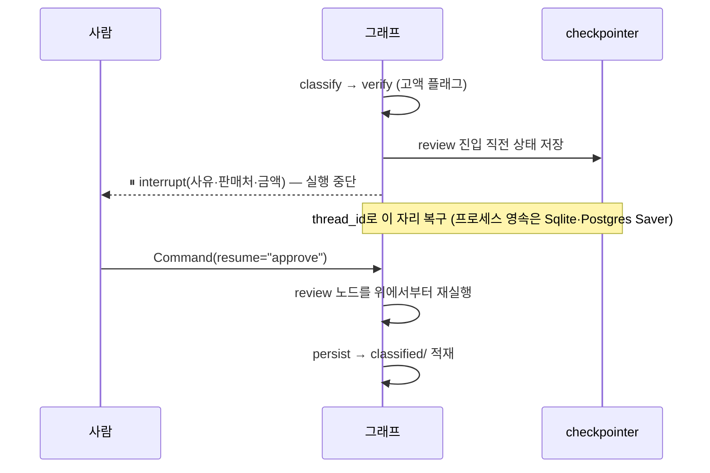

<div class="lec">
<div class="deck">

<section class="slide hero">
<div>
<div class="eyebrow">Chapter 2 · LangGraph 하네스</div>

# 파이프라인을 그래프로<br>정의한다

<p class="lead">Ch1의 단발 추출은 한 장을 읽고 끝났습니다. 인박스에는 열 건이 들어옵니다.<br>
이 챕터에서는 분류와 정규화를 상태·재시도·중단점이 있는 파이프라인으로 묶습니다. 고액이나 저신뢰 건은 자동으로 통과시키지 않고 사람에게 멈춰 묻습니다.</p>

<div class="kicker">
<div class="metric"><span class="num">70</span><strong>분</strong><span>이론 37 · 핸즈온 30</span><span class="clk">예상 10:05–11:15</span></div>
<div class="metric"><span class="num">2</span><strong>번째 모듈</strong><span>intake_graph.py</span></div>
<div class="metric"><span class="num">10</span><strong>건 적재</strong><span>classified/*.json</span></div>
</div>
</div>

<div class="board">
<div class="board-header"><span>이 챕터가 끝나면</span><span class="status-pill">산출물</span></div>
<div class="stack">
<div class="row"><div class="code">1</div><div class="copy"><strong>분류·정규화 StateGraph</strong><p>classify → verify →〈retry|review〉→ persist</p></div><div class="store">그래프</div></div>
<div class="row"><div class="code">2</div><div class="copy"><strong>checkpointer 재개</strong><p>멈춘 자리에서 같은 thread로 이어 실행</p></div><div class="store">상태</div></div>
<div class="row"><div class="code">3</div><div class="copy"><strong>interrupt() HITL</strong><p>고액·저신뢰 건은 사람 승인 후 적재</p></div><div class="store">멈춤</div></div>
</div>
</div>
</section>

<section class="slide">
<div class="section-head">
<div>
<div class="eyebrow">1 · 두 갈래 · 6분</div>

## create_agent와 StateGraph

</div>
<p class="section-note">LangChain 1.0의 <code>create_agent</code>는 표준 ReAct 루프를 한 줄로 만듭니다. 모델이 도구 선택과 반복 여부를 정합니다.<br>
우리 적재 파이프라인은 순서가 정해져 있습니다. 분류한 다음 검증하고, 고액이면 멈추고, 끝나면 적재합니다. 이렇게 단계를 직접 정의할 때는 StateGraph가 맞습니다.</p>
</div>

<div class="grid-2">
<div class="panel"><div class="panel-head"><strong>create_agent — 자율 루프</strong><span>langchain.agents</span></div><div class="panel-body"><div class="list">
<p>한 줄로 ReAct 에이전트를 만듭니다</p>
<p>도구 선택과 반복을 모델이 정합니다</p>
<p>표준 루프로 충분할 때 가볍게 씁니다</p>
</div></div></div>
<div class="panel"><div class="panel-head"><strong>StateGraph — 명시한 파이프라인</strong><span>langgraph.graph</span></div><div class="panel-body"><div class="list">
<p>노드와 엣지로 단계를 직접 그립니다</p>
<p>분기·재시도·중단점을 내가 통제합니다</p>
<p>적재 파이프라인처럼 순서가 있는 일에 맞습니다</p>
</div></div></div>
</div>

<div class="panel" style="margin-top:16px">
<div class="panel-head"><strong>같은 그래프지만 모양이 다르다</strong><span>고정 루프 vs 직접 정의한 단계</span></div>
<div class="panel-body">



</div>
</div>

```python
# create_agent — 표준 ReAct는 한 줄
from langchain.agents import create_agent
agent = create_agent("openai:google/gemini-3.5-flash", tools=[...])

# create_agent도 내부적으로 StateGraph를 컴파일해 돌려준다(CompiledStateGraph).
# 다만 그 그래프는 ReAct 루프 모양으로 고정 — 단계를 직접 정의하려면 StateGraph를 손으로 짠다 ↓
```

<p class="section-note" style="margin-top:10px"><code>"openai:google/gemini-3.5-flash"</code>가 오타처럼 보이지만 맞습니다 — <code>openai:</code> 접두사는 <strong>OpenAI 호환 게이트웨이(OpenRouter)</strong>로 부른다는 표시이고, 실제 모델은 <code>google/gemini-3.5-flash</code>입니다(Ch0의 게이트웨이 설정 그대로). 이후 챕터의 <code>openai:</code>도 모두 같은 뜻입니다.</p>

<p class="section-note" style="margin-top:16px"><code>create_agent</code>는 LangGraph 1.0 이전의 <code>create_react_agent</code>를 대체했습니다. 둘 다 같은 <code>CompiledStateGraph</code>를 돌려줍니다. 차이는 자유도이고, 그 자유도의 핵심은 LangChain 1.0이 더한 <strong>미들웨어</strong>(<code>before_model</code>·<code>after_model</code> 훅)입니다 — Ch3의 <code>create_deep_agent</code>는 바로 이 <code>create_agent</code>에 미들웨어를 기본 탑재한 확장입니다.</p>

<div class="board" style="margin-top:18px">
<div class="board-header"><span>프레임워크가 지우는 것 — 손으로 짠 루프</span><span class="status-pill">왜 필요한가</span></div>
<div class="panel-body">

```python
# create_agent 한 줄이 감춘 것: ReAct 루프를 직접 짜면 이렇다
messages = [HumanMessage(prompt)]
for _ in range(MAX_STEPS):
    ai = llm.bind_tools(tools).invoke(messages)   # 모델 호출
    messages.append(ai)
    if not ai.tool_calls:                          # 도구 안 부르면 종료
        break
    for tc in ai.tool_calls:                       # 도구 실행 → 관측을 되돌림
        messages.append(ToolMessage(run_tool(tc), tool_call_id=tc["id"]))
```

<p style="margin-top:8px">동작은 하지만 <strong>상태·에러·재시도·분기·중단점이 전부 내 몫</strong>입니다. 조건이 늘면 이 루프가 얽혀 관리하기 어려워집니다. 그래서 이 챕터에서는 단계를 노드·엣지로 다루는 StateGraph로 올라갑니다.</p>
</div>
</div>
</section>

<section class="slide">
<div class="section-head">
<div>
<div class="eyebrow">2 · 해부 · 8분</div>

## 노드 · 엣지 · 상태

</div>
<p class="section-note">StateGraph는 세 가지로 이뤄집니다. 상태는 노드 사이를 흐르는 데이터, 노드는 그 상태를 받아 갱신하는 함수, 엣지는 다음에 어디로 갈지입니다.<br>
적재 파이프라인의 상태는 문서 한 장의 처리 맥락입니다. 어떤 문서인지, 추출한 레코드, 재시도 횟수, 검토 사유를 담습니다.</p>
</div>

```python
class IntakeState(TypedDict, total=False):
    doc: str        # sample_inbox 파일명
    mock: bool      # --mock 플래그(gold로 추출, 키 불필요)
    record: dict    # 추출한 RecordV1 (노드 사이로 운반)
    retries: int    # 재분류 횟수
    flagged: str    # 사람 검토 사유("" 면 자동 통과)
    sum_ok: bool    # 영수증 합계 검증 결과(분기용)
```

<div class="panel">
<div class="panel-head"><strong>다섯 노드와 분기 — verify가 세 갈래로 갈라진다</strong><span>그래프 토폴로지</span></div>
<div class="panel-body">



</div>
</div>

<div class="flow flow-5" style="margin-top:14px">
<div class="flow-step"><small>classify</small><strong>추출</strong><p>Ch1 모듈을 그대로 불러 영수증→RecordV1</p></div>
<div class="flow-step"><small>verify</small><strong>검증·분기</strong><p>합계를 보고, 어긋나면 retry로 되돌린다</p></div>
<div class="flow-step"><small>retry</small><strong>재분류</strong><p>상한(2회)까지 classify로 되돌아간다</p></div>
<div class="flow-step"><small>review</small><strong>사람 확인</strong><p>고액·저신뢰 플래그면 interrupt()로 멈춤</p></div>
<div class="flow-step"><small>persist</small><strong>적재</strong><p>classified/&lt;문서&gt;.json 으로 저장한다</p></div>
</div>

<p class="section-note" style="margin-top:16px">classify는 Ch1의 <code>extract</code>를 그대로 부릅니다. 모듈을 바꾸더라도 계약은 재사용한다는 원칙이 여기서 처음 작동합니다.</p>
</section>

<section class="slide">
<div class="section-head">
<div>
<div class="eyebrow">3 · 분기 · 8분</div>

## 검증이 틀리면 되돌린다

</div>
<p class="section-note">verify가 영수증 합계를 봅니다. 항목 금액에 수량을 곱해 더한 값이 총액과 어긋나면 잘못 읽은 것입니다.<br>
이때 조건부 엣지가 실행을 classify로 되돌립니다. 상한까지 다시 읽고, <strong>합계가 끝내 안 맞아도 고액·저신뢰(flagged)면 사람 검토(review)를 거쳐</strong> 적재합니다. 단 <em>flagged가 아닌 소액</em>은 합계가 틀린 채로 그냥 적재됩니다. 사람 검토는 "고액·저신뢰에만 건다"는 <strong>의도된 트레이드오프</strong>이지, 모든 불일치를 막는 보장이 아닙니다.</p>
</div>

```python
def after_verify(state: IntakeState) -> str:
    if state.get("sum_ok", True) is False and state["retries"] < MAX_RETRY:
        return "retry"                          # 합계 불일치 — 상한까지 재분류
    # flagged(고액·저신뢰)면 항상 review 경유. 그 외(소액)는 합계 틀려도 적재 — 의도된 트레이드오프.
    return "review" if state["flagged"] else "persist"

g.add_conditional_edges("verify", after_verify,
                        {"retry": "retry", "review": "review", "persist": "persist"})
```

<div class="panel" style="margin-top:16px">
<div class="panel-head"><strong>after_verify가 고르는 세 갈래</strong><span>조건부 분기</span></div>
<div class="panel-body">



</div>
</div>

<div class="board" style="margin-top:18px">
<div class="board-header"><span>재시도는 무한 루프가 아니다</span><span class="status-pill">상한</span></div>
<div class="panel-body"><div class="list">
<p>같은 실패를 계속 반복하면 비용만 듭니다. <code>MAX_RETRY</code>로 두 번까지만 되돌리고, 넘으면 사람이 볼 큐로 보냅니다.</p>
<p><code>temperature=0</code>이어도 출력이 완전히 결정적이진 않아, 같은 입력에서도 추출이 흔들릴 수 있습니다(Ch1에서 본 비결정성).</p>
<p>평소 mock은 gold가 고정이라 합계가 맞아 retry가 안 뜹니다(라이브 추출에선 비결정성으로 흔들려 의미가 있습니다). 그래서 <strong>아래 <code>--break-sum</code>으로 일부러 깨</strong> retry 루프를 눈으로 봅니다 — 한계를 정해 두는 게 하네스의 일입니다.</p>
</div></div>
</div>

<div class="cue do" style="margin-top:14px">
<div class="cue-head"><span class="cue-label">✋ 직접 해보기 — retry를 눈으로</span><span class="cue-time">~3분</span></div>
<div class="cue-body"><code>--break-sum</code>으로 합계를 일부러 1원 깨고 돌려 보세요: <code>uv run python3 ch2-langgraph-agent/intake_graph.py --mock --break-sum --doc receipt_gs25.png</code>. 이 플래그는 <em>매 재분류마다</em> 합계를 다시 깨므로 끝내 안 맞은 채 <code>[verify] 불일치 → [retry] 1/2 → 2/2 → dry-run</code>으로 흐릅니다. retry 루프와 상한(2회)을 보되, 다음 장 산출물을 오염시키지 않도록 JSON은 쓰지 않습니다.</div>
</div>
</section>

<section class="slide">
<div class="section-head">
<div>
<div class="eyebrow">4 · 상태 · 7분</div>

## checkpointer가 자리를 기억한다

</div>
<p class="section-note">interrupt로 멈추면 그 순간의 상태를 어딘가 저장해야 재개할 수 있습니다. 그 일을 checkpointer가 합니다.<br>
<code>thread_id</code>로 실행을 구분합니다. 같은 thread로 다시 부르면 멈춘 자리부터 이어집니다. 다른 thread면 새 실행입니다.</p>
</div>

```python
graph = g.compile(checkpointer=InMemorySaver())
config = {"configurable": {"thread_id": f"intake-{doc}"}}

result = graph.invoke(state, config=config)
if result.get("__interrupt__"):                  # 멈춤은 예외가 아니라 반환값 안에 온다
    payload = result["__interrupt__"][0].value   # 멈춘 사유(고액·저신뢰)
    # ... 사람의 결정을 받은 뒤 ...
    graph.invoke(Command(resume="approve"), config=config)  # 같은 자리에서 재개
```

<p class="section-note" style="margin-top:12px">핵심: <strong>멈춤은 예외가 아니라 반환값 안의 <code>__interrupt__</code></strong>로 옵니다. <code>graph.invoke</code>가 정상 반환하되 결과에 <code>__interrupt__</code> 키가 있으면 거기서 멈춘 것이고, <code>[0].value</code>가 <code>interrupt()</code>에 넘긴 사유 페이로드입니다.</p>

<div class="board" style="margin-top:18px">
<div class="board-header"><span>왜 메모리에 저장하나</span><span class="status-pill">InMemorySaver</span></div>
<div class="panel-body"><div class="list">
<p>이 실습은 한 프로세스 안에서 멈췄다 재개하므로 메모리 체크포인터로 충분합니다.</p>
<p>프로덕션에서는 같은 자리에 SQLite·Postgres 체크포인터를 끼웁니다. 그래프 코드는 그대로 두고 저장소만 바꿉니다. 이것도 모듈 교체입니다.</p>
</div></div>
</div>

<div class="board" style="margin-top:18px">
<div class="board-header"><span>이게 왜 중요한가 — 지속 실행</span><span class="status-pill">durable execution</span></div>
<div class="panel-body"><div class="list">
<p>checkpointer는 각 <strong>superstep</strong>(LangGraph가 노드를 실행하는 단위)이 끝날 때마다 상태를 저장합니다. 그래서 interrupt뿐 아니라 <strong>중간에 끊겨도</strong> 같은 thread로 다시 부르면 마지막 superstep부터 이어집니다 — 처음부터 다시 안 합니다.</p>
<p class="muted" style="margin-top:6px">단, 우리 데모의 <code>InMemorySaver</code>는 <strong>같은 프로세스 안에서만</strong> 상태를 들고 있습니다(예외를 잡고 재시도, 같은 런 안의 재개). 프로세스가 정말 죽었다 살아나도 복구하려면 디스크에 쓰는 영속 체크포인터(<code>SqliteSaver</code>·<code>PostgresSaver</code>)가 필요합니다 — 인터페이스는 같고 저장소만 바뀝니다.</p>
<p>Ch3에서 여러 문서를 동시에 조사할 때 이 성질이 비용을 아낍니다. 여러 갈래 중 일부가 끝난 뒤 끊겨도, 재개는 남은 것만 처리합니다.</p>
</div></div>
</div>
</section>

<section class="slide">
<div class="section-head">
<div>
<div class="eyebrow">5 · 멈춤 · 8분</div>

## 자동으로 넘기지 않는 것들

</div>
<p class="section-note">분류가 늘 맞지는 않습니다. 금액이 크거나 모델이 확신하지 못한 건을 자동으로 적재하면 틀린 데이터가 조용히 쌓입니다.<br>
그래서 review 노드에서 interrupt()로 멈춰 사람에게 묻습니다. 승인하면 적재하고, 반려하면 보류합니다.</p>
</div>

```python
def review(state: IntakeState) -> dict:
    decision = interrupt({                  # 여기서 실행이 멈춘다
        "사유": state["flagged"],           # 고액 / 저신뢰
        "판매처": state["record"]["판매처"],
        "금액": state["record"]["금액"],
        "질문": "이 분류를 그대로 적재할까요? (approve / reject)",
    })
    # approve일 때만 통과. reject·오타·빈 응답은 안전하게 보류한다(fail-closed).
    return {"flagged": "" if decision == "approve" else "rejected"}
```

<div class="board" style="margin-top:18px">
<div class="board-header"><span>재개하면 노드가 처음부터 다시 돈다</span><span class="status-pill">주의</span></div>
<div class="panel-body"><div class="list">
<p><code>Command(resume=...)</code>로 이어지면 LangGraph는 멈췄던 <strong>노드 전체를 위에서 다시 실행</strong>합니다. <code>interrupt()</code> 앞 코드도 한 번 더 돌고, 그 지점에서 <code>interrupt()</code>가 저장해 둔 결정값을 돌려줄 뿐입니다.</p>
<p>그래서 <code>interrupt()</code> 앞에 DB 쓰기·카운터 증가 같은 부수효과를 두면 두 번 실행됩니다. 우리 <code>review</code>는 앞에서 state를 읽기만 하므로 안전합니다 — 부수효과는 전부 뒤 노드(<code>persist</code>)로 미룹니다.</p>
</div></div>
</div>

<div class="panel" style="margin-top:18px">
<div class="panel-head"><strong>멈췄다 사람을 거쳐 재개하기까지</strong><span>interrupt → resume 시간축</span></div>
<div class="panel-body">



</div>
</div>

<div class="grid-2">
<div class="panel"><div class="panel-head"><strong>멈추는 기준</strong><span>이 실습의 임계값</span></div><div class="panel-body"><div class="list">
<p>고액 — 총액 1,000,000원 이상</p>
<p>저신뢰 — 추출 신뢰도 0.7 미만</p>
</div></div></div>
<div class="panel"><div class="panel-head"><strong>실제로 멈추는 건</strong><span>sample_inbox · --mock</span></div><div class="panel-body"><div class="list">
<p>명세서(invoice_photo) 1,650,000원 · 용역 계약 3,000,000원 — 고액 2건</p>
<p>mock은 gold를 그대로 써 신뢰도가 1.0으로 주입됩니다. <strong>저신뢰 분기는 키 있는 라이브 실행에서만</strong> 걸립니다</p>
</div></div></div>
</div>

<div class="ask"><strong>생각해보기.</strong> 만약 <code>compile()</code>에 checkpointer를 빼면 interrupt가 동작할까요? 그리고 같은 <code>thread_id</code>로 다시 부르면 무슨 일이 일어날까요?</div>

<details>
<summary>정답 확인</summary>
<div class="reveal">
<p>checkpointer 없이도 <code>interrupt()</code> <strong>자체는 동작합니다</strong> — <code>invoke</code>가 에러 없이 결과에 <code>__interrupt__</code>를 담아 반환하고 그 자리에서 멈춥니다. 막히는 건 <strong>재개할 때</strong>입니다. 멈춘 실행을 <code>Command(resume=...)</code>로 이어가려 하면 그때 <code>RuntimeError: Cannot use Command(resume=...) without checkpointer</code>가 납니다 — 멈춘 상태를 저장한 곳이 없어 어디로 돌아갈지 모르기 때문입니다. 즉 <em>멈출 순 있어도 사람 결정을 받아 이어갈 수 없으니</em>, HITL에는 checkpointer가 필수입니다.</p>
<p>같은 <code>thread_id</code>로 다시 부르면 저장된 그 자리부터 이어집니다. <code>Command(resume="approve")</code>가 멈춘 review 노드로 결정을 흘려보내 다음 단계(persist)로 넘어갑니다. 다른 thread_id면 처음부터 새 실행입니다.</p>
</div>
</details>
</section>

<section class="slide">
<div class="section-head">
<div>
<div class="eyebrow">핸즈온 ① · 코드 정독 · 8분</div>

## 그래프를 손으로 엮는다

</div>
<p class="section-note">노드 다섯 개를 엣지로 잇습니다. 한 줄씩 읽으면 분류 파이프라인이 그대로 그림으로 보입니다. 분기 하나(verify 다음)만 조건부고 나머지는 직선입니다.</p>
</div>

<div class="panel">
<div class="panel-head"><strong>ch2-langgraph-agent/intake_graph.py — build_graph</strong><span>노드·엣지·체크포인터</span></div>
<div class="panel-body">

<<< ../../ch2-langgraph-agent/intake_graph.py#build-graph{python}

</div>
</div>

<div class="grid-2" style="margin-top:16px">
<div class="panel"><div class="panel-head"><strong>직선 엣지 vs 조건부 엣지</strong></div><div class="panel-body"><div class="list">
<p><code>add_edge(A, B)</code> — 늘 A 다음 B. 분류→검증처럼 정해진 길.</p>
<p><code>add_conditional_edges(verify, after_verify, {...})</code> — <code>after_verify</code>가 돌려준 문자열로 다음 노드를 고릅니다.</p>
</div></div></div>
<div class="panel"><div class="panel-head"><strong>after_verify가 고르는 세 길</strong></div><div class="panel-body"><div class="list">
<p>합계 불일치 → <code>retry</code>(상한 전), 플래그 있음 → <code>review</code>, 그 외 → <code>persist</code>.</p>
<p>노드 이름과 함수 이름은 달라도 됩니다 — <code>add_node("retry", bump_retry)</code>. 매핑의 <code>"retry"</code>는 <strong>노드 이름</strong>이지 <code>bump_retry</code> 함수가 아닙니다.</p>
</div></div></div>
</div>
</section>

<section class="slide">
<div class="section-head">
<div>
<div class="eyebrow">핸즈온 ② · 단계별 실행 · 14분</div>

## 흘려보내고 멈춤을 본다

</div>
<p class="section-note">전체를 한 번 흘리고, 고액 한 건만 따로 돌려 interrupt를 눈으로 보고, 반려도 해 봅니다. 각 단계의 성공 기준을 확인하세요.</p>
</div>

<div class="stack">
<div class="row"><div class="code">1</div><div class="copy"><strong>전체 적재 — 자동 승인</strong><p><code>uv run python3 ch2-langgraph-agent/intake_graph.py --mock</code><br><span style="color:var(--muted)">성공 기준: 10건이 흐르고 고액 2건(invoice_photo·contract_freelance)에서 ⏸ interrupt 뒤 자동 승인 → <code>workspace/classified/</code>에 JSON 10개. (신뢰도는 mock에서 1.0이라 저신뢰 멈춤은 없습니다.)</span></p></div><div class="store">10건</div></div>
<div class="row"><div class="code">2</div><div class="copy"><strong>한 건만 — 멈춤 관찰</strong><p><code>uv run python3 ch2-langgraph-agent/intake_graph.py --mock --doc invoice_photo.png</code><br><span style="color:var(--muted)">성공 기준: <code>⏸ interrupt — 고액(1,650,000원)</code> 줄이 보이고 review→persist로 이어진다.</span></p></div><div class="store">interrupt</div></div>
<div class="row"><div class="code">3</div><div class="copy"><strong>검토건 반려</strong><p><code>uv run python3 ch2-langgraph-agent/intake_graph.py --mock --reject-flagged</code><br><span style="color:var(--muted)">성공 기준: 고액 건이 <code>[review] 보류 — 적재 안 함</code>으로 빠지고, 기존 JSON이 있으면 제거된다. 다시 정상 산출물을 만들려면 1번 전체 적재를 한 번 더 실행한다.</span></p></div><div class="store">보류</div></div>
</div>

<div class="cue do">
<div class="cue-head"><span class="cue-label">✋ 직접 해보기</span><span class="cue-time">~5분</span></div>
<div class="cue-body">먼저 1번 명령 <code>uv run python3 ch2-langgraph-agent/intake_graph.py --mock</code>을 그대로 실행하세요. 10건이 흐르고 고액 2건에서 ⏸ 줄이 떠야 정상입니다. 이어 2번 <code>--doc invoice_photo.png</code>로 한 건만 돌려 멈춤을 또렷이 보세요.</div>
</div>

<div class="panel" style="margin-top:18px">
<div class="panel-head"><strong>출력 — 고액 건에서 멈췄다 재개</strong><span>invoice_photo.png</span></div>
<div class="panel-body">

```text
▶ invoice_photo.png
  [classify] 디자인스튜디오 레이 · 1,650,000원 · 신뢰도 1.00
  [verify] 통과 · 검토 필요: 고액(1,650,000원)
  ⏸ interrupt — 고액(1,650,000원) · 디자인스튜디오 레이 1,650,000원 → 자동 결정 'approve'
  [review] 승인 — 적재 진행
  [persist] → workspace/classified/invoice_photo.json
```

</div>
</div>

<div class="cue wait">
<div class="cue-head"><span class="cue-label">⏳ 기다렸다 확인</span><span class="cue-time">~20초</span></div>
<div class="cue-body"><code>⏸ interrupt — 고액(1,650,000원)</code> 줄에서 그래프가 사람 결정을 기다립니다. 이 실습은 <code>approve</code>로 자동 응답하도록 짜여 있으니, 그 뒤 <code>[review] 승인</code>→<code>[persist]</code>까지 이어지는지 확인하세요. <code>--reject-flagged</code>로 돌리면 같은 자리에서 반려되어 JSON이 안 생기는 것까지 보면 HITL 한 바퀴를 다 본 셈입니다.</div>
</div>

<div class="cue solve">
<div class="cue-head"><span class="cue-label">✏️ 풀어보기</span><span class="cue-time">~4분</span></div>
<div class="cue-body"><code>HIGH_VALUE</code> 임계값을 <code>10000</code>으로 낮춰 보세요. interrupt가 몇 건에서 걸릴까요? 반대로 <code>5000000</code>으로 올리면?</div>
</div>

<details>
<summary>관찰 포인트</summary>
<div class="reveal">
<p><code>10000</code>으로 낮추면 대부분의 영수증·명세서가 고액으로 걸려 interrupt가 쏟아집니다. 사람이 일일이 승인해야 하니 자동화 효과가 사라집니다.</p>
<p><code>5000000</code>으로 올리면 아무것도 안 걸려 전부 자동 적재됩니다. 틀린 분류도 그냥 통과합니다. 임계값은 "자동화 vs 안전"의 손잡이입니다. 도메인에 맞게 잡는 게 설계입니다.</p>
</div>
</details>
</section>

<section class="slide">
<div class="section-head">
<div>
<div class="eyebrow">핸즈온 ③ · 트러블슈팅 · 참고</div>

## 막히면 여기부터

</div>
<p class="section-note">그래프가 안 도는 대부분은 분기 함수나 상태 키 문제입니다.</p>
</div>

<div class="grid-2">
<div class="panel"><div class="panel-head"><strong>interrupt가 안 걸림</strong><span>HITL</span></div><div class="panel-body"><div class="list">
<p><code>compile(checkpointer=...)</code>를 빠뜨렸거나, 고액·저신뢰 기준에 걸리는 문서가 없습니다. <code>--doc invoice_photo.png</code>로 확인하세요.</p>
</div></div></div>
<div class="panel"><div class="panel-head"><strong>KeyError: state 키</strong><span>상태</span></div><div class="panel-body"><div class="list">
<p>노드가 돌려준 dict의 키가 <code>IntakeState</code>에 없으면 무시되거나 깨집니다. TypedDict에 필드를 선언했는지 봅니다.</p>
</div></div></div>
<div class="panel"><div class="panel-head"><strong>분기에서 멈춤</strong><span>조건부 엣지</span></div><div class="panel-body"><div class="list">
<p><code>after_verify</code>가 돌려준 문자열이 매핑 dict의 키와 정확히 같아야 합니다. 오타면 그래프가 갈 곳을 잃습니다.</p>
</div></div></div>
<div class="panel"><div class="panel-head"><strong>재개가 안 됨</strong><span>thread_id</span></div><div class="panel-body"><div class="list">
<p>재개할 때 처음과 <strong>같은</strong> <code>thread_id</code>를 써야 멈춘 자리를 찾습니다. 매번 새로 만들면 처음부터 실행됩니다.</p>
</div></div></div>
</div>

<p class="section-note" style="margin-top:16px">전체 실행 파일은 <code>ch2-langgraph-agent/intake_graph.py</code>. classify는 Ch1의 <code>extract</code>를 import해 그대로 씁니다. 모듈 교체·계약 재사용의 첫 작동입니다.</p>
</section>

<section class="slide">
<div class="section-head">
<div>
<div class="eyebrow">마무리 · 3분</div>

## 다음 — 한 장씩 말고, 한꺼번에

</div>
<p class="section-note">이제 인박스가 정규화된 레코드 열 건으로 정리됐습니다. StateGraph는 파이프라인을 명시적으로 통제하지만 단계를 우리가 다 정의해야 합니다.<br>
Ch3에서는 여러 문서를 서브에이전트가 나눠 동시에 조사하고, 그 계획과 파일 관리를 하네스에 맡깁니다.</p>
</div>

<div class="board" style="margin-top:18px">
<div class="board-header"><span>직접 만들면 — 하네스가 해결하는 것</span><span class="status-pill">Ch3 동기</span></div>
<div class="panel-body"><div class="list">
<p>이 그래프에 "문서 100건을 장기 실행으로 조사" 같은 일을 얹으려면 파일 입출력·할 일 목록·배치 처리·컨텍스트 관리 코드가 줄줄이 붙습니다 — 매 프로젝트 ~100줄의 보일러플레이트.</p>
<p>그 반복을 미리 묶어 둔 게 <strong>하네스</strong>입니다. Ch3 DeepAgents는 계획(write_todos)·파일시스템·서브에이전트를 기본 제공해, 우리는 "무엇을 조사할지"만 적습니다.</p>
</div></div>
</div>

<div class="grid-3">
<div class="panel"><div class="panel-head"><strong>이번 챕터 결과</strong></div><div class="panel-body"><div class="list">
<p>분류·정규화 파이프라인</p>
<p>classified/ 열 건 · 재시도 · HITL</p>
</div></div></div>
<div class="panel"><div class="panel-head"><strong>Ch3에서 할 것</strong></div><div class="panel-body"><div class="list">
<p>DeepAgents fan-out 동시 조사</p>
<p>write_todos · 파일시스템으로 컨텍스트 덜어내기</p>
</div></div></div>
<div class="panel"><div class="panel-head"><strong>최종 목적지</strong></div><div class="panel-body"><div class="list">
<p>인박스 입력 → 검증된 브리프</p>
<p>Ch6 통합 캡스톤</p>
</div></div></div>
</div>

<div class="board" style="margin-top:18px">
<div class="board-header"><span>참고 자료</span><span class="status-pill">출처</span></div>
<div class="panel-body"><div class="list">
<p><a href="https://langchain-ai.github.io/langgraph/">LangGraph 문서</a> · <a href="https://langchain-ai.github.io/langgraph/how-tos/human_in_the_loop/">Human-in-the-loop (interrupt)</a></p>
<p><a href="https://python.langchain.com/docs/concepts/agents/">LangChain create_agent</a> · <a href="https://langchain-ai.github.io/langgraph/concepts/persistence/">Checkpointer·Persistence</a></p>
</div></div>
</div>
</section>


<nav class="chapnav">
<div class="board" style="margin-top:8px">
<div style="display:grid;grid-template-columns:1fr auto 1fr;gap:14px;align-items:center">
<a href="/deepagents-handson/chapters/chapter-1" style="color:inherit;text-decoration:none;font-weight:900;font-size:14px">← Ch1 · 에이전트 패러다임</a>
<a href="/deepagents-handson/toc" style="color:var(--forest);text-decoration:none;font-weight:900;font-size:13px;background:rgba(148,210,189,.3);border:1px solid rgba(15,118,110,.24);border-radius:99px;padding:7px 16px">목차</a>
<a href="/deepagents-handson/chapters/chapter-3" style="color:inherit;text-decoration:none;font-weight:900;font-size:14px;text-align:right">Ch3 · DeepAgents 하네스 →</a>
</div>
</div>
</nav>

</div>
</div>
