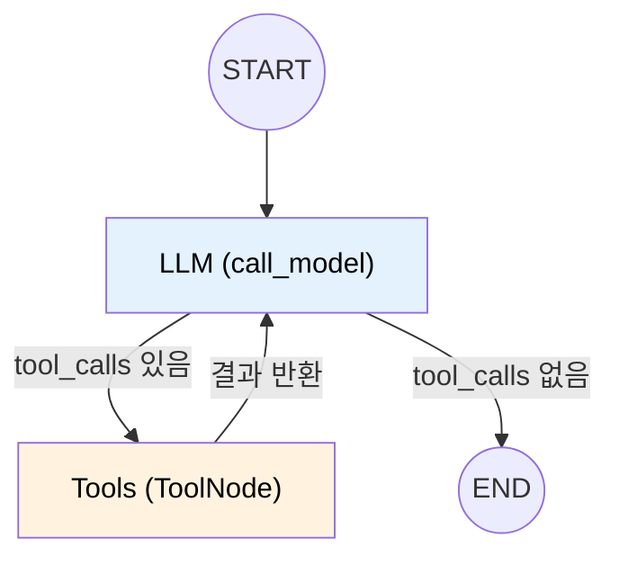
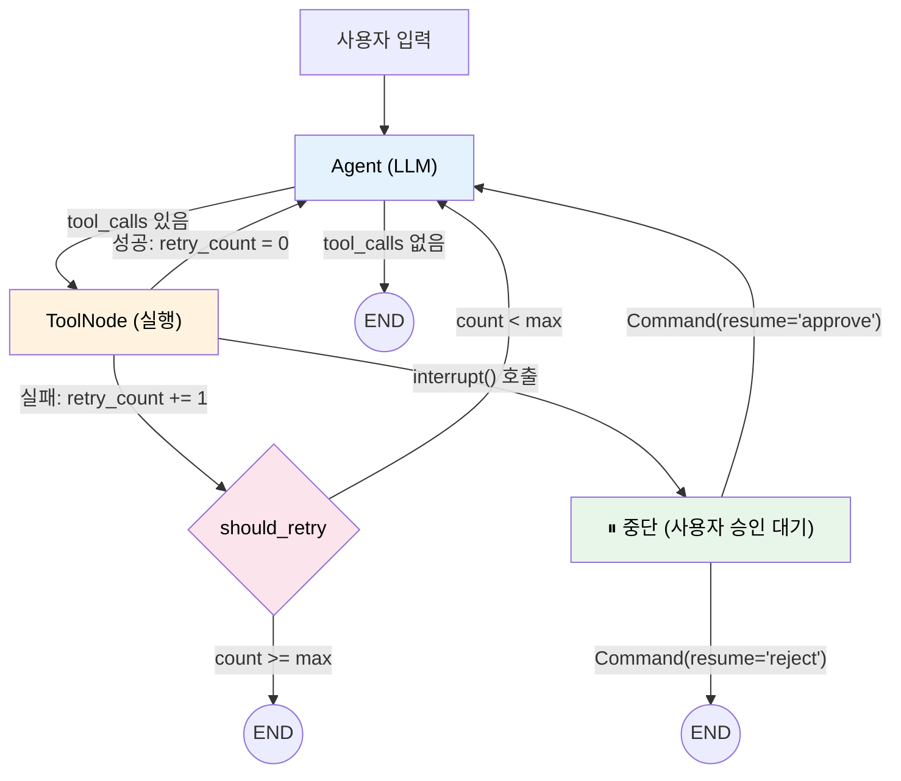
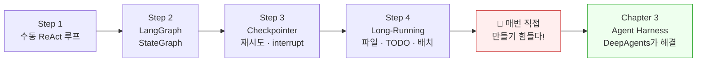

# Chapter 2. LangChain/LangGraph로 Agent 구성, Harness 구조 이해

> **학습 목표**
> - [ ] LangChain으로 기본 Agent Loop를 구현할 수 있다
> - [ ] LangGraph의 StateGraph로 노드/엣지 기반 Agent를 구성할 수 있다
> - [ ] Checkpointer와 Human-in-the-Loop 패턴을 이해하고 적용할 수 있다
> - [ ] Long-Running Agent의 어려움을 체험하고, Harness 필요성을 설명할 수 있다

| 소요시간 | 학습방법 |
|---------|---------|
| 2.0h | 이론/실습 |

---

<p align="right"><sub style="color:gray">⏱ 10:00 – 시작</sub></p>

## 이 챕터의 여정

Ch1에서 LLM의 한계와 Agent의 필요성을 이론으로 살펴보았습니다. 이제 **직접 코드로 Agent를 만들면서** 그 개념을 체험합니다.

4단계로 진행되며, 각 단계는 이전 단계의 한계를 해결하는 구조입니다.

```
Step 1: 수동 Agent Loop     → "돌아가지만 관리가 안 된다"
Step 2: LangGraph로 선언적 전환 → "그래프로 깔끔해졌지만 상태가 휘발된다"
Step 3: 상태 저장·재시도·HITL  → "견고해졌지만 긴 작업은 여전히 힘들다"
Step 4: Long-Running 직접 구현 → "결국 보일러플레이트가 너무 많다 → Ch3에서 해결!"
```

이 흐름을 따라가면서 Ch3의 DeepAgents가 **왜 필요한지** 경험해보겠습니다.

---

<p align="right"><sub style="color:gray">⏱ 10:03</sub></p>

## 실습 환경 설계

### 환경 구성 배경

| 챕터  | 사용 기술                | 비고                   |
| --- | -------------------- | -------------------- |
| Ch1 | 이론                   | 코드 없음                |
| Ch2 | LangChain, LangGraph | Python 지원            |
| Ch3 | DeepAgents           | Linux(WSL) 필요        |
| Ch4 | MCP Python SDK       | stdio transport 사용   |
| Ch5 | a2a-sdk, uvicorn     | Python 지원            |
| Ch6 | 통합                   | DeepAgents 포함        |

Ch3·Ch6이 Linux 환경을 필요로 하므로, 본 교육은 **WSL2 (Ubuntu 24.04)** 환경에서 진행합니다.

### 권장 구성

```
[수강생 PC — Windows 11]
├── WSL2 (Ubuntu 24.04 LTS)
│   ├── Python 3.12 (Ubuntu 24.04 기본 탑재)
│   ├── uv (패키지 매니저)
│   ├── 실습 코드
│   └── API 키 (.env)
├── VS Code + WSL 익스텐션
└── 외부망 (OpenRouter API 호출용)
```

### 사전 준비 체크리스트

**Step 1: WSL2 설치** (PowerShell 관리자 권한 — Windows만 해당)

이미 Ubuntu-24.04가 설치되어 있다면 새로 설치할 필요 없이 바로 진입합니다.

```bash
# 이미 설치된 배포판 확인
wsl --list --verbose
# NAME                   STATE           VERSION
# Ubuntu-24.04           Stopped         2       ← 이미 있음

# 기존 배포판에 진입
wsl -d Ubuntu-24.04
```


>[!error] 설치되어있지 않을때만!
```bash
wsl --install -d Ubuntu-24.04
```

처음 설치한 경우 사용자 계정 생성 화면이 나옵니다.

```
Enter new UNIX username: sdsclass
New password: (비밀번호 입력: 123 추천)
```

> **macOS/Linux** : WSL2 설치 단계를 건너뛰고, 아래 Step 2부터 시작하면 됩니다.

>[!warning] WSL 환경 설정 시 자주 발생하는 문제들
>
> **1. WSL이 버전 1로 설치된 경우**
> ```powershell
> # PowerShell에서 확인
> wsl -l -v
> # VERSION이 1이면 아래 명령으로 변환
> wsl --set-version Ubuntu-24.04 2
> ```
>
> **2. `sudo` 비밀번호를 모르거나 잊은 경우**
> Windows PowerShell에서 root로 진입하여 재설정합니다.
> ```powershell
> wsl -d Ubuntu-24.04 -u root
> # root 셸에서:
> passwd sdsclass    # 새 비밀번호 입력
> exit
> ```
>
> **3. WSL에서 `docker` 명령이 안 되는 경우 (Ch6 선택 확장에서 필요)**
> Ch6의 Mailpit(로컬 SMTP 테스트 서버) 확장 실습에서만 Docker를 사용합니다. **필수 실습 경로에서는 Docker가 필요 없습니다.** Mailpit 확장을 진행하려면 Docker Desktop의 WSL Integration 설정을 확인하세요.
> - Docker Desktop → Settings → Resources → WSL Integration → **Ubuntu-24.04 토글 ON**
> - 설정 변경 후에도 안 되면: Docker Desktop을 완전히 종료 후 재시작, 또는 PowerShell에서 `wsl --shutdown` 후 WSL 재진입
> - `docker context` 충돌 시: `docker context ls`로 현재 활성 context를 확인한 뒤, `docker context use desktop-linux`로 전환
>
> **4. `python` 명령이 없다는 에러**
> Ubuntu 24.04는 `python` 대신 `python3`를 사용합니다. 본 교재의 모든 명령은 `python3` 또는 `uv run python3`으로 표기합니다.

**Step 2: 시스템 패키지 설치** (Ubuntu 터미널 내에서)

```bash
sudo apt update && sudo apt install -y git python3 python3-pip python3-venv
```

> **주의**: `python` 명령이 없다면 위 트러블슈팅 #4를 참고하세요. 본 교재에서는 `python3`를 사용합니다.


```bash
python3 --version      # 3.12.x 출력 확인 (3.9 이상이기만 하면 큰 상관은 없습니다.)

# 필요하다면, sudo apt install python3.12
```

**Step 3: uv 설치**

```bash
curl -LsSf https://astral.sh/uv/install.sh | sh
source ~/.bashrc       # uv PATH 반영
```

**uv를 사용하는 이유**: Ubuntu 24.04는 PEP 668에 따라 시스템 Python에 직접 `pip install`이 차단됩니다. uv는 가상환경을 자동 관리하면서 pip보다 10~100배 빠르게 패키지를 설치합니다. `uv run`으로 실행하면 가상환경 활성화 없이 바로 코드를 실행할 수 있습니다.

**Step 4: 실습 코드 클론**

```bash
git clone https://github.com/Yo-sure/deepagents-handson.git ~/lecture
cd ~/lecture
```

**Step 5: VS Code WSL 익스텐션 설치**

VS Code → Extensions → "WSL" 검색 후 설치. 이후 `code .` 명령으로 WSL 디렉토리를 VS Code에서 열 수 있습니다.
![[images/Pasted image 20260227030730.png]]

**Step 6: API 키 설정**

아래에 설정할 API 키는 교육용 페이지에서 제공합니다: [교육 안내 페이지 (Notion)](https://awake-akubra-dae.notion.site/AI-Agent-Harness-26-02-3135b72b6c5480c0a13ec3bb65cb206e)

```bash
# .bashrc 백업 (수정 전 원본 보존)
cp ~/.bashrc ~/.bashrc.bak

# OpenRouter API 키 설정
cat >> ~/.bashrc << 'EOF'
export OPENROUTER_API_KEY="sk-or-..."
# Ch3 DeepAgents 등 OPENAI_API_KEY를 내부적으로 읽는 라이브러리 호환용
export OPENAI_API_KEY="$OPENROUTER_API_KEY"
export OPENAI_API_BASE="https://openrouter.ai/api/v1"
EOF
source ~/.bashrc
```

> **문제가 생겼을 때 복원하기**: `cp ~/.bashrc.bak ~/.bashrc && source ~/.bashrc` 로 백업 시점으로 되돌릴 수 있습니다.

**OpenRouter를 사용하는 이유**: 하나의 API 키로 GPT, Claude, Gemini 등 다양한 모델에 접근할 수 있는 통합 게이트웨이입니다. 본 교육에서는 agentic workflow에 최적화된 **Gemini 3 Flash Preview** 모델을 사용합니다 (1M 토큰 컨텍스트, 입력 $0.50/1M, 출력 $3.00/1M).

---

<p align="right"><sub style="color:gray">⏱ 10:13</sub></p>

## 실습 Preflight (10분)

Step 1에 들어가기 전에 아래 항목을 먼저 확인합니다.

```bash
# 1) Python + uv 확인
python3 --version   # 3.12.x 이상
uv --version        # 설치 확인

# 2) 프로젝트 의존성 설치 — 레포지토리의 pyproject.toml 사용
cd ~/lecture
uv sync              # pyproject.toml + uv.lock 기준으로 의존성 일괄 설치

# 3) API 키 확인
uv run python3 -c "import os; print('API 키 설정:', bool(os.getenv('OPENROUTER_API_KEY')))"
```

> `uv sync`는 레포지토리에 포함된 `pyproject.toml`과 `uv.lock`을 읽어 모든 의존성을 정확한 버전으로 설치합니다. 가상환경 생성과 패키지 설치가 한 번에 이루어지며, 이후 `uv run`으로 바로 코드를 실행할 수 있습니다 — 별도 `source venv/bin/activate`가 필요 없습니다.
>
> 의존성을 직접 추가해야 할 때는 `uv add 패키지명`을 사용합니다. 이 명령은 `pyproject.toml`에 패키지를 기록하고 `uv.lock`을 갱신합니다.

---

<p align="right"><sub style="color:gray">⏱ 10:20</sub></p>

## Step 1: 단일 Agent Loop (30분)

> 📂 실습 코드: `ch2-langgraph-agent/step1_basic_agent.py`

▶ 실행: 
```
uv run python3 ch2-langgraph-agent/step1_basic_agent.py
```
![[images/Pasted image 20260227041644.png]]
### 1.1 환경 준비

```bash
# Preflight에서 이미 설치했으므로, API 키만 확인합니다
echo $OPENROUTER_API_KEY   # sk-or-... 출력 확인
```

=> 여기서 출력이 안나오는 분은 윗부분의 **Step 6: API 키 설정** 를 설정하였나 확인해주세요.

### 1.2 Tool 정의

Agent가 사용할 Tool은 `@tool` 데코레이터로 정의합니다. **docstring이 LLM에게 Tool의 설명이 됩니다.**

#### `@tool`이 자동으로 해주는 것

`@tool`은 Python 함수를 LLM이 호출 가능한 Tool로 변환합니다. 내부적으로:

1. **함수 시그니처 → JSON Schema 변환**: 타입 힌트와 docstring을 파싱해 JSON Schema를 자동 생성
2. **API 요청에 포함**: `bind_tools()` 호출 시 이 스키마가 LLM API 요청의 `tools` 필드로 전송됨
3. **LLM 응답 파싱**: LLM이 `tool_calls` 필드로 호출 의사를 표현하면 LangChain이 자동으로 함수를 실행

```python
@tool
def check_inbox(filter: str = "unread") -> str:
    """메일함의 메일 목록을 확인합니다.

    Args:
        filter: 필터 조건 ("unread", "all", "important")
    """
    ...
```

위 함수가 LLM에게 전달될 때의 실제 형태:

```json
{
  "type": "function",
  "function": {
    "name": "check_inbox",
    "description": "메일함의 메일 목록을 확인합니다.",
    "parameters": {
      "type": "object",
      "properties": {
        "filter": {
          "type": "string",
          "default": "unread",
          "description": "필터 조건 (\"unread\", \"all\", \"important\")"
        }
      }
    }
  }
}
```

> **Tool 호출의 내부 동작**: GPT, Claude, Gemini 등 주요 모델은 Tool 호출 전용 학습 데이터(function calling examples)로 **fine-tuning**된 상태입니다. API에 `tools` 파라미터를 전달하면 모델은 시스템 프롬프트에 스키마를 주입받고, 학습된 패턴에 따라 JSON 형식의 `tool_calls`를 출력합니다 ([OpenAI Function Calling Docs](https://platform.openai.com/docs/guides/function-calling)). 따라서 **docstring/스키마 품질이 Tool 호출 정확도에 직접 영향**을 미칩니다.

`@tool`에 직접 인자를 넘겨 재정의할 수도 있습니다.

```python
@tool(name="inbox_check", description="Checks email inbox. Use this when user asks about emails.")
def check_inbox(filter: str = "unread") -> str:
    ...
    # name/description을 명시하면 docstring보다 우선 적용
```

> **왜 Tool description은 영어인가?**
>
> Tool 호출 정확도와 비용 모두 **영어 description이 유리**합니다.
>
> - **정확도**: "Lost in Execution" (arXiv:2601.05366, 2026)에 따르면, 비영어 프롬프트에서 Tool 호출 시 **파라미터 값의 언어 불일치**(예: 한국어 토큰이 영어 enum에 삽입)가 가장 빈번한 실패 원인입니다. 영어 description을 유지하면 이 문제를 예방할 수 있습니다.
>   
> - **토큰 효율**: BPE 토크나이저 기준 한국어는 영어 대비 약 **2.4배** 토큰을 소모합니다 (동일 의미 기준). Tool schema는 매 호출마다 전송되므로 누적 비용 차이가 큽니다.
>   ![[Pasted image 20260311000035.png]]
> ![[Pasted image 20260311000158.png]]
>
>- **내부 사고 언어**: "Do Multilingual LLMs Think In English?" (arXiv:2502.15603, 2025)는 다국어 LLM이 의미 결정을 **영어에 가까운 표현 공간**에서 수행한 후 대상 언어로 변환한다고 밝혔습니다.
>
> **권장 패턴**: `@tool`의 `name`/`description`은 영어, 코드 내 주석과 사용자 대화는 한국어.

```python
from langchain_core.tools import tool

@tool
def check_inbox(filter: str = "unread") -> str:
    """메일함의 메일 목록을 확인합니다.

    Args:
        filter: 필터 조건 ("unread", "all", "important")
    """
    # 실제로는 IMAP 등으로 메일 서버에 접속
    mock_emails = [
        {"from": "팀장님", "subject": "긴급: 서버 점검 안내"},
        {"from": "HR팀", "subject": "연말 워크숍 일정"},
    ]
    return f"📬 메일 {len(mock_emails)}통 발견"


@tool
def get_email_detail(email_index: int) -> str:
    """특정 메일의 상세 내용을 가져옵니다."""
    details = {
        1: "팀장님: 내일 오후 2시부터 서버 점검 예정입니다.",
        2: "HR팀: 연말 워크숍 일정 안내입니다.",
    }
    return details.get(email_index, "해당 메일을 찾을 수 없습니다.")
```

### 1.3 LLM에 Tool 바인딩

```python
import os
from langchain_openai import ChatOpenAI

# OpenRouter 게이트웨이를 통해 Gemini 3 Flash Preview 사용
llm = ChatOpenAI(
    model="google/gemini-3-flash-preview",
    base_url="https://openrouter.ai/api/v1",
    api_key=os.getenv("OPENROUTER_API_KEY"),
    temperature=0,
)
tools = [check_inbox, get_email_detail]

# bind_tools: LLM이 Tool의 존재를 인식하고 호출할 수 있게 함
llm_with_tools = llm.bind_tools(tools)
```

`bind_tools()` 후 LLM을 호출하면, LLM은 필요할 때 **tool_calls**를 포함한 응답을 반환합니다.

> `langchain_openai`의 `ChatOpenAI`는 OpenAI API 호환 엔드포인트라면 `base_url`만 바꿔서 사용할 수 있습니다. OpenRouter는 이 호환성을 제공하므로 코드 변경이 최소화됩니다.

### 1.4 수동 Agent Loop 구현

Ch1에서 배운 ReAct 패턴을 코드로 구현합니다.

```python
from langchain_core.messages import SystemMessage, HumanMessage, ToolMessage

def run_simple_agent(user_message, max_iterations=5):
    tool_map = {t.name: t for t in tools}
    messages = [
        SystemMessage(content="당신은 메일 관리 비서입니다."),
        HumanMessage(content=user_message),
    ]

    for i in range(max_iterations):
        # 1) LLM 호출
        response = llm_with_tools.invoke(messages)
        messages.append(response)

        # 2) Tool 호출이 없으면 → 최종 답변
        if not response.tool_calls:
            return response.content

        # 3) Tool 호출 실행 → 결과를 대화에 추가
        for tool_call in response.tool_calls:
            tool_name = tool_call["name"]

            # Step 1은 방어 로직까지 수동으로 구현해야 함
            if tool_name not in tool_map:
                result = f"알 수 없는 Tool 요청: {tool_name}"
            else:
                try:
                    result = tool_map[tool_name].invoke(tool_call["args"])
                except Exception as e:
                    result = f"Tool 실행 실패: {e}"

            messages.append(ToolMessage(
                content=str(result),
                tool_call_id=tool_call["id"],
            ))

    return "최대 반복 횟수에 도달했습니다."
```

### Step 1 성공 기준

- `LLM 응답 타입`과 `tool_calls` 출력을 확인했다.
- 수동 루프가 Tool을 최소 1회 호출하는 것을 확인했다.
- 최종적으로 답변 또는 `최대 반복 횟수` 메시지를 확인했다.

**이것이 ReAct 루프의 핵심입니다.**
1. LLM이 **Thought** (다음 행동 결정)
2. Tool을 **Action** (실행)
3. 결과를 **Observation** (관찰)
4. 충분하면 최종 답변, 아니면 1번으로

> **문제점**: 이 수동 루프는 상태 관리, 에러 처리, 조건부 분기가 모두 개발자 몫입니다.

>[!todo] 한번 바꿔볼까요? (3분)
> `step1_basic_agent.py`의 `check_inbox` Tool에서 `filter == "important"` 분기의 반환 메시지를 수정해보세요. 예를 들어 중요도 기준을 바꾸거나, 새 메일을 추가할 수 있습니다. 수정 후 다시 실행하면 Agent의 응답이 달라지는 것을 확인합니다.

---

<p align="right"><sub style="color:gray">⏱ 10:35</sub></p>

## Step 2: Tool 호출 / 상태 관리 (30분)

> 📂 실습 코드: `ch2-langgraph-agent/step2_tool_calling.py`
>

▶ 실행: 
``` bash
uv run python3 ch2-langgraph-agent/step2_tool_calling.py
```

![[images/Pasted image 20260227034009.png]]

### 2.1 LangGraph란?

**LangGraph**는 LangChain 생태계에 속하지만 `langchain-core`를 공유하는 독립 Runtime으로도 사용할 수 있습니다. Step 1의 수동 루프를 **노드(Node)** 와 **엣지(Edge)** 로 선언적으로 표현합니다.

### 2.2 핵심 개념

| 개념 | 설명 | Step 1과 비교 |
|------|------|-------------|
| **StateGraph** | 상태를 가진 그래프 | while 루프 대체 |
| **Node** | 작업 단위 (함수) | 루프 내부의 각 단계 |
| **Edge** | 노드 간 연결 | 순차적 실행 흐름 |
| **Conditional Edge** | 조건부 분기 | if/else 분기 |
| **MessagesState** | 메시지 목록 자동 관리 | messages 리스트 수동 관리 |

### 2.3 StateGraph 구성

```python
from langgraph.graph import StateGraph, MessagesState, START, END
from langgraph.prebuilt import ToolNode, tools_condition
from langchain_core.messages import SystemMessage, HumanMessage

SYSTEM_PROMPT = SystemMessage(content="당신은 메일 관리 비서입니다.")

# Node 정의: LLM 호출 (시스템 프롬프트를 항상 앞에 삽입)
def call_model(state: MessagesState) -> dict:
    response = llm_with_tools.invoke([SYSTEM_PROMPT] + state["messages"])
    return {"messages": [response]}

# 그래프 빌드
builder = StateGraph(MessagesState)
builder.add_node("llm", call_model)         # LLM 노드
builder.add_node("tools", ToolNode(tools))   # Tool 실행 노드

# 엣지 연결
builder.add_edge(START, "llm")
builder.add_conditional_edges("llm", tools_condition)  # 자동 분기
builder.add_edge("tools", "llm")

graph = builder.compile()
```

### 2.4 실행

```python
result = graph.invoke({
    "messages": [HumanMessage(content="중요한 메일 확인하고 요약해줘")]
})
```

### 2.5 그래프 구조



상태 전이를 형식적으로 쓰면 다음과 같습니다.

| 현재 노드 | 조건 | 다음 노드 |
|----------|------|----------|
| `START` | 시작 | `llm` |
| `llm` | `tool_calls` 존재 | `tools` |
| `llm` | `tool_calls` 없음 | `END` |
| `tools` | Tool 실행 성공/실패 결과 반영 | `llm` |

### Step 2 성공 기준

- `HumanMessage → AIMessage → ToolMessage` 흐름을 출력에서 확인했다.
- `tool_calls`가 있을 때 `tools` 노드로 라우팅되는 것을 이해했다.
- 수동 while 루프 없이 그래프 선언만으로 동일 패턴을 구현했음을 설명할 수 있다.

**프리빌트 컴포넌트:**
- `ToolNode(tools)`: Tool 호출을 자동 실행하고 `ToolMessage`를 반환
- `tools_condition`: 마지막 메시지에 `tool_calls`가 있으면 `"tools"`로, 없으면 `END`로 라우팅

<p align="right"><sub style="color:gray">⏱ 10:48 – 쉬는 시간</sub></p>

<p align="right"><sub style="color:gray">⏱ 10:50~11:00 쉬는 시간</sub></p>

<p align="right"><sub style="color:gray">⏱ 11:00 – 시작</sub></p>

### 2.6 한 걸음 더: `create_agent`로 더 간결하게

Step 2에서 `StateGraph`를 직접 구성했지만, LangChain 1.0부터는 이 패턴을 **1줄로 만드는 팩토리 함수**가 제공됩니다.

```python
from langchain.agents import create_agent

# Step 2의 그래프 구성 7줄이 → 1줄로
agent = create_agent(
    model=llm,
    tools=tools,
    system_prompt="당신은 메일 관리 비서입니다.",
)
result = agent.invoke({"messages": [HumanMessage(content="메일 확인해줘")]})
```

`create_agent()`는 내부적으로 Step 2에서 직접 만든 것과 **동일한 LangGraph 기반 StateGraph**를 구성합니다: `agent` 노드(LLM 호출) + `tools` 노드(ToolNode) + 조건부 엣지. 반환값도 같은 `CompiledStateGraph`입니다.

> **`create_react_agent` → `create_agent` 변경 이력**: LangGraph 1.0 이전에는 `langgraph.prebuilt.create_react_agent`가 이 역할을 했습니다. LangChain 1.0(2025-10)에서 `langchain.agents.create_agent`로 이동하면서 미들웨어 시스템이 추가되었고, 기존 함수는 deprecated 상태입니다.

| 방식 | 코드량 | 커스터마이징 | 언제 사용? |
|------|-------|------------|----------|
| `StateGraph` 직접 구성 | ~7줄 | 완전 자유 | 커스텀 노드/엣지가 필요할 때 |
| `create_agent()` | 1줄 | `middleware=` 파라미터로 확장 | 표준 ReAct 루프면 충분할 때 |

**미들웨어란?** `create_agent`의 `middleware=` 파라미터에 전달하는 훅으로, LLM 호출 전후에 컨텍스트를 가공합니다. `before_model`(호출 전 컨텍스트 수정), `after_model`(응답 후처리) 등의 진입점이 있습니다. 이 미들웨어 개념이 Ch3의 DeepAgents로 직결됩니다.

> **Ch3 미리보기**: DeepAgents의 `create_deep_agent()`는 `create_agent()`에 **7개 이상의 미들웨어를 기본 탑재**한 확장입니다. Planning, Filesystem, Subagent 미들웨어를 일일이 조합할 필요 없이, 한 줄로 Agent Harness 전체를 구성합니다.
>


```
 Step 1: 수동 for 루프          →  "내가 다 관리"
 Step 2: StateGraph 직접 구성    →  "선언적이지만 매번 구성"
        	→ create_agent            →  "1줄 + 미들웨어로 확장 가능"
 Ch3:  create_deep_agent         →  "미들웨어 기본 탑재, Harness 완성"
```

---

### Checkpoint: Step 1 vs Step 2 비교

Step 3로 넘어가기 전에, 지금까지 두 가지 방식의 차이를 정리합니다. 아래 표를 보고 빈칸을 채워보세요.

| 항목 | Step 1 (수동 루프) | Step 2 (LangGraph) |
|------|------------------|-------------------|
| 반복 제어 | `for i in range(max_iterations)` | ??? |
| Tool 분기 | `if not response.tool_calls` | ??? |
| 에러 처리 | `try/except` 직접 구현 | ??? |
| 새 Tool 추가 시 | 루프 내부 수정 필요 | ??? |

---

**정답:**

| 항목 | Step 1 (수동 루프) | Step 2 (LangGraph) |
|------|------------------|-------------------|
| 반복 제어 | `for i in range(max_iterations)` | 그래프가 자동 순환 (tools → llm → tools...) |
| Tool 분기 | `if not response.tool_calls` | `tools_condition`이 자동 판단 |
| 에러 처리 | `try/except` 직접 구현 | `ToolNode`가 내부 처리 |
| 새 Tool 추가 시 | 루프 내부 수정 필요 | `tools` 리스트에 추가만 하면 됨 |

**핵심**: LangGraph는 "무엇을 하느냐"(노드)와 "언제 전환하느냐"(엣지)를 분리하여, 로직 변경 시 해당 부분만 수정하면 됩니다.

>[!todo] 직접 만들어 볼까요? (10분)
> 아래 노트북에서 StateGraph 빈칸을 채운 뒤, `create_agent()` 한 줄로 교체해 보세요.

### 선택 자료: 빈칸 채우기 노트북

Step 2에서 직접 만든 StateGraph를 `create_agent()` 한 줄로 교체하는 과정을 셀 단위로 체험합니다.

빈칸 채우기 노트북:
- 파일: `code/ch2-langgraph-agent/notebooks/step2_fill_in_blank.ipynb`
- 목표: Step 2에서 직접 만든 StateGraph(~15줄)를 `create_agent()` 한 줄로 교체하는 체험
- 빈칸을 채우며 진행하므로 코드를 직접 타이핑하며 익힙니다

---

<p align="right"><sub style="color:gray">⏱ 11:08</sub></p>

## Step 3: 상태·재시도·중단 제어 (30분)

> 📂 실습 코드: `ch2-langgraph-agent/step3_state_retry.py`
>

▶ 실행: 
```
uv run python3 ch2-langgraph-agent/step3_state_retry.py
```


### 3.0 진행 순서 (권장)

Step 3는 세 가지 패턴을 다룹니다. 아래 순서로 진행하면 개념이 자연스럽게 연결됩니다.
1. `3.1 Checkpointer`를 먼저 실습해 상태 저장 감각을 잡습니다.
2. `3.3 Human-in-the-Loop`로 interrupt/resume를 체험합니다.
3. `3.2 재시도`는 개념 정리 후 짧은 데모로 마무리합니다.

### 3.1 Checkpointer — 대화 상태 저장

Step 2의 Agent는 실행이 끝나면 모든 상태가 사라집니다. **Checkpointer**를 추가하면 대화 상태를 저장하여 세션 간 연속성을 유지할 수 있습니다.

```python
from langgraph.checkpoint.memory import MemorySaver

checkpointer = MemorySaver()  # 메모리에 저장 (개발용)
graph = builder.compile(checkpointer=checkpointer)

# thread_id로 대화 세션 구분
config = {"configurable": {"thread_id": "session-001"}}

# 대화 1 — 메일함 확인
graph.invoke({"messages": [HumanMessage(content="메일함 확인해줘")]}, config)

# 대화 2 — 같은 thread_id → 대화 1을 기억하므로 "메일함 확인해줘"라고 답함
graph.invoke({"messages": [HumanMessage(content="내가 이 대화에서 처음에 뭐라고 요청했어?")]}, config)

# 대화 3 — 다른 thread_id → 대화 기록이 없으므로 "이 질문이 첫 번째"라고 답함
config_new = {"configurable": {"thread_id": "session-002"}}
graph.invoke({"messages": [HumanMessage(content="내가 이 대화에서 처음에 뭐라고 요청했어?")]}, config_new)
```

| Checkpointer | 용도 | 설치 |
|-------------|------|------|
| `MemorySaver` | 개발/테스트 | 기본 내장 |
| `SqliteSaver` | 경량 데모 | `uv add langgraph-checkpoint-sqlite` |
| `PostgresSaver` | 프로덕션 | `uv add langgraph-checkpoint-postgres` |

> 참고: LangGraph 문서/버전에 따라 인메모리 체크포인터가 `InMemorySaver`로 표기되는 경우가 있습니다.

![[images/Pasted image 20260227044529.png]]
실습 코드의 대화 2·3은 같은 메타 질문("내가 처음에 뭐라고 요청했어?")을 던집니다. 이 질문은 Tool로 답할 수 없고 **대화 기록에서만** 답을 찾을 수 있기 때문에, session-001("메일함 확인해줘")과 session-002("이 질문이 첫 번째입니다")의 응답이 명확히 갈립니다.

### 3.2 조건부 재시도

불안정한 외부 API를 호출할 때, `retry_count`를 State에 추가하여 조건부 재시도를 구현합니다.

```python
from typing import Literal
from langchain_core.messages import ToolMessage

class RetryState(MessagesState):
    retry_count: int
    max_retries: int

def should_retry(state: RetryState) -> Literal["llm", "__end__"]:
    if state["retry_count"] < state["max_retries"]:
        return "llm"       # 재시도
    return "__end__"       # 포기 (END == "__end__")

# Tool 실행 노드에서 재시도 횟수 증가 (예시)
def call_tools(state: RetryState) -> dict:
    last_msg = state["messages"][-1]
    for tool_call in last_msg.tool_calls:
        try:
            result = execute_tool(tool_call)  # Tool 실행
            return {
                "messages": [ToolMessage(content=result, tool_call_id=tool_call["id"])],
                "retry_count": 0,
            }
        except Exception as e:
            return {
                "messages": [ToolMessage(content=f"실패: {e}", tool_call_id=tool_call["id"])],
                "retry_count": state["retry_count"] + 1,
            }

# 그래프 연결 예시 (핵심 한 줄) — 전체 코드는 실습 파일 참조
retry_builder = StateGraph(RetryState)  # (발췌)
retry_builder.add_conditional_edges("tools", should_retry, ["llm", END])
```

재시도 카운트는 "실패를 감지한 Tool 실행 노드"에서 증가시킵니다. 또한 `max_retries` 상한을 넘으면 반드시 `END`로 보내 무한 재시도를 방지합니다.

> **실무 원칙 (idempotency)**: 재시도 대상 Tool이 외부 부작용(메일 전송/DB 쓰기)을 갖는 경우, `idempotency key`를 함께 전달해 중복 실행을 방지해야 합니다.

전체 동작 코드는 `ch2-langgraph-agent/step3_state_retry.py`의 **Part B: 조건부 재시도 로직**을 참고하세요.

> **`tool_call_id` 주의**: `ToolMessage`의 `tool_call_id`는 반드시 AIMessage의 `tool_calls[i]["id"]`와 일치해야 합니다. 임의의 문자열을 넣으면 LangGraph가 어떤 Tool 호출의 결과인지 매칭하지 못해 에러가 발생합니다. 위 예시처럼 `tool_call["id"]`를 그대로 전달하세요.

> **State 기반 재시도 vs 미들웨어**: 위 패턴은 LangGraph의 State + 조건부 엣지만으로 구현한 방식입니다. LangChain 1.0에서는 `ToolRetryMiddleware`, `ModelRetryMiddleware` 등 미들웨어로도 재시도를 구현할 수 있습니다. State 기반은 재시도 로직을 **그래프 구조로 명시적**으로 볼 수 있다는 장점이 있고, 미들웨어 방식은 코드가 간결해지는 대신 동작이 암묵적입니다. 

![[images/Pasted image 20260227044550.png]]

### 선택 실습: Retry Middleware 미니 랩 (5분)

본 수업의 필수 범위는 State 기반 재시도입니다. 다만 빠르게 끝난 수강생을 위한 선택 실습으로 아래를 제공합니다.

1. `ToolRetryMiddleware(max_retries=2)`를 추가한 최소 예제를 실행합니다.
2. 같은 실패 시나리오를 State 기반 구현과 비교합니다.
3. "가시성(그래프에 드러남) vs 간결성(코드량 감소)" 관점으로 장단점을 정리합니다.

>[!todo] 비교 실험해 볼까요? (5분)
> 아래 노트북에서 State 기반 재시도를 먼저 실행한 뒤, 미들웨어로 교체해 보세요.

빈칸 채우기 노트북:
- 파일: `code/ch2-langgraph-agent/notebooks/step3_middleware_lab.ipynb`
- 목표: State 기반 재시도(~30줄)를 ToolRetryMiddleware(~5줄)로 교체하는 체험
- 필수 과제(State 기반 복습)와 선택 과제(미들웨어 교체)로 분리

### 3.3 Human-in-the-Loop — interrupt() 패턴
![[images/Pasted image 20260227044622.png]]
중요한 작업(메일 전송, 결제 등)은 사람의 승인을 받아야 합니다. LangGraph의 `interrupt()`로 실행을 중단하고 사람의 결정을 기다립니다.

```python
from langgraph.types import interrupt, Command

@tool
def send_reply(to: str, message: str) -> str:
    """메일 답장을 보냅니다. 사람의 승인이 필요합니다."""
    decision = interrupt({
        "question": "이 메일을 보내시겠습니까?",
        "to": to,
        "message": message,
    })
    if decision == "approve":
        return f"✅ {to}에게 답장 완료"
    return "❌ 취소됨"
```

```python
config = {"configurable": {"thread_id": "hitl-001"}}

# Step 1: 실행 → interrupt()에서 멈춤
result = graph.invoke(
    {"messages": [HumanMessage(content="팀장님께 확인했습니다 답장해줘")]},
    config,
)
# result["__interrupt__"]에서 중단 정보 확인

# Step 2: 사용자에게 직접 승인/거부를 입력받아 재개
decision = input("승인하시겠습니까? (approve / reject): ")
final = graph.invoke(Command(resume=decision), config)
```

> `interrupt()` 사용 시 **Checkpointer가 필수**입니다. 중단된 상태를 저장해야 재개할 수 있기 때문입니다.

**`resume` 값의 흐름**: `Command(resume="approve")`를 호출하면, 그래프는 Checkpointer에서 중단 지점을 복원하고 `interrupt()` **호출 지점에서 `"approve"`를 반환값으로** 돌려줍니다. 즉, `decision = interrupt(...)` 라인에서 `decision`에 `"approve"`가 들어가고, 나머지 `send_reply` 함수 로직이 이어서 실행됩니다.

```
invoke("답장해줘") → LLM → send_reply 호출 → interrupt() ⏸️ 중단
                                                    │
           터미널에서 사용자가 "approve" 또는 "reject" 입력
                                                    │
Command(resume=decision) → interrupt()가 decision을 반환
                                                    │
                  decision == "approve" → "✅ 답장 완료" → LLM 최종 답변
                  decision == "reject"  → "❌ 취소됨"   → LLM 최종 답변
```

실습 코드(`step3_state_retry.py` Part C)를 실행하면 터미널에서 **직접 승인/거부를 입력**하여 interrupt/resume 흐름을 체험할 수 있습니다.

> **미들웨어 대안 — `HumanInTheLoopMiddleware`**: LangChain 1.0의 `HumanInTheLoopMiddleware`를 사용하면 `interrupt()` 직접 호출 없이도 Tool 실행 전 자동으로 사람 승인을 요구할 수 있습니다. Chapter 3에서 DeepAgents의 미들웨어 스택과 함께 다룹니다.

### Step 3 성공 기준

- 같은 `thread_id`로 호출했을 때 이전 맥락이 유지되는 것을 확인했다.
- `interrupt()` 호출 후 `Command(resume=...)`로 재개되는 흐름을 설명할 수 있다.
- 재시도 로직에서 `retry_count` 기반 분기 원리를 이해했다.

### Checkpoint: Step 3 핵심 정리

Step 4로 넘어가기 전에, Step 3의 세 가지 패턴을 정리합니다.

| 패턴 | 해결하는 문제 | 핵심 API |
|------|-------------|---------|
| Checkpointer | 세션 간 상태 소실 | `MemorySaver()`, `thread_id` |
| 조건부 재시도 | 외부 API 불안정 | `RetryState`, `should_retry()` |
| HITL (interrupt) | 민감한 작업의 사람 승인 | `interrupt()`, `Command(resume=)` |

아래 질문에 답해보세요.

1. Checkpointer 없이 `interrupt()`를 사용하면 어떻게 될까요?
2. 재시도 로직에서 `max_retries` 상한이 없으면 어떤 문제가 생길까요?

---

**정답:**

1. `interrupt()` 자체는 **에러 없이 실행**됩니다. 반환값에 `__interrupt__` 정보도 포함됩니다. 그러나 상태가 저장되지 않기 때문에, `Command(resume=...)`로 재개하려 하면 `RuntimeError: "Cannot use Command(resume=...) without checkpointer"`가 발생합니다. 즉, 중단은 되지만 **재개가 불가능**합니다.
   
2. LangGraph에는 기본 `recursion_limit=25`가 있어서 진짜 무한 루프는 아닙니다. 25 스텝 후 `GraphRecursionError`로 강제 종료됩니다. 그러나 25회도 불필요한 LLM 호출이 누적될 수 있으므로, `max_retries`를 명시적으로 3~5로 설정하면 조기 종료하여 비용을 통제할 수 있습니다.

### Step 3 전체 흐름도



각 단계가 끝날 때마다 **Checkpointer가 자동으로 상태를 저장**합니다 (아래 상세 참조).

`interrupt()`가 호출되면 실행이 멈추고, Checkpointer에 현재 상태가 기록됩니다. `Command(resume=...)`로 재개하면 **멈춘 지점부터** 이어서 실행됩니다.

### Checkpointer가 실제로 저장하는 것

LangGraph의 Checkpointer는 매 **superstep**(노드 실행 단위) 후에 아래 구조를 저장합니다.

```python
# Checkpoint 데이터 구조 (LangGraph 소스 기반, 간략화)
{
    "id": "1ef4f797-8335-6428-...",        # 체크포인트 고유 ID
    "ts": "2026-02-26T10:30:00+09:00",     # 타임스탬프
    "channel_values": {
        "messages": [                       # ← 실제 대화 기록 전체
            HumanMessage("메일함 확인해줘"),
            AIMessage(tool_calls=[...]),
            ToolMessage("📬 메일 2통 발견"),
            AIMessage("메일 2통을 확인했습니다."),
        ]
    },
    "channel_versions": {                   # 채널별 버전 (변경 감지용)
        "messages": 5, "__start__": 2
    },
    "versions_seen": {                      # 각 노드가 처리한 버전
        "agent": {"messages": 4},
        "tools": {"messages": 3}
    }
}
```

| 필드                 | 역할                                                               |
| ------------------ | ---------------------------------------------------------------- |
| `channel_values`   | 현재 시점의 **전체 상태 스냅샷** (메시지 목록, 커스텀 State 필드 등)                    |
| `channel_versions` | 채널 변경 추적 — 어떤 노드를 다시 실행해야 하는지 판단                                 |
| `versions_seen`    | 각 노드가 이미 처리한 데이터 버전 — 중복 실행 방지                                   |
| `metadata.writes`  | 이 체크포인트를 만든 노드와 그 출력 (`{"agent": {"messages": AIMessage(...)}}`) |
| `pending_writes`   | 실패한 superstep의 부분 결과 보존 — **fault tolerance**의 핵심                |

> **하나의 Tool 호출 대화에서 4개의 체크포인트가 생성됩니다**: (1) 입력 → (2) LLM이 tool_calls 반환 → (3) ToolNode 실행 → (4) LLM 최종 답변. 이 덕분에 어느 시점에서 장애가 나도 직전 체크포인트부터 재개할 수 있습니다.

> **Superstep과 Pregel 모델**: LangGraph의 실행 엔진은 Google의 Pregel 논문(2010)에서 유래한 **superstep** 개념을 사용합니다. 하나의 superstep은 "실행 가능한 노드를 모두 병렬 실행 → 출력 수집 → 상태 동기화" 사이클입니다. 위 체크포인트의 `pending_writes`가 superstep 단위로 부분 결과를 보존하기 때문에, 중간에 장애가 나도 해당 superstep만 재실행하면 됩니다.

![[images/superstep-node-edge.png]]

---

<p align="right"><sub style="color:gray">⏱ 11:28</sub></p>

## Step 4: 간단한 Long-Running Agent (30분)

> 📂 실습 코드: `ch2-langgraph-agent/step4_long_running.py`
>

▶ 실행:
```
uv run python3 ch2-langgraph-agent/step4_long_running.py
```

![[images/Pasted image 20260227045855.png]]

### 4.1 문제 제기: 컨텍스트 윈도우의 한계

**시나리오**: 메일 100통을 분석하여 카테고리별 요약 보고서를 작성

문제 1: 규모가 커지면 컨텍스트 비용·품질·추적이 한계에 부딪힌다
   - 메일 100통 × 평균 200토큰 = 20,000토큰 (GPT-4o 128K 이내지만)
   - 메일 본문 + 첨부 텍스트 + 이전 대화 기록 누적 → 수십만 토큰 가능
   - 긴 컨텍스트일수록 비용 급증, 중간 정보 "망각" 현상(lost-in-the-middle), 디버깅 어려움

문제 2: 여러 세션에 걸친 작업
   - 오늘 수집 → 내일 분류 → 모레 보고서
   - 하나의 LLM 세션은 프로세스가 종료되면 상태가 사라짐

문제 3: 중간에 실패하면?
   - 처음부터 다시 실행 → 이미 완료된 작업도 재처리

### 4.2 직접 해결 시도

우리가 Step 1~3에서 배운 것으로 이 문제를 해결하려면:

**① 파일시스템에 중간 결과 저장** (컨텍스트 절약)
```python
from pathlib import Path

# 스크립트 위치 기준 절대경로로 고정해, 실행 CWD가 달라도 동일하게 동작
WORKDIR = Path(__file__).resolve().parent.parent / "workspace" / "ch2"
WORKDIR.mkdir(parents=True, exist_ok=True)

@tool
def save_to_file(filename: str, content: str) -> str:
    """분석 결과를 파일에 저장합니다."""
    with open(WORKDIR / filename, "w", encoding="utf-8") as f:
        f.write(content)
    return f"'{filename}' 저장 완료"

@tool
def read_from_file(filename: str) -> str:
    """저장된 분석 결과를 읽어옵니다."""
    path = WORKDIR / filename
    if not path.exists():
        return f"파일 없음: {filename}"
    with open(path, encoding="utf-8") as f:
        return f.read()
```

강의 표준 경로는 프로젝트 내부 상대경로 `./workspace`입니다. WSL/macOS/Linux 모두 동일하게 동작하도록 상대경로 기반 예시만 사용합니다.

**② TODO 목록으로 작업 계획 관리**
```python
@tool
def write_todos(todos: str) -> str:
    """작업 목록을 JSON으로 업데이트합니다."""
    todo_list = json.loads(todos)
    with open(f"{WORKDIR}/todos.json", "w") as f:
        json.dump(todo_list, f)
    return f"TODO 업데이트: {len(todo_list)}개 항목"
```

**③ 배치 처리로 메일 나눠 분석**
```python
@tool
def fetch_emails(batch_start: int, batch_size: int = 10) -> str:
    """메일을 배치로 가져옵니다."""
    # 10통씩 나눠 처리 → 결과를 파일에 저장
    ...
```

### 4.3 실행 결과

Agent가 다음과 같이 동작합니다.

```
1. write_todos → 작업 계획 수립
2. fetch_emails(0, 10) → 1~10번 메일 가져옴
3. save_to_file("batch_1.txt", 분석결과) → 파일 저장
4. fetch_emails(10, 10) → 11~20번 메일...
5. ... (반복) ...
6. read_from_file("batch_1.txt") → 이전 결과 로드
7. 최종 보고서 작성
```

### 4.4 핵심 교훈: "이걸 매번 만들 수 없다!"

Step 4에서 **직접 구현한 것들**:

| 직접 구현한 것 | 코드량 | 매 프로젝트마다? |
|--------------|-------|---------------|
| 파일시스템 Tool (save_to_file / read_from_file) | ~30줄 | 반복 구현 |
| TODO 관리 Tool (write/read) | ~30줄 | 반복 구현 |
| 배치 처리 로직 | ~20줄 | 매번 다르게 |
| 반복 횟수 제한 | ~10줄 | 반복 구현 |
| 에러 처리 & 재시도 | ~20줄 | 반복 구현 |

**합계: ~110줄의 보일러플레이트 코드**

이 보일러플레이트들이 바로 **Agent Harness**가 해결하는 영역입니다.

```
━━━━━━━━━━━━━━━━━━━━━━━━━━━━━━━━━━━━━━━━━━━━━━━━━━━

   Chapter 3 미리보기: Agent Harness가 제공하는 것

   ✅ 파일시스템 Tool (read/write/edit)  → 기본 내장
   ✅ Planning Tool (write_todos)        → 기본 내장
   ✅ Subagent 위임                       → 기본 내장
   ✅ 컨텍스트 관리 미들웨어              → 설정으로 제어

   Claude Code, Cursor, Devin 등 상용 Agent가
   모두 자체 Harness를 사용하는 이유입니다.
   Ch3에서는 오픈소스 구현체인 DeepAgents로 체험합니다.

━━━━━━━━━━━━━━━━━━━━━━━━━━━━━━━━━━━━━━━━━━━━━━━━━━━
```

> DeepAgents는 Agent Harness의 **하나의 오픈소스 구현체**입니다. 핵심은 특정 프레임워크가 아니라, "Agent를 감싸는 인프라(Harness)가 왜 필요한가"를 이해하는 것입니다.

### Step 4 성공 기준

- Agent가 `write_todos`와 파일 저장 Tool을 모두 호출하는 것을 확인했다.
- 작업 디렉토리에 중간 산출물(배치 결과, TODO 파일)이 생성됨을 확인했다.
- 이 보일러플레이트를 왜 프레임워크(Harness)로 추상화해야 하는지 설명할 수 있다.

---

<p align="right"><sub style="color:gray">⏱ 11:45</sub></p>

## 핵심 요약

| Step | 주제 | 배운 것 | 한계 |
|------|------|--------|------|
| **1** | 단일 Agent Loop | @tool, bind_tools, 수동 ReAct 루프 | 상태/에러 관리 없음 |
| **2** | LangGraph 기초 | StateGraph, Node/Edge, ToolNode | 상태 저장 불가 |
| **3** | 상태·재시도·중단 | Checkpointer, 재시도, interrupt() | Long-Running 미지원 |
| **4** | Long-Running | 파일시스템, TODO, 배치 처리 | 매번 보일러플레이트 |

**오전의 여정:**



**실무 적용 팁**:
- **Checkpointer 선택**: 개발 중엔 `MemorySaver`로 빠르게 테스트하고, 배포 시 `PostgresSaver`로 전환합니다. 서버 재시작 시에도 대화 상태가 유지되어야 하는 서비스라면 처음부터 영구 저장소를 사용하세요.
- **interrupt 설계**: HITL이 필요한 Tool과 불필요한 Tool을 미리 분류하세요. 모든 Tool에 승인을 걸면 사용자가 피로해지고, 아무 것에도 걸지 않으면 위험한 작업(메일 전송, 결제)이 무방비로 실행됩니다.

> **다음 Chapter**: Agent Harness의 오픈소스 구현체인 DeepAgents가 이 모든 보일러플레이트를 어떻게 기본 제공하는지 체험합니다.

---

<p align="right"><sub style="color:gray">⏱ 11:48 – 점심시간 안내</sub></p>

<p align="right"><sub style="color:gray">⏱ 12:00~13:00 점심시간</sub></p>

## 실습 트러블슈팅 (FAQ)

### Q1. `python: command not found` 또는 `ModuleNotFoundError`가 나옵니다.
- 본 교재의 모든 실행 명령은 `uv run python3`입니다. `python3`를 직접 호출하면 가상환경 밖에서 실행되어 패키지를 찾지 못합니다.
- 예: `uv run python3 ch2-langgraph-agent/step1_basic_agent.py`
- `uv`가 설치되지 않았다면 사전 준비 체크리스트의 **Step 3: uv 설치**를 참고하세요.

### Q2. API 인증 오류가 납니다.
- `echo $OPENROUTER_API_KEY`로 키가 설정되었는지 확인하세요.
- OpenRouter 대시보드에서 키가 활성 상태인지, 크레딧이 남아있는지 확인하세요.

### Q3. Tool 호출이 안 되고 일반 답변만 나옵니다.
- 사용자 프롬프트를 Tool이 필요한 형태로 구체화하세요.
- 예: “중요 메일만 확인하고 1번 메일 상세를 보여줘”.

### Q4. interrupt 이후 재개가 안 됩니다.
- 동일한 `thread_id`를 재사용했는지 확인하세요.
- Checkpointer 없이 `interrupt()`를 쓰면 재개할 수 없습니다.

### Q5. Step 4 실행이 오래 걸리거나 반복이 과도합니다.
- 데모에서는 `MAX_ITERATIONS` 값을 낮춰 실행 시간을 제한할 수 있습니다.
- 목표는 “완벽한 분석”이 아니라 “보일러플레이트 부담 체감”입니다.

---

## 참고 자료

- [LangGraph 공식 문서](https://docs.langchain.com/oss/python/langgraph/overview)
- [LangGraph Quick Start](https://docs.langchain.com/oss/python/langgraph/quickstart)
- [LangGraph Persistence (Checkpointer)](https://docs.langchain.com/oss/python/langgraph/persistence)
- [LangGraph interrupt() - Human-in-the-Loop](https://blog.langchain.com/making-it-easier-to-build-human-in-the-loop-agents-with-interrupt/)
- [LangChain & LangGraph 1.0 Release](https://blog.langchain.com/langchain-langgraph-1dot0/)
- [OpenRouter 공식 문서](https://openrouter.ai/docs)
- [uv 공식 문서 — Python 패키지 매니저](https://docs.astral.sh/uv/)
- [Lost in Execution: Multilingual Tool Calling (arXiv:2601.05366)](https://arxiv.org/abs/2601.05366) — 영어 Tool description 권장 근거
- [Do Multilingual LLMs Think In English? (arXiv:2502.15603)](https://arxiv.org/abs/2502.15603) — LLM 내부 사고 언어 연구
- [OpenAI Function Calling Docs](https://platform.openai.com/docs/guides/function-calling) — Tool calling 내부 동작
- [Pregel: A System for Large-Scale Graph Processing (Malewicz et al., 2010)](https://dl.acm.org/doi/10.1145/1807167.1807184) — LangGraph superstep 개념의 원전
