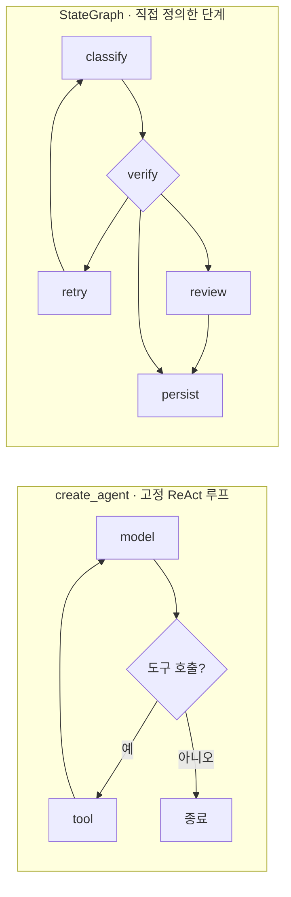
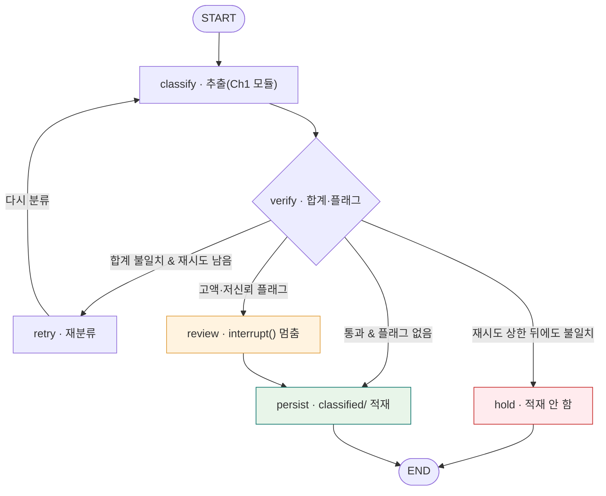
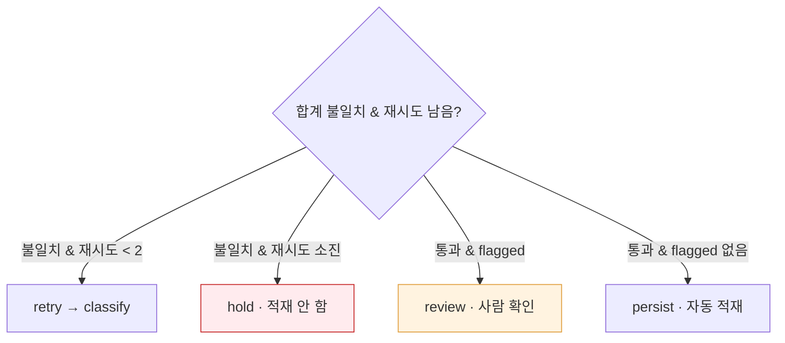
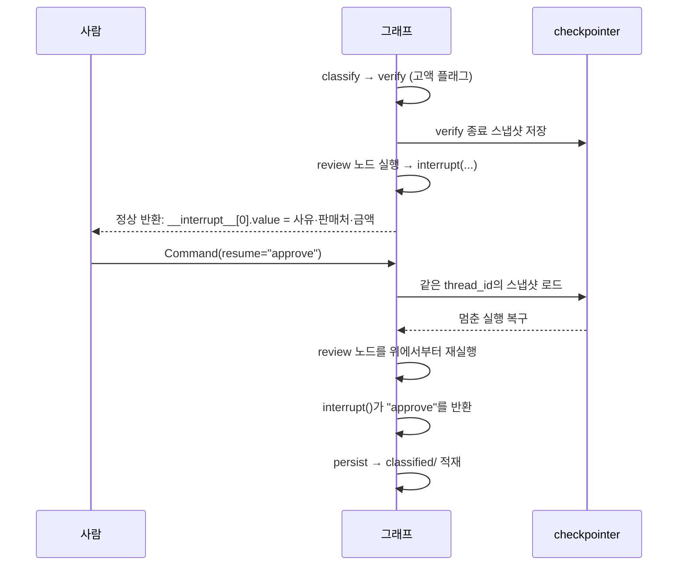
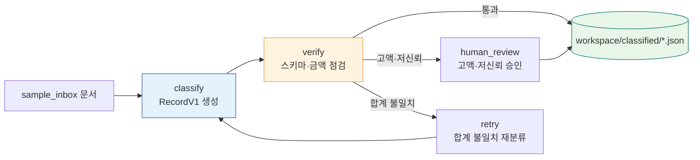

<div class="lec">
<div class="deck">

<section class="slide hero">
<div>
<div class="eyebrow">Chapter 2 · LangGraph 하네스</div>

# 파이프라인을 그래프로<br>정의한다

<p class="lead">Ch1의 단발 추출은 한 장을 읽고 끝났습니다. 인박스에는 열 건이 들어옵니다.<br>
이 챕터에서는 분류와 정규화를 상태·재시도·중단점이 있는 파이프라인으로 묶습니다. 고액이나 저신뢰 건은 자동으로 통과시키지 않고 사람에게 멈춰 묻습니다.</p>

<div class="kicker">
<div class="metric"><span class="num">70</span><strong>분</strong><span>이론 39 · 핸즈온 25 · 점검 6</span><span class="clk">예상 10:05–11:15</span></div>
<div class="metric"><span class="num">2</span><strong>번째 모듈</strong><span>intake_graph.py</span></div>
<div class="metric"><span class="num">10</span><strong>건 적재</strong><span>classified/*.json</span></div>
</div>
</div>

<div class="board">
<div class="board-header"><span>이 챕터가 끝나면</span><span class="status-pill">산출물</span></div>
<div class="stack">
<div class="row"><div class="code">1</div><div class="copy"><strong>분류·정규화 StateGraph</strong><p>classify → verify →〈retry|review|hold〉→ persist</p></div><div class="store">그래프</div></div>
<div class="row"><div class="code">2</div><div class="copy"><strong>checkpointer 재개</strong><p>멈춘 자리에서 같은 thread로 이어 실행</p></div><div class="store">상태</div></div>
<div class="row"><div class="code">3</div><div class="copy"><strong>interrupt() HITL</strong><p>고액·저신뢰 건은 사람 승인 후 적재</p></div><div class="store">멈춤</div></div>
</div>
</div>
</section>

<section class="slide">
<div class="section-head">
<div>
<div class="eyebrow">1 · 두 갈래 · 6분</div>

## create_agent와 StateGraph

</div>
<p class="section-note">LangChain 1.0의 <code>create_agent</code>는 표준 ReAct 루프를 한 줄로 만듭니다. 모델이 도구 선택과 반복 여부를 정합니다.<br>
우리 적재 파이프라인은 순서가 정해져 있습니다. 분류한 다음 검증하고, 고액이면 멈추고, 끝나면 적재합니다. 이렇게 단계를 직접 정의할 때는 StateGraph가 맞습니다.</p>
</div>

<div class="grid-2">
<div class="panel"><div class="panel-head"><strong>create_agent — 자율 루프</strong><span>langchain.agents</span></div><div class="panel-body"><div class="list">
<p>한 줄로 ReAct 에이전트를 만듭니다</p>
<p>도구 선택과 반복을 모델이 정합니다</p>
<p>표준 루프로 충분할 때 가볍게 씁니다</p>
</div></div></div>
<div class="panel"><div class="panel-head"><strong>StateGraph — 명시한 파이프라인</strong><span>langgraph.graph</span></div><div class="panel-body"><div class="list">
<p>노드와 엣지로 단계를 직접 그립니다</p>
<p>분기·재시도·중단점을 내가 통제합니다</p>
<p>적재 파이프라인처럼 순서가 있는 일에 맞습니다</p>
</div></div></div>
</div>

<div class="panel" style="margin-top:16px">
<div class="panel-head"><strong>같은 그래프지만 모양이 다르다</strong><span>고정 루프 vs 직접 정의한 단계</span></div>
<div class="panel-body">



</div>
</div>

```python
# create_agent — 표준 ReAct는 한 줄
import os
from dotenv import load_dotenv
from langchain.agents import create_agent
from langchain_openai import ChatOpenAI

load_dotenv()  # Ch0의 OpenRouter 호환 환경변수 로드
model = ChatOpenAI(
    model="google/gemini-3.5-flash",
    base_url="https://openrouter.ai/api/v1",
    api_key=os.environ["OPENROUTER_API_KEY"],
    temperature=0,
)
agent = create_agent(model=model, tools=[...])

# create_agent도 내부적으로 StateGraph를 컴파일해 돌려준다(CompiledStateGraph).
# 다만 그 그래프는 ReAct 루프 모양으로 고정 — 단계를 직접 정의하려면 StateGraph를 손으로 짠다 ↓
```

<p class="section-note" style="margin-top:10px">OpenRouter는 OpenAI 호환 API라서 <code>ChatOpenAI(base_url="https://openrouter.ai/api/v1")</code>로 직접 지정합니다. 이후 챕터의 <code>openai:</code> 접두사는 같은 호환 게이트웨이 경로를 뜻하고, 실제 모델 슬러그는 <code>google/gemini-3.5-flash</code>처럼 별도로 들어갑니다.</p>

<p class="section-note" style="margin-top:16px"><code>create_agent</code>는 LangGraph 1.0 이전의 <code>create_react_agent</code>를 대체했습니다. 둘 다 같은 <code>CompiledStateGraph</code>를 돌려줍니다. 차이는 자유도이고, 그 자유도의 핵심은 LangChain 1.0이 더한 <strong>미들웨어</strong>입니다. Ch3의 <code>create_deep_agent</code>는 바로 이 <code>create_agent</code>에 미들웨어를 기본 탑재한 확장입니다. 훅은 여섯입니다: 에이전트 실행 1회 단위 <code>before_agent</code>·<code>after_agent</code>, 매 모델 호출 전후 <code>before_model</code>·<code>after_model</code>, 그리고 모델·도구 호출을 통째로 감싸는 <code>wrap_model_call</code>·<code>wrap_tool_call</code>(캐싱·재시도·결과 가로채기). <code>before_*</code>는 순차로, <code>after_*</code>는 역순으로, <code>wrap_*</code>는 실제 호출을 중첩으로 감쌉니다. <span style="color:var(--muted)">(이 훅들을 실제로 거는 건 Ch3의 <code>create_deep_agent</code>입니다. 이 챕터 핸즈온은 손으로 짠 StateGraph라 아직 안 씁니다. 여기선 "create_agent의 확장이 그 미들웨어 위에 선다"만 잡고, 동작은 Ch3에서 봅니다.)</span></p>

<details class="deep">
<summary>🔬 심화 — 같은 일을 다른 프레임워크로: Pydantic AI <span style="color:var(--muted)">(Framework 층의 대안)</span></summary>
<div class="reveal">
<p>LangChain만 있는 게 아니다. Pydantic AI는 "FastAPI feeling을 에이전트 개발에"를 내건 타입 안전 프레임워크다. LangChain이 Django(배터리 포함·관례 많고 표면 넓음)라면 Pydantic AI는 FastAPI(작고 타입 우선·군더더기 적음)에 가깝다. 버전과 제공자 설정은 빠르게 바뀌므로, 아래 코드는 이 레포에서 실행하는 핸즈온이 아니라 개념 예시로 읽는다. (Pydantic의 검증 계층은 LangChain·OpenAI SDK·Anthropic SDK가 이미 안에서 쓴다. Pydantic AI는 그 팀이 에이전트까지 올라온 것.)</p>
<p>핵심 차이는 <strong>구조화 출력이 타입으로 못 박힌다</strong>는 것이다. <code>output_type</code>에 Pydantic 모델을 주면 결과가 그 타입으로 검증되고 IDE 자동완성·정적 검사가 붙어 오류가 런타임이 아니라 작성 시점에 잡힌다. 우리 <code>RecordV1</code> 추출을 이 프레임워크로 쓰면:</p>

```python
from pydantic_ai import Agent
from pydantic import BaseModel

class RecordV1(BaseModel):      # Ch0의 계약을 그대로
    merchant: str
    total: float

agent = Agent("openai:google/gemini-3.5-flash",   # 개념 예시 — 실제 제공자/base_url 설정은 별도 필요
              output_type=RecordV1,                 # ← 출력이 이 타입으로 검증된다
              system_prompt="영수증을 읽어 RecordV1로 채워라")

@agent.tool_plain                                   # 도구 등록(RunContext 없는 형태)
def check_sum(items: list[float], total: float) -> str:
    return "일치" if abs(sum(items) - total) < 1 else "불일치"

result = agent.run_sync("이 영수증을 추출해줘")
rec: RecordV1 = result.output                       # 타입 안전한 구조화 출력
```

<p><strong>3계층 어디?</strong> Pydantic AI는 Framework 층(LangChain 자리)의 대안이다. 그 위에 Runtime(상태·분기·지속)과 Harness(계획·파일·서브에이전트)는 여전히 필요하다. Pydantic AI도 자체 그래프·durable 실행·관측(Logfire)을 붙여 그 위층을 채워 간다.</p>
<p class="muted"><strong>이 과정이 LangChain을 고른 이유</strong>는 우리 하네스 스택(LangGraph → DeepAgents)이 LangChain 위에 서기 때문이다. 구조화 출력·타입 안전이 1순위면 Pydantic AI가, LangGraph·미들웨어·deepagents 생태계가 필요하면 LangChain이 맞다. 둘 다 같은 ReAct 루프를 한 줄로 감춘다는 본질은 같다. <span class="tiny">(이 레포 의존성엔 pydantic-ai를 넣지 않았습니다. 수업 중 실행하지 않는 비교용 의사코드이며, 직접 써 보려면 Pydantic AI 공식 문서의 현재 provider 설정을 보고 별도 환경에서 <code>uv run --with pydantic-ai</code>로 실험하세요.)</span></p>
</div>
</details>

<div class="board" style="margin-top:18px">
<div class="board-header"><span>프레임워크가 지우는 것 — 손으로 짠 루프</span><span class="status-pill">왜 필요한가</span></div>
<div class="panel-body">

```python
# create_agent 한 줄이 감춘 것: ReAct 루프를 직접 짜면 이렇다
messages = [HumanMessage(prompt)]
for _ in range(MAX_STEPS):
    ai = llm.bind_tools(tools).invoke(messages)   # 모델 호출
    messages.append(ai)
    if not ai.tool_calls:                          # 도구 안 부르면 종료
        break
    for tc in ai.tool_calls:                       # 도구 실행 → 관측을 되돌림
        messages.append(ToolMessage(run_tool(tc), tool_call_id=tc["id"]))
```

<p style="margin-top:8px">동작은 하지만 상태·에러·재시도·분기·중단점이 전부 내 몫입니다. 조건이 늘면 이 루프가 얽혀 관리하기 어려워집니다. 그래서 이 챕터에서는 단계를 노드와 엣지로 다루는 StateGraph로 올라갑니다.</p>
</div>
</div>

<div class="board" style="margin-top:18px">
<div class="board-header"><span>도구는 LLM에게 어떻게 보이나 — <code>@tool</code>의 내부</span><span class="status-pill">function calling</span></div>
<div class="panel-body">
<p>위 <code>bind_tools(tools)</code>가 하는 일은 함수를 JSON Schema로 바꿔 API 요청의 <code>tools</code> 필드에 싣는 것입니다. 모델은 그 스키마를 보고 산문 대신 호출 명세를 냅니다. 함수를 직접 실행하진 않습니다.</p>
<div class="grid" style="grid-template-columns:1fr 1fr;gap:14px;margin-top:10px">
<div class="panel"><div class="panel-head"><strong>① 함수 → 스키마</strong><span>@tool</span></div><div class="panel-body"><div class="list">
<p><code>@tool</code>이 함수 이름·독스트링·타입힌트를 읽어 <code>{name, description, parameters}</code> JSON Schema로 만든다</p>
</div></div></div>
<div class="panel"><div class="panel-head"><strong>② 스키마 전송</strong><span>bind_tools</span></div><div class="panel-body"><div class="list">
<p><code>bind_tools()</code>가 그 스키마를 API <code>tools</code> 필드로 보낸다. 모델은 function-calling으로 학습돼 스키마에 맞는 인자를 채운다</p>
</div></div></div>
<div class="panel"><div class="panel-head"><strong>③ 호출 파싱</strong><span>tool_calls</span></div><div class="panel-body"><div class="list">
<p>응답의 <code>ai.tool_calls = [{name, args, id}]</code>를 코드가 받아 실제 함수를 실행한다</p>
</div></div></div>
<div class="panel"><div class="panel-head"><strong>④ 결과 되돌림</strong><span>ToolMessage</span></div><div class="panel-body"><div class="list">
<p>결과를 <code>ToolMessage(..., tool_call_id=tc["id"])</code>로 붙인다. 이 <code>id</code>가 ②의 호출 <code>id</code>와 같아야 모델이 어느 호출의 결과인지 맞춘다(임의 문자열이면 에러)</p>
</div></div></div>
</div>
<p class="section-note" style="margin-top:10px">그래서 모델은 함수를 실행하는 게 아니라 무엇을 어떤 인자로 부를지만 정하고, 실제 실행과 결과 회수는 위 루프(=하네스)가 합니다. Ch4의 MCP·Skill도 결국 이 <code>tools</code> 필드에 무엇을 어떻게 싣느냐의 문제입니다.</p>
</div>
</div>

<details class="deep">
<summary>🔬 심화 — 도구 <code>name</code>·<code>description</code>은 영어로 쓰는 게 정석인 이유 <span style="color:var(--muted)">(우리 코드는 한국어, 그 트레이드오프)</span></summary>
<div class="reveal">
<p>위에서 본 <code>{name, description, parameters}</code> 스키마는 매 모델 호출마다 컨텍스트에 실린다. 도구가 많을수록, 호출이 잦을수록 누적된다. 그래서 스키마의 언어가 비용과 정확도 둘 다에 영향을 준다.</p>
<p><strong>① 비용: 한국어는 토큰이 더 든다.</strong> 같은 뜻을 BPE(<code>cl100k_base</code>)로 재 보면:</p>
<table>
<thead><tr><th>같은 설명</th><th>토큰 수</th></tr></thead>
<tbody>
<tr><td>한국어 ("분류된 인박스 레코드와 OKF 지식·조사 노트를 모아 월간 브리프를 작성한다")</td><td><strong>40</strong></td></tr>
<tr><td>영어 ("Compile classified inbox records, OKF knowledge and research notes into a monthly brief")</td><td><strong>15</strong></td></tr>
</tbody>
</table>
<p>약 <strong>2.7배</strong>다(직접 측정값). 스키마가 매 호출 실리니, 도구 수×호출 수만큼 이 차이가 곱해진다.</p>
<p><strong>② 정확도: 모델은 영어 표현공간에서 결정한다.</strong> 다국어 LLM도 의미가 무거운 판단은 영어에 가까운 내부 표현에서 먼저 내린 뒤 출력 언어로 옮긴다(<a href="https://arxiv.org/abs/2502.15603">Schut 외, 2025</a>). 그리고 도구 호출에서 가장 흔한 실패 하나가 파라미터 값 언어 불일치다. 의도와 도구 선택은 맞는데 인자를 사용자 언어로 생성해 실행 규약을 어긴다(<a href="https://arxiv.org/abs/2601.05366">Lost in Execution, 2026</a>). 스키마를 영어로 두면 이 결을 거스르지 않는다.</p>
<p><strong>권장 패턴</strong>: 도구 <code>name</code>·<code>description</code>·파라미터 이름은 영어, 주석·대화·사용자에게 보이는 문자열은 한국어. 사람용 한국어 docstring을 두고 싶으면 <code>@tool("inbox_check", description="Check the inbox …")</code>처럼 인자로 덮어쓰면 모델엔 영어가, 코드 읽는 사람에겐 한국어 docstring이 간다(설치된 langchain에서 확인).</p>
<p class="muted">핵심 정리: "스키마는 매 호출 실린다 → 언어가 비용이자 정확도다. 모델용은 영어, 사람용은 한국어." 우리 실습 코드는 학습 가독성을 위해 한국어 docstring을 씁니다. 다국어·프로덕션에선 위 권장을 따릅니다.</p>
</div>
</details>
</section>

<section class="slide">
<div class="section-head">
<div>
<div class="eyebrow">2 · 해부 · 8분</div>

## 노드 · 엣지 · 상태

</div>
<p class="section-note">StateGraph는 세 가지로 이뤄집니다. 상태는 노드 사이를 흐르는 데이터, 노드는 그 상태를 받아 갱신하는 함수, 엣지는 다음에 어디로 갈지입니다.<br>
적재 파이프라인의 상태는 문서 한 장의 처리 맥락입니다. 어떤 문서인지, 추출한 레코드, 재시도 횟수, 검토 사유를 담습니다.</p>
</div>

```python
class IntakeState(TypedDict, total=False):
    doc: str        # sample_inbox 파일명
    mock: bool      # --mock 플래그(gold로 추출, 키 불필요)
    record: dict    # 추출한 RecordV1 (노드 사이로 운반)
    retries: int    # 재분류 횟수
    flagged: str    # 사람 검토 사유("" 면 자동 통과)
    sum_ok: bool    # 영수증 합계 검증 결과(분기용)
```

<div class="panel">
<div class="panel-head"><strong>다섯 노드와 분기 — verify가 세 갈래로 갈라진다</strong><span>그래프 토폴로지</span></div>
<div class="panel-body">



</div>
</div>

<div class="flow flow-5" style="margin-top:14px">
<div class="flow-step"><small>classify</small><strong>추출</strong><p>Ch1 모듈을 그대로 불러 영수증→RecordV1</p></div>
<div class="flow-step"><small>verify</small><strong>검증·분기</strong><p>합계를 보고, 어긋나면 retry로 되돌린다</p></div>
<div class="flow-step"><small>retry</small><strong>재분류</strong><p>상한(2회)까지 classify로 되돌아간다</p></div>
<div class="flow-step"><small>review</small><strong>사람 확인</strong><p>고액·저신뢰 플래그면 interrupt()로 멈춤</p></div>
<div class="flow-step"><small>hold/persist</small><strong>보류·적재</strong><p>끝내 안 맞으면 보류, 통과하면 JSON 저장</p></div>
</div>

<p class="section-note" style="margin-top:16px">classify는 Ch1의 <code>extract</code>를 그대로 부릅니다. 모듈을 바꾸더라도 계약은 재사용한다는 원칙이 여기서 처음 작동합니다.</p>
</section>

<section class="slide">
<div class="section-head">
<div>
<div class="eyebrow">3 · 분기 · 8분</div>

## 검증이 틀리면 되돌린다

</div>
<p class="section-note">verify가 영수증 합계를 봅니다. 항목 금액에 수량을 곱해 더한 값이 총액과 어긋나면 잘못 읽은 것입니다. 또 이 실습 샘플은 <code>_manifest.yaml</code>에 정답 계약이 있으므로 live 추출도 <code>score</code> 임계값과 판매처·문서유형·총액·날짜·항목수·항목 금액/수량 구조 회귀 검증을 통과해야 합니다.<br>
조건부 엣지는 실패를 classify로 되돌립니다. 상한까지 다시 읽고도 합계나 샘플 품질이 끝내 안 맞으면 hold로 보내 적재하지 않습니다. 고액·저신뢰처럼 사람이 볼 일은 review로 멈추지만, 검증 실패 자체는 사람 승인으로 덮지 않습니다. 이 장의 기본 정책은 <strong>fail-closed</strong>입니다.</p>
</div>

```python
def after_verify(state: IntakeState) -> str:
    if state.get("sum_ok", True) is False and state["retries"] < MAX_RETRY:
        return "retry"                          # 합계 불일치 — 상한까지 재분류
    if state.get("sum_ok", True) is False:
        return "hold"                           # 끝내 안 맞으면 fail-closed
    return "review" if state["flagged"] else "persist"

g.add_conditional_edges("verify", after_verify,
                        {"retry": "retry", "review": "review", "persist": "persist", "hold": "hold"})
```

<div class="panel" style="margin-top:16px">
<div class="panel-head"><strong>after_verify가 고르는 세 갈래</strong><span>조건부 분기</span></div>
<div class="panel-body">



</div>
</div>

<div class="board" style="margin-top:18px">
<div class="board-header"><span>재시도는 무한 루프가 아니다</span><span class="status-pill">상한</span></div>
<div class="panel-body"><div class="list">
<p>같은 실패를 계속 반복하면 비용만 듭니다. <code>MAX_RETRY</code>로 두 번까지만 되돌립니다. live 재시도에서는 이전 불일치 관측을 보고 Ch1의 ReAct 검산 경로로 다시 읽습니다. 그래도 안 맞으면 <code>hold</code>로 보내 JSON을 쓰지 않습니다. 검증 통과 후 고액·저신뢰 플래그가 남은 문서만 <code>review</code>로 사람에게 올립니다. 이 gold 회귀 게이트는 수업 샘플을 위한 장치이고, 실제 업무에서는 정답 manifest 대신 업무 규칙·상호참조 검증으로 바꿉니다. 현재 하니스는 Ch1의 <code>score()</code>가 5/6 미만이면 실패로 보고, 판매처·문서유형·총액·날짜·항목수·항목 금액/수량 구조 불일치는 로그에 직접 보여 줍니다.</p>
<p class="tiny" style="color:var(--muted)">검증 자체의 한계도 알고 씁니다. <code>verify_total</code>은 "항목합(<code>금액×수량</code>) = 총액(±1원)"이라는 가정이라, 부가세 별도·서비스료·할인·반올림이 섞인 실제 영수증에선 모델이 옳게 읽어도 불일치가 날 수 있습니다. 그래서 이 검증은 정답 판정이 아니라, 불일치를 재시도로 보내되 상한과 flagged 큐로 받치는 층층 방어의 한 겹일 뿐입니다.</p>
<p><code>temperature=0</code>이어도 출력이 완전히 결정적이진 않아, 같은 입력에서도 추출이 흔들릴 수 있습니다(Ch1에서 본 비결정성).</p>
<p>평소 mock은 gold가 고정이라 합계가 맞아 retry가 안 뜹니다(라이브 추출에선 비결정성으로 흔들려 의미가 있습니다). 그래서 <strong>아래 <code>--break-sum</code>으로 일부러 깨</strong> retry 루프를 눈으로 봅니다. 한계를 정해 두는 게 하네스의 일입니다.</p>
<p>재시도가 외부 부작용(메일 전송·DB 쓰기)을 가진 도구를 다시 부른다면 멱등성이 필요합니다. 같은 작업을 두 번 해도 결과가 한 번과 같도록 idempotency key를 둬야 중복이 안 생깁니다(이 실습의 재분류는 부작용이 없어 안전). 그래프 차원의 마지막 안전망은 <code>recursion_limit</code>으로, 한 실행의 superstep 수가 이를 넘으면 <code>GraphRecursionError</code>가 납니다. 기본값은 LangGraph 버전별로 달라질 수 있으니 수업 환경에서는 직접 확인합니다. 평소엔 안 걸리는 폭주 방지 backstop이고, 노드 로직이 정하는 <code>MAX_RETRY</code> 재시도 횟수와는 다른 층입니다. 이 챕터 그래프는 checkpointer를 쓰므로 낮춰 실험할 때도 <code>graph.invoke(state, config=&#123;"configurable": &#123;"thread_id": "rec-demo"&#125;, "recursion_limit": 5&#125;)</code>처럼 thread_id를 함께 줍니다.</p>
</div></div>
</div>

<div class="cue do" style="margin-top:14px">
<div class="cue-head"><span class="cue-label">✋ 직접 해보기 — retry를 눈으로</span><span class="cue-time">~3분</span></div>
<div class="cue-body">증명하려는 것: 재시도가 무한이 아니라 상한에서 멈추고, 끝내 실패하면 적재하지 않는다는 것. <code>--break-sum</code>으로 합계를 일부러 깨고 돌려 보세요: <code>uv run python3 ch2-langgraph-agent/intake_graph.py --mock --break-sum --doc receipt_gs25.png</code>. 이 플래그는 추출된 <em>총액(금액)에만 +1원</em>을 더합니다. 항목 합계(8,400)는 그대로라 둘이 영원히 어긋나고(8,400 ≠ 8,401), 매 재분류마다 다시 깨지니 재시도 2회를 다 써도 안 맞아 <code>[hold] 검증 실패 — 적재 안 함</code>으로 끝납니다. 출력의 <strong>8,401</strong>이 어디서 왔는지(총액 +1) 알면, 왜 끝내 실패하는지가 보입니다.</div>
</div>
</section>

<section class="slide">
<div class="section-head">
<div>
<div class="eyebrow">4 · 상태 · 7분</div>

## checkpointer가 자리를 기억한다

</div>
<p class="section-note">interrupt로 멈추면 그 순간의 상태를 어딘가 저장해야 재개할 수 있습니다. 그 일을 checkpointer가 합니다.<br>
<code>thread_id</code>로 실행을 구분합니다. 같은 thread로 다시 부르면 멈춘 자리부터 이어집니다. 다른 thread면 새 실행입니다.</p>
</div>

```python
graph = g.compile(checkpointer=InMemorySaver())
config = {"configurable": {"thread_id": f"intake-{doc}"}}

result = graph.invoke(state, config=config)
if result.get("__interrupt__"):                  # 멈춤은 예외가 아니라 반환값 안에 온다
    payload = result["__interrupt__"][0].value   # 멈춘 사유(고액·저신뢰)
    # ... 사람의 결정을 받은 뒤 ...
    graph.invoke(Command(resume="approve"), config=config)  # 같은 자리에서 재개
```

<p class="section-note" style="margin-top:12px">핵심: <strong>멈춤은 예외가 아니라 반환값 안의 <code>__interrupt__</code></strong>로 옵니다. <code>graph.invoke</code>가 정상 반환하되 결과에 <code>__interrupt__</code> 키가 있으면 거기서 멈춘 것이고, <code>[0].value</code>가 <code>interrupt()</code>에 넘긴 사유 페이로드입니다.</p>

<div class="board" style="margin-top:18px">
<div class="board-header"><span>checkpointer가 실제로 저장하는 것 — superstep 스냅샷</span><span class="status-pill">Pregel 실행모델</span></div>
<div class="panel-body">
<p>LangGraph는 노드를 superstep 단위로 돕니다. 실행 가능한 노드를 (병렬로) 돌려 출력을 모으고 상태를 동기화한 뒤 다음 superstep으로 넘어갑니다(Google Pregel에서 온 모델). checkpointer는 매 superstep 끝의 스냅샷을 <code>thread_id</code>별로 저장합니다. 그래서 그 자리부터 재개됩니다.</p>
<p class="tiny" style="color:var(--muted)">한 발 더: 이 챕터 그래프는 직선(classify→verify→분기→다음 하나)이라 한 superstep에 노드가 늘 하나뿐입니다. 여러 노드가 같은 상태 채널에 동시에 쓰는 진짜 병렬 superstep과, 그 동시 쓰기를 안전하게 합치는 reducer(<code>Annotated[list, add]</code>)는 <strong>Ch3 fan-out</strong>에서 봅니다. 여기 "(병렬로)"는 Pregel 모델의 일반 성질이고, 우리 그래프에선 아직 발현되지 않습니다.</p>
<div class="grid" style="grid-template-columns:1fr 1fr;gap:12px;margin-top:10px">
<div class="panel"><div class="panel-head"><strong>channel_values</strong><span>상태 본문</span></div><div class="panel-body"><div class="list"><p>지금 상태의 실제 값. 분류 중인 문서·추출 레코드·재시도 횟수 같은 State 필드</p></div></div></div>
<div class="panel"><div class="panel-head"><strong>channel_versions</strong><span>버전</span></div><div class="panel-body"><div class="list"><p>각 채널이 몇 번 갱신됐는지. 무엇이 바뀌었는지 추적</p></div></div></div>
<div class="panel"><div class="panel-head"><strong>versions_seen</strong><span>진행 위치</span></div><div class="panel-body"><div class="list"><p>각 노드가 어디까지 봤는지. 재개 시 어느 노드를 다시 돌릴지 판단</p></div></div></div>
<div class="panel"><div class="panel-head"><strong>pending_writes</strong><span>내고장성</span></div><div class="panel-body"><div class="list"><p>아직 반영 안 된 쓰기. 스냅샷과는 별도로 보존돼, superstep 도중 죽어도 재개 시 잃지 않게 하는 fault tolerance의 핵심</p></div></div></div>
</div>
<p class="section-note" style="margin-top:10px">위 코드의 <code>thread_id="intake-{doc}"</code>가 이 스냅샷들의 키입니다. <code>InMemorySaver</code>는 이걸 프로세스 메모리에 둡니다. 디스크나 DB에 남기려면 같은 인터페이스의 영속 체크포인터를 쓰되, 현재 실습 의존성에는 넣지 않은 <code>langgraph-checkpoint-sqlite</code> 또는 <code>langgraph-checkpoint-postgres</code> 같은 별도 패키지가 필요합니다.</p>
</div>
</div>

<div class="board" style="margin-top:18px">
<div class="board-header"><span>왜 메모리에 저장하나</span><span class="status-pill">InMemorySaver</span></div>
<div class="panel-body"><div class="list">
<p>이 실습은 한 프로세스 안에서 멈췄다 재개하므로 메모리 체크포인터로 충분합니다.</p>
<p>프로덕션에서는 같은 자리에 SQLite·Postgres 체크포인터를 끼웁니다. 그래프 코드는 그대로 두고 저장소만 바꿉니다. 이것도 모듈 교체입니다.</p>
</div></div>
</div>

<div class="board" style="margin-top:18px">
<div class="board-header"><span>이게 왜 중요한가 — 지속 실행</span><span class="status-pill">durable execution</span></div>
<div class="panel-body"><div class="list">
<p>checkpointer는 각 superstep(LangGraph가 노드를 실행하는 단위)이 끝날 때마다 상태를 저장합니다. 그래서 interrupt뿐 아니라 중간에 끊겨도 같은 thread로 다시 부르면 마지막 superstep부터 이어집니다. 처음부터 다시 안 합니다.</p>
<p class="muted" style="margin-top:6px">단, 우리 데모의 <code>InMemorySaver</code>는 같은 프로세스 안에서만 상태를 들고 있습니다(예외를 잡고 재시도, 같은 런 안의 재개). 프로세스가 정말 죽었다 살아나도 복구하려면 디스크에 쓰는 영속 체크포인터가 필요합니다. 저장소만 바꾸는 구조는 맞지만, sqlite/postgres 구현은 별도 패키지를 설치해야 import됩니다.</p>
<p>Ch3에서 여러 문서를 동시에 조사할 때 이 성질이 비용을 아낍니다. 여러 갈래 중 일부가 끝난 뒤 끊겨도, 재개는 남은 것만 처리합니다.</p>
</div></div>
</div>

<div class="board" style="margin-top:18px">
<div class="board-header"><span>한 걸음 더 — 장기 메모리와 durability 모드</span><span class="status-pill">LangGraph</span></div>
<div class="panel-body"><div class="list">
<p>checkpointer는 단기입니다. 한 thread = 한 작업의 상태입니다. thread를 넘어 오래 남길 것(사용자 프로필·지난 결과)은 <code>Store</code>(cross-thread, JSON namespace/key)에 둡니다. Ch3에서 볼 메모리 분류의 '장기'가 바로 이것이고, LangMem SDK가 그 위에서 의미를 추출·관리합니다.</p>
<p>durability는 셋으로 조절합니다. <code>"exit"</code>(끝날 때만 저장, 가장 빠름) · <code>"async"</code>(다음 단계와 겹쳐 저장, 균형) · <code>"sync"</code>(매 단계 저장 후 진행, 가장 안전). 속도와 복구 보장을 맞바꾸는 설정으로, 기본은 <code>async</code>이고 <code>graph.invoke(…, durability=…)</code>로 실행할 때 지정합니다. 우리 실습은 기본값으로 충분합니다.</p>
</div></div>
</div>
</section>

<section class="slide">
<div class="section-head">
<div>
<div class="eyebrow">5 · 멈춤 · 8분</div>

## 자동으로 넘기지 않는 것들

</div>
<p class="section-note">분류가 늘 맞지는 않습니다. 금액이 크거나 모델이 확신하지 못한 건을 자동으로 적재하면 틀린 데이터가 조용히 쌓입니다.<br>
그래서 review 노드에서 interrupt()로 멈춰 사람에게 묻습니다. 승인하면 적재하고, 반려하면 보류합니다.</p>
</div>

```python
def review(state: IntakeState) -> dict:
    decision = interrupt({                  # 여기서 실행이 멈춘다
        "사유": state["flagged"],           # 고액 / 저신뢰
        "판매처": state["record"]["판매처"],
        "총액": state["record"]["총액"],
        "질문": "이 분류를 그대로 적재할까요? (approve / reject)",
    })
    # approve일 때만 통과. reject·오타·빈 응답은 안전하게 보류한다(fail-closed).
    return {"flagged": "" if decision == "approve" else "rejected"}
```

<div class="board" style="margin-top:18px">
<div class="board-header"><span>재개하면 노드가 처음부터 다시 돈다</span><span class="status-pill">주의</span></div>
<div class="panel-body"><div class="list">
<p><code>Command(resume=...)</code>로 이어지면 LangGraph는 멈췄던 <strong>노드 전체를 위에서 다시 실행</strong>합니다. <code>interrupt()</code> 앞 코드도 한 번 더 돌고, 그 지점에서 <code>interrupt()</code>가 저장해 둔 결정값을 돌려줄 뿐입니다.</p>
<p>그래서 <code>interrupt()</code> 앞에 DB 쓰기·카운터 증가 같은 부수효과를 두면 두 번 실행됩니다. 우리 <code>review</code>는 앞에서 state를 읽기만 하므로 안전합니다. 부수효과는 전부 뒤 노드(<code>persist</code>)로 미룹니다.</p>
</div></div>
</div>

<div class="panel" style="margin-top:18px">
<div class="panel-head"><strong>멈췄다 사람을 거쳐 재개하기까지</strong><span>interrupt → resume 시간축</span></div>
<div class="panel-body">



</div>
</div>

<div class="grid-2">
<div class="panel"><div class="panel-head"><strong>멈추는 기준</strong><span>이 실습의 임계값</span></div><div class="panel-body"><div class="list">
<p>고액 — 총액 1,000,000원 이상</p>
<p>저신뢰 — 추출 신뢰도 0.7 미만</p>
</div></div></div>
<div class="panel"><div class="panel-head"><strong>실제로 멈추는 건</strong><span>sample_inbox · --mock</span></div><div class="panel-body"><div class="list">
<p>명세서(invoice_photo) 1,650,000원 · 용역 계약 3,000,000원 — 고액 2건</p>
<p>mock은 gold를 그대로 써 신뢰도가 1.0으로 주입됩니다. 저신뢰 분기는 키 있는 라이브 실행에서만 걸립니다</p>
</div></div></div>
</div>

<div class="ask">생각해보기. 만약 <code>compile()</code>에 checkpointer를 빼면 interrupt가 동작할까요? 그리고 같은 <code>thread_id</code>로 다시 부르면 무슨 일이 일어날까요?</div>

<details>
<summary>정답 확인</summary>
<div class="reveal">
<p>checkpointer 없이도 <code>interrupt()</code> <strong>자체는 동작합니다.</strong> <code>invoke</code>가 에러 없이 결과에 <code>__interrupt__</code>를 담아 반환하고 그 자리에서 멈춥니다. 막히는 건 재개할 때입니다. 멈춘 실행을 <code>Command(resume=...)</code>로 이어가려 하면 그때 <code>RuntimeError: Cannot use Command(resume=...) without checkpointer</code>가 납니다. 멈춘 상태를 저장한 곳이 없어 어디로 돌아갈지 모르기 때문입니다. 즉 멈출 순 있어도 사람 결정을 받아 이어갈 수 없으니, HITL에는 checkpointer가 필수입니다.</p>
<p>같은 <code>thread_id</code>로 다시 부르면 저장된 그 자리부터 이어집니다. <code>Command(resume="approve")</code>가 멈춘 review 노드로 결정을 흘려보내 다음 단계(persist)로 넘어갑니다. 다른 thread_id면 처음부터 새 실행입니다.</p>
</div>
</details>
</section>

<section class="slide">
<div class="section-head">
<div>
<div class="eyebrow">핸즈온 ① · 코드 정독 · 8분</div>

## 그래프를 손으로 엮는다

</div>
<p class="section-note">노드 다섯 개를 엣지로 잇습니다. 한 줄씩 읽으면 분류 파이프라인이 그대로 그림으로 보입니다. 분기 하나(verify 다음)만 조건부고 나머지는 직선입니다.</p>
</div>

<div class="panel">
<div class="panel-head"><strong>ch2-langgraph-agent/intake_graph.py — build_graph</strong><span>노드·엣지·체크포인터</span></div>
<div class="panel-body">

<<< ../../ch2-langgraph-agent/intake_graph.py#build-graph{python}

</div>
</div>

<div class="grid-2" style="margin-top:16px">
<div class="panel"><div class="panel-head"><strong>직선 엣지 vs 조건부 엣지</strong></div><div class="panel-body"><div class="list">
<p><code>add_edge(A, B)</code> — 늘 A 다음 B. 분류→검증처럼 정해진 길.</p>
<p><code>add_conditional_edges(verify, after_verify, {...})</code> — <code>after_verify</code>가 돌려준 문자열로 다음 노드를 고릅니다.</p>
</div></div></div>
<div class="panel"><div class="panel-head"><strong>after_verify가 고르는 세 길</strong></div><div class="panel-body"><div class="list">
<p>합계 불일치 → <code>retry</code>(상한 전) 또는 <code>hold</code>(상한 소진), 통과했지만 플래그 있음 → <code>review</code>, 통과했고 플래그 없음 → <code>persist</code>.</p>
<p>노드 이름과 함수 이름은 달라도 됩니다. <code>add_node("retry", bump_retry)</code>에서 매핑의 <code>"retry"</code>는 노드 이름이지 <code>bump_retry</code> 함수가 아닙니다.</p>
</div></div></div>
</div>
</section>

<section class="slide">
<div class="section-head">
<div>
<div class="eyebrow">핸즈온 ② · 단계별 실행 · 17분</div>

## 흘려보내고 멈춤을 본다

</div>
<p class="section-note">기본은 live 실행입니다. 전체를 한 번 흘리고, 고액 한 건만 따로 돌려 interrupt를 눈으로 보고, 반려도 해 봅니다. <code>--mock</code>은 키·네트워크 문제 때 같은 그래프 구조를 결정론적으로 확인하는 보조 경로입니다.</p>
</div>

<div class="stack">
<div class="row"><div class="code">1</div><div class="copy"><strong>격리 전체 적재 — live 기본</strong><p><code>ANALYST_WORKSPACE=workspace/ch2-live uv run python3 ch2-langgraph-agent/intake_graph.py</code> <span style="color:var(--muted)">(장애·오프라인 확인: 끝에 <code>--mock</code>)</span><br><span style="color:var(--muted)"><strong>증명:</strong> 실제 모델 추출값이 StateGraph를 지나간다. 첫 실습은 <code>workspace/ch2-live</code> 격리 workspace에 써서 기존 <code>workspace/classified</code> 산출물을 건드리지 않는다. 검토건은 터미널에서 <code>approve</code>/<code>reject</code>를 직접 입력한다. 성공 기준: 문서들이 <code>[classify]</code>→<code>[verify]</code>→필요시 <code>⏸ interrupt</code>→<code>[persist]</code> 또는 <code>[hold]</code> 흐름을 탄다. 샘플 품질 게이트가 PDF 오추출을 잡으면 JSON 10개가 아니라 실패나 hold가 정상입니다. live는 값·신뢰도·저신뢰 멈춤이 달라질 수 있으므로, 글자 단위 일치가 아니라 <strong>거짓 성공을 막는 그래프 흐름</strong>을 본다.</span></p></div><div class="store">live</div></div>
<div class="row"><div class="code">2</div><div class="copy"><strong>한 건만 — 멈춤 관찰</strong><p><code>uv run python3 ch2-langgraph-agent/intake_graph.py --doc invoice_photo.png</code> <span style="color:var(--muted)">(장애·오프라인 확인: <code>--mock</code> 추가)</span><br><span style="color:var(--muted)"><strong>증명:</strong> interrupt는 예외가 아니라 반환값(<code>__interrupt__</code>)으로 온다. 한 건으로 또렷이 본다. 성공 기준: 고액 청구서로 분류되면 <code>approve/reject 입력</code> 프롬프트가 보이고, 직접 <code>approve</code>를 넣으면 review→persist로 이어진다. 금액·상호명은 live 추출이라 조금 다를 수 있다.</span></p></div><div class="store">interrupt</div></div>
<div class="row"><div class="code">3</div><div class="copy"><strong>검토건 반려</strong><p><code>uv run python3 ch2-langgraph-agent/intake_graph.py --reject-flagged --doc invoice_photo.png</code> <span style="color:var(--muted)">(장애·오프라인 확인: <code>--mock</code> 추가)</span><br><span style="color:var(--muted)"><strong>증명:</strong> fail-closed — 반려·오타·빈 응답이 모두 보류로 가고 기존 JSON까지 회수된다(틀리면 안 들어간다). 성공 기준: 고액 한 건이 <code>[review] 보류 — 적재 안 함</code>으로 빠지고, 기존 JSON이 있으면 제거된다. 다시 정상 산출물을 만들려면 1번 전체 적재를 한 번 더 실행한다.</span></p></div><div class="store">보류</div></div>
<div class="row"><div class="code">4</div><div class="copy"><strong>품질 게이트 단건 확인</strong><p><code>uv run python3 ch2-langgraph-agent/intake_graph.py --doc statement_bank_2026-05.pdf</code><br><span style="color:var(--muted)"><strong>증명:</strong> live 모델이 은행 PDF를 의미상 잘못 읽으면 <code>[verify] 샘플 품질 불일치(...)</code> 뒤 retry를 쓰고, 끝내 맞지 않으면 <code>[hold]</code>로 보류한다. 이 실패는 정상입니다 — 거짓 성공으로 JSON을 남기지 않는 것이 목표입니다.</span></p></div><div class="store">품질</div></div>
<div class="row"><div class="code">5</div><div class="copy"><strong>결정론 비교</strong><p><code>uv run python3 ch2-langgraph-agent/intake_graph.py --mock</code><br><span style="color:var(--muted)">mock은 LLM을 대신하는 주 경로가 아니라 보조입니다. 같은 그래프가 gold 레코드로 어떻게 도는지 확인하고, live가 실패했을 때 문제가 모델/키인지 그래프 코드인지 가르는 데 씁니다. 성공 기준: 문서 10건 처리, 고액 2건(invoice_photo·contract_freelance) interrupt 뒤 자동 승인, JSON 10개.</span></p></div><div class="store">보조</div></div>
</div>

<div class="cue do">
<div class="cue-head"><span class="cue-label">✋ 직접 해보기</span><span class="cue-time">~5분</span></div>
<div class="cue-body">먼저 1번 명령 <code>ANALYST_WORKSPACE=workspace/ch2-live uv run python3 ch2-langgraph-agent/intake_graph.py</code>을 그대로 실행하세요. live라 값은 조금 흔들릴 수 있지만, <code>[reset]</code> 뒤 <code>[classify]</code>→<code>[verify]</code>→필요시 <code>⏸</code>→<code>[persist]</code>/<code>[hold]</code> 흐름이 보여야 정상입니다. 검토건이 뜨면 직접 <code>approve</code> 또는 <code>reject</code>를 입력합니다. 한 문서가 실패하면 나머지를 계속 처리한 뒤 마지막에 <code>전체 적재 중 N건 실패</code>로 모읍니다. 레포 안 하위폴더라 본 실습의 <code>workspace/classified</code> 산출물은 그대로 보존되고, 이번 격리 산출물은 VSCode 탐색기의 <code>workspace/ch2-live/classified/</code>에서 바로 열어 볼 수 있습니다(상대경로는 레포 루트 기준으로 풀립니다). 키·네트워크 문제로 막히면 같은 명령에 <code>--mock</code>을 붙여 그래프 코드 자체는 정상인지 가릅니다.</div>
</div>

<div class="cue check" style="margin-top:12px">
<div class="cue-head"><span class="cue-label">PDF 한 건 확인</span><span class="cue-time">~1분</span></div>
<div class="cue-body">PDF 입력 경로만 따로 보고 싶으면 <code>uv run python3 ch2-langgraph-agent/intake_graph.py --doc statement_card_2026-05.pdf</code>를 실행하세요. 이미지와 같은 StateGraph를 지나가되, Ch1의 멀티모달 입력 파트가 PDF 파일 데이터로 바뀝니다.</div>
</div>

<div class="panel" style="margin-top:18px">
<div class="panel-head"><strong>출력 — 고액 건에서 멈췄다 재개</strong><span>invoice_photo.png</span></div>
<div class="panel-body">

```text
▶ invoice_photo.png
  [classify] 디자인스튜디오 레이 · 1,650,000원 · 신뢰도 1.00
  [verify] 통과 · 검토 필요: 고액(1,650,000원)
  ⏸ interrupt — 고액(1,650,000원) · 디자인스튜디오 레이 1,650,000원 → approve/reject 입력: approve
  [review] 승인 — 적재 진행
  [persist] → workspace/classified/invoice_photo.json
```

</div>
</div>

<div class="cue wait">
<div class="cue-head"><span class="cue-label">⏳ 기다렸다 확인</span><span class="cue-time">~20초</span></div>
<div class="cue-body"><code>⏸ interrupt — 고액(1,650,000원)</code> 줄에서 그래프가 멈춘 사유를 <code>__interrupt__</code>로 돌려줍니다. 터미널에서 직접 <code>approve</code>를 입력하면 <code>Command(resume="approve")</code>로 재개되어 <code>[review] 승인</code>→<code>[persist]</code>로 이어집니다. <code>--reject-flagged</code>로 돌리면 같은 자리에서 반려되어 JSON이 안 생기는 것까지 보면 HITL 한 바퀴를 다 본 셈입니다. 자동 승인 데모가 필요할 때만 <code>--approve-flagged</code>를 씁니다.</div>
</div>

<div class="cue solve">
<div class="cue-head"><span class="cue-label">✏️ 풀어보기</span><span class="cue-time">~4분</span></div>
<div class="cue-body">코드를 고치지 말고 실행 기준만 바꿉니다. <code>uv run python3 ch2-langgraph-agent/intake_graph.py --mock --high-value 10000</code>으로 돌리면 interrupt가 몇 건에서 걸릴까요? 반대로 <code>uv run python3 ch2-langgraph-agent/intake_graph.py --mock --high-value 5000000</code>으로 올리면? 같은 그래프라도 임계값 하나가 자동화와 사람 검토의 경계를 바꾼다는 것을 봅니다.</div>
</div>

<details>
<summary>관찰 포인트</summary>
<div class="reveal">
<p><code>10000</code>으로 낮추면 대부분의 영수증·명세서가 고액으로 걸려 interrupt가 쏟아집니다. 사람이 일일이 승인해야 하니 자동화 효과가 사라집니다.</p>
<p><code>5000000</code>으로 올리면 아무것도 안 걸려 전부 자동 적재됩니다. 틀린 분류도 그냥 통과합니다. 임계값은 자동화와 안전을 맞바꾸는 설정값입니다. 도메인에 맞게 잡는 게 설계입니다.</p>
</div>
</details>
</section>

<section class="slide">
<div class="section-head">
<div>
<div class="eyebrow">✏️ 직접 엮어보기 · ~10분</div>

## 빈 그래프를 직접 채운다

</div>
<p class="section-note">위 그래프는 <strong>읽기만 하면 손에 안 남습니다.</strong> 축소판 <code>ch2-langgraph-agent/exercise_graph.py</code>는 노드 로직(classify·verify·review·persist)은 채워져 있고 <strong>LangGraph 뼈대 네 곳만 비어</strong> 있습니다. 직접 쳐서 채우세요 — 키·네트워크는 필요 없습니다(가짜 인박스).</p>
</div>

<div class="board">
<div class="board-header"><span>채울 빈칸 네 곳</span><span class="status-pill">TODO</span></div>
<div class="stack">
<div class="row"><div class="code">①</div><div class="copy"><strong>State</strong><p>노드 사이로 운반할 필드 <code>doc·record·flagged</code>를 <code>TypedDict</code>에 선언</p></div><div class="store">상태</div></div>
<div class="row"><div class="code">②</div><div class="copy"><strong>build_graph</strong><p>노드 4개 등록 · 엣지 연결 · <code>verify</code> 뒤 분기 · <strong><code>compile(checkpointer=…)</code></strong></p></div><div class="store">연결</div></div>
<div class="row"><div class="code">③</div><div class="copy"><strong>review의 interrupt()</strong><p>멈춰 사람 결정을 받고, 그 반환값으로 승인/보류 분기</p></div><div class="store">멈춤</div></div>
<div class="row"><div class="code">④</div><div class="copy"><strong>run_one의 resume</strong><p><code>Command(resume=결정)</code>으로 멈춘 그래프를 같은 <code>thread_id</code>에서 이어가기</p></div><div class="store">재개</div></div>
</div>
</div>

<div class="panel" style="margin-top:18px">
<div class="panel-head"><strong>exercise_graph.py — 빈칸 ②(build_graph)</strong><span>여기를 직접 채운다</span></div>
<div class="panel-body">

<<< ../../ch2-langgraph-agent/exercise_graph.py#exercise-build{python}

</div>
</div>

<div class="cue do">
<div class="cue-head"><span class="cue-label">✋ 채운 뒤 자가 점검</span><span class="cue-time">~10분</span></div>
<div class="cue-body">네 칸을 채운 뒤 <code>uv run python3 ch2-langgraph-agent/exercise_graph.py --check</code>를 돌리세요. <strong>✅ 네 줄</strong>이 다 뜨면 그래프를 직접 엮은 것입니다. <code>--check</code> 없이 그냥 실행하면 고액 건에서 <code>⏸ interrupt</code>가 떠 <code>approve/reject</code>를 직접 입력해 한 바퀴를 돌 수 있습니다. <code>②</code>에서 <code>checkpointer</code>를 빠뜨리면 <code>④</code> 재개가 <code>RuntimeError: Cannot use Command(resume=...) without checkpointer</code>로 막히는 것도 직접 보게 됩니다.</div>
</div>

<details class="deep">
<summary>막히면 — 정답</summary>
<div class="reveal">
<p>네 칸의 정답 패턴은 <code>intake_graph.py</code>의 <code>build_graph()</code>(노드·엣지·분기·<code>compile(checkpointer=InMemorySaver())</code>)와 <code>run_one()</code>(<code>thread_id</code> config·<code>Command(resume=...)</code>)에 그대로 있습니다. 먼저 5~10분 직접 부딪힌 뒤 펼쳐 보세요 — 손으로 한 번 친 코드가 남습니다.</p>
</div>
</details>
</section>

<section class="slide">
<div class="section-head">
<div>
<div class="eyebrow">핸즈온 ③ · 트러블슈팅 · 참고</div>

## 막히면 여기부터

</div>
<p class="section-note">그래프가 안 도는 대부분은 분기 함수나 상태 키 문제입니다.</p>
</div>

<div class="grid-2">
<div class="panel"><div class="panel-head"><strong>interrupt 후 재개가 안 됨</strong><span>HITL</span></div><div class="panel-body"><div class="list">
<p><code>compile(checkpointer=...)</code>를 빠뜨리면 interrupt 반환은 볼 수 있어도 <code>Command(resume=...)</code> 재개에서 깨집니다. interrupt 자체가 안 보이면 고액·저신뢰 기준에 걸리는 문서가 없는지 <code>--doc invoice_photo.png</code>로 확인하세요.</p>
</div></div></div>
<div class="panel"><div class="panel-head"><strong>KeyError: state 키</strong><span>상태</span></div><div class="panel-body"><div class="list">
<p>노드가 돌려준 dict의 키가 <code>IntakeState</code>에 없으면 무시되거나 깨집니다. TypedDict에 필드를 선언했는지 봅니다.</p>
</div></div></div>
<div class="panel"><div class="panel-head"><strong>분기에서 멈춤</strong><span>조건부 엣지</span></div><div class="panel-body"><div class="list">
<p><code>after_verify</code>가 돌려준 문자열이 매핑 dict의 키와 정확히 같아야 합니다. 오타면 그래프가 갈 곳을 잃습니다.</p>
</div></div></div>
<div class="panel"><div class="panel-head"><strong>재개가 안 됨</strong><span>thread_id</span></div><div class="panel-body"><div class="list">
<p>재개할 때 처음과 <strong>같은</strong> <code>thread_id</code>를 써야 멈춘 자리를 찾습니다. 매번 새로 만들면 처음부터 실행됩니다.</p>
</div></div></div>
<div class="panel"><div class="panel-head"><strong>create_react_agent</strong><span>옛 경로</span></div><div class="panel-body"><div class="list">
<p>현재 설치본에서는 <code>from langgraph.prebuilt import create_react_agent</code>가 아직 import됩니다. 새 코드에서는 LangChain 1.x의 <code>langchain.agents.create_agent</code>를 기본으로 쓰고, 직접 그래프 제어가 필요할 때만 이 챕터처럼 <code>StateGraph</code>를 손으로 짭니다.</p>
</div></div></div>
</div>

<p class="section-note" style="margin-top:16px">전체 실행 파일은 <code>ch2-langgraph-agent/intake_graph.py</code>. classify는 Ch1의 <code>extract</code>를 import해 그대로 씁니다. 모듈 교체·계약 재사용의 첫 작동입니다.</p>
</section>

<section class="slide">
<div class="section-head">
<div>
<div class="eyebrow">흐름 복습 · 2분</div>

## 그래프의 계약은 상태다

</div>
<p class="section-note">Ch2의 핵심은 모델 호출이 아니라 상태 전이입니다. 각 노드는 <code>IntakeState</code> 일부를 채우고, 조건부 엣지는 그 상태를 보고 다음 노드를 고릅니다.</p>
</div>

<div class="panel">
<div class="panel-head"><strong>IntakeState가 지나가는 길</strong><span>classify → verify → persist</span></div>
<div class="panel-body">



</div>
</div>
</section>

<section class="slide">
<div class="section-head">
<div>
<div class="eyebrow">스스로 점검 · 3분</div>

## 넘어가기 전에 — 하네스 구조

</div>
<p class="section-note">이 챕터는 개념이 무겁습니다. 다섯 문항으로 핵심 구분을 짚고 갑니다.</p>
</div>

<div class="board" style="margin-top:18px">
<div class="board-header"><span>스스로 점검</span><span class="status-pill">5문항</span></div>
<div class="panel-body"><div class="list">
<p><strong>Q1.</strong> <code>create_agent</code>와 직접 짠 <code>StateGraph</code> 중, "고액이면 멈추고 합계 틀리면 되돌린다"는 적재 파이프라인엔 무엇이 맞나? 왜?</p>
<p><strong>Q2.</strong> <code>interrupt()</code>로 멈춘 그래프를 <code>Command(resume=...)</code>로 재개하려면 <code>compile()</code>에 무엇이 반드시 있어야 하나? 없으면 어디서 깨지나?</p>
<p><strong>Q3.</strong> <code>MAX_RETRY</code>(2)와 <code>recursion_limit</code>(설치본 기본값은 버전별로 확인)는 같은 안전장치인가?</p>
<p><strong>Q4.</strong> <code>Command(resume=...)</code>로 재개하면 멈췄던 노드는 어떻게 실행되나? 그래서 <code>interrupt()</code> <em>앞</em>에 무엇을 두면 안 되나?</p>
<p><strong>Q5.</strong> <code>--mock</code> 실행에선 저신뢰(&lt;0.7) 분기가 왜 한 번도 안 걸리나? 그럼 mock에서 멈춤은 무엇 때문에 뜨나?</p>
</div></div>
</div>

<details>
<summary>정답 확인</summary>
<div class="reveal">
<p><strong>A1.</strong> StateGraph. <code>create_agent</code>는 도구 선택·반복을 모델이 정하는 고정 ReAct 루프라 순서·분기·중단점을 내가 통제할 수 없다. 단계가 정해진 일은 노드·엣지로 직접 그린다.</p>
<p><strong>A2.</strong> checkpointer. 없어도 interrupt 자체는 동작해 <code>__interrupt__</code>를 반환값에 담고 멈추지만, resume 시 멈춘 상태를 저장한 곳이 없어 <code>RuntimeError</code>가 난다.</p>
<p><strong>A3.</strong> 아니다. <code>MAX_RETRY</code>는 노드 로직이 정하는 재분류 횟수 상한. <code>recursion_limit</code>은 그래프 차원의 backstop으로, 한 실행의 superstep 수가 넘으면 <code>GraphRecursionError</code>가 난다 — 평소엔 안 걸리는 폭주 방지용. 설치본의 기본값은 <code>uv run python3 -c "from langgraph._internal._config import DEFAULT_RECURSION_LIMIT; print(DEFAULT_RECURSION_LIMIT)"</code>로 확인한다. 서로 다른 층이다.</p>
<p><strong>A4.</strong> 노드를 위에서부터 통째로 다시 실행한다 — <code>interrupt()</code> 앞 코드도 한 번 더 돈다. 그래서 DB 쓰기·카운터 증가 같은 부수효과를 <code>interrupt()</code> 앞에 두면 두 번 실행된다. 부수효과는 뒤 노드로 미룬다.</p>
<p><strong>A5.</strong> mock은 gold를 그대로 써 신뢰도가 1.0으로 주입되니 저신뢰 기준에 못 미친다. mock에서 멈추는 건 오직 고액(≥1,000,000) 기준 — invoice_photo·contract_freelance 2건이다. 저신뢰 분기는 키 있는 라이브에서만 본다.</p>
</div>
</details>
</section>

<section class="slide">
<div class="section-head">
<div>
<div class="eyebrow">마무리 · 3분</div>

## 다음 — 한 장씩 말고, 한꺼번에

</div>
<p class="section-note">이제 인박스가 정규화된 레코드 열 건으로 정리됐습니다. StateGraph는 파이프라인을 명시적으로 통제하지만 단계를 우리가 다 정의해야 합니다.<br>
Ch3에서는 여러 문서를 서브에이전트가 나눠 동시에 조사하고, 그 계획과 파일 관리를 하네스에 맡깁니다.</p>
</div>

<div class="board" style="margin-top:18px">
<div class="board-header"><span>직접 만들면 — 하네스가 해결하는 것</span><span class="status-pill">Ch3 동기</span></div>
<div class="panel-body"><div class="list">
<p>이 그래프에 "문서 100건을 장기 실행으로 조사" 같은 일을 얹으려면 파일 입출력·할 일 목록·배치 처리·컨텍스트 관리 코드가 줄줄이 붙습니다 — 매 프로젝트 ~100줄의 보일러플레이트.</p>
<p>그 반복을 미리 묶어 둔 게 <strong>하네스</strong>입니다. Ch3 DeepAgents는 계획(write_todos)·파일시스템·서브에이전트를 기본 제공해, 우리는 "무엇을 조사할지"만 적습니다.</p>
</div></div>
</div>

<div class="grid-3">
<div class="panel"><div class="panel-head"><strong>이번 챕터 결과</strong></div><div class="panel-body"><div class="list">
<p>분류·정규화 파이프라인</p>
<p>classified/ 열 건 · 재시도 · HITL</p>
</div></div></div>
<div class="panel"><div class="panel-head"><strong>Ch3에서 할 것</strong></div><div class="panel-body"><div class="list">
<p>DeepAgents fan-out 동시 조사</p>
<p>write_todos · 파일시스템으로 컨텍스트 덜어내기</p>
</div></div></div>
<div class="panel"><div class="panel-head"><strong>최종 목적지</strong></div><div class="panel-body"><div class="list">
<p>인박스 입력 → 검증된 브리프</p>
<p>Ch6 통합 캡스톤</p>
</div></div></div>
</div>

<div class="board" style="margin-top:18px">
<div class="board-header"><span>참고 자료</span><span class="status-pill">출처</span></div>
<div class="panel-body"><div class="list">
<p><a href="https://langchain-ai.github.io/langgraph/">LangGraph 문서</a> · <a href="https://langchain-ai.github.io/langgraph/how-tos/human_in_the_loop/">Human-in-the-loop (interrupt)</a></p>
<p><a href="https://python.langchain.com/docs/concepts/agents/">LangChain create_agent</a> · <a href="https://langchain-ai.github.io/langgraph/concepts/persistence/">Checkpointer·Persistence</a></p>
</div></div>
</div>
</section>


<nav class="chapnav">
<div class="board" style="margin-top:8px">
<div style="display:grid;grid-template-columns:1fr auto 1fr;gap:14px;align-items:center">
<a href="/deepagents-handson/chapters/chapter-1" style="color:inherit;text-decoration:none;font-weight:900;font-size:14px">← Ch1 · 에이전트 패러다임</a>
<a href="/deepagents-handson/toc" style="color:var(--forest);text-decoration:none;font-weight:900;font-size:13px;background:rgba(148,210,189,.3);border:1px solid rgba(15,118,110,.24);border-radius:99px;padding:7px 16px">목차</a>
<a href="/deepagents-handson/chapters/chapter-3" style="color:inherit;text-decoration:none;font-weight:900;font-size:14px;text-align:right">Ch3 · DeepAgents 하네스 →</a>
</div>
</div>
</nav>

</div>
</div>
