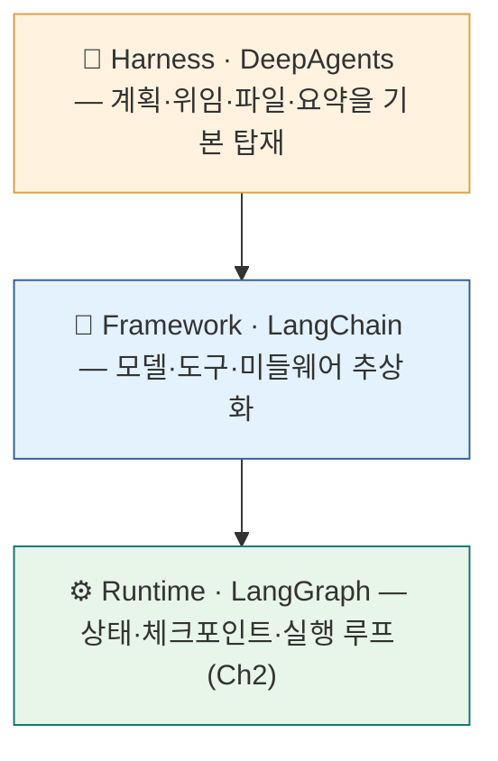
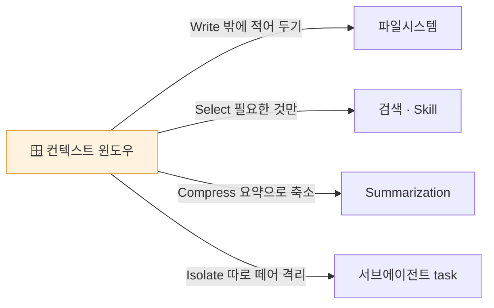
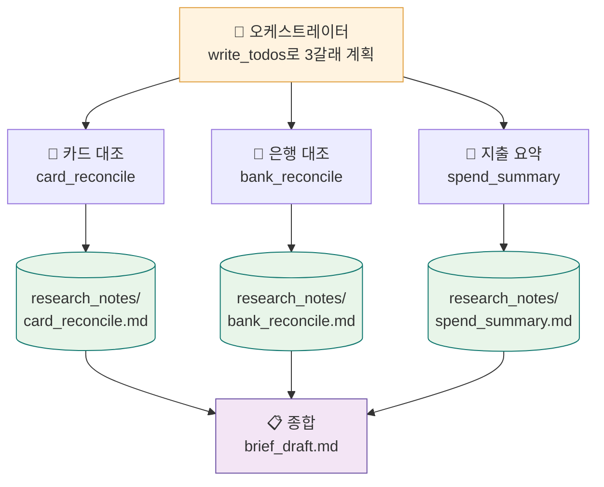

<div class="lec">
<div class="deck">

<section class="slide hero">
<div>
<div class="eyebrow">Chapter 3 · DeepAgents 하네스</div>

# 나눠서,<br>동시에 조사한다

<p class="lead">정규화된 레코드 열 건이 손에 있습니다. 이제 서로 맞대 봐야 합니다. 카드 명세서의 거래마다 영수증이 있는지, 은행 입출금은 계약과 이어지는지.<br>
한 사람이 순서대로 보면 느립니다. 조사 주제를 나눠 서브에이전트가 동시에 돌아갑니다. 그 계획과 파일을 하네스가 관리합니다.</p>

<div class="kicker">
<div class="metric"><span class="num">65</span><strong>분</strong><span>이론 31 · 핸즈온 31</span><span class="clk">예상 11:25–12:30 · 앞 ☕10분</span></div>
<div class="metric"><span class="num">3</span><strong>번째 부품</strong><span>research_orchestrator.py</span></div>
<div class="metric"><span class="num">1</span><strong>누락 발견</strong><span>영수증 없는 89,000원</span></div>
</div>
</div>

<div class="board">
<div class="board-header"><span>이 챕터가 끝나면</span><span class="status-pill">산출물</span></div>
<div class="stack">
<div class="row"><div class="code">1</div><div class="copy"><strong>fan-out 조사</strong><p>주제를 나눠 서브에이전트가 동시에 맞대 봄</p></div><div class="store">병렬</div></div>
<div class="row"><div class="code">2</div><div class="copy"><strong>research_notes/</strong><p>긴 중간 결과를 컨텍스트 밖 파일로 덜어냄</p></div><div class="store">파일</div></div>
<div class="row"><div class="code">3</div><div class="copy"><strong>brief_draft.md</strong><p>짚을 점을 모은 브리프 초안</p></div><div class="store">종합</div></div>
</div>
</div>
</section>

<section class="slide">
<div class="section-head">
<div>
<div class="eyebrow">1 · 위로 한 칸 · 6분</div>

## StateGraph로는 버거운 일

</div>
<p class="section-note">Ch2의 StateGraph는 단계를 우리가 다 그렸습니다. 노드와 엣지를 직접 이었습니다. 조사처럼 무엇을 몇 갈래로 볼지 미리 모르는 일에는 그 방식이 버겁습니다.<br>
하네스는 그 위층입니다. 계획을 세우고, 일을 나눠 위임하고, 긴 결과를 파일로 빼는 일을 알아서 합니다.</p>
</div>

<div class="grid-2">
<div class="panel"><div class="panel-head"><strong>Runtime — StateGraph</strong><span>Ch2</span></div><div class="panel-body"><div class="list">
<p>단계가 정해진 흐름에 맞습니다</p>
<p>분기·재시도를 손으로 그립니다</p>
<p>조사 갈래가 늘면 그래프가 복잡해집니다</p>
</div></div></div>
<div class="panel"><div class="panel-head"><strong>Harness — DeepAgents</strong><span>Ch3</span></div><div class="panel-body"><div class="list">
<p>계획·위임·파일 관리를 기본 제공</p>
<p>주제를 서브에이전트로 나눠 동시 처리</p>
<p>모델은 그대로인데 다룰 수 있는 범위가 넓어집니다</p>
</div></div></div>
</div>

<div class="panel" style="margin-top:18px">
<div class="panel-head"><strong>하네스는 프레임워크 위에, 프레임워크는 런타임 위에</strong><span>3계층</span></div>
<div class="panel-body">



</div>
</div>

<div class="ask" style="margin-top:16px"><strong>하네스가 항상 정답은 아닙니다.</strong> 단계가 정해진 일은 Ch2의 StateGraph가 더 단순하고 빠릅니다. 하네스가 빛나는 건 <strong>몇 갈래로 볼지 미리 모르는</strong> 조사·롱러닝처럼, 계획과 위임을 모델에 맡겨야 할 때입니다.</div>

<p class="section-note" style="margin-top:16px">LangChain은 모델(gpt-5.2-codex)을 <strong>그대로 둔 채</strong> 이 하네스만 반복해 손봐 Terminal-Bench 2.0 점수를 52.8%→66.5%(+13.7%p)로 올렸다고 보고했습니다. Ch1에서 본 "순위를 가르는 건 모델이 아니라 하네스"를 보여 주는 사례입니다. <span style="color:var(--muted)">(LangChain 자체 보고 — 제3자 재현은 아직. 발표 당시 리더보드 30위→5위.)</span></p>

<div class="board" style="margin-top:18px">
<div class="board-header"><span>패러다임 전환 — 프롬프트에서 컨텍스트 엔지니어링으로</span><span class="status-pill">개념</span></div>
<div class="panel-body"><div class="list">
<p>좋은 <em>프롬프트 한 줄</em>을 찾던 시대에서, 모델이 풀 수 있게 <strong>필요한 맥락 전체를 구성</strong>하는 시대로 옮겨 갔습니다(Tobi Lütke·Karpathy가 대중화). 하네스가 하는 일이 정확히 이 컨텍스트 관리입니다 — 아래 네 전략이 DeepAgents의 기본 장비에 그대로 대응합니다.</p>
</div>



</div>
</div>

<div class="board" style="margin-top:18px">
<div class="board-header"><span>하네스는 공짜가 아니다 — 토큰을 더 쓴다</span><span class="status-pill">트레이드오프</span></div>
<div class="panel-body"><div class="list">
<p>기본 미들웨어 스택은 매 호출에 <strong>~3,500 토큰</strong>을 고정으로 더합니다(기본 프롬프트·서브에이전트·할 일·파일·도구 스키마 — deepagents 코드 기준 추정). 계획·위임·파일 관리를 거저 얻는 대신 내는 값입니다.</p>
<p>성능은 또 다른 이야기입니다. 위의 +13.7%p는 토큰을 더 썼다고 저절로 따라온 게 아니라, 하네스를 <strong>반복해 다듬어(harness engineering)</strong> 얻은 결과입니다 — 토큰 비용과 성능 향상은 출처상 별개입니다. 반복되는 앞부분은 프롬프트 캐싱(Ch1)으로 비용을 다시 줄일 수 있습니다.</p>
</div></div>
</div>
</section>

<section class="slide">
<div class="section-head">
<div>
<div class="eyebrow">2 · 한 줄 · 7분</div>

## create_deep_agent의 기본 장비

</div>
<p class="section-note">하네스 에이전트는 한 줄로 만듭니다. 만들면 장비 몇 개가 기본으로 따라옵니다. 계획을 적는 도구, 일을 위임하는 도구, 파일을 읽고 쓰는 도구, 그리고 긴 대화를 자동으로 줄이는 요약 장치입니다(앞 절 네 전략에 그대로 대응).<br>
우리는 여기에 조사용 도구만 얹습니다. 레코드를 요약하는 도구, 노트를 저장하는 도구.</p>
</div>

```python
from deepagents import create_deep_agent

agent = create_deep_agent(
    model="openai:google/gemini-3.5-flash",
    tools=[list_records, write_note],   # 우리가 얹는 조사 도구
    subagents=[                         # task가 위임할 워커 — 빈손으론 못 맡긴다
        {"name": "card_reconcile", "description": "카드↔영수증 대사",
         "system_prompt": "너는 카드 대사 담당이다 ...", "tools": [list_records, write_note]},
        # bank_reconcile · spend_summary 도 같은 꼴 (전체 구성은 --trace로 확인)
    ],
    system_prompt="너는 오케스트레이터다. write_todos로 계획하고 task로 위임해 fan-out 한다 ...",
)
# 기본 장비: write_todos(계획) · task(서브에이전트 위임) · 파일시스템(ls·read_file·write_file·edit_file·glob·grep)
```

<div class="grid-3">
<div class="panel"><div class="panel-head"><strong>write_todos</strong><span>계획</span></div><div class="panel-body"><div class="list">
<p>무엇을 조사할지 먼저 목록으로 적습니다</p>
<p>계획-실행-점검 루프를 강제합니다</p>
</div></div></div>
<div class="panel"><div class="panel-head"><strong>task</strong><span>위임</span></div><div class="panel-body"><div class="list">
<p>주제 하나를 하위 에이전트에 맡깁니다</p>
<p>여러 개를 동시에 돌려 fan-out 합니다</p>
</div></div></div>
<div class="panel"><div class="panel-head"><strong>filesystem</strong><span>덜어내기</span></div><div class="panel-body"><div class="list">
<p>도구 출력이 크면 가상 파일로 빼고 경로와 미리보기만 남깁니다</p>
<p>한 번의 긴 출력이 윈도우를 채우는 걸 막습니다</p>
</div></div></div>
</div>
</section>

<section class="slide">
<div class="section-head">
<div>
<div class="eyebrow">3 · fan-out · 12분</div>

## 주제를 나눠 동시에

</div>
<p class="section-note">조사를 세 갈래로 나눕니다. 카드 대조, 은행 대조, 지출 요약. 서로 독립이라 동시에 돌 수 있습니다.<br>
각 갈래가 끝나면 결과를 research_notes 아래 각자의 파일로 저장합니다. 한 갈래의 긴 출력이 다른 갈래의 맥락을 밀어내지 않습니다.</p>
</div>

<div class="panel">
<div class="panel-head"><strong>오케스트레이터 하나가 셋으로 갈라졌다 다시 모인다</strong><span>fan-out → fan-in</span></div>
<div class="panel-body">



</div>
</div>

<div class="flow" style="grid-template-columns:repeat(3,minmax(0,1fr));margin-top:16px">
<div class="flow-step"><small>갈래 1</small><strong>카드 대조</strong><p>명세서 거래 항목 ↔ 개별 영수증을 맞춰 짝 없는 항목을 찾는다</p></div>
<div class="flow-step"><small>갈래 2</small><strong>은행 대조</strong><p>입출금 ↔ 계약·세금계산서·카드를 잇는다</p></div>
<div class="flow-step"><small>갈래 3</small><strong>지출 요약</strong><p>영수증을 식비·교통·생활로 모은다</p></div>
</div>

<div class="board" style="margin-top:18px">
<div class="board-header"><span>왜 나누면 빠른가</span><span class="status-pill">독립 작업</span></div>
<div class="panel-body"><div class="list">
<p>세 조사는 서로의 결과를 기다리지 않습니다. 그래서 순서대로가 아니라 한꺼번에 돌립니다.</p>
<p>실습 코드는 mock에서도 스레드로 동시에 실행해 fan-out을 그대로 보여 줍니다. 키가 있으면 같은 일을 서브에이전트가 맡습니다.</p>
</div></div>
</div>

<p class="section-note" style="margin-top:18px">이 구조엔 이름이 있습니다 — <strong>오케스트레이터-워커(Orchestrator–Worker)</strong> 패턴. Anthropic이 멀티에이전트 리서치 시스템을 설명하며 정식화한 형태입니다. 리드(오케스트레이터)가 작업을 <em>런타임에</em> 쪼개 — <strong>몇 갈래가 될지 미리 모릅니다</strong> — 각 워커에 위임하고, 결과를 모아 종합합니다. 갈래 수가 입력마다 달라지는 게 정해진 파이프라인(프롬프트 체이닝)과의 차이입니다.</p>

<div class="board" style="margin-top:16px">
<div class="board-header"><span>오케스트레이터-워커 — 실제 메커니즘</span><span class="status-pill">Anthropic 리서치 시스템</span></div>
<div class="panel-body"><div class="list">
<p><strong>① 계획을 메모리에 먼저 박는다</strong> — 리드가 계획을 세워 <em>외부 메모리에 저장</em>합니다. 컨텍스트가 한도에 가까워져 리셋돼도 계획을 잃지 않도록.</p>
<p><strong>② 워커는 각자 격리된 컨텍스트</strong> — 3~5개를 병렬로 띄우되, 각 워커에 <em>목표·출력형식·도구·작업경계</em>를 명시해 줍니다. 위임이 모호하면 워커끼리 같은 걸 중복 조사합니다.</p>
<p><strong>③ 노력을 규모에 맞춘다</strong> — "단순 사실=워커 1개·도구 3~10회, 복잡=워커 10+개로 범위 분할". 사소한 질문에 50개를 띄우는 게 대표적 실패입니다.</p>
<p><strong>④ 종합은 한 에이전트가</strong> — 합치고 인용을 다는 마지막 글쓰기는 <em>쪼개지 않고</em> 한 곳에서. 병렬 작성자는 서로 충돌하기 때문입니다.</p>
<p class="tiny" style="margin-top:6px;color:var(--muted)">한계: 워커는 동기적입니다 — 리드는 전원이 끝날 때까지 기다리며 중간에 방향을 못 바꿉니다. 그래서 토큰을 단일 채팅의 ~15배까지 쓰니, <strong>가치 높고 병렬 가능한 일</strong>에만 값을 합니다.</p>
</div></div>
</div>

<div class="board" style="margin-top:16px">
<div class="board-header"><span>패턴 지도 — 우리 파이프라인이 어디에 닿나</span><span class="status-pill">classify→research→verify→brief</span></div>
<div class="panel-body"><div class="list">
<p><strong>프롬프트 체이닝</strong> — 고정 순서로 단계마다 출력을 넘김. <em>분류→브리프의 등뼈</em>가 이것.</p>
<p><strong>라우팅</strong> — 입력을 분류해 전담 핸들러로 보냄. <em>뉴스레터/회의요청/조사필요로 가르고, 쉬운 건 싼 모델·어려운 건 강한 모델로.</em></p>
<p><strong>병렬화</strong> — 쪼개기(독립 하위작업 동시 실행)와 투표(같은 작업 N번 후 다수결). <em>조사 fan-out은 쪼개기, 피싱 판정 3번 다수결은 투표.</em></p>
<p><strong>오케스트레이터-워커</strong> — 갈래 수를 런타임에 정해 위임·종합. <em>이번 절의 조사가 이것.</em></p>
<p><strong>평가자-최적화자</strong> — 생성기와 별도 비평가가 기준으로 채점→피드백→통과까지 반복. <em>다음 챕터의 "검증" 단계.</em></p>
<p style="margin-top:6px"><strong>한 줄 원칙</strong>: 가장 단순한 것부터, 멀티에이전트는 <em>읽기·수집엔 강하고 쓰기·확정엔 약합니다</em>. 병렬로 모으되, 최종 글은 한 에이전트가 씁니다.</p>
</div></div>
</div>
</section>

<section class="slide">
<div class="section-head">
<div>
<div class="eyebrow">4 · 발견 · 6분</div>

## 영수증 없는 89,000원

</div>
<p class="section-note">카드 대조에서 불일치가 드러납니다. 명세서에는 일곱 건이 있는데 영수증은 다섯 장뿐입니다. 두 건이 비어 있습니다.<br>
쿠팡 89,000원에는 영수증이 없습니다. 넷플릭스 17,000원도 없습니다. 쿠팡 건은 분실 또는 미수령, 넷플릭스 건은 구독으로 추정됩니다. 조사가 내놓는 실제 결과입니다.</p>
</div>

<div class="panel">
<div class="panel-head"><strong>research_notes/card_reconcile.md</strong><span>fan-out 한 갈래의 산출</span></div>
<div class="panel-body">

```text
# 카드 명세서 대사 — 신한카드 (205,900원)
- ✅ 스타벅스 강남R점 11,500원 ↔ 영수증 「스타벅스 강남R점」
- ✅ GS25 역삼점 8,400원 ↔ 영수증 「GS25 역삼점」
- ✅ 카카오T 택시 14,300원 ↔ 영수증 「카카오T 택시」
- ✅ 광화문 국밥 27,000원 ↔ 영수증 「광화문 국밥」
- ⚠️ 쿠팡(주) 89,000원 — 매칭 영수증 없음
- ✅ 올리브영 강남본점 38,700원 ↔ 영수증 「올리브영 강남본점」
- ⚠️ 넷플릭스 17,000원 — 매칭 영수증 없음
```

</div>
</div>

<p class="section-note" style="margin-top:16px">Ch0에서 문서를 서로 연결해 둔 설계가 여기서 효과를 냅니다. 카드 명세서와 영수증이 서로 어긋나는 항목이 섞여 있어, 조사가 그 틈을 정확히 집어냅니다.</p>
</section>

<section class="slide">
<div class="section-head">
<div>
<div class="eyebrow">핸즈온 ① · 코드 정독 · 8분</div>

## 한 갈래의 조사를 읽는다

</div>
<p class="section-note">조사 한 갈래는 결국 레코드를 맞대 보는 함수입니다. 카드 대사를 읽어 봅니다. 명세서 거래줄마다 금액이 같은 영수증을 찾고, 없으면 표시합니다.</p>
</div>

<div class="panel">
<div class="panel-head"><strong>ch3-deepagents/research_orchestrator.py — reconcile_card</strong><span>대사 한 갈래</span></div>
<div class="panel-body">

<<< ../../ch3-deepagents/research_orchestrator.py#reconcile-card{python}

<p class="section-note" style="margin-top:12px">두 가지 짚을 점 — ① <code>if not card</code> 가드가 없으면 카드 명세서가 없을 때 <code>card.items</code>에서 터집니다. ② 금액 단독 매칭(<code>next(...)</code>, first-match)은 <em>같은 금액 영수증이 둘이면 깨집니다</em> — 실무 대사는 (금액·날짜·가맹점) 다중키로 풉니다. 여기선 교육용으로 금액만 봅니다.</p>

</div>
</div>

<div class="grid-2" style="margin-top:16px">
<div class="panel"><div class="panel-head"><strong>fan-out은 어떻게 동시인가</strong></div><div class="panel-body"><div class="list">
<p>세 갈래(<code>card</code>·<code>bank</code>·<code>spend</code>)는 서로의 결과가 필요 없습니다. 그래서 <code>ThreadPoolExecutor</code>로 한꺼번에 돌립니다.</p>
<p>키가 있으면 같은 일을 <code>create_deep_agent</code>의 서브에이전트가 맡습니다. mock의 스레드 병렬과 서브에이전트의 LLM 위임은 <strong>동작 원리가 다르지만</strong>, 갈래를 나눠 동시에 돌리고 결과를 모으는 <strong>구조는 같습니다</strong>.</p>
</div></div></div>
<div class="panel"><div class="panel-head"><strong>왜 금액으로 매칭하나</strong></div><div class="panel-body"><div class="list">
<p>가게 이름은 표기가 제각각이라(쿠팡 vs 쿠팡(주)) 흔들립니다. 금액은 정확히 떨어집니다.</p>
<p>그래서 1원 오차 안에서 금액으로 잇고, 안 맞는 줄을 "확인 필요"로 남깁니다.</p>
</div></div></div>
</div>
</section>

<section class="slide">
<div class="section-head">
<div>
<div class="eyebrow">핸즈온 ② · 단계별 실행 · 18분</div>

## 돌리고, 노트를 연다

</div>
<p class="section-note">Ch2 적재가 먼저 있어야 조사할 레코드가 있습니다. 없으면 gold에서 보충하지만, 순서대로 돌리는 게 정석입니다.</p>
</div>

<div class="stack">
<div class="row"><div class="code">1</div><div class="copy"><strong>먼저 — Ch2 적재(없으면)</strong><p><code>uv run python3 ch2-langgraph-agent/intake_graph.py --mock</code><br><span style="color:var(--muted)">성공 기준: <code>workspace/classified/</code>에 JSON 10개.</span></p></div><div class="store">classified</div></div>
<div class="row"><div class="code">2</div><div class="copy"><strong>fan-out 조사</strong><p><code>uv run python3 ch3-deepagents/research_orchestrator.py --mock</code><br><span style="color:var(--muted)">성공 기준: <code>[plan]</code> 1줄 + <code>[task]</code> 세 줄(순서 뒤섞임) + <code>[synthesize]</code> 1줄. mock은 즉시 끝난다(속도 이득은 키 모드 LLM 호출에서 체감).</span></p></div><div class="store">노트 3</div></div>
<div class="row"><div class="code">3</div><div class="copy"><strong>노트 열어 보기</strong><p><code>cat workspace/research_notes/card_reconcile.md</code><br><span style="color:var(--muted)">성공 기준: 쿠팡 89,000원이 ⚠️로 잡혀 있다.</span></p></div><div class="store">확인</div></div>
<div class="row"><div class="code">4</div><div class="copy"><strong>하네스 내부 열어 보기</strong><p><code>uv run python3 ch3-deepagents/research_orchestrator.py --trace</code><br><span style="color:var(--muted)">성공 기준(키 불필요): <code>create_deep_agent</code>에 배선되는 기본 장비·오케스트레이터 프롬프트·서브에이전트 3개 구성이 출력된다.</span></p></div><div class="store">하네스</div></div>
</div>

<div class="cue do" style="margin-top:18px">
<div class="cue-head"><span class="cue-label">✋ 직접 해보기</span><span class="cue-time">~2분</span></div>
<div class="cue-body">위 2번을 실행해 fan-out 조사를 돌린 뒤, <strong>4번 <code>--trace</code></strong>로 하네스 내부를 직접 엽니다 — <code>create_deep_agent</code>에 <em>무엇이 배선되는지</em>(서브에이전트 3개의 name·description·system_prompt, 기본 장비 write_todos·task)를 키 없이 봅니다. mock은 스레드로 fan-out <em>구조</em>만 보여 주고, 그 구조가 실제로 어떻게 배선되는지는 <code>--trace</code>가 보여 줍니다.</div>
</div>

<div class="cue check" style="margin-top:14px">
<div class="cue-head"><span class="cue-label">👁 확인</span><span class="cue-time">~1분</span></div>
<div class="cue-body">출력의 <code>[task]</code> 세 줄 순서는 실행마다 달라질 수 있습니다(먼저 끝난 갈래가 먼저 찍힘). mock은 함수가 즉시 끝나 속도 이득은 안 보입니다 — 순서 뒤섞임은 병렬 <em>구조</em>의 신호일 뿐, 실제 속도 이득은 키 모드의 LLM 호출에서 납니다.</div>
</div>

<div class="panel" style="margin-top:18px">
<div class="panel-head"><strong>출력 — 동시에 돌고 종합된다</strong><span>brief_draft.md</span></div>
<div class="panel-body">

```text
▶ 조사 대상 10건
  [plan] write_todos → card_reconcile / bank_reconcile / spend_summary
  [task] bank_reconcile → research_notes/bank_reconcile.md
  [task] card_reconcile → research_notes/card_reconcile.md
  [task] spend_summary → research_notes/spend_summary.md
  [synthesize] → workspace/brief_draft.md
```

</div>
</div>

<div class="cue check" style="margin-top:18px">
<div class="cue-head"><span class="cue-label">👁 확인</span><span class="cue-time">~1분</span></div>
<div class="cue-body">출력에서 <code>[task]</code> 세 줄의 순서가 실행할 때마다 뒤바뀝니다. 왜일까요?</div>
</div>

<details>
<summary>정답 확인</summary>
<div class="reveal">
<p>세 조사가 동시에(스레드로) 돌기 때문입니다. 먼저 끝난 갈래가 먼저 출력됩니다. 순서가 고정되지 않는다는 게 곧 병렬로 돌고 있다는 증거입니다.</p>
<p>순차로 돌렸다면 늘 card→bank→spend 순서일 겁니다. fan-out의 효과는 갈래가 많아질수록 커집니다. 다만 갈래 수에 정비례해 빨라지진 않습니다 — API 동시 호출 한도, 가장 느린 갈래(꼬리 지연), 마지막 종합 단계가 상한을 정합니다.</p>
</div>
</details>
</section>

<section class="slide">
<div class="section-head">
<div>
<div class="eyebrow">핸즈온 ③ · 트러블슈팅 · 참고</div>

## 막히면 여기부터

</div>
<p class="section-note">조사 결과가 비거나 이상하면 대개 입력(classified) 문제입니다.</p>
</div>

<div class="grid-2">
<div class="panel"><div class="panel-head"><strong>노트가 비어 있음</strong><span>입력</span></div><div class="panel-body"><div class="list">
<p><code>classified/</code>가 비었습니다. Ch2 intake를 먼저 돌리거나, 코드가 gold에서 보충하는 메시지를 확인하세요.</p>
</div></div></div>
<div class="panel"><div class="panel-head"><strong>쿠팡이 안 잡힘</strong><span>매칭</span></div><div class="panel-body"><div class="list">
<p>분류가 금액을 잘못 읽었을 수 있습니다. classified의 카드 명세서 항목 금액을 확인하세요. mock이면 gold라 항상 잡힙니다.</p>
</div></div></div>
<div class="panel"><div class="panel-head"><strong>키 모드가 느림</strong><span>실호출</span></div><div class="panel-body"><div class="list">
<p>키를 넣으면 <code>create_deep_agent</code>가 실제로 추론하며 도구를 부르므로 수십 초 걸립니다. 흐름 확인은 <code>--mock</code>이 빠릅니다.</p>
</div></div></div>
<div class="panel"><div class="panel-head"><strong>import 에러</strong><span>경로</span></div><div class="panel-body"><div class="list">
<p>이 파일은 Ch1·analyst를 import합니다. 레포 루트에서 <code>uv run</code>으로 실행해야 경로가 잡힙니다.</p>
</div></div></div>
</div>

<p class="section-note" style="margin-top:16px">전체 파일은 <code>ch3-deepagents/research_orchestrator.py</code>. mock은 스레드 동시 실행으로 fan-out을, 키가 있으면 <code>create_deep_agent</code>가 서브에이전트로 같은 조사를 맡습니다.</p>
</section>

<section class="slide">
<div class="section-head">
<div>
<div class="eyebrow">마무리 · 3분</div>

## 다음 — 조사를 지식으로 남긴다

</div>
<p class="section-note">조사가 끝나 노트와 초안이 생겼습니다. 다만 노트는 흩어진 메모입니다. 다음 달 인박스에도 다시 쓰려면 표준 형식으로 쌓아 둬야 합니다.<br>
Ch4에서는 이 결과를 OKF 지식 항목으로 적재하고, 브리프 쓰는 절차를 Skill로 묶고, 파일과 메일을 MCP로 연결합니다.</p>
</div>

<div class="grid-3">
<div class="panel"><div class="panel-head"><strong>지금 손에 든 것</strong></div><div class="panel-body"><div class="list">
<p>fan-out 조사 오케스트레이터</p>
<p>research_notes 3건 · brief_draft.md</p>
</div></div></div>
<div class="panel"><div class="panel-head"><strong>Ch4에서 할 것</strong></div><div class="panel-body"><div class="list">
<p>SKILL.md · MCP 파일/메일</p>
<p>OKF 지식 적재 · plugin 패키징</p>
</div></div></div>
<div class="panel"><div class="panel-head"><strong>최종 목적지</strong></div><div class="panel-body"><div class="list">
<p>인박스 한 통 → 검증된 브리프</p>
<p>Ch6 통합 캡스톤</p>
</div></div></div>
</div>

<div class="board" style="margin-top:18px">
<div class="board-header"><span>참고 자료</span><span class="status-pill">출처</span></div>
<div class="panel-body"><div class="list">
<p><a href="https://blog.langchain.com/deep-agents/">LangChain Deep Agents</a> · <a href="https://github.com/langchain-ai/deepagents">deepagents 0.6</a></p>
<p><a href="https://www.anthropic.com/engineering/building-effective-agents">Anthropic — Orchestrator-Worker</a> · <a href="https://martinfowler.com/articles/exploring-gen-ai/harness-engineering.html">Harness Engineering</a></p>
</div></div>
</div>
</section>


<nav class="chapnav">
<div class="board" style="margin-top:8px">
<div style="display:grid;grid-template-columns:1fr auto 1fr;gap:14px;align-items:center">
<a href="/deepagents-handson/chapters/chapter-2" style="color:inherit;text-decoration:none;font-weight:900;font-size:14px">← Ch2 · LangGraph 하네스</a>
<a href="/deepagents-handson/toc" style="color:var(--forest);text-decoration:none;font-weight:900;font-size:13px;background:rgba(148,210,189,.3);border:1px solid rgba(15,118,110,.24);border-radius:99px;padding:7px 16px">목차</a>
<a href="/deepagents-handson/chapters/chapter-4" style="color:inherit;text-decoration:none;font-weight:900;font-size:14px;text-align:right">Ch4 · Skills · MCP · 지식 →</a>
</div>
</div>
</nav>

</div>
</div>
