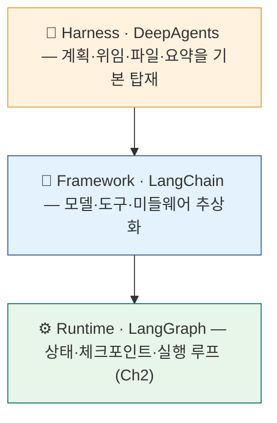
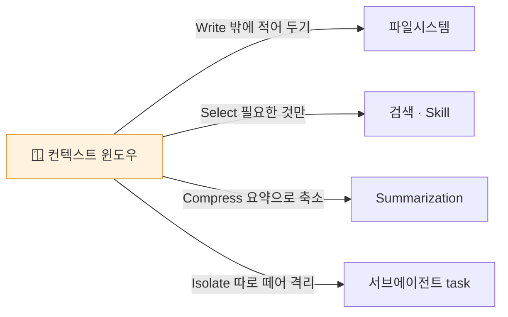
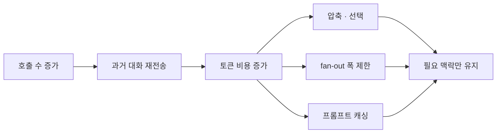
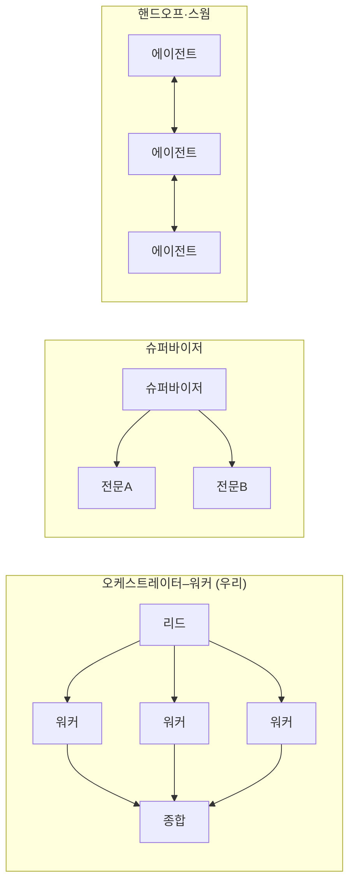
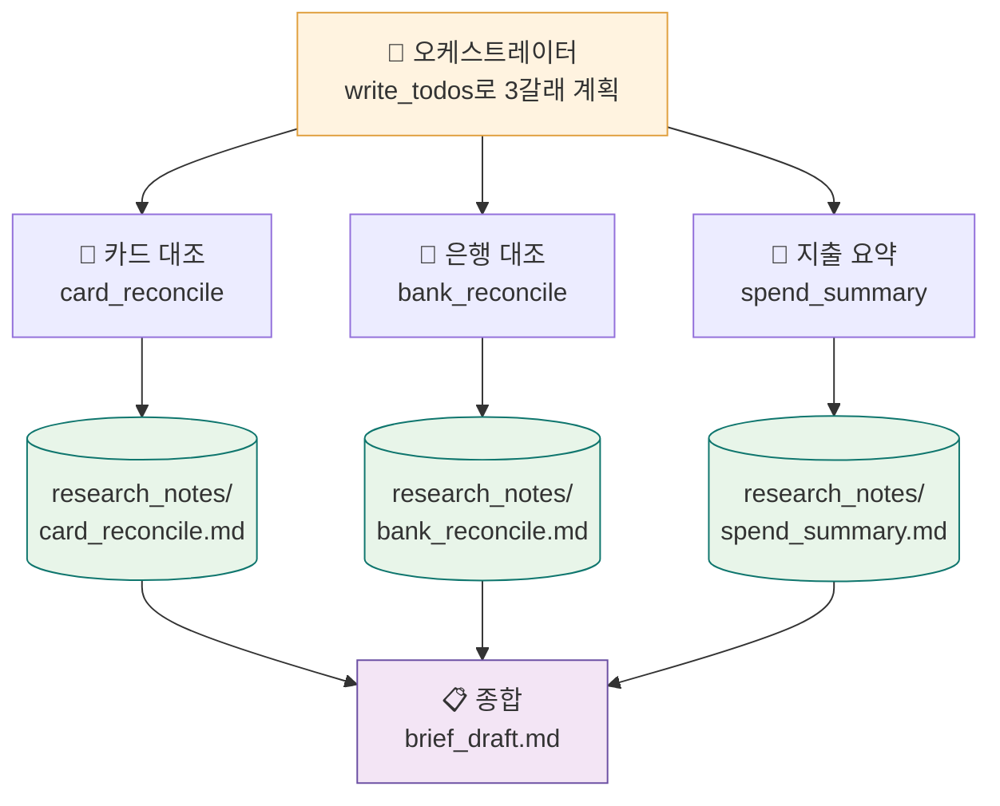
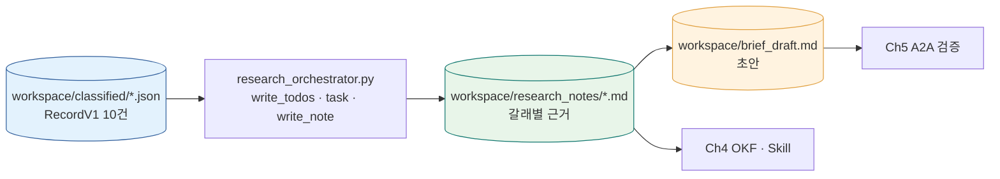

<div class="lec">
<div class="deck">

<section class="slide hero">
<div>
<div class="eyebrow">Chapter 3 · DeepAgents 하네스</div>

# 나눠서,<br>동시에 조사한다

<p class="lead">정규화된 레코드 열 건이 준비됐습니다. 이제 서로 맞대 봐야 합니다. 카드 명세서의 거래마다 영수증이 있는지, 은행 입출금은 계약과 이어지는지 확인합니다.<br>
한 사람이 순서대로 보면 느립니다. 조사 주제를 나눠 서브에이전트가 동시에 돌아갑니다. 그 계획과 파일을 하네스가 관리합니다.</p>

<div class="kicker">
<div class="metric"><span class="num">67</span><strong>분</strong><span>이론 35 · 핸즈온 26 · 점검·마무리 6</span><span class="clk">예상 11:25–12:32 · 앞 ☕10분</span></div>
<div class="metric"><span class="num">3</span><strong>번째 모듈</strong><span>research_orchestrator.py</span></div>
<div class="metric"><span class="num">3</span><strong>짚을 점</strong><span>영수증 없는 89,000원 외 2건</span></div>
</div>
</div>

<div class="board">
<div class="board-header"><span>이 챕터가 끝나면</span><span class="status-pill">산출물</span></div>
<div class="stack">
<div class="row"><div class="code">1</div><div class="copy"><strong>fan-out 조사</strong><p>주제를 나눠 서브에이전트가 동시에 맞대 봄</p></div><div class="store">병렬</div></div>
<div class="row"><div class="code">2</div><div class="copy"><strong>research_notes/</strong><p>긴 중간 결과를 컨텍스트 밖 파일로 덜어냄</p></div><div class="store">파일</div></div>
<div class="row"><div class="code">3</div><div class="copy"><strong>brief_draft.md</strong><p>짚을 점을 모은 브리프 초안</p></div><div class="store">종합</div></div>
</div>
</div>
</section>

<section class="slide">
<div class="section-head">
<div>
<div class="eyebrow">1 · 위로 한 칸 · 9분</div>

## StateGraph로는 버거운 일

</div>
<p class="section-note">먼저 손으로 해보면 압니다. 명세서엔 카드 거래 일곱 줄, 영수증은 다섯 장. 어느 거래에 영수증이 빠졌는지 맞대 보고(쿠팡 89,000원이 안 보입니다), 은행 출금에서 계약·세금계산서와 안 이어지는 줄을 또 찾고, 지출을 식비·교통으로 또 모읍니다. 같은 더미를 <em>세 번</em> 훑고, 볼 갈래가 늘수록 한 사람으론 느려집니다.<br>
Ch2의 StateGraph는 단계를 우리가 다 그렸지만, 이렇게 같은 입력을 여러 관점으로 다시 읽는 일엔 그래프가 금방 복잡해집니다. 이 실습에서는 조사 관점 세 개(카드·은행·지출)를 <strong>미리 정해</strong> 병렬 위임합니다. 동적으로 갈래를 고르는 큰 리서치 시스템은 같은 패턴의 확장이고, 여기서는 먼저 고정 3갈래로 fan-out의 구조를 손에 잡습니다.</p>
</div>

<div class="grid-2">
<div class="panel"><div class="panel-head"><strong>Runtime — StateGraph</strong><span>Ch2</span></div><div class="panel-body"><div class="list">
<p>단계가 정해진 파이프라인에 맞습니다</p>
<p>분기·재시도를 손으로 그립니다</p>
<p>조사 갈래가 늘면 그래프가 복잡해집니다</p>
</div></div></div>
<div class="panel"><div class="panel-head"><strong>Harness — DeepAgents</strong><span>Ch3</span></div><div class="panel-body"><div class="list">
<p>계획·위임·파일 관리를 기본 제공</p>
<p>주제를 서브에이전트로 나눠 동시 처리</p>
<p>모델은 그대로인데 다룰 수 있는 범위가 넓어집니다</p>
</div></div></div>
</div>

<div class="panel" style="margin-top:18px">
<div class="panel-head"><strong>하네스는 프레임워크 위에, 프레임워크는 런타임 위에</strong><span>3계층</span></div>
<div class="panel-body">



</div>
</div>

<div class="ask" style="margin-top:16px"><strong>하네스가 항상 정답은 아닙니다.</strong> 단계가 정해진 일은 Ch2의 StateGraph가 더 단순하고 빠릅니다. 하네스가 필요한 경우는 조사 관점이 여러 개이고, 각 갈래의 중간 결과가 길어져 계획·위임·파일 관리가 필요할 때입니다. 이번 랩은 그 최소형인 <strong>고정 3갈래</strong>입니다.</div>

<div class="board" style="margin-top:18px">
<div class="board-header"><span>Ch2에서 손으로 짠 것 → Ch3 기본 제공</span><span class="status-pill">보일러플레이트 대체</span></div>
<div class="panel-body">
<p>하네스가 "무엇을 대신해 주나"는 Ch2와 나란히 보면 또렷합니다. 같은 일을 Ch2에선 직접 짰고, <code>create_deep_agent</code> 한 줄은 그걸 기본으로 깝니다.</p>
<div class="grid" style="grid-template-columns:1fr 1fr;gap:12px;margin-top:10px">
<div class="panel"><div class="panel-head"><strong>계획 세우기</strong><span>계획</span></div><div class="panel-body"><div class="list"><p>Ch2: 노드·엣지를 손으로 배치 → Ch3: <code>write_todos</code>(TodoListMiddleware)가 계획 상태를 관리</p></div></div></div>
<div class="panel"><div class="panel-head"><strong>위임·병렬</strong><span>위임</span></div><div class="panel-body"><div class="list"><p>Ch2: 직접 분기·반복 → Ch3: <code>task</code> 도구가 서브에이전트로 fan-out</p></div></div></div>
<div class="panel"><div class="panel-head"><strong>큰 출력 덜어내기</strong><span>파일</span></div><div class="panel-body"><div class="list"><p>Ch2: 상태에 다 이고 감 → Ch3: filesystem 장치가 파일로 빼고 경로만 남김</p></div></div></div>
<div class="panel"><div class="panel-head"><strong>긴 대화 줄이기</strong><span>압축</span></div><div class="panel-body"><div class="list"><p>Ch2: <code>MAX_RETRY</code>로 길이를 손수 제한 → Ch3: SummarizationMiddleware가 자동 요약</p></div></div></div>
</div>
<p class="section-note" style="margin-top:10px">대신 그만큼 토큰을 더 씁니다(아래 트레이드오프). 그래서 단계가 정해진 일엔 Ch2가, 갈래를 모르는 일엔 Ch3가 맞습니다.</p>
</div>
</div>

<p class="section-note" style="margin-top:16px">LangChain은 동일한 코딩 모델을 둔 채 하네스를 반복 개선해 벤치마크 점수가 크게 달라졌다고 보고했습니다. Ch1에서 본 "순위를 가르는 건 모델이 아니라 하네스"를 보여 주는 사례입니다. <span style="color:var(--muted)">숫자는 공급사 보고라 외우지 않습니다. 이 수업의 증거는 아래에서 직접 생기는 노트·브리프 파일입니다.</span></p>

<div class="board" style="margin-top:18px">
<div class="board-header"><span>패러다임 전환 — 프롬프트에서 컨텍스트 엔지니어링으로</span><span class="status-pill">개념</span></div>
<div class="panel-body"><div class="list">
<p>좋은 <em>프롬프트 한 줄</em>보다, 모델이 풀 수 있게 필요한 맥락 전체를 구성하는 일이 더 중요해졌습니다(Tobi Lütke·Karpathy가 대중화). 하네스가 담당하는 일도 이 컨텍스트 관리입니다. 아래 네 전략이 DeepAgents의 기본 도구에 대응합니다.</p>
</div>



</div>
</div>

<div class="board" style="margin-top:18px">
<div class="board-header"><span>메모리는 한 종류가 아니다 — 무엇을 어디에 두나</span><span class="status-pill">단기 / 장기 3종</span></div>
<div class="panel-body">
<p>컨텍스트를 밖에 적어 둘 때 메모리는 한 덩어리가 아닙니다. 통용 분류는 <strong>단기</strong>(지금 대화)와 <strong>장기</strong>로 갈리고, 장기는 다시 셋입니다(<a href="https://arxiv.org/abs/2309.02427" target="_blank" rel="noopener">CoALA, 2023</a> — 언어 에이전트 메모리 프레임워크. semantic·episodic 구분은 인지심리학 Tulving에 뿌리). 우리 파이프라인의 파일들이 정확히 그 자리에 들어갑니다.</p>
<div class="grid" style="grid-template-columns:1fr 1fr;gap:12px;margin-top:10px">
<div class="panel"><div class="panel-head"><strong>단기 (working)</strong><span>지금 창</span></div><div class="panel-body"><div class="list"><p>현재 대화·컨텍스트 윈도우. LangGraph라면 thread별 <code>checkpointer</code>(Ch2). 세션이 끝나면 사라진다</p></div></div></div>
<div class="panel"><div class="panel-head"><strong>장기 · semantic</strong><span>사실·지식</span></div><div class="panel-body"><div class="list"><p>잘 안 변하는 사실·프로필. 우리의 <code>knowledge_base/</code>(OKF 지식, Ch4)가 여기</p></div></div></div>
<div class="panel"><div class="panel-head"><strong>장기 · episodic</strong><span>지난 경험</span></div><div class="panel-body"><div class="list"><p>과거 상호작용·결과의 기록. 우리의 <code>research_notes/</code>·브리프가 여기</p></div></div></div>
<div class="panel"><div class="panel-head"><strong>장기 · procedural</strong><span>방법·절차</span></div><div class="panel-body"><div class="list"><p>어떻게 하는지의 절차. <strong>Skill이 곧 procedural 메모리</strong>(SKILL.md, Ch4)</p></div></div></div>
</div>
<p class="section-note" style="margin-top:10px">그래서 메모리를 붙인다는 건 막연한 게 아니라 <em>종류별로 다른 저장소</em>에 두는 일입니다. LangGraph는 단기=checkpointer / 장기=cross-thread <code>Store</code>로 나누고, deepagents는 <code>StoreBackend</code>·memory 미들웨어로 같은 분리를 제공합니다. 공급사 네이티브 기능도 같은 방향입니다. 단 이 영역은 아직 빠르게 바뀝니다. 정확한 회수·새 정보 갱신·선택적 망각을 동시에 잘하는 방법은 수업 필수 경로가 아니라 운영 설계 문제로 남겨 둡니다.</p>
</div>
</div>

<div class="board" style="margin-top:18px">
<div class="board-header"><span>하네스는 공짜가 아니다 — 토큰을 더 쓴다</span><span class="status-pill">트레이드오프</span></div>
<div class="panel-body"><div class="list">
<p>기본 미들웨어 스택은 매 호출에 <strong>~3,500 토큰</strong>을 고정으로 더합니다(기본 프롬프트·서브에이전트·할 일·파일·도구 스키마, deepagents 코드 기준 추정). 계획·위임·파일 관리를 쓰는 데 드는 비용입니다. 게다가 이 고정 오버헤드는 서브에이전트마다 한 번씩 붙어, fan-out 폭이 N이면 대략 N배로 늘죠. 그래서 갈래 수를 규모에 맞추라는 아래 ③ 규칙은 정확도뿐 아니라 비용 면에서도 중요합니다.</p>
<p>성능은 또 다른 이야기입니다. 위의 +13.7%p는 토큰을 더 썼다고 저절로 따라온 게 아니라, 하네스를 반복해 다듬어(harness engineering) 얻은 결과입니다. 토큰 비용과 성능 향상은 출처상 별개입니다. 반복되는 앞부분은 프롬프트 캐싱(Ch1)으로 비용을 다시 줄일 수 있습니다.</p>
<p class="muted" style="margin-top:6px">덜 쓰는 게 더 나을 때도 많습니다. 전체 이력을 다 들고 가기보다 <em>최근 도구 호출 몇 개 + 자동 요약</em>만 남기는 식의 압축·선택 전략이 비용과 안정성에 유리한 사례가 계속 보고됩니다. 그래서 위 네 전략 중 Compress·Select를 실제 하네스 기능으로 봅니다.</p>
</div></div>
</div>



<details class="deep">
<summary>🔬 심화 — "~3,500 토큰"은 어디서 나오고, 왜 호출 수에 따라 초선형으로 느나 <span style="color:var(--muted)">(비용 직관)</span></summary>
<div class="reveal">
<p>고정 오버헤드 ~3,500은 미들웨어 스택이 <em>매 호출</em> 시스템 프롬프트에 싣는 것들의 합이다. 한 측정 예시(비율은 버전·도구 수에 따라 변함):</p>
<table>
<thead><tr><th>구성</th><th>대략</th><th>무엇</th></tr></thead>
<tbody>
<tr><td>기본 프롬프트</td><td>~1,300</td><td>하네스 행동 지침</td></tr>
<tr><td>도구 스키마·설명</td><td>~1,300</td><td>write_todos·task·read_file 등(read_file 설명만 ~330)</td></tr>
<tr><td>SubAgent 미들웨어</td><td>~460</td><td>위임 도구·서브에이전트 목록</td></tr>
<tr><td>TodoList</td><td>~200</td><td>할 일 관리</td></tr>
<tr><td>Filesystem</td><td>~210</td><td>파일 도구</td></tr>
</tbody>
</table>
<p>여기까진 호출당 <em>고정</em>이다. <strong>진짜 비용 폭발은 다른 데서 온다.</strong> 모델은 상태가 없어서(Ch1), 매 호출마다 <em>지금까지의 대화 전체</em>를 다시 보낸다. 그래서 멀티콜 에이전트의 토큰은 "3,500 × 호출 수"가 아니라, 고정 오버헤드(매번 재전송) + 계속 쌓이는 대화 기록(매번 재전송) + 도구 결과로 불어난다. 한 측정에서 ~22,000 토큰짜리 실행을 쪼개 보니 대략 <strong>고정 오버헤드 63% · 누적 대화 기록 27% · 도구 결과 10%</strong>였다. 호출이 늘수록 가운데 27% 칸이 커지며 비용이 <em>호출 수에 초선형</em>으로 증가한다.</p>
<p><strong>그래서 Agent는 마지막 수단이다.</strong> 자율성을 키우면 호출이 늘고, 호출마다 누적 기록을 통째로 다시 사니 비용이 빠르게 뛴다. 줄이는 방법은 셋: ① <strong>fan-out 폭을 규모에 맞추기</strong>(N갈래 = 고정 오버헤드 N배), ② <strong>프롬프트 캐싱</strong>(반복되는 앞부분 재계산 면제, Ch1), ③ <strong>컨텍스트 압축·선택</strong>(누적 기록을 요약/잘라 27% 칸을 억제).</p>
<p class="muted"><strong>핵심 정리</strong>: "토큰은 호출 수에 곱하기가 아니라 <em>제곱에 가깝게</em> 는다. 매 호출이 과거 전체를 다시 사기 때문. 그래서 단계가 정해졌으면 워크플로(Ch2)가 싸다." 숫자는 예시이고, 외워야 할 건 <em>재전송 구조</em>입니다.</p>
</div>
</details>
</section>

<section class="slide">
<div class="section-head">
<div>
<div class="eyebrow">2 · 한 줄 · 8분</div>

## create_deep_agent의 기본 장비

</div>
<p class="section-note">하네스 에이전트는 한 줄로 만듭니다. 생성하면 계획을 적는 도구, 일을 위임하는 도구, 파일을 읽고 쓰는 도구, 긴 대화를 줄이는 요약 기능이 기본으로 포함됩니다(앞 절 네 전략에 대응).<br>
우리는 여기에 조사용 도구를 추가합니다. 메인은 레코드를 읽어 위임하고, 노트 저장 도구는 워커에게만 줘서 조사 결과가 <code>research_notes/*.md</code>로 남게 합니다.</p>
</div>

```python
from deepagents import create_deep_agent

agent = create_deep_agent(
    model="openai:anthropic/claude-haiku-4.5",
    tools=[list_records],               # 메인이 직접 쓰는 도구
    subagents=[                         # task가 위임할 워커 — 명시해야 맡길 수 있다
        {"name": "card_reconcile", "description": "카드↔영수증 대사",
         "system_prompt": "너는 카드 대사 담당이다 ...", "tools": [list_records, write_note]},
        # bank_reconcile · spend_summary 도 같은 꼴 (전체 구성은 --trace로 확인)
    ],
    system_prompt="너는 오케스트레이터다. write_todos로 계획하고 task로 위임해 fan-out 한다 ...",
)
# 기본 장비: write_todos(계획) · task(서브에이전트 위임) · 파일시스템(ls·read_file·write_file·edit_file·glob·grep)
```

<div class="grid-3">
<div class="panel"><div class="panel-head"><strong>write_todos</strong><span>계획</span></div><div class="panel-body"><div class="list">
<p>무엇을 조사할지 먼저 목록으로 적습니다</p>
<p>계획-실행-점검 루프를 강제합니다</p>
</div></div></div>
<div class="panel"><div class="panel-head"><strong>task</strong><span>위임</span></div><div class="panel-body"><div class="list">
<p>주제 하나를 하위 에이전트에 맡깁니다</p>
<p>여러 개를 동시에 돌려 fan-out 합니다</p>
</div></div></div>
<div class="panel"><div class="panel-head"><strong>filesystem</strong><span>덜어내기</span></div><div class="panel-body"><div class="list">
<p>도구 출력이 크면 파일로 빼고 경로와 미리보기만 남깁니다</p>
<p>한 번의 긴 출력이 윈도우를 채우는 걸 막습니다</p>
</div></div></div>
</div>

<div class="board" style="margin-top:20px">
<div class="board-header"><span>덜어낸 파일은 어디 사는가 — 백엔드를 갈아끼운다</span><span class="status-pill">deepagents</span></div>
<div class="panel-body">
<p><code>filesystem</code> 도구가 파일을 어디에 두는지는 <strong>백엔드</strong>가 정합니다. 코드는 그대로 두고 저장 위치만 바꿉니다.</p>
<div class="grid" style="grid-template-columns:repeat(2,1fr);gap:12px;margin-top:10px">
<div class="panel"><div class="panel-head"><strong>StateBackend</strong><span>기본 · 휘발</span></div><div class="panel-body"><div class="list"><p>파일이 에이전트 <em>상태</em>에 머문다. 실행이 끝나면 사라진다. 컨텍스트 창만 비울 뿐 영구 저장은 아니다</p></div></div></div>
<div class="panel"><div class="panel-head"><strong>FilesystemBackend</strong><span>디스크</span></div><div class="panel-body"><div class="list"><p><code>root_dir</code> 아래 실제 파일로 쓴다. 실행 뒤에도 남아 다시 읽거나 감사할 수 있다</p></div></div></div>
<div class="panel"><div class="panel-head"><strong>StoreBackend</strong><span>세션 간</span></div><div class="panel-body"><div class="list"><p>LangGraph Store에 둬 스레드·세션을 넘어 남는다</p></div></div></div>
<div class="panel"><div class="panel-head"><strong>CompositeBackend</strong><span>경로별 분배</span></div><div class="panel-body"><div class="list"><p>경로 접두사로 갈라 라우팅한다. 임시는 state, 산출물은 disk로</p></div></div></div>
</div>
<p class="section-note" style="margin-top:12px">기본은 <strong>StateBackend</strong>라 덜어낸 파일도 기본은 휘발입니다. "컨텍스트 밖으로 뺀다"가 "디스크에 영구 저장"과 같은 말이 아니라는 게 요점입니다. 이 랩의 재현성은 별개로, 입력(<code>sample_inbox</code>)과 산출물을 <code>workspace/</code> 디스크에 남겨 누가 돌려도 같은 결과가 나오게 하는 데서 옵니다.</p>
<p class="tiny" style="margin-top:8px;color:var(--muted)"><strong>한 발 더.</strong> 우리 랩은 이 백엔드를 갈아끼우는 대신 노트를 <code>workspace/</code>에 <em>직접</em> 씁니다. 한 줄로 끼우려면 <code>create_deep_agent(..., backend=CompositeBackend(default=StateBackend(), routes=&#123;"/research_notes/": FilesystemBackend(root_dir=WORKSPACE)&#125;))</code>, "임시는 state, <code>/research_notes/</code>만 disk"가 코드로 표현됩니다. <code>StoreBackend</code>·<code>CompositeBackend</code>는 이 챕터에선 이름만 다루고(코드 미시연), 실제로 거는 건 기본 <code>StateBackend</code> 하나입니다.</p>
<table style="margin-top:10px">
<thead><tr><th>같은 "파일"이라는 말</th><th>어디에 생기나</th><th>이 실습에서의 역할</th></tr></thead>
<tbody>
<tr><td>DeepAgents 기본 filesystem 파일</td><td>기본 <code>StateBackend</code> 안</td><td>컨텍스트 창을 비우기 위한 임시 작업공간. 기본값만 쓰면 실행 뒤 사라질 수 있다.</td></tr>
<tr><td>우리 <code>write_note()</code> 산출물</td><td>레포의 <code>workspace/research_notes/*.md</code></td><td>학생이 <code>cat</code>으로 열어 보는 실제 디스크 파일. Ch4·Ch6에서 다시 읽을 수 있다.</td></tr>
</tbody>
</table>
</div>
</div>

<details class="deep">
<summary>🔬 심화 — 공개 백엔드와 셸 실행·샌드박싱 <span style="color:var(--muted)">(현재 deepagents 공개 API 기준)</span></summary>
<div class="reveal">
<p>위 4종은 저장 위치만 바꾸지만, 백엔드에는 한 축이 더 있다. <strong>셸 실행</strong> 여부다. 현재 공개 API에서 수업에 직접 연결되는 백엔드는 다음 다섯 가지다:</p>
<table>
<thead><tr><th>백엔드</th><th>저장</th><th>영속</th><th>셸 실행</th></tr></thead>
<tbody>
<tr><td><code>StateBackend</code></td><td>에이전트 상태(메모리)</td><td>실행 끝나면 휘발</td><td>✗</td></tr>
<tr><td><code>FilesystemBackend</code></td><td><code>root_dir</code> 아래 실제 파일</td><td>디스크에 남음</td><td>✗</td></tr>
<tr><td><code>StoreBackend</code></td><td>LangGraph Store(+Postgres)</td><td>스레드·세션 간</td><td>✗</td></tr>
<tr><td><code>CompositeBackend</code></td><td>경로 접두사로 라우팅</td><td>대상 백엔드 따름</td><td>위임</td></tr>
<tr><td><code>LocalShellBackend</code></td><td><code>FilesystemBackend</code> 상속</td><td>디스크에 남음</td><td><strong>✓ <code>execute()</code></strong></td></tr>
</tbody>
</table>
<p><strong>프로토콜이 둘로 갈린다.</strong> <code>BackendProtocol</code>은 파일 연산(<code>ls·read·write·edit·download_files·ls_info</code>)만 정의하고, <code>SandboxBackendProtocol</code>이 그걸 상속해 <code>execute()</code>(셸 명령) 하나를 더한다. 그래서 "파일만 다루는 백엔드"와 "명령도 돌리는 백엔드"가 타입으로 구분되며, <code>LocalShellBackend(FilesystemBackend, SandboxBackendProtocol)</code>가 후자다.</p>
<p><strong>셸 실행엔 격리가 없다.</strong> <code>LocalShellBackend</code>는 명령을 <em>호스트에서 직접</em> 돈다. 소스 첫 줄이 못 박는다: "NO sandboxing or isolation — all operations run directly on the host system." 안전장치는 <code>timeout</code>(기본값 있음)과 <code>max_output_bytes</code>(100KB)뿐이라 <strong>개발·CI 전용</strong>이고, 신뢰할 수 없는 코드를 돌리려면 원격 샌드박스(Daytona·Modal·Runloop 같은 격리 환경)를 백엔드로 끼운다.</p>
<p><strong><code>virtual_mode=True</code>는 보안 경계의 <em>일부</em>다.</strong> <code>root_dir</code>를 가상 루트로 삼아 모든 경로를 그 아래로 해석하고 <code>..</code>·<code>~</code> 같은 경로 탈출을 막는다. 다만 소스도 명시하듯 "경로 기반 제한은 그 자체로 보안을 <em>보장</em>하지 않는다." 진짜 격리는 프로세스·네트워크 차원의 샌드박스가 한다. 우리 Ch4 <code>skill_agent</code>가 <code>FilesystemBackend(virtual_mode=True)</code>로 레포 전체가 아닌 좁은 뷰만 보이게 한 게 이 경계의 1차선이다.</p>
<p class="muted"><strong>핵심 정리</strong>: "백엔드는 두 축이다: <em>어디 저장하나</em>(state/disk/store/hub)와 <em>셸을 도나</em>(LocalShell만 ✓, 그것도 격리 없음). 신뢰 못 할 코드는 원격 샌드박스." 학생 실습은 기본 <code>StateBackend</code> 하나로 충분합니다.</p>
</div>
</details>

<div class="board" style="margin-top:20px">
<div class="board-header"><span>긴 작업은 계획과 산출물을 밖으로 뺀다 — Initializer / Executor</span><span class="status-pill">롱러닝 패턴</span></div>
<div class="panel-body">
<p>한 에이전트가 긴 작업을 한 번에 끌고 가면 네 가지가 깨집니다. ① <strong>컨텍스트 소진</strong>(대화가 한도를 넘음), ② <strong>토큰 낭비</strong>(매 턴 과거 전체를 다시 읽음), ③ <strong>복구 비용</strong>(중간에 죽으면 처음부터), ④ <strong>거짓 완료</strong>(다 못 했는데 "끝났다"고 함). 그래서 하네스는 일을 둘로 나눕니다.</p>
<div class="grid" style="grid-template-columns:1fr 1fr;gap:14px;margin-top:10px">
<div class="panel"><div class="panel-head"><strong>Initializer</strong><span>계획을 적는다</span></div><div class="panel-body"><div class="list"><p>할 일을 <code>write_todos</code>로 구조화해 에이전트 상태에 먼저 남긴다. 파일 영속화가 필요하면 filesystem/backend를 따로 쓴다</p></div></div></div>
<div class="panel"><div class="panel-head"><strong>Executor</strong><span>하나씩 처리</span></div><div class="panel-body"><div class="list"><p>계획을 한 항목씩 실행하며 진행 상태를 갱신한다. 긴 중간 결과는 파일로 빼서 컨텍스트 창을 비운다</p></div></div></div>
</div>
<p class="section-note" style="margin-top:10px">핵심은 "계획은 구조화된 상태로, 큰 산출물은 외부 저장소로" 분리하는 것입니다. DeepAgents의 <code>write_todos</code>는 TodoListMiddleware가 제공하는 상태 관리 도구이고, 파일로 빼는 역할은 filesystem/backend가 맡습니다. 우리 오케스트레이터는 그 위에 <code>write_note()</code>를 더해 조사 노트를 실제 <code>workspace/research_notes/</code> 디스크 파일로 남깁니다.</p>
</div>
</div>

<details class="deep">
<summary>🔬 심화 — 네 문제를 각각 무엇으로 막나 <span style="color:var(--muted)">(롱러닝 에이전트 엔지니어링)</span></summary>
<div class="reveal">
<p>"둘로 나눈다"는 발상의 핵심은 유한한 컨텍스트 창을, 무한한 외부 메모리(파일시스템)로 우회하는 것이다. 위 네 문제는 각각 다른 방법으로 막힌다:</p>
<table>
<thead><tr><th>문제</th><th>대처</th><th>산출물</th></tr></thead>
<tbody>
<tr><td>① 컨텍스트 소진</td><td>계획은 구조화된 todo/state로 관리하고, 긴 산출물은 파일·스토어로 외부화한다</td><td><code>write_todos</code>·notes</td></tr>
<tr><td>② 토큰 낭비</td><td>진행 상태를 <strong>단일 진실원(SSOT)</strong> 파일 하나에 모은다. 매 턴 과거 전체가 아니라 그 요약만 읽는다</td><td><code>progress.txt</code></td></tr>
<tr><td>③ 복구 비용</td><td><strong>청크 단위</strong>로 쪼개 실패한 청크만 되돌려 재시도. 환경은 스크립트로 재구성해 처음부터 안 한다</td><td><code>git revert</code>·<code>init.sh</code></td></tr>
<tr><td>④ 거짓 완료</td><td>완료를 <em>모델의 말</em>이 아니라 <code>progress.txt</code>의 청크별 체크로 판정. 남은 게 있으면 안 끝난 것</td><td>progress 체크</td></tr>
</tbody>
</table>
<p>핵심 통찰은 "끝났다"를 모델 자기보고가 아니라 관측 가능한 상태로 정의한다는 것이다. Anthropic도 긴 작업을 한 번(one-shot)에 시키면 중간 실패에서 복구 불능이 되고, 단계를 외부 상태로 못 박아야 재개·감사·부분 재시도가 가능하다고 본다. 우리 랩의 fan-out도 작은 버전이다(<code>write_todos</code> 계획 상태→갈래별 노트 파일→대조). 갈래 하나가 죽어도 이미 쓴 노트는 디스크에 남는다.</p>
<p class="muted"><strong>핵심 정리</strong>: "긴 작업의 적은 컨텍스트 한도다. 답은 <em>상태를 밖으로 빼는 것</em>이다. todo/state로 진행을 관리하고, 큰 산출물은 파일·스토어에 두면 감사와 재시도가 쉬워진다." <code>git revert</code>·<code>init.sh</code>·<code>progress.txt</code>는 특정 API가 아니라 그 패턴을 구현하는 흔한 도구입니다.</p>
</div>
</details>

<div class="board" style="margin-top:18px">
<div class="board-header"><span>한 번에 끝났는지 누가 아나 — 자가 채점 루프</span><span class="status-pill">패턴 · 코드 미시연</span></div>
<div class="panel-body">
<p>긴 작업엔 또 하나의 문제가 있습니다. 에이전트는 <em>자기 출력이 충분한지</em>를 어떻게 알까요? 한 번 쓰고 "끝났다"고 멈추면(거짓 완료) 그만입니다. 실무에선 여기에 <strong>루프</strong>를 답니다. 출력을 루브릭(합격 기준 목록)으로 채점하고, 미달이면 부족한 점을 돌려주며 통과 또는 최대 반복까지 다시 시키는 self-evaluation 반복입니다.</p>
<p class="section-note" style="margin-top:8px">단 한계가 분명합니다. 채점자도 <em>같은 모델·같은 맥락</em>이면, 모델이 못 본 건 채점도 못 봅니다(자기 사각을 자기가 못 본다). 그래서 자가 채점 루프는 "형식·누락" 같은 <em>스스로 확인 가능한</em> 기준엔 강하지만, <strong>독립적 사실 검증</strong>은 다른 주체가 맡아야 합니다. 바로 Ch5에서 외부 검증 에이전트에게 A2A로 넘기는 이유입니다.</p>
</div>
</div>

<details class="deep">
<summary>🔬 심화 — 루프 엔지니어링: 하네스 다음 단계 <span style="color:var(--muted)">(2026 동향)</span></summary>
<div class="reveal">
<p>2026 들어 자주 쓰이는 틀 하나. 에이전트를 다루는 일이 네 단계로 정리된다. 뒤로 갈수록 앞을 <em>포함한다</em>:</p>
<table>
<thead><tr><th>단계</th><th>다루는 것</th></tr></thead>
<tbody>
<tr><td>① 프롬프트 엔지니어링</td><td>모델에게 <em>무슨 말</em>을 하나</td></tr>
<tr><td>② 컨텍스트 엔지니어링</td><td>모델이 <em>무엇을 보나</em>(창에 무엇을 넣고 뺄지 — 위 4전략)</td></tr>
<tr><td>③ 하네스 엔지니어링</td><td>모델이 <em>어떤 환경</em>에서 도나(계획·파일·도구·서브에이전트 — 이 챕터)</td></tr>
<tr><td>④ <strong>루프 엔지니어링</strong></td><td>그 환경을 <em>굴리는 순환</em>을 설계한다. "프롬프트 치는 사람"에서 "프롬프트 치는 시스템을 짜는 사람"으로</td></tr>
</tbody>
</table>
<p><strong>대표 예 — Ralph Loop</strong>(Geoffrey Huntley, 2026 초): 코딩 에이전트를 평범한 <code>while</code> 루프에 넣고, 매 회 <em>같은 프롬프트</em>를 명세(spec)와 함께 준다. 에이전트는 할 일 <em>하나</em>를 골라 처리하고, 그다음 완전히 새 인스턴스가 같은 프롬프트로 다시 시작한다. 핵심은 <strong>매 회 컨텍스트 리셋</strong>이다. 한 세션을 길게 끌면 창이 과거 추론·막다른 길·낡은 파일로 차며 성능이 떨어지는데(context rot), 매번 깨끗한 창으로 시작하면 그걸 피한다. 우리 <strong>Initializer/Executor</strong>(계획·진행을 파일에 두고 청크마다 새로)가 바로 이 발상의 작은 버전이다.</p>
<p><strong>그리고 핵심 한 줄: "어떤 루프에서든 병목은 모델이 아니라 검증자(verifier)다."</strong> 루프가 자동으로 돌수록, 무엇을 "됐다"로 칠지 정하는 채점·검증이 전체 품질을 정한다. Ch5의 외부 검증(A2A)도 결국 이 <em>검증자 설계</em> 문제다. 루프를 자동화할수록 사람이 쏟을 곳은 프롬프트가 아니라 검증 기준이다.</p>
<p class="muted"><strong>핵심 정리</strong>: "프롬프트→컨텍스트→하네스→루프. 이 챕터에서 짓는 하네스 위에 '반복 실행되는 순환'을 얹는 게 다음 단계이고, 그 순환의 품질은 <em>검증자</em>가 정한다." 지금은 ①~④ 흐름과 "병목은 검증자"를 잡으면 충분합니다.</p>
<p class="tiny" style="color:var(--muted)">참고: <a href="https://tosea.ai/blog/loop-engineering-ai-agents-complete-guide-2026">Loop Engineering 가이드(2026)</a> · <a href="https://bdtechtalks.com/2026/06/22/ai-loop-engineering/">TechTalks — loop engineering</a></p>
</div>
</details>
</section>

<section class="slide">
<div class="section-head">
<div>
<div class="eyebrow">3 · fan-out · 10분</div>

## 주제를 나눠 동시에

</div>
<p class="section-note">조사를 세 갈래로 나눕니다. 카드 대조, 은행 대조, 지출 요약. 서로 독립이라 동시에 돌 수 있습니다.<br>
각 갈래가 끝나면 결과를 research_notes 아래 각자의 파일로 저장합니다. 한 갈래의 긴 출력이 다른 갈래의 맥락을 밀어내지 않습니다.</p>
</div>

<div class="board" style="margin-top:16px">
<div class="board-header"><span>멀티에이전트 패턴 지도 — 우리는 어디인가</span><span class="status-pill">2026 통용 분류</span></div>
<div class="panel-body">
<p>여러 에이전트를 엮는 방식엔 통용되는 네 갈래가 있습니다. <em>누가 누구에게 일을 넘기느냐</em>로 갈립니다.</p>



<div class="grid" style="grid-template-columns:1fr 1fr;gap:12px;margin-top:10px">
<div class="panel"><div class="panel-head"><strong>오케스트레이터–워커</strong><span>← 우리</span></div><div class="panel-body"><div class="list"><p>리드가 작업을 워커에 위임하고 결과를 모은다. 이번 랩은 카드·은행·지출 3갈래를 미리 정한 최소형, Anthropic Research 시스템은 갈래를 입력에 맞춰 더 동적으로 늘리는 확장형</p></div></div></div>
<div class="panel"><div class="panel-head"><strong>슈퍼바이저·계층</strong><span>라우팅</span></div><div class="panel-body"><div class="list"><p>슈퍼바이저가 미리 정한 전문 에이전트들에 라우팅. 층을 더 쌓으면 hierarchical</p></div></div></div>
<div class="panel"><div class="panel-head"><strong>핸드오프·스웜</strong><span>또래 위임</span></div><div class="panel-body"><div class="list"><p>중앙 없이 에이전트끼리 제어를 넘김(handoff). OpenAI Agents SDK가 정식 프리미티브로 채택</p></div></div></div>
<div class="panel"><div class="panel-head"><strong>순차·병렬</strong><span>고정 파이프라인</span></div><div class="panel-body"><div class="list"><p>단계가 정해진 워크플로(Ch2). 갈래를 미리 알면 이게 더 싸고 단순</p></div></div></div>
</div>
<p class="section-note" style="margin-top:10px">우리 조사는 오케스트레이터–워커입니다. 다만 이 랩은 입력마다 갈래를 새로 발견하지 않습니다. 수업에서 추적 가능하도록 카드·은행·지출 <strong>세 관점을 먼저 고정</strong>해 둡니다. 최근 실무 문서와 프레임워크는 서브에이전트를 <em>독립 컨텍스트</em>로 띄우고 리드에는 압축 요약만 돌려보내 메인 오염을 줄이는 쪽을 권합니다. 멀티에이전트가 깨지는 방식도 단순합니다: <strong>명세 부족</strong>(워커에 목표·경계를 모호하게 줌)·<strong>에이전트 간 정렬 불량</strong>(서로 다른 가정으로 어긋남)·<strong>검증/종료 실패</strong>(끝났는지 확인 안 함). 우리가 워커마다 목표·출력형식을 못박고 종료조건을 두는 이유입니다.</p>
</div>
</div>

<div class="panel">
<div class="panel-head"><strong>오케스트레이터 하나가 셋으로 갈라졌다 다시 모인다</strong><span>fan-out → fan-in</span></div>
<div class="panel-body">



</div>
</div>

<div class="flow" style="grid-template-columns:repeat(3,minmax(0,1fr));margin-top:16px">
<div class="flow-step"><small>갈래 1</small><strong>카드 대조</strong><p>명세서 거래 항목 ↔ 개별 영수증을 맞춰 짝 없는 항목을 찾는다</p></div>
<div class="flow-step"><small>갈래 2</small><strong>은행 대조</strong><p>입출금 ↔ 계약·세금계산서·카드를 잇는다</p></div>
<div class="flow-step"><small>갈래 3</small><strong>지출 요약</strong><p>영수증을 식비·교통·생활로 모은다</p></div>
</div>

<div class="board" style="margin-top:18px">
<div class="board-header"><span>왜 나누면 빠른가</span><span class="status-pill">독립 작업</span></div>
<div class="panel-body"><div class="list">
<p>세 조사는 서로의 결과를 기다리지 않습니다. 그래서 순서대로가 아니라 한꺼번에 돌립니다.</p>
<p>실습 코드는 live에서 서브에이전트가 세 관점을 병렬로 맡아, 도구로 레코드 상세(JSON·항목 포함)를 읽어 노트를 씁니다. 키 없이 구조만 확인할 때는 mock이 같은 fan-out 골격을 스레드로 재현합니다 — 주 경로는 live, mock은 보조입니다.</p>
</div></div>
</div>

<p class="section-note" style="margin-top:18px">이 구조엔 이름이 있습니다. <strong>오케스트레이터-워커(Orchestrator–Worker)</strong> 패턴이고, Anthropic이 멀티에이전트 리서치 시스템을 설명하며 정식화한 형태입니다. 큰 리서치 시스템에서는 리드가 작업을 <em>런타임에</em> 쪼개고 갈래 수가 입력마다 달라집니다. 우리 실습은 그보다 작게, 세 갈래를 미리 정한 오케스트레이터-워커입니다. 먼저 고정된 형태로 위임·격리·종합을 익히고, 동적 갈래 선택은 확장 과제로 남깁니다.</p>

<div class="board" style="margin-top:16px">
<div class="board-header"><span>오케스트레이터-워커 — 실제 메커니즘</span><span class="status-pill">Anthropic 리서치 시스템</span></div>
<div class="panel-body"><div class="list">
<p><strong>① 계획을 메모리에 먼저 저장한다.</strong> 리드가 계획을 세워 <em>외부 메모리에 저장</em>합니다. 컨텍스트가 한도에 가까워져 리셋돼도 계획을 잃지 않도록.</p>
<p><strong>② 워커는 각자 격리된 컨텍스트.</strong> 3~5개를 병렬로 띄우되, 각 워커에 <em>목표·출력형식·도구·작업경계</em>를 명시해 줍니다. 위임이 모호하면 워커끼리 같은 걸 중복 조사합니다.</p>
<p><strong>③ 노력을 규모에 맞춘다.</strong> "단순 사실=워커 1개·도구 3~10회, 복잡=워커 10+개로 범위 분할". 사소한 질문에 50개를 띄우는 게 대표적 실패입니다.</p>
<p><strong>④ 종합은 한 에이전트가.</strong> 합치고 인용을 다는 마지막 글쓰기는 <em>쪼개지 않고</em> 한 곳에서. 병렬 작성자는 서로 충돌하기 때문입니다.</p>
<p class="tiny" style="margin-top:6px;color:var(--muted)"><strong>한 발 더 — 무엇이 '동시'이고 무엇이 '동기'인가.</strong> deepagents의 <code>task</code> 도구는 호출 하나하나가 동기입니다(<code>subagent.invoke</code>가 그 워커가 끝날 때까지 블록). 병렬은 리드가 <strong>한 턴에 여러 <code>task</code> 호출을 함께 내보낼 때</strong> 생깁니다. 도구 설명이 모델에게 그러라고 명시하고("launch multiple agents concurrently … a single message with multiple tool uses"), 런타임이 그 호출들을 같이 실행합니다. 그래서 진짜 동기적인 건 워커 실행이 아니라 <strong>리드의 재계획 장벽</strong>입니다. 한 배치가 다 돌아오기 전엔 방향을 못 바꿉니다. 즉시 task id만 받고 따로 진행을 지켜보는 fire-and-forget 비동기는 기본이 아니라 별도 <code>async_subagents</code> 미들웨어(원격 Agent Protocol 서버)에서만 됩니다. 토큰을 단일 채팅의 여러 배까지 쓰므로 가치 높고 병렬 가능한 일에만 씁니다.</p>
</div></div>
</div>

<div class="board" style="margin-top:16px">
<div class="board-header"><span>패턴 지도 — 우리 파이프라인이 어디에 닿나</span><span class="status-pill">classify→research→verify→brief</span></div>
<div class="panel-body"><div class="list">
<p><strong>프롬프트 체이닝</strong>: 고정 순서로 단계마다 출력을 넘김. <em>분류→브리프의 등뼈</em>가 이것.</p>
<p><strong>라우팅</strong>: 입력을 분류해 전담 핸들러로 보냄. <em>뉴스레터/회의요청/조사필요로 가르고, 쉬운 건 싼 모델·어려운 건 강한 모델로.</em></p>
<p><strong>병렬화</strong>: 쪼개기(독립 하위작업 동시 실행)와 투표(같은 작업 N번 후 다수결). <em>조사 fan-out은 쪼개기, 피싱 판정 3번 다수결은 투표.</em></p>
<p><strong>오케스트레이터-워커</strong>: 리드가 워커에 위임하고 결과를 종합. <em>이번 절은 고정 3갈래 버전, 동적 갈래 선택은 확장.</em></p>
<p><strong>평가자-최적화자</strong>: 생성기와 별도 비평가가 기준으로 채점→피드백→통과까지 반복. <em>다음 챕터의 "검증" 단계.</em></p>
<p style="margin-top:6px"><strong>한 줄 원칙</strong>: 가장 단순한 것부터, 멀티에이전트는 <em>읽기·수집엔 강하고 쓰기·확정엔 약합니다</em>. 병렬로 모으되, 최종 글은 한 에이전트가 씁니다.</p>
</div></div>
</div>
</section>

<section class="slide">
<div class="section-head">
<div>
<div class="eyebrow">4 · 발견 · 6분</div>

## 영수증 없는 89,000원

</div>
<p class="section-note">카드 대조에서 불일치가 드러납니다. 명세서에는 일곱 건이 있는데 영수증은 다섯 장뿐입니다. 두 건이 비어 있습니다.<br>
쿠팡 89,000원에는 영수증이 없습니다. 넷플릭스 17,000원도 없습니다. 쿠팡 건은 분실 또는 미수령, 넷플릭스 건은 구독으로 추정됩니다. 조사가 내놓는 실제 결과입니다.</p>
</div>

<div class="panel">
<div class="panel-head"><strong>research_notes/card_reconcile.md</strong><span>fan-out 한 갈래의 산출</span></div>
<div class="panel-body">

```text
# 카드 명세서 대사 — 신한카드 (205,900원)
- ✅ 스타벅스 강남R점 11,500원 ↔ 영수증 「스타벅스 강남R점」
- ✅ GS25 역삼점 8,400원 ↔ 영수증 「GS25 역삼점」
- ✅ 카카오T 택시 14,300원 ↔ 영수증 「카카오T 택시」
- ✅ 광화문 국밥 27,000원 ↔ 영수증 「광화문 국밥」
- ⚠️ 쿠팡(주) 89,000원 — 매칭 영수증 없음
- ✅ 올리브영 강남본점 38,700원 ↔ 영수증 「올리브영 강남본점」
- ⚠️ 넷플릭스 17,000원 — 매칭 영수증 없음
```

<p class="tiny" style="margin-top:10px;color:var(--muted)">미리 보기입니다 — 이 노트는 뒤 핸즈온에서 <code>research_orchestrator.py</code>를 돌리면 <code>research_notes/card_reconcile.md</code>로 그대로 생성됩니다(<code>--mock</code>도 같은 내용). 아직 안 돌렸으면 폴더가 비어 있는 게 정상입니다.</p>

</div>
</div>

<p class="section-note" style="margin-top:16px">Ch0에서 문서를 서로 연결해 둔 설계가 여기서 효과를 냅니다. 카드 명세서와 영수증이 서로 어긋나는 항목이 섞여 있어, 조사가 누락 항목을 찾아냅니다.</p>
</section>

<section class="slide">
<div class="section-head">
<div>
<div class="eyebrow">핸즈온 ① · 코드 정독 · 8분</div>

## 한 갈래의 조사를 읽는다

</div>
<p class="section-note">조사 한 갈래는 결국 레코드를 맞대 보는 함수입니다. 카드 대사를 읽어 봅니다. 명세서 거래줄마다 금액이 같은 영수증을 찾고, 없으면 표시합니다.</p>
</div>

<div class="panel">
<div class="panel-head"><strong>ch3-deepagents/research_orchestrator.py — reconcile_card</strong><span>대사 한 갈래</span></div>
<div class="panel-body">
<p class="tiny" style="color:var(--muted)">읽기 전 RecordV1 칸 지도: 레코드는 <code>merchant</code>(판매처)·<code>total</code>(총액)·<code>items[]</code>, 각 항목은 <code>name</code>·<code>amount</code>(단가)·<code>qty</code>(수량). 아래 코드의 <code>r.total</code>·<code>item.amount</code>가 그 칸입니다.</p>

<<< ../../ch3-deepagents/research_orchestrator.py#reconcile-card{python}

<p class="tiny" style="margin-top:12px;color:var(--muted)"><strong>이건 mock 경로의 함수입니다</strong> — <code>@tool</code>도 LangGraph 노드도 아닙니다. mock은 이 함수를 스레드로 병렬 실행해 fan-out을 재현합니다. live에선 같은 일을 <code>card_reconcile</code> <strong>서브에이전트</strong>가 맡고, 그 워커가 쥐는 실제 도구(<code>@tool</code>)는 <code>list_records</code>·<code>write_note</code>입니다. (함수명 <code>reconcile_card</code> ↔ 서브에이전트·노트명 <code>card_reconcile</code> — 이름이 뒤집혀 있으니 주의.)</p>

<p class="section-note" style="margin-top:12px">두 가지 짚을 점. ① <code>if not card</code> 가드가 없으면 카드 명세서가 없을 때 <code>card.items</code>에서 터집니다. ② 금액 단독 매칭(<code>next(...)</code>, first-match)은 <em>같은 금액 영수증이 둘이면 깨집니다</em>. 실무 대사는 (금액·날짜·가맹점) 다중키로 풉니다. 여기선 교육용으로 금액만 봅니다.</p>

</div>
</div>

<div class="grid-2" style="margin-top:16px">
<div class="panel"><div class="panel-head"><strong>fan-out은 어떻게 동시인가</strong></div><div class="panel-body"><div class="list">
<p>세 갈래(<code>card</code>·<code>bank</code>·<code>spend</code>)는 서로의 결과가 필요 없습니다. 그래서 <code>ThreadPoolExecutor</code>로 한꺼번에 돌립니다.</p>
<p>키가 있으면 같은 일을 <code>create_deep_agent</code>의 서브에이전트가 맡습니다. mock의 스레드 병렬과 서브에이전트의 LLM 위임은 동작 원리가 다르지만, 갈래를 나눠 동시에 돌리고 결과를 모으는 구조는 같습니다.</p>
</div></div></div>
<div class="panel"><div class="panel-head"><strong>왜 금액으로 매칭하나</strong></div><div class="panel-body"><div class="list">
<p>가게 이름은 표기가 제각각이라(쿠팡 vs 쿠팡(주)) 흔들립니다. 금액은 정확히 떨어집니다.</p>
<p>그래서 1원 오차 안에서 금액으로 잇고, 안 맞는 줄을 "확인 필요"로 남깁니다.</p>
</div></div></div>
</div>
</section>

<section class="slide">
<div class="section-head">
<div>
<div class="eyebrow">핸즈온 ② · 단계별 실행 · 18분</div>

## 돌리고, 노트를 연다

</div>
<p class="section-note">Ch2 적재가 먼저 있어야 조사할 레코드가 있습니다. live 기본 실행은 <code>workspace/classified/</code>의 JSON을 요구합니다. <code>--mock</code> 진단 경로만 classified가 비어 있을 때 gold 샘플로 보충합니다.</p>
</div>

<div class="stack">
<div class="row"><div class="code">1</div><div class="copy"><strong>먼저 — Ch2 적재(없으면)</strong><p><code>uv run python3 ch2-langgraph-agent/intake_graph.py</code> <span style="color:var(--muted)">(키 없이: <code>--mock</code>)</span><br><span style="color:var(--muted)">성공 기준: <code>workspace/classified/</code>에 JSON 10개.</span></p></div><div class="store">classified</div></div>
<div class="row"><div class="code">2</div><div class="copy"><strong>fan-out 조사 — live 기본</strong><p><code>uv run python3 ch3-deepagents/research_orchestrator.py</code> <span style="color:var(--muted)">(장애·오프라인 확인: 끝에 <code>--mock</code>)</span><br><span style="color:var(--muted)">성공 기준(live): 서브에이전트 3개(card·bank·spend)가 <code>write_note</code>로 노트 3개를 저장하고, 하니스가 그 증거 줄을 모아 <code>workspace/brief_draft.md</code>를 만든다. 성공은 모델 자기보고가 아니라 파일 상태와 하니스 검증으로 판단합니다.</span><br>
<span style="color:var(--muted)" class="tiny">세부: 이 챕터 live 모델은 <code>claude-haiku-4.5</code>입니다(도구 호출 안정성. Ch0 기본 <code>gemini-3.5-flash</code>과 다른 벤더·과금이고 키는 같음). 호출은 <code>timeout=90</code>·<code>max_retries=1</code>. live 노트는 <code>research_notes/.live_tmp/</code>에 먼저 쓰고, 기대 노트·fan-out·샘플 핵심 항목 검증이 통과하면 최종 <code>research_notes/*.md</code>로 교체합니다. Ch0 preflight가 통과해도 라우팅·지연은 별도로 실패할 수 있습니다. <code>--mock</code>은 같은 3갈래 골격을 <code>[plan]·[task]·[synthesize]</code>로 결정론 재현하는 보조 경로입니다.</span></p></div><div class="store">live</div></div>
<div class="row"><div class="code">3</div><div class="copy"><strong>노트와 브리프 열어 보기</strong><p><code>cat workspace/research_notes/card_reconcile.md</code> · <code>cat workspace/brief_draft.md</code><br><span style="color:var(--muted)">성공 기준: live에서도 노트 3개와 <code>brief_draft.md</code>가 생긴다. 내용은 모델 판단이라 조금 달라질 수 있지만, 브리프의 주의 항목은 실제 노트에 적힌 줄에서 온다. 결정론적으로 쿠팡 89,000원 ⚠️를 확인하려면 <code>--mock</code>으로 다시 돌립니다. mock은 검산용 보조이지 기본 경로가 아닙니다.</span></p></div><div class="store">확인</div></div>
<div class="row"><div class="code">4</div><div class="copy"><strong>하네스 내부 열어 보기</strong><p><code>uv run python3 ch3-deepagents/research_orchestrator.py --trace</code><br><span style="color:var(--muted)">성공 기준(키 불필요): 실제 호출이 아니라 정적 구성 출력입니다. <code>create_deep_agent</code>에 배선되는 기본 장비·오케스트레이터 프롬프트·전용 서브에이전트 3개 구성이 출력된다. DeepAgents 버전에 따라 general-purpose 기본 후보가 함께 보일 수 있지만, 이 실습 하니스가 요구·검증하는 대상은 card·bank·spend 세 전용 위임입니다.</span></p></div><div class="store">하네스</div></div>
</div>

<div class="cue do" style="margin-top:18px">
<div class="cue-head"><span class="cue-label">✋ 직접 해보기</span><span class="cue-time">~2분</span></div>
<div class="cue-body">위 2번 live 명령을 실행해 fan-out 조사를 돌린 뒤, <strong>4번 <code>--trace</code></strong>로 하네스 구성을 확인합니다. <code>create_deep_agent</code>에 <em>무엇이 배선되는지</em>(서브에이전트 3개의 name·description·system_prompt, 기본 장비 write_todos·task)를 키 없이 봅니다. live가 키·네트워크 문제로 막히면 그때 <code>--mock</code>으로 fan-out 구조만 먼저 확인합니다.</div>
</div>

<div class="cue check" style="margin-top:14px">
<div class="cue-head"><span class="cue-label">👁 확인</span><span class="cue-time">~1분</span></div>
<div class="cue-body">live 출력은 모델이 쓴 요약이라 매번 조금 다릅니다. 구조를 확인하려면 <code>--trace</code>에서 서브에이전트 3개와 <code>task</code> 도구 배선을 보고, 장애 시 <code>--mock</code>에서 <code>[task]</code> 세 줄이 한꺼번에 던져지는지 확인합니다. mock은 함수가 즉시 끝나 속도 이득은 안 보이고, 실제 속도 이득은 live의 네트워크 LLM 호출 대기가 겹칠 때 납니다.</div>
</div>

<div class="panel" style="margin-top:18px">
<div class="panel-head"><strong>출력 — 위임하고 종합된다</strong><span>brief_draft.md</span></div>
<div class="panel-body">

```text
▶ 조사 대상 10건
  [live] create_deep_agent → task 서브에이전트 3개 위임 요청 (timeout=90s)
  ...
  [verify] task 호출 대상 확인: bank_reconcile, card_reconcile, spend_summary
  [synthesize] → workspace/brief_draft.md
```

<p class="section-note" style="margin-top:8px">live에서는 모델이 실제 <code>task</code> 도구를 호출하므로 최종 요약 문장은 실행마다 달라집니다. 하니스는 자기보고를 믿지 않고 실행 메시지에서 한 턴의 <code>task</code> 호출들이 <code>subagent_type</code> 세 대상(card·bank·spend)을 모두 포함하는지 확인한 뒤, 기대 노트 3개와 호스트 하니스가 합성한 <code>brief_draft.md</code>를 검사합니다. 아래처럼 <code>[plan]</code>·<code>[task]</code> 줄이 고정으로 찍히는 출력은 장애 진단용 <code>--mock</code> 실행의 모양입니다.</p>
<p class="section-note" style="margin-top:8px">문서 읽기와 교차대사는 다른 문제입니다. Ch2가 카드·은행 명세서를 RecordV1 JSON으로 제대로 읽어도, Ch3 서브에이전트가 은행의 <code>신한카드 결제 -205,900원</code>과 카드 명세서 총액 <code>205,900원</code>을 대응시키지 못할 수 있습니다. 그래서 live 노트 뒤에는 구조화 레코드로 한 번 더 대조하는 guard를 둡니다. LLM이 조사 초안을 만들고, 하니스가 명백한 회계 대사 오류를 막습니다.</p>

```text
▶ 조사 대상 10건
  [plan] write_todos → card_reconcile / bank_reconcile / spend_summary
  [task] bank_reconcile → research_notes/bank_reconcile.md
  [task] card_reconcile → research_notes/card_reconcile.md
  [task] spend_summary → research_notes/spend_summary.md
  [synthesize] → workspace/brief_draft.md
```

<p class="section-note" style="margin-top:8px">mock의 세 <code>[task]</code>는 <code>ThreadPoolExecutor</code>로 동시에 던져집니다. 그게 동시 실행입니다. 출력 순서는 실행마다 달라질 수 있지만, mock 워커가 즉답이라(겹칠 대기가 0) 대개 비슷하게 나옵니다. 순서 자체보다 <em>"세 갈래를 한꺼번에 던지고 다 돌아오면 종합한다"</em>는 구조가 핵심입니다(배선은 4번 <code>--trace</code>). 그 셋이 끝나면 <code>[synthesize]</code>가 노트를 모아 아래 초안을 씁니다.</p>
</div>
</div>

<div class="panel" style="margin-top:12px">
<div class="board-header"><span>내 화면에 뜨는 것 — <code>cat workspace/brief_draft.md</code></span><span class="status-pill">fan-out의 산출물</span></div>
<div class="panel-body">

```text
# 인박스 브리프 (초안)

문서 10건을 교차 조사했습니다.

## 짚어야 할 것
- ⚠️ 쿠팡(주) 89,000원 — 매칭 영수증 없음
- ⚠️ 넷플릭스 17,000원 — 매칭 영수증 없음
- ⚠️ 월세 이체 -650,000원(출금) — 대응 문서 없음

## 조사 노트
- research_notes/card_reconcile.md
- research_notes/bank_reconcile.md
- research_notes/spend_summary.md
```

<p class="section-note" style="margin-top:8px">세 갈래가 각자 찾은 걸 한 초안으로 모았습니다. 카드 대조가 <strong>쿠팡·넷플릭스</strong>(영수증 없는 결제)를, 은행 대조가 <strong>월세 출금</strong>(계약·세금계산서·카드 어디와도 안 이어지는 -650,000원)을 짚었습니다. fan-out이 아니었으면 한 사람이 순서대로 다 봐야 나올 목록입니다. <span style="color:var(--muted)">단 이 대조는 금액·키워드 기반 휴리스틱이라, 대응 문서가 있는데 형식이 달라 못 이은 것도 섞일 수 있어 "오류"가 아니라 <strong>"확인 필요"</strong>로 표시합니다(<code>⚠️</code>). 무엇이 진짜 누락인지는 다음 단계가 독립 검증(Ch5)합니다.</span></p>
</div>
</div>

<div class="cue check" style="margin-top:18px">
<div class="cue-head"><span class="cue-label">👁 확인</span><span class="cue-time">~1분</span></div>
<div class="cue-body">출력에서 <code>[task]</code> 세 줄의 순서가 실행할 때마다 뒤바뀝니다. 왜일까요?</div>
</div>

<details>
<summary>정답 확인</summary>
<div class="reveal">
<p>세 조사를 <code>ThreadPoolExecutor</code>로 동시에 던지기 때문입니다. 그게 병렬입니다. 출력 순서는 실행마다 달라질 수 있으나, mock 워커가 즉답이라 겹칠 대기가 없어 대개 비슷한 순서로 찍힙니다(순서 자체는 약한 신호). 실제 속도 이득은 키 모드에서 각 갈래가 네트워크 LLM 호출로 <em>대기</em>할 때 그 대기를 겹치는 데서 납니다.</p>
<p>순차로 돌렸다면 늘 card→bank→spend 순서일 겁니다. fan-out의 효과는 갈래가 많아질수록 커집니다. 다만 갈래 수에 정비례해 빨라지진 않습니다. API 동시 호출 한도, 가장 느린 갈래(꼬리 지연), 마지막 종합 단계가 상한을 정합니다.</p>
</div>
</details>
</section>

<section class="slide">
<div class="section-head">
<div>
<div class="eyebrow">핸즈온 ③ · 트러블슈팅 · 참고</div>

## 막히면 여기부터

</div>
<p class="section-note">조사 결과가 비거나 이상하면 대개 입력(classified) 문제입니다.</p>
</div>

<div class="grid-2">
<div class="panel"><div class="panel-head"><strong>노트가 비어 있음</strong><span>입력</span></div><div class="panel-body"><div class="list">
<p><code>classified/</code>가 비었습니다. live 기본 실행은 여기서 멈춥니다. Ch2 intake를 먼저 돌리세요. 키 없이 Ch3 구조만 확인하려면 <code>--mock</code>을 붙이면 gold 샘플로 보충합니다.<br><strong>"일부만 있습니다"</strong>로 멈추면(예: 9/10) 이전 실행이 덜 끝난 것입니다. <code>uv run python3 ch2-langgraph-agent/intake_graph.py</code>를 다시 돌려 <code>workspace/classified/</code>에 JSON 10개를 모두 채운 뒤 재실행합니다(부분 입력은 조용한 성공을 막으려 일부러 하드에러로 멈춥니다).</p>
</div></div></div>
<div class="panel"><div class="panel-head"><strong>쿠팡이 안 잡힘</strong><span>매칭</span></div><div class="panel-body"><div class="list">
<p>분류가 금액을 잘못 읽었을 수 있습니다. classified의 카드 명세서 항목 금액을 확인하세요. mock이면 gold라 항상 잡힙니다.</p>
</div></div></div>
<div class="panel"><div class="panel-head"><strong>키 모드가 느림</strong><span>실호출</span></div><div class="panel-body"><div class="list">
<p>키를 넣으면 <code>create_deep_agent</code>가 실제로 추론하며 도구를 부르므로 수십 초 걸립니다. 90초 제한을 넘거나 모델 라우팅 오류가 나면 live 경로는 실패로 멈추고, 구조 확인은 <code>--mock</code> 또는 <code>--trace</code>로 분리합니다.</p>
</div></div></div>
<div class="panel"><div class="panel-head"><strong>import 에러</strong><span>경로</span></div><div class="panel-body"><div class="list">
<p>이 파일은 Ch1·analyst를 import합니다. 레포 루트에서 <code>uv run</code>으로 실행해야 경로가 잡힙니다.</p>
</div></div></div>
</div>

<p class="section-note" style="margin-top:16px">전체 파일은 <code>ch3-deepagents/research_orchestrator.py</code>. live에서는 <code>create_deep_agent</code>가 서브에이전트로 세 조사를 병렬로 맡고, 키 없이 구조만 볼 때는 mock이 스레드 동시 실행으로 같은 fan-out을 재현합니다.</p>
</section>

<section class="slide">
<div class="section-head">
<div>
<div class="eyebrow">흐름 복습 · 2분</div>

## 계약은 파일로 남는다

</div>
<p class="section-note">Ch3가 다음 장으로 넘기는 건 말이 아니라 파일입니다. 분류 레코드는 조사 입력이고, 갈래별 노트는 브리프 초안의 근거이며, 초안은 Ch4 OKF·Skill과 Ch5 검증으로 이어집니다.</p>
</div>

<div class="panel">
<div class="panel-head"><strong>Ch3 산출물 계약</strong><span>classified → notes → draft</span></div>
<div class="panel-body">



</div>
</div>
</section>

<section class="slide">
<div class="section-head">
<div>
<div class="eyebrow">스스로 점검 · 3분</div>

## 넘어가기 전에 — 하네스와 fan-out

</div>
<p class="section-note">하네스를 언제 쓰고, fan-out이 무엇을 사 주는지 다섯 문항으로 짚습니다.</p>
</div>

<div class="board" style="margin-top:18px">
<div class="board-header"><span>스스로 점검</span><span class="status-pill">5문항</span></div>
<div class="panel-body"><div class="list">
<p><strong>Q1.</strong> StateGraph(Ch2) 대신 하네스(Ch3)를 쓰는 기준은?</p>
<p><strong>Q2.</strong> <code>[task]</code> 세 줄은 어떻게 "동시에" 실행되나? 그리고 <em>출력 순서</em>만으로 병렬을 단정할 수 있나?</p>
<p><strong>Q3.</strong> 기본 백엔드가 <code>StateBackend</code>라는 사실이 "컨텍스트 밖으로 덜어낸 파일"에 무엇을 뜻하나?</p>
<p><strong>Q4.</strong> 오케스트레이터-워커에서 종합(brief 쓰기)을 <em>한</em> 에이전트가 맡는 이유는?</p>
<p><strong>Q5.</strong> 대조가 누락을 ⚠️"확인 필요"로 표시하고 "오류"라 단정하지 않는 이유는?</p>
</div></div>
</div>

<details>
<summary>정답 확인</summary>
<div class="reveal">
<p><strong>A1.</strong> 단계가 정해진 일은 StateGraph가 더 단순·저렴. 하네스는 여러 관점의 조사, 긴 중간 결과, 위임·파일 관리가 필요한 일에 쓴다. 이번 랩은 고정 3갈래이고, 입력에 따라 갈래를 고르는 방식은 같은 패턴의 확장이다.</p>
<p><strong>A2.</strong> <code>ThreadPoolExecutor</code>로 세 갈래를 한꺼번에 던지기 때문이고, 그게 동시 실행이다. 단 <em>출력 순서</em>로 단정하면 안 된다: mock 워커는 즉답이라 겹칠 대기가 없어 순서가 대개 비슷하게 나온다. 병렬의 진짜 증거는 "한꺼번에 던지고 다 돌아오면 종합"하는 구조(<code>--trace</code>)이고, 속도 이득은 실모델의 네트워크 대기가 겹칠 때 난다.</p>
<p><strong>A3.</strong> 파일이 에이전트 상태에 머물러 실행이 끝나면 휘발한다. "컨텍스트 창을 비운다"가 "디스크 영구 저장"과 같은 말이 아니다. 영속하려면 Filesystem/Store/Composite 백엔드로 갈아끼운다.</p>
<p><strong>A4.</strong> 병렬 작성자는 서로 충돌한다. 읽기·수집은 fan-out으로 나누되, 최종 글쓰기·확정은 한 곳에서 한다.</p>
<p><strong>A5.</strong> 금액·키워드 휴리스틱(first-match)이라 형식이 달라 못 이은 것도 섞일 수 있다. 무엇이 진짜 누락인지는 다음 단계(Ch5)가 독립 검증한다.</p>
</div>
</details>
</section>

<section class="slide">
<div class="section-head">
<div>
<div class="eyebrow">마무리 · 3분</div>

## 다음 — 조사를 지식으로 남긴다

</div>
<p class="section-note">조사가 끝나 노트와 초안이 생겼습니다. 다만 노트는 흩어진 메모입니다. 다음 달 인박스에도 다시 쓰려면 표준 형식으로 쌓아 둬야 합니다.<br>
Ch4에서는 이 결과를 OKF 지식 항목으로 적재하고, 브리프 쓰는 절차와 대사 검증 규칙을 Skill로 묶고, 파일과 메일을 MCP로 연결합니다.</p>
</div>

<div class="grid-3">
<div class="panel"><div class="panel-head"><strong>이번 챕터 결과</strong></div><div class="panel-body"><div class="list">
<p>fan-out 조사 오케스트레이터</p>
<p>research_notes 3건 · brief_draft.md</p>
</div></div></div>
<div class="panel"><div class="panel-head"><strong>Ch4에서 할 것</strong></div><div class="panel-body"><div class="list">
<p>SKILL.md · reconcile-rules · MCP 파일/메일</p>
<p>OKF 지식 적재 · plugin 패키징</p>
</div></div></div>
<div class="panel"><div class="panel-head"><strong>최종 목적지</strong></div><div class="panel-body"><div class="list">
<p>인박스 한 통 → 검증된 브리프</p>
<p>Ch6 통합 캡스톤</p>
</div></div></div>
</div>

<div class="board" style="margin-top:18px">
<div class="board-header"><span>참고 자료</span><span class="status-pill">출처</span></div>
<div class="panel-body"><div class="list">
<p><a href="https://blog.langchain.com/deep-agents/">LangChain Deep Agents</a> · <a href="https://github.com/langchain-ai/deepagents">deepagents</a></p>
<p><a href="https://www.anthropic.com/engineering/building-effective-agents">Anthropic — Orchestrator-Worker</a> · <a href="https://martinfowler.com/articles/exploring-gen-ai/harness-engineering.html">Harness Engineering</a></p>
<p>메모리 분류 — <a href="https://arxiv.org/abs/2309.02427" target="_blank" rel="noopener">Cognitive Architectures for Language Agents (CoALA, 2023)</a></p>
</div></div>
</div>
</section>


<nav class="chapnav">
<div class="board" style="margin-top:8px">
<div style="display:grid;grid-template-columns:1fr auto 1fr;gap:14px;align-items:center">
<a href="/deepagents-handson/chapters/chapter-2" style="color:inherit;text-decoration:none;font-weight:900;font-size:14px">← Ch2 · LangGraph 하네스</a>
<a href="/deepagents-handson/toc" style="color:var(--forest);text-decoration:none;font-weight:900;font-size:13px;background:rgba(148,210,189,.3);border:1px solid rgba(15,118,110,.24);border-radius:99px;padding:7px 16px">목차</a>
<a href="/deepagents-handson/chapters/chapter-4" style="color:inherit;text-decoration:none;font-weight:900;font-size:14px;text-align:right">Ch4 · Skills · MCP · 지식 →</a>
</div>
</div>
</nav>

</div>
</div>
