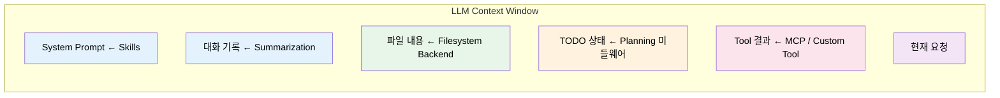
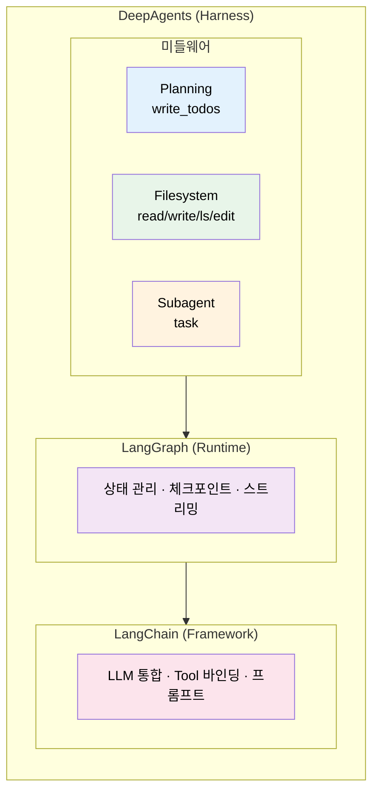
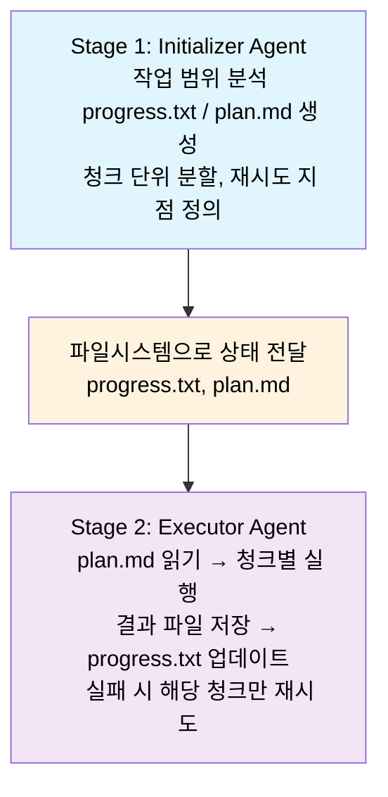
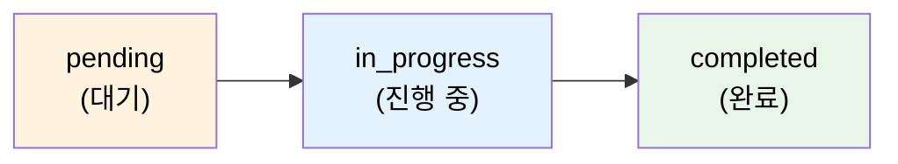

# Chapter 3. DeepAgents & Harness 개념, 실습

> **학습 목표**
> - [ ] Agent / Runtime / Harness 개념을 설명할 수 있다
> - [ ] DeepAgents의 핵심 미들웨어(Filesystem, Skills, SubAgent, Summarization)가 각각 어떤 보일러플레이트를 대체하는지 설명할 수 있다
> - [ ] create_deep_agent()로 Agent를 초기화하고 활용할 수 있다
> - [ ] Ch2에서 수동 구현한 것이 DeepAgents에서 어떻게 기본 제공되는지 비교할 수 있다
> - [ ] Context Engineering 개념과 Harness 적용이 성능에 미치는 영향(벤치마크 사례)을 설명할 수 있다

| 소요시간 | 학습방법 |
|---------|---------|
| 2.0h | 이론/실습 |

---

<p align="right"><sub style="color:gray">⏱ 13:00 – 시작</sub></p>

## 이 챕터의 출발점

Ch2 Step 4에서 메일 100통을 분석하기 위해 파일시스템 Tool, TODO 관리, 배치 처리, 반복 제한 등 **~110줄의 보일러플레이트**를 직접 구현했습니다. 그리고 "이걸 매번 만들 수 없다!"는 결론에 도달했습니다.

이 챕터에서는 그 보일러플레이트를 **DeepAgents**가 어떻게 1줄로 대체하는지 체험합니다. 먼저 이론(Harness 개념)을 다진 뒤, 4개 Step에서 직접 코드를 실행합니다.

중요: Harness는 "항상 써야 하는 정답"이 아닙니다. 작업이 짧고 흐름이 단순하면 Ch2 방식으로 직접 구현해도 충분합니다. 이 챕터의 초점은 **롱러닝·다단계 작업에서 반복되는 공통 제어를 Harness로 표준화하는 방법**입니다.

---

<p align="right"><sub style="color:gray">⏱ 13:03</sub></p>

## 이론: Agent Harness란? (30분)

### 패러다임 전환: 프롬프트 엔지니어링 → 컨텍스트 엔지니어링

2025년 중반, AI 업계에서 "프롬프트 엔지니어링"을 넘어서는 새로운 사고방식이 급부상했습니다: **Context Engineering(컨텍스트 엔지니어링)**.

이 용어를 대중화한 건 Shopify CEO Tobi Lütke의 2025년 6월 트윗이었습니다.

> "I really like the term ‘context engineering’ over prompt engineering. It describes the core skill better: **the art of providing all the context for the task to be plausibly solvable by the LLM.**"
> — [Tobi Lütke, 2025-06-19](https://x.com/tobi/status/1935533422589399127)

이후 Andrej Karpathy(전 OpenAI 연구원), Anthropic, LangChain이 잇달아 같은 개념을 강조하며 업계 공통 언어가 되었습니다.

**LangChain의 정의:**
> "Context engineering is the art and science of filling the context window with just the right information at each step of an agent’s trajectory."
> — [Context Engineering for Agents (2025-07-02)](https://blog.langchain.com/context-engineering-for-agents/)

**Anthropic의 정의:**
> Context engineering은 프롬프트 엔지니어링의 자연스러운 진화이며, 프롬프트뿐 아니라 **추론 시점에 LLM에 도달하는 모든 정보**를 설계하는 것입니다.
> — [Effective context engineering for AI agents (2025-09-29)](https://www.anthropic.com/engineering/effective-context-engineering-for-ai-agents)

> 용어 주의: Context Engineering은 현재 학술 표준 용어라기보다 업계 실무에서 확산된 표현입니다. 본 교재에서는 context management/context curation 계열 실무를 묶어 설명하는 편의 용어로 사용합니다.

**핵심 전략 4가지** (LangChain 정리 기준):

| 전략           | 설명                | 예시                   |
| ------------ | ----------------- | -------------------- |
| **Write**    | 중요 정보를 컨텍스트 밖에 저장 | 파일에 중간 결과 기록         |
| **Select**   | 필요한 정보만 컨텍스트로 불러옴 | 관련 파일만 `read_file`   |
| **Compress** | 불필요한 토큰 제거        | 대화 요약(Summarization) |
| **Isolate**  | 하위 작업별로 컨텍스트 분리   | Subagent에게 독립 태스크 위임 |

| 구분      | 프롬프트 엔지니어링 (2023) | 컨텍스트 엔지니어링 (2025+)       |
| ------- | ----------------- | ------------------------ |
| **초점**  | 좋은 지시문 작성         | 컨텍스트 창 전체를 설계            |
| **관심사** | 이번 호출의 품질         | 세션 간, 호출 간 흐름            |
| **도구**  | System Prompt     | 파일시스템, 메모리, TODO, Skills |
| **비유**  | 좋은 질문 하기          | 좋은 업무 환경 만들기             |

이 원칙을 시스템으로 구현한 것이 **Agent Harness**이며, DeepAgents는 그 대표적 구현체입니다. 각 전략이 DeepAgents의 어떤 미들웨어에 대응하는지는 아래에서 살펴봅니다.

컨텍스트 창에 들어오는 것들:



**Harness의 역할**: 이 컨텍스트 창을 올바르게 채우고 관리하는 인프라.

---

### Harness = Agent를 감싸는 관리 인프라

Ch2에서 우리는 LangChain/LangGraph로 Agent를 구현하면서 **반복되는 보일러플레이트 코드**를 경험했습니다.

| Ch2에서 직접 만든 것 | 코드량 | 매 프로젝트마다? |
|---------------------|-------|---------------|
| 파일시스템 Tool (save/read) | ~30줄 | 반복 |
| TODO 관리 Tool | ~30줄 | 반복 |
| 배치 처리 로직 | ~20줄 | 매번 다르게 |
| 컨텍스트 관리 | ~20줄 | 반복 |

**Agent Harness**는 이런 공통 기능을 미리 제공하는 관리 인프라입니다.

### DeepAgents 소개

**DeepAgents**는 LangChain이 만든 오픈소스 Agent Harness 프레임워크입니다.

- LangGraph 위에 구축 (같은 Runtime 사용)
- Claude Code에서 영감 받은 설계
- MIT 라이선스 오픈소스



### 실증 데이터: Harness가 실제로 얼마나 효과적인가?

![[images/terminal-bench-leaderboard.png]]
*Terminal Bench 2.0 리더보드 (2026-02 기준, tbench.ai). Deep Agents는 Harness 적용으로 상위권에 진입했습니다.*

**Terminal Bench**는 laude-institute가 만든 벤치마크로, AI 에이전트가 터미널 환경에서 머신러닝·디버깅·시스템 관리 등 **89개 실제 작업**을 자율 수행하는 능력을 평가합니다. SWE-bench가 코드 수정 능력을 측정한다면, Terminal Bench는 터미널 환경 전체를 조작하는 능력을 측정합니다. ([Terminal Bench 공식](https://www.tbench.ai/))

LangChain 팀은 2026년 2월 블로그에서 **같은 모델(GPT-5.2-Codex), 같은 Runtime을 사용하되 Harness 구성만 개선했을 때** 성능이 어떻게 달라지는지를 공개했습니다.

```
[기준] DeepAgents 기본 설정:
  Terminal Bench 점수: 52.8%
  랭킹: Top 30 밖

[개선] Harness 미들웨어 추가·조정 후:
  Terminal Bench 점수: 66.5%  (+13.7%p)
  랭킹: Top 5

주요 개선 미들웨어:
  ✓ PreCompletionChecklistMiddleware → 완료 전 체크리스트 점검
  ✓ LocalContextMiddleware           → 관련 파일 맥락 자동 주입
  ✓ LoopDetectionMiddleware          → 반복 패턴 감지·탈출
```

출처: [LangChain - Improving Deep Agents with harness engineering (2026-02-17)](https://blog.langchain.com/improving-deep-agents-with-harness-engineering/)

> 이 수치는 LangChain 팀이 자체 블로그에서 공개한 결과(self-reported)입니다. 독립적인 제3자 재현은 아직 확인되지 않았으므로, "성능 보장 수치"가 아니라 **"harness 설계가 성능에 미치는 영향을 보여주는 사례"** 로 참고합니다.

**핵심**: 모델의 지능은 같아도, **어떤 컨텍스트를 제공하느냐**가 성능을 결정합니다.

점수 상승의 의미를 작업 단위로 바꾸면 더 직관적입니다. Terminal Bench가 89개 작업이라면, 52.8%는 약 47개, 66.5%는 약 59개를 성공한다는 뜻입니다. 즉 **동일 모델에서 약 12개 작업을 추가 성공**하게 되어, 실패 재시도·수동 개입·운영 시간이 줄어듭니다.

---

### Ch2 수동 구현 vs DeepAgents 비교

| 기능 | Ch2 (직접 구현) | DeepAgents (기본 제공) |
|------|---------------|---------------------|
| 파일 읽기/쓰기 | `save_to_file`, `read_from_file` 직접 구현 | `read_file`, `write_file`, `edit_file` 내장 |
| 파일 목록 | 미구현 | `ls`, `glob`, `grep` 내장 |
| 작업 계획 | `write_todos`, `read_todos` 직접 구현 | `write_todos` 미들웨어로 자동 제공 |
| 하위 작업 위임 | 미구현 | `task` Tool로 Subagent 자동 위임 |
| 컨텍스트 관리 | 수동 (MAX_ITERATIONS) | SummarizationMiddleware 자동 |
| 그래프 구성 | StateGraph + Node + Edge (~30줄) | `create_deep_agent()` (1줄) |

### `create_deep_agent()` 미들웨어 스택

`create_deep_agent()`를 호출하면 아래 미들웨어가 구성됩니다. **항상 포함**되는 4개와, 파라미터를 전달할 때만 활성화되는 **조건부** 미들웨어가 있습니다.

**항상 포함 (기본 스택)**

| 미들웨어 | 제공하는 Tool / 기능 | 역할 |
|---------|-------------------|------|
| **TodoListMiddleware** | `write_todos` | 작업 계획 수립 및 진행 추적 |
| **FilesystemMiddleware** | `ls`, `read_file`, `write_file`, `edit_file`, `glob`, `grep`, `execute` | 파일시스템 기반 외부 메모리 + 셸 실행 |
| **SubAgentMiddleware** | `task` | 복잡한 작업을 하위 Agent에게 위임 |
| **SummarizationMiddleware** | 자동 요약 | 대화가 길어질 때 컨텍스트를 압축 |

**조건부 포함 (파라미터 전달 시)**

| 미들웨어 | 활성화 조건 | 역할 |
|---------|-----------|------|
| **MemoryMiddleware** | `memory=["~/.deepagents/AGENTS.md"]` | AGENTS.md 등 프로젝트 메모리를 시스템 프롬프트에 주입 |
| **SkillsMiddleware** | `skills=["/skills/user/"]` | SKILL.md 파일을 검색하여 절차적 지식을 주입 (Ch4에서 상세) |
| **HumanInTheLoopMiddleware** | `interrupt_on={"send_reply": True}` | 지정 Tool 호출 전 사용자 승인 대기 |

> **패키지 출처**: `TodoListMiddleware`, `HumanInTheLoopMiddleware`, `SummarizationMiddleware`는 `langchain.agents.middleware`에서, `FilesystemMiddleware`와 `SubAgentMiddleware`는 `deepagents.middleware`에서 제공됩니다. `create_deep_agent()`가 내부적으로 LangChain의 `create_agent()`를 호출하면서 양쪽 미들웨어를 조합합니다 ([소스: `graph.py` L267-320](https://github.com/langchain-ai/deepagents/blob/master/libs/deepagents/deepagents/graph.py)).

사용자 정의 미들웨어를 `middleware=[]` 파라미터로 추가할 수 있습니다. 기본 스택 뒤에 append되므로, 기본 미들웨어를 제거하려면 `create_deep_agent()` 대신 `langchain.agents.create_agent()`로 직접 구성해야 합니다.

```python
# 커스텀 미들웨어 추가 (기본 스택 + 내 미들웨어)
agent = create_deep_agent(
    model="anthropic:claude-sonnet-4-20250514",
    middleware=[WeatherMiddleware()]  # 기본 스택 뒤에 추가됨
)

# 기본 미들웨어 없이 직접 구성 (create_agent 사용)
from langchain.agents import create_agent
agent = create_agent(
    model="anthropic:claude-sonnet-4-20250514",
    middleware=[TodoListMiddleware(), WeatherMiddleware()]  # 원하는 것만
)
```

> **Tool과 미들웨어의 차이**: 미들웨어는 LLM 호출 전후에 컨텍스트를 가공하는 **훅**(Hook)이고, Tool은 Agent가 호출하는 **함수**입니다. 웹 검색(Tavily)이나 MCP 연결은 미들웨어가 아닌 Tool로 `tools=` 파라미터에 전달합니다 (Ch4에서 실습).

### Harness의 토큰 비용과 트레이드오프

미들웨어 스택은 **매 LLM 호출마다** 시스템 프롬프트에 지침을 주입합니다. 이것이 Harness의 비용입니다.

**호출당 고정 오버헤드 (소스코드 기준)**

| 구성 요소 | 주입 내용 | 추정 토큰 |
|-----------|----------|----------|
| Base prompt | 핵심 행동 지침, 객관성, 코드 관례 | ~1,300 |
| SubAgentMiddleware | task 도구 설명, 위임 패턴, 병렬화 규칙 | ~460 |
| TodoListMiddleware | Planning 절차, TODO 형식 규칙 | ~200 |
| FilesystemMiddleware | 파일·셸 도구 사용법, 경로 규칙 | ~210 |
| Tool descriptions | 내장 7개 도구의 상세 설명 (read_file이 ~330으로 가장 큼) | ~935 |
| Tool schemas | 9개 내장 + 커스텀 도구의 파라미터 정의 | ~395 |
| **합계** | | **~3,500** |

Ch2 수동 구현에서는 시스템 프롬프트가 2~3줄(~100 토큰)이었습니다. DeepAgents는 매 호출마다 **~3,500 토큰이 고정 추가**되고, 여기에 **대화 기록이 호출마다 누적**됩니다.

**실제 비용 계산 예시**: 메일 요약 작업에서 Agent가 LLM을 5회 호출한다고 가정합니다. 고정 오버헤드만 계산한 최소 비용입니다 (대화 기록 누적 제외).

| 모델 | 입력 단가 (/1M토큰) | 고정 오버헤드 (3.5K × 5회) | 추가 비용 |
|------|-----------|-----|-----|
| Claude Sonnet 4.6 | $3.00 | 17.5K 토큰 | **$0.053** |
| GPT-5.4 | $2.50 | 17.5K 토큰 | **$0.044** |
| Gemini 3 Flash Preview | $0.50 | 17.5K 토큰 | **$0.009** |

> 가격은 2026-03 기준 [OpenRouter API](https://openrouter.ai/models) 조회 값입니다. 최신 가격은 각 제공사 또는 OpenRouter에서 확인하세요.

**프롬프트 캐싱으로 비용 절감**: DeepAgents는 `AnthropicPromptCachingMiddleware`를 기본 포함합니다. 이 미들웨어는 시스템 프롬프트 + Tool 정의를 자동으로 캐싱하여, 동일 세션 내 후속 호출에서 **캐시 히트** 시 입력 토큰 비용을 대폭 절감합니다.

| 제공사 | 캐시 히트 할인율 | 캐시 쓰기 비용 |
|--------|---------------|-------------|
| Anthropic | **입력 대비 90% 할인** ($0.30/MTok) | 1.25배 ($3.75/MTok, 5분 TTL) |
| OpenAI | 입력 대비 50% 할인 ($1.25/MTok) | 자동 |
| Google | 입력 대비 90% 할인 ($0.03/MTok) | 별도 저장 비용 |

Claude Sonnet 4.6 기준으로 5회 호출 시:

```
캐싱 없이:  3,500 × 5 × $3.00/MTok  = $0.053
캐싱 적용:  3,500 × $3.75/MTok (첫 호출 write)
          + 3,500 × 4 × $0.30/MTok (후속 read)
          = $0.013 + $0.004 = $0.017

→ 약 68% 절감, 레이턴시도 최대 85% 단축
```

> **핵심: 코드를 토큰으로 교환한 것이 아니라, 성능을 토큰으로 구매한 것입니다.** Ch2 수동 구현에서 DeepAgents로 전환하면 코드가 간단해지는 것만이 아닙니다. 미들웨어가 주입하는 ~3,500 토큰은 "Planning을 이렇게 하라", "파일에 이렇게 저장하라", "하위 작업은 이렇게 위임하라"라는 **구조화된 지침**입니다. 이 지침이 LLM의 행동 품질을 올리기 때문에, Terminal Bench에서 동일 모델(GPT-5.2-Codex)로 52.8% → 66.5%의 성능 향상이 나온 것입니다. 호출당 $0.01 미만의 추가 비용으로 **+13.7%p의 성능 향상**을 얻는 것이 Harness 엔지니어링의 핵심 트레이드오프입니다.

**실행 결과 예시** — "중요 메일을 확인하고 요약을 파일에 저장해줘"라는 요청을 처리한 결과입니다.

```
$ uv run python3 ch3-deepagents/step1_init_agent.py

--- Agent 최종 응답 ---
중요 메일 3통을 확인하고 내용을 요약하여 mail_summary.md에 저장했습니다.

--- Agent State (messages 제외) ---
  messages: [13개 메시지]
  files: {
      "/mail_summary.md": {
          "content": ["# 중요 메일 요약 보고서", "", "1. **[팀장님] 서버 점검 안내** ..."],
          "created_at": "2026-03-11T13:49:07...",
          "modified_at": "2026-03-11T13:49:07..."
      }
  }

  → write_file로 저장한 파일이 State(메모리) 안에 존재합니다.
  → 하지만 이 프로세스가 종료되면 사라집니다!
  → Step 2에서 FilesystemBackend를 사용하면 디스크에 영구 저장됩니다.

  [DeepAgents 토큰 사용량]
  LLM 호출 횟수 : 4회
  입력 토큰     : 22,275
  출력 토큰     : 590
  합계          : 22,865
```

Agent가 `write_file`로 저장한 파일은 **디스크가 아닌 State 딕셔너리의 `files` 키**에 존재합니다. 기본 백엔드인 `StateBackend`는 인메모리이므로, 프로세스가 종료되면 파일도 사라집니다. Step 2에서 `FilesystemBackend`로 교체하여 이 문제를 해결합니다.

4회 호출에 입력 22K 토큰은 많아 보이지만, 내역은 다음과 같습니다.

| 원인 | 추정 토큰 | 비율 |
|------|----------|------|
| 고정 오버헤드 (3,500 × 4회) | ~14,000 | 63% |
| 대화 기록 누적 (매 호출마다 이전 메시지 재전송) | ~6,000 | 27% |
| Tool 결과 (메일 목록 JSON, 메일 본문 등) | ~2,300 | 10% |

고정 오버헤드 자체는 호출당 ~3,500이지만, **LLM API는 매 호출마다 전체 대화 기록을 재전송**하기 때문에 호출 횟수가 늘수록 누적 토큰이 빠르게 증가합니다. 이것이 Ch1에서 다룬 "Agent는 마지막 수단" 원칙의 실질적 근거입니다 — 단순한 작업에 Agent를 사용하면 Workflow 대비 토큰 비용이 수 배로 늘어납니다.

---
### Anthropic이 제안한 Long-Running Agent 패턴

Anthropic은 아래 두 글에서 롱러닝 에이전트 설계 원칙을 설명합니다.

- [Effective harnesses for long-running agents (2025-11-26)](https://www.anthropic.com/engineering/effective-harnesses-for-long-running-agents)
- [Building effective agents (2024-12-19)](https://www.anthropic.com/research/building-effective-agents)

특히 첫 번째 글은 초기화 전용 Agent와 실행 전용 Agent를 분리하는 2단계 패턴을 제안합니다.

이 패턴과 DeepAgents의 대응 관계는 다음처럼 이해하면 됩니다.
- Initializer 역할: `TodoListMiddleware`가 계획 생성/진행 상태를 구조화
- Executor 역할: `SubAgentMiddleware + FilesystemBackend`가 청크 단위 실행/아티팩트 저장 담당
- 결론: DeepAgents는 Anthropic의 2단계 아이디어를 "미들웨어 조합"으로 실무화한 형태에 가깝습니다.

**2단계 아키텍처**:



**왜 두 단계로 나누는가?**

단일 에이전트로 장시간 작업을 수행하면 4가지 문제가 발생합니다. 2단계 분리는 각각을 해결합니다.

| 단일 에이전트의 문제 | 2단계 분리의 해결 | 메커니즘 |
|---|---|---|
| **컨텍스트 소진** — 작업 도중 컨텍스트 창이 가득 차면 반쯤 구현된 상태로 중단됨 | Initializer가 전체 계획을 파일로 외부화 → 새 세션이 즉시 상태 파악 | `progress.txt`, `plan.md` |
| **토큰 낭비** — 매 세션마다 "환경 파악 → 어디까지 했나 확인"에 토큰 소비 | Initializer가 환경·테스트 방법을 미리 구축 → Executor 세션은 즉시 실행 가능 | `init.sh`, 구조화된 작업 목록 |
| **실패 시 대량 복구 비용** — 코드가 깨지면 "기본 앱 되살리기"에 상당한 토큰 소비 | git 커밋 + progress.txt → `git revert`로 즉시 복구, 해당 청크만 재시도 | 초기 커밋 + 기능별 커밋 |
| **거짓 완료** — 다음 세션 에이전트가 이전 작업물을 보고 "이미 끝났다"고 오판 | 구조화된 상태 파일이 정확한 진행 상황 전달 | `progress.txt` = 단일 진실 공급원(SSOT) |

> 출처: [Anthropic - Effective harnesses for long-running agents](https://www.anthropic.com/engineering/effective-harnesses-for-long-running-agents) — Anthropic은 실제로 단일 에이전트가 "전체를 one-shot 시도 → 실패 → 복구 불능" 패턴에 빠지는 것을 관찰하고, 파일 기반 상태 전달로 해결했다고 보고합니다.

**핵심 인사이트**: 2단계 분리의 본질은 **LLM의 유한한 컨텍스트 창**이라는 근본 제약을 **파일시스템이라는 무한 외부 메모리**로 우회하는 것입니다. 이를 통해 토큰 효율, 작업 정확도, 실패 복구가 모두 개선됩니다.

DeepAgents의 `FilesystemBackend` + `TodoListMiddleware`는 이 패턴을 자동으로 구현합니다.

---

### Checkpoint: Harness 개념 확인

다음 질문에 답해보세요.

1. "프롬프트 엔지니어링"과 "컨텍스트 엔지니어링"의 가장 큰 차이는?
2. Terminal Bench에서 같은 모델로 Top 30 밖→Top 5가 된 핵심 변인은?
3. Anthropic의 2단계 패턴에서 Initializer와 Executor를 분리하는 이유는?

*먼저 직접 생각한 뒤, 아래 정답을 확인하세요.*

---

**정답:**
1. 프롬프트 엔지니어링은 "이번 호출의 지시문 품질"에 집중하고, 컨텍스트 엔지니어링은 "컨텍스트 창 전체를 세션 간에 걸쳐 설계"하는 것입니다. 관심사가 단일 호출 → 전체 흐름으로 확장됩니다.
   
2. **Harness(미들웨어 스택)** 입니다. 모델(GPT-5.2-Codex)과 Runtime(LangGraph)은 동일한 상태에서 PreCompletionChecklist·LocalContext·LoopDetection 등 미들웨어를 추가·조정한 결과, 컨텍스트 창에 들어가는 정보의 질이 달라져 52.8% → 66.5%로 올랐습니다. 즉, **모델의 지능이 아니라 컨텍스트 설계가 성능을 결정**한 사례입니다.
   
3. 단일 에이전트는 장시간 작업 중 (a) 컨텍스트 소진으로 반쯤 구현된 채 중단되고, (b) 다음 세션이 상태를 모르므로 "이미 끝났다"고 오판하며, (c) 실패 시 복구에 대량 토큰을 소비합니다. 2단계 분리는 **계획을 파일로 외부화**하여 이 세 가지를 해결합니다: 새 세션이 progress.txt로 즉시 상태를 파악하고, git revert로 실패 청크만 되돌릴 수 있습니다.

4. 2단계 분리에는 **비용 최적화** 효과도 있습니다. 계획(Planner)에는 고성능 모델을, 실행(Executor)에는 저비용 모델을 배치하는 패턴이 업계 전반에서 활용됩니다.
   - **Anthropic**은 공식 블로그에서 Claude Opus를 리드 에이전트, Claude Sonnet을 서브에이전트로 구성한 멀티에이전트 시스템이 단일 Opus 대비 **90.2% 성능 향상**을 달성했다고 보고했습니다([Multi-Agent Research System](https://www.anthropic.com/engineering/multi-agent-research-system), 2025). Haiku 4.5 발표에서는 "Sonnet이 복잡한 문제를 분해·계획하고, 다수의 Haiku가 서브태스크를 병렬 실행"하는 구조를 명시했습니다([Introducing Claude Haiku 4.5](https://www.anthropic.com/news/claude-haiku-4-5), 2025).
   - **Google DeepMind**의 AlphaEvolve도 Gemini Flash(탐색 폭 확보)와 Gemini Pro(깊이 있는 제안)를 앙상블로 조합합니다([AlphaEvolve](https://deepmind.google/blog/alphaevolve-a-gemini-powered-coding-agent-for-designing-advanced-algorithms/), 2025).
   - 학술 연구에서도 KAIST의 COPE 프레임워크가 소형·대형 모델을 교차 배치하여 GPT-4o 단독 대비 **50~74% 비용 절감**과 동등 이상의 정확도를 달성했습니다([arXiv:2506.11578](https://arxiv.org/abs/2506.11578), 2025).
---

<p align="right"><sub style="color:gray">⏱ 13:28</sub></p>

## Step 1: DeepAgents Agent 초기화 (30분)

> 📂 실습 코드: `ch3-deepagents/step1_init_agent.py`

▶ 실행: 
```
uv run python3 ch3-deepagents/step1_init_agent.py
```
![[images/Pasted image 20260227055019.png]]
### 1.1 환경 확인

Ch2 Preflight에서 `uv sync`로 의존성을 이미 설치했고, `OPENROUTER_API_KEY`도 `.bashrc`에 설정되어 있습니다. 추가 설치 없이 바로 진행합니다.

```bash
# 설치 상태 확인 (선택)
uv run python3 -c "from deepagents import create_deep_agent; print('OK')"
```

### 1.2 기본 사용법

```python
from deepagents import create_deep_agent

# 이 한 줄로 Planning + Filesystem + Subagent 모두 포함!
agent = create_deep_agent(model="openai:google/gemini-3-flash-preview")

result = agent.invoke({
    "messages": [{"role": "user", "content": "메일 분석 보고서를 작성해줘"}]
})
```

`provider:model` 표기(예: `openai:google/gemini-3-flash-preview`)는 provider 라우팅을 명시하는 형태입니다. `openai:` 프리픽스는 OpenAI 호환 API(OpenRouter 포함)를 뜻합니다. 같은 패턴으로 `anthropic:...` 등으로 교체할 수 있으며, 실제 지원 목록은 설치된 provider 패키지/문서를 기준으로 확인합니다.

### 1.3 기본 제공 도구 확인

`create_deep_agent()`를 호출하면 다음 Tool이 자동으로 Agent에 연결됩니다.

| Tool | 출처 | 설명 |
|------|------|------|
| `write_todos` | TodoListMiddleware | 작업 목록 관리 |
| `ls` | FilesystemMiddleware | 디렉토리 목록 |
| `read_file` | FilesystemMiddleware | 파일 읽기 |
| `write_file` | FilesystemMiddleware | 파일 쓰기 |
| `edit_file` | FilesystemMiddleware | 파일 부분 수정 |
| `glob` | FilesystemMiddleware | 파일 패턴 검색 |
| `grep` | FilesystemMiddleware | 파일 내용 검색 |
| `execute` | FilesystemMiddleware | 셸 명령 실행 (SandboxBackend 필요) |
| `task` | SubAgentMiddleware | 하위 Agent 위임 |

**참고**: 위 Tool들은 미들웨어 내부에 등록되어 `agent.tools`로는 직접 접근할 수 없습니다. 실제 동작은 `agent.invoke()`로 확인합니다 — Agent에게 "파일을 저장해줘"라고 요청하면 `write_file`이, "계획을 세워줘"라고 요청하면 `write_todos`가 자동으로 호출됩니다.

### 1.4 커스텀 Tool 추가

```python
from langchain_core.tools import tool

@tool
def check_inbox(filter: str = "unread") -> str:
    """메일함의 메일을 확인합니다."""
    # ... 구현 ...

agent = create_deep_agent(
    model="openai:google/gemini-3-flash-preview",
    tools=[check_inbox],  # 커스텀 Tool 추가
    system_prompt="당신은 메일 관리 비서입니다.",
)
```

### Step 1 성공 기준

- `create_deep_agent()` 호출이 에러 없이 완료된다.
- Agent에게 간단한 요청을 보내면(`invoke`) 응답이 정상 반환된다.
- 커스텀 Tool(`check_inbox`)을 추가한 Agent가 정상 생성된다.

> [!todo] 직접 구성해 볼까요? (5분)
> `code/ch3-deepagents/notebooks/harness_fill_in_blank.ipynb`을 열고 **실험 1**을 진행하세요.
>
> `create_deep_agent(model=___, tools=[___], system_prompt=___)`의 빈칸을 채우고, `invoke()`로 Agent가 정상 동작하는지 확인합니다.

### 1.5 Ch2와 비교
```python
# Ch2: ~30줄의 그래프 구성
builder = StateGraph(MessagesState)
builder.add_node("llm", call_model)
builder.add_node("tools", ToolNode(tools))
builder.add_edge(START, "llm")
builder.add_conditional_edges("llm", tools_condition)
builder.add_edge("tools", "llm")
graph = builder.compile(checkpointer=MemorySaver())

# DeepAgents: 1줄
agent = create_deep_agent(model="openai:google/gemini-3-flash-preview", tools=[check_inbox])
```

---

<p align="right"><sub style="color:gray">⏱ 13:40</sub></p>

## Step 2: Filesystem 백엔드 활용 (20분)

> 📂 실습 코드: `ch3-deepagents/step2_filesystem.py`

▶ 실행: 
```
uv run python3 ch3-deepagents/step2_filesystem.py
```

### 2.1 왜 Filesystem이 중요한가?

Ch2 Step4에서 경험한 문제: **컨텍스트 윈도우를 넘는 데이터를 처리하려면 외부 저장소가 필요**

DeepAgents는 **Backend** 시스템으로 이를 해결합니다.

### 2.2 StateBackend (기본값, In-Memory)

```python
# 기본값 — 별도 설정 불필요
agent = create_deep_agent(model="openai:google/gemini-3-flash-preview")
# 파일이 Agent 상태(state["files"])에 저장됨
# 같은 thread 내에서만 유지, 세션 종료 시 사라짐
```

### 2.3 FilesystemBackend (로컬 디스크)

```python
from deepagents import create_deep_agent
from deepagents.backends import FilesystemBackend

agent = create_deep_agent(
    model="openai:google/gemini-3-flash-preview",
    backend=FilesystemBackend(root_dir="./workspace", virtual_mode=True)
)
# 파일이 실제 디스크에 저장됨
# 세션이 종료되어도 유지
# virtual_mode=True → 디렉토리 탈출 방지 (보안)
```

### 2.4 StoreBackend (영구 저장, 스레드 간 공유)

```python
from deepagents.backends import StoreBackend

agent = create_deep_agent(
    model="openai:google/gemini-3-flash-preview",
    backend=StoreBackend,  # BackendFactory — runtime 주입 시 자동 생성
)
# 파일이 LangGraph의 BaseStore에 저장됨
# 대화(thread)가 바뀌어도 유지 — 에이전트의 장기 메모리에 적합
# BaseStore 구현체(InMemoryStore, PostgresStore 등)에 따라 실제 저장소 결정
```

`StateBackend`는 같은 대화 안에서만 파일이 유지되지만, `StoreBackend`는 **대화를 넘어** 파일이 유지됩니다. 운영 환경에서 `PostgresStore`를 BaseStore로 연결하면 DB 기반 영구 저장이 됩니다.

### 2.5 LocalShellBackend (파일시스템 + 셸 실행)

```python
from deepagents.backends import LocalShellBackend

agent = create_deep_agent(
    model="openai:google/gemini-3-flash-preview",
    backend=LocalShellBackend(
        root_dir="./workspace",
        virtual_mode=True,
        timeout=120.0,           # 셸 명령 타임아웃 (초)
        max_output_bytes=100_000, # 출력 크기 제한
    ),
)
# FilesystemBackend의 모든 기능 + execute()로 셸 명령 실행
# 샌드박싱 없음 — 개발/테스트 환경 전용
```

`LocalShellBackend`는 `FilesystemBackend`를 상속하면서 `execute()` 메서드를 추가합니다. Agent가 `bash` Tool로 셸 명령을 실행할 수 있게 됩니다. 호스트에서 직접 실행되므로 **샌드박싱이 없습니다** — 개발/CI 환경 전용입니다. 운영 환경에서 격리된 셸 실행이 필요하면 DeepAgents CLI의 `--sandbox` 옵션으로 원격 샌드박스 프로바이더를 연결합니다. 현재 [Daytona](https://www.daytona.io/), [Modal](https://modal.com/), [Runloop](https://www.runloop.ai/) 세 프로바이더가 파트너 패키지로 제공됩니다([공식 문서](https://docs.langchain.com/oss/python/deepagents/sandboxes)).

### 2.6 CompositeBackend (하이브리드)

```python
from deepagents.backends import CompositeBackend, StateBackend, FilesystemBackend

composite = lambda rt: CompositeBackend(
    default=StateBackend(rt),               # 기본: 메모리
    routes={
        "/memories/": FilesystemBackend(     # /memories/ 경로 → 디스크
            root_dir="./agent_memory",
            virtual_mode=True,
        ),
    },
)
# rt는 ToolRuntime으로, StateBackend/StoreBackend처럼 런타임 컨텍스트가 필요한 백엔드에서 사용
agent = create_deep_agent(model="openai:google/gemini-3-flash-preview", backend=composite)
```

경로 프리픽스별로 서로 다른 백엔드를 연결합니다. 위 예시에서 `/memories/notes.txt`는 디스크에, 나머지 경로는 메모리에 저장됩니다.

### 2.7 Backend 전체 정리

| 백엔드 | 저장소 | 영속성 | 셸 실행 |
|---------|--------|--------|:-------:|
| `StateBackend` | LangGraph 상태 | 휘발 (스레드 내) | ✗ |
| `FilesystemBackend` | 호스트 디스크 | 영구 | ✗ |
| `StoreBackend` | LangGraph BaseStore | 영구 (스레드 간) | ✗ |
| `LocalShellBackend` | 호스트 디스크 | 영구 | ✓ (비격리) |
| `CompositeBackend` | 경로별 라우팅 | 하위 백엔드 따름 | 하위 따름 |
| 원격 샌드박스 (Daytona, Modal, Runloop) | 원격 컨테이너/VM | 프로바이더 따름 | ✓ (격리) |

위 5개(`State`~`CompositeBackend`)가 SDK 내장 구현체입니다. 운영 환경의 격리 실행이 필요하면 `--sandbox daytona` 등으로 원격 샌드박스 프로바이더를 연결합니다. 모든 백엔드는 `BackendProtocol`(`ls_info()`, `read()`, `write()`, `edit()` 등 8개 파일 조작 메서드)을 구현하며, 셸 실행이 필요한 백엔드는 `SandboxBackendProtocol`(`execute()` 추가)을 구현합니다.

`lambda rt` 기반 CompositeBackend는 **고급 옵션**입니다. Ch4/Ch5 완주에는 필수가 아니며, 초급자는 `FilesystemBackend` 단일 구성만 사용해도 됩니다.

**실행 후 확인**: step2 스크립트를 실행하면 FilesystemBackend로 메일 분석 결과를 디스크에 저장합니다. `./workspace/ch3/` 디렉토리에 파일이 생성되면 정상입니다. Step 1(StateBackend)에서는 State 딕셔너리 안에만 파일이 존재했던 것과 비교해 보세요.

### Step 2 성공 기준

- FilesystemBackend Agent 실행 후 `./workspace/ch3/` 디렉토리에 실제 파일이 생성된다.
- Step 1의 StateBackend(메모리 전용)와의 차이를 이해한다.

> [!todo] Backend 차이를 실험해 볼까요? (10분)
> `code/ch3-deepagents/notebooks/harness_fill_in_blank.ipynb`을 열고 **실험 2**를 진행하세요.
>
> `FilesystemBackend(root_dir=___, virtual_mode=___)`의 빈칸을 채워 디스크 저장 Agent를 구성합니다.

### 2.5 Agent가 자동으로 파일을 활용하는 예시

```python
# Agent에게 복잡한 작업을 주면, 자동으로 파일시스템을 활용합니다
result = agent.invoke({
    "messages": [{"role": "user", "content":
        "메일 100통의 카테고리별 통계를 분석해줘. "
        "중간 결과는 파일에 저장하면서 진행해."}]
})

# Agent의 행동:
# 1. write_todos → 작업 계획 수립
# 2. write_file("batch_1_analysis.md", ...) → 중간 결과 저장
# 3. write_file("batch_2_analysis.md", ...) → 중간 결과 저장
# 4. read_file("batch_1_analysis.md") → 이전 결과 로드
# 5. write_file("final_report.md", ...) → 최종 보고서
```

<p align="right"><sub style="color:gray">⏱ 13:48 – 쉬는 시간</sub></p>

<p align="right"><sub style="color:gray">⏱ 13:50~14:00 쉬는 시간</sub></p>

---

<p align="right"><sub style="color:gray">⏱ 14:00 – 시작</sub></p>

## Step 3: Planning 도구 활용 (20분)

> 📂 실습 코드: `ch3-deepagents/step3_planning.py`
>
> ▶ 실행:
```
uv run python3 ch3-deepagents/step3_planning.py
```

### 3.1 write_todos 동작 방식

`TodoListMiddleware`가 시스템 프롬프트에 Planning 지침을 자동 주입합니다. Agent는 복잡한 작업을 받으면 자동으로 `write_todos`를 호출하여 계획을 세웁니다.

### 3.2 TODO 상태 관리



### 3.3 Agent의 Planning 행동 패턴

```
사용자: "메일 100통을 분석해서 보고서를 만들어줘"

Agent 행동:
1. write_todos([
     {"content": "메일 배치 수집", "status": "pending"},
     {"content": "카테고리별 분류", "status": "pending"},
     {"content": "중요도 분석", "status": "pending"},
     {"content": "최종 보고서 작성", "status": "pending"},
   ])

2. write_todos([
     {"content": "메일 배치 수집", "status": "in_progress"},  ← 시작
     ...
   ])
   → fetch_emails 호출, write_file로 결과 저장

3. write_todos([
     {"content": "메일 배치 수집", "status": "completed"},    ← 완료
     {"content": "카테고리별 분류", "status": "in_progress"},  ← 다음
     ...
   ])
   → 분류 작업 수행

4. ... (반복)

5. 모든 TODO가 completed → 최종 답변 반환
```

**실행 후 확인**: step3 스크립트를 실행하면 Agent가 `write_todos`를 호출하여 작업 계획을 세우는 것이 로그에 출력됩니다. TODO 상태가 `pending` → `in_progress` → `completed`로 변하는 흐름을 확인하세요.

### Step 3 성공 기준

- Agent가 자동으로 `write_todos`를 호출하여 작업 계획을 생성한다.
- TODO 항목의 상태가 순차적으로 변경되는 것을 로그에서 확인한다.
- Ch2에서 직접 구현한 `write_todos` Tool 없이도 동일한 기능이 동작한다.

> [!todo] TODO 상태를 예측해 볼까요? (2분)
> Agent에게 "메일 20통을 분석해서 보고서를 만들어줘"라고 요청했을 때, `write_todos`의 **첫 번째 호출**에서 TODO 항목은 몇 개가 생성될까요? 각 항목의 초기 상태는?
>
> 1. 종이에 예상 TODO 목록(항목 수 + 상태)을 적어 보세요.
> 2. `step3_planning.py`를 실행하여 실제 로그와 비교합니다.
> 3. **예측과 실제가 다른 부분**이 있다면: Agent가 왜 그렇게 계획했는지 생각해 보세요.

### 3.4 Ch2 Step4와 비교

```python
# Ch2: TODO Tool을 직접 구현해야 함 (30줄)
@tool
def write_todos(todos: str) -> str:
    todo_list = json.loads(todos)
    with open(TODO_FILE, "w") as f:
        json.dump(todo_list, f)
    pending = sum(1 for t in todo_list if t["status"] == "pending")
    ...

# DeepAgents: TodoListMiddleware가 자동 제공
# 시스템 프롬프트도 자동 주입, 상태 스키마도 자동 확장
agent = create_deep_agent()  # write_todos 이미 포함!
```

---

<p align="right"><sub style="color:gray">⏱ 14:18</sub></p>

## Step 4: 간단한 스케줄/반복 실행(폴링) 구성 (20분)

> 📂 실습 코드: `ch3-deepagents/step4_polling.py`
>
> ▶ 실행: 
```
uv run python3 ch3-deepagents/step4_polling.py
```

### 4.1 Long-Running Agent를 위한 폴링

Ch1에서 배운 Long-Running Agent의 핵심: **단일 LLM 호출을 넘어, 주기적으로 반복 실행**

```
"매일 아침 9시에 메일함을 확인하고, 중요 메일이 있으면 알려줘"
```

폴링과 스케줄링은 구분해서 이해해야 합니다.

- **폴링(Polling)**: `asyncio.sleep(간격)`으로 고정 주기(예: 5분마다) 반복 실행
- **스케줄링(Scheduling)**: cron/APScheduler처럼 특정 시각(예: 매일 09:00)에 실행

이 절의 실습 코드는 **폴링**입니다. 스케줄링은 cron이나 APScheduler 같은 외부 도구와 조합하여 구현하며, 이 교재에서는 폴링 패턴에 집중합니다.

### 4.2 폴링 패턴 구현

핵심 구조만 추출하면 다음과 같습니다 (실습 코드 `step4_polling.py`는 Mock 메일 시스템과 함께 더 풍부한 버전입니다).

```python
import asyncio
from deepagents import create_deep_agent
from langgraph.checkpoint.memory import MemorySaver
from langchain_core.tools import tool

@tool
def check_new_emails() -> str:
    """마지막 확인 이후 도착한 새 메일을 가져옵니다."""
    # 실습 코드에서는 전역 MAIL_STORE에서 새 메일을 필터링
    return '{"new_count": 1, "summary": "긴급 메일 1통"}'

agent = create_deep_agent(
    model="openai:google/gemini-3-flash-preview",
    tools=[check_new_emails],
    checkpointer=MemorySaver(),  # 세션 간 대화 상태 유지
)

async def polling_loop(interval_seconds=5, max_polls=3):
    """주기적으로 Agent를 실행하는 폴링 루프."""
    config = {"configurable": {"thread_id": "mail-poller"}}

    for poll_num in range(1, max_polls + 1):
        result = await agent.ainvoke(
            {"messages": [{"role": "user", "content":
                "새 메일이 있는지 확인하고, 중요한 것이 있으면 알려줘."}]},
            config=config,  # 동일한 thread_id → 이전 상태 이어서
        )

        last_msg = result["messages"][-1]
        print(f"[폴링 #{poll_num}] {last_msg.content[:100]}")

        if poll_num < max_polls:
            await asyncio.sleep(interval_seconds)

asyncio.run(polling_loop(interval_seconds=5, max_polls=3))
```
```

### 4.3 Checkpointer로 세션 간 연속성

```python
# 같은 thread_id를 사용하면:
# - 이전 체크 결과를 기억
# - "이전에 확인한 메일은 다시 알리지 마세요" 같은 지시 가능
# - 점진적으로 컨텍스트 축적

config = {"configurable": {"thread_id": "mail-poller"}}

# 첫 번째 실행: 메일 3통 확인
# 두 번째 실행: "이전에 확인한 3통 외에 새 메일이 있나요?"
# 세 번째 실행: 누적된 맥락을 활용
```

주의: `MemorySaver`는 프로세스 메모리에 저장되므로, 프로세스 재시작 시 상태가 사라집니다. 운영 환경에서는 SQLite/Postgres checkpointer를 사용하세요.

**실행 후 확인**: step4 스크립트를 실행하면 5초 간격으로 메일 체크를 반복합니다. 3회 반복 후 자동 종료됩니다. 로그에서 `[폴링 #1]`, `[폴링 #2]`, `[폴링 #3]` 메시지를 확인하세요.

### Step 4 성공 기준

- 폴링 루프가 지정 간격으로 반복 실행된다.
- 같은 `thread_id`를 사용하여 이전 대화 맥락이 유지된다.
- `Ctrl+C`로 안전하게 종료할 수 있다.

### 4.4 HITL (Human-in-the-Loop) — `interrupt_on`

`create_deep_agent()`의 **SDK 호출에서 HITL은 선택적**입니다. `interrupt_on` 파라미터를 명시적으로 전달해야 활성화됩니다.

```python
@tool
def forward_email(email_id: int, to: str) -> str:
    """메일 전달 Tool (개념 예시용 stub)."""
    return f"{email_id}번 메일을 {to}에게 전달했습니다."

agent = create_deep_agent(
    model="openai:google/gemini-3-flash-preview",
    tools=[check_new_emails, forward_email],
    checkpointer=MemorySaver(),   # interrupt 상태 저장용, 필수
    interrupt_on={
        "forward_email": True,    # 메일 전달 전 사람 승인 필요
    },
)
```

`interrupt_on`이 전달되면 내부적으로 `HumanInTheLoopMiddleware`가 자동 생성되어 미들웨어 스택에 추가됩니다. Ch2에서 `interrupt()`를 직접 호출한 것과 달리, 여기서는 **Tool 이름만 지정하면 해당 Tool 호출 전에 자동으로 중단**됩니다.

> **SDK vs CLI의 차이**: DeepAgents CLI(`deepagents` 명령)에서는 `execute`, `write_file`, `edit_file` 등 부작용이 있는 도구에 HITL이 **기본 활성화**되어 있습니다. `--auto-approve` 플래그로 비활성화할 수 있습니다. SDK를 직접 사용하는 이 교재의 실습에서는 opt-in 방식입니다.

### 4.5 DeepAgents CLI 소개

지금까지 Python SDK(`create_deep_agent()`)를 직접 호출했지만, DeepAgents는 **Claude Code에서 영감받은 터미널 기반 대화형 인터페이스**도 제공합니다.

```bash
# 별도 패키지 설치
uv tool install deepagents-cli

# 실행 — Textual 기반 TUI가 시작됨
deepagents
```

![[Pasted image 20260312010650.png]]

| 기능 | 설명 |
|------|------|
| 슬래시 명령어 | `/help`, `/clear`, `/remember`(대화→메모리 저장), `/tokens` |
| 파일 멘션 | `@filename`으로 파일을 컨텍스트에 추가 (자동완성 지원) |
| 셸 실행 | `!command`로 로컬 bash 명령어 실행 |
| HITL 기본 활성화 | 부작용 있는 도구 호출 전 자동 승인 요청 |
| 비인터랙티브 모드 | `deepagents -n "테스트 실행해줘"` |

CLI는 SQLite checkpointer를 자동으로 설정하므로 대화가 세션 간에 유지됩니다. SDK로 커스텀 워크플로우를 구축할 때와, CLI로 빠르게 대화형 작업을 수행할 때를 구분하여 사용합니다.

> 이 교재에서는 Agent의 내부 동작 이해를 위해 SDK 중심으로 실습하지만, 실무에서는 CLI가 더 빠른 진입점이 됩니다.

---

<p align="right"><sub style="color:gray">⏱ 14:38</sub></p>

## 핵심 요약

| Step | Ch2 (수동) | Ch3 (DeepAgents) |
|------|----------|-----------------|
| **파일시스템** | save_to_file/read_from_file 직접 구현 | FilesystemBackend + 내장 Tool |
| **Planning** | write_todos/read_todos 직접 구현 | TodoListMiddleware 자동 제공 |
| **Subagent** | 미구현 | SubAgentMiddleware + task Tool |
| **컨텍스트 관리** | MAX_ITERATIONS 하드코딩 | SummarizationMiddleware |
| **그래프 구성** | StateGraph 30줄 | create_deep_agent() 1줄 |

**DeepAgents의 핵심 가치:**
> "Agent 개발자가 비즈니스 로직에만 집중할 수 있게, 공통 인프라를 Harness가 제공한다."

SummarizationMiddleware는 `create_deep_agent()` 기본 스택에 포함되며, 대화가 길어져 컨텍스트가 커질 때 자동으로 요약을 적용합니다. 이 챕터는 개념 소개 중심으로 다루고, 상세 튜닝(트리거 기준/보존 메시지 수)은 참고 자료의 Customization 문서에서 확장합니다.

요약 발생 여부는 다음처럼 확인합니다.
1. 실행 로그에서 요약 미들웨어 이벤트(요약 시작/완료) 확인  
2. 요약 직전/직후의 messages 길이(또는 토큰 추정치) 비교  
3. 핵심 식별자(이메일 ID/정책 키워드)가 요약 이후에도 보존되는지 샘플 검증

요약 정책 가이드:
- **요약 금지(원문 유지)**: 정책/규정 문장, 식별자(ID/계정/주문번호), 감사 로그
- **요약 허용**: 반복 대화, 중간 사고흐름, 장문의 일반 설명

```
Ch2의 여정: 수동 루프 → LangGraph → 체크포인트 → Long-Running (힘들다!)
Ch3의 해결: create_deep_agent() → 모든 보일러플레이트 해결

다음 단계: Skills와 MCP로 "메일 체크" 도메인 지식을 모듈화 →
```

> **다음 Chapter**: Skills로 절차적 지식을 모듈화하고, MCP로 실제 메일 서버에 연결합니다.

<p align="right"><sub style="color:gray">⏱ 14:48 – 쉬는 시간</sub></p>

<p align="right"><sub style="color:gray">⏱ 14:50~15:00 쉬는 시간</sub></p>

---

## 실습 트러블슈팅 (FAQ)

### Q1. `uv add deepagents`가 실패합니다.

- DeepAgents는 LangChain 팀의 비교적 최근 프로젝트입니다. 먼저 최신 버전을 확인하세요.
- `uv add deepagents` 또는 `uv add "deepagents>=0.4"`
- 설치 후 확인: `uv run python3 -c "from deepagents import create_deep_agent; print('OK')"`
- 네트워크 문제라면 `uv pip install --index-url https://pypi.org/simple/ deepagents`

### Q2. `create_deep_agent()` 호출 시 LLM 인증 오류가 납니다.

- `OPENROUTER_API_KEY` 환경변수가 설정되었는지 확인하세요.
- `echo $OPENROUTER_API_KEY`로 빈 값이 아닌지 확인합니다.
- 키가 만료되었거나 잘못된 경우 OpenRouter 대시보드에서 새 키를 발급하세요.

### Q3. `FilesystemBackend` 사용 시 파일이 생성되지 않습니다.

- `root_dir` 경로가 존재하는지 확인하세요.
- `virtual_mode=True`일 때 Agent가 `root_dir` 바깥 경로에 쓰기를 시도하면 조용히 차단됩니다.
- 확인: `ls ./workspace/` 로 디렉토리 존재 여부 점검

### Q4. Step4 폴링 실행이 멈추지 않습니다.

- `Ctrl+C`로 종료합니다.
- 초급자 안전 버전(`polling_loop_safe`)은 `max_cycles=3`으로 자동 종료됩니다.
- `asyncio.run()`이 아닌 `await`로 실행한 경우 종료가 어려울 수 있습니다. 터미널을 닫고 다시 시작하세요.

### Q5. `async/await` 구문 관련 에러가 납니다.

- Step4의 폴링 코드는 `asyncio` 기반입니다. Python 3.10 이상이 필요합니다.
- Jupyter Notebook에서 실행할 경우 `asyncio.run()` 대신 `await`를 직접 사용하세요.
- 터미널에서 `uv run python3 ch3-deepagents/step4_polling.py`로 실행하면 정상 동작합니다.

---

## 참고 자료

- [DeepAgents GitHub](https://github.com/langchain-ai/deepagents)
- [DeepAgents 개요](https://docs.langchain.com/oss/python/deepagents/overview)
- [DeepAgents Quickstart](https://docs.langchain.com/oss/python/deepagents/quickstart)
- [DeepAgents Customization](https://docs.langchain.com/oss/python/deepagents/customization)
- [Using Skills with Deep Agents](https://blog.langchain.com/using-skills-with-deep-agents/)
- [Deep Agents Middleware](https://docs.langchain.com/oss/python/deepagents/middleware)
- [DeepAgents Backends](https://docs.langchain.com/oss/python/deepagents/backends)
- [LangChain - Context Engineering for Agents](https://blog.langchain.com/context-engineering-for-agents/)
- [LangChain - Improving Deep Agents with harness engineering](https://blog.langchain.com/improving-deep-agents-with-harness-engineering/)
- [Anthropic - Effective harnesses for long-running agents](https://www.anthropic.com/engineering/effective-harnesses-for-long-running-agents)
- [Anthropic - Building effective agents](https://www.anthropic.com/engineering/building-effective-agents)
- [OpenAI - Harness Engineering: Leveraging Codex](https://openai.com/index/harness-engineering/) — JSON-RPC 기반 Items/Turns/Threads, Harness 실무 사례
- [Martin Fowler - Harness Engineering](https://martinfowler.com/articles/exploring-gen-ai/harness-engineering.html) — Harness 3대 범주 정의
- [Terminal Bench](https://www.tbench.ai/) — 터미널 환경 AI Agent 벤치마크
- [Anthropic - Effective context engineering for AI agents](https://www.anthropic.com/engineering/effective-context-engineering-for-ai-agents) — Context Engineering 정의·전략
- [Tobi Lutke on X — "Context Engineering" 용어 제안 (2025)](https://x.com/tobi/status/1935533422589399127)
- [Anthropic - Multi-Agent Research System (2025)](https://www.anthropic.com/engineering/multi-agent-research-system) — Opus(리드)+Sonnet(서브에이전트) 90.2% 성능 향상
- [Introducing Claude Haiku 4.5 (Anthropic, 2025)](https://www.anthropic.com/news/claude-haiku-4-5) — Sonnet(플래너)+Haiku(워커) 병렬 실행 구조
- [AlphaEvolve (Google DeepMind, 2025)](https://deepmind.google/blog/alphaevolve-a-gemini-powered-coding-agent-for-designing-advanced-algorithms/) — Gemini Flash+Pro 앙상블
- [COPE: Efficient LLM Collaboration via Planning (KAIST, arXiv:2506.11578)](https://arxiv.org/abs/2506.11578) — 소형·대형 모델 교차 배치, 50~74% 비용 절감
