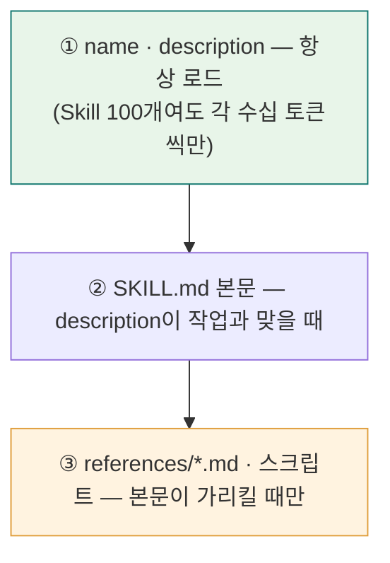
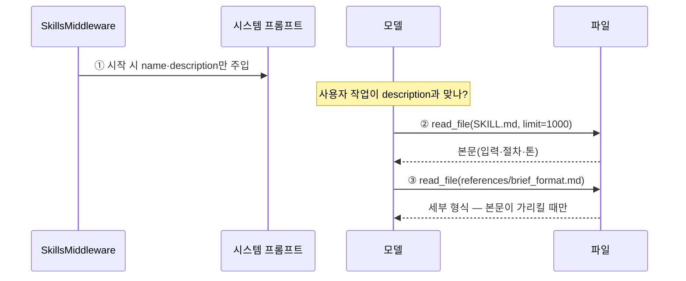
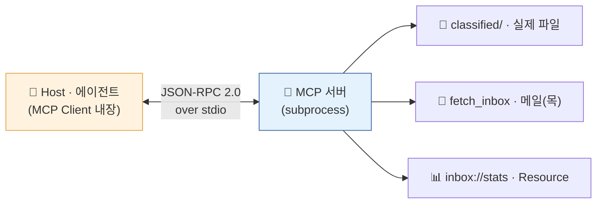
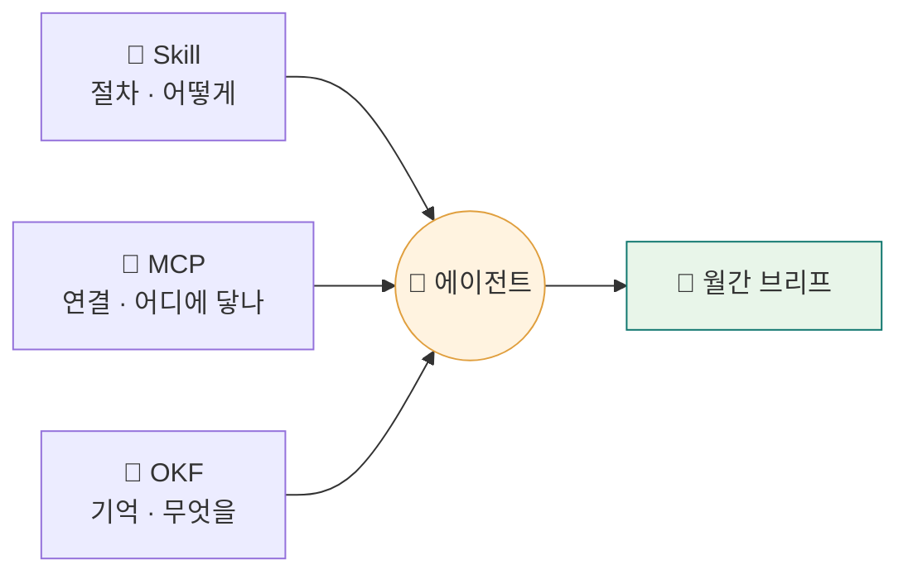

<div class="lec">
<div class="deck">

<section class="slide hero">
<div>
<div class="eyebrow">Chapter 4 · Skills · MCP · 지식 레이어</div>

# 능력을 붙이고,<br>지식을 남긴다

<p class="lead">조사 결과가 노트로 흩어져 있습니다. 이걸 다음 달에도 쓰려면 절차는 Skill로, 연결은 MCP로, 지식은 표준 형식으로 묶어야 합니다.<br>
이 챕터에서 브리프 쓰는 절차를 SKILL.md로 정의하고, 파일과 메일을 MCP 한 겹으로 표준화하고, 조사 결과를 OKF 지식으로 적재합니다.</p>

<div class="kicker">
<div class="metric"><span class="num">80</span><strong>분</strong><span>이론 30 · 핸즈온 50</span><span class="clk">예상 13:30–14:50 · 앞 🍽점심</span></div>
<div class="metric"><span class="num">3</span><strong>겹의 능력</strong><span>Skill · MCP · OKF</span></div>
<div class="metric"><span class="num">12</span><strong>지식 항목</strong><span>knowledge_base/*.md</span></div>
</div>
</div>

<div class="board">
<div class="board-header"><span>이 챕터가 끝나면</span><span class="status-pill">산출물</span></div>
<div class="stack">
<div class="row"><div class="code">1</div><div class="copy"><strong>inbox-brief/</strong><p>SKILL.md(점진 공개) + 얇은 plugin 템플릿</p></div><div class="store">절차</div></div>
<div class="row"><div class="code">2</div><div class="copy"><strong>MCP 인박스 서버</strong><p>파일[실선] · 메일[목]을 도구로 노출</p></div><div class="store">연결</div></div>
<div class="row"><div class="code">3</div><div class="copy"><strong>OKF 지식베이스</strong><p>거래처·구독·확인필요를 표준 항목으로</p></div><div class="store">지식</div></div>
</div>
</div>
</section>

<section class="slide">
<div class="section-head">
<div>
<div class="eyebrow">1 · 절차 · 15분</div>

## SKILL.md — 점진 공개

</div>
<p class="section-note">Skill은 에이전트에게 절차적 지식을 주는 마크다운 파일입니다. 앞머리(YAML frontmatter)에 메타데이터를 달고, 본문에 방법을 적습니다. 포맷은 Anthropic이 만들어 <strong>오픈 표준(agentskills.io)</strong>으로 풀었고, 지금은 Claude Code·Cursor·Codex·Copilot 등이 같은 SKILL.md를 읽습니다.<br>
핵심은 <strong>3단계 점진 공개</strong>입니다. ① 시작 시 모든 Skill의 <code>name·description</code>만 시스템 프롬프트에 올라갑니다(항상 켜지지만 쌉니다). ② description이 작업과 맞으면 그때 <strong>SKILL.md 본문</strong>을 읽습니다. ③ <code>references/*.md</code>·스크립트는 본문이 가리킬 때만 펼칩니다. 그래서 <em>description 한 줄이 호출 여부를 정하는 가장 중요한 필드</em>입니다.</p>
</div>

<div class="grid-3">
<div class="panel"><div class="panel-head"><strong>1단계 — 메타</strong><span>Skill당 ~100토큰</span></div><div class="panel-body"><div class="list">
<p><code>name · description</code> — 언제 쓰는지 한 줄로</p>
<p>에이전트는 이것만 보고 호출을 판단합니다(Skill 100개여도 각 ~100토큰)</p>
</div></div></div>
<div class="panel"><div class="panel-head"><strong>2단계 — 본문</strong><span>&lt;5k토큰 · &lt;500줄</span></div><div class="panel-body"><div class="list">
<p>입력·절차·출력 형식·톤</p>
<p>호출이 정해지면 이때 read_file로 읽습니다</p>
</div></div></div>
<div class="panel"><div class="panel-head"><strong>3단계 — 리소스</strong><span>사실상 무제한</span></div><div class="panel-body"><div class="list">
<p><code>references/*.md</code> · <code>scripts/</code> · <code>assets/</code></p>
<p>가리킬 때만 펼침. 스크립트는 <em>실행만</em> 하면 코드가 아니라 결과만 컨텍스트에 들어옵니다</p>
</div></div></div>
</div>

<p class="section-note" style="margin-top:6px">표준이 단계마다 토큰 예산을 못 박아 둡니다 — 1단계는 Skill당 ~100토큰(항상 켜짐), 2단계 본문은 5,000토큰·500줄 미만 권장, 3단계 리소스는 제한 없음. agentskills.io는 이 셋을 <strong>Discovery → Activation → Execution</strong>, Anthropic은 <strong>Level 1 / 2 / 3</strong>이라 부릅니다 — 같은 개념입니다.</p>

<div class="panel" style="margin-top:16px">
<div class="panel-head"><strong>토큰은 단계로 펼쳐진다</strong><span>점진 공개 3단계</span></div>
<div class="panel-body">



</div>
</div>

```markdown
---
name: inbox-brief                      # 1–64자 소문자+하이픈 · 디렉터리명과 일치(필수)
description: 분류 레코드·OKF 지식·조사 노트를 모아 월간 브리프를 작성한다.   # 무엇+언제(필수)
  "이번 달 인박스 정리", "지출 브리프"를 요청할 때 쓴다.
license: MIT                           # 선택 — 라이선스 이름/파일 참조
allowed-tools: read_file write_file ls # 선택·실험적 — 공백 구분, 제한이 아니라 사전승인
metadata:                              # 선택 — string 맵. version·author는 표준상 여기로
  version: 0.2.0
  author: deepagents-handson
---
# 인박스 브리프 작성
## 입력 ... ## 절차 ... ## 출력 형식 → references/brief_format.md (필요할 때만)
```

<p class="section-note" style="margin-top:18px">개념은 이렇고 — <strong>그럼 에이전트는 이 SKILL.md를 실제로 어떻게 읽을까요?</strong> deepagents는 이 점진 공개를 <code>SkillsMiddleware</code>로 구현합니다. 에이전트가 시작할 때(<code>before_agent</code>) 스킬 디렉터리를 훑어 <strong>앞머리의 name·description만</strong> 시스템 프롬프트의 "Skills System" 섹션에 싣고, 본문은 모델이 <code>read_file</code>로 필요할 때 가져옵니다. 손으로 토큰을 자르는 게 아니라 미들웨어가 단계로 펼쳐 줍니다.</p>

<div class="panel">
<div class="panel-head"><strong>ch4-skills-mcp/skill_agent.py — 붙이는 코드</strong><span>create_deep_agent + SkillsMiddleware</span></div>
<div class="panel-body">

```python
from deepagents import create_deep_agent
from deepagents.backends import FilesystemBackend
from deepagents.middleware.skills import SkillsMiddleware

# 스킬 소스 = 스킬들이 모인 디렉터리(그 하위 디렉터리 하나가 스킬 하나).
skills_mw = SkillsMiddleware(
    backend=FilesystemBackend(root_dir=".", virtual_mode=False),
    sources=["ch4-skills-mcp"],          # inbox-brief/ 를 스킬로 발견
)
agent = create_deep_agent(model=..., middleware=[skills_mw])
# 짧게는 create_deep_agent(model=..., skills=["ch4-skills-mcp"]) 한 줄로도 같다.
```

</div>
</div>

<div class="panel" style="margin-top:16px">
<div class="panel-head"><strong>누가 언제 읽나 — 점진 공개의 실제 흐름</strong><span>SkillsMiddleware · read_file</span></div>
<div class="panel-body">



</div>
</div>

<div class="board" style="margin-top:16px">
<div class="board-header"><span>--show — 미들웨어가 시작 시 싣는 것(키 불필요)</span><span class="status-pill">실제 출력</span></div>
<div class="panel-body">

```text
[1단계] 시작 시 시스템 프롬프트에 오르는 것 — 메타데이터만

  • inbox-brief  (dir: inbox-brief)
    description: 분류된 인박스 레코드와 OKF 지식·조사 노트를 모아 월간 브리프(brief.md)를
                 작성한다. 사용자가 "이번 달 인박스 정리", "지출 브리프"를 요청할 때 쓴다.
    license: MIT
    allowed-tools: read_file write_file ls  (실험적 — 제한이 아니라 사전승인)
    metadata: {'version': '0.2.0', 'author': 'deepagents-handson'}  (version·author는 표준상 여기)
    path: ch4-skills-mcp/inbox-brief/SKILL.md
    (본문 31줄은 아직 안 읽음 — description이 작업과 맞을 때 read_file)

[2단계] 모델이 'description이 내 작업과 맞다' → read_file(path, limit=1000)로 본문을 가져온다.
[3단계] 본문이 references/*.md를 가리키면 그때만 그 파일을 read_file 한다.
```

</div>
</div>

<p class="section-note" style="margin-top:14px"><strong>스펙 한 가지</strong> — 스킬 이름(<code>name</code>)은 디렉터리 이름과 같아야 합니다. 그래서 <code>inbox-brief/</code> 안 SKILL.md가 <code>name: inbox-brief</code>입니다(어긋나면 미들웨어가 경고). <code>--run</code>으로 키를 넣고 돌리면 에이전트의 행동 중 하나가 <code>read_file(.../SKILL.md, limit=1000)</code> — 메타만 보던 모델이 본문을 그때 가져오는 게 점진 공개의 증거입니다.</p>

<div class="cue do">
<div class="cue-head"><span class="cue-label">✋ 직접 해보기</span><span class="cue-time">~3분</span></div>
<div class="cue-body"><code>uv run python3 ch4-skills-mcp/skill_agent.py --show</code> 를 실행하세요. 키 없이도 <strong>미들웨어가 시스템 프롬프트에 무엇을 싣는지</strong>(메타데이터만)와, 본문이 아직 안 읽혔다는 점을 직접 봅니다. 키가 있으면 <code>--run</code>으로 에이전트가 본문을 read_file 하는 것까지 확인하세요.</div>
</div>

<div class="board" style="margin-top:18px">
<div class="board-header"><span>SKILL.md 앞머리 — 표준 메타데이터 필드</span><span class="status-pill">agentskills.io 스펙</span></div>
<div class="panel-body"><div class="list">
<p><span class="badge">필수</span> <strong>name</strong> — 1–64자, 소문자·숫자·하이픈만(연속 <code>--</code>·앞뒤 하이픈 금지). <strong>디렉터리 이름과 일치</strong>해야 합니다. Anthropic 구현은 추가로 <code>claude·anthropic</code> 예약어와 XML 태그를 금지합니다.</p>
<p><span class="badge">필수</span> <strong>description</strong> — 1–1024자. <em>무엇을 하는지 + 언제 쓰는지</em>를 한 문장에. 사용자가 실제로 칠 키워드를 넣습니다 — 이 한 줄로 모델이 호출을 정합니다.</p>
<p><strong>license</strong> — 라이선스 이름 또는 번들 파일 참조(짧게).</p>
<p><strong>compatibility</strong> — ≤500자. 필요한 제품·시스템 패키지·네트워크 등 환경 요건. 대부분 스킬엔 불필요합니다.</p>
<p><strong>metadata</strong> — string→string 자유 맵. <strong>version·author는 여기 넣습니다</strong> — 표준엔 최상위 <code>version</code> 필드가 없습니다(흔한 오해).</p>
<p><span class="badge amber">실험적</span> <strong>allowed-tools</strong> — 공백 구분 도구 목록. <strong>제한이 아니라 사전승인</strong>(권한 프롬프트를 건너뜀)이고, 지원은 구현마다 다릅니다.</p>
</div></div>
</div>

<p class="section-note" style="margin-top:14px"><strong>description가 곧 라우터입니다</strong> — 1단계에서 모델은 본문을 안 보고 description만으로 펼칠지 정합니다. 그래서 <em>무엇 + 언제 + 키워드</em>가 다 들어가야 합니다.<br>
<span class="badge">좋음</span> "PDF에서 텍스트·표를 추출하고 양식을 채운다. PDF·양식·문서 추출을 다룰 때 쓴다." &nbsp;·&nbsp; <span class="badge red">나쁨</span> "PDF를 돕는다."(언제 쓰는지가 없어 모델이 호출 판단을 못 합니다)</p>

<div class="board" style="margin-top:16px">
<div class="board-header"><span>벤더 슈퍼셋 — Claude Code가 더 얹는 필드</span><span class="status-pill">이식성 주의</span></div>
<div class="panel-body"><div class="list">
<p>표준 6필드는 어디서나 읽힙니다. Claude Code는 그 위에 <code>when_to_use</code>(트리거 예시) · <code>context: fork</code>(포크된 서브에이전트로 실행 — 아래 FORK) · <code>agent</code>(서브에이전트 종류) · <code>model</code> · <code>disable-model-invocation</code>(사용자만 호출)을 더 둡니다. 단, Claude Code는 <code>name</code>을 선택으로 두고 <em>디렉터리명</em>으로 명령을 만듭니다 — 표준과 갈리는 지점.</p>
<p><strong>이식성 규칙</strong>: 핵심은 표준 6필드로 쓰고(name=디렉터리, version은 metadata 안, 본문 &lt;500줄), 벤더 전용 필드는 그 위 선택으로만 — 다른 런타임에선 무시될 뿐 깨지진 않습니다. 검증은 레퍼런스 도구 <code>skills-ref validate ./inbox-brief</code>로.</p>
</div></div>
</div>

<div class="board" style="margin-top:18px">
<div class="board-header"><span>2026 최신 — 스킬을 더 멀리</span><span class="status-pill">동향</span></div>
<div class="panel-body"><div class="list">
<p><strong>SKILLOPT (Microsoft, 2026)</strong> — 우리 SKILL.md는 손으로 쓴 <em>정적</em> 문서입니다. SKILLOPT는 이 스킬 문서 자체를 <strong>학습 가능한 산출물</strong>로 봅니다: 굴려 보고(rollout) → 채점된 결과로 문서를 조금씩 고치고(add/delete/replace) → <strong>검증 점수가 오를 때만 채택</strong> → <code>best_skill.md</code>로 내보냅니다. 모델 가중치는 안 건드리고 텍스트만 바꿔 GPT-5.5에서 무-스킬 대비 +23.5%p. 이 교재의 "자가개선 루프"를 스킬 한 장에 적용한 셈입니다. <span class="badge blue">arXiv 2605.23904</span></p>
<p><strong>FORK (Anthropic, 2026)</strong> — Ch3의 서브에이전트는 부모 대화의 <em>압축 요약</em>만 물려받습니다. 반면 <strong>포크된 서브에이전트</strong>는 전체 컨텍스트를 그대로 물려받아 부모와 같은 맥락을 정확히 공유합니다 — 요약으로 잃기 쉬운 "지금 무슨 작업 중인지"를 보존해야 할 때. <em>위임(요약)이냐 포크(전체)냐</em>의 트레이드오프입니다.</p>
</div></div>
</div>
</section>

<section class="slide">
<div class="section-head">
<div>
<div class="eyebrow">2 · 패키징 · 8분</div>

## plugin은 얇게

</div>
<p class="section-note">Skill 하나를 배포 단위로 묶으면 plugin입니다. 이 과정에서는 얇게 갑니다. 매니페스트 한 장으로 이름·버전·어떤 Skill을 담는지만 선언합니다.<br>
핵심 내용은 SKILL.md와 MCP, OKF에 있습니다. 패키징은 그것들을 담는 봉투일 뿐입니다.</p>
</div>

<div class="panel">
<div class="panel-head"><strong>inbox-brief/plugin.json</strong><span>얇은 매니페스트</span></div>
<div class="panel-body">

```json
{
  "name": "inbox-brief",
  "version": "0.2.0",
  "description": "인박스 리서치 애널리스트의 월간 브리프 작성 스킬",
  "author": "deepagents-handson",
  "skills": ["./SKILL.md"],
  "entry": "SKILL.md",
  "tags": ["inbox", "brief", "okf"]
}
```

</div>
</div>

<div class="board" style="margin-top:18px">
<div class="board-header"><span>inbox-brief/ 구성</span><span class="status-pill">디렉터리</span></div>
<div class="panel-body"><div class="list">
<p><code>SKILL.md</code> — 절차(1·2단계) · <code>references/brief_format.md</code> — 세부 형식(3단계)</p>
<p><code>plugin.json</code> — 배포 매니페스트. 세 파일이 한 봉투에 들어가 재사용됩니다.</p>
</div></div>
</div>
</section>

<section class="slide">
<div class="section-head">
<div>
<div class="eyebrow">3 · 연결 · 10분</div>

## MCP — 파일은 실선, 메일은 목

</div>
<p class="section-note">MCP는 에이전트가 외부에 닿는 통로를 표준화합니다(2024년 Anthropic이 공개해 2025-12 Linux Foundation 산하 AAIF로 이관, 벤더 중립으로 운영). 이 과정의 외부 연결은 둘로 고정합니다 — 파일은 실제로 연결하고, 메일은 목(mock) 데이터로 대신합니다.<br>
도구 이름과 docstring이 곧 모델이 보는 설명입니다. 모델은 이 이름과 설명을 읽고 어떤 도구를 부를지 정합니다.</p>
</div>

<div class="panel">
<div class="panel-head"><strong>에이전트는 어떻게 외부에 닿나</strong><span>Host · Client · Server</span></div>
<div class="panel-body">



</div>
</div>

<div class="grid-2">
<div class="panel"><div class="panel-head"><strong>파일 [실선]</strong><span>진짜 연결</span></div><div class="panel-body"><div class="list">
<p><code>list_classified</code> · <code>read_record</code> — classified/ 실제 읽기</p>
<p><code>search_knowledge</code> — OKF 항목을 type으로 조회</p>
</div></div></div>
<div class="panel"><div class="panel-head"><strong>메일 [목]</strong><span>재현 가능</span></div><div class="panel-body"><div class="list">
<p><code>fetch_inbox</code> — 이번 달 봉투 목록(목 데이터)</p>
<p>외부 메일 서버 없이 누구나 같은 결과</p>
</div></div></div>
</div>

<div class="board" style="margin-top:18px">
<div class="board-header"><span>MCP 세 가지 기본 요소</span><span class="status-pill">primitives</span></div>
<div class="panel-body"><div class="list">
<p><strong>Tool</strong> — 모델이 자율로 호출(부수효과 가능) · <strong>Resource</strong> — 클라이언트가 읽어가는 읽기전용 데이터 · <strong>Prompt</strong> — 사용자가 트리거하는 템플릿</p>
<p>전송은 <strong>stdio</strong>(로컬·1:1, 에이전트가 subprocess로 붙음) 또는 <strong>Streamable HTTP</strong>(원격·다중 클라이언트; 옛 HTTP+SSE 전송은 2025-03 스펙에서 교체됨). 이 실습은 stdio입니다.</p>
<p>그 위로 흐르는 메시지는 <strong>JSON-RPC 2.0</strong>입니다(LSP의 후예 — "M개 앱 × N개 도구"를 M+N으로 묶음). 에러는 HTTP 상태가 아니라 본문 <code>error</code> 객체로 옵니다: <code>-32601</code> 메서드 없음 · <code>-32602</code> 잘못된 파라미터 · <code>-32603</code> 내부 오류.</p>
</div></div>
</div>

<div class="cue solve" style="margin-top:18px">
<div class="cue-head"><span class="cue-label">✏️ 풀어보기</span><span class="cue-time">~4분</span></div>
<div class="cue-body">우리 서버에서 <code>fetch_inbox</code>는 <code>@mcp.tool()</code>인데 <code>inbox_stats</code>는 <code>@mcp.resource("inbox://stats")</code>입니다. 왜 통계는 Tool이 아니라 Resource로 노출했을까요?</div>
</div>

<details>
<summary>정답 확인</summary>
<div class="reveal">
<p>Tool은 <em>모델이 자율로</em> 호출합니다 — 부수효과가 있을 수 있는 "행동". Resource는 <em>클라이언트(호스트)가</em> 읽어가는 읽기전용 컨텍스트입니다. 인박스 통계는 부작용 없는 순수 읽기라 Resource가 맞고, 봉투를 "가져오는" <code>fetch_inbox</code>는 호출 시점을 모델이 정하므로 Tool입니다.</p>
<p>판단 기준 한 줄: <strong>"누가 언제 쓸지를 모델이 정하나(Tool), 호스트가 정하나(Resource), 사람이 정하나(Prompt)?"</strong> MCP는 이 세 통제 평면으로 나뉩니다.</p>
</div>
</details>
</section>

<section class="slide">
<div class="section-head">
<div>
<div class="eyebrow">4 · 지식 · 9분</div>

## OKF — 사람도 읽고 에이전트도 읽는다

</div>
<p class="section-note">노트는 이번 달용 메모입니다. 다음 달에도 쓰려면 표준 형식으로 쌓아야 합니다. OKF(Open Knowledge Format)는 Google Cloud가 2026-06 공개한 벤더 중립 오픈 스펙(아직 채택 초기)으로, 압축도 런타임도 없이 <strong>YAML 프런트매터를 단 마크다운 파일</strong>이 곧 지식 항목입니다. 강제하는 건 <code>type</code> 하나뿐이고 나머지 필드는 자유라, 우리는 도메인에 맞는 <code>name·amount</code>를 덧붙여 씁니다.<br>
조사에서 세 종류의 지식을 뽑습니다 — 거래처, 구독, 확인 필요. 영수증 없는 89,000원이 gap 항목으로 남습니다.</p>
</div>

<div class="panel">
<div class="panel-head"><strong>knowledge_base/gap-쿠팡-주.md</strong><span>OKF 항목 — type 필수</span></div>
<div class="panel-body">

```markdown
---
type: gap
name: 쿠팡(주)
schema_version: okf/0.1
amount: 89000
---
# 쿠팡(주)
- 카드 명세서 89,000원 — 대응 영수증 없음
- 확인 필요: 영수증 분실 또는 미수령
```

</div>
</div>

<p class="section-note" style="margin-top:16px">Ch3 조사가 찾은 틈이 여기서 다음 달에도 참조할 지식 항목이 됩니다(<code>workspace/knowledge_base/*.md</code>에 저장). 다음 달 인박스를 볼 때 이 지식베이스를 먼저 참조하면 같은 구독·같은 거래처를 다시 분석하지 않아도 됩니다.</p>

<div class="board" style="margin-top:18px">
<div class="board-header"><span>넷을 언제 쓰나 — 결정 경계</span><span class="status-pill">정리</span></div>
<div class="panel-body"><div class="list">
<p><strong>MCP 도구/리소스</strong> — 에이전트를 <em>외부 시스템</em>(파일·메일·DB)에 잇는 표준 통로. 한 번 꽂으면 어느 호스트에서나 같은 인터페이스. <em>연결</em>의 문제.</p>
<p><strong>Skill</strong> — 에이전트에게 <em>절차적 지식</em>("브리프는 이렇게 쓴다")을 주는 SKILL.md+스크립트. 모델이 description을 보고 스스로 펼친다. <em>방법</em>의 문제.</p>
<p><strong>OKF</strong> — 다음 달에도 재사용할 <em>사실 지식</em>(거래처·구독·확인필요)을 표준 마크다운으로 적재. <em>기억</em>의 문제.</p>
<p>한 문장: <strong>MCP=어디에 닿나 · Skill=어떻게 하나 · OKF=무엇을 기억하나.</strong></p>
</div></div>
</div>

<div class="panel" style="margin-top:18px">
<div class="panel-head"><strong>세 겹이 에이전트를 가운데 두고 브리프를 만든다</strong><span>데이터 흐름</span></div>
<div class="panel-body">



</div>
</div>
</section>

<section class="slide">
<div class="section-head">
<div>
<div class="eyebrow">핸즈온 ① · 코드 정독 · 10분</div>

## OKF 항목 하나가 만들어지는 법

</div>
<p class="section-note">OKF 항목은 YAML 머리말 + 마크다운 본문입니다. 코드는 레코드에서 값을 뽑아 이 틀에 끼웁니다. 표준이 강제하는 건 <code>type</code>뿐이고, 우리는 거기에 도메인 필드(<code>name·amount</code>)와 버전 표기(<code>schema_version</code>)를 <strong>덧붙였습니다</strong> — 표준은 이런 확장을 허용합니다. 표준 필드와 우리 확장을 구분해서 보세요.</p>
</div>

<div class="panel">
<div class="panel-head"><strong>ch4-skills-mcp/okf_store.py — okf_entry</strong><span>지식 항목 직렬화</span></div>
<div class="panel-body">

```python
def okf_entry(type_: str, name: str, body_lines: list[str], **meta) -> str:
    # 상호·품목명은 모델이 뽑은 자유 텍스트라 콜론·#이 섞일 수 있다 → safe_dump로 안전 직렬화
    front_data = {"type": type_, "name": name, "schema_version": OKF_VERSION, **meta}
    front = yaml.safe_dump(front_data, allow_unicode=True, sort_keys=False).strip()
    body = "\n".join(body_lines)
    return f"---\n{front}\n---\n\n# {name}\n\n{body}\n"   # 프런트매터 + 본문

# 카드 대사에서 영수증 없는 줄을 gap/subscription 항목으로:
if amt < 30000:
    out[f"subscription-{slug(item.name)}"] = okf_entry("subscription", item.name, [...])
else:
    out[f"gap-{slug(item.name)}"] = okf_entry("gap", item.name, [...])   # 쿠팡 89,000 → gap
```

</div>
</div>

<div class="panel" style="margin-top:16px">
<div class="panel-head"><strong>ch4-skills-mcp/mcp_inbox_server.py — 도구·리소스 등록</strong><span>FastMCP 데코레이터</span></div>
<div class="panel-body">

```python
mcp = FastMCP("inbox-mcp-server")

@mcp.tool()                              # 함수명=도구명, docstring=설명, name:str=입력 스키마
def read_record(name: str) -> str:
    """분류 레코드 하나를 읽어 JSON 문자열로 돌려준다. [실선 — 실제 파일]"""
    ...

@mcp.resource("inbox://stats")           # Tool이 아니라 Resource — 읽기전용 컨텍스트
def inbox_stats() -> str:
    """인박스 통계(읽기 전용 리소스)."""
    ...

if __name__ == "__main__":
    mcp.run()                            # 인자 없으면 stdio 전송 — 에이전트가 subprocess로 붙는다
```

</div>
</div>

<div class="ask" style="margin-top:16px"><strong>주의 — stdio에선 <code>print()</code> 금지.</strong> stdout은 JSON-RPC 전용 채널입니다. 스펙이 "서버는 유효한 MCP 메시지 외 어떤 것도 stdout에 쓰면 안 된다"고 못박습니다. 디버그 출력은 <code>logging</code>(기본 stderr)으로 — <code>print()</code> 한 줄이 파싱 에러를 냅니다. 첫 MCP 서버를 깨먹는 가장 흔한 함정입니다.</div>

<div class="grid-2" style="margin-top:16px">
<div class="panel"><div class="panel-head"><strong>MCP 도구는 어떻게 노출되나</strong></div><div class="panel-body"><div class="list">
<p><code>@mcp.tool()</code>를 붙이면 함수가 도구가 됩니다. 함수 이름이 도구 이름, docstring이 설명, 타입힌트가 입력 스키마입니다.</p>
<p>모델은 그 docstring을 읽고 어떤 도구를 부를지 정합니다 — 그래서 설명을 또렷이 씁니다.</p>
</div></div></div>
<div class="panel"><div class="panel-head"><strong>점진 공개는 어디서 작동하나</strong></div><div class="panel-body"><div class="list">
<p>① <code>name·description</code>만 늘 시스템 프롬프트에. ② 맞으면 SKILL.md 본문. ③ <code>references/brief_format.md</code>는 본문이 가리킬 때만.</p>
<p>토큰을 단계로 나눠 쓰는 셈입니다 — Skill이 100개여도 평소엔 각 <code>description</code>(수십 토큰)만 올라가고, 본문·참조는 맞을 때만 펼칩니다.</p>
<p>비슷한 압박이 MCP에도 있습니다. 서버 여러 개의 도구 정의를 통째로 붙이면 시작부터 도구 정의만 수만 토큰(예: ~51,000 토큰 — 108K 창이면 절반 가까이)이 깔립니다. 이건 <em>Skill의 점진 공개와는 다른 문제</em>로, 필요한 도구만 골라 올리는 선택적 로딩으로 줄입니다(Ch3 Select 전략). MCP 공식 로드맵도 이 선택적 로딩을 <strong>Tool Search</strong>로 정식 채택했습니다.</p>
</div></div></div>
</div>
</section>

<section class="slide">
<div class="section-head">
<div>
<div class="eyebrow">핸즈온 ② · 단계별 실행 · 25분</div>

## 지식·연결·절차를 묶는다

</div>
<p class="section-note">세 산출물을 각각 돌려 보고 결과를 확인합니다. 이게 Ch6 캡스톤에서 그대로 이어붙습니다.</p>
</div>

<div class="stack">
<div class="row"><div class="code">1</div><div class="copy"><strong>OKF 지식 적재</strong><p><code>uv run python3 ch4-skills-mcp/okf_store.py</code><br><span style="color:var(--muted)">성공 기준: <code>OKF 항목 12개 적재</code> + <code>knowledge_base/gap-쿠팡-주.md</code> 생성.</span></p></div><div class="store">지식</div></div>
<div class="row"><div class="code">2</div><div class="copy"><strong>MCP 서버 도구 점검</strong><p><code>uv run python3 ch4-skills-mcp/mcp_inbox_server.py --list</code><br><span style="color:var(--muted)">성공 기준: 도구 4개([실선] 3 + [목] 1)가 이름·설명과 함께 나온다(리소스 <code>inbox://stats</code>는 Tool과 별개로 노출).</span></p></div><div class="store">연결</div></div>
<div class="row"><div class="code">3</div><div class="copy"><strong>Skill·지식 열어 보기</strong><p><code>cat workspace/knowledge_base/gap-쿠팡-주.md</code> · <code>cat ch4-skills-mcp/inbox-brief/SKILL.md</code><br><span style="color:var(--muted)">성공 기준: gap 항목에 <code>type: gap</code> 머리말, SKILL.md에 name·description.</span></p></div><div class="store">절차</div></div>
<div class="row"><div class="code">4</div><div class="copy"><strong>Skill 점진 공개 — 코드로</strong><p><code>uv run python3 ch4-skills-mcp/skill_agent.py --show</code><br><span style="color:var(--muted)">성공 기준: 미들웨어가 시스템 프롬프트에 싣는 건 name·description뿐, 본문은 "아직 안 읽음"으로 표시. 키가 있으면 <code>--run</code>으로 에이전트가 read_file 하는 것까지.</span></p></div><div class="store">절차</div></div>
</div>

<div class="cue do" style="margin-top:18px">
<div class="cue-head"><span class="cue-label">✋ 직접 해보기</span><span class="cue-time">~3분</span></div>
<div class="cue-body">2단계의 MCP 서버를 직접 띄워 클라이언트를 붙여 봅니다. <code>uv run python3 ch4-skills-mcp/mcp_inbox_server.py --list</code>를 실행하면 stdio로 서버가 뜨고 도구 목록을 받아옵니다.</div>
</div>

<div class="cue wait" style="margin-top:12px">
<div class="cue-head"><span class="cue-label">⏳ 기다렸다 확인</span><span class="cue-time">~2분</span></div>
<div class="cue-body">서버가 떠서 도구 목록이 돌아올 때까지 기다립니다. 도구 4개([실선] 3 + [목] 1)가 이름·설명과 함께 보이는지, 리소스 <code>inbox://stats</code>가 Tool과 별개로 노출되는지 확인하세요. 목록이 안 보이면 서버가 아직 초기화 중이거나 <code>mcp[cli]</code> 의존성이 빠진 것입니다.</div>
</div>

<div class="panel" style="margin-top:18px">
<div class="panel-head"><strong>출력 — 적재된 지식 항목</strong><span>okf_store.py</span></div>
<div class="panel-body">

```text
▶ OKF 항목 12개 적재 → workspace/knowledge_base
  [gap         ] gap-쿠팡-주.md
  [subscription] subscription-넷플릭스.md
  [merchant    ] merchant-스타벅스-강남r점.md
  ...
```

</div>
</div>

<div class="cue solve" style="margin-top:18px">
<div class="cue-head"><span class="cue-label">✏️ 풀어보기</span><span class="cue-time">~5분</span></div>
<div class="cue-body"><code>okf_store.py</code>에서 구독 판정 기준 <code>amt &lt; 30000</code>을 <code>50000</code>으로 올리면 어떤 항목이 gap에서 subscription으로 바뀔까요?</div>
</div>

<details>
<summary>관찰 포인트</summary>
<div class="reveal">
<p>쿠팡 89,000원은 여전히 gap입니다(5만 초과). 다만 만약 3만~5만 사이 결제가 있었다면 그게 subscription으로 재분류됩니다. 기준 하나가 "이건 구독이다 vs 확인이 필요하다"의 판단을 가릅니다.</p>
<p>실무에서는 이런 임계값을 도메인 전문가가 정합니다. <code>30000</code>이 "구독이냐 확인이냐"를 가르는 정책 그 자체 — 코드 한 줄에 회계 판단이 박혀 있다는 뜻입니다.</p>
</div>
</details>
</section>

<section class="slide">
<div class="section-head">
<div>
<div class="eyebrow">핸즈온 ③ · 트러블슈팅 · 참고</div>

## 막히면 여기부터

</div>
<p class="section-note">MCP·OKF는 대부분 입력 디렉터리나 의존성 문제입니다.</p>
</div>

<div class="grid-2">
<div class="panel"><div class="panel-head"><strong>지식이 비어 있음</strong><span>입력</span></div><div class="panel-body"><div class="list">
<p>okf_store는 classified 레코드가 필요합니다. Ch2·Ch3을 먼저 실행해 두세요 — 없으면 매니페스트의 정답값으로 자동 보충합니다.</p>
</div></div></div>
<div class="panel"><div class="panel-head"><strong>MCP 도구가 안 뜸</strong><span>점검</span></div><div class="panel-body"><div class="list">
<p><code>--list</code> 없이 실행하면 stdio 서버로 대기합니다(정상). 도구 목록만 보려면 <code>--list</code>를 붙입니다.</p>
</div></div></div>
<div class="panel"><div class="panel-head"><strong>search_knowledge 빈 결과</strong><span>type</span></div><div class="panel-body"><div class="list">
<p>type 철자가 항목의 <code>type:</code>와 정확히 같아야 합니다(gap·subscription·merchant).</p>
</div></div></div>
<div class="panel"><div class="panel-head"><strong>mcp import 에러</strong><span>의존성</span></div><div class="panel-body"><div class="list">
<p><code>mcp[cli]</code>가 설치돼 있어야 합니다. <code>uv sync</code>로 의존성을 맞춥니다.</p>
</div></div></div>
</div>
</section>

<section class="slide">
<div class="section-head">
<div>
<div class="eyebrow">마무리 · 3분</div>

## 다음 — 밖에 검증을 맡긴다

</div>
<p class="section-note">이제 절차·연결·지식이 갖춰졌습니다. 브리프를 쓸 수 있습니다. 다만 내가 쓴 브리프를 내가 검증하면 한쪽으로 치우칩니다.<br>
Ch5에서는 브리프를 외부 검증 에이전트에 A2A로 보냅니다. 다른 프로세스, 다른 팀의 에이전트가 서명된 카드로 응답합니다.</p>
</div>

<div class="grid-3">
<div class="panel"><div class="panel-head"><strong>지금 손에 든 것</strong></div><div class="panel-body"><div class="list">
<p>inbox-brief · MCP 서버 · OKF 지식</p>
<p>knowledge_base 12항목</p>
</div></div></div>
<div class="panel"><div class="panel-head"><strong>Ch5에서 할 것</strong></div><div class="panel-body"><div class="list">
<p>A2A 서명 Agent Card · SendMessage</p>
<p>외부 검증 → verified_brief.md</p>
</div></div></div>
<div class="panel"><div class="panel-head"><strong>최종 목적지</strong></div><div class="panel-body"><div class="list">
<p>인박스 한 통 → 검증된 브리프</p>
<p>Ch6 통합 캡스톤</p>
</div></div></div>
</div>

<div class="board" style="margin-top:18px">
<div class="board-header"><span>참고 자료</span><span class="status-pill">출처</span></div>
<div class="panel-body"><div class="list">
<p><a href="https://modelcontextprotocol.io/">Model Context Protocol</a> · <a href="https://agentskills.io/">Agent Skills(오픈 표준)</a></p>
<p><a href="https://github.com/GoogleCloudPlatform/knowledge-catalog/tree/main/okf">Open Knowledge Format v0.1 — Google Cloud</a> · <a href="https://anthropic.skilljar.com/">Anthropic Academy — Agent Skills · 서브에이전트</a></p>
<p><strong>Skill 심화</strong> · <a href="https://docs.langchain.com/oss/python/deepagents/skills">deepagents — Skills (SkillsMiddleware)</a> · <a href="https://arxiv.org/abs/2605.23904">SkillOpt — 자가개선 스킬 (Microsoft, 2026)</a></p>
<p><strong>에이전트 일반</strong> · <a href="https://developers.openai.com/cookbook">OpenAI Cookbook</a> · <a href="https://www.kaggle.com/whitepaper-agents">Google·Kaggle — Agents 백서</a></p>
</div></div>
</div>
</section>


<nav class="chapnav">
<div class="board" style="margin-top:8px">
<div style="display:grid;grid-template-columns:1fr auto 1fr;gap:14px;align-items:center">
<a href="/deepagents-handson/chapters/chapter-3" style="color:inherit;text-decoration:none;font-weight:900;font-size:14px">← Ch3 · DeepAgents 하네스</a>
<a href="/deepagents-handson/toc" style="color:var(--forest);text-decoration:none;font-weight:900;font-size:13px;background:rgba(148,210,189,.3);border:1px solid rgba(15,118,110,.24);border-radius:99px;padding:7px 16px">목차</a>
<a href="/deepagents-handson/chapters/chapter-5" style="color:inherit;text-decoration:none;font-weight:900;font-size:14px;text-align:right">Ch5 · A2A 역할 분리 →</a>
</div>
</div>
</nav>

</div>
</div>
