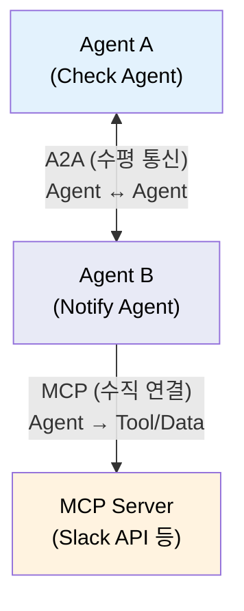
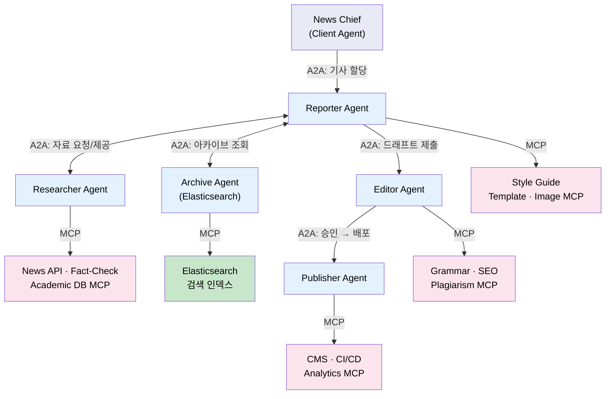
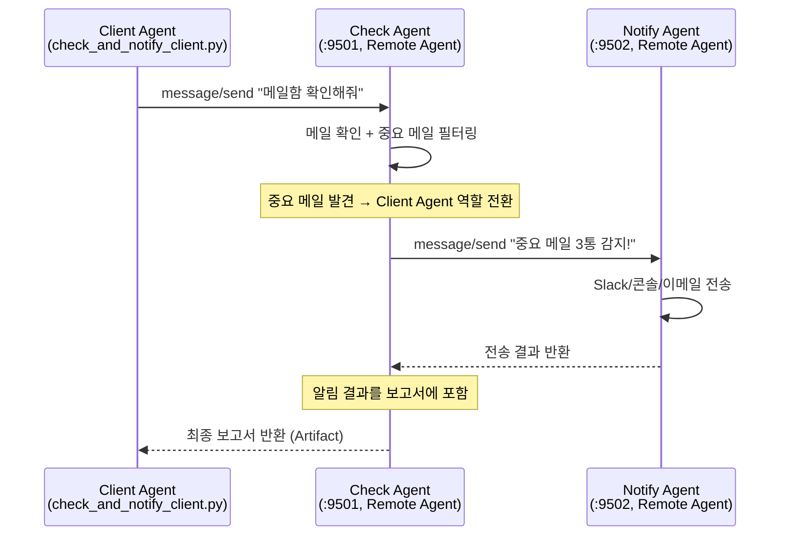
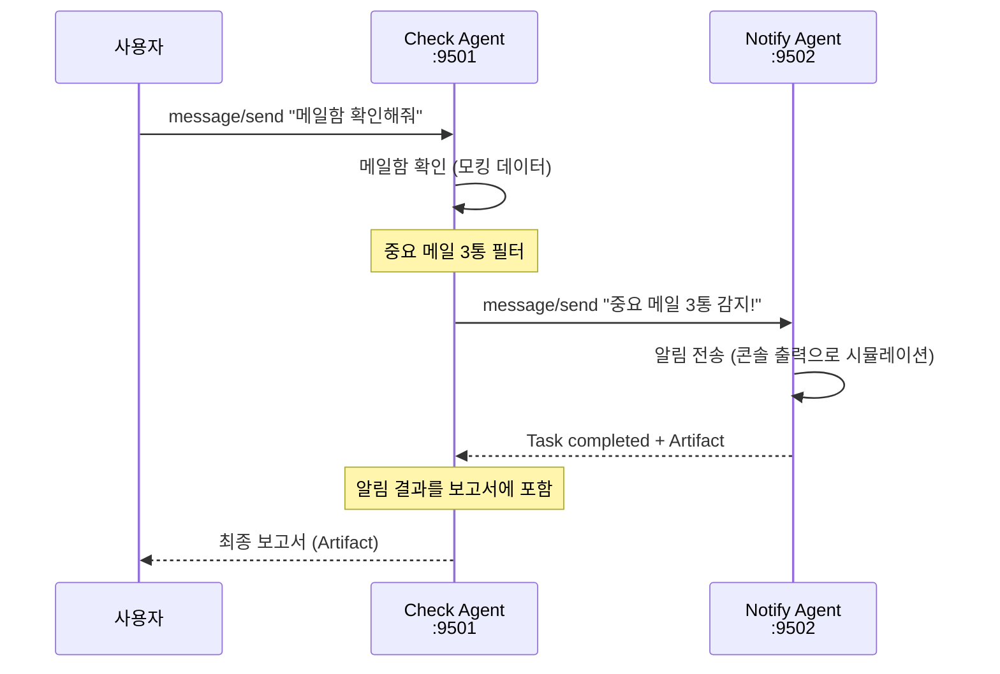

# Chapter 5. A2A로 역할 분리

> **학습 목표**
>
> - [ ] A2A 프로토콜의 핵심 개념(Task, Artifact, Agent Card)을 설명할 수 있다
> - [ ] A2A(Agent↔Agent 수평)와 MCP(Agent→Tool 수직)의 역할 차이를 비교할 수 있다
> - [ ] A2A의 동기/비동기 통신 패턴(블로킹, 폴링, 스트리밍, 웹훅)을 설명할 수 있다
> - [ ] Agent Card를 작성하고 `/.well-known/agent-card.json`으로 게시할 수 있다
> - [ ] 2개 Agent(Check ↔ Notify) 간 A2A 통신을 구현하고 동작 흐름을 추적할 수 있다

| 소요시간 | 학습방법 |
|---------|---------|
| 1.2h | 이론/실습 |

---

<p align="right"><sub style="color:gray">⏱ 16:00 – 시작</sub></p>

### 이 챕터의 출발점

Ch4에서 Skills("어떻게")와 MCP("무엇에")를 분리했습니다. 메일을 확인하고 요약하는 Agent 하나를 만들었습니다.

여기에 알림 전송 기능을 추가한다고 가정합니다. 우리 팀이 전부 개발한다면 같은 Agent에 슬랙 알림 코드를 추가하면 됩니다 — 별도 프로토콜까지는 과합니다.

하지만 현실에서는 다릅니다. **메일 시스템은 커뮤니케이션팀이, 알림 시스템은 인프라팀이** 각각 운영합니다. 팀마다 배포 주기가 다르고, 내부 구현을 서로 알 필요도 없습니다. 외부 파트너사의 알림 서비스를 연동한다면 코드를 공유하는 것 자체가 불가능합니다.

이런 상황에서 **각 팀이 독립적으로 개발·배포한 Agent끼리 표준화된 방식으로 소통**할 수 있어야 합니다. 이것이 A2A가 필요한 이유입니다.

| 역할 | Agent | 운영 주체 (예시) |
|------|-------|-----------------|
| 메일 확인 | Check Agent (:9501) | 커뮤니케이션팀 |
| 알림 전송 | Notify Agent (:9502) | 인프라팀 / 외부 SaaS |

Agent 간 통신에는 **A2A(Agent-to-Agent)** 프로토콜을 사용합니다. MCP가 "Agent→Tool"이었다면, A2A는 "Agent↔Agent"입니다. 서로의 내부 구현을 모르는 Agent가 Agent Card(자기소개)만 보고 협업할 수 있는 구조입니다.

---

<p align="right"><sub style="color:gray">⏱ 16:03</sub></p>

## 이론: A2A 프로토콜 (20분)

### MCP vs A2A: 역할이 다르다

Ch4에서 배운 MCP와 오늘 배울 A2A는 경쟁 관계가 아니라 **다른 계층의 보완 표준**입니다. 2025년 6월 A2A(Google)가 Linux Foundation 프로젝트로 기부되었고, 같은 해 12월 MCP(Anthropic)·AGENTS.md(OpenAI)·goose(Block)가 AAIF(Linux Foundation 산하)에 기부되어 같은 거버넌스 아래 공존하게 되었습니다.

```
MCP: Agent → Tool/Data  (수직)
     "내가 어떤 도구를 쓸 것인가?"

A2A: Agent ↔ Agent  (수평)
     "나와 다른 Agent가 어떻게 협업할 것인가?"
```

비유하면, MCP는 **직원이 사내 시스템(메일서버, DB)에 로그인하는 것**이고, A2A는 **다른 부서 담당자에게 업무를 요청하는 것**입니다. Notify Agent가 내부적으로 Slack API에 접근할 때는 MCP를 쓸 수 있지만, Check Agent가 Notify Agent에게 "이 메일 알림 보내줘"라고 요청하는 것은 A2A입니다. 두 프로토콜은 한 시스템 안에서 자연스럽게 공존합니다.

아래 그림은 A2A 프로토콜 공식 문서에서 두 표준의 관계를 보여주는 다이어그램입니다.

![[images/a2a-mcp-overview.png]]

> 출처: [A2A Protocol 공식 문서](https://a2a-protocol.org/). Framework(예: ADK)로 Agent를 만들고, MCP로 도구를 장착하고, A2A로 다른 Agent와 통신하는 구조입니다.

---

### A2A란?

**A2A(Agent-to-Agent)** 는 Google이 주도하여 만든 Agent 간 통신 프로토콜입니다.

> "MCP가 Agent→Tool 연결이라면, A2A는 Agent↔Agent 연결이다."

### A2A vs MCP 비교



| 구분 | A2A | MCP |
|------|-----|-----|
| **방향** | 수평 (Agent ↔ Agent) | 수직 (Agent → Tool) |
| **역할** | Agent 간 협업 | Agent의 도구 사용 |
| **단위** | Task (작업 요청) | Tool Call (함수 호출) |
| **발견** | Agent Card | Tool Schema |
| **프로토콜** | JSON-RPC / gRPC / REST (3가지 동등 바인딩) | JSON-RPC over stdio/HTTP |
| **주도** | Google → Linux Foundation | Anthropic → Linux Foundation |

> **참고: ACP(Agent Communication Protocol)의 합류와 A2A의 REST 바인딩**
>
> A2A는 원래 **JSON-RPC 2.0만** 지원했습니다. 한편 IBM Research가 BeeAI 플랫폼용으로 만든 **ACP**는 순수 REST(HTTP GET/POST/DELETE) 기반으로, SDK 없이 cURL만으로 Agent와 통신할 수 있었습니다.
>
> 2025년 6월 A2A v0.2.2에 REST 바인딩이 추가되었고, 같은 해 8월 ACP 팀은 A2A와 통합을 선언하며 개발을 중단했습니다. IBM의 Kate Blair(Director of Incubation, IBM Research)가 A2A 기술 운영위원회(TSC)에 합류했습니다.
>
> 그 결과 현재 A2A RC v1.0은 **JSON-RPC / gRPC / REST 세 가지 프로토콜 바인딩을 동등하게** 지원합니다. Agent는 이 중 하나 이상만 구현하면 됩니다. REST 바인딩 덕분에 `curl -X POST /message:send`처럼 별도 SDK 없이도 Agent에 작업을 요청할 수 있습니다.

| 바인딩              | 특징                    | 적합한 상황           |
| ---------------- | --------------------- | ---------------- |
| JSON-RPC 2.0     | A2A 초기 바인딩, 양방향 RPC   | 기존 A2A 에코시스템 호환  |
| gRPC             | Protocol Buffers, 고성능 | 대량 트래픽, 마이크로서비스  |
| HTTP+JSON (REST) | 표준 HTTP 동사, cURL 호환   | 빠른 프로토타이핑, 외부 연동 |

> 출처: [ACP Joins Forces with A2A](https://lfaidata.foundation/communityblog/2025/08/29/acp-joins-forces-with-a2a-under-the-linux-foundations-lf-ai-data/) (LF AI & Data, 2025-08-29), [IBM Think: ACP](https://www.ibm.com/think/topics/agent-communication-protocol), [A2A RC v1.0 Spec](https://a2a-protocol.org/latest/specification/)

> 보충: "수평/수직"은 본질 제약이 아니라 **주된 사용 패턴**을 설명하는 표현입니다. 실무에서는 혼합 구조(Agent 뒤 MCP, MCP 뒤 Agent)가 자주 등장합니다.

### 실사례: Elasticsearch 디지털 뉴스룸 (6-Agent 시스템)

> 출처: [Elasticsearch Labs Blog](https://www.elastic.co/search-labs/blog/a2a-protocol-mcp-llm-agent-newsroom-elasticsearch)

MCP + A2A가 함께 동작하는 가장 명확한 실사례입니다.



**에이전트 역할** (6개):

| Agent | 역할 | A2A 역할 |
|-------|------|----------|
| News Chief | 기사 할당, 워크플로 감독 | A2A Client (Client Agent) |
| Reporter | 기사 작성, 다른 Agent에게 자료 요청 | A2A Server (Remote Agent) |
| Researcher | 팩트·통계·배경 정보 수집 | A2A Server (Remote Agent) |
| Archive | Elasticsearch로 과거 기사 검색·트렌드 분석 | A2A Server (Remote Agent) |
| Editor | 문법·스타일·SEO 검수 | A2A Server (Remote Agent) |
| Publisher | CI/CD로 블로그 배포 | A2A Server (Remote Agent) |

**프로토콜 역할 분담**:
- **A2A**: News Chief → Reporter → Researcher/Archive (자료 수집) → Editor (검수) → Publisher (배포) 체인. Remote Agent끼리도 직접 통신합니다.
- **MCP**: 각 Agent가 자기 도구에 접근 (뉴스 API, 문법 검사기, CMS, Elasticsearch 등)

**판단 기준 (실무 적용)**:
> "두 컴포넌트가 협상하고, 반복하고, 작업 상태를 유지해야 한다면 → A2A
>  한 컴포넌트가 외부 도구나 데이터에 접근해야 한다면 → MCP"

블로그 원문은 이 점을 강조합니다: Reporter가 팩트에 대한 확신이 낮으면 Researcher에게 **다시 돌아가** 추가 자료를 요청할 수 있고, Editor가 수정을 요구하면 Reporter가 **반복 작업**합니다. 이런 양방향 반복이 가능한 것이 단순 함수 호출(MCP)과 다른 A2A의 핵심 가치입니다.

---

### A2A 핵심 개념 (필요 최소)

| 개념 | 설명 | 우리 시나리오 |
|------|------|-------------|
| **Client Agent** | 작업을 **요청하는** Agent. A2A 메시지의 `role: "user"` | 테스트 스크립트, 또는 Check Agent가 Notify를 호출할 때 |
| **Remote Agent** | 요청을 **받아 처리하는** Agent. A2A 메시지의 `role: "agent"` | Check Agent(:9501), Notify Agent(:9502) |
| **Agent Card** | Agent의 자기소개 ([8개 필수 필드](https://a2a-protocol.org/latest/specification/#441-agentcard): name, description, version, supportedInterfaces, capabilities, defaultInputModes, defaultOutputModes, skills) | Check Agent, Notify Agent 각각 |
| **Task** | Agent에게 보내는 작업 요청 | "이 중요 메일을 알림 보내줘" |
| **Artifact** | Task의 결과물 | "슬랙 알림 전송 완료" |
| **Skill** | Agent가 수행 가능한 능력 | "메일 확인", "알림 전송" |
| **Part** | Message/Artifact의 콘텐츠 단위. `text`(텍스트), `raw`(바이너리), `url`(외부 URI), `data`(구조화 JSON) 중 정확히 하나 | `Part(root=TextPart(text="중요 메일 3통"))` |
| **contextId** | 관련 Task/Message를 논리적으로 묶는 식별자 (서버 생성) | 같은 메일 건에 대한 확인→알림 체인 |
| **TaskState** | Task의 생애주기 상태: `submitted` → `working` → `completed` / `failed` / `canceled` / `rejected` + 중단 상태 `input-required` / `auth-required` | 요청 접수(`submitted`) → 처리 중(`working`) → 완료(`completed`) |

**Client Agent와 Remote Agent — 역할은 고정이 아니다:** 하나의 Agent가 상황에 따라 양쪽 역할을 모두 할 수 있습니다. 우리 실습에서 Check Agent는 외부 요청을 받을 때는 **Remote Agent**(서버)이지만, Notify Agent에게 알림을 요청할 때는 **Client Agent**(클라이언트)가 됩니다.

```
테스트 스크립트 ──A2A──▶ Check Agent ──A2A──▶ Notify Agent
 (Client Agent)     (Remote Agent이자      (Remote Agent)
                     Client Agent)
```

이 교재에서 "Client Agent"는 요청을 보내는 쪽, "Remote Agent"는 요청을 받는 쪽을 의미합니다.

### A2A 현황 (RC v1.0 기준)

- 3가지 프로토콜 바인딩 (JSON-RPC / gRPC / REST)
- 서명된 보안 카드 (JWS/RFC 7515)
- 150+ 조직 채택
- Google이 Linux Foundation에 기부
- Python SDK: `a2a-sdk` (PyPI)

> 기준일: 위 내용은 **2026-02-23** 기준 요약입니다. 학습 전에는 `google/A2A` 릴리즈와 `a2a-sdk` 최신 버전을 함께 확인하세요.

**블랙박스 원칙**: A2A의 핵심 가치는 Agent의 내부 구현을 노출하지 않는 것입니다. 실제로 Tyson Foods와 Gordon Food Service는 A2A로 크로스컴퍼니 Agent 협업을 프로덕션에 적용했습니다 — 양사의 Agent가 서로의 내부 구현을 모른 채 Task만으로 협업합니다. ([출처](https://cloud.google.com/customers/gordonfoodservice))

오늘 우리의 Check Agent ↔ Notify Agent도 같은 원리입니다: Check Agent는 "어떻게 메일을 확인하는지", Notify Agent는 "어떻게 알림을 보내는지" 서로 모릅니다.

---

### A2A의 호출 흐름 — REST로 Agent를 부르는 방법

Agent는 자신의 정보를 **Agent Card**로 well-known URI에 게시합니다. 상대 Agent는 이 카드를 읽고 엔드포인트를 알아냅니다.

```text
1) GET  https://notify.infra.com/.well-known/agent-card.json   ← 상대 발견
2) POST https://notify.infra.com/message:send                   ← 작업 요청
   → 응답: { "id": "task-123", "status": {"state": "working"} }
3) GET  https://notify.infra.com/tasks/task-123                  ← 결과 폴링
   → 응답: { "status": {"state": "completed"}, "artifacts": [...] }
```

REST 바인딩의 주요 엔드포인트 ([스펙 §11.3](https://a2a-protocol.org/latest/specification/#113-url-patterns-and-http-methods)):

| 동작 | HTTP | URL |
|------|------|-----|
| 메시지 전송 | `POST` | `/message:send` |
| 스트리밍 | `POST` | `/message:stream` |
| Task 조회 | `GET` | `/tasks/{id}` |
| Task 목록 | `GET` | `/tasks` |
| Task 취소 | `POST` | `/tasks/{id}:cancel` |
| Task 구독 | `POST` | `/tasks/{id}:subscribe` |

> 콜론 표기법(`:send`, `:cancel`)은 Google API 디자인 가이드의 [커스텀 메서드](https://cloud.google.com/apis/design/custom_methods) 규칙을 따릅니다. REST의 HTTP 동사(GET/POST/DELETE)만으로 표현하기 어려운 행위를 나타냅니다.

> **표기 규칙**: REST URL 경로에서는 콜론(`/message:send`)을, JSON-RPC의 `method` 필드에서는 슬래시(`message/send`)를 씁니다. 같은 동작이지만 프로토콜 바인딩에 따라 표기가 다릅니다. 이후 본문에서는 실습에서 사용하는 **JSON-RPC 표기(`message/send`)** 를 기본으로 씁니다.

### 동기 vs 비동기 — 네 가지 통신 패턴

A2A는 **동기와 비동기 모두 지원**합니다. `message/send` 요청의 `params.configuration.returnImmediately` 플래그로 전환합니다.

```json
{
  "method": "message/send",
  "params": {
    "message": { "role": "user", "parts": [{"text": "알림 보내줘"}] },
    "configuration": {
      "returnImmediately": false   // ← false(기본): 블로킹, true: 즉시 반환
    }
  }
}
```

또한 서버는 `message/send` 응답으로 **Task 대신 Message를 직접 반환**할 수도 있습니다. 단순한 질의응답(상태 추적 불필요)이면 Task를 생성하지 않고 Message로 즉시 응답합니다.

| 패턴 | 메서드 | 동작 방식 | 적합한 상황 |
|------|--------|----------|------------|
| **블로킹** | `message/send` (`returnImmediately: false`) | 완료까지 대기 후 결과 반환 | 빠르게 끝나는 작업 |
| **폴링** | `message/send` (`returnImmediately: true`) + `tasks/get` | 즉시 반환, 클라이언트가 주기적 조회 | 수 초~수 분 작업 |
| **스트리밍** | `message/stream` (SSE) | 서버가 실시간으로 진행 상황 푸시 | 실시간 피드백 필요 |
| **웹훅** | `message/send` + `pushNotificationConfig` | 서버가 완료 시 클라이언트 URL에 POST | 수 분~수 시간 작업 |

오늘 실습에서는 `message/send`를 호출하고 응답을 바로 받는 단순한 구조를 사용합니다. `returnImmediately`를 명시하지 않으므로 기본값(`false`, 블로킹)으로 동작합니다.

> 출처: [A2A Streaming & Async](https://a2a-protocol.org/latest/topics/streaming-and-async/), [Life of a Task](https://a2a-protocol.org/latest/topics/life-of-a-task/)

---

### 순환 호출 문제 — A2A 스펙의 알려진 한계

Agent A → B → C → A처럼 순환 호출이 발생하면 어떻게 될까요?

**A2A 프로토콜 자체에는 순환 호출 방지 메커니즘이 없습니다.** HTTP의 `Max-Forwards`나 분산 추적의 span depth 같은 hop counter가 스펙에 정의되어 있지 않습니다. Traceability Extension이 `parent_step_id`로 호출 체인을 기록하지만, 이는 관측(observability)용이지 런타임 차단은 아닙니다.

따라서 **실무에서는 애플리케이션 레벨에서 직접 방어**해야 합니다:

| 방법 | 설명 |
|------|------|
| **hop counter** | `metadata`에 커스텀 필드로 호출 깊이를 전달, 임계치 초과 시 `REJECTED` 반환 |
| **DAG 검증** | 오케스트레이터가 Agent 호출 그래프를 배포 시점에 DAG(비순환 방향 그래프)로 검증 |
| **Task 타임아웃** | 클라이언트 측 HTTP 타임아웃 설정 (Python SDK: `A2AClientTimeoutError`) |
| **REJECTED 상태** | Agent가 이미 처리 중인 `contextId`의 재진입 요청을 거부 |

오늘 실습의 Check → Notify 구조는 **단방향**이므로 순환이 발생하지 않습니다. 하지만 프로덕션에서 다수의 Agent를 연결할 때는 반드시 고려해야 할 사항입니다.

> 순환 호출 방지는 A2A 스펙에 명시적으로 다루어지지 않으며, 위 대응 방법은 분산 시스템의 일반적인 방어 패턴입니다. A2A 보안 전반(Agent Card 스푸핑, 프롬프트 인젝션, OAuth 취약점 등)에 대해서는 [Semgrep: A Security Engineer's Guide to A2A](https://semgrep.dev/blog/2025/a-security-engineers-guide-to-the-a2a-protocol/)를 참고하세요.

---

### Checkpoint: A2A 핵심 개념 확인

1. MCP는 Agent→Tool(수직), A2A는 Agent↔Agent(수평)입니다. Notify Agent가 Slack API에 접근할 때는 MCP와 A2A 중 어떤 프로토콜을 사용할까요?
2. Agent Card에는 "이 Agent가 **누구**이고, **무엇**을 할 수 있고, **어디**로 접근하는지"를 담습니다. 이 세 가지에 해당하는 필드를 각각 말해 보세요. (힌트: 위 개념 테이블과 Agent Card JSON 예시를 참고하세요)
3. Check Agent가 Notify Agent에게 작업을 요청하면, Notify Agent가 처리 중일 때 Task의 상태는 무엇일까요? 처리가 끝나면 어떤 상태로 바뀔까요?
4. `message/send`에서 `returnImmediately: true`로 설정하면 동작이 어떻게 달라지나요?

*먼저 직접 생각한 뒤, 아래 정답을 확인하세요.*

---

**정답:**
1. **MCP**. Slack API는 "도구/데이터"이므로 Agent→Tool 수직 연결(MCP). Agent끼리 협업할 때만 A2A.
2. **name**(누구인지), **skills**(무엇을 할 수 있는지), **supportedInterfaces**(어디로 접근하는지). 이 외에도 `description`, `version`, `capabilities`, `defaultInputModes`, `defaultOutputModes`까지 총 8개가 필수 필드입니다. ([스펙 §4.4.1 AgentCard](https://a2a-protocol.org/latest/specification/#441-agentcard))
3. 처리 중에는 **`working`**, 완료되면 **`completed`**. 이 외에도 `failed`, `canceled`, `rejected`(거부), `input-required`(추가 입력 필요), `auth-required`(인증 필요) 상태가 있습니다.
4. 서버가 **Task 완료를 기다리지 않고 즉시 Task ID만 반환**합니다(비동기). 클라이언트는 `tasks/get`으로 폴링하여 결과를 가져옵니다. 기본값(`false`)이면 완료까지 블로킹합니다(동기).

---

<p align="right"><sub style="color:gray">⏱ 16:23</sub></p>

## 실습 1: Agent Card 작성 (10분)

> 📂 실습 코드: `ch5-a2a/agent_cards/`
>
> ▶ 확인: (Agent Card JSON 파일 확인)
```
ls ch5-a2a/agent_cards/
```

### Agent Card란?

Agent Card는 Agent의 **자기소개서**입니다. 다른 Agent가 이 카드를 읽고 "이 Agent가 무엇을 할 수 있는지" 판단합니다.

### Check Agent의 Agent Card

```json
{
  "name": "Mail Check Agent",
  "description": "메일함을 확인하고 중요 메일을 감지합니다",
  "version": "1.0.0",
  "supportedInterfaces": [
    {"url": "http://localhost:9501", "protocolBinding": "JSONRPC", "protocolVersion": "1.0"}
  ],
  "capabilities": { "streaming": false },
  "defaultInputModes": ["text/plain"],
  "defaultOutputModes": ["text/plain"],
  "skills": [
    {
      "id": "check-mail",
      "name": "메일 확인",
      "description": "메일함을 확인하고 중요 메일을 필터링합니다"
    }
  ]
}
```

### Notify Agent의 Agent Card

```json
{
  "name": "Notify Agent",
  "description": "알림을 전송합니다 (슬랙, 콘솔 등)",
  "version": "1.0.0",
  "supportedInterfaces": [
    {"url": "http://localhost:9502", "protocolBinding": "JSONRPC", "protocolVersion": "1.0"}
  ],
  "capabilities": { "streaming": false },
  "defaultInputModes": ["text/plain"],
  "defaultOutputModes": ["text/plain"],
  "skills": [
    {
      "id": "send-notification",
      "name": "알림 전송",
      "description": "중요 메일에 대한 알림을 슬랙이나 콘솔로 전송합니다"
    }
  ]
}
```

> 위 JSON에는 [스펙상 필수 필드 8개](https://a2a-protocol.org/latest/specification/#441-agentcard)(`name`, `description`, `version`, `supportedInterfaces`, `capabilities`, `defaultInputModes`, `defaultOutputModes`, `skills`)가 모두 포함되어 있습니다. 실습 코드(`ch5-a2a/agent_cards/`)에는 `tags`, `examples` 등 선택 필드도 추가되어 있으니 함께 확인하세요.


---

### 발견 경로

A2A 스펙은 Agent를 발견하는 **3가지 전략**을 정의합니다.

| 전략 | 방식 | 적합한 상황 |
|------|------|------------|
| **Well-Known URI** | `/.well-known/agent-card.json`에 게시 (RFC 8615) | 공개 Agent, 도메인 기반 발견 |
| **큐레이션 레지스트리** | 중앙 카탈로그 서비스가 Agent Card를 색인, 능력 기반 검색 | 기업 내부 Agent 마켓플레이스 |
| **직접 설정** | 설정 파일·환경변수에 Agent URL 하드코딩 | 개발 환경, 고정된 Agent 관계 |

오늘 실습에서는 가장 기본인 **Well-Known URI** 방식을 사용합니다. 실습 2에서 서버를 띄운 뒤 아래 URL로 직접 확인할 수 있습니다.

```
http://localhost:9501/.well-known/agent-card.json  → Check Agent Card
http://localhost:9502/.well-known/agent-card.json  → Notify Agent Card
```

지금은 서버를 띄우기 전이므로, JSON 파일을 직접 열어 구조를 확인합니다:

```bash
uv run python3 -c "
import json
card = json.load(open('ch5-a2a/agent_cards/check_agent.json'))
print(card['name'])
print(card['supportedInterfaces'][0]['url'])
print(card['skills'][0]['id'])
"
```

완료 기준:
1. Agent Card JSON에서 필수 8개 필드(`name`, `description`, `version`, `supportedInterfaces`, `capabilities`, `defaultInputModes`, `defaultOutputModes`, `skills`)를 식별할 수 있다.
2. `supportedInterfaces[0].url`이 해당 Agent의 실행 포트와 일치한다.
3. `skills[].id`가 Agent의 역할을 반영하는 값이다.

> [!todo] Agent Card를 직접 작성해 볼까요? (5분)
> `ch5-a2a/notebooks/a2a_fill_in_blank.ipynb`을 열고 **실험 1**을 진행하세요.
>
> Agent Card의 `name`, `url`, `skills` 빈칸을 채우고, 필수 필드가 갖춰진 Card를 구성합니다.

---

<p align="right"><sub style="color:gray">⏱ 16:33</sub></p>

## 실습 2: Check Agent 구현 (17분)

> 📂 실습 코드: `ch5-a2a/check_agent.py`
>
> ▶ 실행:
```
uv run python3 ch5-a2a/check_agent.py
```
>
> 서버가 기동되면 실습 1에서 확인한 Agent Card를 실제로 조회해 봅니다:
```bash
curl -s http://localhost:9501/.well-known/agent-card.json | uv run python3 -c "import sys,json; print(json.dumps(json.load(sys.stdin),indent=2,ensure_ascii=False))"
```
> 200 응답과 함께 `name`, `url`, `skills[].id`가 출력되면 정상입니다.

### a2a-sdk 설치

```bash
uv add "a2a-sdk[http-server]" uvicorn
```

### Check Agent 서버

```python
from a2a.server.apps import A2AStarletteApplication
from a2a.server.agent_execution import AgentExecutor, RequestContext
from a2a.server.request_handlers import DefaultRequestHandler
from a2a.server.tasks import InMemoryTaskStore
from a2a.server.tasks.task_updater import TaskUpdater
from a2a.server.events import EventQueue
from a2a.types import AgentCard, AgentCapabilities, AgentSkill, Part, TextPart
import uvicorn

class CheckAgentExecutor(AgentExecutor):
    async def execute(self, context: RequestContext, event_queue: EventQueue):
        """메일을 확인하고 중요 메일을 감지합니다."""
        # TaskUpdater: taskId/contextId/artifactId/final 등을 자동 관리
        updater = TaskUpdater(
            event_queue=event_queue,
            task_id=context.task_id,
            context_id=context.context_id,
        )

        # 1. 메일 확인 (모킹)
        emails = [
            {"from": "팀장님", "subject": "긴급: 서버 점검", "important": True},
            {"from": "HR팀", "subject": "워크숍 일정", "important": False},
            {"from": "고객사", "subject": "프로젝트 미팅", "important": True},
        ]
        important = [e for e in emails if e["important"]]

        # 2. 결과를 Artifact로 전달 — artifactId 자동 생성
        report = f"중요 메일 {len(important)}통 감지:\n"
        for e in important:
            report += f"  - [{e['from']}] {e['subject']}\n"

        await updater.add_artifact(
            parts=[Part(root=TextPart(text=report))],
            name="mail-check-report",
        )
        # 3. 완료 — final=True, Message 객체 모두 자동 처리
        await updater.complete(
            message=updater.new_agent_message(
                parts=[Part(root=TextPart(text="메일 확인 완료"))],
            ),
        )

# Agent Card 정의
agent_card = AgentCard(
    name="Mail Check Agent",
    description="메일함을 확인하고 중요 메일을 감지합니다",
    url="http://localhost:9501",
    version="1.0.0",
    capabilities=AgentCapabilities(streaming=False),
    skills=[AgentSkill(
        id="check-mail",
        name="메일 확인",
        description="메일함을 확인하고 중요 메일을 필터링합니다",
    )],
)

def create_app():
    executor = CheckAgentExecutor()

    # InMemoryTaskStore: A2A Task의 상태(submitted→working→completed)를
    # 메모리에 저장하여 task/get 조회 시 진행 상황을 반환합니다.
    handler = DefaultRequestHandler(
        agent_executor=executor,
        task_store=InMemoryTaskStore(),
    )
    application = A2AStarletteApplication(
        agent_card=agent_card,
        http_handler=handler,
    )
    return application.build()

if __name__ == "__main__":
    uvicorn.run(create_app(), host="0.0.0.0", port=9501)
```

> **`TaskUpdater` — 이벤트 발행 헬퍼:** `TaskStatusUpdateEvent`나 `TaskArtifactUpdateEvent`를 직접 생성하면 `taskId`, `contextId`, `final`, `artifactId`, `messageId` 등 필수 필드를 매번 채워야 합니다. `TaskUpdater`는 이를 자동화합니다 — 생성 시 `context.task_id`와 `context.context_id`를 한 번만 전달하면, 이후 `start_work()`, `add_artifact()`, `complete()`, `cancel()` 등의 메서드가 모든 필드를 자동으로 채웁니다. `new_agent_message()`는 `role=agent`, `messageId=UUID`가 세팅된 `Message` 객체를 만들어줍니다.

> **왜 LLM을 사용하지 않나요?** 이 실습의 Check Agent와 Notify Agent는 의도적으로 LLM 없이 규칙 기반으로 동작합니다. 메일 필터링(`important: True/False`)과 알림 전송은 LLM이 필요 없는 결정적(deterministic) 작업이고, LLM 없이 구현해야 **A2A 프로토콜 자체의 구조**(Agent Card, JSON-RPC, Task 상태 흐름)에 집중할 수 있습니다. 프로덕션에서 LLM 기반 메일 분류가 필요하다면, `CheckAgentExecutor.execute()` 안에서 LLM을 호출하면 됩니다 — A2A 서버 구조는 그대로 유지됩니다.

> **스펙 vs SDK 차이:** 스펙(RC v1.0)에서는 `supportedInterfaces` 배열이 필수이지만, `a2a-sdk` v0.3.25는 아직 이 필드를 구현하지 않아 `url=` + `preferredTransport`로 직렬화합니다. 따라서 Python 코드에서는 `url=`을 사용하고, 정적 JSON 파일(`agent_cards/*.json`)은 스펙 기준 `supportedInterfaces`로 작성합니다. SDK가 스펙을 따라잡으면 코드도 `supportedInterfaces`로 전환될 예정입니다.

### Check Agent → Notify Agent A2A 호출 (핵심 발췌)

Check Agent는 **Remote Agent**(서버)이지만, Notify Agent를 호출할 때는 **Client Agent** 역할도 합니다. 알림 전송 결과는 Check Agent의 보고서에 포함되어 원래 요청한 Client Agent에게 반환됩니다.

```
Client Agent → Check Agent(Remote) → Notify Agent(Remote)
                                      ↓ 알림 전송
                    보고서에 포함 ←── 결과 반환
Client Agent ← 최종 보고서
```

아래는 `check_agent.py`에서 이 호출을 담당하는 핵심 부분입니다. JSON-RPC 구조를 직접 보여주기 위해 httpx로 구현했습니다.

```python
# check_agent.py — Notify Agent A2A 호출 (발췌, 전체는 실습 파일 참고)
NOTIFY_AGENT_URL = "http://localhost:9502"

async def notify_agent_via_a2a(important_emails: list[dict]) -> str:
    """Notify Agent에게 알림을 위임하고, 결과를 보고서용 문자열로 반환합니다."""
    # 중요 메일 요약 텍스트 구성
    email_summary = [f"- [{e['sender_name']}] {e['subject']}" for e in important_emails]
    notification_text = f"중요 메일 {len(important_emails)}통이 감지되었습니다!\n" + "\n".join(email_summary)

    # A2A JSON-RPC 요청 구성
    a2a_request = {
        "jsonrpc": "2.0",
        "id": "check-to-notify-001",
        "method": "message/send",          # A2A 메시지 전송 메서드
        "params": {
            "message": {
                "role": "user",
                "parts": [{"kind": "text", "text": notification_text}],
            },
        },
    }

    async with httpx.AsyncClient(timeout=10.0) as client:
        response = await client.post(f"{NOTIFY_AGENT_URL}/", json=a2a_request)
        result = response.json()
    return f"알림 전송 완료: {result.get('result', {}).get('status', {}).get('state', 'unknown')}"
```

`CheckAgentExecutor.execute()` 안에서 중요 메일이 있으면 이 함수를 호출합니다. 위 코드는 JSON-RPC 구조를 직접 보여주기 위해 httpx로 작성했습니다. SDK `ClientFactory`를 사용하는 간결한 방식은 아래 "Client Agent 코드" 섹션과 `check_and_notify_client.py`를 참고하세요.

---

<p align="right"><sub style="color:gray">⏱ 16:50</sub></p>

## 실습 3: Notify Agent 구현 및 연동 (13분)

> 📂 실습 코드: `ch5-a2a/notify_agent.py`
>
> ▶ 실행: (별도 터미널에서)
```
uv run python3 ch5-a2a/notify_agent.py
```

### Notify Agent 서버

```python
class NotifyAgentExecutor(AgentExecutor):
    async def execute(self, context: RequestContext, event_queue: EventQueue):
        """알림을 전송합니다."""
        updater = TaskUpdater(
            event_queue=event_queue,
            task_id=context.task_id,
            context_id=context.context_id,
        )

        # 1. 메시지 추출 — Part.root가 TextPart인 것만 필터링
        message = ""
        if context.message and context.message.parts:
            message = "".join(
                part.root.text for part in context.message.parts
                if isinstance(part.root, TextPart)
            )

        # 2. 콘솔 알림 (실제로는 Slack API 호출)
        print(f"\n{'='*50}")
        print(f"  알림 전송! 내용: {message}")
        print(f"{'='*50}\n")

        # 3. 결과를 이벤트로 전달 — TaskUpdater가 ID/상태 자동 관리
        await updater.add_artifact(
            parts=[Part(root=TextPart(text="알림 전송 완료"))],
        )
        await updater.complete(
            message=updater.new_agent_message(
                parts=[Part(root=TextPart(text="알림 전송 완료"))],
            ),
        )
```

텍스트 추출 패턴 — `Part.root`는 `TextPart | FilePart | DataPart` 중 하나이므로, `isinstance`로 `TextPart`만 필터링합니다:

```python
from a2a.types import TextPart

# context.message.parts에서 텍스트만 추출
text = "".join(
    part.root.text for part in context.message.parts
    if isinstance(part.root, TextPart)
)
```

**왜 Part라는 단위가 필요한가?** A2A 메시지는 텍스트만 주고받는 것이 아닙니다. 하나의 메시지에 여러 종류의 데이터를 함께 담을 수 있도록 Part 배열로 설계되어 있습니다:

| Part 타입 | 용도 | 예시 |
|-----------|------|------|
| `TextPart` | 자연어 텍스트 | 보고서, 요약, 응답 메시지 |
| `FilePart` | 바이너리 파일 또는 URL | 이미지, PDF, 파일 링크 |
| `DataPart` | JSON 구조화 데이터 | API 응답, 메타데이터, 통계 |

예를 들어 이미지 분석 Agent가 결과를 반환할 때, 텍스트 설명(`TextPart`) + 원본 이미지(`FilePart`) + 분석 수치(`DataPart`)를 하나의 메시지에 담을 수 있습니다. 이메일의 본문과 첨부파일의 관계와 유사합니다. 우리 실습에서는 `TextPart`만 사용하지만, 이 구조 덕분에 A2A는 멀티모달 Agent 간 통신도 지원합니다.

**스트리밍의 경우:** Agent Card에서 `capabilities.streaming: true`로 선언한 Remote Agent는 `message/stream` 메서드를 지원합니다. 이때 Remote Agent는 `TaskUpdater`의 메서드(`start_work()`, `add_artifact()`, `complete()`)로 이벤트를 하나씩 큐에 넣고, SDK가 이를 SSE(Server-Sent Events)로 Client Agent에 실시간 전달합니다. Client Agent는 `TaskStatusUpdateEvent`(상태 변화)와 `TaskArtifactUpdateEvent`(결과 조각)를 순서대로 수신합니다.

```
[스트리밍 흐름]
Remote Agent: updater.start_work(...)              → SSE → Client Agent
Remote Agent: updater.add_artifact(1차 결과)        → SSE → Client Agent
Remote Agent: updater.add_artifact(2차 결과)        → SSE → Client Agent
Remote Agent: updater.complete(...)                → SSE → Client Agent
```

`TaskUpdater.add_artifact(append=True)`로 설정하면 이전 Artifact에 Part를 이어붙이고, `last_chunk=True`로 스트리밍 종료를 알립니다. 우리 실습에서는 `streaming=False`이므로 `message/send` 한 번의 요청-응답으로 완료되지만, 서버 측 코드 구조(`TaskUpdater`)는 스트리밍/비스트리밍 모두 동일합니다 — SDK가 전송 방식만 바꿔줍니다.

### Client Agent: 누가 Agent에게 일을 맡기는가?

Check Agent와 Notify Agent는 A2A **Remote Agent**(서버)입니다. Remote Agent는 스스로 동작하지 않고, 누군가 요청을 보내야 일을 시작합니다. 이 "누군가"가 **Client Agent**입니다.

실제 환경에서 Client Agent가 될 수 있는 것:
- 사용자가 직접 실행하는 테스트 스크립트
- 매 30분마다 메일을 확인하는 스케줄러(cron)
- 상위 오케스트레이터 Agent (예: Elasticsearch 사례의 News Chief)

우리 실습에서는 `check_and_notify_client.py`가 Client Agent 역할을 합니다. 이 스크립트는 **Check Agent에게만 요청**합니다. Notify Agent 호출은 Check Agent가 내부적으로 처리합니다 — 이것이 "하나의 Agent가 Remote이자 Client 역할을 겸한다"의 실제 동작입니다.



### Client Agent 코드 — ClientFactory + Client 사용

`check_and_notify_client.py`(Client Agent)에서는 `a2a-sdk`의 `ClientFactory`를 사용합니다. Check Agent에게만 요청을 보내면 되므로 코드가 간결합니다. 앞서 `check_agent.py`에서 httpx로 JSON-RPC를 직접 구성하는 방식을 봤으므로, 여기서는 SDK가 이를 어떻게 추상화하는지 비교합니다.

```python
# check_and_notify_client.py (핵심 발췌)
from a2a.client import A2ACardResolver, ClientFactory, ClientConfig
from a2a.types import Message, Part, TextPart, Role

CHECK_AGENT_URL = "http://localhost:9501"

async def call_check_agent(message_text: str):
    async with httpx.AsyncClient(timeout=30.0) as httpx_client:
        # 1) Agent Card 조회
        resolver = A2ACardResolver(httpx_client=httpx_client, base_url=CHECK_AGENT_URL)
        card = await resolver.get_agent_card()

        # 2) Client 생성 — Agent Card의 transport 정보로 자동 구성
        factory = ClientFactory(config=ClientConfig(httpx_client=httpx_client, streaming=False))
        client = factory.create(card=card)

        # 3) Message 생성 + 전송
        msg = Message(
            role=Role.user,
            messageId=str(uuid.uuid4()),
            parts=[Part(root=TextPart(text=message_text))],
        )
        async for event in client.send_message(request=msg):
            print(event)  # Task/Message 이벤트 수신
```

httpx 직접 방식(`check_agent.py`의 `notify_agent_via_a2a`)과 비교하면:
- `jsonrpc`, `method`, `params` 구성 → SDK가 자동 처리
- Agent Card 조회 → `A2ACardResolver`가 `/.well-known/agent-card.json` 자동 접근
- 응답 파싱 → 이벤트 스트림으로 `Task`/`Message` 객체 수신

### 실행 방법

**3개 터미널을 순서대로 실행합니다.** 각 서버(Remote Agent)가 정상 기동된 것을 확인한 뒤 다음 단계로 넘어가세요.

```bash
# 터미널 1: Check Agent (Remote Agent) 실행
uv run python3 ch5-a2a/check_agent.py
# ✅ 정상: "서버 시작 중..." 로그 출력 후 대기 상태

# 터미널 2: Notify Agent (Remote Agent) 실행
uv run python3 ch5-a2a/notify_agent.py
# ✅ 정상: "서버 시작 중..." 로그 출력 후 대기 상태

# 터미널 3: Client Agent로 테스트 (터미널 1, 2가 대기 상태인 것을 확인한 후)
uv run python3 ch5-a2a/check_and_notify_client.py
# → Check Agent에게 요청 → Check Agent가 내부적으로 Notify Agent 호출
# → 최종 보고서에 알림 전송 결과가 포함되어 반환
```

> 터미널 1, 2의 서버가 완전히 기동되기 전에 터미널 3을 실행하면 `ConnectionRefusedError`가 발생합니다. `curl`로 Agent Card 응답을 먼저 확인하세요.

> **httpx 직접 vs A2AClient 비교:** `check_agent.py`(Remote Agent 내부)의 `notify_agent_via_a2a()`는 httpx로 JSON-RPC를 직접 구성하여 프로토콜 구조를 학습합니다. `check_and_notify_client.py`(Client Agent)는 `A2AClient` SDK를 사용하여 동일한 호출을 간결하게 수행합니다. 프로덕션에서는 `A2AClient`를 권장합니다.

정상 동작 체크포인트:
1. **터미널 3 출력**: Client Agent가 Check Agent의 최종 보고서를 수신하고, "알림 전송 완료" 메시지 포함
2. **터미널 1 로그**: Check Agent가 Notify Agent를 호출하는 로그 ("Notify Agent에게 알림 요청...")
3. **터미널 2 로그**: Notify Agent에 `[SLACK 알림 시뮬레이션]` 및 `[콘솔 알림]` 출력

완료 기준:
1. Client Agent → Check Agent → Notify Agent 전체 체인이 하나의 요청으로 동작한다.
2. Notify Agent가 미실행 상태일 때 Check Agent가 "알림 전송 실패"를 보고서에 포함하여 반환한다.

> [!todo] A2A 메시지 구조를 추적해 볼까요? (5분)
> `ch5-a2a/notebooks/a2a_fill_in_blank.ipynb`을 열고 **실험 2**를 진행하세요.
>
> Check Agent가 Notify Agent에게 보내는 A2A JSON-RPC 메시지의 `method`, `role`, `parts` 빈칸을 채우며 메시지 구조를 직접 구성해 봅니다.

---

<p align="right"><sub style="color:gray">⏱ 17:03</sub></p>

## A2A 통신 흐름 — 실습 코드 기준 (7분)

아래 다이어그램은 **우리 실습 코드가 실제로 수행하는 흐름**입니다. Check Agent의 메일 데이터와 Notify Agent의 알림 채널은 A2A 프로토콜 구조에 집중하기 위해 모킹(콘솔 출력)으로 구현되어 있습니다.



프로덕션에서는 Check Agent가 **MCP로 실제 메일 서버**에 접근하고, Notify Agent가 **MCP로 Slack API**를 호출합니다. 이 구조에서도 **Agent 간 통신(A2A)은 동일**합니다 — 달라지는 것은 각 Agent의 내부 구현뿐입니다. 이것이 A2A의 **블랙박스 원칙**입니다.

> [!todo] 블랙박스 원칙을 확인해 볼까요? (3분)
> `notify_agent.py`의 `NotificationChannel` 클래스를 열어보세요.
>
> 1. `send_slack()`, `send_console()`, `send_email_mock()` — 세 메서드 모두 실제로는 **콘솔 출력**입니다. 이 "내부 구현"을 실제 Slack API 호출로 교체해도 Check Agent 코드는 바뀌지 않습니다. **왜 그럴까요?**
> 2. `NotifyAgentExecutor.execute()` 안에서 알림 채널을 호출하는 부분을 찾으세요. 이 부분만 수정하면 새 채널(예: MS Teams)을 추가할 수 있습니다. **Check Agent나 Client Agent에는 어떤 변경이 필요할까요?** (정답: 없음 — A2A 인터페이스가 동일하므로)

> [!todo] A2A 역할 전환을 추적해 볼까요? (5분)
> `ch5-a2a/notebooks/a2a_fill_in_blank.ipynb`을 열고 **실험 3**을 진행하세요.
>
> Client Agent → Check Agent → Notify Agent 체인에서, 각 구간의 Client/Remote 역할을 빈칸으로 채우며 "하나의 Agent가 양쪽 역할을 겸한다"는 개념을 확인합니다.

---

<p align="right"><sub style="color:gray">⏱ 17:08</sub></p>

## 핵심 요약

| 개념 | 설명 |
|------|------|
| **A2A** | Agent 간 수평 통신 프로토콜 (Task 기반) |
| **MCP** | Agent→Tool 수직 연결 프로토콜 (Tool Call 기반) |
| **Agent Card** | Agent의 자기소개서 (이름, 설명, 능력, 엔드포인트 등 8개 필수 필드) |
| **Task** | Agent에게 보내는 작업 요청 단위 |
| **역할 분리** | Check Agent = 감지, Notify Agent = 알림 |

```
전체 그림:
  DeepAgents (Harness)
    └─ Skills (절차적 지식)
    └─ MCP (데이터 접근)
    └─ A2A (Agent 간 협업)   ← 오늘 추가!
```

> **다음 Chapter**: 모든 것을 하나로 연결하는 통합 데모와 Wrap-up.

---

<p align="right"><sub style="color:gray">⏱ 17:10~17:15 쉬는 시간</sub></p>

## 실습 트러블슈팅 (FAQ)

### Q1. `uv add a2a-sdk`가 실패합니다.

- 버전을 명시하세요: `uv add "a2a-sdk>=0.3,<1.0"`
- 또는 `uv pip install -r code/requirements.txt`로 전체 의존성을 설치하세요.

### Q2. `ConnectionRefusedError`가 발생합니다.

- 해당 포트의 Agent 서버가 아직 기동되지 않았습니다.
- `curl -s http://localhost:9501/.well-known/agent-card.json`으로 서버 상태를 먼저 확인하세요.
- Check Agent(9501) → Notify Agent(9502) → Client 순서로 실행하세요.

### Q3. Agent 서버가 시작 직후 종료됩니다.

- 포트가 이미 사용 중일 수 있습니다: `lsof -i :9501` 또는 `lsof -i :9502`
- 기존 프로세스를 종료하거나 다른 포트를 사용하세요.
- Python 3.10 미만이면 `a2a-sdk` 호환 문제가 있을 수 있습니다.

### Q4. Check Agent → Notify Agent 호출이 타임아웃됩니다.

- `check_agent.py`의 Notify Agent 호출은 `timeout=10.0`입니다.
- Notify Agent(9502)가 정상 실행 중인지 확인하세요.
- Notify Agent 없이 Check Agent만 단독 실행해도 메일 확인 기능은 정상 동작합니다. 알림 전송만 실패로 표시됩니다.

### Q5. 이전에 실행한 서버가 죽지 않아 포트 충돌이 납니다.

- `Ctrl+C`로 서버를 종료합니다.
- 백그라운드에 남아있다면: `kill $(lsof -ti :9501)` 및 `kill $(lsof -ti :9502)`

---

## 심화: 분산 협업 안정성 기준

#### 분산시스템 기본 규약

| 항목 | 기본값 |
|------|-------|
| timeout | 10s (외부 Agent 호출) |
| retry | 최대 2회 |
| backoff | 1s → 2s (지수 증가) |
| idempotency key | `message_id` 재사용으로 중복 처리 방지 |

#### Agent Card를 Contract로 관리

필수 계약 항목:
1. 입력 메시지 스키마(`parts` 포맷)  
2. 출력/result 스키마(성공/실패 구조)  
3. 오류 코드 정책(예: `A2A_TIMEOUT`, `A2A_INVALID_REQUEST`)  
4. 버전 정책(major/minor, 하위 호환 규칙)

#### 협업 품질 지표 (실습 과제)

| 지표 | 정의 |
|------|------|
| 핸드오프 성공률 | Check → Notify 전달 성공 비율 |
| 평균 처리시간 | 요청~최종 Artifact까지 소요 시간 |
| 재시도율 | 전체 요청 중 retry 발생 비율 |

---

## 참고 자료

- [A2A Protocol 공식](https://github.com/a2aproject/A2A)
- [a2a-sdk (Python)](https://pypi.org/project/a2a-sdk/)
- [A2A vs MCP 비교](https://getstream.io/blog/agent2agent-vs-mcp/)
- [Google ADK A2A 통합](https://google.github.io/adk-docs/)
- [Elasticsearch A2A+MCP Newsroom](https://www.elastic.co/search-labs/blog/a2a-protocol-mcp-llm-agent-newsroom-elasticsearch)
- [Gordon Food Service Case Study](https://cloud.google.com/customers/gordonfoodservice)
- [Linux Foundation AAIF (A2A+MCP 공동 거버넌스)](https://www.linuxfoundation.org/press/linux-foundation-announces-the-formation-of-the-agentic-ai-foundation)
- [A2A 프로토콜 v0.3 업그레이드](https://cloud.google.com/blog/products/ai-machine-learning/agent2agent-protocol-is-getting-an-upgrade) — gRPC 지원, 150+ 기업 채택
- [Google의 A2A Linux Foundation 기부](https://developers.googleblog.com/en/google-cloud-donates-a2a-to-linux-foundation/) — 벤더 중립 거버넌스
- [A2A Protocol 공식 사이트](https://a2a-protocol.org/)
- [ACP joins forces with A2A under Linux Foundation (LF AI & Data, 2025)](https://lfaidata.foundation/communityblog/2025/08/29/acp-joins-forces-with-a2a-under-the-linux-foundations-lf-ai-data/) — ACP↔A2A 통합
- [IBM Think: Agent Communication Protocol](https://www.ibm.com/think/topics/agent-communication-protocol) — ACP 설계 철학, A2A 통합 배경
- [A2A RC v1.0 Specification](https://a2a-protocol.org/latest/specification/) — REST/gRPC/JSON-RPC 3가지 바인딩 스펙
- [A2A: Streaming & Asynchronous Operations](https://a2a-protocol.org/latest/topics/streaming-and-async/) — 동기/비동기/SSE/웹훅 패턴
- [A2A: Life of a Task](https://a2a-protocol.org/latest/topics/life-of-a-task/) — Task 상태 머신, Message vs Task 응답
- [A2A: Agent Discovery](https://a2a-protocol.org/latest/topics/agent-discovery/) — Well-Known URI, 큐레이션 레지스트리, 직접 설정 3가지 발견 전략
- [A2A: Key Concepts](https://a2a-protocol.org/latest/topics/key-concepts/) — Core Actors, Part 타입, Message 구조
- [Semgrep: A Security Engineer's Guide to A2A](https://semgrep.dev/blog/2025/a-security-engineers-guide-to-the-a2a-protocol/) — Agent Card 스푸핑, OAuth, 프롬프트 인젝션 등 보안 분석
