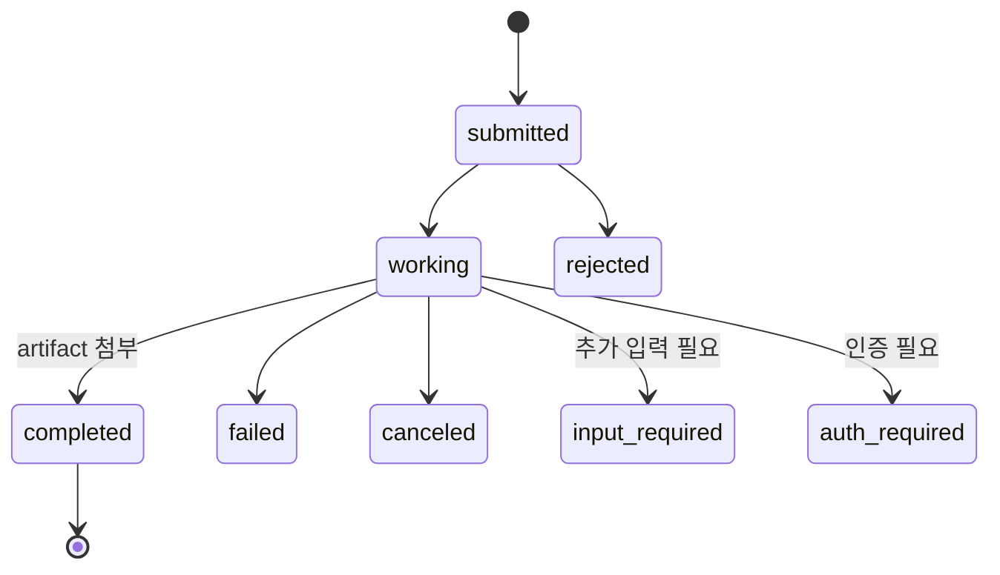
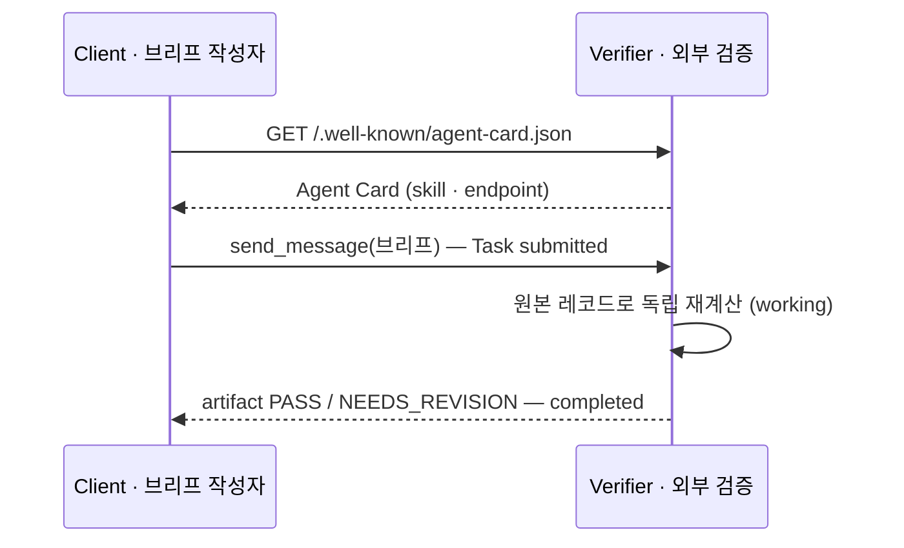
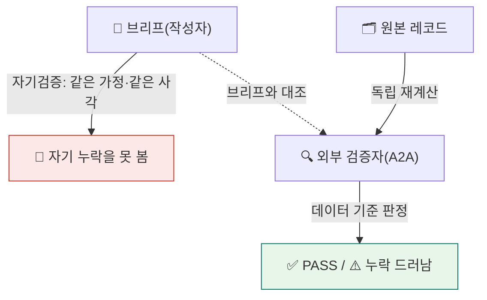

<div class="lec">
<div class="deck">

<section class="slide hero">
<div>
<div class="eyebrow">Chapter 5 · A2A 역할 분리</div>

# 밖에,<br>검증을 맡긴다

<p class="lead">브리프를 쓴 에이전트가 자기 브리프를 검증하면, 빠뜨린 항목도 "다 짚었다"고 확신합니다 — 같은 사각을 공유하니까.<br>
이 챕터에서 브리프를 외부 검증 에이전트에 A2A로 보냅니다. 그 에이전트는 서명 가능한 Agent Card로 자신을 밝히고, 원본 레코드를 독립으로 다시 계산해 PASS/FAIL을 답합니다.</p>

<div class="kicker">
<div class="metric"><span class="num">70</span><strong>분</strong><span>이론 28 · 핸즈온 42</span><span class="clk">예상 15:00–16:10 · 앞 ☕10분</span></div>
<div class="metric"><span class="num">5</span><strong>번째 부품</strong><span>a2a_verify.py</span></div>
<div class="metric"><span class="num">1</span><strong>검증된 브리프</strong><span>verified_brief.md</span></div>
</div>
</div>

<div class="board">
<div class="board-header"><span>이 챕터가 끝나면</span><span class="status-pill">산출물</span></div>
<div class="stack">
<div class="row"><div class="code">1</div><div class="copy"><strong>Agent Card 조회</strong><p>well-known 경로에서 상대 에이전트의 자기소개</p></div><div class="store">신원</div></div>
<div class="row"><div class="code">2</div><div class="copy"><strong>SendMessage</strong><p>브리프를 보내고 Task 라이프사이클로 결과</p></div><div class="store">통신</div></div>
<div class="row"><div class="code">3</div><div class="copy"><strong>verified_brief.md</strong><p>외부 검증을 거친 최종 브리프</p></div><div class="store">검증</div></div>
</div>
</div>
</section>

<section class="slide">
<div class="section-head">
<div>
<div class="eyebrow">1 · 경계 · 6분</div>

## 서브에이전트와 무엇이 다른가

</div>
<p class="section-note">Ch3의 서브에이전트는 같은 프로세스 안에서 일을 나눴습니다. 내가 만든 에이전트가 내 함수를 부르는 구조입니다.<br>
A2A는 그 경계를 넘습니다. 상대는 다른 프로세스, 어쩌면 다른 팀이 운영하는 에이전트입니다. 내가 그 내부를 모르고도 카드와 메시지로 협업합니다.</p>
</div>

<div class="grid-2">
<div class="panel"><div class="panel-head"><strong>서브에이전트 — 인프로세스</strong><span>Ch3</span></div><div class="panel-body"><div class="list">
<p>같은 프로세스, 내가 만든 도구를 위임</p>
<p>내부를 다 알고 직접 호출합니다</p>
<p>fan-out으로 내 일을 나누는 데 맞습니다</p>
</div></div></div>
<div class="panel"><div class="panel-head"><strong>A2A — 프로세스·팀 경계</strong><span>Ch5</span></div><div class="panel-body"><div class="list">
<p>다른 프로세스, 다른 팀의 에이전트</p>
<p>내부를 몰라도 카드와 메시지로 협업</p>
<p>외부 검증·외부 서비스 호출에 맞습니다</p>
</div></div></div>
</div>

<p class="section-note" style="margin-top:16px">검증을 같은 프로세스 안에서 하면 결국 내 코드가 내 코드를 봅니다. 독립성이 없습니다. 검증자를 프로세스 밖으로 빼야 진짜 외부 시각이 됩니다. 그래서 A2A를 씁니다.</p>

<div class="ask" style="margin-top:18px"><strong>생각해보기.</strong> Ch4에서 붙인 MCP와 이번 A2A는 뭐가 다를까요? 둘 다 "외부와 통신"인데.</div>

<details>
<summary>정답 확인</summary>
<div class="reveal">
<p><strong>MCP는 에이전트→도구</strong>입니다. 내 에이전트가 파일·DB·API 같은 <em>도구</em>를 끌어다 씁니다(Ch4 지식 베이스). <strong>A2A는 에이전트↔에이전트</strong>입니다. 상대도 자율로 판단하는 동급(peer) 에이전트라, 내가 그 내부를 모릅니다. <span style="color:var(--muted)">(A2A는 2025-04 구글이 발표해 Linux Foundation에 기증, 지금은 MCP와 함께 AAIF에서 관리됩니다.)</span></p>
<p>그래서 MCP엔 "도구 목록"이, A2A엔 "Agent Card(상대의 자기소개)"가 있습니다. 둘은 경쟁이 아니라 보완 — 한 시스템이 MCP로 도구를 쓰면서 A2A로 다른 에이전트와 협업합니다.</p>
</div>
</details>
</section>

<section class="slide">
<div class="section-head">
<div>
<div class="eyebrow">2 · 신원 · 7분</div>

## Agent Card — 서명 가능한 자기소개

</div>
<p class="section-note">A2A 에이전트는 자신을 well-known 경로에 카드로 밝힙니다. 이름, 버전, 무슨 기술(skill)을 제공하는지, 어디로 보내야 하는지가 담깁니다.<br>
상대를 부르기 전에 이 카드를 먼저 읽습니다. 누구인지 확인하고 통신을 시작합니다. A2A 스펙(현재 v1.0 GA)은 카드를 JWS(RFC 7515)로 서명할 수 있게 합니다(0.3.0에서 도입). 서명은 카드가 변조되지 않았고 서명자가 그 키를 가졌음을 증명합니다 — 다만 그 키를 누구 것으로 믿을지는 공개키 배포·도메인 바인딩 같은 별도 신뢰 설정의 문제라, 서명만으로 신원이 보장되진 않습니다.</p>
</div>

<div class="panel">
<div class="panel-head"><strong>GET /.well-known/agent-card.json</strong><span>검증 에이전트의 자기소개</span></div>
<div class="panel-body">

```json
{
  "name": "세무·정합성 검증 에이전트",
  "description": "브리프를 독립 재계산으로 검증하는 에이전트",
  "version": "1.0.0",
  "protocolVersion": "1.0",
  "defaultInputModes": ["text/plain"],
  "defaultOutputModes": ["text/plain"],
  "supportedInterfaces": [{ "url": "http://localhost:9610",
                            "protocolBinding": "JSONRPC", "protocolVersion": "1.0" }],
  "skills": [{ "id": "verify-brief", "name": "브리프 검증",
              "description": "브리프의 지적 사항이 실제 레코드와 맞는지 독립 재계산으로 확인" }]
}
```

</div>
</div>

<p class="section-note" style="margin-top:16px">위 JSON은 <code>AgentCard</code> 타입을 직렬화한 결과입니다. 코드에선 <code>AgentCard(...)</code>로 만들어 스키마를 맞추고, JSON을 손으로 쓰지 않습니다.</p>
</section>

<section class="slide">
<div class="section-head">
<div>
<div class="eyebrow">3 · 통신 · 10분</div>

## SendMessage와 Task 라이프사이클

</div>
<p class="section-note">카드를 읽었으면 메시지를 보냅니다. 클라이언트가 <code>send_message</code>로 브리프를 싣고, 서버는 그 일을 하나의 Task로 받아 상태를 단계별로 올립니다.<br>
제출됨에서 작업 중으로, 결과를 아티팩트로 붙이고 완료로 닫습니다. 클라이언트는 그 마지막 결과를 읽습니다.</p>
</div>

<div class="panel">
<div class="panel-head"><strong>Task 상태머신 — 정상 경로와 갈림길</strong><span>submitted → working → completed</span></div>
<div class="panel-body">



</div>
</div>

```python
# 클라이언트 — Agent Card 조회 후 SendMessage
card = await A2ACardResolver(httpx_client=http, base_url=URL).get_agent_card()
client = ClientFactory(config=ClientConfig(httpx_client=http, streaming=False)).create(card=card)
msg = Message(role=Role.ROLE_USER, message_id=str(uuid.uuid4()),  # id 없으면 서버가 거절
              parts=[Part(text=brief)])
async for resp in client.send_message(request=SendMessageRequest(message=msg)):
    # 응답(StreamResponse)은 task/message/status_update/artifact_update 중 하나가 담긴 oneof
    if resp.HasField("artifact_update"):              # oneof 중 설정된 필드만 골라 읽는다
        ...  # 아티팩트에서 검증 결과(verdict)를 모은다
```

<p class="section-note" style="margin-top:16px">두 곳이 함정입니다. <code>message_id</code>를 빼면 서버가 메시지를 식별 못 해 거절하고, protobuf <code>StreamResponse</code>는 <strong>oneof</strong>라 네 필드 중 하나만 설정됩니다 — <code>HasField</code>로 그 필드를 골라 읽어야 합니다(엉뚱한 필드를 읽으면 기본값이 나와 오류 없이 잘못된 값을 씁니다).</p>

<div class="panel" style="margin-top:16px">
<div class="panel-head"><strong>한 번의 검증 왕복</strong><span>카드 조회 → 전송 → 결과 수신</span></div>
<div class="panel-body">



</div>
</div>

<div class="board" style="margin-top:18px">
<div class="board-header"><span>A2A 한눈에 — 바인딩·통신·상태</span><span class="status-pill">레퍼런스</span></div>
<div class="panel-body">

<div class="matrix" style="grid-template-columns:88px repeat(3,minmax(0,1fr))">
<div class="cell head">바인딩</div>
<div class="cell head">JSON-RPC</div>
<div class="cell head">gRPC</div>
<div class="cell head">REST</div>
<div class="cell axis">형식</div>
<div class="cell">JSON over HTTP</div>
<div class="cell">protobuf</div>
<div class="cell">HTTP + JSON</div>
<div class="cell axis">강점</div>
<div class="cell active">양방향 · 기본</div>
<div class="cell">고성능 스트리밍</div>
<div class="cell">curl 호환</div>
<div class="cell axis">적합</div>
<div class="cell active">범용 · 이 실습</div>
<div class="cell">내부 고throughput</div>
<div class="cell">간단한 통합</div>
</div>

<div class="legend">
<span class="lpill"><span class="ldot"></span>이 실습이 쓰는 길</span>
<span class="lpill"><span class="ldot blue"></span>대안 바인딩</span>
</div>

<div class="list" style="margin-top:14px">
<p><strong>4 통신 패턴</strong> — 블로킹(즉답) · 폴링(<code>tasks/get</code>) · 스트리밍(SSE) · 웹훅(<code>pushNotification</code>). 우리 검증은 블로킹입니다.</p>
<p><strong>Task 상태</strong> — <code>submitted→working→completed</code>가 정상 경로. 그 외 <strong>failed·canceled·rejected·input-required·auth-required</strong>로 끝나거나 멈춥니다(위 상태머신).</p>
</div>
</div>
</div>
</section>

<section class="slide">
<div class="section-head">
<div>
<div class="eyebrow">4 · 제공 모듈 · 8분</div>

## 검증자는 독립으로 다시 센다

</div>
<p class="section-note">검증 에이전트는 과정에서 제공 모듈로 주어집니다. 재현성을 위해 모델 없이 규칙으로 동작합니다.<br>
핵심은 독립 재계산입니다. 브리프의 문장을 믿지 않고, 분류 레코드에서 영수증 없는 거래를 처음부터 다시 셉니다. 그 결과와 브리프가 맞는지 봅니다.</p>
</div>

<div class="panel">
<div class="panel-head"><strong>verifier_agent.py — verify_brief</strong><span>편향 없는 재계산</span></div>
<div class="panel-body">

```python
def verify_brief(brief_text: str) -> tuple[bool, list[str]]:
    records = load_records()                       # 레코드를 직접 읽는다
    receipts = by_type(records, "영수증")
    card = next(r for r in by_type(records, "명세서") if "카드" in r.merchant)
    real_gaps = [(i.name, i.amount or 0) for i in card.items
                 if not any(abs(r.total - (i.amount or 0)) < 1 for r in receipts)]
    missing = [n for n, _ in real_gaps if n.split("(")[0] not in brief_text]
    return (not missing), [...]                    # 브리프가 빠뜨린 게 있나
```

</div>
</div>

<p class="section-note" style="margin-top:16px">검증자가 다시 세어도 쿠팡 89,000원과 넷플릭스 17,000원이 나옵니다. 브리프가 둘 다 짚었으면 통과입니다. 검증자는 내 코드를 신뢰하지 않고 데이터를 봅니다.</p>

<div class="board" style="margin-top:18px">
<div class="board-header"><span>왜 독립 검증인가</span><span class="status-pill">설계 근거</span></div>
<div class="panel-body"><div class="list">
<p>Ch1에서 봤듯, 평가가 "모름"보다 <strong>자신 있는 추측을 보상</strong>해 모델이 단정하는 습관이 남습니다(Kalai). 브리프를 쓴 모델에게 "맞아?"라고 다시 물으면, 같은 가정·같은 사각을 공유해 자기 누락을 잘 못 봅니다.</p>
<p>그래서 검증자는 <strong>브리프 문장을 입력으로 받지 않고</strong> 원본 레코드에서 처음부터 다시 셉니다. 판정 기준이 "내가 쓴 글"이 아니라 "데이터"라, 글쓴이의 사각이 그대로 드러납니다. 프로세스를 분리(A2A)하는 건 이 독립성을 코드 수준에서 강제하는 장치입니다.</p>



</div></div>
</div>
</section>

<section class="slide">
<div class="section-head">
<div>
<div class="eyebrow">핸즈온 ① · 코드 정독 · 8분</div>

## 서버가 요청을 받는 자리

</div>
<p class="section-note">A2A 서버의 핵심은 <code>AgentExecutor.execute</code> 하나입니다. 들어온 메시지에서 브리프를 꺼내, 검증하고, Task로 결과를 돌려줍니다. 한 가지 규칙만 지키면 됩니다 — 상태 갱신 전에 Task를 먼저 등록.</p>
</div>

<div class="panel">
<div class="panel-head"><strong>ch5-a2a/verifier_agent.py — execute</strong><span>요청 → 검증 → 결과</span></div>
<div class="panel-body">

```python
async def execute(self, context: RequestContext, event_queue: EventQueue) -> None:
    brief = context.get_user_input()              # ① 들어온 메시지에서 텍스트
    ok, notes = verify_brief(brief)               # ② 독립 재계산
    body = f"## 외부 검증 결과 — {'PASS' if ok else 'NEEDS_REVISION'}\n..."

    await event_queue.enqueue_event(Task(         # ③ A2A 규칙: Task를 먼저 등록
        id=context.task_id, context_id=context.context_id,
        status=TaskStatus(state=TaskState.TASK_STATE_SUBMITTED)))
    updater = TaskUpdater(event_queue, context.task_id, context.context_id)
    await updater.start_work(...)                 # working
    await updater.add_artifact(parts=[Part(text=body)], name="verdict")  # 결과 첨부
    await updater.complete()                      # completed
```

</div>
</div>

<div class="grid-2" style="margin-top:16px">
<div class="panel"><div class="panel-head"><strong>a2a-sdk 1.1.0 서버 골격</strong></div><div class="panel-body"><div class="list">
<p><code>AgentExecutor</code> 구현 → <code>DefaultRequestHandler</code>(+Card·TaskStore) → <code>create_*_routes</code> → Starlette → uvicorn.</p>
<p>이 순서가 a2a-sdk 1.1.0 서버의 표준 골격입니다.</p>
</div></div></div>
<div class="panel"><div class="panel-head"><strong>왜 Task를 먼저 등록하나</strong></div><div class="panel-body"><div class="list">
<p>A2A는 "Task 없이 상태 갱신 먼저"를 금지합니다. 클라이언트가 추적할 대상이 없기 때문입니다.</p>
<p>순서를 어기면 <code>InvalidAgentResponseError</code>가 납니다 — 실제로 만나는 함정입니다.</p>
</div></div></div>
</div>
</section>

<section class="slide">
<div class="section-head">
<div>
<div class="eyebrow">핸즈온 ② · 단계별 실행 · 20분</div>

## 띄우고, 보내고, 받는다

</div>
<p class="section-note">한 번에 자동 기동해 통신하거나, 서버를 따로 띄워 두고 보냅니다. 네트워크 없이 흐름만 보려면 mock입니다.</p>
</div>

<div class="stack">
<div class="row"><div class="code">a</div><div class="copy"><strong>한 번에 — 자동 기동 + 검증</strong><p><code>uv run python3 ch5-a2a/a2a_verify.py --serve</code><br><span style="color:var(--muted)">성공 기준: <code>Agent Card: 세무·정합성 검증 에이전트</code> → <code>검증 결과 수신 (A2A)</code> → verified_brief.md.</span></p></div><div class="store">A2A</div></div>
<div class="row"><div class="code">b</div><div class="copy"><strong>따로 — 서버 먼저(다른 터미널)</strong><p><code>uv run python3 ch5-a2a/verifier_agent.py</code> 후 <code>... a2a_verify.py</code><br><span style="color:var(--muted)">성공 기준: 브라우저로 <code>localhost:9610/.well-known/agent-card.json</code> 카드가 보인다.</span></p></div><div class="store">서버</div></div>
<div class="row"><div class="code">c</div><div class="copy"><strong>오프라인 — 네트워크 없이</strong><p><code>uv run python3 ch5-a2a/a2a_verify.py --mock</code><br><span style="color:var(--muted)">성공 기준: 같은 PASS 결과가 네트워크 없이 나온다.</span></p></div><div class="store">목</div></div>
</div>

<div class="cue do">
<div class="cue-head"><span class="cue-label">✋ 직접 해보기</span><span class="cue-time">~5분</span></div>
<div class="cue-body">검증 에이전트(A2A 서버)를 띄우고 클라이언트가 브리프를 보냅니다. <code>b</code> 방식으로 다른 터미널에서 <code>verifier_agent.py</code>를 먼저 올린 뒤 <code>a2a_verify.py</code>를 실행하세요. 두 프로세스가 HTTP로 연결되는지가 핵심입니다.</div>
</div>

<div class="cue wait">
<div class="cue-head"><span class="cue-label">⏳ 기다렸다 확인</span><span class="cue-time">~2분</span></div>
<div class="cue-body">클라이언트가 서버의 HTTP 응답을 기다립니다. 검증 결과 아티팩트가 돌아오면 <code>검증 결과 수신 (A2A)</code>과 함께 판정이 <code>PASS</code>인지 <code>NEEDS_REVISION</code>인지 확인하세요. 아래 출력의 마지막 두 줄이 그 응답입니다.</div>
</div>

<div class="panel" style="margin-top:18px">
<div class="panel-head"><strong>출력 — A2A로 받은 검증 결과</strong><span>verified_brief.md 끝부분</span></div>
<div class="panel-body">

```text
▶ 브리프 제출 → 외부 검증 에이전트
  Agent Card: 세무·정합성 검증 에이전트 (skill: verify-brief)
  검증 결과 수신 (A2A)

## 외부 검증 결과 — PASS
- 독립 재계산: 영수증 없는 거래 2건 (쿠팡(주) 89,000원, 넷플릭스 17,000원)
- 브리프가 빠짐 없이 모두 짚었습니다 — 검증 통과
```

</div>
</div>

<div class="cue solve" style="margin-top:18px">
<div class="cue-head"><span class="cue-label">✏️ 풀어보기</span><span class="cue-time">~5분</span></div>
<div class="cue-body">만약 브리프에서 "쿠팡" 줄을 일부러 지우고 검증을 보내면 결과가 어떻게 바뀔까요? 실제로 지운 뒤 다시 보내고 결과를 확인해 보세요.</div>
</div>

<details>
<summary>정답 확인</summary>
<div class="reveal">
<p><code>NEEDS_REVISION</code>이 돌아옵니다. 검증자는 브리프 문장을 믿지 않고 레코드에서 직접 다시 세기 때문에, 쿠팡 89,000원이 빠진 걸 잡아냅니다("브리프가 누락한 항목: 쿠팡").</p>
<p>이게 외부 검증의 핵심입니다. 내가 쓴 글이 아니라 데이터를 기준으로 판정하니, 내 누락이 그대로 드러납니다. 같은 프로세스 안에서 자기 검증을 하면 이 효과가 없습니다.</p>
</div>
</details>
</section>

<section class="slide">
<div class="section-head">
<div>
<div class="eyebrow">핸즈온 ③ · 트러블슈팅 · 참고</div>

## 막히면 여기부터

</div>
<p class="section-note">A2A는 대부분 포트·기동 타이밍·응답 순서 문제입니다.</p>
</div>

<div class="grid-2">
<div class="panel"><div class="panel-head"><strong>Connection refused</strong><span>기동</span></div><div class="panel-body"><div class="list">
<p>검증 에이전트가 아직 안 떴습니다. <code>--serve</code>는 기동을 기다렸다 보내지만, 따로 띄울 땐 서버가 먼저 올라온 뒤 클라이언트를 실행하세요.</p>
</div></div></div>
<div class="panel"><div class="panel-head"><strong>포트 9610 사용 중</strong><span>포트</span></div><div class="panel-body"><div class="list">
<p>이전 서버가 안 죽었습니다. 프로세스를 정리하거나 <code>PORT</code>를 바꿉니다.</p>
</div></div></div>
<div class="panel"><div class="panel-head"><strong>InvalidAgentResponseError</strong><span>응답 순서</span></div><div class="panel-body"><div class="list">
<p>상태 갱신 전에 Task를 먼저 enqueue해야 합니다(executor 순서). 고치면 클라이언트에 <code>검증 결과 수신 (A2A)</code>이 정상 출력됩니다.</p>
</div></div></div>
<div class="panel"><div class="panel-head"><strong>카드 조회 실패</strong><span>well-known</span></div><div class="panel-body"><div class="list">
<p><code>/.well-known/agent-card.json</code>이 200인지 브라우저로 먼저 확인합니다. 안 뜨면 서버가 안 올라온 겁니다.</p>
</div></div></div>
</div>
</section>

<section class="slide">
<div class="section-head">
<div>
<div class="eyebrow">마무리 · 3분</div>

## 다음 — 전부 한 줄기로 잇는다

</div>
<p class="section-note">이제 부품이 다 모였습니다. 추출, 적재, 조사, 지식, 브리프, 외부 검증. 각각 따로 돌려 봤습니다.<br>
Ch6에서는 이걸 하나로 잇습니다. 메일 봉투가 도착하면 분류부터 검증까지 한 번에 흐르는 엔드투엔드를 배선합니다. 새로 짜지 않고 부품을 끼웁니다.</p>
</div>

<div class="grid-3">
<div class="panel"><div class="panel-head"><strong>지금 손에 든 것</strong></div><div class="panel-body"><div class="list">
<p>A2A 외부 검증 클라이언트·제공 모듈</p>
<p>verified_brief.md</p>
</div></div></div>
<div class="panel"><div class="panel-head"><strong>Ch6에서 할 것</strong></div><div class="panel-body"><div class="list">
<p>봉투(목)→분류→조사→지식→브리프→검증</p>
<p>부품 배선 · 엔드투엔드 1회</p>
</div></div></div>
<div class="panel"><div class="panel-head"><strong>최종 목적지</strong></div><div class="panel-body"><div class="list">
<p>인박스 한 통 → 검증된 브리프</p>
<p>Ch6 통합 캡스톤</p>
</div></div></div>
</div>

<div class="board" style="margin-top:18px">
<div class="board-header"><span>참고 자료</span><span class="status-pill">출처</span></div>
<div class="panel-body"><div class="list">
<p><a href="https://a2a-protocol.org/">A2A Protocol</a> · <a href="https://github.com/a2aproject/a2a-python">a2a-python SDK</a></p>
<p><a href="https://a2a-protocol.org/latest/specification/">A2A 명세 — Agent Card · message/send · Task</a></p>
</div></div>
</div>
</section>


<nav class="chapnav">
<div class="board" style="margin-top:8px">
<div style="display:grid;grid-template-columns:1fr auto 1fr;gap:14px;align-items:center">
<a href="/deepagents-handson/chapters/chapter-4" style="color:inherit;text-decoration:none;font-weight:900;font-size:14px">← Ch4 · Skills · MCP · 지식</a>
<a href="/deepagents-handson/toc" style="color:var(--forest);text-decoration:none;font-weight:900;font-size:13px;background:rgba(148,210,189,.3);border:1px solid rgba(15,118,110,.24);border-radius:99px;padding:7px 16px">목차</a>
<a href="/deepagents-handson/chapters/chapter-6" style="color:inherit;text-decoration:none;font-weight:900;font-size:14px;text-align:right">Ch6 · 통합 캡스톤 →</a>
</div>
</div>
</nav>

</div>
</div>
