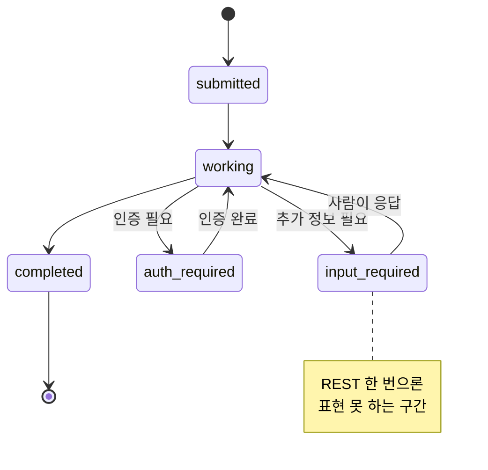
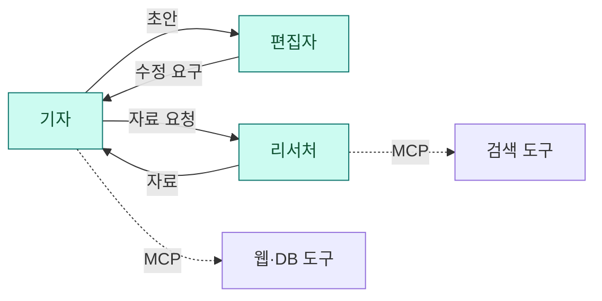
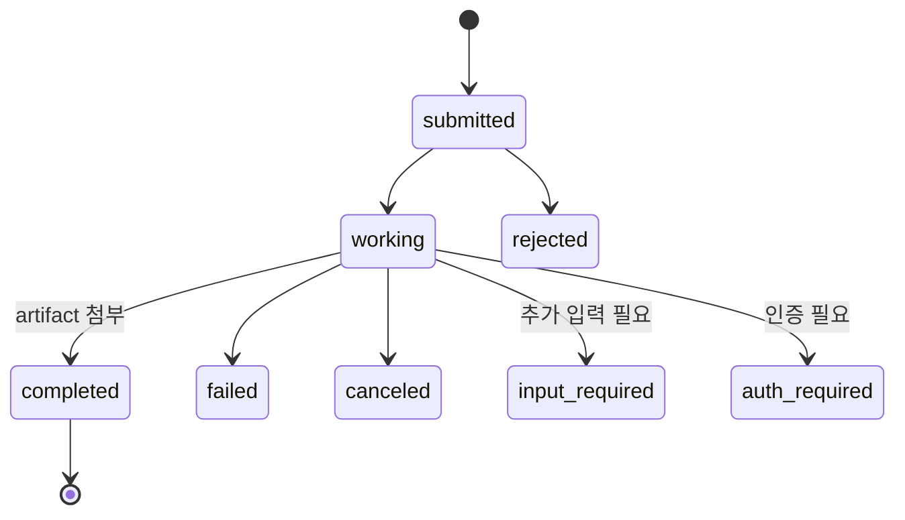
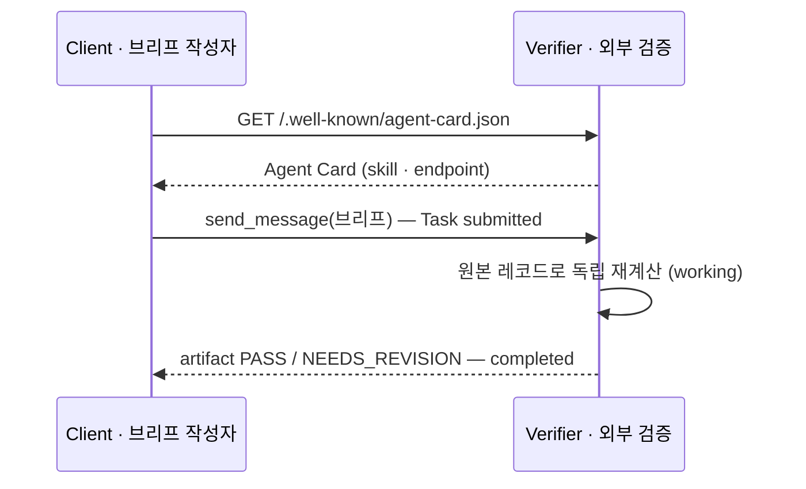
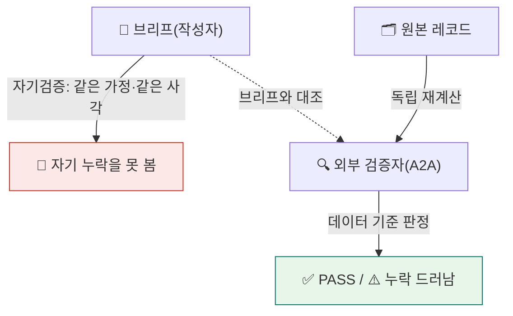

<div class="lec">
<div class="deck">

<section class="slide hero">
<div>
<div class="eyebrow">Chapter 5 · A2A 역할 분리</div>

# 밖에,<br>검증을 맡긴다

<p class="lead">브리프를 만든 같은 코드 경로가 다시 검증하면, 같은 가정 때문에 누락을 놓칠 수 있습니다.<br>
이 챕터에서 브리프를 외부 검증 에이전트에 A2A로 보냅니다. 그 에이전트는 Agent Card 메타데이터를 제공하고, 원본 레코드를 다시 계산해 PASS/NEEDS_REVISION을 답합니다.</p>

<div class="kicker">
<div class="metric"><span class="num">70</span><strong>분</strong><span>이론 36 · 핸즈온 28 · 점검 6</span><span class="clk">예상 15:00–16:10 · 앞 ☕10분</span></div>
<div class="metric"><span class="num">5</span><strong>번째 모듈</strong><span>a2a_verify.py</span></div>
<div class="metric"><span class="num">1</span><strong>검증된 브리프</strong><span>verified_brief.md</span></div>
</div>
</div>

<div class="board">
<div class="board-header"><span>이 챕터가 끝나면</span><span class="status-pill">산출물</span></div>
<div class="stack">
<div class="row"><div class="code">1</div><div class="copy"><strong>Agent Card 조회</strong><p>well-known 경로에서 상대 에이전트의 메타데이터와 skill 확인</p></div><div class="store">신원</div></div>
<div class="row"><div class="code">2</div><div class="copy"><strong>SendMessage</strong><p>브리프를 보내고 Task 라이프사이클로 결과</p></div><div class="store">통신</div></div>
<div class="row"><div class="code">3</div><div class="copy"><strong>verified_brief.md</strong><p>외부 검증을 거친 최종 브리프</p></div><div class="store">검증</div></div>
</div>
</div>
</section>

<section class="slide">
<div class="section-head">
<div>
<div class="eyebrow">1 · 경계 · 5분</div>

## 서브에이전트와 무엇이 다른가

</div>
<p class="section-note">Ch3의 서브에이전트는 같은 프로세스 안에서 일을 나눴습니다. 내가 만든 에이전트가 내 함수를 부르는 구조입니다.<br>
A2A는 그 경계를 넘습니다. 상대는 다른 프로세스, 어쩌면 다른 팀이 운영하는 에이전트입니다. 내가 그 내부를 모르고도 카드와 메시지로 협업합니다.</p>
</div>

<div class="grid-2">
<div class="panel"><div class="panel-head"><strong>서브에이전트 — 인프로세스</strong><span>Ch3</span></div><div class="panel-body"><div class="list">
<p>같은 프로세스, 내가 만든 도구를 위임</p>
<p>내부를 다 알고 직접 호출합니다</p>
<p>fan-out으로 내 일을 나누는 데 맞습니다</p>
</div></div></div>
<div class="panel"><div class="panel-head"><strong>A2A — 프로세스·팀 경계</strong><span>Ch5</span></div><div class="panel-body"><div class="list">
<p>다른 프로세스, 다른 팀의 에이전트</p>
<p>내부를 몰라도 카드와 메시지로 협업</p>
<p>외부 검증·외부 서비스 호출에 맞습니다</p>
</div></div></div>
</div>

<p class="section-note" style="margin-top:16px">검증을 같은 프로세스 안에서 하면 결국 내 코드가 내 코드를 봅니다. 독립성이 없습니다. 검증자를 프로세스 밖으로 빼야 외부 관점이 생깁니다. 그래서 A2A를 씁니다.</p>

<div class="board" style="margin-top:18px">
<div class="board-header"><span>위임의 세 고도 — 무엇을 물려받나</span><span class="status-pill">컨텍스트 상속</span></div>
<div class="panel-body">

<div class="grid-3">
<div class="panel"><div class="panel-head"><strong>일반 서브에이전트</strong><span>Ch3 · 인프로세스</span></div><div class="panel-body"><div class="list">
<p>부모 대화의 <strong>압축 요약</strong>만 상속</p>
<p>격리된 컨텍스트·단발 결과 — 싸고 백그라운드 가능, 디테일은 뭉개질 수 있음</p>
</div></div></div>
<div class="panel"><div class="panel-head"><strong>FORK</strong><span>Anthropic 2026 · 인프로세스</span></div><div class="panel-body"><div class="list">
<p><strong>전체 컨텍스트</strong>를 무손실 상속(캐시 할인가)</p>
<p>요약으로 잃기 쉬운 맥락 보존용. 단, 현재 <em>인터랙티브 전용</em> — 백그라운드 포크는 아직 미제공</p>
</div></div></div>
<div class="panel"><div class="panel-head"><strong>A2A</strong><span>Ch5 · 프로세스 밖</span></div><div class="panel-body"><div class="list">
<p>컨텍스트를 <strong>공유 안 함</strong>(불투명)</p>
<p>AgentCard(계약) + Task(생명주기) + 메시지로만 협업. 내부·도구·메모리 비공개</p>
</div></div></div>
</div>

<p class="section-note" style="margin-top:12px"><strong>고르는 기준</strong>: 내가 양쪽을 다 소유하고 도구·메모리를 싸게 나눠 쓰고 싶다 → 인프로세스(요약이면 일반 서브에이전트, 전체 맥락이 필요하면 FORK). 상대가 <em>다른 소유자·벤더·언어·신뢰 영역</em>이다 → A2A. 세 가지는 경쟁이 아니라 <em>같은 "위임"의 다른 고도</em>입니다.</p>

</div>
</div>

<div class="ask" style="margin-top:18px"><strong>생각해보기.</strong> Ch4에서 붙인 MCP와 이번 A2A는 뭐가 다를까요? 둘 다 "외부와 통신"인데.</div>

<details>
<summary>정답 확인</summary>
<div class="reveal">
<p><strong>MCP는 에이전트→도구</strong>입니다. 내 에이전트가 파일·DB·API 같은 <em>도구</em>를 끌어다 씁니다(Ch4 지식 베이스). <strong>A2A는 에이전트↔에이전트</strong>입니다. 상대도 자율로 판단하는 동급(peer) 에이전트라, 내가 그 내부를 모릅니다.</p>
<p>그래서 MCP엔 "도구 목록"이, A2A엔 "Agent Card(상대의 메타데이터와 skill 목록)"가 있습니다. 둘은 경쟁이 아니라 보완 관계입니다. 한 시스템이 MCP로 도구를 쓰면서 A2A로 다른 에이전트와 협업할 수 있습니다.</p>
</div>
</details>

</section>

<section class="slide">
<div class="section-head">
<div>
<div class="eyebrow">1 · 생애주기 · 5분</div>

## REST 한 번과 Task 생애주기

</div>
<p class="section-note">검증 요청처럼 단순한 1왕복은 REST로도 처리할 수 있습니다. A2A가 필요한 구간은 작업 상태, 추가 입력, 인증, 장기 실행처럼 요청과 응답 사이에 생애주기가 생길 때입니다.</p>
</div>

<div class="board" style="margin-top:18px">
<div class="board-header"><span>REST 한 번이면 되는데 왜 A2A인가</span><span class="status-pill">한 걸음 더</span></div>
<div class="panel-body"><div class="list">
<p>"검증 요청 보내고 결과 받기"는 REST 한 번으로도 구현할 수 있습니다. A2A가 필요한 요구사항은 세 가지입니다. ① <strong>멀티턴</strong>: 작업 도중 <code>input-required</code>(추가 정보)·<code>auth-required</code>(인증) 상태가 필요함. ② <strong>장기 Task</strong>: 몇 분~몇 시간 걸리는 작업을 <code>submitted→working→completed</code> 상태로 추적함. ③ <strong>능력 협상</strong>: Agent Card의 <code>skills</code>에 따라 요청 가능한 작업을 확인함.</p>
<p>그래서 A2A는 <em>도구 호출</em>이 아니라 <em>맡긴 일의 생애주기</em>를 표준화합니다. 우리 실습은 가장 단순한 <strong>블로킹 1왕복</strong>이라 이 중 일부만 씁니다. 장기 작업에서는 폴링, 스트리밍, 웹훅까지 같은 Task 모델로 확장합니다.</p>
<p class="section-note" style="margin-top:6px">이 장의 범위는 로컬 JSON-RPC 바인딩입니다. 표준 현황, 레지스트리, 카드 서명 같은 운영 주제는 참고 자료로 넘기고, 실습에서는 <strong>Agent Card 조회 → SendMessage 제출 → Task 결과 수신</strong>만 정확히 봅니다.</p>



</div></div>
</div>

<details class="deep">
<summary>🔬 심화 — "에이전트 간 협업"은 무엇이고, 언제 A2A인가 <span style="color:var(--muted)">(멀티에이전트)</span></summary>
<div class="reveal">
<p>우리 실습은 가장 단순한 <strong>1:1</strong>(애널리스트→검증자)만 보여 준다. A2A의 진짜 값은 <em>여러 에이전트가 주고받으며 반복</em>할 때 드러난다. 뉴스룸형 예 — 기자·리서처·편집자가 각각 독립 에이전트다:</p>



<p><strong>핵심은 상태가 있는 반복이다</strong> — 기자가 근거가 부족하면 리서처에게 자료를 다시 요청하고, 편집자가 수정을 요구하면 기자가 초안을 다시 고친다. 이 흐름은 단발 함수 호출(MCP <code>tools/call</code> 한 번)과 다르다. A2A는 <strong>Task 상태를 유지한 채 여러 메시지와 상태 갱신을 주고받는</strong> 통신 경로다.</p>
<table>
<thead><tr><th>이런 상황이면</th><th>쓰는 것</th></tr></thead>
<tbody>
<tr><td>두 컴포넌트가 <strong>협상·반복</strong>하고 작업 <strong>상태를 유지</strong>해야 한다</td><td><strong>A2A</strong></td></tr>
<tr><td>한 컴포넌트가 <strong>외부 도구·데이터에 접근</strong>한다(단발)</td><td><strong>MCP</strong></td></tr>
</tbody>
</table>
<p>그래서 한 시스템은 둘을 같이 쓴다 — 에이전트끼리는 A2A로 협업하고, 각 에이전트는 자기 도구를 MCP로 쓴다(위 점선). 우리 검증자도 내부적으로 레코드(데이터)에 닿지만, 애널리스트와의 <em>사이</em>는 A2A다.</p>
<p class="muted"><strong>핵심 정리</strong> — "협상·반복·상태유지가 필요하면 A2A, 도구·데이터 접근이면 MCP. 우리 1:1은 A2A의 가장 단순한 형태이고, 본격적인 쓰임은 여러 에이전트의 <em>양방향 반복</em>이다." 지금은 1왕복 실습으로 충분하고, 이 그림은 단순 함수 호출과 A2A의 차이를 보여 줍니다.</p>
</div>
</details>
</section>

<section class="slide">
<div class="section-head">
<div>
<div class="eyebrow">2 · 신원 · 7분</div>

## Agent Card — 메타데이터와 skill 목록

</div>
<p class="section-note">A2A 에이전트는 well-known 경로에 Agent Card를 제공합니다. 카드에는 이름, 버전, 제공 skill, 요청 엔드포인트가 담깁니다.<br>
상대를 부르기 전에 이 카드를 먼저 읽습니다. 우리는 가장 단순한 well-known URI(<code>/.well-known/agent-card.json</code>)를 씁니다. 프로덕션에서는 카드 서명, 레지스트리, 도메인 바인딩까지 보지만 이 실습 코드는 서명 없는 로컬 카드만 다룹니다.</p>
<p class="section-note" style="margin-top:14px"><strong>신뢰 경계가 다르면 위험도 따라옵니다.</strong> 이 실습은 같은 소유자의 로컬 에이전트라 단순합니다. 다른 벤더를 붙일 때는 카드 검증, 순환 호출 제한, 받은 메시지를 그대로 실행하지 않는 방어가 추가로 필요합니다.</p>
</div>

<div class="panel">
<div class="panel-head"><strong>GET /.well-known/agent-card.json</strong><span>검증 에이전트의 메타데이터</span></div>
<div class="panel-body">

```json
{
  "name": "세무·정합성 검증 에이전트",
  "description": "제출된 인박스 브리프를 분류 레코드와 대사해 누락·불일치를 검증한다.",
  "supportedInterfaces": [{ "url": "http://localhost:9610",
                            "protocolBinding": "JSONRPC", "protocolVersion": "1.0" }],
  "version": "1.0.0",
  "capabilities": { "streaming": false },
  "defaultInputModes": ["text/plain"],
  "defaultOutputModes": ["text/plain"],
  "skills": [{ "id": "verify-brief", "name": "브리프 검증",
              "description": "브리프의 '짚을 점'이 실제 레코드와 맞는지 독립 재계산으로 확인한다.",
              "tags": ["verify", "reconcile", "audit"],
              "examples": ["이 브리프를 검증해줘", "짚을 점이 빠지지 않았는지 확인"] }]
}
```

</div>
</div>

<p class="section-note" style="margin-top:16px">위 JSON은 <code>AgentCard</code> 타입을 직렬화한 결과입니다. 코드에선 <code>AgentCard(...)</code>로 만들어 스키마를 맞추고, JSON을 손으로 쓰지 않습니다(필드가 <code>camelCase</code>인 건 a2a 1.x가 protobuf 타입이라 JSON 직렬화 시 그렇게 매핑되기 때문 — 코드의 snake_case 필드가 wire에선 <code>supportedInterfaces</code>처럼 바뀝니다).</p>

<div class="cue do" style="margin-top:16px">
<div class="cue-head"><span class="cue-label">✋ 직접 해보기</span><span class="cue-time">~2분</span></div>
<div class="cue-body"><code>uv run python3 ch5-a2a/a2a_verify.py --card</code> 를 실행하세요(키·서버 불필요). 위 Agent Card JSON이 <em>실제 카드 타입에서</em> 그대로 나오고, 이어서 <code>SendMessageRequest(Message(parts=[Part(text=…)]), configuration=SendMessageConfiguration(return_immediately=False))</code> 본문과 Task 상태 흐름(SUBMITTED→WORKING→COMPLETED)까지 한 번에 출력됩니다. 서버를 띄우면 같은 카드가 <code>localhost:9610/.well-known/agent-card.json</code>으로도 열립니다(핸즈온 ② 스텝 b).</div>
</div>
</section>

<section class="slide">
<div class="section-head">
<div>
<div class="eyebrow">3 · 통신 · 6분</div>

## SendMessage와 Task 라이프사이클

</div>
<p class="section-note">카드를 읽었으면 메시지를 보냅니다. 클라이언트가 <code>send_message</code>로 브리프를 싣고, 서버는 그 일을 하나의 Task로 받아 상태를 단계별로 올립니다.<br>
제출됨에서 작업 중으로, 결과를 아티팩트로 붙이고 완료로 닫습니다. 클라이언트는 그 마지막 결과를 읽습니다.</p>
</div>

<div class="panel">
<div class="panel-head"><strong>Task 상태머신 — 정상 경로와 갈림길</strong><span>submitted → working → completed</span></div>
<div class="panel-body">



</div>
</div>

<<< ../../ch5-a2a/a2a_verify.py#a2a-client{python}

<p class="section-note" style="margin-top:16px">함정 둘. ① <code>message_id</code>를 빼면 서버가 메시지를 식별 못 해 거절합니다. ② <code>send_message</code>는 <code>StreamResponse</code>를 그대로 흘려보냅니다(a2a-sdk 1.1.0은 <code>AsyncIterator[StreamResponse]</code>). 구버전·호환 경로에선 <code>(StreamResponse, …)</code> 튜플이 올 수도 있어 코드는 <code>resp[0] if isinstance(resp, tuple) else resp</code>로 벗기는 방어를 둡니다. <code>StreamResponse</code>는 <strong>oneof</strong>(task·message·status_update·artifact_update 중 하나만 설정)라, 설정된 필드만 골라 읽어야 합니다.</p>

<p class="section-note" style="margin-top:12px"><code>StreamResponse</code>의 이 네 필드는 모두 <strong>메시지형 oneof 멤버</strong>라 <code>HasField</code>가 예외 없이 <code>True</code>/<code>False</code>를 돌려줍니다(a2a-sdk 1.1.0 실측 — 미설정이면 전부 <code>False</code>). <code>HasField</code>가 <code>ValueError</code>를 내는 건 oneof가 아닌 proto3 <em>스칼라</em> 필드(presence 정보가 없음)를 물을 때뿐입니다. 아래 <code>_has()</code>는 그런 경우까지 대비한 <em>보수적 방어</em>이고, 여기서는 설정된 oneof 필드만 골라 텍스트를 모읍니다.</p>

<<< ../../ch5-a2a/a2a_verify.py#a2a-stream{python}

</section>

<section class="slide">
<div class="section-head">
<div>
<div class="eyebrow">3 · 결과 · 5분</div>

## 검증 왕복과 바인딩

</div>
<p class="section-note">클라이언트가 카드를 읽고 브리프를 제출하면, 검증자는 원본 레코드로 기대 항목을 다시 계산한 뒤 브리프의 상호명과 금액을 대조합니다. 이 실습은 JSON-RPC 바인딩의 블로킹 1왕복을 사용합니다.</p>
</div>

<div class="panel" style="margin-top:16px">
<div class="panel-head"><strong>한 번의 검증 왕복</strong><span>카드 조회 → 전송 → 결과 수신</span></div>
<div class="panel-body">



</div>
</div>

<div class="board" style="margin-top:18px">
<div class="board-header"><span>A2A 한눈에 — 바인딩·통신·상태</span><span class="status-pill">레퍼런스</span></div>
<div class="panel-body">

<div class="matrix" style="grid-template-columns:88px repeat(3,minmax(0,1fr))">
<div class="cell head">바인딩</div>
<div class="cell head">JSON-RPC</div>
<div class="cell head">gRPC</div>
<div class="cell head">REST</div>
<div class="cell axis">형식</div>
<div class="cell">JSON over HTTP</div>
<div class="cell">protobuf</div>
<div class="cell">HTTP + JSON</div>
<div class="cell axis">강점</div>
<div class="cell active">양방향 · 기본</div>
<div class="cell">고성능 스트리밍</div>
<div class="cell">curl 호환</div>
<div class="cell axis">적합</div>
<div class="cell active">범용 · 이 실습</div>
<div class="cell">내부 고throughput</div>
<div class="cell">간단한 통합</div>
</div>

<div class="legend">
<span class="lpill"><span class="ldot"></span>이 실습이 쓰는 길</span>
<span class="lpill"><span class="ldot blue"></span>대안 바인딩</span>
</div>

<div class="grid" style="grid-template-columns:1fr 1fr;gap:12px;margin-top:14px">
<div class="panel"><div class="panel-head"><strong>블로킹</strong><span>즉답</span></div><div class="panel-body"><div class="list"><p><code>SendMessageRequest</code>의 <code>configuration.return_immediately=false</code> — 완료까지 한 연결로 기다려 결과를 한 번에 받는다(우리 실습)</p></div></div></div>
<div class="panel"><div class="panel-head"><strong>폴링</strong><span>GetTask</span></div><div class="panel-body"><div class="list"><p>즉시 Task <code>id</code>만 받고, <code>GetTask</code>로 상태를 주기적으로 물어 완료를 기다린다(장기 작업)</p></div></div></div>
<div class="panel"><div class="panel-head"><strong>스트리밍</strong><span>SSE</span></div><div class="panel-body"><div class="list"><p>Server-Sent Events로 진행·부분 결과를 실시간으로 흘려받는다</p></div></div></div>
<div class="panel"><div class="panel-head"><strong>웹훅</strong><span>pushNotification</span></div><div class="panel-body"><div class="list"><p>완료 시 상대가 내 콜백 URL로 POST — 연결을 붙들 필요 없이 통지받는다</p></div></div></div>
</div>
<p class="section-note" style="margin-top:10px">같은 <code>SendMessage</code>가 <code>return_immediately</code> 설정으로 블로킹↔폴링을 오갑니다. 작업이 길수록 폴링·스트리밍·웹훅으로 올라갑니다 — 우리는 1왕복이라 블로킹으로 충분합니다.</p>
<div class="list" style="margin-top:12px">
<p><strong>Task 상태</strong> — <code>submitted→working→completed</code>가 정상 경로. 그 외 <strong>failed·canceled·rejected·input-required·auth-required</strong>로 끝나거나 멈춥니다(위 상태머신).</p>
<p><strong>메시지의 콘텐츠 단위는 Part</strong> — 한 메시지/아티팩트는 <code>Part</code> 여러 개의 묶음이고, <code>Part</code> 하나엔 <code>text</code>(글)·<code>url</code>(파일 링크)·<code>raw</code>(파일 바이트)·<code>data</code>(구조화 JSON) 중 <em>하나</em>가 담깁니다(+ <code>filename</code>·<code>media_type</code>). 우리는 브리프를 <code>Part(text=…)</code> 하나로 보내지만, 이 구조라 텍스트+이미지+JSON을 한 메시지에 실어 보내는 멀티모달이 가능합니다. <span style="color:var(--muted)">(A2A v1.0이 옛 <code>TextPart</code>/<code>FilePart</code>/<code>DataPart</code> 래퍼를 없애고 단일 <code>Part</code>로 통합했습니다 — 코드의 <code>Part(text=…)</code>가 그 통합형입니다.)</span></p>
</div>
</div>
</div>

<details class="deep">
<summary>🔬 심화 — A2A 한 왕복을 서버·클라이언트 양쪽 코드로 <span style="color:var(--muted)">(우리 모듈 기준)</span></summary>
<div class="reveal">
<p><strong>서버(<code>verifier_agent.py</code>)</strong> — 핵심은 <code>AgentExecutor.execute</code> 하나다. <code>DefaultRequestHandler(executor, task_store, card)</code>가 그걸 감싸고, <code>create_agent_card_routes</code>(<code>/.well-known/agent-card.json</code>)+<code>create_jsonrpc_routes(rpc_url="/", enable_v0_3_compat=True)</code>를 <code>Starlette</code>에 얹어 <code>uvicorn</code>으로 띄운다. <code>execute</code> 안의 순서가 곧 Task 라이프사이클이다: <code>get_user_input()</code>(브리프) → <strong><code>enqueue_event(Task(state=SUBMITTED))</code> 먼저</strong> → <code>TaskUpdater.start_work()</code>(WORKING) → <code>verify_brief</code>(독립 재계산) → <code>add_artifact(verdict)</code> → <code>complete()</code>(COMPLETED). <em>Task를 먼저 등록</em>해야 하는 건, 클라이언트가 추적할 대상(id)이 없으면 이후 상태 갱신이 갈 곳을 잃기 때문 — 어기면 <code>InvalidAgentResponseError</code>(핸즈온 ①의 깨뜨리기).</p>
<p><strong>클라이언트(<code>a2a_verify.py</code>)</strong> — <code>A2ACardResolver(base_url).get_agent_card()</code>로 <em>먼저 카드를 읽어</em> endpoint와 skill을 확인 → <code>ClientFactory(config).create(card)</code>로 그 카드에 맞는 클라이언트를 만든다 → <code>send_message(SendMessageRequest(Message(role, parts=[Part(text=brief)]), configuration=SendMessageConfiguration(return_immediately=False)))</code>로 제출 → 돌아오는 <code>StreamResponse</code>(task·message·status_update·artifact_update)를 <code>async for</code>로 훑는다. 구현은 여러 필드에서 텍스트를 안전하게 모은 뒤 진행 메시지를 제외하고 verdict 본문만 남긴다. <code>--mock</code>은 네트워크 전송 대신 <code>verify_brief</code>를 직접 부른다. 검증 로직은 같고 호출 경로만 다르므로 장애·오프라인 보조 경로로 쓴다.</p>
<p><strong>wire</strong> — a2a 1.x 타입은 protobuf라 JSON 직렬화 시 필드가 <code>camelCase</code>가 된다(코드의 <code>supported_interfaces</code> → 카드 JSON의 <code>supportedInterfaces</code>). <code>enable_v0_3_compat=True</code>는 v1.0 서버가 옛 v0.3 클라이언트도 받게 하는 <strong>버전 협상</strong>이다. <code>--card</code>로 카드와 <code>SendMessageRequest</code> 본문 구조를 직접 확인할 수 있다.</p>
<p class="muted"><strong>핵심 정리</strong> — "A2A = ① 카드로 발견 → ② <code>SendMessage</code>로 제출 → ③ Task 상태로 추적. 서버는 <em>Task부터 등록</em>하고, 클라이언트는 <em>카드부터 읽는다</em>." 지금은 <code>--card</code>(원리)와 스텝 a/b/c(실통신·독립서빙·오프라인)를 보면 충분합니다.</p>
</div>
</details>
</section>

<section class="slide">
<div class="section-head">
<div>
<div class="eyebrow">4 · 제공 모듈 · 8분</div>

## 검증자는 독립으로 다시 센다

</div>
<p class="section-note">검증 에이전트는 과정에서 제공 모듈로 주어집니다. 재현성을 위해 모델 없이 규칙으로 동작합니다.<br>
핵심은 독립 재계산입니다. 브리프의 문장을 믿지 않고, 분류 레코드에서 영수증 없는 거래를 처음부터 다시 셉니다. 그 결과와 브리프가 맞는지 봅니다.</p>
</div>

<div class="panel">
<div class="panel-head"><strong>verifier_agent.py — verify_brief</strong><span>편향 없는 재계산</span></div>
<div class="panel-body">

<<< ../../ch5-a2a/verifier_agent.py#verify-brief{python}

</div>
</div>

<p class="section-note" style="margin-top:16px">검증자가 다시 세어도 쿠팡 89,000원과 넷플릭스 17,000원이 나옵니다. 브리프가 둘 다 짚었으면 통과입니다. 여기서 독립성은 <strong>프로세스와 판정 경계</strong>입니다. 검증자는 별도 A2A 서버로 뜨지만, 실습 단순화를 위해 레코드 로딩과 금액 매칭 helper는 Ch3와 공유합니다. 실무에서는 검증자가 자체 대사 로직과 테스트셋을 갖는 편이 더 강합니다.</p>

<p class="section-note" style="margin-top:10px"><strong>한 발 더 — 이 검증의 남은 구멍.</strong> 검증자는 레코드에서 '영수증 없는 거래'(쿠팡 89,000·넷플릭스 17,000)를 다시 계산한 뒤, 브리프에 <strong>상호명과 금액</strong>이 모두 있는지 대조합니다. 그래서 "쿠팡(주) <strong>5원</strong>"처럼 금액을 틀리면 통과하지 않습니다. 다만 여전히 단순 문자열 대조라 동의어·오타·문장형 표현에는 약합니다. 실무 검증자는 여기서 금액 허용오차, 상호명 정규화, 날짜까지 포함한 다중키 또는 LLM 판정으로 보강합니다.</p>

<div class="board" style="margin-top:18px">
<div class="board-header"><span>왜 독립 검증인가</span><span class="status-pill">설계 근거</span></div>
<div class="panel-body"><div class="list">
<p>Ch1에서 봤듯, 평가가 "모름"보다 <strong>자신 있는 추측을 보상</strong>해 모델이 단정하는 습관이 남습니다(Kalai). 브리프를 쓴 모델에게 "맞아?"라고 다시 물으면, 같은 가정·같은 사각을 공유해 자기 누락을 잘 못 봅니다.</p>
<p>그래서 검증자는 브리프 문장을 그대로 믿지 않고, 원본 레코드에서 기대 항목을 처음부터 다시 셉니다. 그다음 브리프 텍스트에 그 상호명과 금액이 함께 들어 있는지 대조합니다. 판정 기준이 "내가 쓴 글"이 아니라 "데이터에서 다시 계산한 기대값"이라, 글쓴이의 사각이 드러납니다. 프로세스를 분리(A2A)하는 건 이 검증 경계를 코드 수준에서 강제하는 장치입니다.</p>



</div></div>
</div>
</section>

<section class="slide">
<div class="section-head">
<div>
<div class="eyebrow">핸즈온 ① · 코드 정독 · 8분</div>

## 서버가 요청을 받는 자리

</div>
<p class="section-note">A2A 서버의 핵심은 <code>AgentExecutor.execute</code> 하나입니다. 들어온 메시지에서 브리프를 꺼내 검증하고, Task로 결과를 돌려줍니다. 중요한 규칙은 하나입니다. 상태를 갱신하기 전에 Task를 먼저 등록해야 합니다.<br><span style="color:var(--muted)">코드의 <code>create_jsonrpc_routes(..., enable_v0_3_compat=True)</code>가 바로 <strong>버전 협상</strong>입니다 — v1.0 서버가 옛 v0.3 클라이언트도 받아 주도록 하위호환을 켭니다. 스펙이 빠르게 진화하는 동안 구·신 에이전트가 섞여도 통신이 끊기지 않게 하는 장치예요.</span></p>
</div>

<div class="panel">
<div class="panel-head"><strong>ch5-a2a/verifier_agent.py — execute</strong><span>요청 → 검증 → 결과</span></div>
<div class="panel-body">

<<< ../../ch5-a2a/verifier_agent.py#execute{python}

<p class="section-note" style="margin-top:12px">읽는 순서 — <strong>①</strong> <code>get_user_input()</code>로 들어온 브리프 텍스트를 꺼낸다 → <strong>②</strong> <code>enqueue_event(Task(state=SUBMITTED))</code>로 <em>상태 갱신 전에 Task를 먼저 등록</em>(A2A 규칙) → <strong>③</strong> <code>start_work()</code>로 WORKING 상태를 알린다 → <strong>④</strong> <code>verify_brief</code>로 독립 재계산 → <code>add_artifact(verdict)</code> → <code>complete()</code>로 상태를 단계로 올립니다.</p>

</div>
</div>

<div class="grid-2" style="margin-top:16px">
<div class="panel"><div class="panel-head"><strong>a2a-sdk 1.1+ 서버 골격</strong></div><div class="panel-body"><div class="list">
<p><code>AgentExecutor</code> 구현 → <code>DefaultRequestHandler</code>(+Card·TaskStore) → <code>create_*_routes</code> → Starlette → uvicorn.</p>
<p>이 순서가 이 레포 lockfile로 해석되는 a2a-sdk 1.1+ 서버의 표준 골격입니다.</p>
</div></div></div>
<div class="panel"><div class="panel-head"><strong>왜 Task를 먼저 등록하나</strong></div><div class="panel-body"><div class="list">
<p>A2A는 "Task 없이 상태 갱신 먼저"를 금지합니다. 클라이언트가 추적할 대상이 없기 때문입니다.</p>
<p>순서를 어기면 <code>InvalidAgentResponseError</code>가 납니다. 실습에서 직접 확인할 오류입니다.</p>
</div></div></div>
</div>

<div class="cue solve" style="margin-top:18px">
<div class="cue-head"><span class="cue-label">✏️ 깨뜨려 보기 — 안전한 플래그</span><span class="cue-time">~5분</span></div>
<div class="cue-body">규칙을 직접 어겨 봅니다. <span style="color:var(--muted)">(먼저 아래 <strong>핸즈온 ②</strong>의 a·b를 한 번 돌려 정상 <code>PASS</code>를 본 뒤 여기로 돌아오면 흐름이 자연스럽습니다.)</span> 별도 터미널에서 <code>A2A_BREAK_TASK_ORDER=1 uv run python3 ch5-a2a/verifier_agent.py</code>로 서버를 띄운 뒤, 다른 터미널에서 <code>uv run python3 ch5-a2a/a2a_verify.py --draft</code>를 실행하세요. <strong><code>--serve</code>를 붙이면 정상 서버를 새로 띄워 이 실패 실험이 무효가 됩니다.</strong> 서버가 Task 등록을 건너뛰어 <code>updater.start_work(...)</code>에서 <code>InvalidAgentResponseError</code>로 막힙니다. 터미널을 종료하면 원래 코드로 돌아갑니다.</div>
</div>
</section>

<section class="slide">
<div class="section-head">
<div>
<div class="eyebrow">핸즈온 ② · 단계별 실행 · 20분</div>

## 띄우고, 보내고, 받는다

</div>
<p class="section-note">기본 경로는 Ch4가 만든 live 브리프를 실제 A2A 서버로 보내는 것입니다. 네트워크 없이 검증 로직만 분리 확인할 때만 mock을 씁니다.</p>
</div>

<div class="stack">
<div class="row"><div class="code">0</div><div class="copy"><strong>먼저 — live 브리프를 만든다</strong><p><code>uv run python3 ch2-langgraph-agent/intake_graph.py</code><br><code>uv run python3 ch3-deepagents/research_orchestrator.py</code><br><code>uv run python3 ch4-skills-mcp/okf_store.py</code><br><code>uv run python3 ch4-skills-mcp/skill_agent.py --run</code><br><span style="color:var(--muted)">수업 기본 입력은 LLM API가 만든 <code>workspace/brief.md</code>입니다. 키·네트워크 장애 때만 Ch2/Ch3 <code>--mock</code>과 Ch4 <code>--offline</code>으로 같은 파일 계약을 보조 확인합니다.</span></p></div><div class="store">선행</div></div>
<div class="row"><div class="code">a</div><div class="copy"><strong>한 번에 — 자동 기동 + 검증</strong><p><code>uv run python3 ch5-a2a/a2a_verify.py --serve</code><br><span style="color:var(--muted)"><strong>증명:</strong> 두 프로세스가 well-known 카드 조회 + JSON-RPC로 <em>실제로</em> 통신한다. 성공 기준: <code>Agent Card: 세무·정합성 검증 에이전트</code> → <code>검증 결과 수신 (A2A)</code> → verified_brief.md. Ch3 초안만 제출하는 보조 실험에서는 <code>--draft</code>를 붙입니다.</span></p></div><div class="store">A2A</div></div>
<div class="row"><div class="code">b</div><div class="copy"><strong>따로 — 서버 먼저(다른 터미널)</strong><p><code>uv run python3 ch5-a2a/verifier_agent.py</code> 후 <code>uv run python3 ch5-a2a/a2a_verify.py</code><br><span style="color:var(--muted)"><strong>증명:</strong> 검증자는 <em>별도 프로세스</em>로 독립 서빙된다 — 카드가 브라우저에서 직접 200으로 열린다. 성공 기준: 브라우저로 <code>localhost:9610/.well-known/agent-card.json</code> 카드가 보인다.</span></p></div><div class="store">서버</div></div>
<div class="row"><div class="code">c</div><div class="copy"><strong>오프라인 — 네트워크 없이</strong><p><code>uv run python3 ch5-a2a/a2a_verify.py --mock --draft</code><br><span style="color:var(--muted)"><strong>증명:</strong> 검증 <em>로직</em>은 네트워크와 무관하다 — A2A를 떼도 같은 <code>verified_brief.md</code>가 나온다(전송만 바뀜). 성공 기준: 같은 PASS 결과가 네트워크 없이 나온다.</span></p></div><div class="store">직접</div></div>
</div>

<div class="cue do">
<div class="cue-head"><span class="cue-label">✋ 직접 해보기</span><span class="cue-time">~5분</span></div>
<div class="cue-body">검증 에이전트(A2A 서버)를 띄우고 클라이언트가 브리프를 보냅니다. <code>b</code> 방식으로 다른 터미널에서 <code>verifier_agent.py</code>를 먼저 올린 뒤 <code>a2a_verify.py</code>를 실행하세요. 두 프로세스가 HTTP로 연결되는지가 핵심입니다.</div>
</div>

<div class="cue wait">
<div class="cue-head"><span class="cue-label">⏳ 기다렸다 확인</span><span class="cue-time">~2분</span></div>
<div class="cue-body">클라이언트가 서버의 HTTP 응답을 기다립니다. 검증 결과 아티팩트가 돌아오면 <code>검증 결과 수신 (A2A)</code>과 함께 판정이 <code>PASS</code>인지 <code>NEEDS_REVISION</code>인지 확인하세요. 아래 출력의 마지막 두 줄이 그 응답입니다.</div>
</div>

<div class="panel" style="margin-top:18px">
<div class="panel-head"><strong>내 화면에 뜨는 것 — 콘솔과 결과 파일</strong><span>A2A 기준</span></div>
<div class="panel-body">

```text
# 콘솔 (스텝 a · --serve, 실제 A2A)
▶ 브리프 제출 → 외부 검증 에이전트
  Agent Card: 세무·정합성 검증 에이전트 (skill: verify-brief)
  검증 결과 수신 (A2A)
  검증 판정: PASS
  → workspace/verified_brief.md

# 결과 파일 끝부분 (cat workspace/verified_brief.md)
## 외부 검증 결과 — PASS
검증 주체: 세무·정합성 검증 에이전트 (A2A)

- 독립 재계산: 영수증 없는 거래 2건 (쿠팡(주) 89,000원, 넷플릭스 17,000원)
- 누락 항목 없음 — 검증 통과
```

</div>
</div>

<div class="cue solve" style="margin-top:18px">
<div class="cue-head"><span class="cue-label">✏️ 풀어보기</span><span class="cue-time">~5분</span></div>
<div class="cue-body">두 가지를 해보세요. 원본 <code>brief.md</code> 대신 <code>workspace/brief_draft.md</code> 복사본을 고치고 <code>--draft</code>로 보냅니다. ① 브리프에서 "쿠팡" 줄을 <strong>지우고</strong> 보내면? ② 줄은 두되 금액만 "쿠팡(주) <strong>5원</strong>"으로 <strong>틀리게 바꿔</strong> 보내면? 둘 다 실제로 고쳐 보내고 결과를 비교하세요.</div>
</div>

<details>
<summary>정답 확인</summary>
<div class="reveal">
<p>① <strong>지우면 <code>NEEDS_REVISION</code></strong>. 검증자는 브리프 문장을 믿지 않고 레코드에서 직접 다시 세기 때문에, 쿠팡 89,000원이 빠진 걸 잡아냅니다(<code>브리프가 누락했거나 금액을 틀린 항목: 쿠팡(주) — 보완 필요</code>).</p>
<p>② <strong>금액만 틀리게 바꿔도 <code>NEEDS_REVISION</code></strong>. 검증자가 레코드에서 다시 계산한 89,000원과 브리프의 금액 표기를 함께 대조하기 때문입니다. 같은 항목이라도 상호명만 맞고 금액이 틀리면 검증을 통과하지 않습니다.</p>
<p>외부 검증의 목적은 작성한 문장이 아니라 원천 데이터를 기준으로 다시 판정하는 것입니다. 다만 문자열 기반 대조라 동의어·오타·날짜 오차에는 여전히 약합니다. 실무에서는 상호명 정규화와 금액·날짜 다중키까지 넣어 검증 키를 강화합니다.</p>
</div>
</details>
</section>

<section class="slide">
<div class="section-head">
<div>
<div class="eyebrow">핸즈온 ③ · 트러블슈팅 · 참고</div>

## 막히면 여기부터

</div>
<p class="section-note">A2A는 대부분 포트·기동 타이밍·응답 순서 문제입니다.</p>
</div>

<div class="grid-2">
<div class="panel"><div class="panel-head"><strong>Connection refused</strong><span>기동</span></div><div class="panel-body"><div class="list">
<p>검증 에이전트가 아직 안 떴습니다. <code>--serve</code>는 기동을 기다렸다 보내지만, 따로 띄울 땐 서버가 먼저 올라온 뒤 클라이언트를 실행하세요.</p>
</div></div></div>
<div class="panel"><div class="panel-head"><strong>포트 9610 사용 중</strong><span>포트</span></div><div class="panel-body"><div class="list">
<p>이전 서버가 안 죽었습니다. 실행 중인 <code>verifier_agent.py</code> 프로세스를 Ctrl-C로 종료한 뒤 다시 띄웁니다.</p>
</div></div></div>
<div class="panel"><div class="panel-head"><strong>InvalidAgentResponseError</strong><span>응답 순서</span></div><div class="panel-body"><div class="list">
<p>상태 갱신 전에 Task를 먼저 enqueue해야 합니다(executor 순서). 고치면 클라이언트에 <code>검증 결과 수신 (A2A)</code>이 정상 출력됩니다.</p>
</div></div></div>
<div class="panel"><div class="panel-head"><strong>카드 조회 실패</strong><span>well-known</span></div><div class="panel-body"><div class="list">
<p><code>/.well-known/agent-card.json</code>이 200인지 브라우저로 먼저 확인합니다. 안 뜨면 서버가 안 올라온 겁니다.</p>
</div></div></div>
</div>
</section>

<section class="slide">
<div class="section-head">
<div>
<div class="eyebrow">스스로 점검 · 3분</div>

## 넘어가기 전에 — 경계와 검증

</div>
<p class="section-note">왜 검증을 다른 프로세스에 맡기는지, 이 검증자의 한계가 무엇인지 다섯 문항으로 짚습니다.</p>
</div>

<div class="board" style="margin-top:18px">
<div class="board-header"><span>스스로 점검</span><span class="status-pill">5문항</span></div>
<div class="panel-body"><div class="list">
<p><strong>Q1.</strong> 왜 브리프를 쓴 에이전트가 아니라 <em>별도</em> 에이전트에게 검증을 맡기나?</p>
<p><strong>Q2.</strong> Agent Card는 무엇이고, 상대를 부르기 전에 왜 먼저 읽나?</p>
<p><strong>Q3.</strong> 이 검증자의 남은 한계는? 브리프가 "쿠팡(주) 5원"처럼 금액을 틀리면 왜 이제 PASS가 나면 안 되는가?</p>
<p><strong>Q4.</strong> 서브에이전트(Ch3)·FORK·A2A 위임을 가르는 기준 한 줄.</p>
<p><strong>Q5.</strong> A2A 서버에서 상태를 갱신하기 전에 무엇을 먼저 해야 하고, 어기면?</p>
</div></div>
</div>

<details>
<summary>정답 확인</summary>
<div class="reveal">
<p><strong>A1.</strong> 작성자는 같은 가정·같은 사각을 공유해 자기 누락을 못 본다. 검증자를 다른 프로세스로 분리하면 판정 기준이 "내가 쓴 문장"이 아니라 "원본 레코드"가 되어 작성자의 사각이 드러난다. A2A는 이 독립성을 코드 수준에서 강제한다.</p>
<p><strong>A2.</strong> 이름·버전·skill·엔드포인트 메타데이터로 <code>/.well-known/agent-card.json</code>에 노출된다. 클라이언트가 요청 가능한 작업과 전송 위치를 확인한 뒤 통신을 시작하려고 먼저 읽는다.</p>
<p><strong>A3.</strong> 검증자는 레코드에서 기대 항목과 금액을 다시 계산하고, 브리프에 상호명과 금액이 함께 있는지 본다. 그래서 "쿠팡(주) 5원"은 NEEDS_REVISION이어야 한다. 남은 한계는 단순 문자열 대조라 동의어·오타·표기 변형에 약하다는 점이다.</p>
<p><strong>A4.</strong> 양쪽을 내가 소유하고 도구·메모리를 싸게 나눠 쓰면 인프로세스(요약이면 서브에이전트, 전체 맥락이면 FORK). 상대가 다른 소유자·벤더·신뢰 영역이면 A2A. 경쟁이 아니라 같은 위임의 다른 고도.</p>
<p><strong>A5.</strong> Task를 먼저 <code>enqueue_event(Task(...))</code>로 등록해야 한다 — 클라이언트가 추적할 대상이 없으면 안 되기 때문. 어기면 <code>InvalidAgentResponseError</code>가 난다.</p>
</div>
</details>
</section>

<section class="slide">
<div class="section-head">
<div>
<div class="eyebrow">마무리 · 3분</div>

## 다음 — 하나의 파이프라인으로 묶는다

</div>
<p class="section-note">이제 필요한 모듈이 모였습니다. 추출, 적재, 조사, 지식, 브리프, 외부 검증을 각각 따로 돌려 봤습니다.<br>
Ch6에서는 이 모듈들을 하나로 묶습니다. 샘플 메일 입력이 들어오면 분류부터 검증까지 이어지는 엔드투엔드를 배선합니다. 새로 짜지 않고 기존 모듈을 연결합니다.</p>
</div>

<div class="grid-3">
<div class="panel"><div class="panel-head"><strong>이번 챕터 결과</strong></div><div class="panel-body"><div class="list">
<p>A2A 외부 검증 클라이언트·제공 모듈</p>
<p>verified_brief.md</p>
</div></div></div>
<div class="panel"><div class="panel-head"><strong>Ch6에서 할 것</strong></div><div class="panel-body"><div class="list">
<p>샘플 메일 → 분류 → 조사 → 지식 → 브리프 → 검증</p>
<p>모듈 배선 · 엔드투엔드 1회</p>
</div></div></div>
<div class="panel"><div class="panel-head"><strong>최종 목적지</strong></div><div class="panel-body"><div class="list">
<p>인박스 입력 → 검증된 브리프</p>
<p>Ch6 통합 캡스톤</p>
</div></div></div>
</div>

<div class="board" style="margin-top:18px">
<div class="board-header"><span>참고 자료</span><span class="status-pill">출처</span></div>
<div class="panel-body"><div class="list">
<p><a href="https://a2a-protocol.org/">A2A Protocol</a> · <a href="https://github.com/a2aproject/a2a-python">a2a-python SDK</a></p>
<p><a href="https://a2a-protocol.org/latest/specification/">A2A 명세 — Agent Card · SendMessage · Task</a></p>
</div></div>
</div>
</section>


<nav class="chapnav">
<div class="board" style="margin-top:8px">
<div style="display:grid;grid-template-columns:1fr auto 1fr;gap:14px;align-items:center">
<a href="/deepagents-handson/chapters/chapter-4" style="color:inherit;text-decoration:none;font-weight:900;font-size:14px">← Ch4 · Skills · MCP · 지식</a>
<a href="/deepagents-handson/toc" style="color:var(--forest);text-decoration:none;font-weight:900;font-size:13px;background:rgba(148,210,189,.3);border:1px solid rgba(15,118,110,.24);border-radius:99px;padding:7px 16px">목차</a>
<a href="/deepagents-handson/chapters/chapter-6" style="color:inherit;text-decoration:none;font-weight:900;font-size:14px;text-align:right">Ch6 · 통합 캡스톤 →</a>
</div>
</div>
</nav>

</div>
</div>
