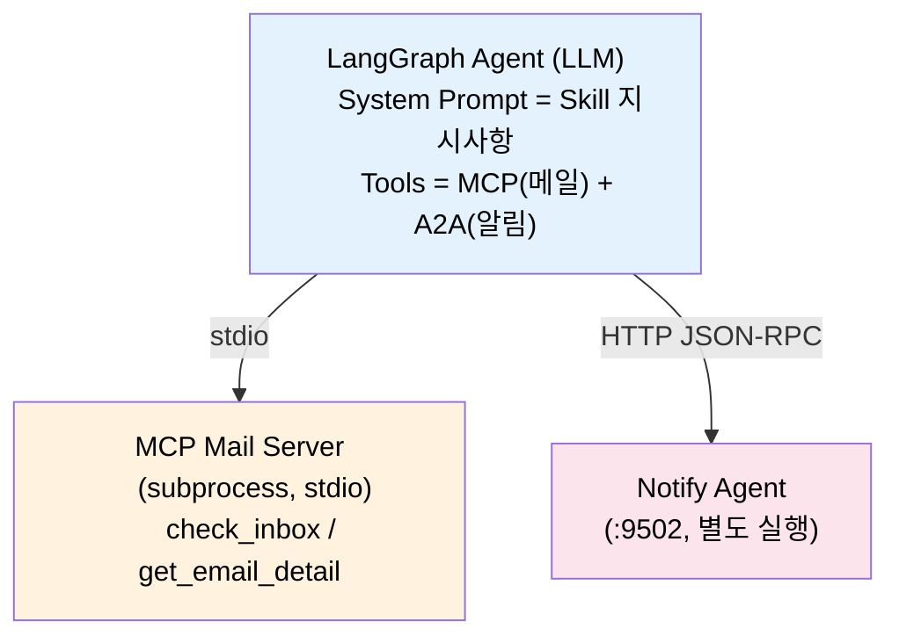
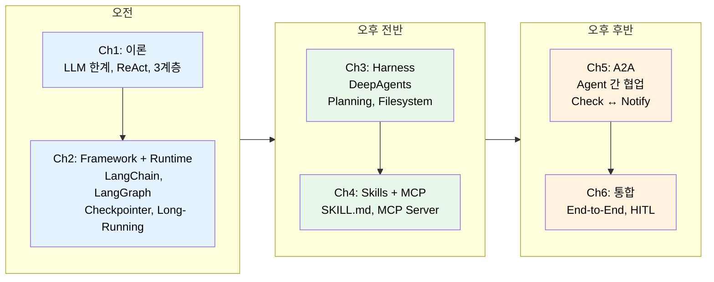

# Chapter 6. 통합 Demo & Wrap-up

> **학습 목표**
> - [ ] 전체 아키텍처를 하나의 흐름으로 이해하고 설명할 수 있다
> - [ ] HITL 확장 포인트를 이해하고 적용 방안을 제시할 수 있다
> - [ ] Ch1~Ch6의 기술 스택 계층(Framework → Runtime → Harness → Skills/MCP/A2A)을 설명할 수 있다

| 소요시간 | 학습방법 |
|---------|---------|
| 0.6h | 이론/실습 |

---

<p align="right"><sub style="color:gray">⏱ 17:15 – 시작</sub></p>

### 이 챕터의 출발점

Ch5에서 Check Agent와 Notify Agent를 A2A로 연결했습니다. 하지만 각 컴포넌트(Harness, Skills, MCP, A2A)를 개별적으로만 다뤘기 때문에, 전체가 하나의 시스템으로 동작하는 모습은 아직 보지 못했습니다.

이 챕터에서는 **모든 요소를 하나의 메일 Agent 시스템으로 통합**합니다. 먼저 Mock 데모로 전체 흐름을 파악한 뒤, **실제 LLM이 판단하는 통합 데모**를 실행합니다.

| 컴포넌트 | 출처 | 역할 |
|---------|------|------|
| LangGraph Agent | Ch2 | LLM → Tool → LLM 루프 |
| Skills (SKILL.md) | Ch4 | "inbox 확인 → 필터 → 요약 → 보고" 절차 안내 |
| MCP Mail Server | Ch4 | 메일 데이터 접근 (check_inbox, get_email_detail) |
| A2A (Notify Agent) | Ch5 | 중요 메일 알림 위임 |

그리고 프로덕션에서 반드시 필요한 **HITL(Human-in-the-Loop)** 확장 포인트도 함께 살펴봅니다.

<p align="right"><sub style="color:gray">⏱ 17:17</sub></p>

## 통합 데모: 메일 Agent End-to-End (18분)

### Step 1: Mock 데모로 전체 흐름 파악

> 📂 실습 코드: `ch6-integration/mail_agent_demo.py`
>
> ▶ 실행:
```
uv run python3 ch6-integration/mail_agent_demo.py
```

Mock 데모는 외부 서버 없이 **모든 컴포넌트를 Mock 클래스로 시뮬레이션**합니다. LLM 호출 없이 전체 아키텍처의 흐름을 먼저 이해하는 것이 목적입니다.

```
실행 결과 (요약):
━━━━━━━━━━━━━━━━━━━━━━━━

1. [Skills] SKILL.md 로드 → "inbox 확인 → 필터 → 요약" 절차
2. [MCP]    check_inbox() → 메일 6통 반환
3. [Check]  중요 메일 필터 → 3통 감지
4. [A2A]    Notify Agent에게 알림 전송
5. [Notify] 콘솔 알림 출력
```

각 단계가 어떤 기술에 해당하는지 확인합니다:

| 로그 태그 | 기술 계층 | 출처 |
|----------|----------|------|
| `[Skills]` | Skills (SKILL.md) | Ch4 |
| `[MCP]` | MCP (메일 데이터 접근) | Ch4 |
| `[Check]` | Agent 로직 (필터링) | Ch5 |
| `[A2A]` | A2A (Agent → Agent) | Ch5 |
| `[Notify]` | A2A Remote Agent | Ch5 |

> [!todo] 데모 출력을 따라가 볼까요? (2분)
> ```
> uv run python3 ch6-integration/mail_agent_demo.py
> ```
> 로그에서 위 태그를 찾아 각 단계가 어떤 계층에 해당하는지 매핑해 보세요.

### Step 2: LLM 통합 데모 — 실제 동작하는 Agent

Mock으로 흐름을 이해했으니, 이제 **실제 LLM이 판단하고 Tool을 호출하는 버전**을 실행합니다. 이 데모는 Ch2~Ch5에서 만든 실제 컴포넌트를 모두 연결합니다.

> 📂 실습 코드: `ch6-integration/mail_agent_demo_llm.py`

#### 아키텍처



각 컴포넌트가 어떤 챕터에서 왔는지 정리합니다:

| 컴포넌트 | 출처 | 연결 방식 |
|---------|------|----------|
| LangGraph Agent Loop | Ch2 | LLM → Tool → LLM → ... |
| Skills (SKILL.md) | Ch4 | 시스템 프롬프트에 주입 |
| MCP Mail Server | Ch4 | stdio subprocess (자동 기동) |
| Notify Agent (A2A) | Ch5 | httpx로 JSON-RPC 호출 |

#### 실행 방법

```bash
# 터미널 1: Notify Agent (Ch5에서 만든 그대로)
uv run python3 ch5-a2a/notify_agent.py

# 터미널 2: 통합 데모
uv run python3 ch6-integration/mail_agent_demo_llm.py
```

MCP 서버는 subprocess로 자동 기동되므로 별도 실행이 필요 없습니다.

#### 핵심 코드 구조

**1. Skill 로딩 → 시스템 프롬프트 구성**

Ch4의 `mail_skill/SKILL.md`를 읽어 LLM의 시스템 프롬프트에 주입합니다. LLM은 이 절차에 따라 Tool을 호출합니다.

```python
skill = load_skill("ch4-skills-mcp/mail_skill")
system_prompt = build_system_prompt(skill["instructions"])
# → "당신은 메일 관리 전문 에이전트입니다. ... <skill>inbox 확인 → 필터 → 요약</skill>"
```

**2. MCP 연결 → Tool 자동 등록**

`langchain-mcp-adapters`로 Ch4의 MCP 서버를 subprocess로 기동하고, Tool 목록을 자동으로 가져옵니다.

```python
from langchain_mcp_adapters.client import MultiServerMCPClient

client = MultiServerMCPClient({
    "mail": {
        "command": sys.executable,
        "args": ["ch4-skills-mcp/mcp_mail_server.py"],
        "transport": "stdio",
    }
})
mcp_tools = await client.get_tools()
# → [check_inbox, get_email_detail, search_emails]
```

**3. A2A 알림 → LangChain @tool로 래핑**

Ch5의 Notify Agent에게 httpx로 JSON-RPC 요청을 보내는 함수를, `@tool`로 감싸서 LLM이 직접 호출할 수 있게 합니다.

```python
@tool
async def notify_important_emails(summary: str) -> str:
    """Send alert for important emails via A2A to Notify Agent."""
    a2a_request = {
        "jsonrpc": "2.0",
        "method": "message/send",
        "params": {"message": {"role": "user", "parts": [{"kind": "text", "text": summary}]}},
    }
    async with httpx.AsyncClient(timeout=10.0) as client:
        response = await client.post("http://localhost:9502/", json=a2a_request)
    return f"알림 전송 완료 ({response.json()['result']['status']['state']})"
```

**4. LangGraph 조립 — Agent Loop**

Ch2에서 배운 LangGraph 패턴으로 LLM + Tool을 연결합니다.

```python
all_tools = mcp_tools + [notify_important_emails]  # MCP + A2A
llm_with_tools = llm.bind_tools(all_tools)

builder = StateGraph(MessagesState)
builder.add_node("agent", call_model)       # LLM 호출
builder.add_node("tools", ToolNode(all_tools))  # Tool 실행
builder.add_edge(START, "agent")
builder.add_conditional_edges("agent", tools_condition)
builder.add_edge("tools", "agent")
graph = builder.compile()
```

#### 동작 흐름

LLM이 시스템 프롬프트(Skill)의 지시에 따라 자율적으로 Tool을 선택·호출합니다:

```
[사용자] "메일함 확인하고 중요한 메일 요약해줘. 중요 메일이 있으면 알림도 보내줘."

[Agent → MCP Tool #1] check_inbox()          ← Skill 절차 Step 1
[Agent → MCP Tool #2] get_email_detail(1)     ← Skill 절차 Step 2
[Agent → MCP Tool #3] get_email_detail(3)
[Agent → MCP Tool #4] get_email_detail(5)
[Agent → A2A Tool #5] notify_important_emails("긴급 메일 3통: ...")  ← A2A 알림

[Agent 응답] 메일함 확인 결과를 보고합니다...   ← Skill 절차 Step 3 (보고)
```

Mock 데모와 비교하면, 같은 흐름이지만 **LLM이 각 단계를 스스로 판단**합니다. 어떤 메일이 중요한지, 몇 통의 상세를 조회할지, 알림 요약을 어떻게 구성할지를 LLM이 결정합니다.

> [!todo] LLM 데모를 실행해 볼까요? (5분)
> 터미널 2개를 열고 위 실행 방법대로 실행하세요.
>
> 확인 포인트:
> 1. MCP Tool과 A2A Tool이 각각 몇 번 호출되었는지
> 2. LLM이 Skill 절차(inbox 확인 → 필터 → 요약 → 보고)를 따르고 있는지
> 3. Notify Agent 터미널에 알림이 실제로 출력되는지

---

### Checkpoint: 통합 아키텍처 확인

1. LLM 데모에서 Skills는 어떤 방식으로 Agent에 전달됩니까? MCP Tool과 어떻게 다릅니까?
2. `notify_important_emails`은 MCP Tool인가요, A2A Tool인가요? 구분 기준은 무엇입니까?
3. MCP 서버는 어떤 transport로 연결되며, 별도 실행이 필요합니까?

*먼저 직접 생각한 뒤, 아래 정답을 확인하세요.*

---

**정답:**
1. **Skills**는 SKILL.md 파일을 읽어 **시스템 프롬프트에 텍스트로 주입**합니다. MCP Tool은 LLM이 호출하는 함수(Tool)로 등록됩니다. Skills = "어떤 순서로 할 것인가"(절차 안내), MCP = "데이터를 어디서 가져올 것인가"(데이터 접근).
2. **A2A Tool**입니다. httpx로 Notify Agent(localhost:9502)에 JSON-RPC 요청을 보내는 Agent→Agent 통신입니다. MCP Tool(check_inbox 등)은 Agent→서버(데이터) 접근입니다. 구분 기준: **수평 통신(Agent↔Agent) = A2A**, **수직 접근(Agent→데이터) = MCP**.
3. **stdio** transport로 연결됩니다. `MultiServerMCPClient`가 subprocess로 MCP 서버를 자동 기동하므로 별도 실행이 필요 없습니다.

---

<p align="right"><sub style="color:gray">⏱ 17:35</sub></p>

## HITL 확장 포인트 + Wrap-up (15분)

### interrupt_before로 사람 승인 추가

LangGraph는 `interrupt_before` 파라미터로 특정 노드 실행 전 사람 승인을 요구할 수 있습니다. 방금 실행한 LLM 데모에 HITL을 추가하면 다음과 같습니다:

```python
# mail_agent_demo_llm.py의 graph 구성 부분에서:
graph = builder.compile(
    checkpointer=MemorySaver(),          # 상태 저장 필수 (interrupt 후 재개에 필요)
    interrupt_before=["tools"],           # Tool 실행 전 사람 승인 요구
)
```

`interrupt_before=["tools"]`를 설정하면, LLM이 Tool 호출을 결정한 시점에서 실행이 멈추고 사람의 확인을 기다립니다. 특히 `notify_important_emails`처럼 외부 시스템에 영향을 주는 Tool에서 유용합니다.

```python
from langgraph.checkpoint.memory import MemorySaver
from langgraph.types import Command

config = {"configurable": {"thread_id": "hitl-demo"}}

# 1) 첫 실행: Tool 호출 직전에 멈춤
result = await graph.ainvoke({"messages": [HumanMessage(content="메일 확인해줘")]}, config)
# → LLM이 check_inbox Tool 호출을 결정했지만, 실행 전 멈춤

# 2) 사람이 승인 → Tool 실행 후 다음 단계로
result = await graph.ainvoke(Command(resume=None), config=config)
```

어떤 Tool에 HITL이 필요한지 판단하는 기준:

| Tool | 부작용 | HITL 필요? |
|------|--------|-----------|
| `check_inbox` | 없음 (읽기 전용) | 불필요 |
| `get_email_detail` | 없음 (읽기 전용) | 불필요 |
| `notify_important_emails` | 외부 알림 전송 | **필요** |
| `forward_email` (가상) | 메일 발송 | **필요** |

### 프로덕션 적용 시 고려사항

| 항목                | 오늘 실습                 | 프로덕션                     |
| ----------------- | --------------------- | ------------------------ |
| **Checkpointer**  | MemorySaver (메모리)     | PostgresSaver            |
| **MCP Transport** | stdio (subprocess)    | Streamable HTTP          |
| **A2A**           | localhost:9502        | 쿠버네티스 서비스 디스커버리          |
| **모니터링**          | 콘솔 로그                 | LangFuse / LangSmith     |
| **인증**            | 없음                    | OAuth2 / API Key         |
| **HITL**          | interrupt_before (콘솔) | 슬랙 버튼 / 웹 UI             |
| **스케줄링**          | 수동 실행                 | Celery / Cloud Scheduler |

---

<p align="right"><sub style="color:gray">⏱ 17:42</sub></p>

## Wrap-up

### Framework → Runtime → Harness 여정 복습



핵심 전환:
> LangChain(Framework) → LangGraph(Runtime) → DeepAgents(Harness)
> **"도구" → "작업 공정" → "현장 관리자"**

### 오늘 배운 기술 스택 총정리

| 계층 | 기술 | 역할 | Chapter |
|------|------|------|---------|
| **Framework** | LangChain | LLM + Tool 연결 | Ch2 Step1 |
| **Runtime** | LangGraph | 상태 관리, 분기, 체크포인트 | Ch2 Step2-4 |
| **Harness** | DeepAgents | Planning, Filesystem, Subagent | Ch3 |
| **Knowledge** | Skills (SKILL.md) | 절차적 지식 모듈화 | Ch4 |
| **Data Access** | MCP | 표준화된 데이터 접근 | Ch4 |
| **Collaboration** | A2A | Agent 간 통신 | Ch5 |
| **Integration** | 통합 데모 | End-to-End 시스템 | Ch6 |

### 다음 단계 학습 리소스

**공식 문서:**
- [LangGraph 공식 문서](https://docs.langchain.com/oss/python/langgraph/)
- [DeepAgents 공식 문서](https://docs.langchain.com/oss/python/deepagents/)
- [MCP 공식 문서](https://modelcontextprotocol.io/)
- [A2A 프로토콜](https://github.com/a2aproject/A2A)

**심화 학습:**
- [Anthropic - Building Effective Agents](https://www.anthropic.com/engineering/building-effective-agents)
- [LangChain Deep Agents Blog](https://blog.langchain.com/deep-agents/)
- [Agent Skills Specification](https://agentskills.io/)
- [Google ADK (Agent Development Kit)](https://google.github.io/adk-docs/)

**커뮤니티:**
- [LangChain Discord](https://discord.gg/langchain)
- [LangGraph GitHub Issues](https://github.com/langchain-ai/langgraph/issues)

**업계 동향 (2026년 2월 기준):**
- [Linux Foundation AAIF](https://www.linuxfoundation.org/press/linux-foundation-announces-the-formation-of-the-agentic-ai-foundation) — MCP + AGENTS.md + goose가 한 재단 아래 통합. Anthropic, OpenAI, Google, AWS, Microsoft 등 플래티넘 회원
- [GeekNews - 2026 AI 에이전트 트렌드](https://news.hada.io/topic?id=25511) — 기업 52%가 AI 에이전트 배포 중, "지시 기반"→"의도 기반" 컴퓨팅으로 전환

### 핵심 메시지

> **"Agent 개발은 LLM을 호출하는 것이 아니라, LLM이 효과적으로 일할 수 있는 환경(Harness)을 설계하는 것이다."**

```
  LLM만으로는 부족하다 → Agent가 필요하다
  Agent만으로는 부족하다 → Harness가 필요하다
  Harness만으로는 부족하다 → Skills + MCP + A2A 생태계가 필요하다
```

<p align="right"><sub style="color:gray">⏱ 17:48 – 마무리 / 교육 종료</sub></p>

---

### 심화: 운영 전환 가이드

#### 평가(Evaluation) 최소 프레임

| 지표 | 정의 | 목표 예시 |
|------|------|---------|
| Task completion rate | 요청 작업 완료 비율 | 90%+ |
| Tool call accuracy | 올바른 Tool/인자 선택 비율 | 95%+ |
| Hallucination rate | 근거 없는 응답 비율 | 5% 이하 |
| Latency per task | 요청당 평균 처리 시간 | 5초 이내 |
| Cost per task | 요청당 평균 토큰/비용 | 팀 예산 내 |

관측 도구(LangSmith/LangFuse 등)와 벤치마크(SWE-Bench, GAIA, tau-bench)는 "모델 우열 비교"보다 "내 시스템의 회귀 감지" 용도로 쓰는 것을 권장합니다.

---

## Q&A

학습 중 자주 나오는 질문:

**Q: DeepAgents vs Claude Code vs Devin?**
> 모두 Agent Harness의 구현체입니다. DeepAgents는 오픈소스로 커스터마이징이 자유롭고, Claude Code는 Anthropic의 독점 제품, Devin은 코딩 특화 에이전트입니다.

**Q: MCP 서버를 실제 서비스에 배포하려면?**
> stdio → Streamable HTTP로 전환하고, 인증(OAuth2), 레이트 리미팅, 모니터링을 추가합니다. Docker 컨테이너로 패키징하는 것이 일반적입니다.

**Q: A2A를 꼭 써야 하나? 직접 REST API로 통신하면 안 되나?**
> 가능합니다. A2A의 가치는 표준화에 있습니다. Agent Card로 자동 발견, Task 기반 비동기 통신, 스트리밍 등이 표준화되어 있어 다양한 프레임워크의 Agent가 상호운용됩니다.

**Q: Token 비용이 걱정됩니다.**
> DeepAgents는 raw LangGraph 대비 토큰 사용량이 **상당히 더 많을 수 있습니다**. 비용이 중요한 경우 raw LangGraph로 핵심 워크플로우를 구성하고, 복잡한 서브태스크에만 DeepAgents를 사용하는 하이브리드 접근을 권장합니다.

비용 관리 최소 지표 4개:
1. 요청당 평균 입력/출력 토큰
2. 일간 총 토큰(팀/서비스 단위)
3. 성공 요청 1건당 평균 비용
4. 재시도/실패로 인한 낭비 토큰 비율

---

## 실습 트러블슈팅 (FAQ)

### Q1. `mail_agent_demo.py` 실행 시 `ModuleNotFoundError`가 납니다.

- Mock 데모(`mail_agent_demo.py`)는 외부 패키지 없이 실행됩니다. Python 3.10 이상이면 충분합니다.
- LLM 데모(`mail_agent_demo_llm.py`)는 `langchain-openai`, `langgraph`, `langchain-mcp-adapters`, `httpx`가 필요합니다. `uv sync`로 의존성을 설치하세요.

### Q2. LLM 데모에서 `OPENROUTER_API_KEY` 오류가 납니다.

- `export OPENROUTER_API_KEY='sk-or-...'`로 환경변수를 설정하세요.
- OpenRouter 계정에서 API Key를 발급받을 수 있습니다.

### Q3. Notify Agent에 연결할 수 없습니다.

- LLM 데모 실행 전 별도 터미널에서 `uv run python3 ch5-a2a/notify_agent.py`를 먼저 실행하세요.
- `curl -s http://localhost:9502/.well-known/agent-card.json | head -1`로 서버 상태를 확인합니다.
- 포트 충돌 시: `lsof -i :9502`로 기존 프로세스를 확인합니다.

### Q4. 데모에서 HITL(사람 승인) 단계는 어디에 있나요?

- 두 데모 모두 HITL 없이 **자동 실행** 모드입니다. 교재의 HITL 섹션은 LangGraph의 `interrupt_before` 파라미터를 사용하는 **확장 패턴**을 설명합니다.
- `graph = builder.compile(interrupt_before=["tools"], checkpointer=MemorySaver())`를 추가하면 Tool 실행 전 사람 승인을 요구할 수 있습니다.

---

## 참고 자료

- [LangGraph 공식 문서](https://docs.langchain.com/oss/python/langgraph/)
- [DeepAgents 공식 문서](https://docs.langchain.com/oss/python/deepagents/)
- [MCP 공식 문서](https://modelcontextprotocol.io/)
- [A2A 프로토콜 GitHub](https://github.com/a2aproject/A2A)
- [Agent Skills Specification](https://agentskills.io/)
- [Anthropic - Building Effective Agents](https://www.anthropic.com/engineering/building-effective-agents)
- [LangChain Deep Agents Blog](https://blog.langchain.com/deep-agents/)
- [Google ADK (Agent Development Kit)](https://google.github.io/adk-docs/)
- [Linux Foundation AAIF 발표](https://www.linuxfoundation.org/press/linux-foundation-announces-the-formation-of-the-agentic-ai-foundation) — MCP + AGENTS.md + goose 통합 재단
- [GeekNews - 2026 AI 에이전트 트렌드](https://news.hada.io/topic?id=25511) — 기업 52%가 AI 에이전트 배포 중
- [LangChain Discord](https://discord.gg/langchain)
- [LangGraph GitHub Issues](https://github.com/langchain-ai/langgraph/issues)
