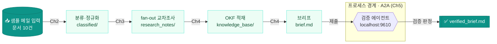
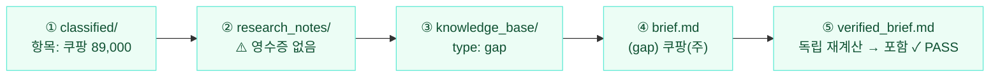
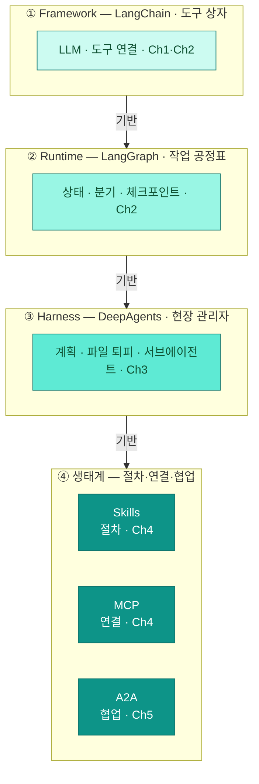

<div class="lec">
<div class="deck">

<section class="slide hero">
<div>
<div class="eyebrow">Chapter 6 · 통합 캡스톤 · 마무리</div>

# 모듈을,<br>하나로 연결한다

<p class="lead">앞 다섯 챕터에서 모듈을 따로 만들어 봤습니다. 이 챕터에서는 새로 짜지 않습니다.<br>
기존 모듈을 연결해 샘플 메일 입력이 분류부터 검증까지 이어지는 엔드투엔드를 배선합니다.</p>

<div class="kicker">
<div class="metric"><span class="num">90</span><strong>분</strong><span>이론 10 · 핸즈온 75</span><span class="clk">예상 16:10–17:40</span></div>
<div class="metric"><span class="num">6</span><strong>모듈 배선</strong><span>analyst_app.py</span></div>
<div class="metric"><span class="num">1</span><strong>검증된 브리프</strong><span>verified_brief.md</span></div>
</div>
</div>

<div class="board">
<div class="board-header"><span>이 챕터가 끝나면</span><span class="status-pill">완성</span></div>
<div class="stack">
<div class="row"><div class="code">1</div><div class="copy"><strong>엔드투엔드 1회</strong><p>샘플 메일 → 분류 → 조사 → 지식 → 브리프 → 검증</p></div><div class="store">전체</div></div>
<div class="row"><div class="code">2</div><div class="copy"><strong>모듈 배선 원리</strong><p>계약을 재사용해 새로 짜지 않는다</p></div><div class="store">조립</div></div>
<div class="row"><div class="code">3</div><div class="copy"><strong>적용 메모</strong><p>내 업무에 옮길 항목 정리</p></div><div class="store">전이</div></div>
</div>
</div>
</section>

<section class="slide">
<div class="section-head">
<div>
<div class="eyebrow">1 · 원리 · 5분</div>

## 새로 짜지 않는다

</div>
<p class="section-note">캡스톤의 핵심은 절제입니다. 각 챕터의 모듈을 import 해 그 함수를 부릅니다. analyst_app.py에는 새 로직이 거의 없습니다.<br>
이게 가능한 이유는 처음부터 계약을 맞춰 뒀기 때문입니다. 모두 RecordV1을 주고받고, 같은 디렉터리 규약을 씁니다. 모듈을 바꿔도 계약은 그대로입니다.</p>
</div>

<div class="grid-2">
<div class="panel"><div class="panel-head"><strong>계약 — RecordV1</strong><span>Ch0에서 못박음</span></div><div class="panel-body"><div class="list">
<p>추출도 조사도 검증도 같은 레코드를 봅니다</p>
<p>중간에 포맷이 바뀌지 않아 배선이 단순합니다</p>
</div></div></div>
<div class="panel"><div class="panel-head"><strong>규약 — 디렉터리</strong><span>workspace/ 단계별</span></div><div class="panel-body"><div class="list">
<p>classified → research_notes → knowledge_base → brief → verified</p>
<p>한 단계의 출력이 다음 단계의 입력입니다</p>
</div></div></div>
</div>

<p class="section-note" style="margin-top:16px">분류 모델을 더 좋은 것으로 바꿔도, 검증자를 다른 팀 것으로 바꿔도 배선은 그대로입니다. 단, <strong>새 모듈이 RecordV1과 디렉터리 규약을 똑같이 지킬 때만</strong>입니다. 계약을 어기는 모듈을 붙이면 그 경계에 어댑터가 필요합니다. 예컨대 새 분류기가 금액을 <code>"11,500원"</code> 문자열로 주면 RecordV1의 <code>total: float</code>과 어긋나므로, 그 경계에서 "쉼표·원 제거 후 float 변환" 어댑터를 둡니다. "자유 교체"가 아니라 "계약을 지키는 한 교체"입니다.</p>
</section>

<section class="slide">
<div class="section-head">
<div>
<div class="eyebrow">2 · 경로 · 5분</div>

## 샘플 입력이 처리되는 경로

</div>
<p class="section-note">샘플 메일 입력은 여섯 단계를 지납니다. 앞 다섯은 한 프로세스 안에서, 마지막 검증은 프로세스 경계를 넘어 A2A로 나갑니다.<br>
각 단계 옆에 그 일을 맡은 챕터를 적었습니다.</p>
</div>



<p class="section-note" style="margin-top:6px">앞 다섯 단계(분류→조사→지식→브리프)는 한 프로세스 안에서 디렉터리로 이어지고, <strong>마지막 검증만 점선 박스 밖</strong> — 다른 프로세스로 떠 있는 검증 에이전트에게 A2A로 건너갑니다. 화살표 위 배지가 그 일을 맡은 챕터입니다.</p>
</section>

<section class="slide">
<div class="section-head">
<div>
<div class="eyebrow">핸즈온 · 75분</div>

## 직접 배선한다 — analyst_app.py

</div>
<p class="section-note">전 구간을 한 번에 실행합니다. <code>--mock</code>은 키 없이 끝까지 돌리고, <code>--a2a</code>를 더하면 검증 단계만 실제 A2A 서버를 띄워 통신합니다.<br>
각 단계가 앞서 만든 모듈을 그대로 부릅니다. 코드를 열어 보면 import와 호출이 대부분입니다.</p>
</div>

<div class="panel">
<div class="panel-head"><strong>analyst_app.py — 배선의 모양</strong><span>새 로직 없이 모듈 호출</span></div>
<div class="panel-body">

<<< ../../ch6-integration/analyst_app.py#wiring{python}

</div>
</div>

<div class="grid-2" style="margin-top:16px">
<div class="panel"><div class="panel-head"><strong>왜 import만으로 되나</strong></div><div class="panel-body"><div class="list">
<p>각 단계가 돌려준 산출물(classified·notes·knowledge_base)을 다음 단계가 디렉터리 규약으로 집어 옵니다.</p>
<p>그래서 함수끼리 인자를 길게 주고받지 않아도 됩니다 — 파일이 계약입니다.</p>
</div></div></div>
<div class="panel"><div class="panel-head"><strong>한 군데만 실선, 나머지는 목</strong></div><div class="panel-body"><div class="list">
<p>메일 입력은 목(mock), 검증(A2A)은 실선(실제 외부 서버 연결)입니다. 파일·지식 적재는 캡스톤에선 직접 쓰기로 단순화합니다(Ch4의 MCP 개념을 여기선 한 겹 줄임).</p>
<p><code>--a2a</code>를 빼면 검증도 목으로 돌아 키 없이 끝까지 실행됩니다.</p>
</div></div></div>
</div>

<div class="cue do">
<div class="cue-head"><span class="cue-label">✋ 직접 해보기</span><span class="cue-time">~10분</span></div>
<div class="cue-body">analyst_app.py로 전 구간을 실행합니다. 먼저 <code>--mock</code>으로 키 없이 끝까지 돌려 <code>[1/6]</code>~<code>[6/6]</code>이 차례로 찍히는지 보고, 그다음 <code>--a2a</code>를 더해 검증 단계가 실제 A2A 서버로 나가는 실호출까지 확인합니다.</div>
</div>

<div class="board" style="margin-top:18px">
<div class="board-header"><span>실행</span><span class="status-pill">터미널</span></div>
<div class="stack">
<div class="row"><div class="code">a</div><div class="copy"><strong>전 구간 — 오프라인</strong><p><code>uv run python3 ch6-integration/analyst_app.py --mock</code><br><span style="color:var(--muted)">성공 기준: <code>[1/6]</code>~<code>[6/6]</code>이 차례로 찍힌다. 기본 실행은 브리프가 gap을 모두 담아 <code>verified_brief.md</code>가 <strong>PASS</strong>로 끝난다(<code>workspace/</code>를 비우고 한 단계를 빼면 NEEDS_REVISION이 정상 — 아래 트러블슈팅·직접 해보기 참고).</span></p></div><div class="store">엔드투엔드</div></div>
<div class="row"><div class="code">b</div><div class="copy"><strong>검증만 실제 A2A</strong><p><code>uv run python3 ch6-integration/analyst_app.py --mock --a2a</code><br><span style="color:var(--muted)">성공 기준: [5/6]에서 <code>Agent Card</code>가 조회되고 실제 서버와 통신한다.</span></p></div><div class="store">A2A</div></div>
<div class="row"><div class="code">c</div><div class="copy"><strong>최종 산출물 열기</strong><p><code>cat workspace/verified_brief.md</code><br><span style="color:var(--muted)">성공 기준: 브리프 + 외부 검증 판정(PASS)이 한 파일에.</span></p></div><div class="store">완성</div></div>
</div>
</div>

<div class="panel" style="margin-top:18px">
<div class="panel-head"><strong>출력 — 파이프라인 실행 결과</strong><span>실제 stdout · 들여쓰기 줄은 각 모듈이 찍는다</span></div>
<div class="panel-body">

```text
[1/6] 분류·정규화 (Ch2 intake_graph)
  ▶ receipt_starbucks.png
    [classify] 스타벅스 강남R점 · 11,500원 · 신뢰도 1.00
    [verify] 통과  →  [persist] classified/receipt_starbucks.json
  ... (고액 2건 invoice_photo·contract_freelance는 ⏸ 멈춤(interrupt) 후 자동 승인) ...
[2/6] fan-out 교차 조사 (Ch3 research_orchestrator)
  [plan] write_todos → card_reconcile / bank_reconcile / spend_summary
  [task] card_reconcile → research_notes/card_reconcile.md
  [task] bank_reconcile → research_notes/bank_reconcile.md
  [task] spend_summary  → research_notes/spend_summary.md
  [synthesize] → workspace/brief_draft.md
[3/6] OKF 지식 적재 (Ch4 okf_store)
  지식 항목 12개
[4/6] 브리프 작성 (Ch4 inbox-brief 절차)
  → workspace/brief.md
[5/6] 외부 검증 (Ch5 A2A)
  → workspace/verified_brief.md
[6/6] 완료

분류 10건 · 조사 3갈래
최종 산출물: workspace/verified_brief.md
```

</div>
</div>

<div class="cue wait">
<div class="cue-head"><span class="cue-label">⏳ 기다렸다 확인</span><span class="cue-time">~십여 초</span></div>
<div class="cue-body"><code>--a2a</code> 실행은 9610 포트에 검증 에이전트를 띄워 통신하므로 목 실행보다 서버 기동 한 박자(십여 초)만큼 더 걸립니다(verifier는 LLM 없이 규칙으로 즉답). [5/6]에서 <code>Agent Card</code> 조회와 실제 서버 응답이 끝날 때까지 기다린 뒤, <code>workspace/verified_brief.md</code>를 열어 브리프 본문과 외부 검증 판정(<strong>PASS</strong>)이 한 파일에 함께 담겼는지 확인합니다.</div>
</div>

<div class="cue solve" style="margin-top:18px">
<div class="cue-head"><span class="cue-label">✏️ 풀어보기</span><span class="cue-time">~5분</span></div>
<div class="cue-body">한 단계를 일부러 빼면(예: <code>run_okf()</code> 주석) 다음 단계가 어떻게 될까요? 그리고 <code>workspace/</code>를 지우고 다시 돌리면?</div>
</div>

<details>
<summary>관찰 포인트</summary>
<div class="reveal">
<p>okf를 빼면 brief의 "짚을 점"이 비거나 줄어듭니다. 브리프가 knowledge_base의 gap·subscription을 읽어 채우기 때문입니다. 단, <code>run_okf()</code>만 주석 처리하고 <code>workspace/</code>를 그대로 두면 이전 실행의 <code>knowledge_base/</code>가 남아 있어 브리프가 여전히 채워지고 <strong>PASS</strong>가 납니다. 효과를 보려면 <code>rm -rf workspace</code> 후 okf 없이 처음부터 돌리세요 — 그러면 브리프가 gap을 빠뜨리고, 검증자가 레코드에서 그 gap을 다시 찾아 <strong>NEEDS_REVISION</strong>으로 반려합니다. 한 모듈을 빼면 그 산출물에 의존하던 다음 단계가 빈약해진다는 걸, 계약으로 단계가 이어져 있음을 통해 확인하는 실습입니다.</p>
<p><code>workspace/</code>를 지우고 다시 돌리면 처음부터 같은 순서로 재생됩니다. 입력(sample_inbox)과 코드만 커밋돼 있으면 누가 돌려도 같은 산출물이 나옵니다. 감사 가능한 실행의 조건입니다.</p>
</div>
</details>

<div class="board" style="margin-top:18px">
<div class="board-header"><span>직접 채운다 — 경계 어댑터</span><span class="status-pill">스캐폴드</span></div>
<div class="panel-body">
<p class="section-note">"계약을 지키면 모듈을 바꿀 수 있다"는 원칙에서 <strong>경계 어댑터</strong>가 중요합니다. 바깥세상의 표기(<code>"11,500원"·"₩1,650,000"</code>)를 계약의 타입(<code>total: float</code>)으로 바꾸는 얇은 코드입니다. 이 <code>coerce_amount</code>를 직접 채워 원리를 확인합니다. <span style="color:var(--muted)">(이건 개념을 익히는 <strong>독립 연습</strong>입니다. analyst_app 본체는 이미 계약을 지키는 모듈들로 돌고 있고, 새 입력 표기를 붙일 때 이런 어댑터를 경계에 추가합니다.)</span></p>

<<< ../../ch6-integration/exercise_adapter.py#coerce{python}

</div>
</div>

<div class="cue do" style="margin-top:14px">
<div class="cue-head"><span class="cue-label">✋ 직접 해보기 — 코드 작성</span><span class="cue-time">~8분</span></div>
<div class="cue-body"><code>ch6-integration/exercise_adapter.py</code>의 <code>coerce_amount</code>를 채우고 <code>uv run python3 ch6-integration/exercise_adapter.py</code>를 돌리세요. 이 연습의 다섯 케이스가 ✅로 바뀌고 <strong>[PASS]</strong>가 뜨면 성공입니다. 새 입력원(다른 표기의 금액)을 붙일 때 경계 어댑터를 두면 본체 파이프라인은 그대로 두고 계약을 맞출 수 있습니다.</div>
</div>

<div class="cue solve" style="margin-top:14px">
<div class="cue-head"><span class="cue-label">✏️ 풀어보기</span><span class="cue-time">~7분</span></div>
<div class="cue-body">카드 명세서에만 있고 영수증이 없는 결제 한 줄(예: 쿠팡)을 골라, 그 항목이 ① classified ② research_notes ③ knowledge_base ④ brief ⑤ verified_brief 다섯 산출물에서 각각 어떤 모양으로 나타나는지 추적하세요.</div>
</div>

<details>
<summary>추적 답</summary>
<div class="reveal">
<p>위 그림이 시스템 전체 경로라면, 아래는 <strong>쿠팡 89,000원 레코드 하나</strong>가 다섯 산출물에서 어떻게 표현되는지 보여 줍니다. 산출물마다 형식은 달라지지만 계약의 핵심 값(이름·금액)은 유지됩니다:</p>



<p style="margin-top:6px">3만원 미만이면 ③에서 <code>type: subscription</code>(구독 추정), 이상이면 <code>type: gap</code>(확인 필요)으로 갈립니다. ⑤에서 검증자는 브리프 문장을 믿지 않고, <em>레코드에서 영수증 없는 거래를 다시 계산해</em> 브리프가 빠짐없이 짚었는지 대조합니다. 브리프 <em>문장</em>과는 독립이라, 브리프가 gap을 누락·변조하면 잡아냅니다. 다만 영수증 매칭 함수(<code>by_type</code>·<code>abs&lt;1.0</code>)는 producer와 같은 코드를 import해 쓰므로 그 매칭 <em>로직 자체</em>의 버그는 공유합니다 — 자세한 한계는 마무리 슬라이드.</p>
</div>
</details>

<div class="board" style="margin-top:18px">
<div class="board-header"><span>막히면</span><span class="status-pill">트러블슈팅</span></div>
<div class="stack">
<div class="row"><div class="code">!</div><div class="copy"><strong>ModuleNotFoundError (deepagents·langchain 등)</strong><p>레포 루트에서 <code>uv run</code> 하세요. <code>uv</code>는 실행 폴더(또는 상위)에서 <code>pyproject.toml</code>을 찾아 이 프로젝트의 의존성·가상환경을 잡는데, 레포 밖에서 돌리면 그걸 못 찾아 import가 깨집니다. (앱이 ch1~5를 <code>sys.path</code>에 넣는 건 <code>__file__</code> 위치 기준이라 cwd와는 무관합니다.)</p></div><div class="store">경로</div></div>
<div class="row"><div class="code">!</div><div class="copy"><strong>[5/6]에서 멈춤(--a2a)</strong><p><code>--a2a</code>는 9610 포트에 verifier_agent를 띄웁니다. 포트 점유 시 기동 실패가 납니다. 이전 프로세스를 끄거나 <code>--a2a</code> 없이 목으로 돌립니다.</p></div><div class="store">A2A</div></div>
<div class="row"><div class="code">!</div><div class="copy"><strong>verified_brief가 NEEDS_REVISION</strong><p>버그가 아닙니다. 기본 실행은 PASS지만, <code>workspace/</code>를 비우고 <code>run_okf()</code>를 건너뛰면 브리프가 gap을 빠뜨려 검증자가 반려합니다(<code>workspace/</code>를 안 비우면 이전 <code>knowledge_base/</code>가 남아 PASS가 납니다). brief.md "짚을 점"과 verified_brief의 재계산을 비교하세요. <strong>PASS도 NEEDS_REVISION도 검증 로직이 돈 결과</strong>입니다.</p></div><div class="store">정상</div></div>
</div>
</div>
</section>

<section class="slide">
<div class="section-head">
<div>
<div class="eyebrow">마무리 · 3분</div>

## 8시간이 남긴 것

</div>
<p class="section-note">하나의 인박스를 끝까지 처리하며 여덟 역량을 실습했습니다. 각 역량이 어느 모듈에서 처음 나왔는지 돌아봅니다.<br>
<strong>정리할 원칙은 두 가지입니다</strong>. ① <strong>계약(RecordV1)을 지키면 모듈을 교체할 수 있다</strong>. ② <strong>고정 단계는 워크플로로 두고, 자율은 꼭 필요한 곳(Ch3)에만 둔다</strong>. 아래 표·스택은 그 두 원칙의 근거입니다.</p>
</div>

<div class="matrix matrix-7" style="grid-template-columns:116px repeat(6,minmax(84px,1fr))">
<div class="cell head"></div>
<div class="cell head">Ch1</div><div class="cell head">Ch2</div><div class="cell head">Ch3</div><div class="cell head">Ch4</div><div class="cell head">Ch5</div><div class="cell head">Ch6</div>

<div class="cell axis">멀티모달</div>
<div class="cell active">추출</div><div class="cell"></div><div class="cell"></div><div class="cell"></div><div class="cell"></div><div class="cell warn">✓ 재사용</div>

<div class="cell axis">HITL 멈춤</div>
<div class="cell"></div><div class="cell active">고액·저신뢰</div><div class="cell"></div><div class="cell"></div><div class="cell"></div><div class="cell warn">✓ 재사용</div>

<div class="cell axis">멀티에이전트</div>
<div class="cell"></div><div class="cell active">직렬</div><div class="cell active">fan-out</div><div class="cell"></div><div class="cell"></div><div class="cell warn">✓ 재사용</div>

<div class="cell axis">하네스 루프</div>
<div class="cell"></div><div class="cell"></div><div class="cell active">계획·위임</div><div class="cell"></div><div class="cell"></div><div class="cell warn">✓ 재사용</div>

<div class="cell axis">MCP</div>
<div class="cell"></div><div class="cell"></div><div class="cell"></div><div class="cell active">파일·메일</div><div class="cell"></div><div class="cell warn">✓ 재사용</div>

<div class="cell axis">Skill</div>
<div class="cell"></div><div class="cell"></div><div class="cell"></div><div class="cell active">점진 공개</div><div class="cell"></div><div class="cell warn">✓ 재사용</div>

<div class="cell axis">Plugin·OKF</div>
<div class="cell"></div><div class="cell"></div><div class="cell"></div><div class="cell active">표준 지식</div><div class="cell"></div><div class="cell warn">✓ 재사용</div>

<div class="cell axis">A2A</div>
<div class="cell"></div><div class="cell"></div><div class="cell"></div><div class="cell"></div><div class="cell active">경계 검증</div><div class="cell warn">✓ 재사용</div>
</div>

<div class="legend" style="margin-top:10px">
<span class="lpill"><span class="ldot" style="background:#34d399"></span>처음 익힌 곳</span>
<span class="lpill"><span class="ldot" style="background:#f59e0b"></span>Ch6 캡스톤에서 재사용</span>
</div>
<p class="section-note" style="margin-top:8px">여덟 역량은 각자 다른 챕터에서 처음 나왔지만, <strong>오른쪽 Ch6 열의 앰버 띠</strong>처럼 캡스톤에서 전부 다시 쓰입니다. 따로 배운 모듈이 하나의 파이프라인으로 합쳐진다는 뜻입니다.</p>

<div class="board" style="margin-top:18px">
<div class="board-header"><span>하루를 관통한 축 — 네 계층</span><span class="status-pill">멘탈 모델</span></div>
<div class="panel-body">



<p style="margin-top:8px">아래(①)가 위(④)의 기반입니다. LLM 호출(Framework) 위에 상태·분기(Runtime), 그 위에 계획·위임(Harness), 맨 위에 절차·연결·협업(생태계)을 둡니다. <strong>Ch2에서 LangChain(프레임워크)과 LangGraph(런타임)를 함께 익혔기에</strong> Ch2가 아래 두 층에 걸쳐 있습니다. 위 여덟 역량은 전부 이 네 층 어딘가에 속합니다.</p>
</div>
</div>
</section>

<section class="slide">
<div class="section-head">
<div>
<div class="eyebrow">현실</div>

## 데모와 프로덕션 사이

</div>
<p class="section-note">이 캡스톤은 결정론적 목으로 끝까지 실행됩니다. 학습엔 좋지만, 실선으로 바꾸면 새 문제가 생깁니다. 어떤 항목을 점검해야 하는지 미리 봅니다.</p>
</div>

<div class="grid-2">
<div class="panel"><div class="panel-head"><strong>지금은 목이라 숨은 것</strong></div><div class="panel-body"><div class="list">
<p><strong>추출 비결정성</strong> — <code>--mock</code>은 gold를 베껴 100% 재현됩니다. 실모델 멀티모달은 신뢰도가 흔들리고 같은 영수증을 넣어도 결과가 매번 달라져, 신뢰도 임계 HITL 멈춤(Ch2)이 실제 안전장치가 됩니다.</p>
<p><strong>검증은 실모델 구간에서 의미가 커짐</strong> — 목 구간에선 브리프도 검증자도 같은 gold에서 나와 PASS가 사실상 보장됩니다(검증이 "도는지" 확인용). 추출이 흔들리는 실모델에서는 브리프 누락과 검증자 반려가 실제로 갈리므로, 외부 검증의 효과가 드러납니다.</p>
<p><strong>fan-out 비용·실패</strong> — 세 갈래가 실제 LLM 호출이면 토큰·지연·부분 실패가 곱해집니다. 한 갈래가 죽어도 나머지가 끝나게(부분 산출 허용) 설계해야 합니다.</p>
</div></div></div>
<div class="panel"><div class="panel-head"><strong>경계를 넘을 때</strong></div><div class="panel-body"><div class="list">
<p><strong>A2A 검증자 신뢰</strong> — 외부 에이전트의 PASS도 결국 하나의 판단입니다. Agent Card 서명·결과 재현 로그를 남겨야 판정을 감사할 수 있습니다.</p>
<p><strong>상태·재현</strong> — workspace를 지워도 복원되는 건 입력이 커밋돼 있어서입니다. 실선 메일·DB에선 입력이 흐르므로 체크포인터(SQLite·Postgres)와 멱등 적재가 필요합니다.</p>
</div></div></div>
</div>

<div class="board" style="margin-top:18px">
<div class="board-header"><span>오늘 실습 → 프로덕션</span><span class="status-pill">바뀌는 것</span></div>
<div class="panel-body">

| 항목 | 오늘 실습 | 프로덕션 |
|---|---|---|
| Checkpointer | InMemorySaver | Postgres/SQLite |
| MCP 전송 | stdio(subprocess) | Streamable HTTP |
| A2A | localhost:9610 | 서비스 디스커버리(k8s) |
| 모니터링 | 콘솔 로그 | LangSmith/LangFuse |
| 인증 | 없음 | OAuth2 / API Key |
| 스케줄링 | 수동 실행 | Celery / Cloud Scheduler |

</div>
</div>

<div class="board" style="margin-top:18px">
<div class="board-header"><span>평가 최소 프레임 — "돌았다"를 넘어</span><span class="status-pill">측정자</span></div>
<div class="panel-body">

| 지표 | 정의 | 목표 예시 |
|---|---|---|
| 작업 완료율 | 요청 작업을 끝낸 비율 | 90%+ |
| 도구 호출 정확도 | 올바른 도구·인자 선택 | 95%+ |
| 환각률 | 근거 없는 응답 비율 (무엇을 환각으로 셀지부터 정의) | ≤5% |
| 건당 지연 | 요청당 평균 처리 시간 | ≤5초 |
| 건당 비용 | 요청당 평균 토큰·비용 | 예산 내 |

<p class="section-note" style="margin-top:10px">오른쪽 수치는 <strong>업계 표준이 아니라 출발점</strong>입니다 — 도메인·태스크 난이도마다 직접 정해야 합니다. 핵심은 숫자가 아니라 "무엇을 어떻게 측정할지"를 먼저 합의하는 것입니다.</p>

</div>
</div>
</section>

<section class="slide">
<div class="section-head">
<div>
<div class="eyebrow">전이 · 2분</div>

## 내 업무에 적용하기

</div>
<p class="section-note">이 애널리스트는 인박스를 다뤘지만 구조는 다른 문서 업무에도 적용할 수 있습니다. 입력을 계약으로 정규화하고, 나눠 조사하고, 지식으로 쌓고, 외부에 검증을 맡기는 방식입니다.<br>
문서 더미가 계약서든 로그든 논문이든, 도메인별 모듈을 바꾸면 같은 구조를 재사용할 수 있습니다.</p>
</div>


<div class="legend" style="margin-top:8px">
<span class="lpill"><span class="ldot" style="background:#f59e0b"></span>바꿀 것 — 모듈(도메인마다 다름)</span>
<span class="lpill"><span class="ldot" style="background:#5eead4"></span>그대로 둘 것 — 골격(어디서나 같음)</span>
</div>

<div class="grid-3">
<div class="panel"><div class="panel-head"><strong>바꿀 것</strong><span>모듈</span></div><div class="panel-body"><div class="list">
<p>RecordV1 필드를 내 도메인에 맞게</p>
<p>조사 주제(reconcile 함수)를 내 질문으로</p>
</div></div></div>
<div class="panel"><div class="panel-head"><strong>그대로 둘 것</strong><span>골격</span></div><div class="panel-body"><div class="list">
<p>계약 중심 배선 · 디렉터리 규약</p>
<p>HITL 멈춤 · 외부 검증 경계</p>
</div></div></div>
<div class="panel"><div class="panel-head"><strong>더 볼 것</strong><span>다음</span></div><div class="panel-body"><div class="list">
<p><strong>평가·관측</strong> — "돌았다"를 넘어 산출물 품질을 자동 채점(LLM-as-judge·골든셋)하고 단계별 토큰·지연·실패율을 추적해야 회귀를 잡습니다(<a href="https://docs.smith.langchain.com/">LangSmith</a> 류 트레이싱).</p>
<p><strong>워크플로 vs 에이전트 규율</strong> — 이 파이프라인은 대부분 워크플로(고정 단계)이고 자율 루프는 Ch3 한 곳뿐. 단계가 정해졌으면 자율성을 일부러 줄이는 게 더 싸고 안정적입니다.</p>
</div></div></div>
</div>

<div class="board" style="margin-top:18px">
<div class="board-header"><span>오늘의 한 줄</span><span class="status-pill">정리</span></div>
<div class="panel-body"><div class="list">
<p>LLM만으론 부족 → <strong>Agent</strong>. Agent만으론 부족 → <strong>Harness</strong>. Harness만으론 부족 → <strong>Skills·MCP·A2A 생태계</strong>. 오늘은 이 계층을 순서대로 실습했습니다.</p>
<p style="font-weight:800">"에이전트 개발은 LLM 호출만이 아니라, LLM이 검증 가능한 방식으로 일할 실행 환경(Harness)을 설계하는 일이다."</p>
</div></div>
</div>

<div class="board" style="margin-top:18px">
<div class="board-header"><span>참고 자료</span><span class="status-pill">출처</span></div>
<div class="panel-body"><div class="list">
<p><a href="https://www.anthropic.com/engineering/building-effective-agents">Anthropic — Building Effective Agents</a> · <a href="https://blog.langchain.com/deep-agents/">LangChain Deep Agents</a></p>
<p><a href="https://modelcontextprotocol.io/">MCP</a> · <a href="https://a2a-protocol.org/">A2A</a> · <a href="https://agentskills.io/">Agent Skills</a> · <a href="https://github.com/GoogleCloudPlatform/knowledge-catalog/tree/main/okf">OKF — Google Cloud</a></p>
</div></div>
</div>
</section>


<nav class="chapnav">
<div class="board" style="margin-top:8px">
<div style="display:grid;grid-template-columns:1fr auto 1fr;gap:14px;align-items:center">
<a href="/deepagents-handson/chapters/chapter-5" style="color:inherit;text-decoration:none;font-weight:900;font-size:14px">← Ch5 · A2A 역할 분리</a>
<a href="/deepagents-handson/toc" style="color:var(--forest);text-decoration:none;font-weight:900;font-size:13px;background:rgba(148,210,189,.3);border:1px solid rgba(15,118,110,.24);border-radius:99px;padding:7px 16px">목차</a>
<span></span>
</div>
</div>
</nav>

</div>
</div>
