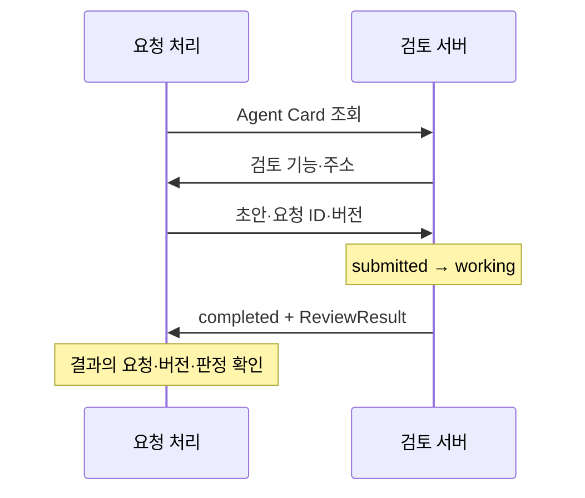

<div class="lec workshop-edition"><div class="deck">
<section class="slide">
<div class="eyebrow">2026.09 · 개인 실습 · 65분 · 개념 25 / 함께 15 / 개인 15 / 풀이 10</div>

# A2A 위임과 ACP의 연결 대상

<p class="lead">요청 처리와 검토를 다른 프로세스로 나눕니다. 접수·진행·완료 상태와 실제 검토 결과를 함께 확인합니다.</p>

정책 조회 연결은 앞 단계에서 확인했습니다. 이번에는 검토 기능을 별도로 운영하는 팀에 초안을 맡긴다고 가정합니다. 문의 Agent는 답변 초안을 만들고, 검토 시스템은 작업 상태와 결과를 돌려줍니다. 앞서 만든 로컬 검토를 지우는 것이 아니라, 통과한 초안을 외부 검토에 넘겼을 때 결과를 어떻게 받아들일지 배웁니다. 실제 조직의 분리 없이 함수 호출로 충분하다면 A2A를 추가할 필요는 없습니다.

<div class="cue"><div class="cue-body">모든 명령은 <code>workshop</code> 폴더에서 실행합니다. 처음이라면 <a href="./start">시작 안내</a>를 먼저 확인합니다. 전체 연결에 필요한 앞 단계가 미완료라면 시작 안내의 복귀 절차로 해당 함수만 보완합니다.</div></div>
</section>

<section class="slide" id="icebreaker">

## 시작 질문 · 다른 팀의 Agent에게 일을 맡기는 것은 API 호출과 무엇이 다를까요?

A2A v1.0 발표는 다른 기술 스택과 조직 사이의 상호 운용을 강조하며, 도구 연결에 쓰는 MCP와 Agent 간 작업 위임을 구분합니다. [2026-03-12 · 원문](https://a2a-protocol.org/dev/blog/2026/03/12/a2a-protocol-ships-v10-production-ready-standard-for-agent-to-agent-communication/)

**다른 팀의 검토 시스템이 “완료”라고 답했습니다. 우리 초안을 바로 사용해도 될까요?**

요청 접수·작업 완료·검토 통과를 나누고, 어떤 요청의 어떤 버전인지 확인합니다.


<details class="instructor-note"><summary>강사용 진행 노트 · 시작 질문</summary>

업무를 부탁하고 완료 답변을 받았는데 결과가 기대와 달랐던 경험을 짧게 받습니다.

통신 규약이 결과의 정확성까지 보장하지 않습니다. 조직이나 실행 경계가 없으면 함수 호출로 충분할 수도 있습니다. 두 ACP의 구별은 본 개념에서 다룹니다.

이야기는 2~3분 안에서 본론으로 연결합니다. 답을 맞히게 하기보다 뒤 실습에서 확인할 질문을 남깁니다.

</details>

</section>

<nav class="lesson-nav" aria-label="학습 단계"><a href="#concept">01 개념</a><a href="#observe">02 함께 실행</a><a href="#practice">03 개인 과제</a><a href="#solution">04 풀이</a></nav>

<section class="slide" id="concept">

<aside class="teacher-aside"><strong>강사의 한마디</strong><p>상대 Agent가 작업을 끝냈어도 지금 요청에 쓸 수 있는 결과인지는 따로 봐야 합니다. 완료 상태와 결과 수용을 구분하겠습니다.</p></aside>


## 도구와 독립 Agent · 7분

함수로 충분한 검토를 무조건 별도 Agent로 나눌 필요는 없습니다. 독립 배포·권한·정보 경계를 가진 시스템에 일을 맡기는 경우에는 발견·작업 상태·산출물을 전달할 규약이 필요합니다.

MCP는 도구 사용에, A2A는 독립 Agent나 Agent 시스템에 작업을 맡기는 데 초점을 둡니다. 이 예제의 검토 서버는 정책 근거를 규칙으로 검사하고 모델의 표현 검토를 덧붙입니다.

합격 판정은 규칙 검사 결과입니다. 모델이 표현을 좋게 평가해도 규칙 검사를 통과하지 못하면 보류합니다.

</section>

<section class="slide">

## Card·Task·Artifact · 10분

Agent Card에는 이름·접속 위치·기능이 있습니다. Task는 맡긴 작업의 상태, Artifact는 그 작업이 만든 산출물입니다. “요청을 받았다”는 것과 “검토가 끝났다”는 것은 다릅니다.



동기 대기 방식에서는 중간 상태가 개별 응답으로 모두 보이지 않을 수 있습니다. 이 예제도 최종 Task를 받으며, working·실패 처리는 개인 과제에 주어진 상태 값으로 판정합니다. 이것을 실제 네트워크에서 중간 상태를 관측한 기록으로 보지는 않습니다.

<<< ../../workshop/course/a2a_lab.py#delegate{python}

네트워크 오류가 나거나 응답 대기 시간(timeout)을 넘기면 완료로 처리하지 않습니다. `completed`인 작업의 검토 판정이 false일 수도 있습니다. “검토 작업을 완료했다”와 “초안이 통과했다”는 서로 다른 사실입니다.

</section>

<section class="slide">

## ACP를 구분합니다 · 5분

| 이름 | 연결 대상 | 이 수업에서의 위치 |
|---|---|---|
|MCP|애플리케이션과 도구 서버|정책 조회|
|A2A|독립 Agent/시스템 간 작업 위임|원격 검토|
|Agent Communication Protocol|Agent 상호 운용|공식 사이트가 A2A 합류를 안내. 기존 개념과 이동 관계 이해|
|Agent Client Protocol|에디터/IDE와 코딩 Agent|개발 도구가 Agent를 사용하는 경계 이해|

두 ACP는 이름의 약자가 같지만 같은 프로토콜이 아닙니다. A2A의 다른 이름으로 설명하지 않습니다. 기본 과정은 연결 대상과 선택 기준을 배우며 ACP 서버를 별도로 구현하지 않습니다.

</section>

<section class="slide">

## 결과 계약 · 3분

<<< ../../workshop/course/a2a_lab.py#result{python}

완료 상태에서 요청 ID·실행안 버전·passed를 확인합니다. 이전 실행안의 검토 결과를 현재 실행안에 붙이지 않습니다. 검토 통과가 사람의 실행 승인을 대체하는 것도 아닙니다.

### Agent Card를 먼저 읽는 이유

현재 서버는 다음 정보를 Card로 제공합니다. 아래는 `course/a2a_lab.py`의 설정을 읽기 쉽게 옮긴 표입니다. 포트는 서버를 실행할 때 정해집니다.

|정보|현재 서버의 선언|클라이언트의 판단|
|---|---|---|
|이름|업무 초안 검토|어떤 역할의 서버인지 확인|
|기능 ID|`review-policy`|검토 요청을 보낼 대상인지 확인|
|기능 설명|초안의 정책 근거 확인|정책 조회나 메일 발송 기능까지 있다고 추정하지 않음|
|접속 인터페이스|localhost의 주소, JSONRPC|어디에 어떤 방식으로 요청할지 확인|
|입출력 모드|`text/plain`|이번 예제는 JSON 내용을 텍스트 Part에 담아 전달|

`delegate`는 Card를 받아 `review-policy` 기능이 있는지 확인한 뒤 요청합니다. Card에 해당 기능이 없으면 검토를 요청하지 않습니다. Card는 서버가 선언한 기능 정보이며 인증이나 결과의 정확성을 보증하는 증서는 아닙니다.

**판단해 보기:** 이 Card만 보고 “새 정책을 검색해 달라”는 요청도 처리할 수 있다고 결론 내릴 수 있나요? 현재 선언은 초안 검토이므로 그렇게 판단할 근거가 없습니다. 기능 발견, 작업 실행 상태, 산출물 판정은 각각 확인해야 합니다.

</section>

<section class="slide" id="observe">

## 함께 실습 · 15분

[직접 완성하기의 해당 단계](./build#protocols)를 엽니다. 입력·출력과 사용할 API를 확인한 뒤 함수를 완성하고 반례로 검사합니다. 아래 완성 예제는 구조 비교나 오류 확인이 필요할 때 참조합니다.

<details><summary>비교하며 읽는 완성 예제와 시연</summary>

<div class="command-purpose">완성 예제 실행</div>

```bash
uv run python -m course.cli a2a
uv run python -m course.cli a2a --topic 계정
```

Card 이름, state=completed, artifact.request_id/version/passed, decision=accepted를 확인합니다. 별도 검토 서버와 실제 HTTP 요청·응답이 오갑니다.

`artifact.model_note`에는 실제 모델의 표현 검토가 추가됩니다. 이 문장이 있다고 규칙 검사를 대체하지 않습니다. 모델 호출 오류가 발생하면 원인을 해결한 뒤 실제 표현 검토 결과를 다시 확인합니다.


</details>

</section>

<section class="slide" id="practice">

## 개인 과제 · 15분

주 실습은 [내 업무 Agent 직접 완성하기](./build#protocols)입니다. **함께 실습과 개인 과제를 합친 30분** 안에서 재료 읽기→구현→실패 확인을 이어갑니다. 앞의 완성 예제는 필요한 부분만 시연합니다.

공통 구현은 `build_lab/student.py`의 `accept_review`입니다. submitted·working은 pending으로 처리합니다. completed인 경우에도 요청 ID가 비어 있지 않고 일치하며, 기대 버전과 산출물 버전이 모두 양의 정수로 일치하고, `passed is True`인 경우에만 accepted입니다. 불리언 버전, 산출물 누락, 다른 종료 상태는 held입니다. 요청·버전 검사는 주 프로젝트의 필수 계약입니다. 아래 준비 문제는 이 계약을 상태 판정부터 나누어 익힙니다.

아래 작은 문제는 막힐 때 사용하는 준비 문제입니다. 별도 시간을 추가하지 않습니다. 준비 문제의 통과와 프로젝트 완성을 구분합니다.

<details><summary>개념을 확인하는 준비 문제와 추가 반례</summary>

**기본:** `review_decision`을 고칩니다. submitted/working이면 pending, completed이고 artifact.passed가 참이면 accepted, 나머지는 held입니다.

<<< ../../workshop/exercises/student.py#a2a{python}

<div class="command-purpose">준비 문제 검사</div>

```bash
uv run python -m exercises.check a2a
```

### 완료된 작업도 보류할 수 있습니다

초기 함수는 아래 모든 입력을 accepted로 처리합니다. 어떤 행에서 잘못되는지 표시한 뒤 수정합니다.

| Task 상태 | artifact | 예상 결과 | 판정 근거 |
|---|---|---|---|
|working|없음|작성|작성|
|completed|passed=True|작성|작성|
|completed|passed=False|작성|작성|
|completed|없음|작성|작성|
|failed|없음|작성|작성|

기본 검사 후 빈 산출물과 예상하지 못한 상태도 확인합니다.

```bash
uv run python -c "from exercises.student import review_decision; print(review_decision('completed', {})); print(review_decision('unknown', {'passed': True}))"
```

둘 다 무엇을 근거로 보류해야 하는지 적습니다. 실제 A2A 출력의 state와 artifact.passed를 각각 찾아, 작업 상태만 읽었을 때 놓치는 정보를 설명합니다. 문자열 `"false"`도 Python에서는 비어 있지 않은 문자열이므로 참처럼 평가될 수 있습니다. 실제 불리언 `True`를 확인하는 이유입니다.

**확장:** 확장 함수에서 요청 ID와 버전을 검사합니다. 작업 완료인데 결과가 없거나 다른 버전이면 보류하는 테스트를 작성합니다. timeout을 성공으로 바꾸는 예외 처리를 넣지 않습니다.

확장 시작 파일은 `exercises/extensions.py`의 `review_version(state, artifact, request_id, version)`입니다. 기본 함수의 인자는 바꾸지 않습니다.

`request_id`와 `version`은 A2A 요청자가 기대하는 값이며 artifact 안의 값과 비교합니다.

```bash
uv run python -m exercises.extension_check a2a
```

학생 검사 결과를 먼저 확인합니다. 다음 명령은 풀이 시간에 기준 구현을 확인할 때만 실행합니다.

```bash
uv run python -m exercises.extension_check a2a --solution
```

기대 요청 req-1·버전 2와 일치하는 완료 artifact는 accepted, req-2 또는 버전 3을 기대하면 held, working은 pending입니다. 새 함수의 인자로 기대값을 받으므로 기본 과제 함수를 변경하지 않습니다.

시작 코드는 FAIL이 정상입니다. 첫 명령으로 자신의 구현을 검사하고, 풀이 시간에 `exercises/extension_solutions.py`의 같은 함수를 열어 비교합니다. 정상·실패 사례는 `exercises/extension_check.py`에서 확인합니다.

<details><summary>힌트</summary>

상태부터 구분한 뒤 완료인 경우에만 artifact를 읽습니다. `passed`가 문자열 `"true"`인 경우와 실제 불리언 `True`인 경우도 구분합니다.

</details>

### 늦게 도착한 결과를 현재 초안에 붙이지 않습니다

사용자가 초안 v1을 검토 요청한 뒤 내용을 고쳐 v2를 다시 요청했습니다. v2 검토가 먼저 끝나고, 잠시 뒤 v1의 성공 결과가 도착했습니다. 가장 늦게 받은 결과를 현재 결과로 덮어써도 되는지 먼저 판단합니다.

|현재 요청|도착한 산출물|판정과 이유|
|---|---|---|
|req-1 / v2|req-1 / v1 / passed=true|작성|
|req-1 / v2|req-1 / v2 / passed=false|작성|
|req-1 / v2|req-2 / v2 / passed=true|작성|
|req-1 / v2|req-1 / v2 / passed=true|작성|

확장 함수 `review_version`에서 이 계약을 구현합니다. 제공 함수 호출 한 줄로 끝내기보다 상태·요청·버전·판정의 검사를 직접 쓰고 순서를 설명합니다. `version`은 이 실습의 양의 정수이며, 문자열이나 불리언을 숫자로 취급하지 않습니다. Python에서 `True == 1`이 참이라는 점 때문에 단순 값 비교만으로는 타입의 차이를 놓칠 수 있습니다.

`submitted`·`working`은 대기, 실패 상태는 보류입니다. completed라도 산출물 누락·요청 불일치·버전 불일치·passed가 실제 True가 아닌 경우는 보류합니다. 위 표는 순서 역전을 생각하기 위한 사례이며, 이 표를 실제 네트워크에서 관찰한 중간 상태 기록이라고 보지는 않습니다.

**설계 질문:** 버전 숫자가 같아도 초안 내용이 달라질 수 있는 시스템이라면 무엇을 추가해야 할까요? 초안 변경 시 버전을 올리는 계약, 검토 요청과 본문의 해시를 묶는 방법 중 하나를 선택해 어떤 불일치를 막는지 설명합니다. 버전 검사만으로 사용자 인증이나 실행 승인이 생기는 것은 아닙니다.


</details>

</section>

<section class="slide" id="operations">

## 운영 관점: 작업 상태와 우리 업무의 판정을 구분합니다

프로토콜의 상태와 화면에 보여 줄 업무 결과를 별도로 설계합니다. `pending`, `held`, `accepted`는 이 교재의 애플리케이션 판정이며 A2A 상태 이름을 그대로 옮긴 것이 아닙니다.

|A2A에서 읽은 상태|프로토콜 관점|현재 교재의 처리|
|---|---|---|
|submitted / working|접수 또는 진행 중|pending|
|input-required / auth-required|입력 또는 인증을 기다리는 중단 상태|자동 수용하지 않고 held. 재개 대화는 이 예제에 없음|
|completed|작업 종료|산출물의 요청·버전·passed를 검사한 뒤 수용 여부 결정|
|failed / canceled / rejected|실패·취소·거절로 종료|held|

중단 상태와 종료 상태는 다릅니다. 공식 수명주기에서 종료한 Task는 다시 시작하지 않으며 후속 작업은 새 Task로 다룹니다. A2A는 Task 없이 즉시 Message로 답하는 상호작용도 지원합니다. 이 교재의 검토 서버는 Task를 반환하는 경로만 구현했습니다. [공식 Task 수명주기](https://a2a-protocol.org/latest/topics/life-of-a-task/)

### 어느 ID가 무엇을 묶는가

|식별자|범위|혼동하면 생기는 문제|
|---|---|---|
|JSON-RPC id|전송 요청과 응답의 대응|한 번의 통신 ID를 장기 업무의 ID로 사용|
|message_id|개별 메시지|새 메시지와 새 업무를 같은 것으로 취급|
|task_id|서버가 추적하는 작업|기존 작업 확인과 새 작업 생성을 구분하지 못함|
|context_id|관련 상호작용을 묶는 맥락|같은 맥락의 여러 작업을 한 Task로 오해|
|artifact 안의 request_id / version|이 교재가 추가한 검토 대상 계약|이전 초안에 대한 성공을 현재 초안에 붙임|

`request_id`와 `version`은 A2A가 모든 서비스에 요구하는 필드가 아닙니다. 이 수업의 `ReviewResult`가 어떤 초안을 검사했는지 확인하기 위해 넣었습니다. 현재 `delegate()`는 Task를 읽지만 task_id/context_id를 최종 요약 결과에 보존하지 않습니다. 운영 추적과 재접속을 구현하려면 그 정보와 검토 대상의 관계를 저장해야 합니다.

### timeout은 원격 작업 취소가 아닙니다

우리 클라이언트는 전체 위임에 60초 제한을 두고 HTTP client에도 50초 timeout을 지정합니다. 제한에 걸렸다는 사실은 클라이언트가 결과를 기다리지 못했다는 뜻입니다. 원격 서버의 작업이 반드시 취소되었다는 증거는 아닙니다.

사고 사례: 검토 서버는 초안을 처리했지만 응답이 늦었습니다. 클라이언트가 같은 초안을 새 작업으로 계속 보내면 검토 비용이 중복될 수 있습니다. 이미 받은 task_id가 있다면 해당 작업의 상태 확인을 우선 검토하고, 없다면 업무 요청 ID를 통해 중복을 구분할 서버 계약이 필요한지 판단합니다. 이 교재는 자동 재접속·Task 조회·중복 위임 방지를 구현하지 않았습니다.

현재 서버의 `InMemoryTaskStore`는 프로세스 메모리에 있습니다. MCP 티켓 예제의 SQLite와 달리 서버를 재시작해도 Task가 남는 저장소가 아닙니다. A2A라는 프로토콜을 선택했다고 영속 실행이 자동으로 생기지는 않습니다.

### 다음 행동을 판단합니다

아래는 실제 장애 로그가 아닌 판단 연습입니다. 풀이 시간에는 한 행의 첫 확인 위치를 자신의 실행 기록과 연결합니다.

|상황|결정할 질문|
|---|---|
|v1의 completed가 v2보다 늦게 도착|최신 도착 시각과 최신 검토 대상 중 무엇을 기준으로 수용하는가?|
|auth-required를 받음|검토 내용이 틀린 것인가, 인증 절차가 필요한 것인가?|
|timeout 뒤 사용자가 다시 실행|이전 Task와 새 업무를 어떻게 구분할 것인가?|
|서버 재시작 뒤 Task를 찾지 못함|프로토콜 오류부터 볼 것인가, 저장소의 수명을 먼저 볼 것인가?|

풀이: 현재 초안의 요청·버전이 기준입니다. 인증 대기는 내용 판정과 분리합니다. timeout 후에는 이전 작업의 존재와 식별자를 확인해야 하며, 재시작 후 기록 유실은 우선 현재 저장소가 메모리인지 확인합니다. 상태 이름을 외우는 것보다 어떤 근거가 있어야 다음 행동을 결정할 수 있는지 설명합니다.

</section>

<section class="slide" id="solution">

## 풀이 · 10분

<details class="instructor-note"><summary>강사용 진행 노트 · 수용 조건 풀이</summary>

completed이면서 이전 버전인 결과 하나를 제시하고 왜 보류하는지 묻습니다. 상태·요청 ID·버전·passed를 차례로 확인합니다. 가상 상태 입력을 실제 네트워크에서 관측했다고 설명하지 않습니다.

</details>

주 실습 풀이는 `build_lab/reference.py`의 해당 함수를 자신의 구현과 비교합니다. [완성 기준](./build#finish)에 따라 코드·실행 경로·반례를 설명합니다. 아래 표와 명령은 준비 문제의 풀이입니다.

<div class="command-purpose">준비 문제 풀이 확인</div>

```bash
uv run python -m exercises.check a2a --solution
```

| 오답 | 잘못 통과하는 사례 | 필요한 구분 |
|---|---|---|
|state가 completed면 accepted|검토가 실패한 초안|완료 상태와 검토 판정|
|artifact가 있으면 accepted|passed=False|산출물 존재와 통과|
|passed의 참/거짓만 평가|문자열 "false"|문자열과 불리언|

아직 진행 중인 결과는 pending, 판정에 필요한 결과가 없거나 잘못된 결과는 held입니다. 주 프로젝트의 `accept_review`에서는 내용이 맞아도 다른 요청·버전의 결과를 보류하는지 반드시 확인합니다. 준비 문제의 `review_decision`은 상태·판정만 다루고, 그 준비 문제의 확장인 `review_version`이 요청·버전 검사까지 다룬다는 차이가 있습니다.

항상 accepted를 반환하면 진행 중·실패·결과 누락까지 성공으로 처리합니다. 검토가 끝났어도 내용이 통과하지 않으면 held입니다. 원격 호출은 일반 함수보다 실패 조건이 많으므로 분리할 이유를 함께 설명합니다.

마지막 통합에서는 새 프레임워크를 추가하지 않습니다. 지금까지의 학생 구현을 한 요청에 연결하고, “로그인이라는 업무명도 받아 달라”는 새 요구를 반영합니다. 한 부분을 바꾼 뒤 조회·초안·검토가 같은 의미를 유지하는지가 마지막 확인입니다.

참고: [A2A Core Concepts](https://a2a-protocol.org/latest/topics/key-concepts/), [Communication ACP](https://agentcommunicationprotocol.dev/introduction/welcome), [Client ACP](https://agentclientprotocol.com/get-started/introduction).

</section>

<nav class="chapnav"><a href="../toc">전체 목차</a></nav>
</div></div>
