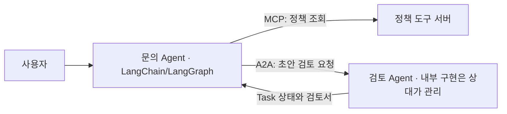
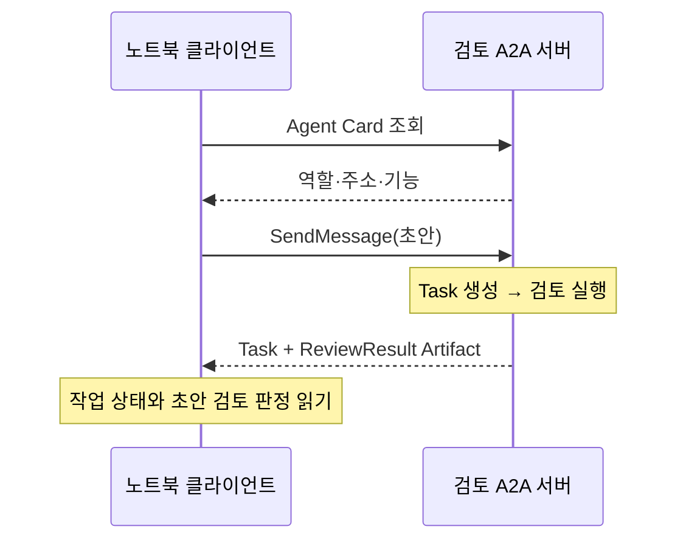
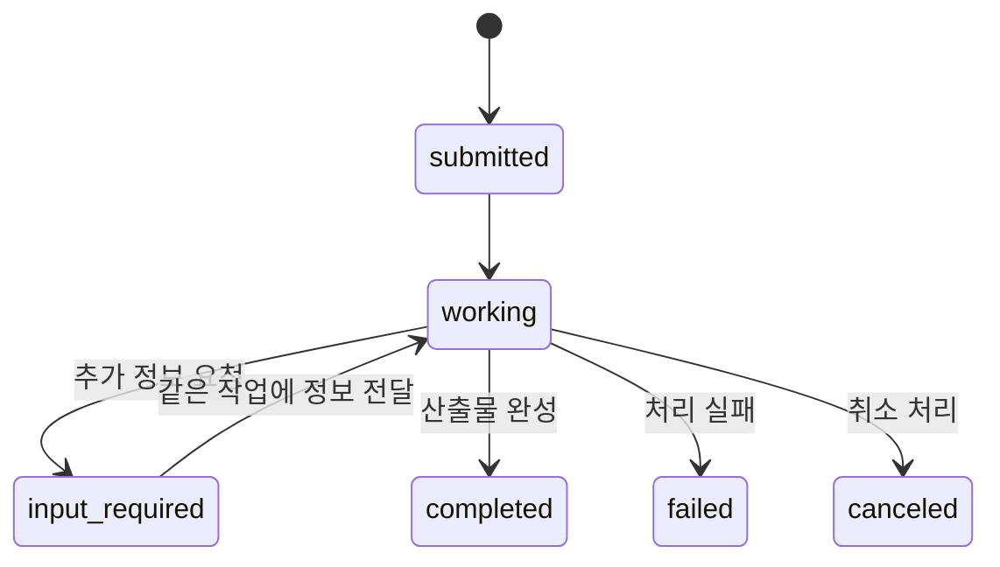

<div class="lec workshop-edition"><div class="deck">
<section class="slide">
<div class="eyebrow">2026.09 · 예상 16:45–17:30 · 45분</div>

# A2A로 다른 Agent에 작업 맡기기

<p class="lead">다른 팀의 Agent가 어떤 일을 하는지 알아내고, 초안을 맡긴 뒤 작업 상태와 검토 산출물을 받습니다. Agent Card → Message → Task·Artifact를 실제 Jupyter 출력과 연결합니다.</p>

지금까지 문의 Agent가 정책을 조회하고 답변을 만들었습니다. 이제 별도로 운영하는 검토 Agent에 “이 초안의 정책 근거를 확인해 달라”고 맡깁니다. 상대가 어떤 모델·도구·프레임워크를 쓰는지 알아야 할까요? **내부 구현을 공유하지 않고도 역할·요청·진행 상태·결과를 주고받는 규약**이 A2A입니다.

이 장을 마치면 Card에서 가능한 일을 찾고, Message와 Task·Artifact를 구별하며, 노트북에서 실제 원격 검토 결과를 받아 사용할 수 있어야 합니다. 실습은 `notebooks/build-agent.ipynb`의 5번에서 진행합니다.

<details class="instructor-note"><summary>강사용 예상 시간 · 45분</summary>

시작 3분, 개념 17분, 실습 15분, 풀이 7분, Wrap 3분입니다. Card·Message·Task 실물 읽기를 우선하고, 추가 입력·전송 방식·ACP는 선택 자료로 조절합니다. 별도 CLI나 서버 터미널을 열지 않습니다.

</details>
</section>
<section class="slide" id="icebreaker">

## 시작 질문 · 검색 함수와 조사 담당자에게 맡기는 일

<p class="section-time">예상 3분 · 16:45–16:48</p>

“지난달 규정을 찾아줘”는 검색 도구 호출로 처리할 수 있습니다. “이 초안이 규정에 맞는지 검토하고, 정보가 부족하면 물어본 뒤 검토서를 줘”는 작업을 맡기는 요청입니다. 다른 팀이 그 검토 시스템을 운영한다면 어떤 정보를 주고받아야 할까요?

Elastic의 뉴스룸 예제에서는 기자가 조사 Agent에 자료 조사를 맡기고, 조사 Agent는 MCP 도구로 자료를 찾습니다. Agent 간 협업과 내부 도구 사용이 함께 등장하는 개발 예제입니다. 우리 수업에서는 문의 작성자와 검토자 두 역할로 줄여 살펴봅니다. [Elastic 기술 사례](https://www.elastic.co/search-labs/blog/a2a-protocol-mcp-llm-agent-workflow-elasticsearch)

</section>
<nav class="lesson-nav" aria-label="수업 흐름"><a href="#concept">01 개념</a><a href="#observe">02 실습</a><a href="#solution">03 풀이</a><a href="#wrap">04 Wrap</a></nav>
<section class="slide" id="concept">

## 개념 1 · Agent 내부와 Agent 사이의 연결

<p class="section-time">예상 4분 · 16:48–16:52</p>

LangGraph는 한 Agent의 상태와 실행 흐름을 구성합니다. A2A는 그 Agent가 외부 요청을 받는 접점을 정의합니다. **LangGraph로 만든 Agent를 A2A 서버로 공개할 수 있습니다.** A2A가 모델의 추론이나 내부 그래프를 대신 만드는 것은 아닙니다.



클라이언트는 상대의 내부 메모리나 도구를 공유받는 대신, 공개된 기능과 메시지를 사용합니다. A2A 클라이언트는 다른 Agent뿐 아니라 일반 애플리케이션일 수도 있습니다. 이번 노트북은 클라이언트 역할을 합니다. [A2A 핵심 개념](https://a2a-protocol.org/latest/topics/key-concepts/)

| 선택 | 적합한 상황 | 얻는 것과 비용 |
|---|---|---|
| 내부 함수·하위 Agent | 한 앱 안에서 역할을 나눔 | 연결이 간단함. 외부 팀과 공유할 별도 계약은 직접 설계 |
| 업무용 HTTP API | 정해진 입력과 결과를 주고받음 | 기존 API 기반 활용. 발견·작업 상태 규약을 팀끼리 합의 |
| A2A | 독립 Agent 시스템끼리 기능을 발견하고 작업을 위임 | 공통 Card·Message·Task 규약. 네트워크·인증·버전 운영 필요 |

MCP도 네트워크를 넘고 장시간 작업을 다룰 수 있습니다. 하위 Agent도 원격으로 배치할 수 있습니다. 따라서 “같은 프로세스인가”, “오래 걸리는가” 하나만으로 고르지 않습니다. **도구 인터페이스를 제공할지, 독립 Agent의 작업 인터페이스를 제공할지**가 주된 비교 기준입니다. [MCP와 A2A의 관계](https://a2a-protocol.org/latest/topics/a2a-and-mcp/)

## 개념 2 · Card로 찾고, Message로 맡깁니다

<p class="section-time">예상 4분 · 16:52–16:56</p>

Agent Card는 서버가 공개하는 JSON 소개 문서입니다. 보통 `/.well-known/agent-card.json`에서 가져옵니다. 모델에게 질문하기 전에 클라이언트가 읽습니다.

| Card 항목 | 검토 서버에서 읽을 값 | 의미 |
|---|---|---|
| name·description | 업무 초안 검토 | 맡길 역할 |
| skills | review-policy | 제공하는 업무 기능 |
| supportedInterfaces | 주소·JSONRPC·1.0 | 접속 주소와 프로토콜 바인딩·버전 |
| capabilities | streaming=false | 스트리밍 지원 여부 |
| defaultInputModes·defaultOutputModes | text/plain | 주고받는 콘텐츠 형식 |

**Card의 AgentSkill은 SKILL.md와 다릅니다.** Card의 skill은 “무엇을 할 수 있는가”라는 기능 소개이고, SKILL.md는 Agent가 참고할 작업 절차입니다. Card의 기능 설명은 실행 권한이나 정확성의 보증서도 아닙니다.

찾은 Agent에 보내는 한 차례의 발화가 **Message**입니다. Message는 역할과 ID, 하나 이상의 **Part**를 담습니다. Part에는 텍스트·파일·구조화 데이터를 넣을 수 있습니다. 이 예제는 업무 JSON을 텍스트 Part 하나에 담습니다.

```python
# SDK 메시지 생성 부분 발췌. 실행은 노트북 5B에서 합니다.
message = Message(
    role=Role.ROLE_USER,
    message_id=str(uuid.uuid4()),
    parts=[Part(text=json.dumps(payload, ensure_ascii=False))],
)
```

여기의 user는 요청을 보내는 쪽의 역할입니다. 사람이 직접 타이핑했다는 뜻은 아닙니다. `payload`에는 업무명·초안·요청 ID·초안 버전이 있습니다. 이 네 필드는 우리 검토 업무의 약속이며 A2A의 필수 필드가 아닙니다.

## 개념 3 · 응답은 Message일 수도, Task일 수도 있습니다

<p class="section-time">예상 5분 · 16:56–17:01</p>

간단한 질문은 Message로 바로 답할 수 있습니다. 진행 상태를 추적할 일이라면 서버는 **Task**를 만듭니다. Task는 작업 ID·상태·산출물을 담는 작업 단위입니다. 검토서처럼 작업이 만든 결과물이 **Artifact**이며, 이것도 Part 목록으로 내용을 담습니다.



우리 서버는 빠른 검토에도 Task를 반환하도록 만들었습니다. `return_immediately=False`와 비스트리밍 설정으로 최종 결과를 기다립니다. 따라서 셀에서 submitted·working이 차례로 보이는 실습은 아닙니다.

| 식별자 | 무엇을 구분하나요? |
|---|---|
| messageId | 개별 메시지 |
| Task의 id | 서버가 관리하는 작업 |
| contextId | 관련 메시지·작업의 묶음 |
| artifactId | 생성된 산출물 |
| 업무 request_id·version | 이번 초안 요청과 수정 버전 — 우리 코드가 정한 값 |

contextId가 같다고 모든 내부 대화와 메모리가 자동 공유되는 것은 아닙니다. 문맥을 어떻게 저장하고 사용하는지는 구현에 달려 있습니다. [Task의 생애주기](https://a2a-protocol.org/latest/topics/life-of-a-task/)

### 검토 작업이 끝났다는 것과 초안이 통과했다는 것

`completed`는 검토 작업이 끝났다는 뜻입니다. 검토서에 `passed=false`가 있다면 초안은 통과하지 못했습니다. “검토 완료: 수정 필요”도 정상적인 완료 결과입니다. 반대로 서버 자체가 검토를 수행하지 못했다면 failed 같은 상태로 표현합니다.

<CourseVisual kind="a2a" />

<details><summary>더 보기 · 추가 입력과 상태 추적 (+3분)</summary>

아래는 가능한 흐름을 설명하는 도식입니다. 모든 Task가 이 상태를 전부 거치는 것은 아닙니다. 표기는 수업의 정규화된 이름이며, v1 JSON 출력에서는 TASK_STATE_WORKING 같은 enum 이름이 보입니다.



auth-required는 인증이 필요한 상태, rejected는 요청을 거절한 종료 상태입니다. 지원되는 갱신 수신 방식은 Card에서 확인합니다. 짧은 작업은 응답을 기다리고, 긴 작업은 GetTask 조회·SSE 스트림·설정된 webhook의 push 알림을 사용할 수 있습니다. 스트리밍은 연결 유지가, webhook은 수신 endpoint 운영이 필요합니다.

종료된 Task를 다시 working으로 되살리지 않습니다. 후속 수정은 같은 contextId 아래 새 작업으로 만들 수 있습니다. 현재 실습 서버는 추가 입력 대화·스트리밍·push를 구현하지 않습니다. [공식 생애주기](https://a2a-protocol.org/latest/topics/life-of-a-task/)

</details>

## 개념 4 · LangChain 검토를 A2A로 감쌉니다

<p class="section-time">예상 4분 · 17:01–17:05</p>

공식 LangGraph 예제도 AgentExecutor가 내부 Agent를 호출하고, 결과를 Task 상태와 Artifact로 바꿉니다. 이 구조를 참고하되 수업은 SDK 1.1.2의 API를 사용합니다. [공식 LangGraph 예제](https://github.com/a2aproject/a2a-samples/tree/main/samples/python/agents/langgraph)

| 서버 구성 | 맡은 일 |
|---|---|
| AgentCard | 기능과 접속 방식 공개 |
| ReviewExecutor | 요청을 읽고 기존 검토 코드·LangChain 모델 호출 |
| TaskUpdater | 진행 상태·Artifact·완료 이벤트 생성 |
| DefaultRequestHandler·TaskStore | 프로토콜 요청과 작업 상태 관리 |
| HTTP routes | Card와 JSON-RPC endpoint 공개 |

```python
# ReviewExecutor.execute 내부의 핵심 연결 — 나머지 처리 생략
errors = verify(payload["draft"], payload["topic"])
response = await self.model.ainvoke(review_prompt)
# 검토 결과를 artifact에 담은 뒤
await updater.add_artifact(
    parts=[Part(text=json.dumps(artifact, ensure_ascii=False))],
    name="ReviewResult",
)
await updater.complete()
```

`verify`는 정책 ID·담당 팀을 확인하는 제공 규칙이고, LangChain 모델은 표현을 검토합니다. 이 코드의 통과 여부는 규칙 검사로 결정합니다. 위 코드는 연결 설명용 발췌이며 `review_prompt`는 실제 코드의 검토 지시문을 줄여 쓴 이름입니다. 완전한 구현은 `course/a2a_lab.py`입니다.

A2A는 JSON-RPC·gRPC·HTTP+JSON 바인딩을 정의합니다. “REST로 만들면 A2A가 아니다”가 아닙니다. 이번에는 **JSON-RPC 바인딩**을 SDK로 사용합니다. v1의 SendMessage와 과거 예제의 message/send, Part 형식을 섞지 않습니다. [A2A v1 명세](https://a2a-protocol.org/latest/specification/)

</section>
<section class="slide" id="observe">

## 실습 · Card와 실제 응답부터 읽습니다

<p class="section-time">예상 8분 · 17:05–17:13</p>

<!-- lesson-exercise:a2a -->

제공된 서버를 실행하는 일과 수용 조건을 구현하는 일을 구분합니다. 5A·5B의 통신 코드는 제공되며, 직접 작성할 함수는 5C의 `accept_review`입니다. 화면의 출력에서 먼저 Card·Message·Task·Artifact를 찾은 뒤 조건을 작성합니다.

</section>
<section class="slide" id="practice">

## 실습 · 정상 초안과 부족한 초안을 비교합니다

<p class="section-time">예상 7분 · 17:13–17:20</p>

5B의 draft만 바꿔 아래 두 경우를 실행합니다. 나머지 코드를 새로 작성하지 않습니다. 그 뒤 5C의 정의·검사 셀을 실행합니다.

| draft | 기대 상태 | 검토서와 수용 결과 |
|---|---|---|
| 계정 문의는 IT지원팀에 전달합니다. 근거: P-02 | completed | passed=true, accepted |
| 확인했습니다. | completed | passed=false, feedback에 누락 정보, held |

두 실행의 Task ID·messageId·업무 request_id를 찾아 어떤 것이 바뀌었는지 비교합니다. 실제 모델의 표현 검토는 model_note에서 읽습니다. API 오류가 났다면 연결을 복구하고 5B를 다시 실행합니다.

**반례:** 검토는 통과했지만 현재 기대 버전을 2로 바꾸면 어떨까요? Task를 다시 요청하는 실험이 아니라, 받은 결과를 현재 초안에 적용해도 되는지 판단하는 실험입니다. 5C에서 held가 나와야 합니다.

</section>
<section class="slide" id="operations">

<details><summary>참고 · 독립 운영과 신뢰, 그리고 두 ACP</summary>

프로세스를 나눈 것만으로 검증의 독립성이나 정확성이 확보되지는 않습니다. 같은 잘못된 규칙을 공유하면 같은 오류를 낼 수 있습니다. 별도 기준·데이터·권한·책임을 누가 관리하는지 확인해야 합니다.

현재 서버의 InMemoryTaskStore는 프로세스 메모리입니다. A2A를 사용한다고 재시작 복구나 영속 저장이 자동 제공되지는 않습니다. 공개 서비스는 Card의 인증 선언뿐 아니라 서버의 권한 검사·저장소·타임아웃·취소 처리가 필요합니다.

| 이름 | 다루는 연결 |
|---|---|
| A2A | 독립 Agent 시스템 사이의 작업·메시지 |
| Agent Communication Protocol | Agent 상호 운용 규약. 공식 사이트는 A2A 합류를 안내 |
| Agent Client Protocol | 편집기·IDE와 코딩 Agent의 연결 |

두 ACP는 약자가 같지만 다릅니다. 이 장에서는 A2A를 실습하고 ACP는 연결 대상을 구분하는 참고로 다룹니다. [Communication ACP](https://agentcommunicationprotocol.dev/introduction/welcome) · [Client ACP](https://agentclientprotocol.com/get-started/introduction)

</details>
</section>
<section class="slide" id="solution">

## 풀이 · 통신 결과를 업무 판단에 연결합니다

<p class="section-time">예상 7분 · 17:20–17:27</p>

`notebooks/build-agent-solution.ipynb`의 5C와 비교합니다. 상태가 submitted·working이면 pending입니다. completed일 때만 산출물을 읽고 현재 요청·버전·통과 여부를 확인합니다.

| 놓친 조건 | 잘못 받아들이는 결과 |
|---|---|
| completed만 확인 | 검토서가 수정 필요라고 한 초안 |
| passed만 확인 | 이전 초안에 대한 통과 결과 |
| 요청·버전 값만 단순 비교 | 불리언 True를 버전 1처럼 취급 |
| 어떤 상태든 accepted 반환 | 실패·진행 중·산출물 누락까지 완료 처리 |

이 조건은 A2A 규약 자체가 아니라 우리의 업무 수용 정책입니다. 다른 업무라면 필요한 산출물과 수용 기준도 달라집니다. 기본 반례 결과는 pending·accepted·held·held이며, 5B 실제 결과에도 자신의 함수를 적용합니다.

다음 통합 장에서는 MCP로 조회하고 LangGraph로 초안을 만든 뒤 여기의 원격 검토를 연결합니다. 각 기술이 어떤 구간을 담당했는지 메시지와 작업 ID로 다시 짚습니다.

</section>
<section class="slide" id="wrap">

## Wrap · 맡긴 일의 전체 흐름을 설명합니다

<p class="section-time">예상 3분 · 17:27–17:30</p>

**세 문장으로 설명해 봅니다.** Card에서 무엇을 알았나요? Message로 무엇을 보냈나요? 받은 Task와 Artifact는 각각 무엇을 알려줬나요?

<details><summary>설명 비교</summary>

Card에서 검토 기능과 접속 방식을 찾았습니다. Message의 Part에 초안을 담아 맡겼습니다. Task는 검토 작업의 상태를, Artifact는 검토 판정과 피드백을 전달했습니다. 그 결과를 현재 초안에 사용할지는 별도 수용 조건으로 판단했습니다.

</details>

### 더 읽기 · 원리와 구현을 구분해서 봅니다

| 자료 | 읽을 부분 |
|---|---|
| [A2A 핵심 개념](https://a2a-protocol.org/latest/topics/key-concepts/) | Card·Message·Part·Task·Artifact의 관계 |
| [Task 생애주기](https://a2a-protocol.org/latest/topics/life-of-a-task/) | Message 응답과 Task 응답, 추가 입력, 후속 작업 |
| [A2A 명세](https://a2a-protocol.org/latest/specification/) | 바인딩·필드·상태의 정확한 정의 |
| [공식 Python 튜토리얼](https://a2a-protocol.org/latest/tutorials/python/1-introduction/) | Card → Executor → 서버 → 클라이언트 구성 순서 |
| [LangGraph 구현 예제](https://github.com/a2aproject/a2a-samples/tree/main/samples/python/agents/langgraph) | 내부 Agent와 A2A Executor 연결. 예제 SDK 버전을 먼저 확인 |

</section>
<nav class="chapnav"><a href="../toc">전체 목차</a></nav>
</div></div>
