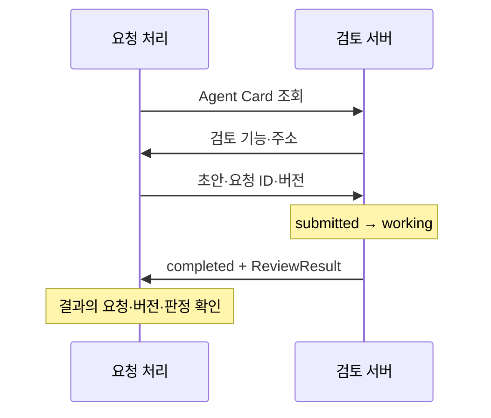

<div class="lec workshop-edition"><div class="deck">
<section class="slide">
<div class="eyebrow">2026.09 · 개인 실습 · 65분 · 개념 25 / 함께 15 / 개인 15 / 풀이 10</div>

# A2A 위임과 ACP의 연결 대상

<p class="lead">요청 처리와 검토를 다른 프로세스로 나눕니다. 접수·진행·완료 상태와 실제 검토 결과를 함께 확인합니다.</p>

<div class="cue"><div class="cue-body">모든 명령은 <code>workshop</code> 폴더에서 실행합니다. 처음이라면 <a href="./start">시작 안내</a>를 먼저 확인합니다. 앞 모듈을 끝내지 못해도 이 모듈의 제공 코드에서 시작할 수 있습니다.</div></div>
</section>

<section class="slide">

## 도구와 독립 Agent · 7분

함수로 충분한 검토를 무조건 별도 Agent로 나눌 필요는 없습니다. 독립 배포·권한·정보 경계를 가진 시스템에 일을 맡기는 경우에는 발견·작업 상태·산출물을 전달할 규약이 필요합니다.

MCP는 도구 사용, A2A는 독립 Agent 또는 agentic system의 작업 위임에 초점을 둡니다. 이 예제의 검토 서버는 기본 모드에서 정책 근거를 검사하는 규칙 시스템이며 실제 LLM 판단이라고 부르지 않습니다. live 모드에서는 모델의 표현 검토를 추가하지만 기본 합격 판정은 규칙 검사입니다.

</section>

<section class="slide">

## Card·Task·Artifact · 10분

Agent Card에는 이름·접속 위치·기능이 있습니다. Task는 맡긴 작업의 상태, Artifact는 그 작업이 만든 산출물입니다. “요청을 받았다”는 것과 “검토가 끝났다”는 것은 다릅니다.



동기 대기 방식에서는 중간 상태가 개별 응답으로 모두 보이지 않을 수 있습니다. 이 예제도 최종 Task를 받으며, working·실패 처리 연습은 고정 사례로 따로 합니다.

<<< ../../workshop/course/a2a_lab.py#delegate{python}

네트워크 오류·timeout은 완료로 간주하지 않습니다. `completed`인 작업의 검토 판정이 false일 수도 있습니다. “검토 작업을 완료했다”와 “초안이 통과했다”는 서로 다른 사실입니다.

</section>

<section class="slide">

## ACP를 구분합니다 · 5분

| 이름 | 연결 대상 | 이 수업에서의 위치 |
|---|---|---|
|MCP|애플리케이션과 도구 서버|정책 조회|
|A2A|독립 Agent/시스템 간 작업 위임|원격 검토|
|Agent Communication Protocol|Agent 상호 운용|공식 사이트가 A2A 합류를 안내. 기존 개념과 이동 관계 이해|
|Agent Client Protocol|에디터/IDE와 코딩 Agent|개발 도구가 Agent를 사용하는 경계 이해|

두 ACP는 이름의 약자가 같지만 같은 프로토콜이 아닙니다. A2A의 다른 이름으로 설명하지 않습니다. 기본 과정은 연결 대상과 선택 기준을 배우며 ACP 서버를 별도로 구현하지 않습니다.

</section>

<section class="slide">

## 결과 계약 · 3분

<<< ../../workshop/course/a2a_lab.py#result{python}

완료 상태에서 요청 ID·실행안 버전·passed를 확인합니다. 이전 실행안의 검토 결과를 현재 실행안에 붙이지 않습니다. 검토 통과가 사람의 실행 승인을 대체하는 것도 아닙니다.

</section>

<section class="slide">

## 함께 실습 · 15분

```bash
uv run python -m course.cli a2a --mode fixed
uv run python -m course.cli a2a --topic 계정 --mode fixed
```

Card 이름, state=completed, artifact.request_id/version/passed, decision=accepted를 확인합니다. 고정 검토와 실제 HTTP 왕복이 함께 사용됩니다.

live 사용 가능 시 `--mode live`로 실행하면 artifact.model_note에 실제 모델의 표현 검토가 추가됩니다. 이 문장이 있다고 기본 규칙 검사를 대체하지 않습니다.

</section>

<section class="slide">

## 개인 과제 · 15분

**기본:** `review_decision`을 고칩니다. submitted/working이면 pending, completed이고 artifact.passed가 참이면 accepted, 나머지는 held입니다.

<<< ../../workshop/exercises/student.py#a2a{python}

```bash
uv run python -m exercises.check a2a
```

**확장:** 확장 함수에서 요청 ID와 버전을 검사합니다. 작업 완료인데 결과가 없거나 다른 버전이면 보류하는 테스트를 작성합니다. timeout을 성공으로 바꾸는 예외 처리를 넣지 않습니다.

확장 시작 파일은 `exercises/extensions.py`의 `review_version(state, artifact, request_id, version)`입니다. 기본 함수의 인자는 바꾸지 않습니다. `request_id`와 `version`은 A2A 요청자가 기대하는 값이며 artifact 안의 값과 비교합니다.

```bash
uv run python -m exercises.extension_check a2a
uv run python -m exercises.extension_check a2a --solution
```

기대 요청 req-1·버전 2와 일치하는 완료 artifact는 accepted, req-2 또는 버전 3을 기대하면 held, working은 pending입니다. 새 함수의 인자로 기대값을 받으므로 기본 과제 함수를 변경하지 않습니다.

시작 코드는 FAIL이 정상입니다. 첫 명령으로 자신의 구현을 검사하고, 풀이 시간에 `exercises/extension_solutions.py`의 같은 함수를 열어 비교합니다. 정상·실패 사례는 `exercises/extension_check.py`에서 확인합니다.

<details><summary>힌트</summary>

상태부터 구분한 뒤 완료인 경우에만 artifact를 읽습니다. `passed`가 문자열 `"true"`인 경우와 실제 불리언 `True`인 경우도 구분합니다.

</details>

</section>

<section class="slide">

## 풀이 · 10분

```bash
uv run python -m exercises.check a2a --solution
```

항상 accepted를 반환하면 진행 중·실패·결과 누락까지 성공으로 처리합니다. 검토가 끝났어도 내용이 통과하지 않으면 held입니다. 원격 호출은 일반 함수보다 실패 조건이 많으므로 분리할 이유를 함께 설명합니다.

참고: [A2A Core Concepts](https://a2a-protocol.org/latest/topics/key-concepts/), [Communication ACP](https://agentcommunicationprotocol.dev/introduction/welcome), [Client ACP](https://agentclientprotocol.com/get-started/introduction).

</section>

<nav class="chapnav"><a href="../toc">전체 목차</a></nav>
</div></div>
