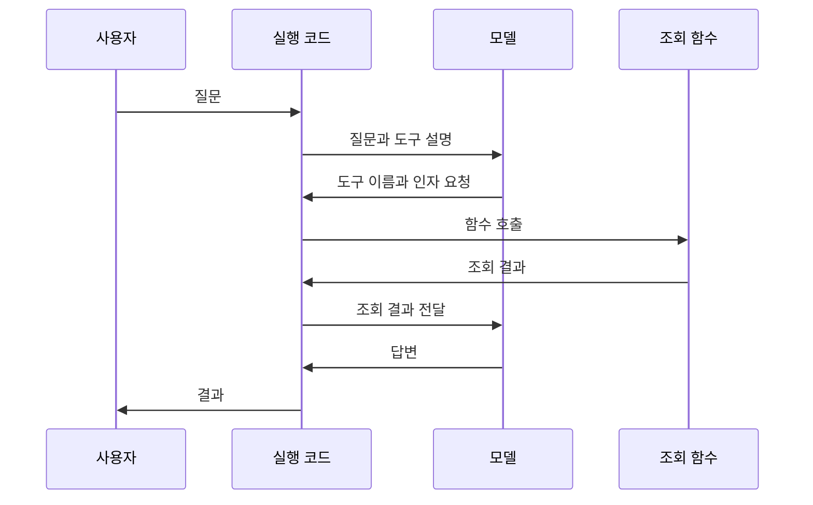

<section class="slide">

2026.09 · 개인 실습 · 30분 · 개념 25 / 확인 5

# Agent는 어떻게 실행되는가

한 번 답하는 모델과 여러 단계를 실행하는 프로그램을 구분합니다. 도구 실행을 누가 담당하는지부터 확인합니다.

모든 명령은 <code>workshop</code> 폴더에서 실행합니다. 처음이라면 <a href="./start">시작 안내</a>를 먼저 확인합니다. 앞 모듈을 끝내지 못해도 이 모듈의 제공 코드에서 시작할 수 있습니다.

</section>

<section class="slide">

## 한 번의 호출과 반복 실행

LLM은 입력을 받아 응답을 생성합니다. 회사 내부 정책이나 현재 시스템 상태를 항상 알고 있는 것은 아닙니다. 프로그램은 필요한 정보를 도구로 조회한 뒤 모델 입력에 추가할 수 있습니다.

고정 workflow는 미리 정한 순서대로 함수를 실행합니다. Agent에서는 모델이 사용할 도구나 다음 조사 대상을 선택하는 구간이 있습니다. 모든 단계를 모델에 맡길 필요는 없습니다. 승인·실행 횟수·종료 조건은 코드로 통제할 수 있습니다.

| 방식 | 예 | 다음 단계의 결정 |
|---|---|---|
| 단일 모델 호출 | 이미 제공된 규정을 요약 | 추가 조회 없음 |
| 고정 workflow | 입력 검사→정책 조회→답변 | 코드 |
| Agent | 어떤 정책을 더 조회할지 선택 | 일부는 모델, 제어 조건은 코드 |

**생각해 보기:** 이미 정해진 담당 팀 표에서 값을 찾는 일에 반드시 Agent가 필요한가요? 조회 자체는 함수로 충분합니다. 이 수업에서는 모델이 질문을 받아 도구를 선택하는 실행 구조를 배우기 위해 작은 표를 사용합니다.

</section>

<section class="slide">

## 모델은 함수를 직접 실행하지 않습니다

도구 호출 요청에는 어떤 함수를 어떤 값으로 부를지가 들어 있습니다. 실제 함수 실행은 프로그램이 수행합니다. 조회 결과는 다음 모델 입력에 포함됩니다. 모델이 바로 답하거나 도구를 여러 번 호출할 수도 있습니다.

입력·도구 결과·중간 판단을 모델이 볼 수 있게 모은 내용이 컨텍스트입니다. 실행 기록인 trace는 어떤 입력과 호출로 결과에 도달했는지 확인하는 자료입니다. 최종 답변만 읽으면 조회가 실제 일어났는지 알 수 없습니다.

</section>

<section class="slide">

## 오늘 배울 개념의 관계

LangChain은 모델·도구 인터페이스와 Agent 구성을 제공합니다. LangGraph는 상태와 실행 순서를 직접 표현하는 데 사용합니다. LangChain의 Agent도 LangGraph 실행 기반을 사용하므로 두 도구를 단순 경쟁 제품으로 보지 않습니다.

Harness는 모델 주변의 컨텍스트·도구·상태·권한·실행 제어를 묶어 말하는 개념입니다. DeepAgents는 이를 구성한 프레임워크입니다. Loop Engineering은 반복 중 무엇을 관찰하고 다음 입력을 어떻게 바꾸며 언제 멈출지 설계하는 활동으로 사용합니다.

MCP와 A2A는 연결 규약입니다. MCP는 도구·데이터 접근, A2A는 독립 Agent의 작업 위임에 초점을 둡니다. 프레임워크 내부의 함수를 두 개로 나눴다고 A2A가 되는 것은 아닙니다.

</section>

<section class="slide">

## 확인 문제 · 5분

1. 모델이 `lookup_policy` 호출 요청을 반환하면 조회가 이미 완료됐나요?
2. 한 번의 모델 호출과 Agent 실행 기록의 차이는 무엇인가요?
3. “최대 두 번 수정”이라는 지시문만으로 횟수 상한을 보장할 수 있나요?

풀이

1. 실행 코드가 함수를 호출해야 완료됩니다.
2. Agent 실행에는 도구 요청·함수 결과·다음 모델 호출 등이 포함될 수 있습니다.
3. 지시문은 모델에 요청하는 것이고 코드의 횟수 검사와 다릅니다. 뒤 모듈에서 직접 구현합니다.

참고: [LangChain Agents](https://docs.langchain.com/oss/python/langchain/agents).

</section>

<nav class="chapnav"><a href="../toc">전체 목차</a></nav>

