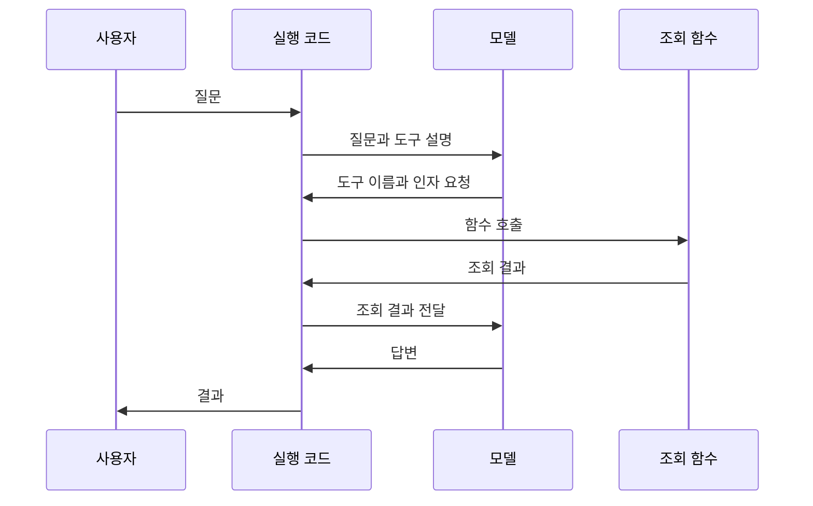

<div class="lec workshop-edition"><div class="deck">
<section class="slide">
<div class="eyebrow">2026.09 · 예상 09:40–10:30 · 50분</div>

# Agent는 어떻게 실행되는가

<p class="lead">ReAct의 판단·행동·관찰을 업무 사례로 따라갑니다. 실제 도구 호출 기록과 연결한 뒤, 다른 연구 접근과 Harness가 각각 무엇을 다루는지 비교합니다.</p>

이 장에서는 코드를 새로 작성하지 않습니다. 제공된 예제를 실행하고 기록을 읽습니다. 마칠 때는 **관찰에 따라 다음 행동이 달라지는 이유를 설명하고, 실제 도구 요청·결과를 구분하며, ReAct와 Harness의 관계를 설명할 수 있어야 합니다.**

<div class="cue"><div class="cue-body">먼저 <a href="./start">시작 안내</a>에서 환경 준비와 실제 모델 호출을 완료합니다. 이 장의 명령은 <code>workshop</code> 폴더에서 실행합니다. 이미 생성한 <code>runs/langchain.json</code>이 있다면 첫 관찰에 사용할 수 있습니다.</div></div>
<details class="instructor-note"><summary>강사용 예상 시간 · 09:40–10:30 / 50분</summary>

**예상 배분:** 각 소제목 아래의 소요 시간과 예상 시각을 참고합니다. 시작 질문도 세션 시간에 포함됩니다. 현장 실측이 아닌 진행 기준이며 학습자의 반응에 따라 조절합니다.

시간이 부족하면 JSON 표기 설명과 두 번째 예제 실행을 줄입니다. 관찰에 따른 행동 변화와 ReAct·Harness 구분은 유지합니다.

</details>

</section>

<section class="slide" id="icebreaker">

## 시작 질문 · 출장 호텔을 찾았는데, 모두 만실이라면?

<p class="section-time">예상 3분 · 09:40–09:43</p>

“내일 부산역 근처에서 10만 원 이하 호텔을 찾아줘”라고 부탁했습니다. 검색해 보니 조건에 맞는 호텔은 모두 만실입니다.

**사람이 이 일을 맡았다면 다음에 어떻게 할까요?**

역에서 조금 먼 곳을 찾아볼 수도 있고, 예산을 올려도 되는지 물어볼 수도 있습니다.

**AI에게도 검색 결과를 보고 다음 행동을 고르게 할 수 있을까요?** 이 장에서는 그 과정을 배웁니다.

최근 LangChain의 Loop Engineering 글도 모델이 도구를 사용하고 결과를 받는 반복을 기본 실행 구조로 설명합니다. [2026-06-16 · 개발사 기술 해설](https://www.langchain.com/blog/the-art-of-loop-engineering)

ReAct는 행동의 결과를 보고 다음 행동을 정하는 대표적인 연구 접근입니다. 호텔 사례에서 본 흐름을 다음 절에서는 사내 규정 조회에 적용해 봅니다. [ReAct 원논문 · ICLR 2023](https://react-lm.github.io/)

<details class="instructor-note"><summary>강사용 진행 노트 · 시작 질문</summary>

호텔이 모두 만실일 때 할 행동을 한두 가지 듣습니다. 답이 바로 나오면 “예산을 마음대로 올려도 될까요?”라고 물어봅니다. 다른 지역을 조회하는 행동과 사용자의 허락이 필요한 조건 변경을 구분한 뒤, “AI도 결과를 받아 다음 행동을 고를 수 있습니다”로 연결합니다. 호텔 예약은 설명용 상황이며 실제 예약 실습은 아닙니다.

</details>

</section>

<nav class="lesson-nav" aria-label="학습 단계"><a href="#react">01 ReAct</a><a href="#concept">02 모델과 도구</a><a href="#observe">03 기록 읽기</a><a href="#judgment">04 판단 위임</a><a href="#alternatives">05 다른 접근</a><a href="#checkpoint">06 확인 문제</a></nav>

<section class="slide" id="react">

## ReAct: 행동 결과를 보고 다음 행동을 정합니다

<p class="section-time">예상 12분 · 09:43–09:55</p>

<CourseVisual kind="agent" />

*선택 안내는 [Anthropic의 workflow·Agent 비교](https://www.anthropic.com/engineering/building-effective-agents)를 바탕으로 이 수업의 사례에 맞게 정리했습니다. 같은 업무에서 결과·비용·지연을 직접 비교해야 합니다.*


Agent는 ReAct보다 넓은 개념입니다. 이 과정에서는 모델이 도구를 사용하고 결과를 보며 다음 행동을 선택하는 LLM Agent를 다룹니다. ReAct는 그 구조를 이해하기 위한 대표적인 연구 접근입니다.

|구성|다음 행동을 정하는 방식|규정 문의의 예|
|---|---|---|
|단발 모델 호출|주어진 입력으로 응답하고 종료|붙여 준 규정 요약|
|고정 workflow|개발자가 정한 순서와 분기 실행|업무명 조회 후 정해진 형식으로 출력|
|ReAct 방식 Agent|모델이 관찰을 참고해 다음 행동 선택|검색 결과가 부족하면 다른 조회나 추가 질문 선택|

고정 workflow에도 반복과 조건 분기가 있을 수 있습니다. 반복 횟수만으로 Agent 여부를 구분하지 않습니다. 모델이 어떤 선택을 맡는지가 핵심입니다.

### 한 사례를 끝까지 따라갑니다

“출장 숙박비 18만 원을 정산할 수 있나요?”라는 문의를 가정합니다. 아래는 **설명을 위해 구성한 사례이며 실제 실습 로그나 모델 내부 사고 기록이 아닙니다.** 현재 실습의 조회 도구에 이 출장 규정이 들어 있다는 뜻도 아닙니다.

|단계|예시|역할|
|---|---|---|
|판단|금액만으로 결정할 수 없으므로 숙박비 규정이 필요함|다음 행동 선택|
|Action|숙박비 규정 조회 요청|모델이 도구와 인자 선택|
|Observation|지역에 따라 한도가 다르다는 규정 반환|프로그램이 도구를 실행한 결과|
|다음 판단|출장 지역이 없으므로 추가 정보가 필요함|관찰을 반영해 계획 변경|
|응답|출장 지역을 사용자에게 질문|이번 실행을 마치고 사용자 응답 대기|

만약 조회 결과가 “지역에 관계없이 한도 20만 원”이었다면 다음 행동은 달라질 수 있습니다. **관찰을 읽고 다음 선택을 바꾸는 연결**이 중요합니다.

ReAct 원논문은 Thought·Action·Observation을 번갈아 쓰는 방식을 다룹니다. 현대 도구 호출 API에서는 도구 요청과 반환값을 관찰할 수 있지만, 그 기록이 모델의 내부 추론 전체를 보여 주는 것은 아닙니다.

### 반복은 언제 끝나나요?

모델이 도구 요청 대신 최종 응답을 내면 기본 도구 호출 루프가 끝날 수 있습니다. 하지만 모델의 종료 판단과 업무의 성공은 다릅니다. 근거 없는 답변으로 끝날 수도 있습니다. 프로그램은 실행 상한, 허용 도구, 오류 처리와 필요한 승인 조건을 별도로 관리해야 합니다.

같은 질문을 실패할 때마다 그대로 다시 보내는 재시도와도 구분합니다. ReAct에서 중요한 것은 이전 관찰이 다음 판단에 반영되는가입니다. 그렇다고 매번 두 번 이상 도구를 써야 하는 것은 아닙니다.

**함께 생각하기:** “숙박비 18만 원을 정산할 수 있나요?”라고 물었습니다. 조회 결과가 아래와 같다면 어떻게 답하면 좋을까요?

- **“서울은 20만 원, 다른 지역은 15만 원까지”** — 사용자에게 무엇을 더 물어봐야 할까요?
- **“모든 지역에서 20만 원까지”** — 주어진 정보로 답할 수 있을까요?
- **“서버 연결 실패”** — 규정이 없다고 답해도 될까요?

<details><summary>함께 확인할 답</summary>

첫 번째는 출장 지역을 더 물어봐야 합니다. 두 번째는 이 예시에서 주어진 금액 한도 안에 들어갑니다. 세 번째는 규정을 확인하지 못한 것이므로, 규정이 없다고 단정할 수 없습니다. 같은 질문이어도 조회 결과에 따라 다음 행동이 달라집니다.

</details>

<aside class="discussion-prompt"><strong>생각거리 · 여유가 있으면 +3분</strong><p>정산 문의가 올 때마다 규정을 조회하도록 만들었습니다. 그런데 사용자가 “고마워”라고 해도 조회합니다.<br><br><strong>필요할 때만 모델이 조회하게 할까요?</strong> 반대로, 꼭 조회해야 하는 문의에서 모델이 조회를 건너뛰면 어떻게 해야 할까요?</p></aside>

<details class="instructor-note"><summary>강사용 토론 길잡이</summary>

“고마워”에는 조회가 필요하지 않을 수 있지만, 규정 문의에는 조회가 필요합니다. 먼저 두 입력을 구분해 봅니다. 지시만으로 조회를 빠뜨리지 않을 수 있는지 묻고, 반드시 지켜야 할 요구라면 실행 코드의 확인도 필요하다고 연결합니다.

한 답을 빨리 받기보다, 반대 선택이 더 나아지는 조건을 하나 더 묻습니다. 별도 기록이나 제출은 요구하지 않습니다. 기본 배정에 추가하는 선택 활동이므로 다음 섹션의 시간을 조절합니다.

</details>

</section>

<section class="slide" id="concept">

<aside class="teacher-aside"><strong>강사의 한마디</strong><p>답변이 자연스럽다고 도구를 제대로 사용한 것은 아닙니다. 마지막 문장보다 실제 조회 결과를 먼저 보겠습니다.</p></aside>


## 모델은 무엇을 받아 답하는가

<p class="section-time">예상 3분 · 09:55–09:58</p>

“정산 문의는 어느 팀에 해야 하나요?”라는 질문을 받았습니다. 사람이라면 사내 규정을 찾거나 담당자에게 물어볼 수 있습니다. 모델에도 그 정보를 얻을 경로가 필요합니다. 모델이 회사 이름을 안다고 해서 내부 규정까지 알고 있는 것은 아닙니다.

LLM은 입력을 토큰이라는 단위로 처리하고 문맥에 맞는 다음 토큰을 생성하며 응답을 만듭니다. 토큰은 글자나 단어와 정확히 일치하는 단위가 아닙니다. 이 장에서 토큰 개수를 계산할 필요는 없습니다. 모델이 한 번에 처리하는 입력과 출력의 양에 한계가 있다는 점을 기억합니다.

프로그램이 모델에 전달하는 것은 사용자 질문만이 아닙니다. 이번 예제의 입력에는 다음이 포함됩니다.

| 구성 | 이번 예제의 내용 | 역할 |
|---|---|---|
|지시문|규정을 조회하고 담당 팀과 근거 ID를 답하기|어떻게 응답할지 요청|
|사용자 메시지|`topic`이 `정산`인 문의|처리할 대상 전달|
|도구 설명|업무 주제로 사내 정책을 찾는 `lookup_policy`|어떤 도구를 사용할 수 있는지 안내|
|도구 실행 결과|조회 후 받은 정책 ID·담당 팀·규정|다음 응답에 사용할 근거 제공|

처음 모델을 호출할 때는 아직 조회 결과가 없습니다. 도구를 실행하고 결과를 돌려준 뒤의 호출은 처음과 다른 정보를 받습니다. 도구의 존재를 알리는 것과 실제 규정 내용을 주는 것은 서로 다른 단계입니다.

응답 역시 최종 문장만 있는 것은 아닙니다. 모델은 “이 도구를 이 입력값으로 호출해 달라”는 요청을 반환할 수 있습니다. 프로그램이 그 요청을 실행하고 다시 모델을 호출하면 여러 단계의 작업이 됩니다.

</section>

<section class="slide">

## 정보가 부족할 때 생기는 네 가지 문제

<p class="section-time">예상 3분 · 09:58–10:01</p>

모델이 아는 내용과 이번 실행에서 확인한 사실을 구분합니다. 그 차이를 놓치면 자연스러운 답변을 올바른 업무 처리로 착각할 수 있습니다.

| 문제 | 정산 문의에서의 예 | 프로그램에서 할 일 |
|---|---|---|
|내부·최신 정보가 없음|담당 팀이 바뀌었는데 이전 팀을 답함|현재 정책을 조회해 입력에 포함|
|이전 대화가 다음 호출에 전달되지 않음|앞에서 말한 업무 주제가 빠짐|필요한 메시지와 상태를 보관하고 다시 전달|
|처리할 수 있는 문맥의 양에 한계가 있음|관련 없는 문서까지 한꺼번에 넣음|현재 질문에 필요한 자료를 골라 전달|
|주어진 근거를 잘못 사용함|도구가 P-01을 줬는데 답변은 P-02라고 함|반환값과 답변을 대조하고 필요하면 보류|

학습 시점 이후의 정보뿐 아니라 공개되지 않은 사내 자료도 모델에 없을 수 있습니다. 최신 모델로 바꾸는 것만으로 사내 정책 연결을 대신할 수는 없습니다.

대화형 앱에서 앞말을 기억하는 것처럼 보이는 이유도 살펴봅니다. 앱이 이전 메시지를 다시 보내거나 저장한 상태를 찾아 넣을 수 있습니다. 모델 호출 자체와 앱이 관리하는 대화·저장 기능을 구분해야 합니다.

컨텍스트는 이번 모델 호출이 참고할 수 있도록 제공한 문맥입니다. trace는 실행이 어떻게 진행됐는지 남긴 기록입니다. 잠시 뒤 [실제 추적 화면](#trace-ui)을 보며 읽는 방법을 확인합니다. 파일에 기록이 남았다는 이유로 그 내용이 다음 모델 입력에 자동으로 들어가지는 않습니다.

**생각해 보기:** 도구가 정확한 정책을 반환하면 최종 답변도 정확하다고 할 수 있을까요? 조회 결과를 잘못 요약하거나 다른 팀을 답할 가능성이 남습니다. 뒤 실습에서는 조회 성공과 답변의 일치를 따로 확인합니다.

</section>

<section class="slide">

## 도구 설명·호출 요청·실행 결과

<p class="section-time">예상 4분 · 10:01–10:05</p>

이번 조회 도구는 업무 주제 `topic`을 입력받아 정책을 반환합니다. 모델이 보는 도구 설명에는 이름, 용도, 입력 형식이 있습니다. 함수 본문을 읽고 임의로 실행하는 방식은 아닙니다.

| 구분 | 이번 예제에서 찾을 것 | 만드는 주체 |
|---|---|---|
|도구 정의|`lookup_policy`, 용도 설명, 문자열 입력 `topic`|개발자가 코드로 작성|
|호출 요청|`name: lookup_policy`, `args: {topic: 정산}`|모델이 생성|
|실행 결과|`found`, `policy.id`, `policy.team`|프로그램이 조회 함수를 실행해 반환|

`args`는 함수를 실행할 때 넣을 값입니다. JSON이나 dict 표기가 낯설다면 `topic`이라는 이름에 `정산`이라는 값이 들어간다고 읽으면 됩니다. 입력 형식인 schema는 이런 이름과 타입을 설명합니다. 형식이 맞아도 조회한 내용이 업무상 올바른지는 별도로 확인합니다.



모델이 호출 요청을 반환한 시점에는 함수가 아직 실행되지 않았습니다. LangChain 실행 코드가 요청을 읽고 함수를 호출합니다. 반환값은 도구 메시지가 되어 모델에 전달되고 모델은 이를 참고해 다음 응답을 만듭니다.

도구를 등록했다고 매번 호출하는 것은 아닙니다. 모델은 바로 답할 수도 있고 여러 도구를 순서대로 요청할 수도 있습니다. 이 예제의 지시문은 정책 조회를 요청하지만 실제 호출 여부는 기록에서 확인합니다.

앞에서 본 ReAct의 Action은 여기서 도구 호출 요청, Observation은 도구 반환값에 대응합니다. 다음 모델 호출에 반환값을 전달해야 결과를 참고한 다음 선택이 가능합니다. 다음 LangChain 장에서는 이 연결을 `create_agent`로 구성합니다.

</section>

<section class="slide" id="observe">

## 실제 기록에서 조회의 근거를 찾습니다

<p class="section-time">예상 5분 · 10:05–10:10</p>

### trace는 이런 화면으로 볼 수 있습니다 {#trace-ui}

trace(실행 기록)는 질문 하나를 처리하는 동안 **어떤 단계를 거쳤고, 각 단계에 무엇을 넣어 어떤 결과를 받았는지** 남긴 기록입니다. 아래는 Langfuse 공식 문서에 공개된 화면입니다. 우리 정산 실습의 실행 결과는 아닙니다.

<figure class="trace-example">
<a href="https://langfuse.com/images/docs/tracing-overview.png" target="_blank" rel="noopener noreferrer"></a>
<figcaption>Langfuse 공식 예시 · 이미지를 누르면 원본을 크게 볼 수 있습니다. <a href="https://langfuse.com/docs/observability/overview" target="_blank" rel="noopener noreferrer">출처: Observability &amp; Application Tracing</a> · 확인 2026-09-08</figcaption>
</figure>

1. **왼쪽 목록:** 여러 번 실행한 기록 중 살펴볼 실행을 고릅니다.
2. **가운데 트리:** 한 실행 안에서 어떤 단계가 호출됐는지 봅니다. 들여쓰기는 상위 단계 안에서 호출된 하위 단계를 보여 줍니다.
3. **오른쪽 Input / Output:** 선택한 단계에 들어간 값과 나온 결과를 읽습니다. 화면에서는 `parse_artifacts`라는 처리 단계가 선택돼 있습니다.

모델 호출을 선택하면 기록된 프롬프트와 응답을, 도구 실행을 선택하면 기록된 인자와 반환값을 확인하는 식입니다. 어떤 항목이 보이는지는 애플리케이션에서 무엇을 기록했는지에 따라 달라집니다.

**예를 들어:** Agent가 엉뚱한 팀을 답했다면, 조회 도구가 잘못된 팀을 돌려줬는지부터 봅니다. 도구 결과는 맞았다면 그 결과를 받은 모델 응답을 확인합니다. 마지막 답변만 보는 대신 처음 어긋난 단계를 찾는 데 쓰는 화면입니다.

[LangSmith도 모델·도구 호출의 입력, 출력, 소요 시간 등을 살펴보는 화면을 제공합니다.](https://docs.langchain.com/langsmith/view-traces) 모델이 제공하고 애플리케이션이 기록한 reasoning/thinking 내용이 표시되는 경우도 있지만, **모델의 내부 추론 전체를 들여다보는 화면은 아닙니다.**

### 이번 실습에서는 JSON 파일로 같은 흐름을 읽습니다

오늘은 추적 서비스에 가입하거나 연결하지 않고 `runs/langchain.json`을 엽니다. 모델 요청·도구 결과·최종 답변을 찾는 연습은 같지만, 이 파일은 Langfuse 화면의 트리·시간·비용 정보를 모두 담은 기록은 아닙니다.

|화면에서 살펴볼 것|이번 실습 파일에서 찾을 것|
|---|---|
|모델이 요청한 도구와 인자|`ai` 항목의 `tool_calls`|
|도구가 실제 반환한 결과|`tool` 항목의 `content`|
|결과를 받은 뒤 모델의 답변|마지막 `ai` 항목의 `content`|

시작 안내에서 실행한 정산 기록이 있다면 그 파일을 엽니다. 없다면 다음 명령으로 실제 모델을 호출합니다. 연결에 실패하면 시작 안내에서 원인을 해결한 뒤 진행합니다.

<div class="command-purpose">완성 예제 실행</div>

```bash
uv run python -m course.cli langchain --topic 정산
```

편집기에서 `runs/langchain.json`을 엽니다. 가장 바깥의 `langchain` 안에 `trace`라는 목록이 있습니다. 각 항목의 `role`은 메시지 종류, `content`는 내용입니다. `tool_calls`가 있는 항목은 도구 호출 요청을 담고 있습니다.

다음 표는 **찾아야 할 항목의 안내**입니다. 실행 결과를 복사한 로그가 아닙니다. 자신의 파일에서 해당 부분을 찾아봅니다.

| 찾아야 할 항목 | 파일에서 읽을 위치 |
|---|---|
|무슨 문의였는가|human 메시지의 content|
|어떤 도구를 요청했는가|ai 메시지의 tool_calls 안 name|
|어떤 값으로 조회했는가|같은 요청의 args 안 topic|
|실제로 어떤 정책을 반환했는가|tool 메시지의 content 안 policy|
|답변의 팀·근거가 조회와 같은가|마지막 ai 메시지의 content|

<details><summary>JSON 표기와 메시지 필드가 낯설다면</summary>

tool 메시지의 `content`는 JSON 객체가 아니라 JSON을 담은 문자열입니다. 파일에서 `\"policy\"`처럼 보이는 역슬래시는 문자열 안의 따옴표를 표현합니다. 그 안의 `found`, `policy`, `id`를 읽습니다. 도구가 이스케이프 문자를 정책 내용으로 반환한 것은 아닙니다.

`human`은 사용자 메시지, `ai`는 모델 응답, `tool`은 도구 반환값입니다. 도구를 요청하는 ai 메시지는 `content`가 비어 있어도 `tool_calls`에 내용이 있을 수 있습니다. 빈 본문만 보고 호출 실패라고 판단하지 않습니다.

파일에는 실행을 읽기 쉽게 정리한 메시지가 있습니다. 모든 설정·네트워크 요청·시스템 지시를 빠짐없이 담은 원본 통신 기록은 아닙니다. 지시문은 `course/langchain_lab.py`의 `system_prompt`에서 따로 확인합니다. 지금은 코드를 수정하지 않습니다.

</details>

<details><summary>정산 기록을 읽는 기준</summary>

조회 입력이 정산이라면 도구 결과에서 P-01과 재무지원팀을 찾습니다. 최종 답변에도 그 근거가 맞게 사용됐는지 확인합니다. 모델의 문장이나 메시지 수가 다른 사람의 결과와 같을 필요는 없습니다.

최종 문장에 “조회했습니다”라고만 적혀 있는 것은 실제 조회의 증거가 아닙니다. `lookup_policy` 요청과 그 뒤의 tool 반환값을 찾아야 합니다. 요청만 있고 결과가 없다면 함수를 성공적으로 실행했는지 아직 확인하지 못한 것입니다.

</details>

</section>

<section class="slide">

## 등록되지 않은 업무로 바꿔 봅니다

<p class="section-time">예상 3분 · 10:10–10:13</p>

이번에는 입력을 `없는업무`로 바꿉니다. 실행 전에 어떤 단계는 그대로이고 어떤 결과는 달라질지 예상합니다. 기존 `langchain.json`은 덮어쓰므로 정산 기록을 남기려면 편집기에서 다른 이름으로 저장합니다.

<div class="command-purpose">완성 예제 실행</div>

```bash
uv run python -m course.cli langchain --topic 없는업무
```

새 파일에서 도구 요청의 `topic`, tool 결과의 `found`와 `policy`, 최종 답변을 차례로 찾습니다. 정책을 찾지 못한 경우에도 함수 호출 자체는 정상적으로 끝날 수 있습니다.

| 실행 전 예상 | 실행 후 확인 |
|---|---|
|조회 도구를 요청할까요?|실제 tool_calls 유무를 기록|
|정책이 없으면 무엇을 반환할까요?|found와 policy 값을 기록|
|어떤 답변이 적절할까요?|임의의 담당 팀을 만들었는지 확인|

<details><summary>없는 업무와 흔한 오답 풀이</summary>

조회가 실행됐다면 도구 결과는 `found=false`, `policy=null`입니다. 이때는 등록된 정책이 없어 추가 확인이 필요하다는 답변이 적절합니다. 실제 모델이 다른 답을 냈다면 정상 사례로 고쳐 적지 않고 반환값과 답변의 차이를 기록합니다.

| 오답 판단 | 놓친 사실 | 다시 볼 곳 |
|---|---|---|
|“정책이 없으니 API 오류다.”|정상 조회의 결과가 없음일 수 있습니다.|tool 결과의 found와 오류 메시지를 구분|
|“답변에 팀 이름이 있으니 성공이다.”|없는 정책에서 팀을 만들어 냈을 수 있습니다.|tool의 policy와 최종 답변 대조|
|“같은 프롬프트이니 조회 결과도 같다.”|사용자 입력 topic이 달라졌습니다.|human 내용과 호출 args|
|“도구를 불렀으니 답변 검사는 끝났다.”|올바른 결과를 답변에서 왜곡할 수 있습니다.|근거 ID·팀·문장 의미|

</details>

두 결과에서 “모델이 선택한 것”과 “프로그램이 실행한 것”을 구분해 봅니다. 각각에 해당하는 trace를 찾았다면 다음 장의 코드를 읽을 준비가 됩니다.

</section>

<section class="slide" id="judgment">

## 어떤 판단을 모델에 맡길 것인가

<p class="section-time">예상 5분 · 10:13–10:18</p>

한 번의 모델 호출로 주어진 문서를 요약할 수 있습니다. 정해진 단계가 있으면 코드로 순서를 연결하는 workflow를 만들 수 있습니다. 어떤 정보를 더 조회할지 상황에 따라 선택해야 한다면 Agent 구성을 고려합니다.

Agent도 첫 호출에서 끝날 수 있습니다. 호출을 여러 번 했다는 사실만으로 Agent인지 판정하지 않습니다. **다음 행동을 누가 정하는지**를 봅니다.

| 요청 | 먼저 고려할 구성 | 이유 |
|---|---|---|
|“붙인 규정을 세 문장으로 요약해 주세요.”|단일 모델 호출|필요한 자료가 이미 있음|
|“정산 담당 팀을 표에서 찾아 주세요.”|조회 함수 또는 정해진 workflow|조회 순서를 미리 정할 수 있음|
|“정산 문제인지 계정 문제인지 확인해서 필요한 규정을 찾아 주세요.”|추가 질문·조회가 있는 workflow 또는 Agent|필요한 정보와 처리 경로가 달라질 수 있음|

마지막 요청도 처리 규칙이 명확하면 workflow로 충분할 수 있습니다. 모델에 선택을 맡기면 예상하지 못한 조회나 반복을 검토해야 하고, 호출이 늘면 지연과 비용도 늘어납니다. 단순한 구현으로 해결되는 부분부터 정하는 것이 좋습니다. [Anthropic의 구성 선택 기준](https://www.anthropic.com/engineering/building-effective-agents)

선택을 맡기는 것과 실행 권한을 맡기는 것도 구분합니다. 이 예제에는 정책 조회 도구만 있습니다. 모델이 답변에서 “담당자에게 전달했습니다”라고 써도 실제 메일을 보낸 것은 아닙니다. 전송하려면 전송 도구와 이를 허용하는 코드가 있어야 합니다.

**함께 생각하기:** Agent가 답장 초안을 만들었습니다. 사람이 읽고 승인한 뒤에만 메일을 보내야 합니다. 지시문에 “승인 전에는 보내지 마세요”라고 적으면 충분할까요? 메일을 보내는 코드에서 확인할 조건을 하나 말해 봅니다.

<details><summary>판단 위임 풀이</summary>

조회 대상을 고르거나 답변 초안을 만드는 일은 모델에 맡길 수 있습니다. 승인 여부 확인과 전송 허용은 프로그램이 검사해야 합니다. “승인 전에 보내지 마세요”라는 지시문만으로 실행을 차단했다고 보지는 않습니다.

현재 예제는 메일을 보내지 않습니다. 이후 LangGraph에서 정보와 상태를 보고 분기하는 구조, Harness에서 검토·반복 상한을 다룹니다. 그 구성이 있어야 모델의 제안을 실제 업무 조건 안에서 사용할 수 있습니다.

</details>

</section>

<section class="slide" id="alternatives">

## ReAct만 Agent인가요?

<p class="section-time">예상 8분 · 10:18–10:26</p>

그렇지 않습니다. 아래는 서로 배타적인 Agent 종류가 아니라, 서로 다른 설계 문제를 다룬 연구입니다. 한 시스템에서 결합할 수도 있습니다.

|연구|해결하려는 문제|ReAct와 비교할 점|
|---|---|---|
|[ReWOO](https://arxiv.org/abs/2305.18323)|매번 관찰을 포함해 판단하는 비용|계획·도구 실행·결과 종합을 분리합니다. 도구 결과 자체를 사용하지 않는다는 뜻은 아닙니다.|
|[Reflexion](https://arxiv.org/abs/2303.11366)|실패 경험을 다음 시도에 활용|피드백을 언어로 정리해 기억합니다. 모델 가중치를 학습시키는 방식이 아니며 ReAct와 결합할 수 있습니다.|
|[Generative Agents](https://arxiv.org/abs/2304.03442)|경험을 바탕으로 지속적인 행동 구성|기억 저장·검색, 성찰, 계획을 결합합니다. 인간 행동 시뮬레이션을 다룬 연구로, 업무 정확성을 보장하는 방법은 아닙니다.|

ReAct와 ReWOO는 이번 실행에서 판단과 도구 사용을 어떻게 배치하는지 비교하기 좋습니다. Reflexion은 시도 사이에서 어떤 피드백을 남길지, Generative Agents는 지속적인 기억과 행동을 어떻게 구성할지 보여 줍니다. 이는 수업을 위한 비교 관점이며 학계의 단일 표준 분류는 아닙니다.

**연구와 연결하기:** Agent가 지난번과 똑같이 오래된 규정을 골라 틀렸습니다. “다음에는 규정의 날짜부터 확인하자”는 피드백을 다음 시도에 전달하려 합니다. 위 표에서 이 문제를 다루는 연구를 찾아봅니다.

<aside class="discussion-prompt"><strong>생각거리 · 여유가 있으면 +3분</strong><p>Agent가 “기차표를 찾고, 호텔을 찾고, 여행 일정을 만든다”는 계획을 세웠습니다. 첫 조회에서 그날 기차가 모두 매진됐습니다.<br><br><strong>다음 단계인 호텔 조회를 계속할까요?</strong> 계획의 어느 부분부터 바꾸면 좋을까요?</p></aside>

<details class="instructor-note"><summary>강사용 토론 길잡이</summary>

기차 여행이 전제였다면 교통편부터 다시 확인해야 합니다. 다른 교통수단을 허용하는지 사용자에게 물을 수도 있습니다. 호텔을 먼저 찾아도 되는 상황과 비교하되 정해진 답 하나를 요구하지 않습니다.

한 답을 빨리 받기보다, 반대 선택이 더 나아지는 조건을 하나 더 묻습니다. 별도 기록이나 제출은 요구하지 않습니다. 기본 배정에 추가하는 선택 활동이므로 다음 섹션의 시간을 조절합니다.

</details>

### 다른 접근은 언제 검토할까요?

아래는 각 논문의 문제 설정을 바탕으로 정리한 **수업용 선택 기준**입니다. 뒤에 나온 방법이 항상 더 좋다는 순서는 아닙니다.

|접근|얻는 것|감수할 점·적용 조건|
|---|---|---|
|ReWOO|계획과 실행을 나누어 반복적인 모델 입력 비용을 줄이는 방향|실행 전 세운 계획의 전제가 틀리면 대응 방법이 필요합니다. 실제 업무에서도 비용·정확도를 비교해야 합니다.|
|Reflexion|실패 피드백을 다음 시도에 활용|피드백 자체가 틀릴 수 있고 추가 호출·기억 관리가 필요합니다. 유용한 실패 원인을 얻을 수 있을 때 검토합니다.|
|Generative Agents|기억을 검색하고 계획에 반영하는 지속적인 행동 구성|기억의 선택·갱신 관리가 필요합니다. 인간 행동 시뮬레이션 연구를 업무 정확성 보장으로 해석하지 않습니다.|

단일 정산 조회라면 이 기능들이 모두 필요하지 않습니다. 현재 방식이 어떤 입력에서 실패하는지 확인한 뒤, 그 실패를 해결할 방법을 선택합니다.

</section>

<section class="slide">

## 오늘 배울 개념의 관계

<p class="section-time">예상 2분 · 10:26–10:28</p>

LangChain은 모델·도구 인터페이스와 Agent 구성을 제공합니다. LangGraph는 상태와 실행 순서를 직접 표현하는 데 사용합니다. LangChain의 Agent도 LangGraph 실행 기반을 사용하므로 두 도구를 단순 경쟁 제품으로 보지 않습니다.

Harness는 모델 주변의 컨텍스트·도구·상태·권한·실행 제어를 묶어 말하는 개념입니다. DeepAgents는 이런 기능을 묶어 제공하는 Agent Harness 구현체입니다. ReAct와 경쟁하는 별개의 Agent 종류가 아닙니다. LangChain의 `create_agent`도 기본 실행 루프와 주변 구성을 제공하므로 Harness가 DeepAgents에서 처음 등장하는 것은 아닙니다. [공식 DeepAgents 설명](https://docs.langchain.com/oss/python/deepagents/overview)

최근 Loop Engineering 담론은 사람이 매번 코딩 에이전트에 다음 지시를 쓰던 일을 시스템에 맡기는 방향을 다룹니다. 작업 발견·배정·검증·기록·다음 실행을 설계하는 사례를 [Harness 모듈의 원문 비교](./engineering#distinction)에서 읽습니다.

MCP와 A2A는 연결 규약입니다. MCP는 도구·데이터 접근, A2A는 독립 Agent의 작업 위임에 초점을 둡니다. 프레임워크 내부의 함수를 두 개로 나눴다고 A2A가 되는 것은 아닙니다.

</section>

<section class="slide" id="checkpoint">

## 다음 장으로 넘어가기 전

<p class="section-time">예상 2분 · 10:28–10:30</p>

<details class="instructor-note"><summary>강사용 진행 노트 · 실행 결과 읽기</summary>

정산과 없는업무의 trace를 나란히 봅니다. 모델의 도구 요청과 함수의 반환을 각각 짚게 하고, 별도 파일에 옮겨 적도록 요구하지 않습니다.

</details>

1. 모델이 `lookup_policy` 호출 요청을 반환하면 조회가 이미 완료됐나요?
2. 실제 파일에서 도구 결과와 최종 답변의 근거가 같았나요? 어느 필드로 확인했나요?
3. “최대 두 번 수정”이라는 지시문만으로 횟수 상한을 보장할 수 있나요?

4. 도구 결과를 받을 때마다 다음 행동을 고르는 방식과, 먼저 계획을 세워 실행하는 방식은 각각 어느 연구와 연결되나요?
5. “ReAct 방식의 Agent를 DeepAgents로 만든다”는 설명이 가능한가요? 두 이름이 각각 무엇을 가리키는지 말해 봅니다.

<details><summary>풀이</summary>

1. 실행 코드가 함수를 호출해야 완료됩니다.
2. tool 메시지의 policy와 마지막 ai 메시지의 담당 팀·근거 ID를 대조합니다. 문장이 예시와 다른 것과 근거가 틀린 것을 구분합니다.
3. 지시문은 모델에 요청하는 것이고 코드의 횟수 검사와 다릅니다. 뒤 모듈에서 제공 루프의 종료 조건을 관찰합니다. 루프 전체를 직접 작성하는 것은 선택 심화입니다.
4. ReAct는 관찰을 받으며 다음 행동을 선택하고, ReWOO는 계획과 실행·결과 종합을 분리합니다. Reflexion은 다음 시도에 피드백을 기억하는 접근이므로 ReAct와 결합할 수 있습니다.
5. 비교하는 층위가 다릅니다. ReAct는 실행 접근이고 DeepAgents는 실행을 지원하는 Harness 구현체입니다.

</details>

[다음: LangChain으로 ReAct 실행 구성하기](./langchain)

참고: [LangChain Agents](https://docs.langchain.com/oss/python/langchain/agents).

</section>

<nav class="chapnav"><a href="../toc">전체 목차</a></nav>
</div></div>
