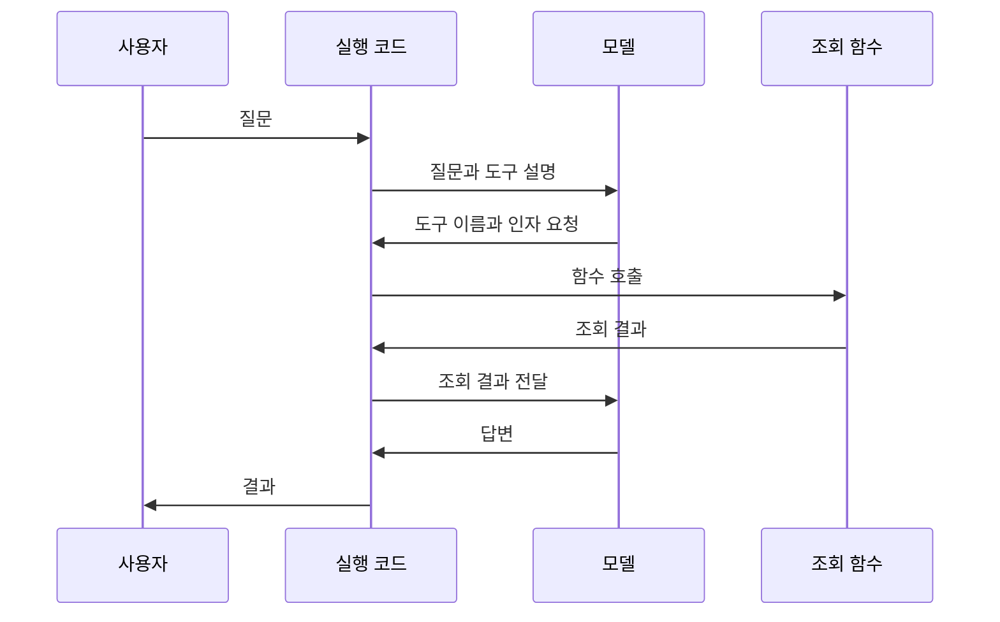

<div class="lec workshop-edition"><div class="deck">
<section class="slide">
<div class="eyebrow">2026.09 · 개념 설명 · 실제 실행 기록 읽기</div>

# Agent는 어떻게 실행되는가

<p class="lead">업무 규정을 묻는 질문 하나로 시작합니다. 모델이 받은 정보, 요청한 도구, 프로그램이 실행한 결과를 구분하고 답변의 근거를 확인합니다.</p>

이 장에서는 코드를 새로 작성하지 않습니다. 제공된 예제를 실행하고 기록을 읽습니다. 마칠 때는 **도구 요청과 실행 결과를 짚고, 답변이 그 결과와 맞는지 설명할 수 있어야 합니다.**

<div class="cue"><div class="cue-body">먼저 <a href="./start">시작 안내</a>에서 환경 준비와 실제 모델 호출을 완료합니다. 이 장의 명령은 <code>workshop</code> 폴더에서 실행합니다. 이미 생성한 <code>runs/langchain.json</code>이 있다면 첫 관찰에 사용할 수 있습니다.</div></div>
</section>

<nav class="lesson-nav" aria-label="학습 단계"><a href="#concept">01 모델과 도구</a><a href="#observe">02 기록 읽기</a><a href="#judgment">03 판단 위임</a><a href="#checkpoint">04 확인 문제</a></nav>

<section class="slide" id="concept">

## 모델은 무엇을 받아 답하는가

“정산 문의는 어느 팀에 해야 하나요?”라는 질문을 받았습니다. 사람이라면 사내 규정을 찾거나 담당자에게 물어볼 수 있습니다. 모델에도 그 정보를 얻을 경로가 필요합니다. 모델이 회사 이름을 안다고 해서 내부 규정까지 알고 있는 것은 아닙니다.

LLM은 입력을 토큰이라는 단위로 처리하고 문맥에 맞는 다음 토큰을 생성하며 응답을 만듭니다. 토큰은 글자나 단어와 정확히 일치하는 단위가 아닙니다. 이 장에서 토큰 개수를 계산할 필요는 없습니다. 모델이 한 번에 처리하는 입력과 출력의 양에 한계가 있다는 점을 기억합니다.

프로그램이 모델에 전달하는 것은 사용자 질문만이 아닙니다. 이번 예제의 입력에는 다음이 포함됩니다.

| 구성 | 이번 예제의 내용 | 역할 |
|---|---|---|
|지시문|규정을 조회하고 담당 팀과 근거 ID를 답하기|어떻게 응답할지 요청|
|사용자 메시지|`topic`이 `정산`인 문의|처리할 대상 전달|
|도구 설명|업무 주제로 사내 정책을 찾는 `lookup_policy`|어떤 도구를 사용할 수 있는지 안내|
|도구 실행 결과|조회 후 받은 정책 ID·담당 팀·규정|다음 응답에 사용할 근거 제공|

처음 모델을 호출할 때는 아직 조회 결과가 없습니다. 도구를 실행하고 결과를 돌려준 뒤의 호출은 처음과 다른 정보를 받습니다. 도구의 존재를 알리는 것과 실제 규정 내용을 주는 것은 서로 다른 단계입니다.

응답 역시 최종 문장만 있는 것은 아닙니다. 모델은 “이 도구를 이 입력값으로 호출해 달라”는 요청을 반환할 수 있습니다. 프로그램이 그 요청을 실행하고 다시 모델을 호출하면 여러 단계의 작업이 됩니다.

</section>

<section class="slide">

## 정보가 부족할 때 생기는 네 가지 문제

모델이 아는 내용과 이번 실행에서 확인한 사실을 구분합니다. 그 차이를 놓치면 자연스러운 답변을 올바른 업무 처리로 착각할 수 있습니다.

| 문제 | 정산 문의에서의 예 | 프로그램에서 할 일 |
|---|---|---|
|내부·최신 정보가 없음|담당 팀이 바뀌었는데 이전 팀을 답함|현재 정책을 조회해 입력에 포함|
|이전 대화가 다음 호출에 전달되지 않음|앞에서 말한 업무 주제가 빠짐|필요한 메시지와 상태를 보관하고 다시 전달|
|처리할 수 있는 문맥의 양에 한계가 있음|관련 없는 문서까지 한꺼번에 넣음|현재 질문에 필요한 자료를 골라 전달|
|주어진 근거를 잘못 사용함|도구가 P-01을 줬는데 답변은 P-02라고 함|반환값과 답변을 대조하고 필요하면 보류|

학습 시점 이후의 정보뿐 아니라 공개되지 않은 사내 자료도 모델에 없을 수 있습니다. 최신 모델로 바꾸는 것만으로 사내 정책 연결을 대신할 수는 없습니다.

대화형 앱에서 앞말을 기억하는 것처럼 보이는 이유도 살펴봅니다. 앱이 이전 메시지를 다시 보내거나 저장한 상태를 찾아 넣을 수 있습니다. 모델 호출 자체와 앱이 관리하는 대화·저장 기능을 구분해야 합니다.

컨텍스트는 이번 모델 호출이 참고할 수 있도록 제공한 문맥입니다. trace는 실행이 어떻게 진행됐는지 남긴 기록입니다. 파일에 기록이 남았다는 이유로 그 내용이 다음 모델 입력에 자동으로 들어가지는 않습니다.

**생각해 보기:** 도구가 정확한 정책을 반환하면 최종 답변도 정확하다고 할 수 있을까요? 조회 결과를 잘못 요약하거나 다른 팀을 답할 가능성이 남습니다. 뒤 실습에서는 조회 성공과 답변의 일치를 따로 확인합니다.

</section>

<section class="slide">

## 도구 설명·호출 요청·실행 결과

이번 조회 도구는 업무 주제 `topic`을 입력받아 정책을 반환합니다. 모델이 보는 도구 설명에는 이름, 용도, 입력 형식이 있습니다. 함수 본문을 읽고 임의로 실행하는 방식은 아닙니다.

| 구분 | 이번 예제에서 찾을 것 | 만드는 주체 |
|---|---|---|
|도구 정의|`lookup_policy`, 용도 설명, 문자열 입력 `topic`|개발자가 코드로 작성|
|호출 요청|`name: lookup_policy`, `args: {topic: 정산}`|모델이 생성|
|실행 결과|`found`, `policy.id`, `policy.team`|프로그램이 조회 함수를 실행해 반환|

`args`는 함수를 실행할 때 넣을 값입니다. JSON이나 dict 표기가 낯설다면 `topic`이라는 이름에 `정산`이라는 값이 들어간다고 읽으면 됩니다. 입력 형식인 schema는 이런 이름과 타입을 설명합니다. 형식이 맞아도 조회한 내용이 업무상 올바른지는 별도로 확인합니다.



모델이 호출 요청을 반환한 시점에는 함수가 아직 실행되지 않았습니다. LangChain 실행 코드가 요청을 읽고 함수를 호출합니다. 반환값은 도구 메시지가 되어 모델에 전달되고 모델은 이를 참고해 다음 응답을 만듭니다.

도구를 등록했다고 매번 호출하는 것은 아닙니다. 모델은 바로 답할 수도 있고 여러 도구를 순서대로 요청할 수도 있습니다. 이 예제의 지시문은 정책 조회를 요청하지만 실제 호출 여부는 기록에서 확인합니다.

이처럼 행동을 선택하고 실행 결과를 참고해 다음 행동을 정하는 흐름은 ReAct에서 다루는 핵심 패턴입니다. 다만 아래 trace로 모델의 내부 추론 전체를 볼 수 있는 것은 아닙니다. 실제 관찰 대상은 호출 요청·도구 결과·응답입니다. [ReAct 원문](https://arxiv.org/abs/2210.03629)

</section>

<section class="slide" id="observe">

## 실제 기록에서 조회의 근거를 찾습니다

시작 안내에서 실행한 정산 기록이 있다면 그 파일을 엽니다. 없다면 다음 명령으로 실제 모델을 호출합니다. 연결에 실패하면 시작 안내에서 원인을 해결한 뒤 진행합니다.

```bash
uv run python -m course.cli langchain --topic 정산
```

편집기에서 `runs/langchain.json`을 엽니다. 가장 바깥의 `langchain` 안에 `trace`라는 목록이 있습니다. 각 항목의 `role`은 메시지 종류, `content`는 내용입니다. `tool_calls`가 있는 항목은 도구 호출 요청을 담고 있습니다.

다음 표는 **찾아야 할 항목의 안내**입니다. 실행 결과를 복사한 로그가 아닙니다. 자신의 파일에서 해당 부분을 찾아 `runs/learning-notes.md`에 적습니다.

| 찾아야 할 항목 | 파일에서 읽을 위치 | 자신의 관찰 |
|---|---|---|
|무슨 문의였는가|human 메시지의 content|작성|
|어떤 도구를 요청했는가|ai 메시지의 tool_calls 안 name|작성|
|어떤 값으로 조회했는가|같은 요청의 args 안 topic|작성|
|실제로 어떤 정책을 반환했는가|tool 메시지의 content 안 policy|작성|
|답변의 팀·근거가 조회와 같은가|마지막 ai 메시지의 content|작성|

tool 메시지의 `content`는 JSON 객체가 아니라 JSON을 담은 문자열입니다. 파일에서 `\"policy\"`처럼 보이는 역슬래시는 문자열 안의 따옴표를 표현합니다. 그 안의 `found`, `policy`, `id`를 읽습니다. 도구가 이스케이프 문자를 정책 내용으로 반환한 것은 아닙니다.

`human`은 사용자 메시지, `ai`는 모델 응답, `tool`은 도구 반환값입니다. 도구를 요청하는 ai 메시지는 `content`가 비어 있어도 `tool_calls`에 내용이 있을 수 있습니다. 빈 본문만 보고 호출 실패라고 판단하지 않습니다.

파일에는 실행을 읽기 쉽게 정리한 메시지가 있습니다. 모든 설정·네트워크 요청·시스템 지시를 빠짐없이 담은 원본 통신 기록은 아닙니다. 지시문은 `course/langchain_lab.py`의 `system_prompt`에서 따로 확인합니다. 지금은 코드를 수정하지 않습니다.

<details><summary>정산 기록을 읽는 기준</summary>

조회 입력이 정산이라면 도구 결과에서 P-01과 재무지원팀을 찾습니다. 최종 답변에도 그 근거가 맞게 사용됐는지 확인합니다. 모델의 문장이나 메시지 수가 다른 사람의 결과와 같을 필요는 없습니다.

최종 문장에 “조회했습니다”라고만 적혀 있는 것은 실제 조회의 증거가 아닙니다. `lookup_policy` 요청과 그 뒤의 tool 반환값을 찾아야 합니다. 요청만 있고 결과가 없다면 함수를 성공적으로 실행했는지 아직 확인하지 못한 것입니다.

</details>

</section>

<section class="slide">

## 등록되지 않은 업무로 바꿔 봅니다

이번에는 입력을 `없는업무`로 바꿉니다. 실행 전에 어떤 단계는 그대로이고 어떤 결과는 달라져야 할지 적습니다. 기존 `langchain.json`은 덮어쓰므로 정산 기록을 남기려면 편집기에서 다른 이름으로 저장합니다.

```bash
uv run python -m course.cli langchain --topic 없는업무
```

새 파일에서 도구 요청의 `topic`, tool 결과의 `found`와 `policy`, 최종 답변을 차례로 찾습니다. 정책을 찾지 못한 경우에도 함수 호출 자체는 정상적으로 끝날 수 있습니다.

| 실행 전 예상 | 실행 후 확인 |
|---|---|
|조회 도구를 요청할까요?|실제 tool_calls 유무를 기록|
|정책이 없으면 무엇을 반환할까요?|found와 policy 값을 기록|
|어떤 답변이 적절할까요?|임의의 담당 팀을 만들었는지 확인|

<details><summary>없는 업무와 흔한 오답 풀이</summary>

조회가 실행됐다면 도구 결과는 `found=false`, `policy=null`입니다. 이때는 등록된 정책이 없어 추가 확인이 필요하다는 답변이 적절합니다. 실제 모델이 다른 답을 냈다면 정상 사례로 고쳐 적지 않고 반환값과 답변의 차이를 기록합니다.

| 오답 판단 | 놓친 사실 | 다시 볼 곳 |
|---|---|---|
|“정책이 없으니 API 오류다.”|정상 조회의 결과가 없음일 수 있습니다.|tool 결과의 found와 오류 메시지를 구분|
|“답변에 팀 이름이 있으니 성공이다.”|없는 정책에서 팀을 만들어 냈을 수 있습니다.|tool의 policy와 최종 답변 대조|
|“같은 프롬프트이니 조회 결과도 같다.”|사용자 입력 topic이 달라졌습니다.|human 내용과 호출 args|
|“도구를 불렀으니 답변 검사는 끝났다.”|올바른 결과를 답변에서 왜곡할 수 있습니다.|근거 ID·팀·문장 의미|

</details>

두 기록을 비교한 뒤 “모델이 선택한 것”과 “프로그램이 실행한 것”을 각각 한 문장으로 적습니다. 이 두 문장과 trace의 근거를 연결하면 다음 장의 코드를 읽을 준비가 됩니다.

</section>

<section class="slide" id="judgment">

## 어떤 판단을 모델에 맡길 것인가

한 번의 모델 호출로 주어진 문서를 요약할 수 있습니다. 정해진 단계가 있으면 코드로 순서를 연결하는 workflow를 만들 수 있습니다. 어떤 정보를 더 조회할지 상황에 따라 선택해야 한다면 Agent 구성을 고려합니다.

Agent도 첫 호출에서 끝날 수 있습니다. 호출을 여러 번 했다는 사실만으로 Agent인지 판정하지 않습니다. **다음 행동을 누가 정하는지**를 봅니다.

| 요청 | 먼저 고려할 구성 | 이유 |
|---|---|---|
|“붙인 규정을 세 문장으로 요약해 주세요.”|단일 모델 호출|필요한 자료가 이미 있음|
|“정산 담당 팀을 표에서 찾아 주세요.”|조회 함수 또는 정해진 workflow|조회 순서를 미리 정할 수 있음|
|“정산 문제인지 계정 문제인지 확인해서 필요한 규정을 찾아 주세요.”|추가 질문·조회가 있는 workflow 또는 Agent|필요한 정보와 처리 경로가 달라질 수 있음|

마지막 요청도 처리 규칙이 명확하면 workflow로 충분할 수 있습니다. 모델에 선택을 맡기면 예상하지 못한 조회나 반복을 검토해야 하고, 호출이 늘면 지연과 비용도 늘어납니다. 단순한 구현으로 해결되는 부분부터 정하는 것이 좋습니다. [Anthropic의 구성 선택 기준](https://www.anthropic.com/engineering/building-effective-agents)

선택을 맡기는 것과 실행 권한을 맡기는 것도 구분합니다. 이 예제에는 정책 조회 도구만 있습니다. 모델이 답변에서 “담당자에게 전달했습니다”라고 써도 실제 메일을 보낸 것은 아닙니다. 전송하려면 전송 도구와 이를 허용하는 코드가 있어야 합니다.

**판단 문제:** “정산 규정을 조회한 뒤 메일을 보내되, 사람이 승인하기 전에는 전송하지 않는다”는 요구가 생겼습니다. 규정 조회 대상 선택, 승인 확인, 전송 실행 중 무엇을 모델에 맡기고 무엇을 코드로 지킬지 적습니다.

<details><summary>판단 위임 풀이</summary>

조회 대상을 고르거나 답변 초안을 만드는 일은 모델에 맡길 수 있습니다. 승인 여부 확인과 전송 허용은 프로그램이 검사해야 합니다. “승인 전에 보내지 마세요”라는 지시문만으로 실행을 차단했다고 보지는 않습니다.

현재 예제는 메일을 보내지 않습니다. 이후 LangGraph에서 정보와 상태를 보고 분기하는 구조, Harness에서 검토·반복 상한을 다룹니다. 그 구성이 있어야 모델의 제안을 실제 업무 조건 안에서 사용할 수 있습니다.

</details>

</section>

<section class="slide">

## 오늘 배울 개념의 관계

LangChain은 모델·도구 인터페이스와 Agent 구성을 제공합니다. LangGraph는 상태와 실행 순서를 직접 표현하는 데 사용합니다. LangChain의 Agent도 LangGraph 실행 기반을 사용하므로 두 도구를 단순 경쟁 제품으로 보지 않습니다.

Harness는 모델 주변의 컨텍스트·도구·상태·권한·실행 제어를 묶어 말하는 개념입니다. DeepAgents는 이를 구성한 프레임워크입니다. 최근 Loop Engineering 담론은 사람이 매번 코딩 에이전트에 다음 지시를 쓰던 일을 시스템에 맡기는 방향을 다룹니다. 작업 발견·배정·검증·기록·다음 실행을 설계하는 사례를 [Harness 모듈의 원문 비교](./engineering#distinction)에서 읽습니다.

MCP와 A2A는 연결 규약입니다. MCP는 도구·데이터 접근, A2A는 독립 Agent의 작업 위임에 초점을 둡니다. 프레임워크 내부의 함수를 두 개로 나눴다고 A2A가 되는 것은 아닙니다.

</section>

<section class="slide" id="checkpoint">

## 다음 장으로 넘어가기 전

1. 모델이 `lookup_policy` 호출 요청을 반환하면 조회가 이미 완료됐나요?
2. 실제 파일에서 도구 결과와 최종 답변의 근거가 같았나요? 어느 필드로 확인했나요?
3. “최대 두 번 수정”이라는 지시문만으로 횟수 상한을 보장할 수 있나요?

<details><summary>풀이</summary>

1. 실행 코드가 함수를 호출해야 완료됩니다.
2. tool 메시지의 policy와 마지막 ai 메시지의 담당 팀·근거 ID를 대조합니다. 문장이 예시와 다른 것과 근거가 틀린 것을 구분합니다.
3. 지시문은 모델에 요청하는 것이고 코드의 횟수 검사와 다릅니다. 뒤 모듈에서 제공 루프의 종료 조건을 관찰합니다. 루프 전체를 직접 작성하는 것은 선택 심화입니다.

</details>

참고: [LangChain Agents](https://docs.langchain.com/oss/python/langchain/agents).

</section>

<nav class="chapnav"><a href="../toc">전체 목차</a></nav>
</div></div>
