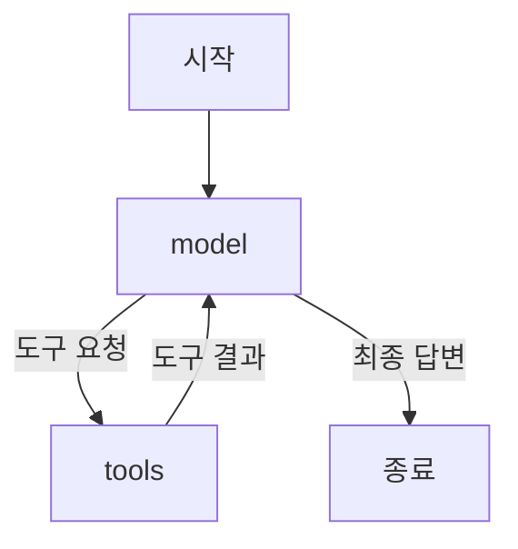
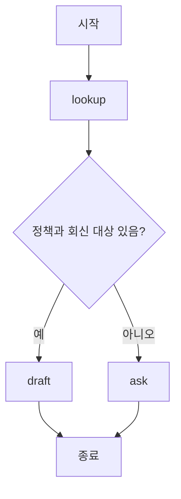

<div class="lec workshop-edition"><div class="deck">
<section class="slide">
<div class="eyebrow">2026.09 · 예상 12:50–14:00 · 70분</div>

# LangGraph로 상태와 분기 정의하기

<p class="lead">앞 장의 create_agent도 LangGraph 위에서 실행됩니다. 이번에는 그 실행 구조를 펼쳐 보고, Agent 앞뒤에 업무 조건과 중단·재개를 연결합니다.</p>

앞에서는 모델이 규정을 조회해 답하게 했습니다. 이번에는 “회신 대상이 없거나 정책을 못 찾으면 초안을 만들지 않는다”는 업무 조건이 추가됩니다. 모델에게 주의를 요청하는 대신, 초안 작성 노드에 들어가기 전에 조건을 검사합니다. 앞서 만든 도구와 Agent는 그대로 사용합니다.

<div class="cue"><div class="cue-body">모든 명령은 <code>workshop</code> 폴더에서 실행합니다. 처음이라면 <a href="./start">시작 안내</a>를 먼저 확인합니다. 앞 단계가 미완료라면 <a href="./build#recovery">앞 단계 보완 안내</a>에서 필요한 함수만 확인합니다.</div></div>
<details class="instructor-note"><summary>강사용 예상 시간 · 12:50–14:00 / 70분</summary>

**예상 배분:** 각 소제목 아래의 소요 시간과 예상 시각을 참고합니다. 시작 질문도 세션 시간에 포함됩니다. 현장 실측이 아닌 진행 기준이며 학습자의 반응에 따라 조절합니다.

State·노드·조건 분기를 우선합니다. 전체 그래프 작성은 선택 심화입니다.

</details>

</section>

<section class="slide" id="icebreaker">

## 시작 질문 · 승인이 내일 온다면 처음부터 다시 할까요?

<p class="section-time">예상 3분 · 12:50–12:53</p>

Agent가 규정을 찾고 답장 초안까지 만들었습니다. 전송 승인을 받을 담당자는 퇴근했고, 승인은 내일 받을 수 있습니다.

**내일 승인받았을 때 어디까지 했는지 어떻게 알고 이어갈까요?**

LangChain은 장시간 실행되는 Agent의 운영 기반으로 중단·재개와 상태 저장을 설명합니다. 승인 대기도 이런 기능이 필요한 사례입니다. [2026-04-20 · 개발사 기술 해설](https://www.langchain.com/blog/runtime-behind-production-deep-agents)

먼저 처리 단계를 그래프로 연결하고, 이후 승인을 기다렸다가 이어가는 예제를 살펴봅니다.

<details class="instructor-note"><summary>강사용 진행 노트 · 시작 질문</summary>

진행 예: 상황 30초 → 의견 한두 개 1분 → 최근 사례와 본문 연결 1분 30초. 별도 기록이나 제출은 요구하지 않습니다.

필요한 기록으로 초안·조회 결과·승인 여부 중 한두 개를 받습니다. “서버가 재시작됐다면?”을 후속 질문으로 씁니다. 수업의 메모리 저장 예제가 프로세스 재시작까지 견디는 운영 저장소와 같지는 않음을 구분합니다.

</details>

</section>

<nav class="lesson-nav" aria-label="수업 흐름"><a href="#concept">01 개념</a><a href="#observe">02 실습</a><a href="#solution">03 풀이</a><a href="#wrap">04 Wrap</a></nav>

<section class="slide" id="concept">

## 앞에서 만든 Agent도 그래프였습니다

<p class="section-time">예상 3분 · State 설명의 도입에 포함</p>

앞 장에서는 `create_agent(...)`로 실행 구조를 만들고 `agent.invoke(...)`로 질문을 보냈습니다. 그때 만들어진 `agent`는 실행 가능한 LangGraph 객체인 `CompiledStateGraph`입니다. Python에서는 `create_agent`, JavaScript에서는 `createAgent`라는 이름을 사용합니다.

`labs/langchain.py`의 `agent = build_agent(...)` 바로 아래, `invoke` 앞에 다음 두 줄을 넣으면 이미 만든 객체의 구조를 확인할 수 있습니다. 이 두 줄 자체는 모델을 호출하지 않습니다.

```python
print(type(agent).__name__)
print(list(agent.get_graph().nodes))
```

기본 도구 Agent에서 확인한 결과입니다. 미들웨어나 구성에 따라 노드는 추가될 수 있습니다.

```text
CompiledStateGraph
['__start__', 'model', 'tools', '__end__']
```



앞 장에서 본 메시지 누적은 이 실행 경로에서 일어납니다. `model`이 만든 도구 요청을 `tools`가 처리하고, 그 결과를 받은 `model`이 다시 답합니다. `create_agent`가 이 기본 구조를 조립해 주었으므로 직접 노드와 간선을 작성하지 않았던 것입니다. [LangChain Agent 문서](https://docs.langchain.com/oss/python/langchain/agents)

### 그렇다면 왜 StateGraph를 직접 다룰까요?

이제 “회신 대상이 없으면 초안을 만들지 않는다”는 조건을 추가합니다. 기본 Agent를 다시 만드는 대신, 바깥 업무 흐름에서 입력을 확인하고 조건이 맞을 때만 기존 Agent를 호출합니다.

|앞 장에서 맡긴 부분|이번 장에서 직접 정할 부분|
|---|---|
|모델과 도구가 주고받는 기본 반복|조회 → 조건 확인 → 질문 또는 초안 생성의 업무 순서|
|`messages` 중심의 Agent 상태|업무명·회신 대상·조회 결과·처리 상태|
|`create_agent`가 조립한 그래프|`StateGraph`에 명시할 노드와 간선|

작은 도구 Agent라면 `create_agent`만으로 충분할 수 있습니다. 미들웨어로 처리할 수 있는 조건도 있습니다. 이번에는 여러 업무 단계를 명시적으로 나누기 위해 바깥 그래프를 구성합니다. 다음 State·node·edge를 그 재료로 읽습니다.

## State·node·edge

<p class="section-time">예상 7분 · 12:53–13:00</p>

State는 실행 중 노드들이 읽고 갱신하는 값입니다. 이 예제에서는 업무 주제·회신 대상·정책 ID·답변·방문 기록을 담습니다. node는 State를 받아 변경할 값을 반환하는 함수이며, edge는 다음 노드를 연결합니다.

<<< ../../workshop/course/graph_lab.py#state{python}

`TypedDict`는 dict에 어떤 필드가 들어가는지 코드에 표시합니다. 그 자체가 모든 실행 입력을 검증해 주는 장치는 아닙니다.

`lookup`은 기존 State를 받아 정책 ID와 방문 기록을 반환합니다. 반환하지 않은 다른 필드는 남습니다. 방문 기록은 기존 기록에 새 항목을 추가한 리스트를 반환하여 갱신합니다.

`route`는 다음 노드 이름을 반환합니다. 정책 ID와 회신 대상이 모두 있을 때만 draft로 갑니다. 여기서 다음 단계는 모델이 아니라 조건문이 결정합니다.

</section>

<section class="slide">

## 그래프를 연결합니다

<p class="section-time">예상 6분 · 13:00–13:06</p>



<CourseVisual kind="graph" />


<<< ../../workshop/course/graph_lab.py#graph{python}

`add_node`는 이름과 함수를 연결합니다. `add_edge`는 항상 이동하는 연결, `add_conditional_edges`는 반환값에 따라 이동하는 연결입니다. `compile`이 실행 가능한 그래프를 만듭니다.

LangChain Agent를 노드 안에서 호출할 수도 있습니다. 기본 예제는 State와 분기에 집중하기 위해 모델 없이 규칙으로 동작합니다. 이를 실제 LLM 판단이라고 부르지 않습니다.

### if문이면 될까요, 그래프가 필요할까요?

|선택|장점|감수할 점|적합한 상황|
|---|---|---|---|
|일반 함수와 if문|작은 흐름을 짧게 표현|중단·재개나 여러 단계의 상태 관리를 직접 구성|간단한 조회와 분기|
|LangGraph|상태·노드·연결을 명시하고 실행 기능을 활용|State와 노드 경계를 설계하고 프레임워크 동작을 익혀야 함|여러 단계, 조건 분기, 승인 대기·재개가 필요한 흐름|

이 예제의 분기 하나만으로 LangGraph가 꼭 필요한 것은 아닙니다. 뒤의 중단·재개까지 연결하며 선택 이유를 확인합니다. 그래프를 사용해도 분기 조건의 업무상 정확성은 직접 검사해야 합니다. [LangGraph 공식 개요](https://docs.langchain.com/oss/python/langgraph/overview)

</section>

<section class="slide">

## 멈춤과 재개

<p class="section-time">예상 4분 · 13:06–13:10</p>

사람의 결정을 기다릴 때는 진행 위치와 State가 필요합니다. checkpoint는 실행 상태를 저장하고 thread_id는 어떤 실행을 이어갈지 구분합니다.

<<< ../../workshop/course/graph_lab.py#approval{python}

|시점|입력/동작|관찰값|
|---|---|---|
|첫 invoke|초안으로 실행|interrupt에서 대기, paused=true|
|결정 준비|동일한 thread_id 유지|저장된 실행을 선택|
|두 번째 invoke|Command(resume="reject")|decision=held|

이 예제는 같은 프로세스의 메모리 저장소를 사용합니다. 프로세스를 종료하면 사라지므로 재시작 복구를 보장하지 않습니다. `interrupt` 후 재개하면 해당 노드가 처음부터 다시 실행되므로 그 앞에 실제 전송·저장을 두면 중복 효과가 날 수 있습니다.

### 한 요청의 State를 따라갑니다

State는 노드마다 처음부터 다시 만드는 요청서가 아닙니다. 이 예제에서는 노드가 반환한 필드가 기존 상태에 반영되고, 반환하지 않은 필드는 남습니다.

|순서|새로 받거나 반환하는 값|다음 단계가 보는 상태|
|---|---|---|
|입력|`topic="정산"`, `contact="user@example.test"`|주제와 회신 대상|
|lookup 반환|`policy_id="P-01"`, `visited=["lookup"]`|기존 주제·회신 대상에 정책 ID가 추가됨|
|route 판단|`"draft"`|경로 이름을 반환하며 상태를 갱신하지 않음|
|draft 반환|`answer`, `decision="draft"`, `visited=["lookup", "draft"]`|답변과 방문 이력이 추가됨|
|END|추가 노드 없음|완성된 State를 호출자에게 반환|

같은 표에서 contact만 빈 문자열로 바꾸면 어느 행부터 결과가 달라지는지 먼저 표시합니다. `lookup`이 contact를 반환하지 않아도 값이 남는다는 점과, `route`가 반환하는 경로 이름은 State 업데이트가 아니라는 점을 구분합니다. 이 코드의 `visited`는 노드가 새 목록을 만들어 반환합니다. 모든 목록이 자동으로 누적되는 것은 아닙니다.

<aside class="discussion-prompt"><strong>생각거리 · 여유가 있으면 +3분</strong><p>어제 팀장이 20만 원 지출을 승인했습니다. 오늘 프로그램을 다시 켰더니 규정이 15만 원으로 바뀌었습니다.<br><br><strong>어제 승인만 보고 그대로 처리해도 될까요?</strong> 다시 확인해야 할 정보를 하나 골라 봅니다.</p></aside>

<details class="instructor-note"><summary>강사용 토론 길잡이</summary>

승인이 어느 데이터와 버전에 대한 것인지 확인해야 합니다. 재개는 실행 상태를 이어 주지만 승인 근거의 유효성을 자동 보장하지는 않습니다.

한 답을 빨리 받기보다, 반대 선택이 더 나아지는 조건을 하나 더 묻습니다. 별도 기록이나 제출은 요구하지 않습니다. 기본 배정에 추가하는 선택 활동이므로 다음 섹션의 시간을 조절합니다.

</details>

</section>

<section class="slide" id="production-runtime">

## 더 읽기 · 초안을 잘 만드는 것과 내일 이어가는 것은 다릅니다

<p class="section-time">예상 5분 · 운영 복습 시간에서 조절</p>

[The runtime behind production deep agents](https://www.langchain.com/blog/runtime-behind-production-deep-agents)(2026-04-20)는 Harness 아래의 실행 기반을 다룹니다. 글에서 runtime은 특히 LangSmith Deployment와 Agent Server를 가리킵니다. 제품이 제공하는 운영 기능과 로컬 LangGraph 예제를 구별해 읽습니다.

|업무 상황|필요한 기반|
|---|---|
|20분 조사 중 서버가 종료됨|checkpoint와 작업 복구|
|승인이 다음 날 도착함|상태를 저장하고 중단·재개|
|다른 대화에서도 사용자 선호를 사용함|thread별 checkpoint와 별도의 장기 store|
|처리 중 “아니, 다른 조건으로 해줘”가 도착함|후속 입력을 대기·거절·중단·재시작 중 어떻게 처리할지 결정|

이 글의 핵심은 긴 작업을 단순한 한 번의 HTTP 응답처럼 취급하지 않는다는 점입니다. 운영 서비스에는 저장소뿐 아니라 작업 큐, 인증·권한, 스트리밍, 관측도 필요합니다. LangGraph의 그래프를 만든 것만으로 이 구성이 모두 준비되지는 않습니다.

### 현재 실습은 어디까지 확인하나요?

주 실습은 checkpointer 없이 업무 분기를 실행합니다. 승인 예제의 `InMemorySaver`는 같은 프로세스 안의 재개를 보여줍니다. 프로세스를 종료한 뒤 복구하려면 영속 checkpointer와 재실행을 담당할 운영 구성이 필요합니다. [LangGraph 상태 저장](https://docs.langchain.com/oss/python/langgraph/persistence)

checkpoint가 있어도 외부 발송이 자동으로 취소되거나 중복 방지되는 것은 아닙니다. 특히 `interrupt` 이후 재개할 때 해당 노드는 처음부터 다시 실행될 수 있으므로, 승인 전에 수행할 작업과 승인 뒤의 쓰기 작업을 나눠야 합니다. [Interrupt 재개 동작](https://docs.langchain.com/oss/python/langgraph/interrupts)

**함께 생각하기:** 초안 v1을 검토하는 동안 사용자가 조건을 바꿔 v2를 요청했습니다. 나중에 도착한 v1 승인을 v2에 적용해도 될까요?

<details><summary>설명 비교</summary>

적용하면 안 됩니다. 승인에는 검토한 초안의 버전을 연결해야 합니다. 새 입력을 대기시킬지, 진행 중 작업을 중단할지 먼저 정하고 승인 대상과 현재 실행 대상을 대조합니다. 단순히 “승인됨”이라는 값 하나로는 부족합니다.

</details>

다음 Harness 장에서는 모델이 작업을 잘 수행하도록 무엇을 준비하는지 다룹니다. 여기서는 그 작업을 어떤 상태와 실행 경로로 이어갈지 확인했습니다.

</section>

<section class="slide" id="observe">

<PythonPlayground kind="route" />

입력을 바꾸며 분기 조건을 확인한 뒤, 아래 VS Code 실습에서 상태를 읽는 함수로 구현합니다.


## 실습 · 업무 분기 구현

<p class="section-time">예상 15분 · 13:10–13:25</p>

아래 순서대로 VS Code의 `build_lab/student.py`를 작성합니다. 실습 안내와 풀이를 이 페이지에서 이어서 읽습니다.

<!-- lesson-exercise:graph -->

주 실습은 위 개념 예제에 정책 데이터와 검토 단계를 추가합니다. 필드 이름과 마지막 노드가 달라지므로 `build_lab/materials.py`의 Inquiry와 `guided.py`를 기준으로 구현합니다.

|개념 예제 `course/graph_lab.py`|주 실습 `build_lab`|
|---|---|
|정책 유무: `policy_id`|정책 유무: `state['data']['found']`|
|답변: `answer`|답변 초안: `draft`|
|정상 경로: lookup→draft→END|정상 경로: lookup→draft→review→END|
|정보 부족: lookup→ask→END|정보 부족: lookup→ask→END, 모델 호출 없음|

공통 과제는 상태·노드·간선의 역할을 설명하고 `route_inquiry`를 직접 작성하는 것입니다. 전체 그래프 조립을 다시 작성하는 것은 선택 심화입니다.

<details><summary>비교하며 읽는 완성 예제와 시연</summary>

먼저 `course/graph_lab.py`를 열고 각 노드가 반환하는 값을 표시합니다. 다음 두 입력의 `visited`를 비교합니다.

<div class="command-purpose">완성 예제 실행</div>

```bash
uv run python -m course.cli graph --contact requester@example.test
uv run python -m course.cli graph --contact ""
uv run python -m course.cli approval --decision reject
```

첫 입력은 lookup→draft, 두 번째는 lookup→ask입니다. 세 번째는 승인 대기 후 거부하여 held가 됩니다. `approve`와 빈 결정도 비교합니다. 예제는 외부 이메일을 보내지 않습니다.

예측한 노드 순서와 결과가 다르면 조건 함수의 입력값부터 읽습니다. `visited`는 모델의 숨은 추론이 아니라 우리가 남긴 실행 기록입니다.


</details>

</section>

<section class="slide" id="practice">

## 개인 과제

<p class="section-time">예상 15분 · 13:25–13:40</p>

앞에서 시작한 업무 분기 실습을 이어서 완성합니다. 새 과제를 시작하는 것이 아니라, 같은 함수에 다른 입력을 넣어 결과를 비교하는 단계입니다.

아래 준비 문제는 주 실습에서 막힌 개념을 작은 함수로 확인할 때 사용합니다.

<details><summary>개념을 확인하는 준비 문제와 추가 반례</summary>

**기본:** `route_inquiry`에서 회신 대상이 없는 요청도 ask로 보내도록 수정합니다.

<<< ../../workshop/exercises/student.py#graph{python}

<div class="command-purpose">준비 문제 검사</div>

```bash
uv run python -m exercises.check graph
```

검사는 실제 StateGraph에 학생의 분기 함수를 연결하여 정상·회신 대상 없음·정책 없음 세 경로를 실행합니다.

### 조건 하나가 바뀌면 경로는 어떻게 달라지는가

정책과 회신 대상의 조합을 채우고, 초기 코드가 틀릴 행을 표시합니다.

| policy_id | contact | 예상 경로 | 조건의 이유 |
|---|---|---|---|
|P-01|user|작성|작성|
|P-01|빈 문자열|작성|작성|
|빈 문자열|user|작성|작성|
|빈 문자열|빈 문자열|작성|작성|

수정 후 네 번째 행을 직접 확인합니다. 과제 검사의 세 입력에 없는 조합입니다.

```bash
uv run python -c "from exercises.student import route_inquiry; print(route_inquiry({'policy_id': '', 'contact': ''}))"
```

다음에는 `contact`를 공백 한 칸으로 바꿔 봅니다. 값이 존재한다는 것과 유효한 회신 주소라는 것은 다릅니다. 현재 과제는 빈 문자열만 구분합니다. 주소 형식 검증을 추가하려면 분기 전에 어떤 입력 정리가 필요한지 한 문장으로 제안합니다. 이번 기본 과제에 주소 검증 전체를 구현하지는 않습니다.

**확장:** 승인 함수의 입력을 approve/reject/빈 문자열/오타로 바꿔 안전한 보류를 검사합니다. 수업 후 심화에서는 별도 영속 저장소를 연결해 재시작 복구를 실험합니다. 현재 설치에 없는 영속 패키지는 강사와 검증 후 추가하며 메모리 저장소를 영속이라고 설명하지 않습니다.

이 확장 검사는 각 입력에 대한 반환값을 확인합니다. 미리 작성한 결과 표만 반환하는 것은 그래프 재개 구현이 아닙니다. 실제 `approval_demo` 호출 또는 자신의 그래프 재개 코드를 남기고, 입력마다 실행한 결과와 비교합니다.

확장 시작 파일은 `exercises/extensions.py`의 `approval_matrix()`입니다. 기본 함수의 인자는 바꾸지 않습니다.

```bash
uv run python -m exercises.extension_check graph
```

학생 검사 결과를 먼저 확인합니다. 다음 명령은 풀이 시간에 기준 구현을 확인할 때만 실행합니다.

```bash
uv run python -m exercises.extension_check graph --solution
```

네 결정을 차례대로 실제 승인 예제에 전달합니다. approve만 approved, reject·빈 문자열·approv는 held가 기대 결과입니다.

시작 코드는 FAIL이 정상입니다. 첫 명령으로 자신의 구현을 검사하고, 풀이 시간에 `exercises/extension_solutions.py`의 같은 함수를 열어 비교합니다. 정상·실패 사례는 `exercises/extension_check.py`에서 확인합니다.

<details><summary>힌트</summary>

정책을 찾았다는 것과 전달할 대상이 있다는 것은 서로 다른 조건입니다. 두 값이 함께 있어야 draft로 보냅니다.

</details>


</details>

<aside class="discussion-prompt"><strong>생각거리 · 여유가 있으면 +3분</strong><p>문의에 답장을 받을 주소가 없습니다. 그런데 프로그램은 주소를 묻지 않고 답변 초안부터 만들었습니다.<br><br><strong>초안이 잘 작성됐어도 실습 요구를 만족한 걸까요?</strong> 실행 기록의 visited에서 ask와 draft 중 어느 단계로 갔는지 확인합니다.</p></aside>

<details class="instructor-note"><summary>강사용 토론 길잡이</summary>

최종 문장 외에 필요한 분기를 지켰는지 봅니다. 회신 대상 확인이 필수인 요구라면 경로도 평가 대상입니다. 반대로 필요 없는 경로까지 강제하고 있지는 않은지 검토합니다.

한 답을 빨리 받기보다, 반대 선택이 더 나아지는 조건을 하나 더 묻습니다. 별도 기록이나 제출은 요구하지 않습니다. 기본 배정에 추가하는 선택 활동이므로 다음 섹션의 시간을 조절합니다.

</details>

</section>

<section class="slide" id="solution">

## 풀이

<p class="section-time">예상 10분 · 13:40–13:50</p>

<details class="instructor-note"><summary>강사용 진행 노트 · 분기 풀이</summary>

정상 연락처와 공백 연락처를 비교합니다. 조건식을 설명할 때 State 전체를 다시 강의하기보다 분기에 사용한 필드 두 개를 짚습니다. 영속 복구는 현재 메모리 저장 예제의 기능으로 설명하지 않습니다.

</details>

주 실습 풀이는 `build_lab/reference.py`의 `route_inquiry`를 자신의 구현과 비교합니다. 한 줄 조건을 맞히는 데서 끝내지 않고, 그 조건이 어떤 실행을 허용하거나 막는지 설명합니다.

|주 실습의 State|기대 경로|이유|
|---|---|---|
|정책 있음·회신 대상 있음|lookup→draft→review|초안과 검토에 필요한 입력이 갖춰짐|
|정책 있음·회신 대상 빈 문자열|lookup→ask|초안 모델을 호출하기 전에 추가 확인|
|정책 있음·회신 대상 공백만 있음|lookup→ask|공백은 회신 대상으로 인정하지 않음|
|정책 없음·회신 대상 있음|lookup→ask|담당 팀을 추측해 초안을 만들지 않음|

주 실습은 `state['data']['found']`와 공백을 제거한 contact를 봅니다. 아래 준비 문제의 `policy_id`를 그대로 옮기면 데이터 구조가 맞지 않습니다. 또한 이 조건은 주소가 비어 있는지를 검사할 뿐, 이메일 형식이나 실제 수신 가능성을 보장하지 않습니다.

각 행에서 `visited`와 `decision`을 확인합니다. `draft`를 방문했다는 기록만으로 검토까지 통과했다고 말할 수는 없습니다. 이 단계의 `runner graph`는 검토를 한 번만 하며 `passed` 또는 `held`를 반환합니다. 뒤의 `workflow` 단계는 수정 반복까지 연결하므로 같은 초안이 반복되면 `stalled`도 나올 수 있습니다. 이 값은 주 실습이 정한 업무 판정이며 LangGraph의 예약 상태명이 아닙니다.

### 노드 반환값은 전체 상태가 아닙니다

현재 `Inquiry`에는 리스트를 자동 누적하는 reducer가 없습니다. 노드가 `visited=["draft"]`만 반환하면 이전 방문 기록을 대체합니다. 제공 코드가 `state['visited'] + ["draft"]`를 반환하는 이유입니다. 필드를 반환하지 않은 경우와 빈 값으로 반환한 경우도 다릅니다. 전자는 기존 값을 유지하고, 후자는 그 필드를 빈 값으로 갱신합니다.

**예측 문제:** lookup 이후 contact를 반환하지 않으면 회신 대상은 남습니다. 반대로 `contact=""`를 반환한다면 분기는 ask로 바뀝니다. “노드가 어떤 값을 읽는가”뿐 아니라 “누가 그 값을 바꾸는가”를 따라가야 경로를 설명할 수 있습니다.

여러 노드를 병렬로 늘릴 때는 같은 필드를 동시에 갱신하는지 확인해야 합니다. 현재의 순차 코드에서 직접 목록을 이어 붙이는 방식을 그대로 병렬 누적 규칙으로 삼지는 않습니다. 어떤 결과를 합치고 어떤 값은 한 담당자만 바꿀지 먼저 정합니다. 전체 병렬 그래프 구현은 선택 심화입니다.

<details><summary>준비 문제를 사용했다면: 조건식 풀이</summary>

<div class="command-purpose">준비 문제 풀이 확인</div>

```bash
uv run python -m exercises.check graph --solution
```

| 오답 조건 | 문제가 드러나는 경우 | 관찰할 값 |
|---|---|---|
|정책 ID만 확인|회신 대상이 없음|visited에 draft가 남음|
|두 조건을 or로 연결|한쪽 정보만 있음|ask 대신 draft로 이동|
|모두 ask 반환|정상 입력|정상 초안까지 차단|

`and`는 두 조건이 함께 참이어야 하고, `or`는 하나만 참이어도 통과합니다. 자신의 예측표에서 두 조건의 차이가 드러나는 행을 짚습니다. 이후 승인 예제에서 reject를 approve로 바꾸면 달라지는 출력과 그대로인 thread_id의 역할을 설명합니다.

정책 ID만 검사하는 초기 구현은 회신 대상이 없어도 초안을 작성합니다. 조건을 추가한 뒤 정상 입력이 계속 draft로 가는지도 확인합니다. 오류를 고친 뒤 정상 경로까지 막히면 회귀입니다.

</details>

</section>
<section class="slide"><details><summary>복습 자료 · 운영으로 옮길 때 확인할 것</summary>


풀이에서는 네 입력의 경로와 상태 갱신을 비교합니다. 아래 확장 읽기에서는 운영 환경의 저장·재개·승인 조건을 살펴봅니다.

### 저장했다고 모든 작업을 이어갈 수 있는가

|저장할 대상|쓰임|현재 실습의 범위|
|---|---|---|
|그래프 checkpoint|어떤 State와 진행 위치에서 재개할지|승인 시연만 `InMemorySaver` 사용|
|여러 요청에 공통인 데이터|사용자 선호·공유 정책 등|별도 장기 기억 Store 구현 없음|
|업무 처리 기록|실제 발송·접수 여부와 중복 확인|그래프 checkpoint만으로 해결되지 않음|

주 실습의 `guided.build_workflow`는 checkpointer 없이 compile합니다. `thread_id`만 입력에 추가한다고 저장 기능이 생기지 않습니다. 승인 시연은 같은 프로세스에서만 이어지며, 운영용 영속 저장소와 접근 제어를 제공하지 않습니다. [Persistence 공식 설명](https://docs.langchain.com/oss/python/langgraph/persistence)

운영에서는 다른 문의가 같은 저장 스레드를 잘못 이어받지 않도록 실행 식별자를 정해야 합니다. 식별자는 권한 확인의 대체물이 아닙니다. 누가 그 실행을 조회·재개할 수 있는지도 애플리케이션에서 확인합니다.

승인 직전에 외부 발송을 하고 `interrupt`로 기다리는 노드를 상상해 봅니다. 재개할 때 해당 노드는 처음부터 다시 실행되므로 발송이 반복될 수 있습니다. 승인 전에는 검토할 내용을 준비하고, 승인 뒤 실행할 쓰기는 별도 단계와 중복 방지 계약으로 다룹니다. 쓰기를 뒤로 옮겨도 실행 도중 장애가 나면 재시도가 생길 수 있습니다. [Interrupt 재개와 부작용](https://docs.langchain.com/oss/python/langgraph/interrupts)

**판단 문제:** v1 초안을 보고 승인했는데 재개 시점의 초안은 v2입니다. 승인 문자열만으로 v2를 발송해도 될까요? 검토 대상 버전과 실제 실행 대상을 대조해야 합니다. 같은 원리는 뒤의 A2A 결과 수락에서도 사용합니다.

마지막으로, 그래프가 END에 도착한 것은 실행 경로가 끝났다는 뜻입니다. ask나 held도 종료될 수 있습니다. 실행 종료, 업무 통과, 실제 외부 처리 완료를 따로 읽습니다.

참고: [LangGraph Persistence](https://docs.langchain.com/oss/python/langgraph/persistence).

다음 [Harness 장](./harness)에서는 이 프로그램을 코딩 에이전트로 개선하는 방법을 배웁니다. 먼저 Harness와 Skill을 이해한 뒤 반복 작업과 역할 분담을 설계합니다. 전체 그래프나 수정 루프를 직접 작성하려면 [선택 심화](./build#loop)를 진행합니다.


</details></section>


<section class="slide" id="wrap">

## Wrap · 상태와 실행 경로를 다시 읽습니다

<p class="section-time">예상 3분 · 기존 마무리 시간에 포함</p>

|다시 짚을 개념|오늘 확인한 내용|
|---|---|
|기존 Agent와 State|create_agent도 실행 가능한 그래프입니다. 이번에는 바깥 업무 흐름의 상태와 조건을 정했습니다.|
|Node·edge|노드는 일을 수행하고, 간선과 분기 함수는 다음 노드를 정합니다.|
|멈춤과 재개|interrupt와 checkpointer의 역할을 구별합니다. END에 도착했다고 업무가 통과한 것은 아닙니다.|

**짧게 설명해 보기:** 정책은 있지만 회신 대상이 빈칸이면 어느 경로로 가야 할까요? 초안 생성은 실행될까요?

<details><summary>설명 비교</summary>

ask 경로로 가며 초안 생성은 실행하지 않습니다. 입력 조건과 visited를 함께 확인합니다.

</details>

</section>
<nav class="chapnav"><a href="../toc">전체 목차</a></nav>
</div></div>
