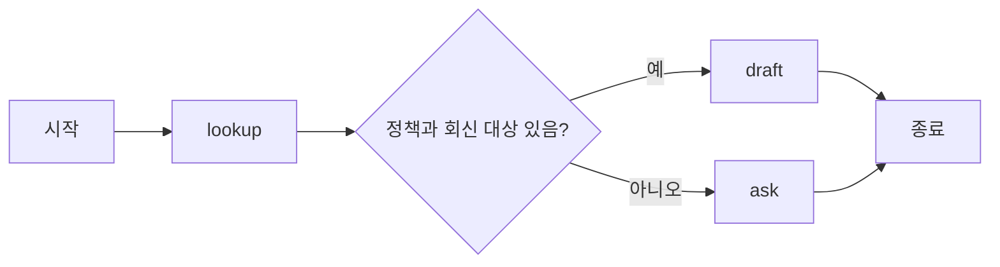

<div class="lec workshop-edition"><div class="deck">
<section class="slide">
<div class="eyebrow">2026.09 · 개인 실습 · 75분 · 개념 25 / 함께 20 / 개인 20 / 풀이 10</div>

# LangGraph로 상태와 분기를 정의한다

<p class="lead">정보가 부족하면 질문으로 보내고 충분하면 초안을 작성합니다. 상태가 어떤 값인지 보고 조건 분기를 수정합니다.</p>

<div class="cue"><div class="cue-body">모든 명령은 <code>workshop</code> 폴더에서 실행합니다. 처음이라면 <a href="./start">시작 안내</a>를 먼저 확인합니다. 앞 모듈을 끝내지 못해도 이 모듈의 제공 코드에서 시작할 수 있습니다.</div></div>
</section>

<section class="slide">

## State·node·edge · 12분

State는 실행 중 노드들이 읽고 갱신하는 값입니다. 이 예제에서는 업무 주제·회신 대상·정책 ID·답변·방문 기록을 담습니다. node는 State를 받아 변경할 값을 반환하는 함수이며, edge는 다음 노드를 연결합니다.

<<< ../../workshop/course/graph_lab.py#state{python}

`TypedDict`는 dict에 어떤 필드가 들어가는지 코드에 표시합니다. 그 자체가 모든 실행 입력을 검증해 주는 장치는 아닙니다. `lookup`은 기존 State를 받아 정책 ID와 방문 기록을 반환합니다. 반환하지 않은 다른 필드는 남습니다. 이 예제의 리스트는 직접 새 리스트로 만들어 반환하며 자동 누적 reducer를 사용하지 않습니다.

`route`는 다음 노드 이름을 반환합니다. 정책 ID와 회신 대상이 모두 있을 때만 draft로 갑니다. 여기서 다음 단계는 모델이 아니라 조건문이 결정합니다.

</section>

<section class="slide">

## 그래프를 연결합니다 · 8분



<<< ../../workshop/course/graph_lab.py#graph{python}

`add_node`는 이름과 함수를 연결합니다. `add_edge`는 항상 이동하는 연결, `add_conditional_edges`는 반환값에 따라 이동하는 연결입니다. `compile`이 실행 가능한 그래프를 만듭니다.

LangChain Agent를 노드 안에서 호출할 수도 있습니다. 기본 예제는 State와 분기에 집중하기 위해 모델 없이 규칙으로 동작합니다. 이를 실제 LLM 판단이라고 부르지 않습니다.

</section>

<section class="slide">

## 멈춤과 재개 · 5분

사람의 결정을 기다릴 때는 진행 위치와 State가 필요합니다. checkpoint는 실행 상태를 저장하고 thread_id는 어떤 실행을 이어갈지 구분합니다.

<<< ../../workshop/course/graph_lab.py#approval{python}

|시점|입력/동작|관찰값|
|---|---|---|
|첫 invoke|초안으로 실행|interrupt에서 대기, paused=true|
|결정 준비|동일한 thread_id 유지|저장된 실행을 선택|
|두 번째 invoke|Command(resume="reject")|decision=held|

이 예제는 같은 프로세스의 메모리 저장소를 사용합니다. 프로세스를 종료하면 사라지므로 재시작 복구를 보장하지 않습니다. `interrupt` 후 재개하면 해당 노드가 처음부터 다시 실행되므로 그 앞에 실제 전송·저장을 두면 중복 효과가 날 수 있습니다.

</section>

<section class="slide">

## 함께 실행 · 20분 (분기 15 / 재개 관찰 5)

먼저 `course/graph_lab.py`를 열고 각 노드가 반환하는 값을 표시합니다. 다음 두 입력의 `visited`를 비교합니다.

```bash
uv run python -m course.cli graph --contact requester@example.test
uv run python -m course.cli graph --contact ""
uv run python -m course.cli approval --decision reject
```

첫 입력은 lookup→draft, 두 번째는 lookup→ask입니다. 세 번째는 승인 대기 후 거부하여 held가 됩니다. `approve`와 빈 결정도 비교합니다. 예제는 외부 이메일을 보내지 않습니다.

예측한 노드 순서와 결과가 다르면 조건 함수의 입력값부터 읽습니다. `visited`는 모델의 숨은 추론이 아니라 우리가 남긴 실행 기록입니다.

</section>

<section class="slide">

## 개인 과제 · 20분

**기본:** `route_inquiry`에서 회신 대상이 없는 요청도 ask로 보내도록 수정합니다.

<<< ../../workshop/exercises/student.py#graph{python}

```bash
uv run python -m exercises.check graph
```

검사는 실제 StateGraph에 학생의 분기 함수를 연결하여 정상·회신 대상 없음·정책 없음 세 경로를 실행합니다.

**확장:** 승인 함수의 입력을 approve/reject/빈 문자열/오타로 바꿔 안전한 보류를 검사합니다. 수업 후 심화에서는 별도 영속 저장소를 연결해 재시작 복구를 실험합니다. 현재 설치에 없는 영속 패키지는 강사와 검증 후 추가하며 메모리 저장소를 영속이라고 설명하지 않습니다.

확장 시작 파일은 `exercises/extensions.py`의 `approval_matrix()`입니다. 기본 함수의 인자는 바꾸지 않습니다.

```bash
uv run python -m exercises.extension_check graph
uv run python -m exercises.extension_check graph --solution
```

네 결정을 차례대로 실제 승인 예제에 전달합니다. approve만 approved, reject·빈 문자열·approv는 held가 기대 결과입니다.

시작 코드는 FAIL이 정상입니다. 첫 명령으로 자신의 구현을 검사하고, 풀이 시간에 `exercises/extension_solutions.py`의 같은 함수를 열어 비교합니다. 정상·실패 사례는 `exercises/extension_check.py`에서 확인합니다.

<details><summary>힌트</summary>

정책을 찾았다는 것과 전달할 대상이 있다는 것은 서로 다른 조건입니다. 두 값이 함께 있어야 draft로 보냅니다.

</details>

</section>

<section class="slide">

## 풀이 · 10분

```bash
uv run python -m exercises.check graph --solution
```

정책 ID만 검사하는 초기 구현은 회신 대상이 없어도 초안을 작성합니다. 조건을 추가한 뒤 정상 입력이 계속 draft로 가는지도 확인합니다. 오류만 고치다가 정상 경로를 막으면 회귀입니다.

다음 Harness 모듈에서는 분기에서 한 걸음 더 나아가 검토 피드백으로 입력을 수정하는 반복을 다룹니다.

참고: [LangGraph Persistence](https://docs.langchain.com/oss/python/langgraph/persistence).

</section>

<nav class="chapnav"><a href="../toc">전체 목차</a></nav>
</div></div>
