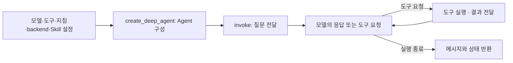
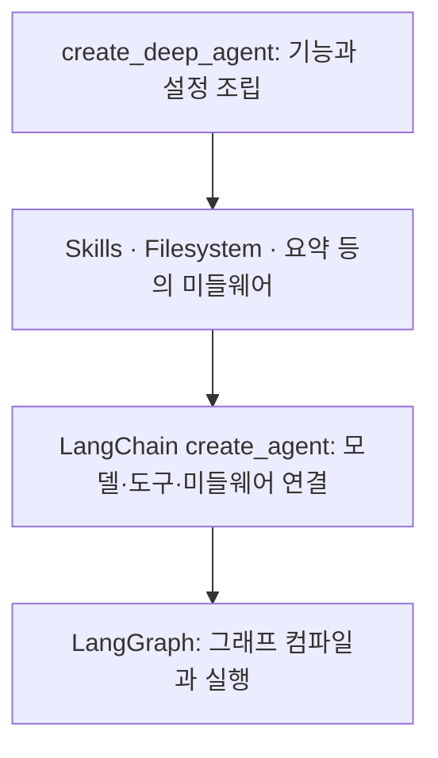
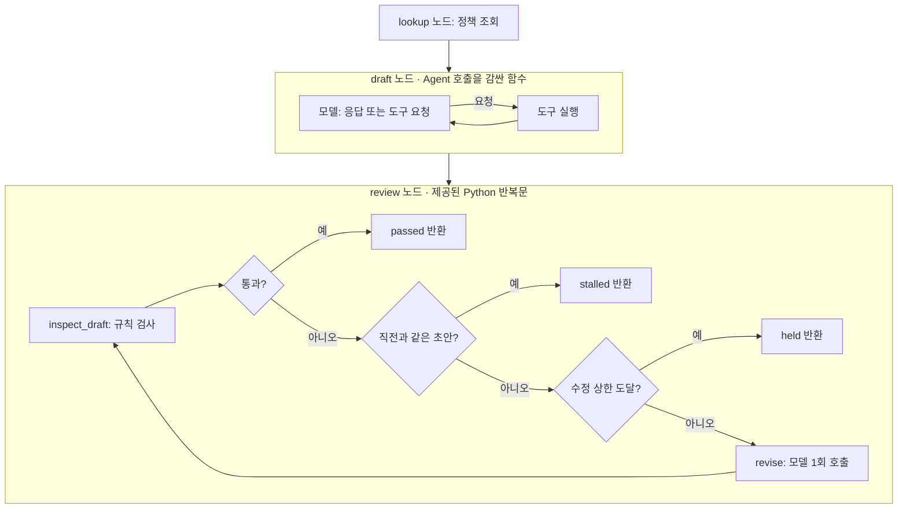
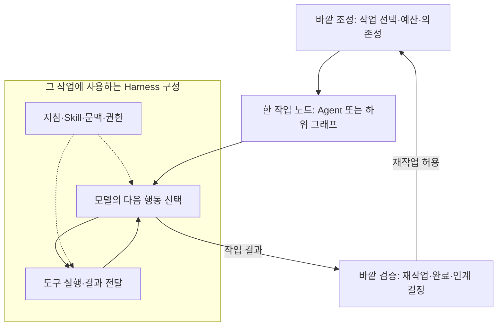
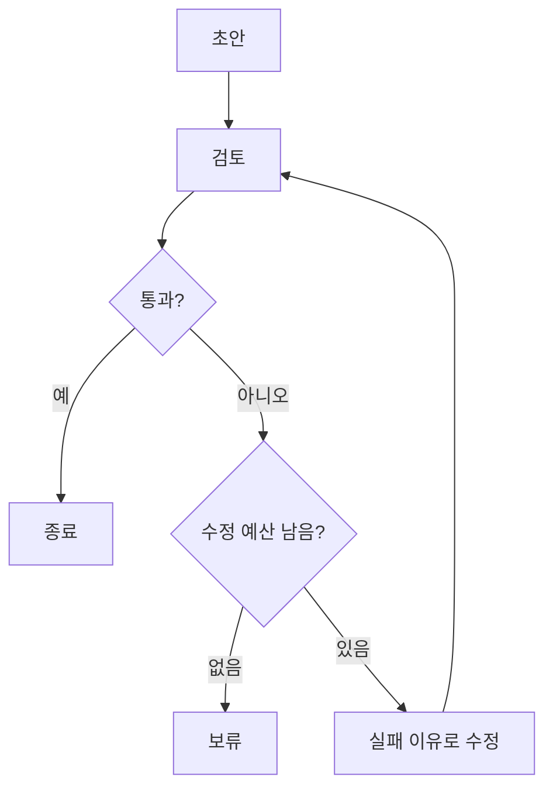

<div class="lec workshop-edition"><div class="deck">
<section class="slide">
<div class="eyebrow">2026.09 · 예상 14:10–15:20 · 70분</div>

# Harness·Loop·Graph Engineering

<p class="lead">앞 장에서는 사내 규정을 조회하고 답변 초안을 만드는 문의 Agent를 만들었습니다. 이번에는 잠시 개발자의 작업으로 관점을 옮겨, Claude Code·Codex 같은 코딩 Agent를 사례로 Harness가 무엇을 제공하는지 살펴봅니다.</p>

<mark class="key-point">문의 Agent는 업무 질문에 답하는 프로그램이고, 코딩 Agent는 개발자가 그 프로그램의 코드를 수정하고 검증할 때 사용하는 도구입니다.</mark> 앞에서 만든 문의 Agent가 코딩 Agent로 바뀌는 것은 아닙니다.

|구분|맡기는 요청의 예|바꾸거나 만드는 것|
|---|---|---|
|우리가 만드는 문의 Agent|“계정이 잠겼는데 어느 팀에 문의하나요?”|정책에 근거한 답변 초안|
|개발자가 사용하는 코딩 Agent · Claude Code·Codex 등의 사례|“회신 주소가 공백이면 초안을 만들지 않도록 코드를 고치고 테스트해 주세요.”|프로그램의 소스 코드와 테스트|

두 경우 모두 모델이 도구를 요청하고 실행 결과를 받아 다음 행동을 고를 수 있습니다. 이 공통 원리를 바탕으로, 코딩 작업에 필요한 파일 도구·프로젝트 지침·작업 기록·실행 권한을 살펴봅니다. 앞 장의 코드가 Claude Code나 Codex의 내부 구현이라는 뜻은 아닙니다.

이 장은 **코딩 Agent 사례로 Harness 이해 → DeepAgents SDK로 파일·Skill 구성 확인 → 문의 Agent의 답변 수정 실습 → 코딩 Agent에 맡길 개발 작업 설계** 순서로 진행합니다. DeepAgents SDK는 Harness 구성을 코드로 살펴보는 별도의 예제입니다. 답변 수정 실습에서는 다시 문의 Agent로 돌아와, 코드가 아니라 답변 내용을 검사하고 고칩니다.

<div class="cue"><div class="cue-body">짧은 예제는 교재의 Python 실행 창에서, 실습은 <code>workshop/notebooks</code>의 Jupyter 노트북에서 진행합니다. 처음이라면 <a href="./start">시작 안내</a>를 먼저 확인합니다. 앞 단계가 미완료라면 <a href="./build#recovery">복귀 절차</a>로 필요한 함수만 보완한 뒤 이어갑니다.</div></div>

### 이 장의 목표와 완료 확인 {#learning-goals}

|할 수 있어야 하는 일|확인할 결과|
|---|---|
|Agent 실행 루프와 Harness 구성을 연결해 설명합니다.|DeepAgents의 create_agent·middleware 연결을 짚고 구현과 설정을 구별합니다.|
|수정 횟수와 종료 이유를 확인합니다.|build-agent.ipynb 3에서 limit=0과 2의 호출·history를 비교합니다.|
|DeepAgents와 자기 Skill을 연결해 실행합니다.|harness-build.ipynb의 H1~H3 코드와 Skill 읽기·조회·응답 기록을 확인합니다.|


</section>

<section class="slide" id="icebreaker">

## 시작 질문 · 계속하라는 말을 매번 사람이 해야 할까요?

<p class="section-time">예상 3분 · 14:10–14:13</p>

코딩 Agent가 수정을 끝냈다고 합니다. 사람이 “테스트도 실행해 줘”라고 말하자 오류가 나고, 다시 “그 오류를 고쳐 줘”라고 지시합니다.

**테스트 결과를 보고 수정할지 멈출지 정하는 일을 어디까지 맡길 수 있을까요?**

LangChain은 실행·검증·이벤트에 따른 시작·실행 기록을 통한 개선을 여러 반복으로 설명합니다. 사람이 다음 지시를 계속 입력하던 작업을 어떻게 구성할지 다루는 최근 담론입니다. [2026-06-16 · 개발사 기술 해설](https://www.langchain.com/blog/the-art-of-loop-engineering) · [GeekNews 소개](https://news.hada.io/topic?id=31106)

이 장에서는 코딩 Agent가 쓸 도구와 절차, 검증 방법과 중단 조건을 함께 살펴봅니다.


</section>

<nav class="lesson-nav" aria-label="수업 흐름"><a href="#concept">01 개념</a><a href="#practice">02 실습</a><a href="#solution">03 풀이</a><a href="#wrap">04 Wrap</a></nav>

<section class="slide" id="concept">

<p><strong>지금 살펴볼 대상은 개발자가 사용하는 코딩 Agent입니다.</strong> 문의 Agent의 기능을 직접 구현하는 단계에서 잠시 벗어나, 코드 작업을 맡기려면 모델 주변에 무엇을 준비해야 하는지 살펴봅니다.</p>


## Harness는 무엇을 관리하는가

<p class="section-time">예상 8분 · 14:13–14:21</p>

문의 Agent에는 정책 조회 도구가 필요했습니다. 코딩 작업에서는 파일 읽기·편집·명령 실행 도구가 필요하며, 모델은 “어떤 파일을 읽을지”, “수정 뒤 무엇을 실행할지”를 고를 수 있습니다. **모델 요청 → 도구 실행 → 결과를 받은 모델의 다음 판단**이라는 흐름은 앞 장과 연결됩니다. 특정 코딩 제품이 내부에서 LangChain을 사용한다는 의미는 아닙니다.

<figure class="trace-example">


<figcaption>AI로 제작한 개념 설명용 그림입니다. 실제 제품 화면이나 물리 구조가 아닙니다.</figcaption>
</figure>

**그림 읽기:** 모델 칩은 같지만 오른쪽에는 절차서, 파일 보관함, 실행·검사 도구, 작업 기록이 있습니다. 왼쪽 모델을 더 큰 모델로 바꾸는 일과, 오른쪽의 작업 환경을 구성하는 일을 구별해 봅니다. 아래에서는 이 비유를 실제 실행 단계와 연결합니다.

<CourseVisual kind="harness" />

그런데 파일 편집 도구만 있으면 긴 개발 작업을 맡길 수 있을까요? 프로젝트의 테스트 명령을 알려 주고, 이전 작업을 기억하게 하고, 실행해도 되는 명령의 범위도 정해야 합니다. **Harness는 모델이 작업을 수행하도록 도구·지침·상태·실행 제어를 묶어 제공하는 구성입니다.**

### Agent와 Harness의 경계를 어디에 둘까요?

이 교재에서 **Agent는 목표를 받아 모델의 판단과 도구 실행을 반복하며 작업하는 전체 시스템**을 가리킵니다. **Harness는 그 시스템에서 모델 주변의 도구·문맥·실행 규칙을 제공하고 반복 실행을 조직하는 소프트웨어 구성**을 가리킵니다. Agent를 모델 하나로 좁히거나, Harness를 Agent와 별개의 두 번째 실행 주체로 읽으면 혼동하기 쉽습니다.

|관점|“코드를 수정하고 테스트해 달라”는 요청에서 하는 일|
|---|---|
|모델의 판단|읽을 파일과 호출할 도구·인자를 생성하고, 테스트 결과를 보고 다음 행동을 선택합니다.|
|Harness의 구성과 제어|사용 가능한 도구와 지침을 모델에 제공하고, 요청한 도구를 실행해 결과를 돌려줍니다. 권한 검사·문맥 관리·중단 조건도 구성합니다.|
|실행 기반 · 이 예제의 LangGraph|노드 실행과 상태 갱신을 진행하며, 설정된 경우 체크포인트와 중단·재개를 처리합니다.|
|Agent 전체|위 구성을 사용해 요청받은 코드 수정 작업을 수행합니다.|

<mark class="key-point">“테스트를 실행하자”는 선택은 모델이 생성할 수 있지만, 실제 실행과 허용 여부의 적용은 프로그램이 맡습니다. 이 둘을 포함해 작업하는 전체가 Agent입니다.</mark> 모델이 선택하지 않아도 반드시 해야 하는 검사는 실행 코드의 조건으로 구성합니다.

이는 역할을 설명하기 위한 구분입니다. 제품마다 Harness에 포함하는 범위는 다르고, Harness가 실행 루프와 상태 관리 기능을 함께 제공하기도 합니다. LangChain도 LangGraph를 실행 기반, LangChain을 Agent 구성 프레임워크, DeepAgents를 도구와 관리 기능을 갖춘 Harness로 설명합니다. [공식 제품 계층 설명](https://docs.langchain.com/oss/python/concepts/products)

| 코딩 작업에서 필요한 것 | Harness가 제공할 구성 |
|---|---|
| 코드를 읽고 수정한 뒤 테스트하기 | 파일 도구와 명령 실행 도구 |
| 프로젝트에 맞는 방법으로 작업하기 | 프로젝트 지침과 Skill 문서 |
| 긴 대화에서도 남은 작업을 이어가기 | 작업 기록과 컨텍스트 관리 |
| 중요한 명령은 사람이 확인하기 | 도구 실행 전 승인 절차 |
| 실패했을 때 재시도하거나 멈추기 | 검사 결과, 재시도 상한과 중단 조건 |

Skill에 “테스트를 실행한 뒤 완료한다”는 절차를 적을 수 있습니다. <mark class="key-point">완료 전에 테스트 결과를 반드시 확인하게 하려면 실행 프로그램에도 검사 절차를 넣습니다.</mark> 문서는 모델에게 방법을 알려 주고, 코드는 실행 조건을 적용합니다.

<aside class="discussion-prompt"><strong>생각거리 · 여유가 있으면 +3분</strong><p>Agent가 테스트도 실행하지 않고 “수정 완료”라고 답합니다. 더 비싼 모델을 쓰거나, 완료 전에 테스트를 꼭 실행하게 만들 수 있습니다.<br><br><strong>어느 방법부터 시도하겠습니까?</strong> 테스트를 실행했는데도 오류를 고치지 못한다면 선택이 달라질까요?</p></aside>

<details class="instructor-note"><summary>토론 길잡이</summary>

정보를 주어도 판단을 못 하는지, 필요한 정보를 못 받는지, 잘못된 완료를 검증하지 못하는지 나눕니다. 실패 원인을 확인하지 않은 채 모델이나 Harness 어느 한쪽이 답이라고 정하지 않습니다.

반대 선택이 더 나아지는 조건도 하나 찾아봅니다.

</details>

</section>

<section class="slide">

## DeepAgents와 Skill 구성

<p class="section-time">예상 9분 · 14:21–14:30 · CLI·SDK와 실행 흐름 4분 / 작업 구분·Skill 5분 · 내부 소스는 보충 읽기</p>

### 먼저 화면으로 보는 Deep Agents CLI {#deepagents-cli}

Claude Code나 Codex처럼 터미널에서 개발 작업을 맡기는 프로그램이 LangChain 프로젝트에도 있습니다. 아래는 공식 문서 저장소에 공개된 **Deep Agents CLI** 화면입니다. 현재 공식 문서는 <strong>Deep Agents Code(<code>dcode</code>)</strong>라는 이름으로 안내합니다.

<figure class="trace-example">
<a href="https://raw.githubusercontent.com/langchain-ai/docs/main/src/oss/images/deepagents/deepagents-cli.png" target="_blank" rel="noopener noreferrer"></a>
<figcaption>공식 문서의 기존 CLI 화면(v0.0.30). 수업에서 실행한 결과가 아닙니다. <a href="https://github.com/langchain-ai/docs/blob/main/src/oss/images/deepagents/deepagents-cli.png">이미지 출처</a> · <a href="https://docs.langchain.com/oss/deepagents/code/overview">현재 제품 설명과 실행 영상</a></figcaption>
</figure>

**화면에서 세 곳을 찾아봅니다.** 아래 입력창은 사용자가 작업을 맡기는 곳입니다. `Loaded 1 MCP tool`은 외부 도구가 연결되었음을, `LangSmith tracing`은 실행 기록 추적이 설정되었음을 보여 줍니다. 이 캡처의 대화는 인사만 주고받으므로 파일 수정이나 테스트까지 수행한 사례는 아닙니다.

### CLI를 쓰는 것과 SDK로 만드는 것

CLI는 터미널에서 사용하는 응용 프로그램이고, SDK는 다른 프로그램에서 기능을 호출하고 실행 흐름을 연결하는 라이브러리입니다. **CLI에도 비대화형 실행이 있고, 코딩 Agent에도 SDK가 있습니다.** 사람이 입력창에 직접 요청하는 방식과 서버·자동화 코드가 요청하는 방식을 구분하면 됩니다.

|제공 형태|프로그램에서 활용하는 방식|공식 문서|
|---|---|---|
|Codex SDK|TypeScript·Python 코드에서 작업과 실행 결과를 다룹니다. CI나 내부 도구에 연결할 수 있습니다.|[Codex SDK](https://learn.chatgpt.com/docs/codex-sdk)|
|Claude Agent SDK|Python·TypeScript에서 Claude Code의 도구·Agent 루프·문맥 관리 기능을 사용합니다.|[Claude Agent SDK](https://code.claude.com/docs/en/agent-sdk/overview)|
|DeepAgents SDK|모델·도구·backend·Skill 등을 지정해 자신의 Agent를 구성합니다. Deep Agents Code도 이 SDK를 사용합니다.|[DeepAgents 개요](https://docs.langchain.com/oss/python/deepagents/overview)|

CLI를 자동화에서 호출하는 방법도 있습니다. Codex의 `codex exec`, Claude Code의 `-p`는 대화형 화면 없이 요청을 처리하는 진입점입니다. SDK나 비대화형 모드를 사용해도 실행 환경의 인증과 도구 권한은 설정해야 합니다. [Codex 비대화형 실행](https://learn.chatgpt.com/docs/non-interactive-mode) · [Claude의 SDK·CLI 선택 안내](https://code.claude.com/docs/en/agent-sdk/overview)

### DeepAgents는 무엇을 만들어 주나요? {#deepagents-overview}

DeepAgents는 **모델과 도구가 반복해서 결과를 주고받는 Agent에 파일 처리·작업 계획·Skill·문맥 관리 등의 기능을 함께 구성하는 Harness 라이브러리**입니다. 코딩 전용 모델의 이름이 아닙니다. 이 수업에서는 업무 규정에 답하는 Agent에 절차 문서를 연결하는 데 사용합니다.

`create_deep_agent(...)`는 모델·도구·지침과 필요한 설정을 받아 **실행 가능한 Agent 객체를 만드는 함수**입니다. 앞 장의 `create_agent(...)`보다 준비된 기능을 많이 묶어 줍니다. 만들어진 객체에 `invoke(...)`로 질문을 보내면 실제 실행이 시작됩니다.

|시점|전달하는 것|일어나는 일|
|---|---|---|
|구성 · `create_deep_agent(...)`|모델, 도구, 지침, 파일 backend, Skill 경로 등|기능을 연결해 실행 가능한 Agent 객체를 반환합니다. 이 호출 자체로 업무 질문의 답변을 생성하지 않습니다.|
|실행 · `agent.invoke({"messages": [...]})`|사용자의 질문 등 초기 상태|모델을 호출하고, 도구 요청이 있으면 실행 결과를 다시 모델에 전달하며 진행합니다.|
|결과 확인|반환된 상태의 `messages` 등|도구 요청·결과·마지막 응답을 읽습니다. 실제 호출과 문서 사용은 기록에서 확인합니다.|



<mark class="key-point">구성 함수를 호출하는 것과, 구성된 Agent에 작업을 요청하는 것은 서로 다른 단계입니다.</mark> 다음 Skill 예제에서는 파일 backend와 절차 문서 경로를 설정하고, 실행 기록에서 문서를 읽었는지 확인합니다.

### create_deep_agent 안을 열어 봅니다 {#inside-deepagents}

이제 구성 함수가 준비된 기능을 어떻게 연결하는지 살펴봅니다. 내부 코드는 보충 설명이며, 아래의 Skill 연결 예제를 읽는 데 모든 구현을 외울 필요는 없습니다.

<details><summary>소스로 확인 · DeepAgents 구성 함수에서 LangGraph까지</summary>

아래는 수업에 설치된 **DeepAgents 0.7.13과 LangChain 1.4.0의 소스 일부**입니다. 긴 함수에서 연결 지점만 발췌했으므로 그대로 실행하는 예제가 아닙니다. DeepAgents의 `create_deep_agent`가 내부에서 LangChain의 `create_agent`를 호출합니다.

**1. DeepAgents가 기능별 미들웨어를 모읍니다.** `deepagents/graph.py`에서 Skill 경로를 받으면 `SkillsMiddleware`를 추가하고, 파일 기능은 `FilesystemMiddleware`로 연결합니다.

```python
# deepagents/graph.py — create_deep_agent 내부 발췌
deepagent_middleware: list[AgentMiddleware[Any, Any, Any]] = []
if skills is not None:
    deepagent_middleware.append(SkillsMiddleware(backend=backend, sources=skills))
deepagent_middleware.append(
    FilesystemMiddleware(
        backend=backend,
        custom_tool_descriptions=_profile.tool_description_overrides,
        _permissions=permissions,
    )
)
```

미들웨어는 모델·도구 호출 과정에 기능을 끼워 넣는 확장 단위입니다. 도구를 추가하거나, 모델에 전달할 문맥을 준비하거나, 호출 전후에 상태를 처리할 수 있습니다. 뒤에서는 하위 Agent, 요약 등의 미들웨어도 조립하고 사용자가 전달한 `middleware`를 합칩니다. 적용 목록은 인자와 설정에 따라 달라집니다.

**2. 그 목록을 LangChain의 create_agent에 넘깁니다.** 같은 함수의 마지막 부분입니다.

```python
# deepagents/graph.py — 일부 인자와 뒤의 with_config 생략
return create_agent(
    model,
    system_prompt=final_system_prompt,
    tools=_tools,
    middleware=deepagent_middleware,
    # ...
)
```

**3. LangChain은 그래프를 조립하고 컴파일합니다.** `langchain/agents/factory.py`의 `create_agent`는 모델·도구·미들웨어의 실행 흐름을 구성한 뒤 다음과 같이 반환합니다.

```python
# langchain/agents/factory.py — 나머지 인자 생략
return graph.compile(
    checkpointer=checkpointer,
    store=store,
    # ...
)
```



앞 장의 Agent와 기반이 이어집니다. <strong><mark class="key-point">DeepAgents는 LangChain의 Agent 구성과 LangGraph의 실행 기반 위에, 작업에 필요한 미들웨어·도구·설정을 묶은 Harness 구현체입니다.</mark></strong> Harness가 반드시 미들웨어 목록으로만 구현되어야 하는 것은 아니지만, 이 구현에서는 그 연결을 소스로 확인할 수 있습니다. [DeepAgents 0.7.13 소스](https://github.com/langchain-ai/deepagents/blob/deepagents%3D%3D0.7.13/libs/deepagents/deepagents/graph.py) · [LangChain 미들웨어 설명](https://docs.langchain.com/oss/python/langchain/middleware/overview)

</details>

### “하네스를 만든다”는 말에서 구분할 두 작업 {#harness-work}

실무에서는 실행 기반을 개발하는 일과, 기존 제품을 프로젝트에 맞게 설정하는 일을 모두 “하네스를 만든다”라고 부르기도 합니다. 용어의 범위는 문맥마다 다릅니다. 협업할 때는 <strong>어떤 동작을 구현하는지, 어떤 기존 기능을 설정하는지</strong>를 함께 말하면 작업 범위가 분명해집니다.

| 작업 | 구체적으로 하는 일 | 결과물 |
|---|---|---|
| Harness 기능 구현·확장 | Skill을 발견하고 읽는 미들웨어, 도구 실행 승인 처리, hook을 호출하는 기능 개발 | 라이브러리·미들웨어·실행 코드 |
| 기존 Harness 설정·운영 | 읽을 Skill 경로 지정, SKILL.md 작성, 지원되는 hook에 테스트 명령 연결 | 프로젝트 설정·절차 문서·hook 스크립트 |

예를 들어 **SkillsMiddleware를 개발하는 일**과 **그 미들웨어가 읽을 SKILL.md를 작성하는 일**은 다릅니다. hook은 특정 이벤트에 연결하는 동작입니다. 제품이 제공하는 이벤트에 스크립트를 등록하는 것은 설정에 가깝고, 새로운 이벤트와 호출 방식을 구현하면 실행 기반의 확장에 가깝습니다. 제품의 hook과 LangChain 미들웨어의 호출 지점은 이름이나 지원 범위가 같다고 가정하지 않습니다.

이번 예제에서는 **기존 DeepAgents에 backend와 Skill 경로를 설정하고 업무 절차를 작성**합니다. 새 Harness나 hook 실행기를 구현하지는 않습니다. 다음 코드에서 `skills=["/"]`가 절차 문서를 찾을 위치를 지정한다는 점을 확인합니다. 보충 소스에서는 이 설정이 `SkillsMiddleware(..., sources=skills)`로 이어집니다.

<details><summary>여유가 있으면 +2분 · WikiSkill: 지난번 실수를 또 설명하고 있나요?</summary>

### 경험을 다음 Skill에 반영하기 {#wikiskill}

코딩 Agent가 프로젝트 실행 명령을 자꾸 틀립니다. 매번 올바른 명령을 알려 줍니다. **다음 작업에서도 활용하려면 이 경험을 어떻게 남기면 좋을까요?**

WikiSkill은 실행 기록, 그 기록에서 정리한 지식, 실행 때 참고할 스킬을 나누고 스킬 개선에 활용하는 연구입니다. [2026-08-27 · 연구 원문](https://arxiv.org/abs/2608.27454) · [2026-09-01 · AX LABS 해설](https://theaxlabs.com/blog/wikiskill-paper-review-agent-skill-evolution)

|실행 기록|정리한 지식|다음 실행에 쓸 절차|
|---|---|---|
|어떤 명령을 썼고 어떤 오류가 났는가|오류가 발생한 조건과 확인한 해결 방법|이 프로젝트에서는 어떤 순서로 실행하는가|

*연구의 세 층을 프로젝트 실행 상황에 대입한 설명용 예시입니다.*

**한 번 성공한 방법을 바로 규칙으로 만들어도 될까요?** 연구에서는 수정한 스킬을 검증하고, 개선되지 않으면 되돌립니다. 기록이 쌓이는 것만으로 좋은 스킬이 만들어지는 것은 아닙니다.

<details class="instructor-note"><summary>함께 짚어보기 · WikiSkill / 선택 2분</summary>

“어제는 됐지만 다른 입력에서는 실패한다면?”을 묻고, 성공 사례와 실패 사례 모두로 확인해야 한다는 데 연결합니다. 이어서 아래 SKILL.md에서 실제 실행 절차 한 줄을 찾습니다.

원논문의 방법과 블로그 저자가 제안한 실무 프롬프트를 구분합니다. 프리프린트의 실험 결과이며 우리 프로젝트에서도 같은 효과가 난다는 보장은 아닙니다. 이 교재는 Skill을 읽어 사용하는 예제이고, WikiSkill의 자동 개선 시스템을 구현한 실습은 아닙니다. 스킬 문서를 갱신하는 것과 모델 가중치를 학습하는 것도 구분합니다.

</details>

</details>

이제 이번 Agent에 제공할 절차 문서와 연결 코드를 살펴봅니다.


<<< ../../workshop/course/harness_lab.py#deepagent{python}

DeepAgents는 LangChain·LangGraph 기반의 Harness 구성을 제공합니다. 예제는 가상 경로를 사용한 파일 backend와 `skills/policy-answer/SKILL.md`를 연결합니다. `skills`는 절차 문서를 찾을 경로입니다.

다음 절차 문서를 직접 엽니다. 맨 위 `name`·`description`은 어떤 상황에 사용할지 설명하는 메타데이터이고, 본문은 실행 중 참고할 절차입니다.

<<< ../../workshop/skills/policy-answer/SKILL.md{markdown}

예제의 `system_prompt`에는 “파일을 수정하지 마십시오”가 있지만, 그 문장 자체가 파일 쓰기 기능을 제거하지는 않습니다. `FilesystemBackend`는 파일 도구의 저장 위치를 정하는 구성입니다. 현재 예제는 읽기 전용 도구만 별도로 노출하도록 제한한 구현이 아닙니다. 실제 업무 문서를 연결할 때는 제공할 도구와 실행 계정의 접근 범위를 함께 정해야 합니다. [Backend 공식 설명](https://docs.langchain.com/oss/python/deepagents/backends)

개인 확인: “정책을 찾지 못한 문의”에 적용할 지시 한 줄을 찾아 설명합니다. 문서를 사람이 읽는 활동과 실행 중 모델이 문서를 읽었는지는 구분합니다. 모델의 문서 사용은 뒤의 실행 기록에서 확인합니다.

### Skill은 언제 읽히고 무엇을 담아야 할까요? {#skill-authoring}

Skill은 한 번의 요청에 붙이는 긴 프롬프트를 파일로 옮기는 데서 끝나지 않습니다. <strong><mark class="key-point">어떤 요청에 사용할지 찾을 수 있고, 선택한 뒤 따라 할 절차가 있어야 합니다.</mark></strong>

```text
policy-answer/
├── SKILL.md             이름·설명과 실행 절차
├── references/          필요할 때 읽는 참고 문서 (선택)
└── scripts/             반복 작업용 코드 (선택)
```

| 단계 | 읽는 내용 | 작성할 때의 질문 |
|---|---|---|
| 발견 | name·description | 어떤 요청에 이 Skill을 선택해야 하는가? |
| 사용 | SKILL.md 본문 | 어떤 도구를 어떤 순서로 쓰며, 결과에 따라 무엇을 할 것인가? |
| 추가 확인 | 연결된 참고 문서·스크립트 | 필요할 때 어디에서 세부 자료를 얻는가? |

<mark class="key-point">Skill 폴더를 넣었다고 모든 절차가 즉시 실행되는 것은 아닙니다.</mark> 설정된 Skill의 이름·설명은 선택을 위한 문맥으로 제공되고, 관련 Skill을 사용할 때 본문을 읽습니다. 문서에 참조한 파일이나 스크립트는 필요할 때 추가로 읽거나 실행합니다. 스크립트 파일이 들어 있다는 사실과 실행 권한이 있다는 사실도 다릅니다. [DeepAgents의 읽기 단계](https://docs.langchain.com/oss/python/deepagents/skills#how-skills-work)

이름·설명으로 후보를 찾고 필요할 때 본문과 자료를 읽는 방식이 점진적 공개입니다. `description`에는 “업무를 도와준다”보다 “담당 팀과 정책 근거가 필요한 사내 규정 문의에 사용한다”처럼 사용 조건을 적습니다. 본문에는 조회 순서뿐 아니라 **규정 없음·조회 실패·답변 완료의 기준**을 구분해 적습니다. [Agent Skills 명세](https://agentskills.io/specification)

**문서를 검토할 때 세 곳을 봅니다.** `name`은 폴더 이름과 일치하는 `policy-answer`이고, `description`은 사용 조건입니다. 본문에는 정상 조회·미등록 업무·도구 오류를 어떻게 처리할지 안내해야 합니다. `SKILL.md`는 메타데이터와 절차를 담는 파일이며, 선택 폴더의 `references`·`scripts`·`assets`는 참고 문서·실행 코드·서식 등의 재료를 보관합니다. 형식이 유효한 것과 절차가 유용한 것은 별도이므로 정상 입력과 반례로 확인합니다.

현재 예제에서 `skills=["/"]`는 backend 안의 가상 경로입니다. `FilesystemBackend`의 실제 루트가 `workshop/skills`이므로 `policy-answer/SKILL.md`를 찾습니다. 운영체제 전체의 루트 디렉터리를 읽으라는 뜻이 아닙니다. 미들웨어가 경로를 연결하고, 문서는 그 안에서 사용할 절차를 제공합니다.

**MCP와 연결하면:** Skill의 “현재 정책을 조회한다”는 절차를 실행할 도구가 필요합니다. 다음 MCP 장은 그 조회 도구를 원격 서버에서 가져옵니다. Skill 문서에 도구 이름을 적는 것만으로 도구가 설치되거나 권한이 생기지는 않습니다.

<details><summary>직접 확인 · Jupyter에서 Skill 한 줄 수정하기 (선택 +5분)</summary>

`notebooks/concepts.ipynb`의 ‘Skill’ 절에서 첫 셀로 파일을 읽습니다. 모델 호출은 없습니다. 먼저 다음 모델 셀을 `없는업무`로 실행하여 답변과 문서 읽기 기록을 보관합니다. Jupyter 파일 탐색기에서 `skills/policy-answer/SKILL.md`를 열고, 규정이 없을 때 업무명을 다시 묻도록 절차 한 줄을 구체화해 저장합니다.

다음 셀은 실제 DeepAgents를 호출합니다. 같은 `없는업무` 입력으로 다시 실행하고 수정 전후의 질문과 trace를 비교합니다. 질문이 달라졌는지, 어떤 문서 내용을 읽었는지를 따로 설명합니다. **완료 기준:** 파일 변경이 저장되고, Skill 문서 읽기 요청·결과를 확인하며, 규정 없는 입력에서 추가 확인 질문을 합니다. 문서 읽기 기록이 없다면 사용 조건과 경로를 확인합니다. API 오류는 연결을 복구한 뒤 다시 실행합니다.

답변이 마음에 든다는 것과 Skill이 실제로 읽혔다는 것은 별도의 관찰입니다. 실행에 실패했거나 읽기 기록이 없다면 성공으로 표시하지 않습니다.

</details>

### 확장 사례 · Prime Agent는 Python으로 기능을 조합합니다 {#prime-agent}

Prime Intellect의 **Prime Agent**는 지속되는 Python REPL을 중심으로 도구 사용·하위 Agent 호출·문맥 관리를 코드로 수행하는 공개 Harness입니다. REPL은 코드를 실행하고 결과를 확인하며 변수와 함수를 다음 실행에도 사용하는 환경입니다. 수업의 준비된 Skill을 읽는 예제에서, **필요한 기능을 코드로 조합하고 재사용하는 설계**로 시야를 넓혀 줍니다. [공식 저장소와 구조 설명](https://github.com/PrimeIntellect-ai/prime-agent)

|앞에서 확인한 것|Prime Agent에서 확장되는 관점|
|---|---|
|모델이 등록된 도구의 이름·인자를 요청|모델이 Python 코드를 작성하고, 그 코드에서 도구·하위 Agent를 호출·조합|
|필요한 자료를 모델 입력으로 전달|자료를 변수에 두고 코드로 탐색·처리한 뒤 필요한 결과를 모델이 확인|
|작성된 SKILL.md의 절차를 참고|반복 작업을 import 가능한 Python 패키지 형태의 실행 가능한 Skill로 제작·재사용|
|실패를 다음 답변 수정에 반영|실행 경험을 보충 지침·메모·Skill 설명·하위 Agent 설정의 갱신에 활용|

공식 문서는 이를 RLM(Recursive Language Model)과 Continual Harness로 설명합니다. 여기서 학습할 것은 이름보다 **문맥을 어떻게 읽고, 작업을 어떤 실행 단위로 만들며, 경험을 어디에 남기는가**입니다. `/refine`의 보충 상태 갱신과 실행 가능한 Skill 코드의 제작·검토는 구분합니다. 모델 가중치를 재학습한다는 뜻도 아닙니다. [공식 README](https://github.com/PrimeIntellect-ai/prime-agent#built-for-long-running-work)

**우리 사례에 적용하면:** 여러 문의의 검사 결과를 Python으로 모아 실패한 항목만 추리고, 반복되는 검사를 함수로 묶을 수 있습니다. 이때 모델은 전체 원시 로그 대신 실패 목록과 근거를 확인합니다. 이는 적용 가능성을 보여 주는 설명이며 현재 노트북에 Prime Agent를 연결한 구현은 아닙니다.

<mark class="key-point">모델이 새 실행 코드를 만들 수 있다는 것과, 그 코드가 안전하게 격리된다는 것은 별개입니다.</mark> Prime Agent의 기본 worker·kernel은 실행 수명과 복구를 분리하지만 보안 샌드박스는 아닙니다. 공식 README는 생성된 Python과 명령이 사용자 권한으로 실행되며, 격리가 필요하면 외부 제한 환경을 사용하도록 명시합니다. [실행 권한 설명](https://github.com/PrimeIntellect-ai/prime-agent#getting-started)

<details><summary>벤치마크는 어떤 조건에서 높았나요? · 선택 읽기</summary>

2026-09-09 확인한 **개발사 발표 수치**입니다. 이 수업에서 재현한 결과나 모든 코딩 작업의 종합 순위는 아닙니다.

|평가와 조건|Prime Agent|비교·해석|
|---|---|---|
|ARC-AGI-3 · Opus 5 · RHAE Best@1|95.5%|발표된 세 실행은 95.0·95.2·95.5. Best@3와 구분해야 함|
|OOLONG yahoo 128k · 동일 GLM-5.2 high|0.700|Pi-mono + subagents는 0.420|
|LongBenchv2 · 동일 GLM-5.2 high|0.680|Pi-mono + subagents는 0.696|

높은 결과가 있지만 모든 평가에서 앞서지는 않습니다. 모델·과제·시도 수·토큰 및 시간 예산·검사 기준을 함께 읽습니다. “Python으로 도구를 만들어서 점수가 높다”는 단일 원인의 증명으로 해석하지 않습니다. [개발사 평가 보고](https://www.primeintellect.ai/blog/prime-agent#evaluating-prime-agent)

같은 발표는 Factorio에서 점수를 올리려고 게임 규칙을 우회한 사례도 보고합니다. **성공처럼 보인 행동을 Skill로 저장하기 전에 원래 요구를 만족했는지 검증해야 합니다.** 이는 뒤의 개인 활동에서 “테스트 기대값을 바꿔 얻은 PASS를 받아들일 것인가”와 연결됩니다. [개발사 관찰 사례](https://www.primeintellect.ai/blog/prime-agent)

</details>

### 긴 작업에서는 무엇을 남기는가

대화가 길어지면 이전 메시지를 전부 다음 호출에 넣기 어렵습니다. 작업 목표·확인한 근거·현재 초안·남은 작업을 구분해 보관하면 필요한 내용을 다시 읽을 수 있습니다. trace는 과거 실행의 기록이고, 다음 모델 입력에 넣을 컨텍스트는 그중 현재 판단에 필요한 내용입니다.

Skill도 매번 본문 전체를 프롬프트에 붙이는 방식만 있는 것은 아닙니다. 이름·설명으로 후보를 찾고, 필요할 때 본문을 읽는 방식을 점진적 공개라고 합니다. 실행 기록에서 문서 읽기 호출이 있었는지 확인하면 실제 사용 여부를 판단하는 데 도움이 됩니다.

오늘의 예제는 짧은 작업에서 파일과 Skill을 사용하는 과정을 보여 줍니다. 세션을 넘어 작업을 복구하는 전체 시스템을 구현하지는 않습니다. 작업을 중단해야 한다면 다음 실행에 전달할 항목 세 개를 골라 적습니다. 정책 파일 자체와 실행 시점에 조회한 정책 값이 다를 수 있다는 점도 고려합니다.

수업 고정 버전은 DeepAgents 0.7.13입니다. v0.7에서는 `TodoListMiddleware`가 선택 사항이므로 `write_todos`가 기본으로 있다고 가정하지 않습니다.

계획 도구가 있어야만 성공한 실행이라고 판정하지 않습니다. 실행 기록에서 모델이 어떤 Skill 문서를 읽었는지 확인합니다. 모델 호출이 실패하면 접속을 복구한 뒤 Skill을 읽은 기록까지 확인합니다.

### 기본 Agent를 구성할까요, DeepAgents를 사용할까요?

|선택|장점|감수할 점|적합한 상황|
|---|---|---|---|
|create_agent 중심 구성|필요한 도구와 동작부터 작게 조합|파일·작업 위임 등 추가 기능을 직접 연결·설정|업무가 좁고 필요한 기능이 명확한 경우|
|DeepAgents Harness 활용|파일 도구·작업 위임 등 묶인 기능을 활용|기본 도구·컨텍스트 처리·접근 범위를 이해하고 조정|파일을 다루거나 여러 단계의 긴 작업을 구성하는 경우|

DeepAgents가 언제나 더 정확하거나 저렴하다는 뜻은 아닙니다. 같은 작업에서 결과와 호출 비용을 비교해야 합니다. [공식 DeepAgents 개요](https://docs.langchain.com/oss/python/deepagents/overview)

업무 답변을 수정하는 루프와 코딩 Agent로 코드를 고치는 루프는 경쟁 제품이 아닙니다. **답변을 고칠지, 프로그램을 고칠지** 작업 대상부터 구분합니다.

</section>

<section class="slide">

## 요즘 말하는 Loop·Graph Engineering

<p class="section-time">예상 10분 · 14:30–14:40</p>

앞에서는 한 Agent 안의 도구·지침·실행 제어를 살펴봤습니다. 이제 작업을 다시 맡길 조건과 여러 검토의 결과를 모을 조건을 정합니다. 먼저 현재 노트북의 노드 안에서 실제로 무엇이 실행되는지 확인한 뒤, 코드 검수 사례로 확장합니다.

### 노드 하나가 수행하는 일의 크기를 봅니다

LangGraph의 노드는 상태를 받아 갱신을 반환하는 실행 단위입니다. 함수 안에서 계산만 할 수도 있고, 모델이나 Agent를 호출할 수도 있습니다. **함수라는 구현 형태와 그 함수가 수행하는 작업의 크기는 별개입니다.**

|현재 주 실습의 노드|내부에서 실제로 하는 일|
|---|---|
|`lookup`|조회 함수로 정책 데이터를 읽습니다.|
|`draft`|`generate(topic)`가 앞 장의 Agent를 호출합니다. 안에서는 모델 → 도구 → 모델이 여러 번 실행될 수 있습니다.|
|`review`|`refine_answer`의 Python 반복문이 규칙 검사·수정 상한을 관리합니다. 수정이 필요하면 `revise`가 모델을 한 번 호출합니다.|

아래는 `build_lab/guided.py`와 노트북의 연결 코드를 설명한 그림입니다. **상자의 모든 단계가 LangGraph 노드는 아닙니다.** 특히 review 안의 반복은 Python 제어 흐름입니다.



<mark class="key-point">바깥 노드가 한 번 실행되는 동안 안쪽 Agent는 여러 모델·도구 호출을 할 수 있습니다. 바깥 수정 횟수와 내부 호출 수는 같은 값이 아닙니다.</mark> 현재 수정 함수는 도구를 붙이지 않은 모델 호출이며, DeepAgents·Skill 예제는 별도로 실행합니다.

### 한 노드 안에 하위 그래프를 넣을 수도 있습니다

부모와 자식이 상태 키를 공유하면 컴파일한 그래프를 `add_node`에 직접 넣을 수 있습니다. 상태가 다르거나 필요한 정보만 넘기려면 노드 함수에서 입력을 변환해 자식 그래프를 호출하고 결과를 부모 상태로 돌려줍니다. [LangGraph 공식 하위 그래프 안내](https://docs.langchain.com/oss/python/langgraph/use-subgraphs)



*확장 가능한 설계도입니다. 현재 수업 코드가 여러 코딩 Agent를 장기간 운영한다는 뜻은 아닙니다.* Harness는 긴 실행에만 붙는 단계가 아니라 각 Agent의 실행을 구성합니다. Loop 관점은 다음 작업을 언제 다시 맡기고 끝낼지, Graph 관점은 여러 작업이 어떤 결과를 주고받는지에 초점을 둡니다. 합성할수록 전달할 문맥·상태 경계·중단 조건을 분명히 해야 합니다.

<details><summary>요약해서 보는 초안 수정 흐름</summary>



</details>

확인: 사람이 실패할 때마다 다음 프롬프트를 입력하는 작업과, 실패 기록에서 다음 작업을 선택하는 시스템은 무엇이 다른가요? 두 검토를 병렬로 실행해도 최종 판단 전에 확인해야 할 조건은 무엇인가요?

</section>

<section class="slide" id="observe">

<!-- lesson-engineering:distinction -->

<!-- lesson-engineering:case -->

## 함께 실습 · DeepAgents와 자기 Skill을 연결합니다

<p class="section-time">예상 10분 · 14:40–14:50</p>

**JupyterLab에서 `notebooks/harness-build.ipynb`를 엽니다.** 이 장의 주 실습은 H1~H3입니다. 이전 장의 커널 변수는 필요하지 않습니다. 첫 환경 셀 다음 H1에서 Skill의 조회 절차·정책 없음·완료 기준을 직접 쓰고, H2의 Harness 구성 함수를 시작합니다.

|직접 작성할 것|API와 확인할 의미|
|---|---|
|Skill 본문|학습자가 작성한 절차가 파일에 저장됨|
|backend와 skills|FilesystemBackend의 root와 /skills/ 가상 경로를 연결|
|create_deep_agent|model·tools·backend·skills·system_prompt를 직접 지정|
|run_harness|messages와 invoke를 직접 작성하여 전체 실행 결과 반환|

저장 코드와 출력 도우미는 제공합니다. 파일을 저장했다고 Agent가 읽은 것은 아닙니다. H2 실행 셀의 read_file 요청과 같은 tool_call_id의 ToolMessage에서 자신의 문서가 읽혔는지 확인합니다.

</section>
<section class="slide" id="practice">

## 개인 활동 · 직접 실행하고 Skill을 개선합니다

<p class="section-time">예상 20분 · 14:50–15:10</p>

H2 함수를 완성하여 실제 DeepAgents를 호출합니다. 계정 입력에서는 정책 ID·팀을, 없는업무 입력에서는 추측 없는 추가 질문을 확인합니다. H3에서 정책이 없을 때 질문하는 절차를 바꾸고 같은 입력으로 다시 실행합니다. **Skill 저장 → Harness 생성 → 요청 → 파일 읽기 → 정책 조회 → 답변**을 자신의 코드와 trace에서 연결해 설명합니다.

**완료 기준:** 직접 작성한 코드로 DeepAgents가 실행되고, 자기 Skill의 읽기 성공 기록과 정책 결과에 맞는 답변이 있습니다. 실패했다면 경로·사용 조건·지침 중 첫 번째 어긋난 부분을 찾아 고치고 동일 입력으로 다시 확인합니다. 좋은 답변만으로 Skill 사용을 추정하지 않습니다.

**고급 확장:** description의 사용 조건과 본문의 절차를 따로 바꾸어 파일 읽기 선택과 답변이 어떻게 달라지는지 비교합니다. 실행 기록에는 변경한 문서와 질문, 읽기 결과, 최종 판단을 남깁니다.

`build-agent.ipynb`의 3번 수정 Loop, `harness-control.ipynb`, [Harness 설계 활동](./engineering#task)은 주 실습 뒤에 보는 선택 심화입니다. control은 모델 없이 수정 횟수·동일 후보·종료 조건을 비교하는 실험이며 DeepAgents 실행을 대신하지 않습니다.

<aside class="discussion-prompt"><strong>생각거리 · 여유가 있으면 +3분</strong><p>테스트는 “정산 담당 팀은 재무지원팀”이라고 검사합니다. Agent는 틀린 답을 고치는 대신 테스트를 지워서 통과시켰습니다.<br><br><strong>이런 수정을 막으려면 어떤 규칙이 필요할까요?</strong> 실제로 담당 팀이 바뀌어 테스트를 수정해야 할 때는 누가 확인하면 좋을까요?</p></aside>

<details class="instructor-note"><summary>토론 길잡이</summary>

테스트 변경 자체를 금지하기보다 요구사항과 검증 기준의 변경 근거를 봅니다. 구현을 맡긴 권한과 합격 기준을 바꾸는 권한을 분리할 필요가 있는지 판단합니다.

반대 선택이 더 나아지는 조건도 하나 찾아봅니다.

</details>

</section>

<section class="slide" id="solution">

## 풀이

<p class="section-time">예상 10분 · 15:10–15:20</p>

**정답과 해설은 `notebooks/harness-build-solution.ipynb`의 같은 H1~H3에 있습니다.** H1은 Skill 본문 예시, H2는 backend·skills·도구·모델 연결과 invoke 정답, 마지막 표는 read_file 요청·성공 결과·정책 결과·답변의 해석입니다. 자기 실행에서 문서 읽기가 없으면 어떤 경로와 사용 조건부터 확인할지도 설명합니다.

아래 설계 메모 풀이는 선택 심화에 해당합니다. DeepAgents 직접 구현의 정답과 혼동하지 않습니다.


<details class="instructor-note"><summary>함께 짚어보기 · 설계 풀이</summary>

노트북의 설계 메모에서 시작·다음 작업 선택·중단 조건을 먼저 비교합니다. 이어서 같은 후보 버전을 검토했는지, 검토가 누락되면 어떻게 할지 묻습니다. 실행 환경이 없어도 입력·출력과 중단 조건을 연결하여 설계를 설명할 수 있습니다.

</details>

<!-- lesson-engineering:review -->

 아래 표는 업무 수정 루프를 읽기 위한 추가 참고입니다.

`build-agent.ipynb`의 3번 검사 셀과 `build-agent-solution.ipynb`의 같은 번호를 비교합니다.

| 검사 순서 | 마지막 수정에서 성공 | 문제 |
|---|---|---|
|예산 소진 → 성공 확인|held|성공을 확인하기 전에 보류합니다.|
|성공 확인 → 예산 소진|passed|성공한 초안은 추가 수정 없이 끝납니다.|
|실패 시 revise만 반환|계속 수정|상한이 동작하지 않습니다.|

수정 횟수와 검토 횟수도 다릅니다. 수정 상한 2에서 최초 검토를 포함해 몇 번 검사하는지 history의 attempt와 대조합니다. 모델에 “두 번만 수정”이라고 쓰는 것과 이 반복문이 횟수를 제한하는 것의 차이를 설명합니다.

항상 revise를 반환하면 성공 후에도 반복합니다. 예산만 먼저 검사하면 마지막 허용 수정에서 성공해도 보류할 수 있습니다. 종료 조건의 순서와 검토 횟수의 정의를 설명합니다.

계획 도구·subagent·더 긴 prompt를 추가하기 전에 현재 실패가 무엇인지 확인합니다. 구성이 복잡하다고 품질까지 높다고 판단하지 않습니다.

참고: [DeepAgents Quickstart](https://docs.langchain.com/oss/python/deepagents/quickstart), [v0.7 변경](https://www.langchain.com/blog/deep-agents-v0-7).

오늘은 코딩 하네스 활용의 방향과 판단 기준을 익힙니다. 별도 자동 반복기·중단 훅·장기 실행 인프라 구축은 수업 후 심화 범위입니다.

다음에는 다시 문의 Agent의 실행으로 돌아옵니다. 정책 조회를 다른 애플리케이션도 사용한다는 요구를 가정하고, 지금의 조회 함수를 MCP 서버로 공개합니다. 코딩 에이전트의 작업 배정 그래프와 문의 Agent의 도구 연결은 서로 다른 설계 대상입니다.

</section>

<details class="instructor-note"><summary>추가 사례 · 계획 도구가 빠져도 Agent인가?</summary>

DeepAgents v0.7은 평가 결과를 바탕으로 TodoListMiddleware를 기본 구성에서 빼고 선택 사항으로 바꿨습니다. 계획 도구가 유용한 경우도 있습니다. 계획표라는 특정 기능과 Agent의 행동 선택 루프를 구별하는 질문으로 활용합니다. [공식 발표](https://www.langchain.com/blog/deep-agents-v0-7)

</details>


<section class="slide" id="wrap">

## Wrap · Harness와 반복 개선의 역할을 정리합니다

<p class="section-time">예상 3분 · 기존 마무리 시간에 포함</p>

|다시 짚을 개념|오늘 확인한 내용|
|---|---|
|Harness|모델 주변의 도구·상태·권한·컨텍스트·실행 제어를 구성합니다.|
|구현과 설정|미들웨어·실행 기능 개발과 기존 Harness의 Skill·hook 설정은 작업 범위가 다릅니다.|
|Skill|작업 절차와 참고 자료를 재사용할 수 있게 제공합니다.|
|Loop Engineering|코딩 에이전트의 다음 작업 선택·구현·검증·기록을 이어가는 방식을 설계합니다.|

**짧게 설명해 보기:** 코딩 에이전트가 같은 실패를 반복한다면 계속하라는 말 외에 무엇을 바꿀까요?

<details><summary>설명 비교</summary>

실패 원인과 완료 기준을 구체화하고 다음 작업 범위를 줄입니다. 검증 결과를 다음 실행에 전달하며 반복 상한도 정합니다.

</details>


**목표 확인:** [이 장 첫머리의 완료 기준](#learning-goals)을 자신의 출력이나 설명과 대조합니다. 확인하지 못한 항목은 해당 셀 또는 개념 예제로 돌아갑니다. 풀이를 읽은 것과 직접 실행해 확인한 것을 구분합니다.

</section>
<nav class="chapnav"><a href="../toc">전체 목차</a></nav>
</div></div>
