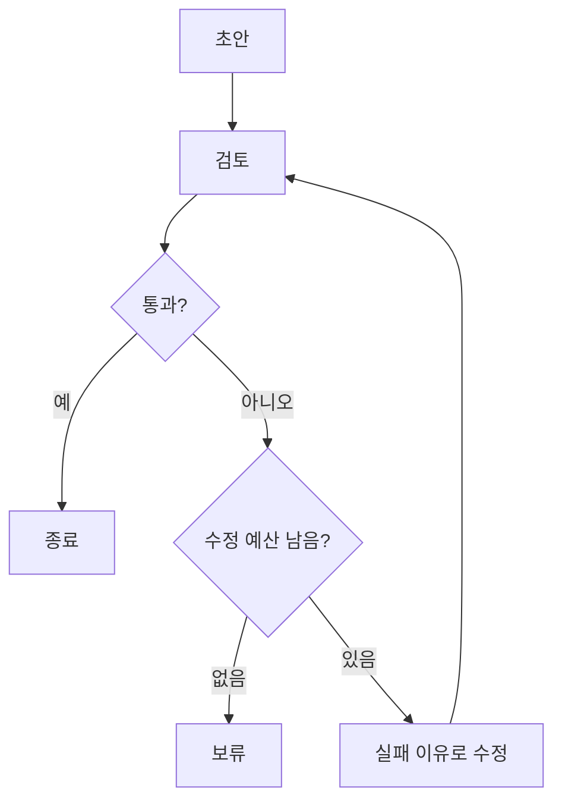

<div class="lec workshop-edition"><div class="deck">
<section class="slide">
<div class="eyebrow">2026.09 · 개인 실습 · 80분 · 개념 25 / 함께 20 / 개인 20 / 풀이 15</div>

# Harness·Loop·Graph Engineering

<p class="lead">최근 Loop·Graph Engineering 담론을 원문으로 읽고, 코딩 에이전트의 반복 작업과 역할 연결을 설계합니다. Context·Harness와의 관계를 설명하고 제공 업무 루프·DeepAgents 예제의 범위를 구분합니다.</p>

오전에 만든 문의 Agent는 조건에 따라 조회·초안·검토를 실행합니다. 이제 두 질문을 나누어 봅니다. **이 Agent가 실패한 초안을 어떻게 다룰 것인가**, 그리고 **개발자는 이 프로그램에서 발견한 결함을 코딩 에이전트로 어떻게 고칠 것인가**입니다. 전자는 제공 업무 루프로 관찰하고, 후자는 최근 Loop·Graph Engineering 담론과 설계 활동으로 다룹니다.

DeepAgents 예제는 같은 정책 업무를 다른 Harness 구성으로 관찰하는 비교 자료입니다. 앞서 작성한 학생 프로젝트를 대체하는 새 프로젝트는 아닙니다. 개인 활동의 F1은 오전 분기의 결함을 가정한 기록이므로, 별개의 업무를 처음부터 배우는 것이 아니라 자신이 만든 프로그램의 검수로 읽습니다.

<div class="cue"><div class="cue-body">모든 명령은 <code>workshop</code> 폴더에서 실행합니다. 처음이라면 <a href="./start">시작 안내</a>를 먼저 확인합니다. 앞 단계가 미완료라면 <a href="./build#recovery">복귀 절차</a>로 필요한 함수만 보완한 뒤 이어갑니다.</div></div>
</section>

<section class="slide" id="icebreaker">

## 시작 질문 · 계속 다음 일을 시키는 사람도 자동화할 수 있을까요?

LangChain은 2026년 글에서 기본 Agent 루프, 결과 검증, 이벤트에 따른 실행, 실행 기록을 통한 개선을 서로 다른 반복으로 설명합니다. GeekNews에도 소개된 논의입니다. [2026-06-16 · 원문](https://www.langchain.com/blog/the-art-of-loop-engineering) · [GeekNews 소개](https://news.hada.io/topic?id=31106)

**코딩 Agent에게 매번 “계속해, 검사해, 다음 문제를 찾아”라고 말한다면 무엇을 시스템에 맡길 수 있을까요?**

Codex·Claude Code를 쓸 때 맡길 작업·검증·중단 조건과 역할의 의존성을 설계합니다.


<details class="instructor-note"><summary>강사용 진행 노트 · 시작 질문</summary>

손들기: 코딩 Agent에게 계속하라는 말을 반복해 본 사람. 경험이 없으면 검수 결과를 보고 다음 일을 지시하는 상황을 예로 듭니다.

업무 초안을 고치는 반복과 프로그램을 개선하는 반복의 대상이 다릅니다. 원문의 구분을 유일한 표준이나 프롬프트의 폐기로 설명하지 않습니다.

이야기는 2~3분 안에서 본론으로 연결합니다. 답을 맞히게 하기보다 뒤 실습에서 확인할 질문을 남깁니다.

</details>

</section>

<nav class="lesson-nav" aria-label="학습 단계"><a href="#concept">01 개념</a><a href="#observe">02 함께 실행</a><a href="#practice">03 개인 과제</a><a href="#solution">04 풀이</a></nav>

<section class="slide" id="concept">

<aside class="teacher-aside"><strong>강사의 한마디</strong><p>여기서는 잠시 개발자의 자리로 옮겨갑니다. 문의 Agent의 답변을 만드는 일과, 코딩 에이전트에게 그 프로그램을 고치게 하는 일을 구분하겠습니다.</p></aside>


## Harness는 무엇을 관리하는가 · 7분

같은 모델도 어떤 도구·문서·지시·실행 제어를 연결했는지에 따라 행동이 달라집니다. Harness는 이 주변 구성을 가리킵니다. 단순히 프롬프트가 길다는 뜻은 아닙니다.

| 구성 | 이 예제에서의 역할 |
|---|---|
|모델|초안 또는 수정 제안|
|도구|정책 조회|
|컨텍스트·Skill|답변 절차와 관련 자료|
|상태·기록|수정 횟수·실패 이유·초안 이력|
|제어|성공 확인·수정 상한·보류|

Skill은 절차적 지시입니다. 접근 권한이나 최대 호출 수를 강제하는 보안 경계는 아닙니다. 지시를 코드 제어와 혼동하지 않습니다.


</section>

<section class="slide">

## DeepAgents와 Skill 구성 · 9분

<<< ../../workshop/course/harness_lab.py#deepagent{python}

DeepAgents는 LangChain·LangGraph 기반의 Harness 구성을 제공합니다. 예제는 가상 경로를 사용한 파일 backend와 `skills/policy-answer/SKILL.md`를 연결합니다. `skills`는 절차 문서를 찾을 경로입니다.

다음 절차 문서를 직접 엽니다. 맨 위 `name`·`description`은 어떤 상황에 사용할지 설명하는 메타데이터이고, 본문은 실행 중 참고할 절차입니다.

<<< ../../workshop/skills/policy-answer/SKILL.md{markdown}

예제의 `system_prompt`에는 “파일을 수정하지 마십시오”가 있지만, 그 문장 자체가 파일 쓰기 기능을 제거하지는 않습니다. `FilesystemBackend`는 파일 도구의 저장 위치를 정하는 구성입니다. 현재 예제는 읽기 전용 도구만 별도로 노출하도록 제한한 구현이 아닙니다. 실제 업무 문서를 연결할 때는 제공할 도구와 실행 계정의 접근 범위를 함께 정해야 합니다. [Backend 공식 설명](https://docs.langchain.com/oss/python/deepagents/backends)

개인 확인: “정책을 찾지 못한 문의”에 적용할 지시 한 줄을 찾아 설명합니다. 문서를 사람이 읽는 활동과 실행 중 모델이 문서를 읽었는지는 구분합니다. 모델의 문서 사용은 뒤의 실행 기록에서 확인합니다.

### 긴 작업에서는 무엇을 남기는가

대화가 길어지면 이전 메시지를 전부 다음 호출에 넣기 어렵습니다. 작업 목표·확인한 근거·현재 초안·남은 작업을 구분해 보관하면 필요한 내용을 다시 읽을 수 있습니다. trace는 과거 실행의 기록이고, 다음 모델 입력에 넣을 컨텍스트는 그중 현재 판단에 필요한 내용입니다.

Skill도 매번 본문 전체를 프롬프트에 붙이는 방식만 있는 것은 아닙니다. 이름·설명으로 후보를 찾고, 필요할 때 본문을 읽는 방식을 점진적 공개라고 합니다. 실행 기록에서 문서 읽기 호출이 있었는지 확인하면 실제 사용 여부를 판단하는 데 도움이 됩니다.

오늘의 예제는 짧은 작업에서 파일과 Skill을 사용하는 과정을 보여 줍니다. 세션을 넘어 작업을 복구하는 전체 시스템을 구현하지는 않습니다. 작업을 중단해야 한다면 다음 실행에 전달할 항목 세 개를 골라 적습니다. 정책 파일 자체와 실행 시점에 조회한 정책 값이 다를 수 있다는 점도 고려합니다.

수업 고정 버전은 DeepAgents 0.7.13입니다. v0.7에서는 `TodoListMiddleware`가 선택 사항이므로 `write_todos`가 기본으로 있다고 가정하지 않습니다.

계획 도구가 있어야만 성공한 실행이라고 판정하지 않습니다. 실행 기록에서 모델이 어떤 Skill 문서를 읽었는지 확인합니다. 모델 호출이 실패하면 접속을 복구한 뒤 Skill을 읽은 기록까지 확인합니다.

</section>

<section class="slide">

## 요즘 말하는 Loop·Graph Engineering · 9분

[실제 담론과 사례](./engineering#distinction)를 읽습니다. Peter Steinberger와 Addy Osmani의 Loop 설명은 사람이 매번 다음 지시를 쓰던 일을 시스템에 맡기는 방향입니다. 시작 계기·작업 선택·검증·진행 상태·종료를 함께 설계합니다.

Graph Engineering 담론에서는 여러 역할의 의존성, 병렬 실행, 산출물 계약과 검증 경계를 다룹니다. 조건 분기 하나나 LangGraph API를 이 용어 전체와 동일시하지 않습니다. [코드 검수 사례](./engineering#case)에서 기능 검토와 교재 검토가 서로를 기다려야 하는지 판단합니다.

현재 제공된 초안 수정 코드는 피드백과 종료 조건을 볼 수 있는 작은 예제입니다. 작업을 자동 발견하거나 세션을 넘어 여러 에이전트를 운영하지는 않습니다. 아래 그림은 그 **업무 수정 반복**만 보여 줍니다.



확인: 사람이 실패할 때마다 다음 프롬프트를 입력하는 작업과, 실패 기록에서 다음 작업을 선택하는 시스템은 무엇이 다른가요? 두 검토를 병렬로 실행해도 최종 판단 전에 확인해야 할 조건은 무엇인가요?

</section>

<section class="slide" id="observe">

## 함께 실습 · 20분

함께 20분은 제공 수정 루프 10분과 DeepAgents·Skill 사용 기록 10분으로 나눕니다. 아래 명령의 출력에서 실제 피드백과 read_file 호출 여부를 읽습니다. 개인 시간에는 코딩 하네스 활용 활동으로 넘어갑니다.

<details open><summary>관찰할 업무 루프와 DeepAgents 예제</summary>

<div class="command-purpose">완성 예제 실행</div>

```bash
uv run python -m course.cli harness --revisions 0
uv run python -m course.cli harness --revisions 2
uv run python -m course.cli deepagent
```

첫 실행은 근거가 부족한 최초 초안을 보류하며 수정 모델을 호출하지 않습니다. 두 번째는 실제 모델에 수정을 요청합니다. 통과 여부는 모델이 반환한 초안과 검토 결과에 따라 달라집니다. `history`에서 실패 이유와 다음 초안이 바뀌었는지 확인합니다.

2026-09-06 실제 모델 실행에서는 `read_file(file_path="/policy-answer/SKILL.md")` → `lookup_policy(topic="정산")` → P-01·재무지원팀 답변 순서를 확인했습니다. 이는 해당 입력에서 관찰한 한 번의 기록이며, 모든 질문에서 같은 Skill을 읽는다는 보장은 아닙니다.

앞의 `harness`와 세 번째 `deepagent`는 서로 독립된 실행입니다. 전자는 직접 작성한 검토·수정 반복문의 종료 조건을 관찰하고, 후자는 프레임워크가 Skill과 파일 도구를 모델에 제공하는 방식을 관찰합니다. DeepAgent가 앞에서 만든 `bounded_refine`을 자동으로 실행하는 구조는 아닙니다. 두 실행에서 코드가 제어하는 부분과 모델이 선택하는 부분을 각각 표시합니다.

세 번째 명령은 실제 모델과 DeepAgents를 실행합니다. 자신의 기록에서 `read_file` 등의 호출과 Skill 선택을 확인합니다. 도구 호출이 없는데 Skill을 읽었다고 주장하지 않습니다.


</details>

</section>

<section class="slide" id="practice">

## 개인 활동 · 20분

[Loop·Graph Engineering 설계 활동](./engineering#task)을 진행합니다. build_lab/HARNESS_WORKSHEET.md에 시작·작업 선택·종료 조건과 역할별 의존성·산출물 계약·상태 기록을 작성합니다. F1/D1 검수 사례로 중복 작업과 잘못된 PASS를 처리합니다.

코딩 도구를 사용할 수 있으면 자신의 설계에 대한 검토를 요청합니다. 계정이 없다면 동일한 활동지를 작성하고 사례 풀이와 비교합니다. 실제 자동화 등록이나 코드 변경은 공통 과제가 아닙니다.

전체 루프를 직접 작성하고 싶은 사람은 [선택 심화](./build#loop)로 진행합니다. 공통 과제를 마친 뒤 선택할 수 있습니다.

</section>

<section class="slide" id="solution">

## 풀이 · 15분

<details class="instructor-note"><summary>강사용 진행 노트 · 설계 풀이</summary>

활동지에서 시작·다음 작업 선택·중단 조건을 먼저 비교합니다. 이어서 같은 후보 버전을 검토했는지, 검토가 누락되면 어떻게 할지 묻습니다. 계정 없이 설계한 학습자도 같은 질문으로 참여합니다. 세부 시간 배분은 현장 반응에 맞춥니다.

</details>

개인 활동은 [설계 풀이와 하이프에 대한 반론](./engineering#review)으로 비교합니다. 아래 표와 명령은 업무 수정 루프를 읽기 위한 추가 참고입니다.

<div class="command-purpose">준비 문제 풀이 확인</div>

```bash
uv run python -m exercises.check harness --solution
```

| 검사 순서 | 마지막 수정에서 성공 | 문제 |
|---|---|---|
|예산 소진 → 성공 확인|held|성공을 확인하기 전에 보류합니다.|
|성공 확인 → 예산 소진|finish|성공한 초안은 추가 수정 없이 끝납니다.|
|실패 시 revise만 반환|계속 수정|상한이 동작하지 않습니다.|

수정 횟수와 검토 횟수도 다릅니다. 수정 상한 2에서 최초 검토를 포함해 몇 번 검사하는지 history의 attempt와 대조합니다. 모델에 “두 번만 수정”이라고 쓰는 것과 이 반복문이 횟수를 제한하는 것의 차이를 설명합니다.

항상 revise를 반환하면 성공 후에도 반복합니다. 예산만 먼저 검사하면 마지막 허용 수정에서 성공해도 보류할 수 있습니다. 종료 조건의 순서와 검토 횟수의 정의를 설명합니다.

계획 도구·subagent·더 긴 prompt를 추가하기 전에 현재 실패가 무엇인지 확인합니다. 구성이 복잡하다고 품질까지 높다고 판단하지 않습니다.

참고: [DeepAgents Quickstart](https://docs.langchain.com/oss/python/deepagents/quickstart), [v0.7 변경](https://www.langchain.com/blog/deep-agents-v0-7).

오늘은 코딩 하네스 활용의 방향과 판단 기준을 익힙니다. 별도 자동 반복기·중단 훅·장기 실행 인프라 구축은 수업 후 심화 범위입니다.

다음에는 다시 문의 Agent의 실행으로 돌아옵니다. 정책 조회를 다른 애플리케이션도 사용한다는 요구를 가정하고, 지금의 조회 함수를 MCP 서버로 공개합니다. 코딩 에이전트의 작업 배정 그래프와 문의 Agent의 도구 연결은 서로 다른 설계 대상입니다.

</section>

<nav class="chapnav"><a href="../toc">전체 목차</a></nav>
</div></div>
