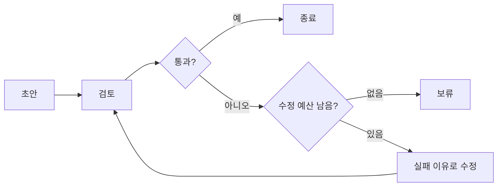

<div class="lec workshop-edition"><div class="deck">
<section class="slide">
<div class="eyebrow">2026.09 · 개인 실습 · 80분 · 개념 25 / 함께 20 / 개인 20 / 풀이 15</div>

# Harness와 Loop Engineering

<p class="lead">모델 주변의 구성과 반복의 제어를 구분합니다. 검토에 실패한 이유를 다음 수정에 전달하고 상한에서 종료합니다.</p>

<div class="cue"><div class="cue-body">모든 명령은 <code>workshop</code> 폴더에서 실행합니다. 처음이라면 <a href="./start">시작 안내</a>를 먼저 확인합니다. 앞 모듈을 끝내지 못해도 이 모듈의 제공 코드에서 시작할 수 있습니다.</div></div>
</section>

<section class="slide">

## Harness는 무엇을 관리하는가 · 7분

같은 모델도 어떤 도구·문서·지시·실행 제어를 연결했는지에 따라 행동이 달라집니다. Harness는 이 주변 구성을 가리킵니다. 단순히 프롬프트가 길다는 뜻은 아닙니다.

| 구성 | 이 예제에서의 역할 |
|---|---|
|모델|초안 또는 수정 제안|
|도구|정책 조회|
|컨텍스트·Skill|답변 절차와 관련 자료|
|상태·기록|수정 횟수·실패 이유·초안 이력|
|제어|성공 확인·수정 상한·보류|

Skill은 절차적 지시입니다. 접근 권한이나 최대 호출 수를 강제하는 보안 경계는 아닙니다. 지시를 코드 제어와 혼동하지 않습니다.

</section>

<section class="slide">

## DeepAgents와 Skill 구성 · 6분

<<< ../../workshop/course/harness_lab.py#deepagent{python}

DeepAgents는 LangChain·LangGraph 기반의 Harness 구성을 제공합니다. 예제는 가상 경로를 사용한 파일 backend와 `skills/policy-answer/SKILL.md`를 연결합니다. `skills`는 절차 문서를 찾을 경로입니다.

다음 절차 문서를 직접 엽니다. 맨 위 `name`·`description`은 어떤 상황에 사용할지 설명하는 메타데이터이고, 본문은 실행 중 참고할 절차입니다.

<<< ../../workshop/skills/policy-answer/SKILL.md{markdown}

개인 확인: “정책을 찾지 못한 문의”에 적용할 지시 한 줄을 찾아 설명합니다. 이는 Skill의 문서 구조를 읽는 활동입니다. fixed 실행에서 모델이 문서를 선택·읽었다는 증거와는 구분합니다.

수업 고정 버전은 DeepAgents 0.7.13입니다. v0.7에서는 `TodoListMiddleware`가 선택 사항이므로 `write_todos`가 기본으로 있다고 가정하지 않습니다. 계획 도구가 있어야만 성공한 실행이라고 판정하지 않습니다. fixed 모드에서는 Skill 선택을 확인할 수 없습니다. live 모드의 실행 기록에서 모델이 어떤 Skill 문서를 읽었는지 확인합니다.

</section>

<section class="slide">

## 수정 루프를 설계합니다 · 12분



<<< ../../workshop/course/harness_lab.py#loop{python}

최초 초안 검토는 수정 횟수에 포함하지 않습니다. 상한 2이면 최초 검토와 두 번의 수정 후 검토까지 최대 3번 검사합니다. 검토에 통과하면 남은 예산이 있어도 즉시 종료합니다.

동일한 입력을 다시 보내는 재시도와 실패 이유를 반영한 수정은 다릅니다. 다음 호출에 실제로 `feedback`이 전달되는지 기록으로 확인합니다. 이 예제의 verifier는 팀·정책 ID 포함을 검사하는 교육용 규칙이며 답변의 모든 사실성을 보증하지 않습니다.

실행 중 수정 루프와 수업 밖 개선 루프도 구분합니다. 전자는 한 요청을 처리하는 과정이고, 후자는 여러 테스트 결과를 보고 코드·프롬프트·도구 구성을 개선하는 개발 활동입니다.

</section>

<section class="slide">

## 함께 실습 · 20분

```bash
uv run python -m course.cli harness --revisions 0
uv run python -m course.cli harness --revisions 2
uv run python -m course.cli deepagent --mode fixed
```

첫 실행은 근거가 부족한 최초 초안을 보류합니다. 두 번째는 제공 수정 함수가 정책을 반영해 통과합니다. `history`에서 실패 이유와 다음 초안이 바뀌었는지 확인합니다.

2026-09-06 live 실행에서는 `read_file(file_path="/policy-answer/SKILL.md")` → `lookup_policy(topic="정산")` → P-01·재무지원팀 답변 순서를 확인했습니다. 이는 해당 입력에서 관찰한 한 번의 기록이며, 모든 질문에서 같은 Skill을 읽는다는 보장은 아닙니다.

세 번째는 실제 DeepAgents 실행이지만 모델은 고정 응답입니다. live 사용 가능 시 `--mode live`로 실행하고 `read_file` 등의 호출과 Skill 선택을 확인합니다. 도구 호출이 없는데 Skill을 읽었다고 주장하지 않습니다.

</section>

<section class="slide">

## 개인 과제 · 20분

**기본:** `loop_action`을 수정하여 성공이면 finish, 실패이고 예산이 남으면 revise, 실패하고 예산이 소진되면 hold를 반환합니다.

<<< ../../workshop/exercises/student.py#loop{python}

```bash
uv run python -m exercises.check harness
```

**확장:** `bounded_refine`의 복사본에서 같은 초안이 두 번 연속 나오면 개선 없음으로 종료합니다. 성공한 초안은 다시 수정하지 않아야 합니다. 두 실패 초안이 달라도 의미가 같은 경우는 단순 문자열 비교로 탐지하지 못한다는 한계를 적습니다.

확장 시작 파일은 `exercises/extensions.py`의 `refine_without_stall(draft, topic, revise, limit=2)`입니다. 기본 함수의 인자는 바꾸지 않습니다.

```bash
uv run python -m exercises.extension_check harness
uv run python -m exercises.extension_check harness --solution
```

수정 함수가 같은 실패 초안을 반환하면 두 번째 검사에서 stalled, 최초부터 통과하면 수정 없이 passed입니다. 변경은 있으나 계속 실패하면 예산에서 held로 종료합니다.

시작 코드는 FAIL이 정상입니다. 첫 명령으로 자신의 구현을 검사하고, 풀이 시간에 `exercises/extension_solutions.py`의 같은 함수를 열어 비교합니다. 정상·실패 사례는 `exercises/extension_check.py`에서 확인합니다.

<details><summary>힌트</summary>

성공 검사를 먼저 합니다. 수정 예산이 끝난 시점에 통과한 경우에도 성공으로 종료해야 합니다. 상한 0이면 최초 검토만 수행합니다.

</details>

</section>

<section class="slide">

## 풀이 · 15분

```bash
uv run python -m exercises.check harness --solution
```

항상 revise를 반환하면 성공 후에도 반복합니다. 예산만 먼저 검사하면 마지막 허용 수정에서 성공해도 보류할 수 있습니다. 종료 조건의 순서와 검토 횟수의 정의를 설명합니다.

계획 도구·subagent·더 긴 prompt를 추가하기 전에 현재 실패가 무엇인지 확인합니다. 구성이 복잡하다고 품질까지 높다고 판단하지 않습니다.

참고: [DeepAgents Quickstart](https://docs.langchain.com/oss/python/deepagents/quickstart), [v0.7 변경](https://www.langchain.com/blog/deep-agents-v0-7).

</section>

<nav class="chapnav"><a href="../toc">전체 목차</a></nav>
</div></div>
