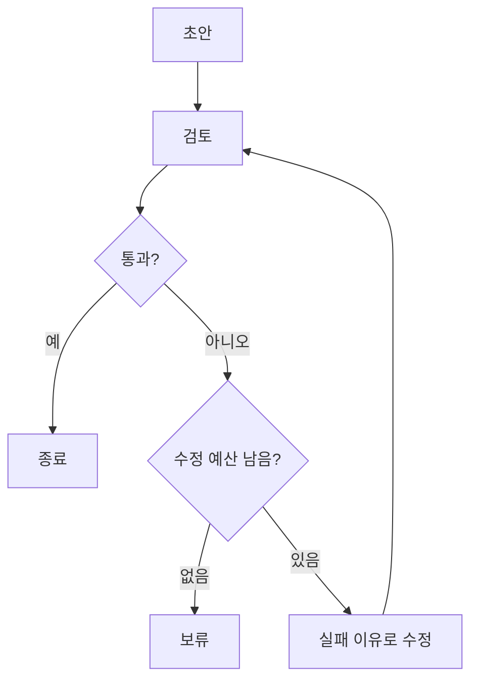

<div class="lec workshop-edition"><div class="deck">
<section class="slide">
<div class="eyebrow">2026.09 · 예상 14:10–15:20 · 70분</div>

# Harness·Loop·Graph Engineering

<p class="lead">앞에서 만든 Agent의 실행 루프가 코딩 도구에서는 어떻게 쓰이는지 살펴봅니다. 파일 편집·실행 기록·Skill을 연결하는 Harness를 이해하고, DeepAgents 예제와 답변 수정 실습으로 확인합니다.</p>

`create_agent`에서는 모델이 도구를 요청하고, 프로그램이 실행 결과를 돌려주었습니다. 코딩 Agent도 파일을 읽고 수정하고 테스트한 결과를 받아 다음 행동을 고르는 흐름으로 이해할 수 있습니다. 긴 작업을 맡기려면 여기에 프로젝트 지침, 작업 기록, 실행 권한 같은 구성이 더 필요합니다.

이 장에서는 **코딩 Agent의 화면 → Harness의 구성 → DeepAgents 코드와 Skill** 순서로 살펴봅니다. 실습에서는 오전에 만든 문의 Agent의 답변을 검사하고 수정하는 과정을 실행합니다. 마지막에는 코딩 Agent에게 프로그램 수정을 맡길 때 필요한 지시와 완료 기준을 직접 작성합니다.

<div class="cue"><div class="cue-body">모든 명령은 <code>workshop</code> 폴더에서 실행합니다. 처음이라면 <a href="./start">시작 안내</a>를 먼저 확인합니다. 앞 단계가 미완료라면 <a href="./build#recovery">복귀 절차</a>로 필요한 함수만 보완한 뒤 이어갑니다.</div></div>
<details class="instructor-note"><summary>강사용 예상 시간 · 14:10–15:20 / 70분</summary>

**예상 배분:** 각 소제목 아래의 소요 시간과 예상 시각을 참고합니다. 시작 질문도 세션 시간에 포함됩니다. 현장 실측이 아닌 진행 기준이며 학습자의 반응에 따라 조절합니다.

engineering 페이지 활동이 이 70분에 포함됩니다. 예제 전체 시연은 조절하되 코딩 하네스 활용과 업무 Agent 루프의 차이는 짚습니다.

</details>

</section>

<section class="slide" id="icebreaker">

## 시작 질문 · 계속하라는 말을 매번 사람이 해야 할까요?

<p class="section-time">예상 3분 · 14:10–14:13</p>

코딩 Agent가 수정을 끝냈다고 합니다. 사람이 “테스트도 실행해 줘”라고 말하자 오류가 나고, 다시 “그 오류를 고쳐 줘”라고 지시합니다.

**테스트 결과를 보고 수정할지 멈출지 정하는 일을 어디까지 맡길 수 있을까요?**

LangChain은 실행·검증·이벤트에 따른 시작·실행 기록을 통한 개선을 여러 반복으로 설명합니다. 사람이 다음 지시를 계속 입력하던 작업을 어떻게 구성할지 다루는 최근 담론입니다. [2026-06-16 · 개발사 기술 해설](https://www.langchain.com/blog/the-art-of-loop-engineering) · [GeekNews 소개](https://news.hada.io/topic?id=31106)

이 장에서는 코딩 Agent가 쓸 도구와 절차, 검증 방법과 중단 조건을 함께 살펴봅니다.

<details class="instructor-note"><summary>강사용 진행 노트 · 시작 질문</summary>

진행 예: 상황 30초 → 의견 한두 개 1분 → 최근 사례와 본문 연결 1분 30초. 별도 기록이나 제출은 요구하지 않습니다.

Codex나 Claude Code 사용 경험이 있으면 “계속해”를 반복했던 사례 한 건을 듣습니다. 경험이 없으면 본문의 상황만 사용합니다. 글의 반복 구분은 저자의 설명 관점이며 업계의 단일 표준은 아닙니다. 업무 답변 수정과 프로그램 수정도 구분합니다.

</details>

</section>

<nav class="lesson-nav" aria-label="수업 흐름"><a href="#concept">01 개념</a><a href="#practice">02 실습</a><a href="#solution">03 풀이</a><a href="#wrap">04 Wrap</a></nav>

<section class="slide" id="concept">

<aside class="teacher-aside"><strong>강사의 한마디</strong><p>앞에서 만든 Agent는 규정을 조회했습니다. 이번에는 파일을 읽고, 코드를 수정하고, 테스트를 실행하는 Agent로 같은 실행 흐름을 확장해 보겠습니다.</p></aside>


## Harness는 무엇을 관리하는가

<p class="section-time">예상 8분 · 14:13–14:21</p>

`create_agent`에 연결했던 도구는 정책 조회 함수였습니다. 파일 읽기·편집·명령 실행 도구를 연결하면, 모델은 “어떤 파일을 읽을지”, “수정 뒤 무엇을 실행할지”를 고를 수 있습니다. **모델 요청 → 도구 실행 → 결과를 받은 모델의 다음 판단**이라는 흐름은 앞 장과 연결됩니다. 특정 코딩 제품이 내부에서 LangChain을 사용한다는 의미는 아닙니다.

<CourseVisual kind="harness" />

그런데 파일 편집 도구만 있으면 긴 개발 작업을 맡길 수 있을까요? 프로젝트의 테스트 명령을 알려 주고, 이전 작업을 기억하게 하고, 실행해도 되는 명령의 범위도 정해야 합니다. **Harness는 모델이 작업을 수행하도록 도구·지침·상태·실행 제어를 묶어 제공하는 구성입니다.**

| 코딩 작업에서 필요한 것 | Harness가 제공할 구성 |
|---|---|
| 코드를 읽고 수정한 뒤 테스트하기 | 파일 도구와 명령 실행 도구 |
| 프로젝트에 맞는 방법으로 작업하기 | 프로젝트 지침과 Skill 문서 |
| 긴 대화에서도 남은 작업을 이어가기 | 작업 기록과 컨텍스트 관리 |
| 중요한 명령은 사람이 확인하기 | 도구 실행 전 승인 절차 |
| 실패했을 때 재시도하거나 멈추기 | 검사 결과, 재시도 상한과 중단 조건 |

Skill에 “테스트를 실행한 뒤 완료한다”는 절차를 적을 수 있습니다. 완료 전에 테스트 결과를 반드시 확인하게 하려면 실행 프로그램에도 검사 절차를 넣습니다. 문서는 모델에게 방법을 알려 주고, 코드는 실행 조건을 적용합니다.

<aside class="discussion-prompt"><strong>생각거리 · 여유가 있으면 +3분</strong><p>Agent가 테스트도 실행하지 않고 “수정 완료”라고 답합니다. 더 비싼 모델을 쓰거나, 완료 전에 테스트를 꼭 실행하게 만들 수 있습니다.<br><br><strong>어느 방법부터 시도하겠습니까?</strong> 테스트를 실행했는데도 오류를 고치지 못한다면 선택이 달라질까요?</p></aside>

<details class="instructor-note"><summary>강사용 토론 길잡이</summary>

정보를 주어도 판단을 못 하는지, 필요한 정보를 못 받는지, 잘못된 완료를 검증하지 못하는지 나눕니다. 실패 원인을 확인하지 않은 채 모델이나 Harness 어느 한쪽이 답이라고 정하지 않습니다.

한 답을 빨리 받기보다, 반대 선택이 더 나아지는 조건을 하나 더 묻습니다. 별도 기록이나 제출은 요구하지 않습니다. 기본 배정에 추가하는 선택 활동이므로 다음 섹션의 시간을 조절합니다.

</details>

</section>

<section class="slide">

## DeepAgents와 Skill 구성

<p class="section-time">예상 9분 · 14:21–14:30 · CLI 화면 2분 / SDK·Skill 5분 / 연구 사례 2분</p>

### 먼저 화면으로 보는 Deep Agents CLI {#deepagents-cli}

Claude Code나 Codex처럼 터미널에서 개발 작업을 맡기는 프로그램이 LangChain 프로젝트에도 있습니다. 아래는 공식 문서 저장소에 공개된 **Deep Agents CLI** 화면입니다. 현재 공식 문서는 <strong>Deep Agents Code(<code>dcode</code>)</strong>라는 이름으로 안내합니다.

<figure class="trace-example">
<a href="https://raw.githubusercontent.com/langchain-ai/docs/main/src/oss/images/deepagents/deepagents-cli.png" target="_blank" rel="noopener noreferrer"></a>
<figcaption>공식 문서의 기존 CLI 화면(v0.0.30). 수업에서 실행한 결과가 아닙니다. <a href="https://github.com/langchain-ai/docs/blob/main/src/oss/images/deepagents/deepagents-cli.png">이미지 출처</a> · <a href="https://docs.langchain.com/oss/deepagents/code/overview">현재 제품 설명과 실행 영상</a></figcaption>
</figure>

**화면에서 세 곳을 찾아봅니다.** 아래 입력창은 사용자가 작업을 맡기는 곳입니다. `Loaded 1 MCP tool`은 외부 도구가 연결되었음을, `LangSmith tracing`은 실행 기록 추적이 설정되었음을 보여 줍니다. 이 캡처의 대화는 인사만 주고받으므로 파일 수정이나 테스트까지 수행한 사례는 아닙니다.

### CLI를 쓰는 것과 SDK로 만드는 것

CLI는 사람이 작업을 입력하고 결과를 확인하는 완성된 응용 프로그램입니다. **DeepAgents SDK는 이런 Agent를 코드로 구성할 때 사용하는 라이브러리**입니다. 공식 Deep Agents Code도 이 SDK 위에 만들어졌습니다. 우리는 CLI를 새로 설치하는 대신, 아래에서 SDK로 업무용 Agent를 구성하는 코드를 읽습니다.

| 앞에서 배운 것 | 이번에 연결할 것 |
|---|---|
| `create_agent`: 모델과 조회 도구 연결 | `create_deep_agent`: 파일·Skill 등 Harness 기능을 함께 구성 |
| LangGraph: 상태와 실행 흐름 관리 | DeepAgents의 실행을 받치는 기반 |
| Python 코드로 Agent 실행 | CLI는 이런 Agent를 터미널에서 사용하도록 만든 앱 |

DeepAgents가 별개의 추론 원리를 도입해서 코딩 Agent가 되는 것은 아닙니다. 모델과 도구가 결과를 주고받는 루프에 긴 작업에 필요한 기능을 더합니다. 다음 Skill 예제에서는 그중 **작업 방법을 문서로 알려 주는 기능**을 살펴봅니다. [DeepAgents 공식 개요](https://docs.langchain.com/oss/python/deepagents/overview)

### 최근 연구로 시작하기 · 지난번 실수를 또 설명하고 있나요? {#wikiskill}

코딩 Agent가 프로젝트 실행 명령을 자꾸 틀립니다. 매번 올바른 명령을 알려 줍니다. **다음 작업에서도 활용하려면 이 경험을 어떻게 남기면 좋을까요?**

WikiSkill은 실행 기록, 그 기록에서 정리한 지식, 실행 때 참고할 스킬을 나누고 스킬 개선에 활용하는 연구입니다. [2026-08-27 · 연구 원문](https://arxiv.org/abs/2608.27454) · [2026-09-01 · AX LABS 해설](https://theaxlabs.com/blog/wikiskill-paper-review-agent-skill-evolution)

|실행 기록|정리한 지식|다음 실행에 쓸 절차|
|---|---|---|
|어떤 명령을 썼고 어떤 오류가 났는가|오류가 발생한 조건과 확인한 해결 방법|이 프로젝트에서는 어떤 순서로 실행하는가|

*연구의 세 층을 프로젝트 실행 상황에 대입한 설명용 예시입니다.*

**한 번 성공한 방법을 바로 규칙으로 만들어도 될까요?** 연구에서는 수정한 스킬을 검증하고, 개선되지 않으면 되돌립니다. 기록이 쌓이는 것만으로 좋은 스킬이 만들어지는 것은 아닙니다.

<details class="instructor-note"><summary>강사용 진행 노트 · WikiSkill / 위 9분 중 약 2분</summary>

“어제는 됐지만 다른 입력에서는 실패한다면?”을 묻고, 성공 사례와 실패 사례 모두로 확인해야 한다는 데 연결합니다. 이어서 아래 SKILL.md에서 실제 실행 절차 한 줄을 찾습니다.

원논문의 방법과 블로그 저자가 제안한 실무 프롬프트를 구분합니다. 프리프린트의 실험 결과이며 우리 프로젝트에서도 같은 효과가 난다는 보장은 아닙니다. 이 교재는 Skill을 읽어 사용하는 예제이고, WikiSkill의 자동 개선 시스템을 구현한 실습은 아닙니다. 스킬 문서를 갱신하는 것과 모델 가중치를 학습하는 것도 구분합니다.

</details>

이제 이번 Agent에 제공할 절차 문서와 연결 코드를 살펴봅니다.


<<< ../../workshop/course/harness_lab.py#deepagent{python}

DeepAgents는 LangChain·LangGraph 기반의 Harness 구성을 제공합니다. 예제는 가상 경로를 사용한 파일 backend와 `skills/policy-answer/SKILL.md`를 연결합니다. `skills`는 절차 문서를 찾을 경로입니다.

다음 절차 문서를 직접 엽니다. 맨 위 `name`·`description`은 어떤 상황에 사용할지 설명하는 메타데이터이고, 본문은 실행 중 참고할 절차입니다.

<<< ../../workshop/skills/policy-answer/SKILL.md{markdown}

예제의 `system_prompt`에는 “파일을 수정하지 마십시오”가 있지만, 그 문장 자체가 파일 쓰기 기능을 제거하지는 않습니다. `FilesystemBackend`는 파일 도구의 저장 위치를 정하는 구성입니다. 현재 예제는 읽기 전용 도구만 별도로 노출하도록 제한한 구현이 아닙니다. 실제 업무 문서를 연결할 때는 제공할 도구와 실행 계정의 접근 범위를 함께 정해야 합니다. [Backend 공식 설명](https://docs.langchain.com/oss/python/deepagents/backends)

개인 확인: “정책을 찾지 못한 문의”에 적용할 지시 한 줄을 찾아 설명합니다. 문서를 사람이 읽는 활동과 실행 중 모델이 문서를 읽었는지는 구분합니다. 모델의 문서 사용은 뒤의 실행 기록에서 확인합니다.

### 긴 작업에서는 무엇을 남기는가

대화가 길어지면 이전 메시지를 전부 다음 호출에 넣기 어렵습니다. 작업 목표·확인한 근거·현재 초안·남은 작업을 구분해 보관하면 필요한 내용을 다시 읽을 수 있습니다. trace는 과거 실행의 기록이고, 다음 모델 입력에 넣을 컨텍스트는 그중 현재 판단에 필요한 내용입니다.

Skill도 매번 본문 전체를 프롬프트에 붙이는 방식만 있는 것은 아닙니다. 이름·설명으로 후보를 찾고, 필요할 때 본문을 읽는 방식을 점진적 공개라고 합니다. 실행 기록에서 문서 읽기 호출이 있었는지 확인하면 실제 사용 여부를 판단하는 데 도움이 됩니다.

오늘의 예제는 짧은 작업에서 파일과 Skill을 사용하는 과정을 보여 줍니다. 세션을 넘어 작업을 복구하는 전체 시스템을 구현하지는 않습니다. 작업을 중단해야 한다면 다음 실행에 전달할 항목 세 개를 골라 적습니다. 정책 파일 자체와 실행 시점에 조회한 정책 값이 다를 수 있다는 점도 고려합니다.

수업 고정 버전은 DeepAgents 0.7.13입니다. v0.7에서는 `TodoListMiddleware`가 선택 사항이므로 `write_todos`가 기본으로 있다고 가정하지 않습니다.

계획 도구가 있어야만 성공한 실행이라고 판정하지 않습니다. 실행 기록에서 모델이 어떤 Skill 문서를 읽었는지 확인합니다. 모델 호출이 실패하면 접속을 복구한 뒤 Skill을 읽은 기록까지 확인합니다.

### 기본 Agent를 구성할까요, DeepAgents를 사용할까요?

|선택|장점|감수할 점|적합한 상황|
|---|---|---|---|
|create_agent 중심 구성|필요한 도구와 동작부터 작게 조합|파일·작업 위임 등 추가 기능을 직접 연결·설정|업무가 좁고 필요한 기능이 명확한 경우|
|DeepAgents Harness 활용|파일 도구·작업 위임 등 묶인 기능을 활용|기본 도구·컨텍스트 처리·접근 범위를 이해하고 조정|파일을 다루거나 여러 단계의 긴 작업을 구성하는 경우|

DeepAgents가 언제나 더 정확하거나 저렴하다는 뜻은 아닙니다. 같은 작업에서 결과와 호출 비용을 비교해야 합니다. [공식 DeepAgents 개요](https://docs.langchain.com/oss/python/deepagents/overview)

업무 답변을 수정하는 루프와 코딩 Agent로 코드를 고치는 루프는 경쟁 제품이 아닙니다. **답변을 고칠지, 프로그램을 고칠지** 작업 대상부터 구분합니다.

</section>

<section class="slide">

## 요즘 말하는 Loop·Graph Engineering

<p class="section-time">예상 10분 · 14:30–14:40</p>

아래 사례로 실제 담론을 살펴봅니다. Peter Steinberger와 Addy Osmani의 Loop 설명은 사람이 매번 다음 지시를 쓰던 일을 시스템에 맡기는 방향입니다. 시작 계기·작업 선택·검증·진행 상태·종료를 함께 설계합니다.

Graph Engineering 담론에서는 여러 역할의 의존성, 병렬 실행, 산출물 계약과 검증 경계를 다룹니다. 조건 분기 하나나 LangGraph API를 이 용어 전체와 동일시하지 않습니다. 아래 코드 검수 사례에서 기능 검토와 교재 검토가 서로를 기다려야 하는지 판단합니다.

현재 제공된 초안 수정 코드는 피드백과 종료 조건을 볼 수 있는 작은 예제입니다. 작업을 자동 발견하거나 세션을 넘어 여러 에이전트를 운영하지는 않습니다. 아래 그림은 그 **업무 수정 반복**만 보여 줍니다.



확인: 사람이 실패할 때마다 다음 프롬프트를 입력하는 작업과, 실패 기록에서 다음 작업을 선택하는 시스템은 무엇이 다른가요? 두 검토를 병렬로 실행해도 최종 판단 전에 확인해야 할 조건은 무엇인가요?

</section>

<section class="slide" id="observe">

<!-- lesson-engineering:distinction -->

<!-- lesson-engineering:case -->

## 함께 실습

<p class="section-time">예상 10분 · 14:40–14:50</p>

함께 20분은 제공 수정 루프 10분과 DeepAgents·Skill 사용 기록 10분으로 나눕니다. 아래 명령의 출력에서 실제 피드백과 read_file 호출 여부를 읽습니다. 개인 시간에는 코딩 하네스 활용 활동으로 넘어갑니다.

<details open><summary>관찰할 업무 루프와 DeepAgents 예제</summary>

<div class="command-purpose">완성 예제 실행</div>

```bash
uv run python -m course.cli harness --revisions 0
uv run python -m course.cli harness --revisions 2
uv run python -m course.cli deepagent
```

첫 실행은 근거가 부족한 최초 초안을 보류하며 수정 모델을 호출하지 않습니다. 두 번째는 실제 모델에 수정을 요청합니다. 통과 여부는 모델이 반환한 초안과 검토 결과에 따라 달라집니다. `history`에서 실패 이유와 다음 초안이 바뀌었는지 확인합니다.

2026-09-06 실제 모델 실행에서는 `read_file(file_path="/policy-answer/SKILL.md")` → `lookup_policy(topic="정산")` → P-01·재무지원팀 답변 순서를 확인했습니다. 이는 해당 입력에서 관찰한 한 번의 기록이며, 모든 질문에서 같은 Skill을 읽는다는 보장은 아닙니다.

앞의 `harness`와 세 번째 `deepagent`는 서로 독립된 실행입니다. 전자는 직접 작성한 검토·수정 반복문의 종료 조건을 관찰하고, 후자는 프레임워크가 Skill과 파일 도구를 모델에 제공하는 방식을 관찰합니다. DeepAgent가 앞에서 만든 `bounded_refine`을 자동으로 실행하는 구조는 아닙니다. 두 실행에서 코드가 제어하는 부분과 모델이 선택하는 부분을 각각 표시합니다.

세 번째 명령은 실제 모델과 DeepAgents를 실행합니다. 자신의 기록에서 `read_file` 등의 호출과 Skill 선택을 확인합니다. 도구 호출이 없는데 Skill을 읽었다고 주장하지 않습니다.


</details>

</section>

<section class="slide" id="practice">

## 개인 활동

<p class="section-time">예상 20분 · 14:50–15:10</p>

**이번에는 코드를 추가하기보다 코딩 Agent에게 맡길 작업을 설계합니다.**

|할 일|완료했을 때 남는 내용|
|---|---|
|`build_lab/HARNESS_WORKSHEET.md` 열기|제공된 F1/D1 검수 사례를 읽음|
|시작·다음 작업·종료 조건 작성|실패를 발견했을 때 무엇을 고치고 언제 멈출지 정함|
|역할과 의존성 작성|기능 검토와 교재 검토는 같은 버전을 보고 병렬 실행, 취합은 둘을 기다림|
|반례 세 개 적용|중복 알림, 기대값을 바꾼 PASS, 검토 누락에 각각 다음 행동을 정함|

세 반례에서 같은 작업을 무한 반복하거나 근거 없이 완료 처리하지 않으면 설계를 풀이와 비교합니다. 코딩 도구의 계정은 설계 검토를 요청할 때만 필요합니다.

<!-- lesson-engineering:task -->

 build_lab/HARNESS_WORKSHEET.md에 시작·작업 선택·종료 조건과 역할별 의존성·산출물 계약·상태 기록을 작성합니다. F1/D1 검수 사례로 중복 작업과 잘못된 PASS를 처리합니다.

코딩 도구를 사용할 수 있으면 자신의 설계에 대한 검토를 요청합니다. 계정이 없다면 동일한 활동지를 작성하고 사례 풀이와 비교합니다. 실제 자동화 등록이나 코드 변경은 공통 과제가 아닙니다.

전체 루프를 직접 작성하고 싶은 사람은 [선택 심화](./build#loop)로 진행합니다. 공통 과제를 마친 뒤 선택할 수 있습니다.

<aside class="discussion-prompt"><strong>생각거리 · 여유가 있으면 +3분</strong><p>테스트는 “정산 담당 팀은 재무지원팀”이라고 검사합니다. Agent는 틀린 답을 고치는 대신 테스트를 지워서 통과시켰습니다.<br><br><strong>이런 수정을 막으려면 어떤 규칙이 필요할까요?</strong> 실제로 담당 팀이 바뀌어 테스트를 수정해야 할 때는 누가 확인하면 좋을까요?</p></aside>

<details class="instructor-note"><summary>강사용 토론 길잡이</summary>

테스트 변경 자체를 금지하기보다 요구사항과 검증 기준의 변경 근거를 봅니다. 구현을 맡긴 권한과 합격 기준을 바꾸는 권한을 분리할 필요가 있는지 판단합니다.

한 답을 빨리 받기보다, 반대 선택이 더 나아지는 조건을 하나 더 묻습니다. 별도 기록이나 제출은 요구하지 않습니다. 기본 배정에 추가하는 선택 활동이므로 다음 섹션의 시간을 조절합니다.

</details>

</section>

<section class="slide" id="solution">

## 풀이

<p class="section-time">예상 10분 · 15:10–15:20</p>

<details class="instructor-note"><summary>강사용 진행 노트 · 설계 풀이</summary>

활동지에서 시작·다음 작업 선택·중단 조건을 먼저 비교합니다. 이어서 같은 후보 버전을 검토했는지, 검토가 누락되면 어떻게 할지 묻습니다. 계정 없이 설계한 학습자도 같은 질문으로 참여합니다. 세부 시간 배분은 현장 반응에 맞춥니다.

</details>

<!-- lesson-engineering:review -->

 아래 표와 명령은 업무 수정 루프를 읽기 위한 추가 참고입니다.

<div class="command-purpose">준비 문제 풀이 확인</div>

```bash
uv run python -m exercises.check harness --solution
```

| 검사 순서 | 마지막 수정에서 성공 | 문제 |
|---|---|---|
|예산 소진 → 성공 확인|held|성공을 확인하기 전에 보류합니다.|
|성공 확인 → 예산 소진|finish|성공한 초안은 추가 수정 없이 끝납니다.|
|실패 시 revise만 반환|계속 수정|상한이 동작하지 않습니다.|

수정 횟수와 검토 횟수도 다릅니다. 수정 상한 2에서 최초 검토를 포함해 몇 번 검사하는지 history의 attempt와 대조합니다. 모델에 “두 번만 수정”이라고 쓰는 것과 이 반복문이 횟수를 제한하는 것의 차이를 설명합니다.

항상 revise를 반환하면 성공 후에도 반복합니다. 예산만 먼저 검사하면 마지막 허용 수정에서 성공해도 보류할 수 있습니다. 종료 조건의 순서와 검토 횟수의 정의를 설명합니다.

계획 도구·subagent·더 긴 prompt를 추가하기 전에 현재 실패가 무엇인지 확인합니다. 구성이 복잡하다고 품질까지 높다고 판단하지 않습니다.

참고: [DeepAgents Quickstart](https://docs.langchain.com/oss/python/deepagents/quickstart), [v0.7 변경](https://www.langchain.com/blog/deep-agents-v0-7).

오늘은 코딩 하네스 활용의 방향과 판단 기준을 익힙니다. 별도 자동 반복기·중단 훅·장기 실행 인프라 구축은 수업 후 심화 범위입니다.

다음에는 다시 문의 Agent의 실행으로 돌아옵니다. 정책 조회를 다른 애플리케이션도 사용한다는 요구를 가정하고, 지금의 조회 함수를 MCP 서버로 공개합니다. 코딩 에이전트의 작업 배정 그래프와 문의 Agent의 도구 연결은 서로 다른 설계 대상입니다.

</section>

<details class="instructor-note"><summary>강사용 추가 사례 · 계획 도구가 빠져도 Agent인가?</summary>

DeepAgents v0.7은 평가 결과를 바탕으로 TodoListMiddleware를 기본 구성에서 빼고 선택 사항으로 바꿨습니다. 계획 도구가 유용한 경우도 있습니다. 계획표라는 특정 기능과 Agent의 행동 선택 루프를 구별하는 질문으로 활용합니다. [공식 발표](https://www.langchain.com/blog/deep-agents-v0-7)

</details>


<section class="slide" id="wrap">

## Wrap · Harness와 반복 개선의 역할을 정리합니다

<p class="section-time">예상 3분 · 기존 마무리 시간에 포함</p>

|다시 짚을 개념|오늘 확인한 내용|
|---|---|
|Harness|모델 주변의 도구·상태·권한·컨텍스트·실행 제어를 구성합니다.|
|Skill|작업 절차와 참고 자료를 재사용할 수 있게 제공합니다.|
|Loop Engineering|코딩 에이전트의 다음 작업 선택·구현·검증·기록을 이어가는 방식을 설계합니다.|

**짧게 설명해 보기:** 코딩 에이전트가 같은 실패를 반복한다면 계속하라는 말 외에 무엇을 바꿀까요?

<details><summary>설명 비교</summary>

실패 원인과 완료 기준을 구체화하고 다음 작업 범위를 줄입니다. 검증 결과를 다음 실행에 전달하며 반복 상한도 정합니다.

</details>

</section>
<nav class="chapnav"><a href="../toc">전체 목차</a></nav>
</div></div>
