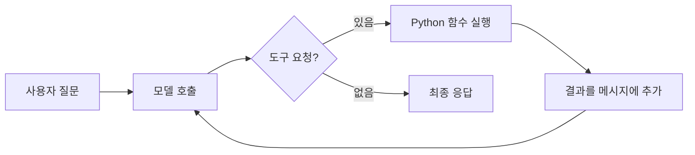

<div class="lec workshop-edition"><div class="deck">
<section class="slide">
<div class="eyebrow">2026.09 · 개인 실습 · 65분 · 개념 25 / 함께 15 / 개인 15 / 풀이 10</div>

# LangChain으로 모델과 도구 연결하기

<p class="lead">모델이 요청한 도구를 프로그램이 실행하고 결과를 모델에 전달하는 과정을 관찰합니다. 기본 과제는 조회 성공과 조회 실패의 응답을 구분하는 것입니다.</p>

<div class="cue"><div class="cue-body">모든 명령은 <code>workshop</code> 폴더에서 실행합니다. 처음이라면 <a href="./start">시작 안내</a>를 먼저 확인합니다. 앞 모듈을 끝내지 못해도 이 모듈의 제공 코드에서 시작할 수 있습니다.</div></div>
</section>

<section class="slide">

## 조회 함수에서 시작합니다 · 도입 8분

정산 문의를 어느 팀에 전달해야 하는지 확인합니다. 아래 함수의 `topic`은 입력값이며 반환 문자열은 조회 결과입니다. `POLICIES`는 학습용 사내 규정 두 건입니다. `정산`은 P-01/재무지원팀, `계정`은 P-02/IT지원팀입니다.

<<< ../../workshop/course/common.py#lookup{python}

`dict.get`은 키에 해당하는 값을 찾습니다. 없는 키이면 `None`이 반환됩니다. `found`는 정책을 찾았는지 나타내고 `policy`에는 팀·규정·ID가 담깁니다. 반환값을 JSON 문자열로 만들어 모델과 실행 기록에서 읽을 수 있게 했습니다.

<<< ../../workshop/course/langchain_lab.py#agent{python}

`model`은 응답할 모델, `tools`는 사용 가능한 함수 목록, `system_prompt`는 응답 지시입니다. `create_agent`로 구성을 만들고 `invoke`로 질문을 전달합니다. 구성을 만들기만 해서는 도구가 실행되지 않습니다.

`messages`는 대화 메시지 목록입니다. `role: user`는 사용자 입력을 뜻합니다. 모델 접속·키 로딩은 제공 함수 `get_model`이 담당합니다. 이 도입에서는 연결 설정을 새로 작성하지 않습니다.

</section>

<section class="slide">

## 질문에서 답변까지 · 7분



모델이 도구 이름과 인자를 반환하면 LangChain 실행 코드가 함수를 실행합니다. 실행 코드는 이 반환값을 tool 메시지로 대화에 추가합니다. 모델은 그 결과를 받고 다음 응답을 만듭니다.

도구를 등록했어도 모델이 항상 호출하는 것은 아닙니다. 프롬프트의 요청과 코드로 강제한 조건은 다릅니다. 이 예제에는 과도한 실행을 막는 `recursion_limit`이 있으며, 업무 성공을 보장하는 검사는 아닙니다.

**예측:** 모델이 `{name: lookup_policy, args: {topic: 정산}}`을 반환한 순간, 담당 팀 조회는 아직 시작 전입니다. 다음에는 함수 실행이 일어나야 합니다.

</section>

<section class="slide">

## 결과와 실행 기록을 구분합니다 · 10분

다음은 fixed 경로의 실제 메시지 순서입니다. 모델 응답은 제공 규칙으로 만들어지지만 LangChain의 도구 실행은 실제입니다.

| 순서 | role | 관찰 |
|---|---|---|
|1|human|topic=정산 입력|
|2|ai|lookup_policy 호출 요청|
|3|tool|found=true, policy.id=P-01|
|4|ai|재무지원팀과 근거 P-01 응답|

마지막 문장만 읽으면 모델이 규정을 추측했는지 조회했는지 구분하기 어렵습니다. 도구 이름·인자·실제 반환값·최종 응답을 함께 봅니다.

구조화 출력은 결과의 필드를 일정하게 받는 방법입니다. 오늘 기본 과제에서는 이미 구조화된 도구 결과를 읽고 문장을 구성합니다. 출력 schema가 맞는 것과 내용이 사실인 것은 별개입니다. 존재하지 않는 정책 ID를 정확한 JSON 모양으로 반환해도 올바른 답은 아닙니다.

**확인:** 없는 정책을 조회했는데 모델이 담당 팀을 단정하면 어느 기록부터 볼까요? tool 결과의 `found`와 최종 답변이 일치하는지 확인합니다.

</section>

<section class="slide">

## 함께 실행합니다 · 15분

1. `course/common.py`의 `lookup_policy`와 `POLICIES`를 엽니다. 정산 결과를 먼저 예측합니다.
2. 다음 명령으로 실행하고 `trace`의 네 메시지를 읽습니다.

```bash
uv run python -m course.cli langchain --topic 정산 --mode fixed
uv run python -m course.cli langchain --topic 모름 --mode fixed
```

3. 없는 정책에서는 `found:false`, `policy:null`을 확인합니다. 마지막 응답이 추가 확인을 요청하는지 봅니다.
4. live 사용 준비가 됐다면 같은 명령의 `fixed`를 `live`로 바꿉니다. 실제 도구 요청 여부와 응답 차이를 비교합니다. 인증 오류는 코드의 분기 문제와 구분합니다.

실행 후 `runs/langchain-fixed.json`이 갱신됩니다. 이전 결과를 보존하려면 실행 전에 별도 파일로 저장합니다. 이 실습의 출력 파일은 모드별 최신 실행 기록입니다.

</section>

<section class="slide">

## 개인 과제 · 15분

**기본:** `exercises/student.py`의 `answer_from_policy`를 수정합니다. 조회 성공이면 팀과 근거 ID를 포함하고, 실패이면 `확인`을 포함하고 `완료`를 포함하지 않는 문장으로 응답합니다.

예: “등록된 규정이 없어 추가 확인이 필요합니다.” 이는 자동 검사용 문구 계약이며 자연어의 의미 전체를 채점하지 않습니다.

<<< ../../workshop/exercises/student.py#langchain{python}

```bash
uv run python -m exercises.check langchain
```

이 과제는 모델 호출을 다시 만드는 과제가 아닙니다. 실제 tool 반환 구조를 해석해 성공·실패를 구분하는 연습입니다. 검사는 정산·없는업무·계정 세 입력을 사용합니다.

**확장:** 도구 결과와 최종 모델 답변의 근거 ID가 다를 때 경고하는 함수를 작성합니다. 정상 답변과 조작한 ID 두 사례를 테스트합니다. 단순 포함 검사로 사실성을 완전히 판정할 수 없다는 한계도 적습니다.

확장 시작 파일은 `exercises/extensions.py`의 `evidence_matches(answer, policy)`입니다. 기본 함수의 인자는 바꾸지 않습니다.

```bash
uv run python -m exercises.extension_check langchain
uv run python -m exercises.extension_check langchain --solution
```

입력은 답변 문자열과 정책 dict입니다. 정상 ID만 있으면 True, 틀린 ID 또는 정상·오류 ID가 섞이면 False여야 합니다. 이는 ID 일치 검사이며 문장의 의미를 보장하지 않습니다.

시작 코드는 FAIL이 정상입니다. 첫 명령으로 자신의 구현을 검사하고, 풀이 시간에 `exercises/extension_solutions.py`의 같은 함수를 열어 비교합니다. 정상·실패 사례는 `exercises/extension_check.py`에서 확인합니다.

<details><summary>힌트</summary>

`found`를 먼저 검사합니다. 정책이 있을 때에만 `policy['team']`과 `policy['id']`를 읽습니다. 정책이 없는데 곧바로 하위 필드를 읽으면 오류가 납니다.

</details>

</section>

<section class="slide">

## 풀이와 다음 모듈 · 10분

`exercises/solutions.py`의 `answer_from_policy`가 기준 풀이입니다.

```bash
uv run python -m exercises.check langchain --solution
```

“확인 완료”는 성공·실패를 구분하지 못합니다. 반대로 없는 정책에 임의의 팀을 넣으면 존재하지 않는 근거를 만들어 냅니다. 반환 문구를 그대로 외우기보다 `found`와 결과의 관계를 설명합니다.

개인 결과에는 수정한 함수, 정상·예외 출력, “모델의 요청과 실제 함수 실행의 차이” 한 문장을 남깁니다. 다음 LangGraph에서는 정보가 부족할 때 다른 노드로 이동하도록 코드로 표현합니다.

참고: [LangChain Agents](https://docs.langchain.com/oss/python/langchain/agents).

</section>

<nav class="chapnav"><a href="../toc">전체 목차</a></nav>
</div></div>
