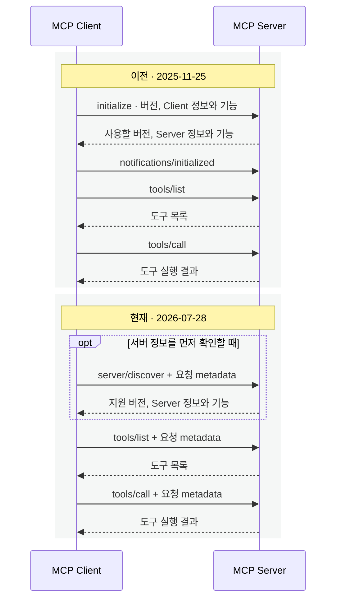

<div class="lec workshop-edition"><div class="deck">
<section class="slide">
<div class="eyebrow">2026.09 · 예상 15:30–16:35 · 65분</div>

# MCP로 도구 서버를 연결한다

<p class="lead">Python 조회 함수를 MCP 서버로 공개하고, LangChain Agent에서 원격 도구로 사용합니다. 통신 원리는 교재에서 읽고, 실제 호출은 Jupyter에서 실행합니다.</p>

앞 장의 `create_agent`에는 같은 프로그램의 함수를 연결했습니다. 이제 여러 Agent가 동일한 정책 조회를 쓰도록 별도 서버로 제공합니다. <strong>JSON-RPC로 무엇을 요청하는지 → transport로 어떻게 전달하는지 → LangChain에서 어떻게 사용하는지</strong>를 순서대로 배웁니다.

실습은 `notebooks/build-agent.ipynb`의 4번입니다. 조회 데이터와 함수는 앞 장 것을 재사용합니다. 새로 할 일은 도구 등록과 LangChain 연결 두 가지입니다.


### 이 장의 목표와 완료 확인 {#learning-goals}

|할 수 있어야 하는 일|확인할 결과|
|---|---|
|JSON-RPC 메시지와 transport의 역할을 구분합니다.|교재의 요청 ID·method·params와 HTTP 전달 경로를 설명합니다.|
|기존 조회 함수를 원격 도구로 등록하고 연결합니다.|build-agent.ipynb 4A에서 세 조회 결과, 4B에서 Agent의 원격 도구 호출을 확인합니다.|

</section>
<section class="slide" id="icebreaker">

## 시작 질문 · 같은 조회 도구를 여러 앱에서 쓰려면?

<p class="section-time">예상 3분 · 15:30–15:33</p>

문의 Agent와 코딩 Agent가 같은 사내 규정을 조회해야 합니다. 각 앱에 조회 코드를 복사하면 규정 시스템이 바뀔 때 모두 수정해야 합니다. 서버 하나를 만들면 각 앱은 도구 이름과 입력 형식을 어떻게 알아낼까요?

MCP는 이 발견과 호출 방식을 정합니다. 수업 끝에는 도구가 100개로 늘어났을 때의 문제를 [공식 로드맵](#roadmap)으로 이어갑니다.

</section>
<nav class="lesson-nav" aria-label="수업 흐름"><a href="#concept">01 개념</a><a href="#observe">02 실습</a><a href="#solution">03 풀이</a><a href="#wrap">04 Wrap</a></nav>
<section class="slide" id="concept">

## 개념 1 · 누가 누구에게 요청할까요?

<p class="section-time">예상 5분 · 15:33–15:38</p>

### Host 안의 Client가 Server와 통신합니다

|역할|맡는 일|이 수업의 예|
|---|---|---|
|**Host**|모델·사용자와 연결되는 앱입니다. Client들을 만들고, 권한·사용자 동의·모델에 전달할 문맥을 관리합니다.|문의 Agent를 실행하는 Python 앱|
|**Client**|Host 안에서 특정 MCP Server 하나와 프로토콜 메시지를 주고받는 구성요소입니다.|정책 서버에 목록·조회 요청을 보내는 MCP Client|
|**Server**|Tools·Resources·Prompts 같은 기능을 MCP로 제공합니다. 로컬 프로세스일 수도, 원격 서비스일 수도 있습니다.|정책 CSV를 읽어 조회 결과를 제공하는 서버|

Host 하나가 여러 Client를 둘 수 있고, 각 Client는 Server 하나를 담당합니다. **Client는 모델이나 사용자를 뜻하지 않습니다.** 모델이 도구와 인자를 선택하면 Host 쪽 프로그램이 Client를 통해 요청합니다. Server에 모델이 반드시 필요한 것도 아닙니다.

이 교재의 **2026-07-28 명세는 무상태 프로토콜**입니다. 각 요청에 버전·기능 정보를 담습니다. Client와 Server의 1:1 관계가 서버에 영구 세션을 유지한다는 뜻은 아닙니다. [공식 아키텍처](https://modelcontextprotocol.io/specification/2026-07-28/architecture)

### 서버가 제공하는 세 가지 기본 기능

이런 기본 기능 단위를 **primitive**라고 부릅니다. 아래는 같은 정책 업무를 세 방식으로 제공한다고 가정한 예입니다. 이번 실습에서는 Tools의 `lookup_policy`를 구현합니다.

|기능|무엇을 제공하나요?|요청과 사용 예|
|---|---|---|
|**Tools**|인자를 받아 실행하는 기능입니다. 모델이 상황에 맞게 호출을 선택하도록 설계되어 있습니다.|`tools/list`로 이름·설명·입력 형식을 확인하고, `tools/call`로 `lookup_policy(topic="계정")`를 실행해 담당 팀을 조회합니다.|
|**Resources**|URI로 식별하는 문맥·데이터입니다. Host가 어떤 내용을 대화에 넣을지 관리합니다.|`resources/list`로 목록을 찾고, `resources/read`에 `policy://rules/P-02`를 보내 규정 본문을 읽습니다. 가변 경로는 `resources/templates/list`로 URI 템플릿을 찾을 수 있습니다.|
|**Prompts**|인자로 내용을 채울 수 있는 메시지 템플릿입니다. 사용자가 원하는 작업을 선택하는 방식으로 설계되어 있습니다.|`prompts/list`에서 `policy_reply`를 찾고, `prompts/get`에 업무 주제를 보내 답변 작성용 메시지를 받습니다. 이 요청 자체가 모델을 실행하거나 답변을 완성하지는 않습니다.|

Tools는 **실행할 기능**, Resources는 **읽을 자료**, Prompts는 **대화를 시작할 메시지 구성**으로 구분합니다. 다만 모델·앱·사용자 중심이라는 설명은 사용 방식의 설계 관점이며, 모든 Host에 같은 화면이나 선택 절차를 강제하는 규칙은 아닙니다. [Tools 명세](https://modelcontextprotocol.io/specification/2026-07-28/server/tools) · [Resources 명세](https://modelcontextprotocol.io/specification/2026-07-28/server/resources) · [Prompts 명세](https://modelcontextprotocol.io/specification/2026-07-28/server/prompts)

### Claude Code에서는 Resource도 도구로 읽습니다

Claude Code는 서버가 Resources를 지원하면 모델이 목록을 찾고 내용을 읽을 수 있도록 `ListMcpResourcesTool`·`ReadMcpResourceTool`을 제공합니다. 사용자가 `@서버이름:URI`로 자료를 지정해 대화에 첨부할 수도 있습니다. **서버의 Resource를 읽도록 Host가 모델용 도구를 제공하는 것**입니다. 서버가 그 자료를 MCP Tool로 다시 등록해야 한다는 뜻은 아닙니다. Prompts는 `/` 메뉴의 명령으로 노출됩니다. [Claude Code의 Resources 사용](https://code.claude.com/docs/en/mcp#use-mcp-resources) · [도구 목록](https://code.claude.com/docs/en/tools-reference) · [Prompts 명령](https://code.claude.com/docs/en/mcp#use-mcp-prompts-as-commands)

이제 이 수업에서 구현하는 Tools의 목록 요청과 실행 요청을 따라갑니다.

<CourseVisual kind="mcp" />

### 직접 함수 호출과 MCP 호출을 구분합니다

<strong><mark class="key-point">MCP는 프로그램을 작성하는 언어나 배포 장소가 아니라, 기능을 발견하고 요청·응답을 주고받는 프로토콜입니다.</mark></strong> Python 코드에서도 MCP를 사용할 수 있고, 서버를 같은 컴퓨터에서 실행할 수도 있습니다.

|호출 방식|호출이 지나가는 경로|연결할 때 맡는 일|
|---|---|---|
|Python 함수 직접 호출|앱 안에서 `lookup_policy("계정")` 실행|함수 import와 인자를 코드로 연결|
|일반 HTTP API 호출|앱 → HTTP endpoint → 서버 함수|API별 요청·응답을 연결하고, 모델용 도구 설명과 입력 형식을 준비|
|MCP · stdio|앱의 MCP Client → 자식 프로세스의 표준 입력·출력 → MCP Server → 함수|로컬 서버 프로세스를 실행·관리하며 MCP 규약으로 도구를 발견하고 호출|
|MCP · Streamable HTTP|앱의 MCP Client → HTTP → MCP Server → 함수|MCP 규약을 사용하며 주소·인증·통신 오류 등을 관리|

같은 조회 함수를 직접 호출할 수도, MCP 서버에 등록해 stdio 또는 HTTP로 호출할 수도 있습니다. MCP 서버가 기존 HTTP API를 대신 호출하는 구성도 가능합니다. **함수가 어디에 있느냐보다 Client와 Server 사이에 어떤 규약이 오가는지를 봅니다.** 한 앱의 작은 기능이라면 직접 호출로 충분할 수 있고, 여러 Host에 같은 인터페이스를 제공하려면 MCP를 선택할 수 있습니다. [공식 전송 규약](https://modelcontextprotocol.io/specification/2026-07-28/basic/transports)

## 개념 2 · JSON-RPC는 요청의 형식, transport는 전달 방법입니다

<p class="section-time">예상 6분 · 15:38–15:44</p>

JSON은 데이터를 표현하는 형식입니다. <strong><mark class="key-point">JSON-RPC는 JSON으로 메서드 이름과 인자를 보내고 응답을 짝짓는 규칙</mark></strong>입니다. MCP는 그 위에 `tools/list`, `tools/call` 같은 메서드와 결과 형식을 정의합니다.

### 먼저 도구의 이름·설명·입력 형식을 받습니다

아래는 메시지 구조를 읽는 예입니다. 요청에는 2026-07-28의 필수 버전·기능 metadata도 표시했습니다. 실제 전송은 SDK가 처리합니다. 응답은 설명에 필요한 필드만 보여 줍니다.

```json
{
  "jsonrpc": "2.0",
  "id": 1,
  "method": "tools/list",
  "params": {
    "_meta": {
      "io.modelcontextprotocol/protocolVersion": "2026-07-28",
      "io.modelcontextprotocol/clientCapabilities": {}
    }
  }
}
```

```json
{
  "jsonrpc": "2.0",
  "id": 1,
  "result": {
    "resultType": "complete",
    "tools": [{
      "name": "lookup_policy",
      "description": "업무명으로 담당 팀과 정책을 조회합니다.",
      "inputSchema": {
        "type": "object",
        "properties": {"topic": {"type": "string"}},
        "required": ["topic"]
      }
    }]
  }
}
```

`id=1`인 요청·응답을 한 쌍으로 읽습니다. `tools`에는 호출할 수 있는 도구의 설명이 있습니다. `required: ["topic"]`은 호출할 때 `topic`이 필요하다는 뜻입니다. **목록을 받은 시점에는 계정 정책을 조회하지 않았습니다.** 페이지가 더 있으면 응답의 `nextCursor`로 다음 목록을 요청합니다.

### 이름을 골라 실제 조회를 요청합니다

```json
{
  "jsonrpc": "2.0",
  "id": 2,
  "method": "tools/call",
  "params": {
    "name": "lookup_policy",
    "arguments": {"topic": "계정"},
    "_meta": {
      "io.modelcontextprotocol/protocolVersion": "2026-07-28",
      "io.modelcontextprotocol/clientCapabilities": {}
    }
  }
}
```

`method`는 MCP 작업, `name`은 실행할 업무 도구, `arguments`는 함수에 전달할 값입니다. `id`는 요청과 응답을 짝짓습니다. 모델의 `tool_call_id`와 JSON-RPC 요청 ID는 서로 다른 계층의 식별자입니다.

```json
{
  "jsonrpc": "2.0",
  "id": 2,
  "result": {
    "resultType": "complete",
    "content": [{"type": "text", "text": "계정 담당 팀: IT지원팀, 정책: P-02"}],
    "isError": false
  }
}
```

`resultType="complete"`는 이번 요청의 결과가 완성되었음을 나타냅니다. `isError`는 도구 실행 오류 여부이고, 반환 내용이 실제 업무 질문에 충분한지는 별도로 판단합니다. [도구 요청·응답 명세](https://modelcontextprotocol.io/specification/2026-07-28/server/tools)

위 응답의 문장은 형식 설명용입니다. 실습 도구는 text 안에 정책 JSON 문자열을 반환합니다. <mark class="key-point">`tools/list`는 도구의 이름·설명·입력 schema를 반환하고, `tools/call`이 실제 조회를 실행합니다.</mark>

| Transport | 메시지가 지나가는 경로 | 선택할 때 고려할 점 |
|---|---|---|
| stdio | client가 실행한 자식 프로세스의 표준 입력·출력 | 로컬 도구에 간단함. 프로세스 관리가 필요하며 stdout에 일반 로그를 섞으면 통신을 깨뜨릴 수 있음 |
| Streamable HTTP | MCP 주소로 HTTP POST, 응답은 JSON 또는 SSE 스트림 | 원격 서버 공유에 적합. 주소·인증·네트워크 운영 필요 |

SSE는 서버가 응답을 스트림으로 전달하는 방식입니다. HTTP를 사용한다고 매번 스트리밍해야 하는 것은 아닙니다. **이번 실습은 localhost의 Streamable HTTP와 JSON 응답**을 사용합니다. 노트북 안에서 서버를 시작하지만 요청은 실제 HTTP를 통과합니다. [전송 규약](https://modelcontextprotocol.io/specification/2026-07-28/basic/transports)

### 이전의 initialize는 어디로 갔나요?

수업은 **MCP 2026-07-28과 SDK 2.1.1**을 사용합니다. 이전 예제에서 본 초기화 순서와 비교하면, 버전·기능 정보를 전달하는 시점이 달라졌습니다.



|비교할 부분|이전 · 2025-11-25|현재 · 2026-07-28|
|---|---|---|
|업무 요청 전 준비|`initialize` 응답 후 `notifications/initialized` 전송|필수 초기화 handshake 없이 요청 가능|
|버전·Client 기능|초기화에서 교환한 정보를 이후 통신에서 사용|각 요청의 `params._meta`에 전달|
|Server 기능 확인|초기화 응답에서 확인|`server/discover`로 조회 가능. 필수 선행 단계는 아님|
|서버가 버전을 지원하지 않을 때|초기화 응답의 버전과 Client 지원 범위를 대조|지원 버전이 담긴 오류를 받고, 공통 지원 버전으로 재요청하거나 오류 안내|
|프로토콜 문맥|초기화에서 교환한 문맥을 사용. HTTP 세션 ID 발급은 선택 사항|각 요청이 버전·기능을 전달하며 앞선 요청의 문맥에 의존하지 않음|

<strong><mark class="key-point">현재 방식은 “처음에 알려 줬으니 기억해 둬”에서 “이번 요청에 필요한 정보를 함께 보낼게”로 바뀐 것입니다.</mark></strong> 위 JSON의 `_meta`가 그 정보입니다. `protocolVersion`과 `clientCapabilities`는 필수이고, 예시의 빈 `{}`는 추가 Client 기능을 선언하지 않았다는 뜻입니다. Client 이름·버전인 `clientInfo`는 권장 필드이며 예시에서는 생략했습니다. HTTP에서는 일부 metadata를 헤더에도 싣지만 본문이 기준입니다. [요청 metadata](https://modelcontextprotocol.io/specification/2026-07-28/basic/index#_meta) · [Server discovery](https://modelcontextprotocol.io/specification/2026-07-28/server/discover)

무상태라는 말은 **서버의 정책 DB나 Agent의 대화 기록까지 지운다는 뜻이 아닙니다.** 여러 요청에 걸친 업무 상태가 필요하면 명시적인 식별자를 요청에 담아 연결합니다. stdio 프로세스가 계속 살아 있는 것과 프로토콜 세션을 유지하는 것도 구분합니다.

따라서 과거 예제에서 `initialize` 한 줄만 지워 이식하지 않습니다. Client·Server·SDK가 지원하는 명세를 함께 확인합니다. 두 방식을 지원하는 구현은 이전 서버를 감지해 초기화 방식으로 전환할 수 있지만, 새 방식만 지원하는 Client가 모든 이전 서버와 자동 호환되는 것은 아닙니다. [이전 lifecycle](https://modelcontextprotocol.io/specification/2025-11-25/basic/lifecycle) · [현재 버전·호환성 표](https://modelcontextprotocol.io/specification/2026-07-28/basic/versioning)

<details><summary>이전 HTTP도 여러 서버로 요청을 나눌 수 있지 않았나요?</summary>

**이전 Streamable HTTP도 WebSocket처럼 하나의 연결에 이후 요청을 고정하는 방식은 아니었습니다.** 2025-11-25 명세에서도 Client가 보내는 JSON-RPC 메시지는 각각 새로운 HTTP POST였습니다. `initialize`는 MCP의 버전·기능을 교환하는 절차이며, HTTP 연결을 WebSocket으로 전환하는 handshake가 아닙니다. 서버의 `MCP-Session-Id` 발급도 선택 사항이었고, 발급받은 경우 이후 HTTP 요청에 그 ID를 보냈습니다. [이전 Streamable HTTP와 세션 관리](https://modelcontextprotocol.io/specification/2025-11-25/basic/transports)

따라서 **여러 서버 인스턴스로 요청을 분산하는 것이 새로 가능해진 것은 아닙니다.** 이전에도 가능했으며, 세션 문맥을 사용한다면 같은 인스턴스로 라우팅하거나 문맥을 공유하는 등의 설계가 필요했습니다. 현재 방식은 버전·Client 기능을 요청마다 전달하므로, 그 프로토콜 문맥을 복원·공유해야 하는 부담을 줄입니다. 여기서 서버 A·B는 같은 MCP 서비스를 제공하는 복제 인스턴스를 뜻합니다. 정책 DB·티켓 같은 업무 상태와 진행 중인 스트림의 처리는 여전히 별도로 설계해야 합니다. [현재 무상태 요청 원칙](https://modelcontextprotocol.io/specification/2026-07-28/basic/index#statelessness)

</details>

## 개념 3 · 조회 함수를 도구로 등록합니다

<p class="section-time">예상 3분 · 15:44–15:47</p>

등록은 함수를 실행하는 일이 아닙니다. **함수의 이름·설명·입력 형식과 실행할 함수를 서버에 알려 주는 일**입니다. 새 함수라면 다음처럼 데코레이터로 등록합니다. 이 코드는 문법 비교용이며 실습에서는 이미 작성한 조회 함수를 재사용합니다.

```python
from mcp.server.mcpserver import MCPServer
from course.policy_store import search_policy  # 이 교재에서 제공하는 조회 함수

server = MCPServer("업무 정책 도구")

@server.tool()
def lookup_policy(topic: str) -> str:
    """업무명으로 담당 팀과 정책을 조회합니다."""
    return search_policy(topic)
```

`MCPServer`는 `mcp` 패키지의 서버 클래스입니다. `course.policy_store`는 설치 패키지가 아니라 수업에서 제공하는 모듈입니다. 이미 만들어 둔 `lookup_policy` 함수를 등록할 때는 다음 방식으로 같은 데코레이터를 함수에 직접 적용합니다.

```python
from mcp.server.mcpserver import MCPServer

server = MCPServer("업무 정책 도구")
register_tool = server.tool()
register_tool(lookup_policy)

# 위 두 줄을 붙여 쓴 표현:
# server.tool()(lookup_policy)
```

첫 괄호는 등록용 데코레이터를 만들고, 두 번째 괄호는 등록할 함수를 넘깁니다. `lookup_policy("계정")`처럼 조회를 실행한 결과를 등록하는 것이 아닙니다. 수업에서는 정책 조회 하나만 공개합니다.

## 개념 4 · 원격 도구도 LangChain 도구로 사용합니다

<p class="section-time">예상 3분 · 15:47–15:50</p>

서버 쪽은 MCP SDK로 도구를 공개합니다. 사용하는 쪽은 LangChain의 `MCPAdapter`로 원격 도구를 LangChain 도구로 변환합니다. 앞 장의 `create_agent(..., tools=...)`에 그대로 연결할 수 있습니다.

```python
# 연결 구조를 읽는 발췌. 실제 실행은 아래 4A·4B 노트북 셀에서 합니다.
from fastmcp import Client
from langchain.mcp import MCPAdapter
from langchain.agents import create_agent

# url은 /mcp까지 포함한 서버 주소입니다. model과 question은 별도로 준비합니다.
async with MCPAdapter(Client(url, mode="2026-07-28")) as adapter:
    tools = await adapter.list_tools()
    agent = create_agent(model=model, tools=tools)
    result = await agent.ainvoke({"messages": [{"role": "user", "content": question}]})
```

`Client`는 `fastmcp` 패키지의 MCP Client이고, `MCPAdapter`와 `create_agent`는 `langchain` 패키지에서 가져옵니다. Adapter가 MCP 도구를 LangChain 도구 인터페이스로 연결합니다.

`await`는 응답을 기다립니다. `async with`는 연결을 사용하는 범위를 정하고 끝나면 정리합니다. 원격 도구 호출이 끝날 때까지 Agent 실행도 이 범위 안에 둡니다. Jupyter는 `await`를 바로 사용할 수 있습니다.

LangChain 1.4의 `langchain.mcp`는 FastMCP client 위에서 작동합니다. 이전 별도 패키지의 `MultiServerMCPClient`와 달리 이번 고정 버전은 `MCPAdapter`를 사용합니다. 현재 beta API이므로 수업의 lockfile을 사용합니다. [공식 변경 안내](https://www.langchain.com/blog/mcp-in-langchain-stateless-protocol-elicitation-and-more)

</section>
<section class="slide" id="observe">

## 실습 · 등록 → 직접 호출 → Agent 연결

<p class="section-time">예상 15분 · 15:50–16:05</p>

<!-- lesson-exercise:protocols -->

**제공되는 것:** 정책 데이터·조회 함수, HTTP 서버 시작과 종료, 호출 횟수 기록과 결과 출력입니다. 직접 구현하는 부분은 `build_mcp_server`의 서버 생성·등록, `build_remote_agent`의 모델·도구·지침, `run_remote_agent`의 MCPAdapter 연결·list_tools·ainvoke입니다. 4A 진단 셀의 출력과 자신이 작성한 4B 연결을 대조하고 완료 판단에는 **목록 조회와 실행의 차이, 입력 오류와 업무상 결과 없음의 차이**를 설명하는 관찰 기록이 필요합니다.

4A의 `recorded_lookup`은 전달된 조회 함수가 실제 실행될 때만 횟수를 늘리는 관찰용 함수입니다. `wraps`는 원래 도구 이름·설명·입력 형식을 유지합니다. 이 기록은 모델의 호출 횟수나 모든 HTTP 요청 횟수가 아닙니다.

4A의 `await policy_tool.ainvoke({"topic": topic})`는 모델 없이 도구를 직접 실행합니다. 4B의 `await remote_agent.ainvoke(...)`는 모델이 도구 요청을 만들게 합니다. 같은 `ainvoke`라도 호출 대상이 다릅니다.

</section>
<section class="slide" id="practice">

## 실습 · 원격 Agent 연결을 완성하고 입력을 바꿉니다

<p class="section-time">예상 15분 · 16:05–16:20</p>

개인 시간의 앞 8분은 `run_remote_agent`의 연결·발견·호출 코드를 작성하고 실행합니다. 뒤 7분은 정상·미등록 업무와 잘못된 입력을 비교합니다. 막히면 풀이 노트북의 같은 4·4B를 열어 세 함수와 결과 해석을 확인합니다. 4A의 호출 횟수도 예상과 비교합니다. 노트북의 ‘4A 관찰 기록’ 표에 결과와 이유를 적습니다. **정책이 없는 경우와 입력이 잘못된 경우가 같은 실패인지** 설명합니다.

이어서 `invalid_arguments`를 자신의 입력 하나로 바꿉니다. `topic` 필수 조건을 위반하는 입력을 만들어 호출 횟수가 늘지 않는지 확인한 뒤, 유효한 업무명 입력과 비교합니다. 잘못된 입력을 다시 넣어 둔 상태로 다음 단계에 진행합니다.

4B에서는 질문을 아래처럼 바꾸어 실행합니다. 도구 이름·인자·ToolMessage·최종 답변을 함께 읽고, 최종 문장만으로 성공 여부를 판단하지 않습니다. 새 파일을 만들지 않습니다.

| 입력 | 4A 도구 결과 | 4B에서 확인할 것 |
|---|---|---|
| 정산 | P-01·재무지원팀 | 조회 요청과 결과를 거쳐 팀·정책 ID를 답함 |
| 계정 | P-02·IT지원팀 | 계정으로 조회하며 정산 결과를 재사용하지 않음 |
| 없는업무 | found=false, policy=null | 임의의 담당 팀 대신 추가 확인 안내 |

**직접 설명하기:** 4B에서 `run_remote_agent`를 완성해야 실제 연결이 실행됩니다. `async with` 안에서 도구를 발견하고 Agent를 호출하는 이유를 설명합니다. 연결을 닫은 뒤 원격 도구를 쓰는 구조가 되지 않았는지 확인합니다. 요청·도구 결과를 찾아 대응시킵니다. 일반적인 Agent는 도구가 없어도 모델만으로 답할 수 있으므로, 문장이 출력됐다는 사실만으로 원격 조회 성공을 판단하지 않습니다.

셀에서 오류가 나면 마지막 정상 출력부터 찾습니다. 서버 주소가 만들어지기 전인지, 목록 조회 중인지, 원격 함수 실행 중인지, 모델 요청 중인지에 따라 고칠 곳이 다릅니다. API 인증 오류가 나면 모델 없이 실행하는 4A까지 완료하고 모델 연결을 복구한 뒤 4B를 재실행합니다.

</section>
<section class="slide" id="solution">

## 풀이 · 바뀐 것은 조회 함수가 아니라 연결입니다

<p class="section-time">예상 7분 · 16:20–16:27</p>

`notebooks/build-agent-solution.ipynb`의 4번과 비교합니다. 도구 등록은 서버 생성 → 받은 함수 등록 → 서버 반환입니다.

```python
from mcp.server.mcpserver import MCPServer

def build_mcp_server(policy_tool):
    server = MCPServer("업무 정책 도구")
    server.tool()(policy_tool)
    return server
```

**4A 풀이 · 실행 경계를 읽습니다.** 등록 뒤와 목록 조회 뒤에는 조회 함수가 0회 실행됩니다. 정산·계정·없는업무를 차례로 호출하면 1·2·3회입니다. 없는업무도 문자열 입력 조건을 만족하므로 함수가 실행되어 `found=false`를 돌려줍니다. 반면 `{}`는 필수 `topic`이 없어 함수 본문에 도달하기 전에 거절됩니다. 오류 뒤에도 횟수는 3회입니다.

목록에서 `lookup_policy`를 찾지 못하면 서버 등록과 공개 이름을 확인합니다. 횟수가 계속 0이라면 `build_mcp_server`가 받은 `policy_tool` 대신 다른 함수를 등록했는지도 확인합니다. JSON-RPC 요청 횟수와 조회 함수 실행 횟수가 같지 않다는 점이 이 관찰의 핵심입니다.

4B에서는 `tools = await adapter.list_tools()`로 받은 도구를 Agent에 전달합니다. 데이터 조회 로직을 다시 작성할 필요가 없습니다. 서버가 등록한 함수, adapter가 반환한 도구, 모델이 요청한 도구 이름이 `lookup_policy`로 이어지는지 확인합니다.

| 보이는 결과 | 뜻 | 확인 위치 |
|---|---|---|
| 서버 접속 실패 | 통신이 성립하지 않음 | 서버 시작 셀과 URL |
| JSON-RPC error | 요청 처리 단계의 프로토콜 오류 | 메서드·요청 형식과 오류 내용 |
| 도구 실행 오류 | 호출된 도구의 실행이 실패 | 도구 인자·실행 로그 |
| found=false | 조회는 끝났지만 해당 규정이 없음 | 사용자에게 확인할 업무명 |

<mark class="key-point">프로토콜 응답의 `isError`는 도구 실행 오류 표시이며 `found`는 우리가 정한 업무 결과입니다.</mark> 고정 버전의 Adapter는 MCP 도구 오류를 처리하여 오류 내용으로 반환할 수 있습니다. Agent 안에서는 오류 상태의 ToolMessage로 전달됩니다. Python 예외가 없었다는 사실만으로 성공을 판단하지 않습니다. 필드명을 암기하는 대신 **어느 계층에서 어떤 일이 끝났는지**를 출력으로 읽습니다.

</section>
<section class="slide" id="operations">

<p class="section-time">예상 5분 · 16:27–16:32</p>

### 로드맵 읽기 · 도구가 100개라면 어떻게 찾을까요? {#roadmap}

지금은 `lookup_policy` 하나를 찾아 Agent에 연결했습니다. 여기에 휴가·출장·급여·구매 도구까지 100개가 생겼다고 가정합니다. **사용자는 출장비만 물었는데, 모델에 모든 도구 설명을 매번 전달해야 할까요?**

<figure class="trace-example">


<figcaption>왼쪽은 전체 목록을 한꺼번에 전달하는 방식, 오른쪽은 필요한 도구를 찾아 전달하는 방식을 비유합니다. AI 제작 이미지이며 특정 제품의 화면이나 성능 비교 결과는 아닙니다.</figcaption>
</figure>

#### 필요한 도구를 찾는 단계를 둡니다

|진행|출장비 문의 예시|
|---|---|
|1. 질문에서 필요한 분야를 정합니다.|“출장비를 정산하고 싶어요” → 출장·정산 관련 기능을 찾음|
|2. 그 분야의 도구 설명을 가져옵니다.|출장비 조회·영수증 확인 도구의 이름과 입력 형식을 확인|
|3. 알맞은 도구를 호출합니다.|출장비 조회에 필요한 인자를 넣어 실제 실행|

이 흐름을 **필요할 때 기능을 더 알아가는 점진적 발견(Progressive Discovery)**이라고 부릅니다. 앞의 `server/discover`는 서버의 지원 버전·기능을 확인하는 요청입니다. 여기서 말하는 것은 **많은 업무 도구 중 무엇을 모델에 보여줄지**의 문제입니다.

처음 전달할 도구 설명을 줄일 수 있지만, 찾는 단계가 추가되고 필요한 도구를 놓칠 수도 있습니다. 도구를 적게 보여주는 것만으로 좋은 설계가 되는 것은 아닙니다.

#### 지금 실습과 로드맵을 구분합니다

- **지금 실행한 것:** `adapter.list_tools()`로 도구 목록을 받아 Agent에 전달했습니다. 질문에 맞춰 목록을 좁히는 기능은 구현하지 않았습니다.
- **이미 가능한 제품별 구현:** Host가 도구 검색·선택 기능을 따로 만들 수 있습니다.
- **공식 로드맵의 방향:** 서버가 큰 도구 목록을 단계적으로 안내하는 방식과 캐시의 관계 등을 표준화하려는 작업입니다. 구체적인 새 API가 모두 확정됐다는 뜻은 아닙니다.

2026년 8월 22일 공식 로드맵은 이를 우선 과제로 제시합니다. 위 출장비 흐름은 그 방향을 이해하기 위한 설계 예시입니다. [공식 로드맵 · Improved Primitives](https://modelcontextprotocol.io/development/roadmap#4-improved-primitives)

**생각해 보기:** 출장비 도구가 있는데도 검색 결과에 일반 정산 도구만 나왔습니다. 모델이 “출장비 규정은 없습니다”라고 답해도 될까요?

<details><summary>설명 비교</summary>

도구를 찾지 못한 것과 규정이 없는 것은 다릅니다. 관련 도구를 더 찾거나 사용자에게 필요한 정보를 확인해야 합니다. 앞 실습의 `found=false`는 실제 조회 함수를 실행한 결과입니다. 도구 발견 단계에서 놓친 것을 같은 결과로 취급하면 안 됩니다.

</details>

<details><summary>더 읽기 · 나머지 로드맵은 어떤 문제를 다루나요?</summary>

|추가로 생기는 문제|로드맵이 다루는 방향|
|---|---|
|보고서가 오래 걸리고 중간에 취소 요청도 옴|장시간 작업·진행 알림·취소를 일관되게 연결|
|로컬과 원격 연결을 각각 관리함|HTTP 중심의 전송 방식 통합과 캐시 개선|
|사람이 없는 동안 보조 Agent가 호출함|호출 주체의 신원과 위임받은 권한 처리|
|같은 결과를 Client마다 다르게 해석함|도구 결과 형식과 SDK·예제의 일관성 개선|

향후 6~12개월의 개발 방향이며 고정된 출시 약속은 아닙니다. 앞에서 배운 요청별 metadata는 이미 명세에 반영된 내용이고, 이 표의 개선 작업 전체가 현재 실습에 구현된 것은 아닙니다. [공식 로드맵 전체](https://modelcontextprotocol.io/development/roadmap)

</details>

</section>
<section class="slide" id="wrap">

## Wrap · 무엇을 요청하고, 어떻게 전달하고, 누가 실행했나요?

<p class="section-time">예상 3분 · 16:32–16:35</p>

| 개념 | 이번 실습에서 확인한 것 |
|---|---|
| JSON-RPC | tools/list와 tools/call, 요청·응답 ID |
| Transport | localhost의 Streamable HTTP로 메시지 전달 |
| MCP server | 기존 조회 함수를 도구로 등록 |
| LangChain adapter | 원격 도구를 create_agent의 tools에 연결 |
| Skill과 MCP | Skill은 작업 절차, MCP는 사용할 도구의 발견·호출 규약 |

**설명해 보기:** “정책을 조회한 뒤 담당 팀과 근거를 답하라”는 Skill이 있습니다. MCP 도구를 연결하지 않았다면 Skill 문서만으로 사내 규정을 조회할 수 있을까요?

<details><summary>설명 비교</summary>

절차 문서만으로 실제 조회 기능이 생기지는 않습니다. Harness가 Skill을 읽게 하고, 조회 도구도 연결해야 합니다. 같은 MCP 도구도 어떤 Skill과 지침을 함께 주는지에 따라 작업 절차가 달라질 수 있습니다.

</details>

다음 장에서는 조회 도구를 호출하는 데서 더 나아가 완성한 초안을 독립 검토 Agent에 맡깁니다.


**목표 확인:** [이 장 첫머리의 완료 기준](#learning-goals)을 자신의 출력이나 설명과 대조합니다. 확인하지 못한 항목은 해당 셀 또는 개념 예제로 돌아갑니다. 풀이를 읽은 것과 직접 실행해 확인한 것을 구분합니다.

</section>
<nav class="chapnav"><a href="../toc">전체 목차</a></nav>
</div></div>
