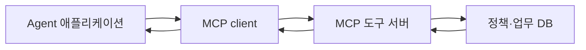

<div class="lec workshop-edition"><div class="deck">
<section class="slide">
<div class="eyebrow">2026.09 · 개인 실습 · 75분 · 개념 25 / 함께 20 / 개인 20 / 풀이 10</div>

# MCP로 도구 서버를 연결한다

<p class="lead">정책 조회를 별도 서버에서 호출합니다. 연결의 상태와 업무 데이터가 저장되는 위치를 구분합니다.</p>

<div class="cue"><div class="cue-body">모든 명령은 <code>workshop</code> 폴더에서 실행합니다. 처음이라면 <a href="./start">시작 안내</a>를 먼저 확인합니다. 앞 모듈을 끝내지 못해도 이 모듈의 제공 코드에서 시작할 수 있습니다.</div></div>
</section>

<section class="slide">

## 함수 호출에서 서버 연결로 · 7분

지금까지 조회 함수는 같은 프로그램 안에 있었습니다. 여러 애플리케이션이 같은 도구를 사용할 때 서버가 도구의 목록·입력 형식·결과를 일관되게 제공하면 연결 코드를 줄일 수 있습니다.

MCP host는 Agent를 사용하는 애플리케이션, client는 서버와 통신하는 구성, server는 도구·데이터를 제공하는 구성입니다. 모델 자체가 HTTP 요청을 직접 보내는 것은 아닙니다.



</section>

<section class="slide">

## 도구 발견·호출·결과 · 6분

<<< ../../workshop/course/mcp_lab.py#server{python}

`server.tool()`은 함수를 도구로 등록합니다. 도구 목록의 입력 schema는 어떤 인자를 받을지 설명합니다. 도구 목록에 이름이 보인다는 것과 실제 호출 성공은 다릅니다.

<<< ../../workshop/course/mcp_lab.py#client{python}

실제 호출 후 `is_error`와 결과를 확인합니다. Python SDK 필드명과 JSON wire 필드명은 다를 수 있습니다. 이 교재는 mcp 2.1.1을 lockfile로 고정합니다.

</section>

<section class="slide">

## 첫 호출을 관찰하고 상태를 구분합니다 · 12분

먼저 `uv run python -m course.cli mcp --topic 정산`을 실행합니다. `tools`에서 lookup_policy를 찾고 `result.content`에서 P-01을 읽습니다. 도구 발견→입력 전달→결과 확인의 순서를 손으로 짚습니다.

이 과정의 프로토콜은 2026-07-28입니다. 새 요청은 연결 세션에 의존하지 않고 버전·기능 정보를 요청 단위로 전달합니다. `Client(..., mode="2026-07-28")`로 요청 버전을 명시합니다.

| 위치 | 무엇을 보관하는가 | 연결을 끊으면? |
|---|---|---|
|프로토콜 요청|호출 인자와 요청별 metadata|다음 요청은 필요한 정보를 다시 전달|
|업무 저장소|티켓·정책 등 업무 데이터|저장소에 남음|

Stateless는 업무 데이터를 삭제한다는 뜻이 아닙니다. client를 바꾸거나 서버를 다시 시작해도 저장소가 같으면 업무 기록을 다시 조회할 수 있습니다. 구 SDK의 HTTP 설정과 새 프로토콜을 같은 것으로 외우지 않습니다. 이전 세션 방식·SQLite 구현 비교는 확장 자료에서 확인합니다.

</section>

<section class="slide">

## 함께 실습 · 20분

```bash
uv run python -m course.cli mcp --topic 정산
uv run python -m course.cli mcp --topic 계정
```

명령은 로컬 서버 프로세스를 시작하고 client로 실제 HTTP 호출한 뒤 자신이 시작한 서버를 종료합니다. 출력에서 protocol, tools, result.content를 읽습니다. lookup_policy의 반환 구조는 LangChain 모듈과 같습니다.

개별 서버를 관찰하려면 터미널 하나에서 다음을 실행합니다. 종료는 Ctrl+C입니다.

```bash
uv run python -m course.mcp_lab --port 9710 --db runs/tickets.sqlite
```

다른 실행 중인 서버와 포트가 충돌하면 해당 프로그램을 임의 종료하지 말고 다른 포트를 사용합니다. 기본 CLI는 비어 있는 포트를 골라 실행합니다.

</section>

<section class="slide">

## 개인 과제 · 20분

**기본:** `team_for_topic`이 입력과 관계없이 첫 번째 팀만 반환합니다. 주제로 정책을 찾아 `found`와 `team`을 반환하도록 고칩니다. 없는 주제는 Python에서 `{"found": False, "team": None}`을 반환합니다. JSON 출력에서는 `false`, `null`로 표시됩니다.

<<< ../../workshop/exercises/student.py#mcp{python}

```bash
uv run python -m exercises.check mcp
```

이 검사는 학생 함수를 실제 MCP 도구로 등록해 호출합니다. 과제 검사는 같은 프로세스의 SDK 경로이고, 앞의 CLI는 별도 HTTP 서버 경로라는 차이가 있습니다.

**확장:** `create_ticket`에 같은 키·같은 내용, 같은 키·다른 내용을 넣어 예상 결과를 검증합니다. 서버 재시작 후 같은 DB를 사용해 기록이 유지되는지도 확인합니다. 인증과 actor별 권한은 이 로컬 예제에 구현되어 있지 않습니다.

확장 시작 파일은 `exercises/extensions.py`의 `ticket_restart()`입니다. 기본 함수의 인자는 바꾸지 않습니다.

```bash
uv run python -m exercises.extension_check mcp
uv run python -m exercises.extension_check mcp --solution
```

반환 dict의 first.data.created는 True, again.data.created는 False이고 ticket_id는 같아야 합니다. conflict.error는 True입니다. 참고 풀이처럼 임시 폴더의 같은 DB를 두 서버 실행에 넘깁니다. 업무 키와 내용이 같을 때만 기존 결과를 재사용합니다.

시작 코드는 FAIL이 정상입니다. 첫 명령으로 자신의 구현을 검사하고, 풀이 시간에 `exercises/extension_solutions.py`의 같은 함수를 열어 비교합니다. 정상·실패 사례는 `exercises/extension_check.py`에서 확인합니다.

<details><summary>힌트</summary>

첫 정책을 가져오는 대신 `policies.get(topic)`으로 조회합니다. 없는 경우에는 `team`을 읽지 않습니다.

</details>

</section>

<section class="slide">

## 풀이 · 10분

```bash
uv run python -m exercises.check mcp --solution
```

정산 입력만 시험하면 항상 첫 팀을 반환하는 버그를 놓칩니다. 다른 유효 주제와 없는 주제를 포함해야 합니다. schema에 맞는 dict를 반환해도 업무 결과는 틀릴 수 있습니다.

참고: [MCP 2026-07-28 변경](https://modelcontextprotocol.io/specification/2026-07-28/changelog), [Python SDK migration](https://py.sdk.modelcontextprotocol.io/migration/).

</section>

<nav class="chapnav"><a href="../toc">전체 목차</a></nav>
</div></div>
