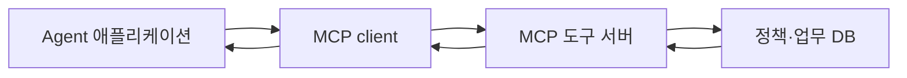

<div class="lec"><div class="deck">
<section class="slide">
<div class="eyebrow">2026.09 · 개인 실습 · 75분 · 개념 25 / 함께 20 / 개인 20 / 풀이 10</div>

# MCP로 도구 서버를 연결한다

<p class="lead">정책 조회를 별도 서버에서 호출합니다. 연결의 상태와 업무 데이터가 저장되는 위치를 구분합니다.</p>

<div class="cue"><div class="cue-body">모든 명령은 <code>workshop</code> 폴더에서 실행합니다. 처음이라면 <a href="./start">시작 안내</a>를 먼저 확인합니다. 앞 모듈을 끝내지 못해도 이 모듈의 제공 코드에서 시작할 수 있습니다.</div></div>
</section>

<section class="slide">

## 함수 호출에서 서버 연결로 · 7분

지금까지 조회 함수는 같은 프로그램 안에 있었습니다. 여러 애플리케이션이 같은 도구를 사용할 때 서버가 도구의 목록·입력 형식·결과를 일관되게 제공하면 연결 코드를 줄일 수 있습니다.

MCP host는 Agent를 사용하는 애플리케이션, client는 서버와 통신하는 구성, server는 도구·데이터를 제공하는 구성입니다. 모델 자체가 HTTP 요청을 직접 보내는 것은 아닙니다.



</section>

<section class="slide">

## 도구 발견·호출·결과 · 6분

<<< ../../workshop/course/mcp_lab.py#server{python}

`server.tool()`은 함수를 도구로 등록합니다. 도구 목록의 입력 schema는 어떤 인자를 받을지 설명합니다. 도구 목록에 이름이 보인다는 것과 실제 호출 성공은 다릅니다.

<<< ../../workshop/course/mcp_lab.py#client{python}

실제 호출 후 `is_error`와 결과를 확인합니다. Python SDK 필드명과 JSON wire 필드명은 다를 수 있습니다. 이 교재는 mcp 2.1.1을 lockfile로 고정합니다.

</section>

<section class="slide">

## Stateless는 데이터 삭제가 아닙니다 · 12분

이 과정의 MCP 프로토콜은 2026-07-28입니다. 새 요청은 프로토콜 연결 세션에 의존하지 않고 버전·기능 정보를 요청 단위로 전달합니다. 예제 client는 해당 버전을 명시하여 구 프로토콜로 조용히 돌아가지 않게 했습니다.

`server/discover`는 서버 정보를 확인하는 새 방식입니다. 요청별 metadata와 protocol session 제거가 핵심이며, 옛 SDK에서 `stateless_http=True`만 설정하는 것과 동일하지 않습니다. 새 SDK도 이전 프로토콜 호환 기능을 포함할 수 있으므로 설치 버전만 보고 실제 요청 버전을 가정하지 않습니다.

업무 티켓은 SQLite DB에 저장합니다. 서버 연결이 끊겨도 업무 데이터가 사라지는 것은 아닙니다. 같은 업무를 재요청할 때 사용하는 business_key는 요청 ID와 다릅니다. 동일 키·같은 내용은 기존 결과, 동일 키·다른 내용은 충돌로 처리합니다.

<<< ../../workshop/course/mcp_lab.py#ticket{python}

기본 과제는 이 저장 코드를 작성하지 않습니다. 확장에서 응답이 유실된 경우 중복 생성 방지를 이해하는 자료로 사용합니다. 실습 서버는 localhost에만 열며 인증 없는 공개 서버로 배포하지 않습니다.

</section>

<section class="slide">

## 함께 실습 · 20분

```bash
uv run python -m course.cli mcp --topic 정산
uv run python -m course.cli mcp --topic 계정
```

명령은 로컬 서버 프로세스를 시작하고 client로 실제 HTTP 호출한 뒤 자신이 시작한 서버를 종료합니다. 출력에서 protocol, tools, result.content를 읽습니다. lookup_policy의 반환 구조는 LangChain 모듈과 같습니다.

개별 서버를 관찰하려면 터미널 하나에서 다음을 실행합니다. 종료는 Ctrl+C입니다.

```bash
uv run python -m course.mcp_lab --port 9710 --db runs/tickets.sqlite
```

다른 실행 중인 서버와 포트가 충돌하면 해당 프로그램을 임의 종료하지 말고 다른 포트를 사용합니다. 기본 CLI는 비어 있는 포트를 골라 실행합니다.

</section>

<section class="slide">

## 개인 과제 · 20분

**기본:** `team_for_topic`이 입력과 관계없이 첫 번째 팀만 반환합니다. 주제로 정책을 찾아 `found`와 `team`을 반환하도록 고칩니다. 없는 주제는 `found:false`, `team:null`입니다.

<<< ../../workshop/exercises/student.py#mcp{python}

```bash
uv run python -m exercises.check mcp
```

이 검사는 학생 함수를 실제 MCP 도구로 등록해 호출합니다. 과제 검사는 같은 프로세스의 SDK 경로이고, 앞의 CLI는 별도 HTTP 서버 경로라는 차이가 있습니다.

**확장:** `create_ticket`에 같은 키·같은 내용, 같은 키·다른 내용을 넣어 예상 결과를 검증합니다. 서버 재시작 후 같은 DB를 사용해 기록이 유지되는지도 확인합니다. 인증과 actor별 권한은 이 로컬 예제에 구현되어 있지 않습니다.

<details><summary>힌트</summary>

첫 정책을 가져오는 대신 `policies.get(topic)`으로 조회합니다. 없는 경우에는 `team`을 읽지 않습니다.

</details>

</section>

<section class="slide">

## 풀이 · 10분

```bash
uv run python -m exercises.check mcp --solution
```

정산 입력만 시험하면 항상 첫 팀을 반환하는 버그를 놓칩니다. 다른 유효 주제와 없는 주제를 포함해야 합니다. schema에 맞는 dict를 반환해도 업무 결과는 틀릴 수 있습니다.

참고: [MCP 2026-07-28 변경](https://modelcontextprotocol.io/specification/2026-07-28/changelog), [Python SDK migration](https://py.sdk.modelcontextprotocol.io/migration/).

</section>

<nav class="chapnav"><a href="../toc">전체 목차</a></nav>
</div></div>
