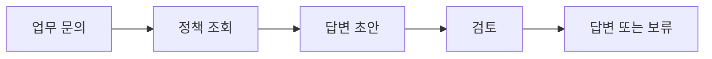

<div class="lec workshop-edition"><div class="deck">
<section class="slide">
<div class="eyebrow">2026.09 · 예상 09:00–09:40 · 40분</div>

# 시작 안내와 하루의 흐름

강사 소개와 설문 리뷰 10분으로 시작합니다. 이어서 실습 자료를 받고 실행 환경을 함께 준비합니다. 이 장에서는 완성된 예제를 한 번 실행하여 모델에 연결되는지 확인합니다. 코드를 직접 작성하는 실습은 LangChain 장에서 시작합니다.

<p class="lead">오늘은 사내 문의에 맞는 규정을 찾아 답변 초안을 만드는 프로그램을 만듭니다. 먼저 실행해 보고, 작동 원리를 배운 뒤 필요한 부분을 직접 구현합니다.</p>

<div class="cue"><div class="cue-body">모든 명령은 <code>workshop</code> 폴더에서 실행합니다. 처음이라면 강사 안내에 따라 아래 <a href="#setup">환경 준비</a>를 함께 진행합니다. 이미 준비했다면 마지막 준비 완료 체크부터 확인합니다.</div></div>
<details class="instructor-note"><summary>강사용 예상 시간 · 09:00–09:40 / 40분</summary>

**예상 배분:** 각 소제목 아래의 소요 시간과 예상 시각을 참고합니다. 시작 질문도 세션 시간에 포함됩니다. 현장 실측이 아닌 진행 기준이며 학습자의 반응에 따라 조절합니다.

설치가 일찍 끝나면 Agent 입문을 시작합니다. 개별 설치 문제는 막힌 단계와 오류를 확인하며 지원합니다.

</details>

</section>

<nav class="lesson-nav" aria-label="학습 단계"><a href="#opening">01 소개·설문 리뷰</a><a href="#overview">02 오늘의 흐름</a><a href="#setup">03 환경 준비</a><a href="#connection">04 연결 확인</a><a href="#practice">05 다음 장으로</a></nav>

<section class="slide" id="opening">

## 강사 소개와 설문 리뷰

<p class="section-time">예상 10분 · 09:00–09:10</p>

강사의 실무 경험과 오늘 다룰 주제를 소개하고, 사전 설문에 나온 경험 수준·관심 업무·궁금한 점을 함께 살펴봅니다. 자신의 응답이 오늘 어느 개념과 실습으로 이어지는지 확인합니다.

설문 리뷰를 마치면 환경설정을 함께 진행합니다. 설치 여부와 관계없이 같은 실습 폴더를 열고 첫 모델 호출까지 확인합니다. 이후 개념 설명과 개인 구현으로 이어갑니다.

</section>

<section class="slide" id="icebreaker">

## 시작 질문 · 같은 코드인데 왜 내 PC에서만 안 될까요?

<p class="section-time">예상 3분 · 09:10–09:13</p>

Anthropic은 Agent 평가에서도 이전 실행의 파일·캐시 같은 환경 차이가 결과를 왜곡할 수 있다고 설명합니다. [2026-01-09 · 원문](https://www.anthropic.com/engineering/demystifying-evals-for-ai-agents)

**같은 코드를 받았는데 한 사람만 실패했습니다. 코드를 고치기 전에 무엇부터 비교할까요?**

코드뿐 아니라 실행 위치·라이브러리·키·접속 조건을 맞추고 첫 호출까지 함께 확인합니다.


<details class="instructor-note"><summary>강사용 진행 노트 · 시작 질문</summary>

설문에서 환경 설정 경험이 나왔다면 그 응답과 연결합니다. 없던 경험을 만들어 말하지 않습니다. 손들기 또는 짧은 경험 한 건만 받습니다.

폴더, Python/의존성, 키와 네트워크라는 서로 다른 후보가 나오면 충분합니다. 환경설정이 잘못된 사람을 지목하지 않습니다.

이야기는 2~3분 안에서 본론으로 연결합니다. 답을 맞히게 하기보다 뒤 실습에서 확인할 질문을 남깁니다.

</details>

</section>

<section class="slide" id="overview">

<aside class="teacher-aside"><strong>강사의 한마디</strong><p>설치가 끝났다는 표시보다 실제 모델의 첫 응답을 확인하는 것이 중요합니다. 오류가 나면 지금 어느 단계에서 막혔는지부터 함께 보겠습니다.</p></aside>


## 오늘 만드는 것

<p class="section-time">예상 2분 · 09:13–09:15</p>

업무 문의를 읽고 규정을 조회하여 근거가 있는 답변 초안을 만듭니다. 정보가 부족하면 질문하고, 검토에 실패하면 제한된 횟수만 수정합니다. 마지막에는 도구 서버와 검토 Agent를 연결합니다.



LangChain으로 모델·도구를 연결하고 LangGraph로 분기를 표현합니다. Harness에서는 이 Agent가 일하는 환경과, 개발자가 코딩 에이전트로 이 프로그램을 개선하는 방식을 함께 살펴봅니다. 두 관점의 전환은 해당 모듈에서 구분합니다.

MCP는 도구 연결, A2A는 독립 Agent에 작업을 위임할 때 사용합니다. 각 이름의 의미는 해당 모듈에서 예제로 설명합니다.

<aside class="discussion-prompt"><strong>생각거리 · 여유가 있으면 +3분</strong><p>오늘은 만든 답변을 화면에서 확인합니다. 내일부터는 그 답변을 고객에게 자동으로 메일로 보낸다고 가정해 봅니다.<br><br><strong>바로 보내게 할까요, 사람이 먼저 읽게 할까요?</strong> 이 질문은 마지막 수업에서 다시 생각해 봅니다.</p></aside>

<details class="instructor-note"><summary>강사용 토론 길잡이</summary>

지금 정답을 확정하지 않습니다. 마지막 통합 시간에 선택이 바뀌었는지 다시 묻습니다. 구체적인 개인 업무 데이터를 공개할 필요는 없습니다.

한 답을 빨리 받기보다, 반대 선택이 더 나아지는 조건을 하나 더 묻습니다. 별도 기록이나 제출은 요구하지 않습니다. 기본 배정에 추가하는 선택 활동이므로 다음 섹션의 시간을 조절합니다.

</details>

</section>

<section class="slide">

## 환경 준비: 자료를 받은 뒤 첫 호출까지 {#setup}

<p class="section-time">예상 22분 · 09:15–09:37</p>

실습 시작에는 **자료 받기 → Ubuntu 진입 → 편집기로 열기 → 의존성 설치 → 키 설정 → 실제 호출 확인**이 필요합니다. 이미 준비한 항목은 확인 후 넘어갑니다. 환경설정은 강사와 함께 진행합니다. 이미 설치한 사람도 편집기 위치·의존성·키 설정·첫 호출을 차례로 확인합니다.

<details><summary>Python 코드 읽기가 어색하다면: 사전 준비 5분</summary>

함수에 값을 넣고 반환값을 받는 흐름을 먼저 확인합니다. Python 전체 문법을 다시 배우는 시간이 아니라, 뒤 실습에서 반복해서 읽을 표기입니다.

```python
import json

def read_team(topic):
    teams = {"정산": "재무지원팀", "계정": "IT지원팀"}
    team = teams.get(topic.strip())
    return json.dumps({"team": team}, ensure_ascii=False)

result = read_team(" 계정 ")
print(result)
print(json.loads(result)["team"])
```

`topic`은 함수에 넣은 값, `return`은 호출자에게 돌려줄 값입니다. `strip()`은 앞뒤 공백을 정리하고 `get()`은 이름에 대응하는 값을 찾습니다. `dumps()`는 dict를 JSON 문자열로, `loads()`는 JSON 문자열을 Python 값으로 바꿉니다.

첫 출력은 `{"team": "IT지원팀"}`, 두 번째는 `IT지원팀`입니다. 입력을 `출장`으로 바꾸면 첫 출력의 team은 `null`, 두 번째는 `None`입니다. 이 차이를 설명하기 어렵다면 설치 후 새 Python 파일에 위 예제를 실행하고 한 줄씩 비교합니다. LangChain·LangGraph 경험이나 Git 숙련은 이 확인의 조건이 아닙니다.

</details>

### 1. 이번 수업 자료를 받습니다

**2026.09-rc1 실습 자료**를 [ZIP으로 받습니다](../downloads/agent-workshop-2026.09-rc1.zip). 압축을 풀면 workshop 폴더가 나옵니다. 교재 웹페이지를 여는 것만으로 실습 코드가 설치되지는 않습니다. 다른 버전의 파일을 섞지 않습니다. Git을 사용하는 경우 [Git으로 받기](../git-setup)의 별도 안내를 따릅니다.

```text
workshop/                   ← 압축을 푼 자료와 명령 실행 위치
├── pyproject.toml          ← 라이브러리 목록
├── uv.lock                 ← 검증한 의존성 버전
├── .env.example            ← 키 설정 양식
├── RELEASE.md              ← 자료 버전과 시작 안내
├── MANIFEST.json           ← 파일별 무결성 정보
├── build_lab/              ← 주 실습·제공 구조·활동지·풀이
├── notebooks/              ← 학생/풀이 주피터 노트북
├── course/                 ← 비교 시연용 완성 예제
├── exercises/              ← 준비 문제와 선택 심화
├── tests/                  ← 단계별 검사
└── skills/                 ← Agent가 읽는 업무 지침
```

압축을 푼 뒤 `workshop/build_lab/student.py`가 있는지 확인합니다. 파일이 없다면 위 ZIP을 다시 받아 다른 폴더에 압축을 풉니다.

### 2. Windows에서는 Ubuntu 터미널을 엽니다

아래 두 명령은 **Windows PowerShell**에서 실행합니다. 첫 명령으로 설치된 배포판을 확인한 뒤, 목록에 `Ubuntu-24.04`가 있으면 두 번째 명령으로 들어갑니다.

```powershell
wsl --list --verbose
wsl -d Ubuntu-24.04
```

Ubuntu에 들어온 뒤에는 아래 절의 `bash` 명령을 그 터미널에서 실행합니다. PowerShell 창과 Ubuntu 창에 같은 명령을 번갈아 입력하지 않습니다. 이 교재의 실행 검증 환경은 WSL2의 Ubuntu 24.04입니다.

<details><summary>Ubuntu가 아직 없다면: 설치 방법</summary>

관리자 PowerShell에서 다음 명령을 실행합니다. 재시작 안내가 나오면 Windows를 재시작하고 Ubuntu의 사용자 이름과 비밀번호를 만듭니다.

```powershell
wsl --install -d Ubuntu-24.04
```

회사 PC에서 설치가 제한되면 담당자가 승인한 실습 환경을 준비합니다. 설치 권한이나 재부팅 문제로 진행이 막히면 강사에게 알려 사용할 수 있는 실습 환경을 함께 확인합니다. 자세한 절차는 [Microsoft WSL 설치 안내](https://learn.microsoft.com/en-us/windows/wsl/install)를 참고합니다.

</details>

macOS·Linux는 WSL 진입 단계가 없습니다. 자신의 터미널에서 이어갈 수 있으나, 설치·실행 안내의 기준 환경은 위 WSL 구성입니다.

### 3. 같은 폴더를 편집기와 터미널에서 엽니다

Windows에서 받은 자료는 파일 탐색기의 주소 표시줄에 `\\wsl.localhost\Ubuntu-24.04\home`을 입력하고 자신의 Ubuntu 사용자 폴더 안으로 복사할 수 있습니다. 그 안에 `lecture` 폴더를 새로 만들고, 압축을 풀어 얻은 **workshop 폴더 전체**를 넣습니다. 결과는 `자신의 사용자 폴더/lecture/workshop/pyproject.toml` 형태입니다. 이미 사용 중인 동명 폴더를 덮어쓰지 않습니다.

**Ubuntu 터미널**에서 다음 명령을 실행합니다. `cd`는 폴더 이동, `pwd`는 현재 위치 확인, `ls`는 파일 목록 확인입니다.

```bash
cd ~/lecture/workshop
pwd
ls pyproject.toml uv.lock course exercises skills
code .
```

`code .`은 현재 폴더를 VS Code로 엽니다. 왼쪽 아래에 `WSL: Ubuntu-24.04`와 같은 표시가 있는지 확인합니다. VS Code의 **터미널 → 새 터미널**을 열고 `pwd`를 실행했을 때도 끝이 `/lecture/workshop`이어야 합니다.

`code`를 찾지 못하면 Windows에 VS Code와 WSL 확장을 설치한 뒤 Ubuntu 터미널을 다시 엽니다. 편집기를 통해 WSL 폴더를 여는 절차는 [VS Code WSL 안내](https://code.visualstudio.com/docs/remote/wsl)를 참고합니다.

### 4. 이번 실습의 Python 환경을 설치합니다

먼저 `uv --version`을 실행합니다. 버전이 나오면 설치 명령은 건너뜁니다. `uv`를 찾지 못할 때만 Ubuntu 터미널에서 다음 명령으로 설치합니다.

```bash
curl -LsSf https://astral.sh/uv/install.sh | sh
source "$HOME/.local/bin/env"
uv --version
```

이 명령은 [uv 공식 설치 방법](https://docs.astral.sh/uv/getting-started/installation/)입니다. 회사의 설치 정책으로 차단된다면 담당자가 승인한 설치 방법을 사용합니다.

현재 위치가 `workshop`인 상태에서 의존성을 설치합니다.

```bash
uv sync --locked --python 3.12
uv run python --version
uv run python -c "import langchain, langgraph, deepagents, mcp, a2a; print('라이브러리 준비 완료')"
```

`uv`는 이 폴더의 `.venv`에 Python 실행 환경과 라이브러리를 준비합니다. `--locked`는 배포된 `uv.lock`과 일치하는 버전을 설치하도록 합니다. 다운로드 시간은 네트워크에 따라 달라집니다.

`uv run`은 현재 프로젝트의 실행 환경으로 명령을 실행합니다. 따라서 다른 위치의 Python에 라이브러리가 설치되어 있어도 이 폴더의 `.venv`와 같다고 가정하지 않습니다.

위 명령은 `workshop/.venv`에 실습용 환경을 만듭니다. 교재는 웹에서 읽으므로 실습을 위해 Node나 교재 빌드 환경을 설치할 필요는 없습니다.

VS Code에서 Python 확장을 설치하고 **Ctrl+Shift+P → Python: Select Interpreter**로 현재 열린 `workshop` 폴더의 `.venv/bin/python`을 선택합니다. 코드 실행은 교재에 있는 `uv run ...` 명령을 사용합니다.

### 5. 키 설정 파일을 만듭니다

VS Code의 탐색기에서 `.env.example`을 복사하여 같은 폴더에 `.env`라는 이름으로 저장합니다. 기존 `.env`가 있다면 덮어쓰지 않고 사용합니다. 숨김 파일이 보이지 않으면 탐색기의 새 파일 기능으로 `.env`를 만듭니다.

```dotenv
OPENROUTER_API_KEY=
WORKSHOP_MODEL=google/gemini-3.1-flash-lite
```

담당자가 전달한 키를 첫 줄의 `=` 뒤에 넣고 저장합니다. 키는 터미널 명령이나 학습 기록에 붙여 넣지 않습니다. `WORKSHOP_MODEL`은 요청할 모델의 ID이며, 제공된 설정을 우선 사용합니다.

개인 학습자는 자신의 OpenRouter 계정에서 API 키를 준비해 같은 설정을 사용합니다. [공식 시작 안내](https://openrouter.ai/docs/quickstart)에서 계정과 API 사용 방법을 확인합니다. 모델을 바꿀 때는 도구 호출 지원과 자신의 사용 한도를 확인하고, 아래 첫 호출로 연결을 검증합니다.

### 6. 실제 모델과 도구가 연결됐는지 확인합니다

<div class="command-purpose">완성 예제 실행</div>

```bash
uv run python -m course.cli langchain
```

명령이 끝나면 VS Code에서 `runs/langchain.json`을 엽니다. 마지막 답변에서 정산 담당 팀과 근거 ID를 확인합니다. 문장이 예시와 똑같을 필요는 없습니다. 아래 메시지별 항목은 다음 Agent 장에서 자세히 읽습니다.

<details><summary>실행 결과에서 찾을 항목 · 다음 장에서 함께 읽습니다</summary>

|확인 위치|찾아야 하는 내용|뜻|
|---|---|---|
|`human` 메시지|`정산`이라는 주제|프로그램에 넣은 요청|
|`ai`의 `tool_calls`|`lookup_policy`와 조회 인자|모델이 선택한 조회 요청|
|`tool` 메시지|`found`, `P-01`, `재무지원팀`|함수가 실제로 반환한 정책|
|마지막 `ai` 메시지|조회 근거를 사용한 답변|도구 결과를 받은 모델의 응답|

</details>

`ai` 메시지의 본문이 비어 있어도 `tool_calls`가 있으면 도구 요청일 수 있습니다. 파일 생성이나 마지막 문장만으로 연결 성공을 판단하지 않습니다. 실제 호출이 실패했다면 아래 복구 안내에 따라 해결한 뒤 다시 실행합니다.

<details class="instructor-note"><summary>강사용 진행 노트 · 설치 확인</summary>

화면이나 오류를 함께 볼 때는 키 값과 개인 업무 데이터를 가립니다. 전체에게 오류 전문을 읽게 하기보다 폴더·설치·인증·접속 중 막힌 단계를 먼저 확인합니다.

</details>

### 준비 완료 체크

<div class="setup-checklist" role="group" aria-label="준비 완료 체크">
<label><input type="checkbox"><span><code>workshop</code> 폴더가 있고, 편집기에서 <code>build_lab/student.py</code>를 열 수 있습니다.</span></label>
<label><input type="checkbox"><span>편집기 터미널의 현재 위치가 <code>workshop</code>이며 Python과 라이브러리 확인이 성공합니다.</span></label>
<label><input type="checkbox"><span><code>.env</code>를 저장했고 실제 모델 호출이 성공합니다.</span></label>
<label><input type="checkbox"><span><code>runs/langchain.json</code> 파일이 생겼고 정산 문의에 대한 답변을 확인했습니다.</span></label>
</div>

수업 당일에는 이 상태를 확인하고 오늘의 흐름을 안내합니다. 환경이 준비되지 않았다면 어느 단계에서 막혔는지와 오류 메시지를 전달합니다. 키 값은 공유하지 않습니다.


</section>

<section class="slide" id="connection">

## 실제 모델로 실습합니다

<p class="section-time">예상 2분 · 09:37–09:39</p>

교재의 모델 호출 명령은 실제 LLM에 연결합니다. 실제 모델이므로 답변 표현이나 도구 호출 횟수는 실행마다 달라질 수 있습니다.

앞의 준비 단계에서 설정한 키를 사용합니다. `WORKSHOP_MODEL`로 모델을 바꿀 수 있으며, 제공 키의 사용 가능 여부는 수업 전에 확인합니다.

<details><summary>모델 호출이 실패할 때: 원인 확인과 복구</summary>

LLM 호출 성공까지가 실습 준비입니다. 오류 코드와 메시지를 확인하고 원인을 해결한 뒤 같은 명령으로 다시 호출합니다. 키 값은 공유하지 않습니다.

| 증상 | 확인할 것 | 복구 방법 |
|---|---|---|
|키 누락·인증 오류|현재 작업 폴더의 `.env`, 키의 유효 상태|유효한 실습용 키를 설정하고 다시 실행|
|잔액·호출 한도 오류|계정 잔액과 사용 한도, 응답의 재시도 안내|담당자에게 한도 조정을 요청하거나 사용 가능한 실습 계정으로 변경|
|모델 사용 불가|`WORKSHOP_MODEL`의 모델 ID와 계정의 접근 가능 여부|담당자가 확인한 도구 호출 지원 모델로 변경하고 재실행|
|연결 실패·시간 초과|사내 프록시·방화벽·네트워크 상태|허용된 네트워크 또는 준비된 실행 환경에서 연결 확인|

복구 확인에는 실제 모델의 도구 요청, 도구 반환값, 최종 답변이 포함됩니다. 개인 과제의 코드 검사는 별도로 실행할 수 있지만 실제 모델 실행은 복구 후 완료합니다.

</details>

</section>

<section class="slide" id="practice">

## 환경 준비가 끝났습니다

<p class="section-time">예상 1분 · 09:39–09:40</p>

다음 장에서는 방금 실행한 예제를 보며 Agent가 모델과 도구를 어떻게 사용하는지 알아봅니다. `runs/langchain.json`은 그때 다시 엽니다. 지금은 프로그램을 수정하거나 미완성 함수를 검사하지 않아도 됩니다.

[다음: Agent는 어떻게 실행되는가](./agent)

</section>

<nav class="chapnav"><a href="../toc">전체 목차</a></nav>
</div></div>
