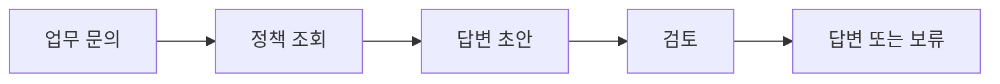

<div class="lec workshop-edition"><div class="deck">
<section class="slide">
<div class="eyebrow">2026.09 · 개인 실습 · 20분</div>

# 시작 안내와 하루의 흐름

<p class="lead">개념을 함께 배우고, 작은 예제를 실행한 뒤 개인이 한 가지 조건을 바꿉니다. 이미 익숙한 내용에서는 확장 문제로 진행할 수 있습니다.</p>

<div class="cue"><div class="cue-body">모든 명령은 <code>workshop</code> 폴더에서 실행합니다. 처음이라면 <a href="./start">시작 안내</a>를 먼저 확인합니다. 앞 모듈을 끝내지 못해도 이 모듈의 제공 코드에서 시작할 수 있습니다.</div></div>
</section>

<section class="slide">

## 오늘 만드는 것

업무 문의를 읽고 규정을 조회하여 근거가 있는 답변 초안을 만듭니다. 정보가 부족하면 질문하고, 검토에 실패하면 제한된 횟수만 수정합니다. 마지막에는 도구 서버와 검토 Agent를 연결합니다.



LangChain으로 모델·도구를 연결하고 LangGraph로 분기를 표현합니다. Harness와 Loop Engineering은 실행에 필요한 지식·도구·피드백·종료 조건을 다룹니다.

MCP는 도구 연결, A2A는 독립 Agent에 작업을 위임할 때 사용합니다. 각 이름의 의미는 해당 모듈에서 예제로 설명합니다.

</section>

<section class="slide">

## 왜 이 순서로 배우는가

오늘의 목표는 새 라이브러리 이름을 많이 아는 것이 아닙니다. 업무 문의 하나를 처리하면서 **어떤 결정을 모델에 맡기고 어떤 조건을 코드로 지킬지** 설명하는 것입니다.

|앞 단계에서 남은 문제|다음에 배우는 개념|직접 확인할 결과|
|---|---|---|
|모델이 정책을 모름|LangChain의 도구 호출|조회 요청과 실제 반환값|
|정보가 부족해도 답변을 만듦|LangGraph의 상태·분기|초안 작성 대신 질문|
|검토에 실패해도 같은 답을 반복|Harness·수정 루프|실패 이유 반영, 상한에서 보류|
|여러 프로그램이 같은 도구를 사용|MCP|다른 프로세스의 조회 결과|
|별도 시스템에 검토를 맡김|A2A|작업 상태와 검토 산출물|

실습을 마칠 때는 수정 코드와 실행 결과를 남기고, 그 결과가 요구 사항을 충족하는 이유를 설명합니다. 기능을 추가할 때마다 이 목적에 필요한지 먼저 판단합니다.

</section>

<section class="slide">

## 사전 준비와 실행 위치

실습 환경은 수업 전에 준비합니다. Linux·Git·Python 입문 전체를 배우는 과정은 아닙니다. 다만 예제에 등장하는 함수·조건문·키와 값은 필요한 지점에서 설명합니다.

1. 제공 자료에서 `workshop` 폴더를 엽니다.
2. 터미널의 현재 위치가 그 폴더인지 확인합니다.
3. 다음 명령을 실행합니다. `uv`는 프로젝트의 고정된 Python 의존성으로 실행하는 도구입니다.

```bash
uv sync --locked
uv run python -m course.cli langchain --mode fixed
```

`sync`는 사전 준비 단계의 설치 명령입니다. 이미 준비됐다면 두 번째 명령부터 실행합니다. `runs/langchain-fixed.json`에 질문·도구 호출·결과·답변이 기록됩니다. 파일이 생성됐다는 사실만으로 내용이 옳다고 판단하지 않습니다.

실행할 파일과 명령을 찾을 수 없으면 기본 안내를 확인하고 강사에게 현재 오류를 전달합니다. 패키지를 임의 업그레이드하거나 다른 모듈의 코드를 옮겨 붙이지 않습니다.

</section>

<section class="slide">

## fixed와 live의 차이

| 모드 | 실제로 실행하는 것 | 확인할 수 없는 것 |
|---|---|---|
| fixed | LangChain/LangGraph/DeepAgents 실행과 실제 Python 도구. 모델 응답은 고정 규칙으로 생성 | 모델의 자연어 판단·Skill 선택 능력 |
| live | OpenRouter를 통한 모델 호출과 동일한 도구/실행 구조 | 매번 동일한 표현·동일한 호출 횟수 보장 |

MCP·A2A 기본 예제는 별도 로컬 프로세스를 실제로 호출합니다. A2A의 fixed 검토기는 결정론적 규칙 검사이며 LLM 판단으로 부르지 않습니다. `harness` 명령도 수정 함수가 고정되어 있고 `deepagent` 명령이 실제 DeepAgents 구성을 실행합니다.

live는 `workshop/.env`에 유효한 `OPENROUTER_API_KEY`를 설정한 경우 실행합니다. `.env.example`을 참고하고 키를 결과 파일·공유 화면에 포함하지 않습니다.

`WORKSHOP_MODEL`로 모델을 바꿀 수 있습니다. 제공 키의 실제 사용 가능 여부는 수업 전 확인합니다.

</section>

<section class="slide">

## 개인 과제와 복귀

`exercises/student.py`의 해당 함수 하나만 수정합니다. 시작 코드는 일부 조건을 놓치도록 작성돼 있어 처음 검사는 실패합니다. `FAIL`은 설치 실패와 다릅니다.

```bash
uv run python -m exercises.check langchain
```

기본 과제는 한 조건을 바꾸고 정상·예외 입력의 차이를 설명하는 것이 목표입니다. 확장은 직접 설계와 테스트를 추가합니다. 둘을 모두 끝낼 필요는 없으며 모듈마다 선택을 바꿀 수 있습니다.

막히면 힌트를 보고, 그래도 진행이 어렵다면 `--solution`으로 기준 풀이의 결과를 확인합니다. 기존 파일은 덮어쓰지 않습니다. 다음 모듈은 독립 시작 파일로 실행하므로 이전 과제 실패가 누적되지 않습니다.

</section>

<nav class="chapnav"><a href="../toc">전체 목차</a></nav>
</div></div>
