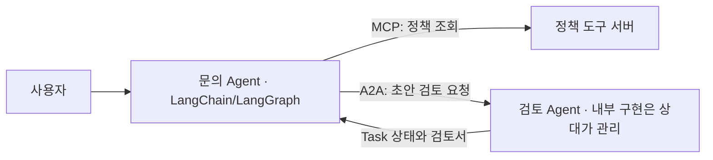
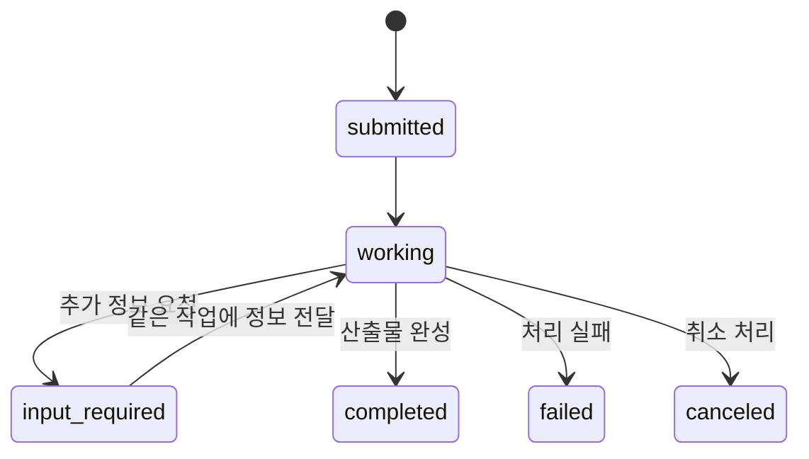
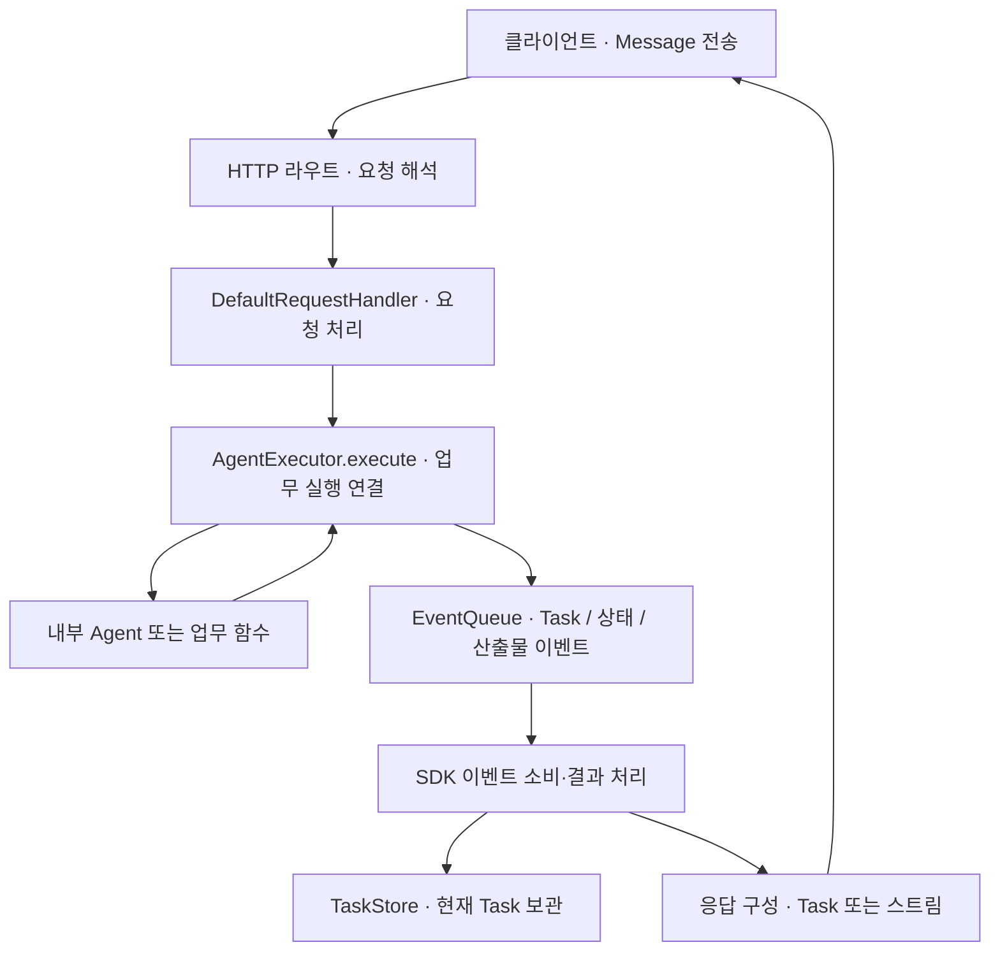

원본: books/workshop/a2a.md

---
layout: page
title: A2A로 다른 Agent에 작업 맡기기
sidebar: false
aside: false
pageClass: lec-page
---

<div class="lec workshop-edition"><div class="deck">
<section class="slide">
<div class="eyebrow">2026.09 · 예상 16:45–17:30 · 45분</div>

# A2A로 다른 Agent에 작업 맡기기

<p class="lead">다른 팀의 Agent가 어떤 일을 하는지 알아내고, 초안을 맡긴 뒤 작업 상태와 검토 산출물을 받습니다. Agent Card → Message → Executor → 이벤트 처리 → Task·Artifact까지 클라이언트와 서버의 책임을 연결합니다.</p>

지금까지 문의 Agent가 정책을 조회하고 답변을 만들었습니다. 이제 별도로 운영하는 검토 Agent에 “이 초안의 정책 근거를 확인해 달라”고 맡깁니다. 상대가 어떤 모델·도구·프레임워크를 쓰는지 알아야 할까요? <strong><mark class="key-point">내부 구현을 공유하지 않고도 역할·요청·진행 상태·결과를 주고받는 규약</mark></strong>이 A2A입니다.

이 장을 마치면 Card에서 가능한 일을 찾고, Message와 Task·Artifact를 구별하며, 노트북에서 실제 원격 검토 결과를 받아 사용할 수 있어야 합니다. 실습은 `notebooks/build-agent.ipynb`의 5번에서 진행합니다.


### 이 장의 목표와 완료 확인 {#learning-goals}

|할 수 있어야 하는 일|확인할 결과|
|---|---|
|Card·Message·Task·Artifact를 구분합니다.|기능 소개·요청·작업 상태·결과 문서가 다른 이유를 설명합니다.|
|Executor·이벤트 큐·저장소의 역할을 설명합니다.|요청부터 상태·산출물이 응답에 반영되는 경로를 설명합니다.|
|완료 상태와 업무 수용 여부를 따로 판단합니다.|5C에서 정상 결과는 accepted, 진행 중은 pending, 불일치 결과는 held로 분류합니다.|


</section>
<section class="slide" id="icebreaker">

## 시작 질문 · 검색 함수와 조사 담당자에게 맡기는 일

<p class="section-time">예상 3분 · 16:45–16:48</p>

“지난달 규정을 찾아줘”는 검색 도구 호출로 처리할 수 있습니다. “이 초안이 규정에 맞는지 검토하고, 정보가 부족하면 물어본 뒤 검토서를 줘”는 작업을 맡기는 요청입니다. 다른 팀이 그 검토 시스템을 운영한다면 어떤 정보를 주고받아야 할까요?

Elastic의 뉴스룸 예제에서는 기자가 조사 Agent에 자료 조사를 맡기고, 조사 Agent는 MCP 도구로 자료를 찾습니다. Agent 간 협업과 내부 도구 사용이 함께 등장하는 개발 예제입니다. 우리 수업에서는 문의 작성자와 검토자 두 역할로 줄여 살펴봅니다. [Elastic 기술 사례](https://www.elastic.co/search-labs/blog/a2a-protocol-mcp-llm-agent-workflow-elasticsearch)

### Elastic 사례에서 가져올 구조

|뉴스룸에서 맡기는 일|연결과 책임|수업의 대응|
|---|---|---|
|기자가 조사자·자료 보관 담당자에게 자료를 요청|A2A로 역할에 일을 맡김. 자료를 찾는 내부 방법은 담당자가 결정|문의 작성자가 별도 검토자에게 초안을 맡김|
|조사자가 검색·통계 도구를 사용|담당 Agent 내부에서 MCP 도구 호출|검토자 내부의 규칙 검사·모델 호출|
|근거가 약한 주장에 재조사를 요청|부족한 근거를 다음 요청에 전달|검토서의 실패 이유를 다음 수정에 사용|

이 사례에서 배울 것은 **한 Agent가 다른 Agent에 일을 맡기면서, 자기 내부에서는 도구를 사용할 수 있다는 점**입니다. 재조사 시점과 기사 통과 기준은 뉴스룸의 업무 정책입니다. A2A가 기사 품질이나 다음 담당자를 자동으로 결정하지 않습니다. 원문의 `message_type` 등 설명용 JSON은 수업의 A2A v1 메시지 형식으로 복사하지 않습니다. [Elastic의 역할·도구 연결 예제](https://www.elastic.co/search-labs/blog/a2a-protocol-mcp-llm-agent-workflow-elasticsearch)

</section>
<nav class="lesson-nav" aria-label="수업 흐름"><a href="#concept">01 개념</a><a href="#observe">02 실습</a><a href="#solution">03 풀이</a><a href="#wrap">04 Wrap</a></nav>
<section class="slide" id="concept">

### 앞에서 배운 Skill·MCP와 무엇이 다를까요? {#skill-mcp-a2a}

<figure class="trace-example">


<figcaption>AI로 제작한 역할 비교용 비유입니다. 오른쪽으로 갈수록 발전하는 단계가 아니며, 세 구성을 함께 사용할 수 있습니다.</figcaption>
</figure>

|그림에서 볼 것|사내 문의 예제에서 맡는 일|
|---|---|
|Skill의 절차서|정책을 조회한 뒤 담당 팀과 근거를 답하는 방법|
|MCP의 도구 연결|다른 앱에서도 같은 정책 조회 기능을 호출하는 규약|
|A2A의 별도 작업대|독립된 검토 시스템에 초안을 맡기고 작업 상태·검토서를 받는 규약|

<mark class="key-point">Skill은 작업 방법을 알려 주고, MCP와 A2A는 서로 다른 대상과의 연결 방식을 정합니다.</mark> 그림의 MCP 서버는 일반 조회 기능을 나타낸 것입니다. MCP가 AI 기능을 도구로 노출할 수도 있으므로, 모델의 유무만으로 두 프로토콜을 구분하지 않습니다. 이제 A2A가 받는 요청과 돌려주는 결과를 살펴봅니다.

## 개념 1 · Agent 내부와 Agent 사이의 연결


LangGraph는 한 Agent의 상태와 실행 흐름을 구성합니다. A2A는 그 Agent가 외부 요청을 받는 접점을 정의합니다. **LangGraph로 만든 Agent를 A2A 서버로 공개할 수 있습니다.** A2A가 모델의 추론이나 내부 그래프를 대신 만드는 것은 아닙니다.



클라이언트는 상대의 내부 메모리나 도구를 공유받는 대신, 공개된 기능과 메시지를 사용합니다. A2A 클라이언트는 다른 Agent뿐 아니라 일반 애플리케이션일 수도 있습니다. 웹 앱이나 다른 Agent가 클라이언트 역할을 맡을 수 있습니다. [A2A 핵심 개념](https://a2a-protocol.org/latest/topics/key-concepts/)

| 선택 | 적합한 상황 | 얻는 것과 비용 |
|---|---|---|
| 내부 함수·하위 Agent | 한 앱 안에서 역할을 나눔 | 연결이 간단함. 외부 팀과 공유할 별도 계약은 직접 설계 |
| 업무용 HTTP API | 정해진 입력과 결과를 주고받음 | 기존 API 기반 활용. 발견·작업 상태 규약을 팀끼리 합의 |
| A2A | 독립 Agent 시스템끼리 기능을 발견하고 작업을 위임 | 공통 Card·Message·Task 규약. 네트워크·인증·버전 운영 필요 |

### 왜 별도의 공통 규약이 필요한가?

검토 서비스를 세 팀이 각각 만들었다고 가정합니다. 한 팀은 작업 번호를, 다른 팀은 완료 문장만, 또 다른 팀은 별도 알림 주소를 돌려줍니다. 호출자는 기능 확인·추가 질문·진행 조회·결과 수신을 매번 다르게 구현해야 합니다. A2A는 이 **외부 작업 계약을 공통으로 맞추어 연결 코드를 재사용**하려는 프로토콜입니다.

|필요한 약속|A2A가 정하는 것|서비스가 직접 정하는 것|
|---|---|---|
|내부 구현을 몰라도 맡기기|공개된 메시지·산출물로 상호작용|모델·도구·메모리·내부 실행 흐름|
|가능한 일과 접속 방법 확인|Agent Card의 기능·주소·지원 기능|어떤 Agent를 선택할지, 접근을 허용할지|
|요청하고 추가 정보를 주고받기|Message·Part와 작업 연결 ID|업무 입력의 의미와 추가 질문 내용|
|맡긴 일을 계속 추적하기|Task의 상태·조회·취소·산출물 규약|실행·저장·재시도와 업무 통과 기준|

따라서 **블랙박스로 운영되는 Agent의 자기 설명·메시지·작업 생애주기를 공통 계약으로 연결한다**고 이해하면 됩니다. 비동기 처리를 지원하지만 모든 요청이 비동기 Task여야 하는 것은 아닙니다. Card를 찾는 것과 최적의 담당자를 고르는 것도 별개입니다. [A2A 핵심 개념](https://a2a-protocol.org/latest/topics/key-concepts/)

MCP에도 원격 호출과 장시간 작업이 있으므로 시간·거리·모델 유무만으로 구분할 수 없습니다. 공통 도구 인터페이스가 필요하면 MCP를, 상대의 작업·추가 대화·산출물을 A2A 계약으로 다룰 필요가 있으면 A2A를 검토합니다. **이미 양쪽이 같은 HTTP 업무 API로 충분히 연결되어 있다면 A2A로 바꿀 필요는 없습니다.** 여러 독립 구현과 같은 방식으로 연결할 때 표준화의 이점이 커집니다. [MCP와 A2A의 관계](https://a2a-protocol.org/latest/topics/a2a-and-mcp/)

Card를 찾는 전략은 알려진 주소의 well-known 경로 조회, 후보 주소 직접 설정, 레지스트리 검색 등으로 나뉩니다. A2A가 모든 레지스트리 검색 API를 하나로 정한 것은 아닙니다. 예를 들어 후보 서버 주소를 알고 있다면 각 주소에서 Card를 읽고 기능을 비교할 수 있습니다. [공식 발견 전략](https://a2a-protocol.org/latest/topics/agent-discovery/)

## 개념 2 · Card로 찾고, Message로 맡깁니다


Agent Card는 서버가 공개하는 JSON 소개 문서입니다. 보통 `/.well-known/agent-card.json`에서 가져옵니다. 모델에게 질문하기 전에 클라이언트가 읽습니다.

| Card 항목 | 검토 서버에서 읽을 값 | 의미 |
|---|---|---|
| name·description | 업무 초안 검토 | 맡길 역할 |
| skills | review-policy | 제공하는 업무 기능 |
| supportedInterfaces | 주소·JSONRPC·1.0 | 접속 주소와 프로토콜 바인딩·버전 |
| capabilities | streaming=false | 스트리밍 지원 여부 |
| defaultInputModes·defaultOutputModes | text/plain | 주고받는 콘텐츠 형식 |

<strong><mark class="key-point">Card의 AgentSkill은 SKILL.md와 다릅니다.</mark></strong> Card의 skill은 “무엇을 할 수 있는가”라는 기능 소개이고, SKILL.md는 Agent가 참고할 작업 절차입니다. Card의 기능 설명은 실행 권한이나 정확성의 보증서도 아닙니다.

찾은 Agent에 보내는 한 차례의 발화가 **Message**입니다. Message는 역할과 ID, 하나 이상의 **Part**를 담습니다. Part에는 텍스트·파일·구조화 데이터를 넣을 수 있습니다. 이 예제는 업무 JSON을 텍스트 Part 하나에 담습니다.

```python
# SDK 메시지 구성 예시. 아래 값만으로 요청의 모양을 읽습니다.
import json
import uuid
from a2a.types import Message, Part, Role

payload = {"topic": "계정", "draft": "초안", "request_id": "req-1", "version": 1}
message = Message(
    role=Role.ROLE_USER,
    message_id=str(uuid.uuid4()),
    parts=[Part(text=json.dumps(payload, ensure_ascii=False))],
)
```

여기의 user는 요청을 보내는 쪽의 역할입니다. 사람이 직접 타이핑했다는 뜻은 아닙니다. `payload`에는 업무명·초안·요청 ID·초안 버전이 있습니다. <mark class="key-point">이 네 필드는 우리 검토 업무의 약속이며 A2A의 필수 필드가 아닙니다.</mark>

## 개념 3 · 응답은 Message일 수도, Task일 수도 있습니다


**Message로 바로 답할지 Task를 만들지는 서버 구현이 결정합니다.** 프로토콜이 요청 문장을 읽고 자동 분류하는 것은 아닙니다. 서버는 고정 규칙이나 모델 판단을 사용할 수 있습니다. 상태 관리 없이 답을 돌려주면 Message, 작업 ID로 상태와 산출물을 관리하면 Task로 표현합니다. 짧은 작업도 Task가 될 수 있습니다. [공식 응답 선택 설명](https://a2a-protocol.org/latest/topics/life-of-a-task/#agent-response-message-or-task)

Task는 작업 ID·상태·산출물을 담습니다. 검토서처럼 작업이 만든 결과물이 **Artifact**이며 Part 목록으로 내용을 담습니다.

|순서|클라이언트|검토 A2A 서버|
|---|---|---|
|1 · 발견|Agent Card 조회 →|기능·접속 주소 반환|
|2 · 요청|초안을 담은 SendMessage →|Executor가 Task 생성|
|3 · 수행|응답을 기다림|working으로 갱신 → 규칙·모델 검토|
|4 · 반환|← Task와 ReviewResult Artifact 수신|산출물 저장·completed로 종료|
|5 · 수용|현재 요청·버전·passed를 확인|검토 수행과 결과 수용을 구분|

서버는 짧은 검토에도 Task를 생성하도록 설계할 수 있습니다. SDK가 초안 길이를 보고 선택하는 것은 아닙니다. 클라이언트의 `return_immediately=False`는 **Task가 종료되거나 추가 입력·인증이 필요한 상태가 될 때까지 기다리는 설정**이며 Message/Task 선택 설정이 아닙니다. Message 직접 응답에는 영향을 주지 않습니다. [명세의 응답 대기 설정](https://a2a-protocol.org/latest/specification/#322-sendmessageconfiguration)

중간 상태를 서버에서 생성했더라도 비스트리밍 대기 요청의 화면에 그 상태가 하나씩 나타나는 것은 아닙니다. 최종 Task를 받는 방식과 중간 갱신을 스트림으로 받는 방식을 구분합니다.

| 식별자 | 무엇을 구분하나요? |
|---|---|
| messageId | 개별 메시지 |
| Task의 id | 서버가 관리하는 작업 |
| contextId | 관련 메시지·작업의 묶음 |
| artifactId | 생성된 산출물 |
| 업무 request_id·version | 이번 초안 요청과 수정 버전 — 우리 코드가 정한 값 |

contextId가 같다고 모든 내부 대화와 메모리가 자동 공유되는 것은 아닙니다. 문맥을 어떻게 저장하고 사용하는지는 구현에 달려 있습니다. [Task의 생애주기](https://a2a-protocol.org/latest/topics/life-of-a-task/)

### 같은 대화에서 다시 수정해 달라고 하면?

“검토한 초안을 고쳐 다시 봐 주세요”는 끝난 Task를 다시 실행하는 요청이 아닙니다. 종료된 Task는 그대로 두고 새 Task로 후속 작업을 표현할 수 있습니다. 관련 작업을 묶는 `contextId`와 개별 작업의 `taskId`를 구별합니다.

|상황|contextId|Task ID|산출물|
|---|---|---|---|
|첫 초안 검토 완료|ctx-1|task-1|artifact-1|
|수정한 초안을 다시 검토|ctx-1|새 task-2|새 artifact-2|

위 ID는 관계를 설명하기 위한 예시입니다. 후속 Message에 이전 작업의 `referenceTaskIds`를 담을 수 있습니다. 업무에서 사용하는 문서 ID·수정 버전은 contextId나 Task ID와 별도로 정할 수 있습니다. [공식 후속 작업 설명](https://a2a-protocol.org/latest/topics/life-of-a-task/#task-refinements)

### 검토 작업이 끝났다는 것과 초안이 통과했다는 것

`completed`는 검토 작업이 끝났다는 뜻입니다. 검토서에 `passed=false`가 있다면 초안은 통과하지 못했습니다. “검토 완료: 수정 필요”도 정상적인 완료 결과입니다. 반대로 서버 자체가 검토를 수행하지 못했다면 failed 같은 상태로 표현합니다.

<CourseVisual kind="a2a" />

<details><summary>더 보기 · 추가 입력과 상태 추적 (+3분)</summary>

**Task 상태의 종류와 의미는 A2A 프로토콜이 정합니다.** 수업에서 새 상태를 만든 것이 아닙니다. 아래 도식은 가능한 경로 일부이며, 모든 상태를 차례로 거쳐야 한다는 뜻은 아닙니다.

|A2A v1의 TaskState|수업 출력의 state|의미|
|---|---|---|
|TASK_STATE_SUBMITTED|submitted|접수|
|TASK_STATE_WORKING|working|처리 중|
|TASK_STATE_INPUT_REQUIRED|input_required|추가 입력 필요|
|TASK_STATE_AUTH_REQUIRED|auth_required|인증 필요|
|TASK_STATE_COMPLETED|completed|정상 종료|
|TASK_STATE_FAILED|failed|오류 종료|
|TASK_STATE_CANCELED|canceled|취소 종료|
|TASK_STATE_REJECTED|rejected|수행 거절·종료|
|TASK_STATE_UNSPECIFIED|unspecified|상태 미지정|

표의 오른쪽은 enum을 읽기 쉽게 풀어 쓴 표현입니다. 애플리케이션이 결과를 채택·보류하는 업무 판정은 A2A TaskState와 별도로 설계합니다. [공식 TaskState 정의](https://a2a-protocol.org/latest/specification/#413-taskstate)



auth_required는 인증이 필요한 상태, rejected는 요청을 거절한 종료 상태입니다. 지원되는 갱신 수신 방식은 Card에서 확인합니다. 짧은 작업은 응답을 기다리고, 긴 작업은 GetTask 조회·SSE 스트림·설정된 webhook의 push 알림을 사용할 수 있습니다. 스트리밍은 연결 유지가, webhook은 수신 endpoint 운영이 필요합니다.

종료된 Task를 다시 working으로 되살리지 않습니다. 후속 수정은 같은 contextId 아래 새 작업으로 만들 수 있습니다. 지원할 응답 방식은 서버 구현과 Card의 선언을 일치시켜야 합니다. [공식 생애주기](https://a2a-protocol.org/latest/topics/life-of-a-task/)

</details>

## 개념 4 · 서버는 요청을 어떻게 작업과 응답으로 바꿀까요?

<p class="section-time">개념 1~4 총 20분 · 서버의 실행과 이벤트 처리까지 설명</p>

클라이언트가 Message를 보내도 업무가 저절로 실행되지는 않습니다. **서버 개발자가 AgentExecutor에 업무 실행을 연결하고, 실행 중 생긴 상태·산출물을 이벤트로 전달**해야 합니다. 아래는 A2A Python SDK 1.1.2의 구성입니다. Executor·EventQueue·TaskUpdater는 SDK 구현의 부품이며, 프로토콜이 모든 언어에 같은 클래스 이름을 요구하는 것은 아닙니다.



이 그림은 한 요청의 역할을 구분한 것입니다. SDK 내부의 이벤트 소비·결과 집계는 요청 처리 경로와 함께 동작합니다. 큐에 이벤트를 넣었다고 즉시 모든 클라이언트에게 보이거나 디스크에 영구 저장되는 것은 아닙니다.

|부품 · import 위치|맡는 책임|맡지 않는 책임|
|---|---|---|
|AgentExecutor · a2a.server.agent_execution|execute와 cancel에 업무 실행·취소 연결|모델이나 업무 규칙 자동 생성|
|RequestContext · a2a.server.agent_execution|요청 Message, Task·context ID, 현재 작업 등의 실행 문맥 전달|모든 이전 대화·모델 메모리 자동 공유|
|EventQueue · a2a.server.events|Executor가 만든 응답 이벤트 전달|분산 작업 배정이나 영속 작업 큐 보장|
|TaskUpdater · a2a.server.tasks.task_updater|상태·산출물 갱신 이벤트를 만들어 큐에 넣기|TaskStore에 직접 쓰거나 내부 Agent 실행|
|DefaultRequestHandler · a2a.server.request_handlers|요청과 Executor 연결, 이벤트 결과 처리 조정|업무상 통과 기준 결정|
|InMemoryTaskStore · a2a.server.tasks|프로세스 메모리에 Task 보관|서버 재시작 후 복구|

### execute의 반환값보다 이벤트를 봅니다

`execute(context, event_queue)`는 요청을 읽고 내부 Agent를 실행하는 접점입니다. 결과는 보통 `return "검토 완료"`가 아니라 **`await event_queue.enqueue_event(...)`로 전달**합니다. enqueue는 큐에 넣는다는 뜻입니다. 이 응답 경로에서는 다음 객체를 구별합니다.

|큐에 넣는 객체|알리는 내용|
|---|---|
|Message|상태 추적 없이 직접 답하는 메시지|
|Task|추적할 작업과 현재 상태·ID|
|TaskStatusUpdateEvent|기존 작업의 상태 변화|
|TaskArtifactUpdateEvent|기존 작업의 산출물 추가·갱신|

새 Task를 다루는 아래 예제에서는 **Task를 먼저 큐에 넣고 같은 ID로 후속 갱신을 보냅니다.** 기존 Task를 이어 처리하는 구현이라면 요청 문맥의 현재 Task를 확인해야 합니다. 매번 새 작업으로 덮어쓰는 방식은 추가 입력 대화에 적합하지 않습니다.

### SDK 코드로 읽는 최소 서버 실행부

다음 클래스는 새 요청을 받아 글자 수를 세는 설명용 Executor입니다. 업무 함수 자리에 모델 호출이나 컴파일된 LangGraph를 넣을 수 있습니다. A2A 연결 원리를 보기 위해 이 예제의 업무에는 모델이 필요하지 않습니다. 아래 블록은 **SDK 서버 구성 예제**이며, 바로 뒤 화면 실행 창에서는 이벤트 흐름을 Python만으로 확인합니다.

```python
from a2a.server.agent_execution import AgentExecutor, RequestContext
from a2a.server.events import EventQueue
from a2a.server.tasks.task_updater import TaskUpdater
from a2a.types import Part, Task, TaskState, TaskStatus


class TextReviewExecutor(AgentExecutor):
    async def execute(self, context: RequestContext, event_queue: EventQueue):
        # 이 예제는 새 작업 요청을 처리합니다.
        await event_queue.enqueue_event(Task(
            id=context.task_id,
            context_id=context.context_id,
            status=TaskStatus(state=TaskState.TASK_STATE_SUBMITTED),
        ))
        updater = TaskUpdater(
            event_queue=event_queue,
            task_id=context.task_id,
            context_id=context.context_id,
        )
        await updater.start_work()
        text = context.get_user_input()
        result = f"검토한 글자 수: {len(text)}"  # 내부 업무 실행 자리
        await updater.add_artifact(parts=[Part(text=result)], name="ReviewResult")
        await updater.complete()

    async def cancel(self, context: RequestContext, event_queue: EventQueue):
        updater = TaskUpdater(
            event_queue=event_queue,
            task_id=context.task_id,
            context_id=context.context_id,
        )
        await updater.cancel()
```

|호출|생기는 이벤트|읽는 의미|
|---|---|---|
|enqueue_event(Task(...))|Task|추적할 작업을 알림|
|start_work()|TaskStatusUpdateEvent|작업이 working 상태임을 알림|
|add_artifact(...)|TaskArtifactUpdateEvent|업무 결과를 산출물로 전달|
|complete()|TaskStatusUpdateEvent|작업이 completed 상태임을 알림|

`start_work()`가 내부 Agent를 시작하는 것은 아닙니다. **업무 호출은 Executor가 직접 하고, TaskUpdater는 그 상태와 결과를 알립니다.** `complete()`도 검토 내용의 통과 여부를 판단하지 않습니다. 실행 중 실패를 어떻게 처리하고 failed로 알릴지는 서버 구현에서 정해야 합니다.

`cancel()` 역시 실제 작업의 중단과 상태 통지를 연결하는 자리입니다. 위처럼 짧은 계산 예제에서 취소 상태를 알리는 코드만으로, 별도 프로세스의 긴 모델 호출이나 외부 작업이 자동으로 취소되지는 않습니다. 그런 구현에는 실행 핸들·취소 전파·이미 수행한 부작용 처리 방침이 필요합니다.

### 화면에서 이벤트와 최종 Task를 연결합니다

아래는 **SDK나 네트워크를 실행하지 않는 축소 모형**입니다. 왼쪽 역할인 이벤트 생산과 오른쪽 역할인 Task 반영을 나눠 읽습니다. 작업 ID 검사를 먼저 하고, 이후 이벤트로 같은 Task를 갱신합니다. `passed=False`를 True로 바꿔도 completed라는 상태 자체는 같다는 점을 확인합니다. 첫 Task 이벤트를 제거하면 갱신 대상이 없다는 오류가 납니다.

<PythonPlayground kind="a2a-events" />

출력은 `submitted → working → 산출물 → completed`입니다. 마지막 상태와 산출물은 서로 다른 정보를 담습니다. 상태 갱신을 소비하지 않으면 클라이언트가 보는 Task는 오래된 상태에 머물 수 있고, 완료 이벤트만 보내면 결과 문서가 자동으로 만들어지지 않습니다. 실제 SDK의 오류 형식·저장 방식은 이 모형과 다릅니다.

### Executor를 서버에 연결하는 마지막 단계

클래스 정의만으로 HTTP 요청을 받을 수는 없습니다. Agent Card는 공개 설명이고, 요청 처리기는 실행부와 저장소를 연결하며, 라우트는 접속 경로를 만듭니다. 아래는 앞의 `TextReviewExecutor`와 별도로 정의한 `card`를 연결하는 구성 발췌입니다.

```python
from a2a.server.request_handlers import DefaultRequestHandler
from a2a.server.tasks import InMemoryTaskStore
from a2a.server.routes import create_agent_card_routes, create_jsonrpc_routes
from starlette.applications import Starlette

handler = DefaultRequestHandler(
    agent_executor=TextReviewExecutor(),
    task_store=InMemoryTaskStore(),
    agent_card=card,
)
app = Starlette(routes=(
    create_agent_card_routes(agent_card=card)
    + create_jsonrpc_routes(request_handler=handler, rpc_url="/")
))
```

ASGI 서버가 app을 실행하면 Card 조회와 작업 요청 경로가 열립니다. Card만 게시하고 요청 처리 경로를 연결하지 않으면 기능 소개는 읽히지만 작업은 실행되지 않습니다. 반대로 내부 Agent가 정상 동작해도 산출물 이벤트를 보내지 않으면 A2A 결과 계약은 완성되지 않습니다.

**이해 확인:** 모델이 검토서를 만들었는데 클라이언트의 Task에는 산출물이 없습니다. 내부 모델을 바꾸기 전에 어디를 확인해야 할까요?

<details><summary>설명 비교</summary>

Executor가 모델 결과를 받은 뒤 add_artifact를 호출했는지, 갱신의 Task ID가 맞는지, 이벤트가 SDK 처리부에서 소비·반영되었는지 확인합니다. 모델 결과 생성과 프로토콜 결과 전달은 별도 단계입니다.

</details>

[공식 Executor 튜토리얼](https://a2a-protocol.org/latest/tutorials/python/4-agent-executor/) · [Python SDK API](https://a2a-protocol.org/latest/sdk/python/api/)에서 인터페이스를 확인할 수 있습니다. 위 코드는 수업 고정 SDK 1.1.2의 import와 메서드를 사용합니다.

### ACP 통합 이후: REST 형태로도 A2A를 사용합니다 {#acp-rest}

Card의 접속 방식이 달라도 Message·Task·Artifact의 의미는 유지됩니다. 프로토콜의 업무 계약과 HTTP에 담는 형식을 구분합니다.

Agent Communication Protocol(ACP)은 REST 중심의 Agent 통신 규약이었으며, 공식 사이트는 현재 Linux Foundation의 A2A에 통합되었다고 안내합니다. 에디터와 코딩 Agent를 연결하는 **Agent Client Protocol**과는 다른 ACP입니다. [ACP 공식 통합 안내](https://agentcommunicationprotocol.dev/introduction/welcome)

현재 A2A는 JSON-RPC·gRPC·HTTP+JSON/REST 바인딩을 정의합니다. **REST로 연결한다고 A2A가 아닌 것은 아닙니다.** 기존 ACP의 URL·필드가 변경 없이 호환된다는 뜻도 아닙니다. 연결할 서버가 Card에 공개한 바인딩과 현재 A2A의 요청·응답 형식을 따릅니다.

|같은 작업|JSON-RPC 바인딩|HTTP+JSON/REST 바인딩|
|---|---|---|
|작업 요청|POST 본문의 method=SendMessage|POST /message:send|
|작업 조회|method=GetTask|GET /tasks/{id}|
|취소 요청|method=CancelTask|POST /tasks/{id}:cancel|
|돌려받을 의미|Task의 상태·Artifact|같은 Task 상태·Artifact|

[공식 바인딩별 메서드 대응표](https://a2a-protocol.org/latest/specification/#53-method-mapping-reference)

아래는 REST 바인딩의 요청 구조 예시입니다. `message`·`configuration`을 본문에 직접 담고 JSON-RPC의 `jsonrpc`·`method`·`params` 포장을 사용하지 않습니다. 주소와 ID는 설명용입니다.

<details><summary>REST 요청 형식과 서버 구성</summary>

```http
POST /message:send HTTP/1.1
Host: agent.example.com
Content-Type: application/a2a+json

{
  "message": {
    "messageId": "msg-1",
    "role": "ROLE_USER",
    "parts": [{"text": "이 문장의 불명확한 표현을 검토해 주세요."}]
  },
  "configuration": {"returnImmediately": false}
}
```

SDK 1.1.2의 `from a2a.server.routes import create_rest_routes`로 같은 요청 처리기를 REST 경로에 연결할 수 있습니다. `create_app(..., binding="HTTP+JSON")`은 이 경로와 Card의 바인딩을 함께 설정합니다. 두 서버가 서로 다른 바인딩을 제공할 수도 있습니다. 클라이언트는 Card를 읽어 해당 바인딩을 지원하는 연결을 생성합니다. 단순히 Card 문자열만 REST로 바꿔서는 서버 경로가 생기지 않습니다. [HTTP+JSON/REST 명세](https://a2a-protocol.org/latest/specification/#11-httpjsonrest-protocol-binding)

</details>

</section>
<section class="slide" id="observe">

## 실습 · 요청·연결·수용 조건을 구현합니다

**직접 구현:** 5A 정의 셀의 `make_review_request(payload)`에서 Message의 역할·ID·JSON 텍스트 Part와 SendMessageRequest를 만듭니다. `connect_review_client(http, url, expected_skill)`에서는 Card 조회 → 기능 ID 확인 → ClientConfig·ClientFactory로 연결을 작성합니다. 5B는 이 두 함수를 실제 서버 연결·전송에 사용합니다. 5C의 `accept_review`도 직접 작성합니다. 서버 실행과 응답 파싱은 제공됩니다.

**구현 순서:** 요청·연결 함수 작성 6분 → 5A·5B 실행 3분 → 5C 수용 조건과 반례는 이어지는 개인 실습에서 구현합니다. 막히면 풀이 노트북의 같은 5A·5B·5C 번호와 각 결과 해석을 확인합니다. 요청의 message_id, Task의 id, 업무 payload의 request_id·version을 구별해야 합니다.

<p class="section-time">예상 9분 · 17:08–17:17 · 요청·연결 구현과 실행</p>

<!-- lesson-exercise:a2a -->

서버의 ReviewExecutor와 응답 파싱은 제공됩니다. 요청 생성·Card 기반 클라이언트 연결·업무 수용 함수는 직접 작성합니다. 제공 서버는 규칙 검사와 모델의 표현 검토를 실행하고 TaskUpdater로 결과를 전달합니다. 구현 위치는 `course/a2a_lab.py`입니다.

요청·연결 함수를 완성한 뒤 5B의 draft를 바꿔 아래 두 경우를 실행합니다. 5C는 다음 개인 구현 시간에 작성합니다.

| draft | 기대 상태 | 검토서와 수용 결과 |
|---|---|---|
| 계정 문의는 IT지원팀에 전달합니다. 근거: P-02 | completed | passed=true, accepted |
| 확인했습니다. | completed | passed=false, feedback에 누락 정보, held |

두 실행의 Task ID·messageId·업무 request_id를 찾아 어떤 것이 바뀌었는지 비교합니다. 실제 모델의 표현 검토는 model_note에서 읽습니다. API 오류가 났다면 연결을 복구하고 5B를 다시 실행합니다. 두 결과를 기록한 뒤 마지막에는 정상 초안으로 5B를 실행해, 다음 5C에서 사용할 `review`와 `payload`를 정상 결과로 준비합니다.

**반례:** 검토는 통과했지만 현재 기대 버전을 2로 바꾸면 어떨까요? Task를 다시 요청하는 실험이 아니라, 받은 결과를 현재 초안에 적용해도 되는지 판단하는 실험입니다. 5C에서 held가 나와야 합니다.


</section>
<section class="slide" id="practice">

## 개인 구현 · 현재 초안에 쓸 수 있는 검토 결과를 판단합니다

<p class="section-time">예상 6분 · 17:17–17:23 · 5C 구현·반례 검사</p>

5A·5B에서 받은 실제 결과를 바탕으로 `accept_review`를 작성합니다. **판단 순서 예상 1분 → 구현 3분 → 검사와 버전 반례 2분**으로 진행합니다.

submitted·working은 pending, 그 외 미완료 상태는 held입니다. completed일 때만 산출물의 요청 ID·버전·passed를 비교합니다. 반환값의 계약은 아래 풀이의 입력 표와 노트북 5C 표를 따릅니다.

먼저 정상 결과를 채택하고, 같은 결과의 현재 기대 버전만 2로 바꿔 held인지 확인합니다. 이어 `check_accept_review`로 누락 필드와 타입 반례를 확인합니다. `True`를 버전 1로 받지 않으려면 값의 비교뿐 아니라 타입도 확인해야 합니다. 마지막으로 자신이 고른 반례 하나를 추가합니다.

</section>
<section class="slide" id="operations">

<details><summary>참고 · 독립 운영과 신뢰, 그리고 두 ACP</summary>

프로세스를 나눈 것만으로 검증의 독립성이나 정확성이 확보되지는 않습니다. 같은 잘못된 규칙을 공유하면 같은 오류를 낼 수 있습니다. 별도 기준·데이터·권한·책임을 누가 관리하는지 확인해야 합니다.

현재 서버의 InMemoryTaskStore는 프로세스 메모리입니다. A2A를 사용한다고 재시작 복구나 영속 저장이 자동 제공되지는 않습니다. 공개 서비스는 Card의 인증 선언뿐 아니라 서버의 권한 검사·저장소·타임아웃·취소 처리가 필요합니다.

| 이름 | 다루는 연결 |
|---|---|
| A2A | 독립 Agent 시스템 사이의 작업·메시지 |
| Agent Communication Protocol | Agent 상호 운용 규약. 공식 사이트는 A2A 합류를 안내 |
| Agent Client Protocol | 편집기·IDE와 코딩 Agent의 연결 |

두 ACP는 약자가 같지만 다릅니다. Agent Communication Protocol의 A2A 통합과 현재 REST 바인딩은 [앞의 비교](#acp-rest)에서 다룹니다. [Communication ACP](https://agentcommunicationprotocol.dev/introduction/welcome) · [Client ACP](https://agentclientprotocol.com/get-started/introduction)

</details>
</section>
<section class="slide" id="solution">

## 풀이 · 통신 결과를 업무 판단에 연결합니다

### 실습 응답에서 무엇을 읽는가?

5B의 `review = await delegate(url, payload)`가 반환하는 사전은 **수업 도우미 함수의 반환값**입니다. 아래 바깥쪽 키를 A2A의 원본 응답 필드로 혼동하지 않습니다.

|수업 반환값에서 읽는 위치|들어 있는 값|확인할 질문|
|---|---|---|
|review["message"]|SDK가 직렬화한 보낸 Message|parts의 text에 내가 보낸 초안이 있는가?|
|review["task"]|SDK가 직렬화한 받은 Task|id와 status.state는 무엇인가?|
|review["state"]|enum 이름을 소문자로 바꾼 값|completed인가, 아직 처리 중인가?|
|review["artifact"]|ReviewResult의 text JSON을 해석한 사전|request_id·version·passed·feedback이 무엇인가?|

정상 초안에서는 `TASK_STATE_COMPLETED`, `passed=True`, 빈 `feedback`을 기대합니다. `draft`만 `"확인했습니다."`로 바꾸면 검토 작업은 여전히 completed이지만 `passed=False`이고 누락 정보가 feedback에 나옵니다. **완료 상태는 같고 검토 결과는 달라지는 두 실행**을 비교합니다. `model_note` 문장은 실행마다 달라질 수 있습니다.

### 5C 구현 계약: 결과를 현재 초안에 적용할 조건

5C의 함수는 다음 네 입력을 받습니다. 실제 호출에서 어떤 값을 넘기는지 먼저 연결합니다.

```python
# accept_review를 구현한 뒤 검사 셀이 호출하는 방식
accept_review(
    review["state"],       # 받은 작업 상태
    review["artifact"],    # 받은 검토서
    payload["request_id"], # 현재 기대하는 요청 ID
    payload["version"],    # 현재 기대하는 초안 버전
)
```

먼저 상태로 분기합니다. submitted·working이면 pending, completed가 아닌 나머지는 held입니다. 완료된 경우에만 검토서를 읽습니다. 검토서가 있고, 유효한 요청 ID와 양의 정수 버전이 현재 기대값과 일치하며, passed가 불리언 True일 때 accepted입니다. 형식 확인이 필요한 이유는 잘못된 응답을 읽다가 예외가 나거나 `True`를 버전 1로 받아들이는 일을 막기 위해서입니다.

**구현 전에 예측합니다.** completed·passed=True인 결과를 받았지만, 그 사이 현재 초안이 v2로 바뀌었다면 채택해도 될까요? 서버를 다시 실행하지 않고 기대 버전만 2로 바꾸면 무엇이 달라질까요?

<details><summary>판단 근거 확인</summary>

받은 검토서는 v1에 대한 것이므로 held입니다. 원격 검토의 성공과 현재 초안에 대한 유효성은 다릅니다. 5C는 이 판단을 코드로 옮깁니다. `passed`만 확인하거나 completed만 확인하면 이 반례를 놓칩니다. 실제 결과를 먼저 읽고 구현한 뒤, 제공 검사와 자신의 추가 반례로 비교합니다.

</details>

|막힌 위치|먼저 볼 것|
|---|---|
|5A에서 Card 조회 실패|첫 환경 셀, 서버 시작 오류, 제공 셀의 실행 완료 여부|
|5A는 되는데 5B에서 실패|오류 메시지와 모델 설정·API 연결. Card 조회는 모델을 호출하지 않음|
|Task는 completed인데 held|feedback, 요청 ID, 현재 기대 버전, passed의 실제 타입|
|산출물 접근 중 오류|완료 상태와 사전 존재 여부를 확인하기 전에 필드를 읽었는지|


<p class="section-time">예상 4분 · 17:23–17:27</p>

`notebooks/build-agent-solution.ipynb`의 5C와 비교합니다. 상태가 submitted·working이면 pending입니다. <mark class="key-point">completed일 때만 산출물을 읽고 현재 요청·버전·통과 여부를 확인합니다.</mark>

| 놓친 조건 | 잘못 받아들이는 결과 |
|---|---|
| completed만 확인 | 검토서가 수정 필요라고 한 초안 |
| passed만 확인 | 이전 초안에 대한 통과 결과 |
| 요청·버전 값만 단순 비교 | 불리언 True를 버전 1처럼 취급 |
| 어떤 상태든 accepted 반환 | 실패·진행 중·산출물 누락까지 완료 처리 |

이 조건은 A2A 규약 자체가 아니라 우리의 업무 수용 정책입니다. 다른 업무라면 필요한 산출물과 수용 기준도 달라집니다. 5C 검사에서는 처리 중·옛 버전·검토 실패·산출물 누락·문자열 통과값·불리언 버전 등 13개 사례의 기대값과 자신의 반환값을 비교합니다. 5B 실제 결과에도 자신의 함수를 적용합니다.

다음 통합 장에서는 MCP로 조회하고 LangGraph로 초안을 만든 뒤 여기의 원격 검토를 연결합니다. 각 기술이 어떤 구간을 담당했는지 메시지와 작업 ID로 다시 짚습니다.

</section>
<section class="slide" id="wrap">

## Wrap · 맡긴 일의 전체 흐름을 설명합니다

<p class="section-time">예상 3분 · 17:27–17:30</p>

**세 문장으로 설명해 봅니다.** Card에서 무엇을 알았나요? Message로 무엇을 보냈나요? 받은 Task와 Artifact는 각각 무엇을 알려줬나요?

<details><summary>설명 비교</summary>

Card에서 검토 기능과 접속 방식을 찾았습니다. Message의 Part에 초안을 담아 맡겼습니다. Task는 검토 작업의 상태를, Artifact는 검토 판정과 피드백을 전달했습니다. 그 결과를 현재 초안에 사용할지는 별도 수용 조건으로 판단했습니다.

</details>

### 더 읽기 · 원리와 구현을 구분해서 봅니다

| 자료 | 읽을 부분 |
|---|---|
| [A2A 핵심 개념](https://a2a-protocol.org/latest/topics/key-concepts/) | Card·Message·Part·Task·Artifact의 관계 |
| [Task 생애주기](https://a2a-protocol.org/latest/topics/life-of-a-task/) | Message 응답과 Task 응답, 추가 입력, 후속 작업 |
| [A2A 명세](https://a2a-protocol.org/latest/specification/) | 바인딩·필드·상태의 정확한 정의 |
| [공식 Python 튜토리얼](https://a2a-protocol.org/latest/tutorials/python/1-introduction/) | Card → Executor → 서버 → 클라이언트 구성 순서 |
| [LangGraph 구현 예제](https://github.com/a2aproject/a2a-samples/tree/main/samples/python/agents/langgraph) | 내부 Agent와 A2A Executor 연결. 예제 SDK 버전을 먼저 확인 |


**목표 확인:** [이 장 첫머리의 완료 기준](#learning-goals)을 자신의 출력이나 설명과 대조합니다. 확인하지 못한 항목은 해당 셀 또는 개념 예제로 돌아갑니다. 풀이를 읽은 것과 직접 실행해 확인한 것을 구분합니다.

</section>
<nav class="chapnav"><a href="../toc">전체 목차</a></nav>
</div></div>
