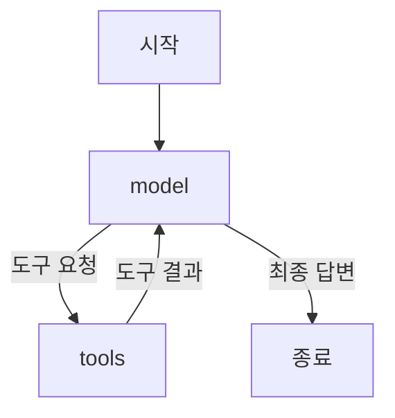
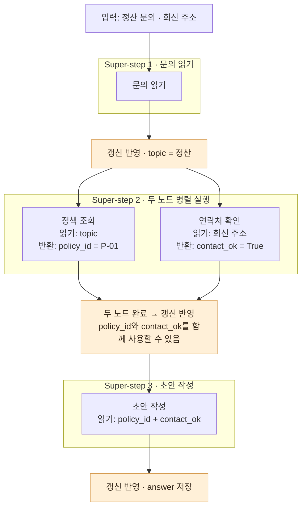
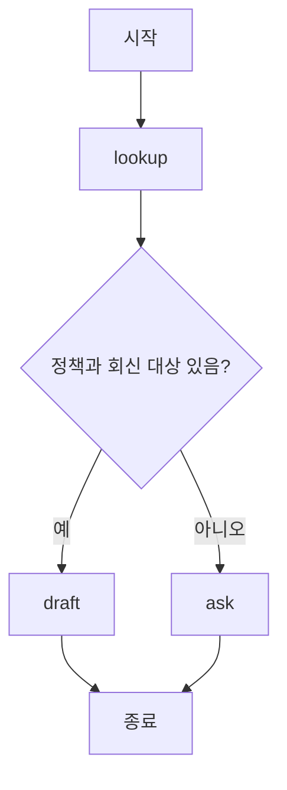
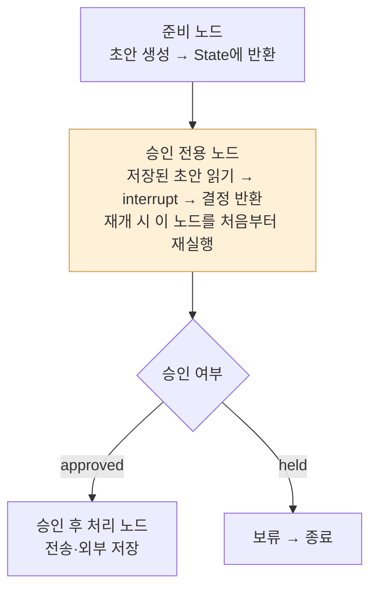

원본: books/workshop/graph.md

---
layout: page
title: LangGraph로 상태와 분기 정의하기
sidebar: false
aside: false
pageClass: lec-page
---

<div class="lec workshop-edition"><div class="deck">
<section class="slide">
<div class="eyebrow">2026.09 · 예상 12:50–14:00 · 70분</div>

# LangGraph로 상태와 분기 정의하기

<p class="lead">앞 장의 create_agent도 LangGraph 위에서 실행됩니다. 이번에는 그 실행 구조를 펼쳐 보고, Agent 앞뒤에 업무 조건과 중단·재개를 연결합니다.</p>

앞에서는 모델이 규정을 조회해 답하게 했습니다. 이번에는 “회신 대상이 없거나 정책을 못 찾으면 초안을 만들지 않는다”는 업무 조건이 추가됩니다. 모델에게 주의를 요청하는 대신, 초안 작성 노드에 들어가기 전에 조건을 검사합니다. 앞서 만든 도구와 Agent는 그대로 사용합니다.

<div class="cue"><div class="cue-body">짧은 예제는 교재의 Python 실행 창에서, 실습은 <code>workshop/notebooks</code>의 Jupyter 노트북에서 진행합니다. 처음이라면 <a href="./start">시작 안내</a>를 먼저 확인합니다. 앞 단계가 미완료라면 <a href="./build#recovery">앞 단계 보완 안내</a>에서 필요한 함수만 확인합니다.</div></div>

### 이 장의 목표와 완료 확인 {#learning-goals}

|할 수 있어야 하는 일|확인할 결과|
|---|---|
|State 갱신과 reducer·super-step의 역할을 설명합니다.|concepts.ipynb에서 교체·리스트 병합·메시지 병합을 비교합니다.|
|정보가 부족하면 초안 생성 전에 분기하고 필요한 정보만 묻습니다.|build-agent.ipynb 2·2A에서 방문 경로·추가 질문·초안 생성 호출 기록을 확인합니다.|
|중단과 재개의 조건을 설명합니다.|concepts.ipynb에서 interrupt 후 같은 thread_id로 재개합니다.|


</section>

<section class="slide" id="icebreaker">

## 시작 질문 · 승인이 내일 온다면 처음부터 다시 할까요?

<p class="section-time">예상 3분 · 12:50–12:53</p>

Agent가 규정을 찾고 답장 초안까지 만들었습니다. 전송 승인을 받을 담당자는 퇴근했고, 승인은 내일 받을 수 있습니다.

**내일 승인받았을 때 어디까지 했는지 어떻게 알고 이어갈까요?**

LangChain은 장시간 실행되는 Agent의 운영 기반으로 중단·재개와 상태 저장을 설명합니다. 승인 대기도 이런 기능이 필요한 사례입니다. [2026-04-20 · 개발사 기술 해설](https://www.langchain.com/blog/runtime-behind-production-deep-agents)

먼저 처리 단계를 그래프로 연결하고, 이후 승인을 기다렸다가 이어가는 예제를 살펴봅니다.

</section>

<nav class="lesson-nav" aria-label="수업 흐름"><a href="#concept">01 개념</a><a href="#observe">02 실습</a><a href="#solution">03 풀이</a><a href="#wrap">04 Wrap</a></nav>

<section class="slide" id="concept">

## 앞에서 만든 Agent도 그래프였습니다

<p class="section-time">예상 3분 · State 설명의 도입에 포함</p>

앞 장에서는 `create_agent(...)`로 실행 구조를 만들고 `agent.invoke(...)`로 질문을 보냈습니다. 그때 만들어진 `agent`는 실행 가능한 LangGraph 객체인 `CompiledStateGraph`입니다. Python에서는 `create_agent`, JavaScript에서는 `createAgent`라는 이름을 사용합니다.

주 실습 노트북의 1B에서 Agent를 만든 뒤 새 셀에 다음 두 줄을 넣으면 이미 만든 객체의 구조를 확인할 수 있습니다. 이 두 줄 자체는 모델을 호출하지 않습니다.

```python
print(type(local_agent).__name__)
print(list(local_agent.get_graph().nodes))
```

기본 도구 Agent에서 확인한 결과입니다. 미들웨어나 구성에 따라 노드는 추가될 수 있습니다.

```text
CompiledStateGraph
['__start__', 'model', 'tools', '__end__']
```



앞 장에서 본 메시지 누적은 이 실행 경로에서 일어납니다. `model`이 만든 도구 요청을 `tools`가 처리하고, 그 결과를 받은 `model`이 다시 답합니다. `create_agent`가 이 기본 구조를 조립해 주었으므로 직접 노드와 간선을 작성하지 않았던 것입니다. [LangChain Agent 문서](https://docs.langchain.com/oss/python/langchain/agents)

### 그렇다면 왜 StateGraph를 직접 다룰까요? {#why-stategraph}

사용자가 “회신 대상은 아직 모르지만 정산 답장부터 써 주세요”라고 요청했다고 가정합니다. 업무 규칙은 **회신 대상과 정책이 모두 확인된 뒤에만 초안을 작성한다**입니다. Agent의 지침에 이 규칙을 적으면 충분할까요?

지침을 읽은 모델이 필요한 정보를 다시 물을 수 있습니다. 그러나 지침만으로는 초안 생성 경로가 차단되지 않습니다. 규칙을 놓치거나, 불필요한 도구를 반복 호출하거나, 조회 없이 답하는 경우를 실행 기록에서 확인해야 합니다. <mark class="key-point">“이 조건을 지켜서 판단하라”는 지침과 “조건이 맞지 않으면 실행할 수 없다”는 코드의 분기는 다릅니다.</mark>

|결정할 일|모델에 맡기기 적합한 부분|코드로 고정할 부분|
|---|---|---|
|어떤 도구가 필요한가?|표현이 다양한 문의를 해석하고 적합한 도구·인자 선택|반드시 필요한 정책 조회, 호출 권한·횟수 제한|
|지금 초안을 만들어도 되는가?|불명확한 요청의 의미 해석|정책 조회 성공 여부와 회신 대상의 빈 값 검사|
|다음에 무엇을 할 것인가?|확인된 자료를 설명하고 문장 작성|정보 부족 시 질문으로 종료, 충족 시 작성·검토로 진행|

이번에는 기존 Agent 바깥에 **조회 → 조건 확인 → 질문 또는 초안 생성** 경로를 둡니다. 조회 결과와 회신 대상을 코드로 검사하고, 통과한 경우에만 앞 장의 Agent를 호출합니다. 그래프 안에서도 문장 작성과 도구 선택은 모델에 맡길 수 있습니다. 정해진 업무 순서와 동적인 Agent 실행을 함께 구성하는 방식입니다. [공식 Workflow·Agent 구분](https://docs.langchain.com/oss/python/langgraph/workflows-agents)

### 호출 횟수와 토큰 사용량은 어떻게 달라질까요?

모델에게 다음 행동을 판단하게 하려면 그 판단을 위한 모델 호출이 필요합니다. 도구 호출 뒤에는 결과를 포함한 메시지를 다시 보내 다음 응답을 받습니다. 이때 보내는 지침·도구 정의·대화 기록과 생성한 응답이 토큰 사용량에 영향을 줍니다. 조건이 명확한 검사를 Python에서 처리하면 그 검사 자체에는 모델 토큰이 들지 않습니다. [모델의 도구 호출과 사용량](https://docs.langchain.com/oss/python/langchain/models)

아래는 성능 측정값이 아니라 **회신 대상이 없는 입력의 실행 구조 비교**입니다.

|구성|추가 질문을 만들기까지의 경로|이 경로의 모델 호출|
|---|---|---|
|지침만 추가한 기본 Agent|모델이 입력을 읽고 질문할지·도구를 쓸지 선택|최소 1회. 도구 호출과 반복에 따라 추가됨|
|이번 실습의 바깥 그래프|Python 정책 조회 → 조건 검사 → 정해진 추가 질문 반환|0회. 초안 Agent에 진입하지 않음|

<mark class="key-point">StateGraph를 사용한다고 자동으로 토큰이 줄어드는 것은 아닙니다. 모델을 호출하는 경로와 전달하는 문맥을 어떻게 설계했는지가 중요합니다.</mark> 정상 입력에서는 기존 Agent가 내부에서 정책을 다시 조회할 수 있어 중복 작업이 남습니다. 노드마다 모델을 추가하면 호출과 지연이 늘 수도 있습니다. 이 실습은 비용 절감률을 입증하는 예제가 아니라, **정보가 부족한 입력에서 초안 생성을 건너뛰는지** 확인하는 예제입니다.

### if문이나 미들웨어로도 할 수 있지 않을까요?

조건 하나라면 Agent 호출 앞의 `if`문으로 충분합니다. 한 Agent의 도구 권한·호출 상한·승인 처리가 목적이라면 미들웨어로 구현할 수도 있습니다. [LangChain 미들웨어](https://docs.langchain.com/oss/python/langchain/middleware/built-in)

이번에는 조회·질문·작성·검토가 각기 다른 상태를 읽고 갱신하고, 뒤에서 승인 대기와 재개까지 살펴봅니다. 이 단계들의 연결과 방문 경로를 명시적으로 관리하기 위해 `StateGraph`를 직접 구성합니다. 대신 상태·노드·간선을 설계하고 검사할 코드가 늘어납니다. 자유로운 탐색이 중심인 작은 도구 Agent라면 `create_agent`의 기본 반복을 유지하는 편이 간단할 수 있습니다.

**뒤 실습에서 확인할 것:** `build-agent.ipynb`의 2A에서 회신 대상을 비워 실행하면 `visited`는 `lookup → ask`, 초안 생성 호출은 `0`이어야 합니다. 입력을 채우면 작성 경로로 진행해야 합니다. “모델이 규칙을 잘 기억했는가”를 넘어 “허용하지 않은 경로가 실행되지 않았는가”를 확인합니다. 이제 그 조건과 결과를 담을 State, 일을 수행할 node, 다음 경로를 정할 edge를 살펴봅니다.

## State·node·edge

<p class="section-time">예상 7분 · 12:53–13:00</p>

State는 실행 중 노드들이 읽고 갱신하는 값입니다. 이 예제에서는 업무 주제·회신 대상·정책 ID·답변·방문 기록을 담습니다. node는 State를 받아 변경할 값을 반환하는 함수이며, edge는 다음 노드를 연결합니다.

### State · 어떤 값을 주고받을까요?

`TypedDict`를 상속하는 문법으로 딕셔너리의 키와 값 타입을 선언합니다. 편집기·타입 검사기는 이 선언을 참고하고, LangGraph는 상태 스키마로 읽습니다. `total=False`는 선언한 키를 처음부터 모두 채울 필요는 없다는 뜻입니다. 처음에는 문의와 회신 대상만 받고, 뒤 노드가 답변을 채웁니다.

<<< ../../workshop/course/graph_lab.py#state{python}

실제 값은 일반 `dict`입니다. `TypedDict`가 누락된 키를 만들거나 실행 중 값을 검증하지는 않습니다. 아직 없는 키를 `state["answer"]`로 읽으면 `KeyError`가 납니다.

### 조회 노드 · 정책 ID를 찾습니다

<<< ../../workshop/course/graph_lab.py#lookup{python}

`topic`을 읽고 `policy_id`와 `visited`만 반환합니다. 반환하지 않은 `topic`과 `contact`는 남습니다. 정책이 없으면 ID는 빈 문자열입니다.

### 초안 노드 · 조회한 규정을 답변에 넣습니다

<<< ../../workshop/course/graph_lab.py#draft{python}

`draft`는 정책의 `rule`을 답변으로 사용합니다. 여기서는 `visited`에 누적용 reducer를 지정하지 않았으므로, 기존 목록에 자신의 이름을 더한 **전체 목록**을 반환합니다. `state`를 제자리에서 수정하는 코드는 아닙니다. 뒤 [Reducer 절](#reducers)에서는 같은 코드를 **새 항목만 반환하는 방식**으로 바꿔 봅니다. 이 개념 예제에서는 State 변화를 보기 위해 규정 문장을 그대로 사용합니다. 뒤 주 실습에서는 이 자리에 앞 장의 Agent 호출을 연결합니다.

### 질문 노드 · 부족한 정보를 요청합니다

<<< ../../workshop/course/graph_lab.py#ask{python}

`ask`는 추가 확인 문장과 `decision="ask"`를 반환합니다. 두 노드 모두 바꿀 필드만 반환합니다. 여기의 `visited`는 기존 목록을 코드에서 합쳐 반환한 것이며, 자동 누적은 아래 reducer에서 구별합니다.

### 조건 분기 · 어느 노드로 갈까요?

<<< ../../workshop/course/graph_lab.py#route{python}

<mark class="key-point">`route`는 State를 갱신하지 않고 다음 경로 이름을 반환합니다.</mark> 정책 ID와 회신 대상이 있으면 `draft`, 부족하면 `ask`입니다. 아래 `add_conditional_edges`가 이 이름을 실제 노드에 연결합니다. 주 실습에서는 공백만 있는 회신 대상도 거절하도록 조건을 보강합니다.

### Reducer · 반환한 값을 기존 값에 어떻게 합칠까요? {#reducers}

노드는 전체 State 대신 바뀐 필드만 반환할 수 있습니다. <strong><mark class="key-point">Reducer는 필드별로 기존 값과 새 값을 합치는 규칙</mark></strong>입니다. 지정하지 않은 필드는 새 값으로 덮어씁니다. 같은 리스트 타입이어도 규칙에 따라 결과가 달라집니다.

앞의 `draft`로 돌아가 봅니다. 조회 후 `visited=["lookup"]`일 때, 아래 코드는 `["lookup", "draft"]`를 만들어 반환합니다. 기본 교체 규칙이 이 **완성된 목록**을 저장하므로 기록이 남았습니다.

```python
# 변경 전: 누적용 reducer 없이 전체 목록을 반환합니다.
visited: list[str]  # InquiryState의 필드
# draft의 반환값 중 visited 부분
{"visited": state["visited"] + ["draft"]}
```

누적 책임을 그래프에 맡기려면 **State 선언과 노드 반환값을 함께 바꿉니다.** 아래는 앞 예제에서 바꿀 부분만 발췌한 것이며, 단독 실행 코드는 아닙니다.

```python
from operator import add
from typing import Annotated

# 변경 후: InquiryState의 필드 선언
visited: Annotated[list[str], add]
# draft의 반환값 중 visited 부분
{"visited": ["draft"]}
# ask도 기존 목록을 붙이지 않고 새 항목만 반환합니다.
{"visited": ["ask"]}
```

`Annotated[타입, 규칙]`에 지정한 `add`는 기존 값과 새 갱신을 더합니다. `lookup`은 이미 `["lookup"]`만 반환하므로 그대로 두고, `draft`와 `ask`에서 기존 목록을 더하던 부분을 제거합니다. <strong><mark class="key-point">노드는 이번에 생긴 기록만 반환하고, reducer가 기존 기록과 합칩니다.</mark></strong>

조회 후 `visited=["lookup"]`인 같은 상황을 비교합니다.

|State의 규칙|draft가 반환하는 visited|저장되는 visited|
|---|---|---|
|기본 교체|`["lookup", "draft"]` — 직접 합친 전체 목록|`["lookup", "draft"]`|
|`add`로 누적|`["draft"]` — 새 항목만|`["lookup", "draft"]`|
|기본 교체인데 새 항목만 반환|`["draft"]`|`["draft"]` — 조회 기록이 사라짐|
|`add`를 붙이고 기존 코드도 유지|`["lookup", "draft"]`|`["lookup", "lookup", "draft"]` — 조회 기록이 중복됨|

**직접 확인:** `notebooks/concepts.ipynb`의 ‘State의 교체와 누적’ 셀은 같은 `lookup → draft` 그래프를 네 가지 조합으로 실행합니다. 모델 호출은 없습니다. 먼저 마지막 두 행의 결과를 예상하고 셀 출력과 비교합니다. 이어지는 메시지 예제는 아래에서 읽습니다. [Reducer 공식 설명](https://docs.langchain.com/oss/python/langgraph/graph-api#reducers)

이후 `course/graph_lab.py`와 주 실습의 `visited`는 **기본 교체 + 전체 목록 반환** 방식을 유지합니다. reducer를 모든 리스트에 붙여야 하는 것은 아닙니다. 누적형으로 바꾸려면 스키마를 고친 뒤 이 필드를 쓰는 노드들을 함께 바꾸고 그래프를 다시 구성해야 합니다. 위 두 방식을 섞지 않는 것이 핵심입니다.

<details><summary>선택 읽기 · 메시지 ID에 따른 갱신과 스트리밍 청크</summary>

### 앞 장의 messages는 왜 쌓였을까요?

정확히는 **`messages`는 Agent State 안의 필드**입니다. State 전체가 메시지 목록인 것은 아닙니다. 현재 설치된 `AgentState`에서 핵심 정의를 발췌하면 다음과 같습니다.

```python
messages: Required[Annotated[list[AnyMessage], add_messages]]
```

`Required`는 이 필드가 필수임을 나타내는 타입 표기입니다. `AnyMessage`는 여러 메시지 종류를 나타내며, 병합은 `add_messages`가 맡습니다. 새 ID는 추가하고 같은 ID는 기존 메시지를 교체합니다.

### 왜 메시지는 단순히 덧붙이지 않을까요? {#message-updates}

검토자가 Agent의 답변을 고친 상황을 생각해 봅니다. “지원팀입니다”를 “IT지원팀입니다”로 수정했는데 둘 다 대화에 남으면, 다음 모델 호출에는 수정 전 답변까지 전달됩니다. **새 발화 추가와 기존 발화 수정을 구별**해야 합니다. 공식 문서도 사람의 개입으로 메시지를 수정하는 경우를 `add_messages`의 사용 이유로 설명합니다. [메시지 갱신의 이유](https://docs.langchain.com/oss/python/langgraph/graph-api#using-messages-in-your-graph)

아래는 모델 호출이나 자동 수정이 아니라, **프로그램이 검토자의 수정본을 같은 ID로 전달하는 예제**입니다.

```python
from langchain.messages import HumanMessage, AIMessage
from langgraph.graph.message import add_messages

messages = [HumanMessage(content="계정 담당 팀은?", id="q1")]
messages = add_messages(messages, [AIMessage(content="지원팀입니다.", id="a1")])
# 검토자가 같은 답변을 수정했습니다. 새 발화가 아니므로 ID를 유지합니다.
messages = add_messages(messages, [AIMessage(content="IT지원팀입니다.", id="a1")])
print([(m.id, m.content) for m in messages])
# [('q1', '계정 담당 팀은?'), ('a1', 'IT지원팀입니다.')]
```

메시지가 두 개인 이유는 두 번째 `AIMessage`가 같은 `a1` 자리를 교체했기 때문입니다. `add_messages`가 답변의 정확성을 판정하거나 문장을 의미적으로 합친 것은 아닙니다. 새 ID인 `a2`를 주면 별도 메시지가 추가됩니다. 메시지 `id`는 도구 요청과 결과를 짝짓는 `tool_call_id`와도 별개입니다. 메시지 형식의 입력을 메시지 객체로 변환하고 `RemoveMessage`에 의한 삭제를 처리하는 기능도 있지만, 여기서는 ID에 따른 추가·교체에 집중합니다.

### 스트리밍 청크를 합치는 것도 같은 역할일까요?

<mark class="key-point">한 답변의 조각을 합치는 일과, 대화 이력에서 같은 답변을 갱신하는 일은 다릅니다.</mark> 모델 스트림의 `AIMessageChunk`는 `chunk1 + chunk2`처럼 합산하여 한 답변으로 모읍니다. `add_messages`는 대화 목록에 메시지를 반영하는 reducer입니다. [공식 스트림 누적 예제](https://docs.langchain.com/oss/python/langchain/models#stream)

|처리할 대상|사용하는 동작|텍스트 예제의 결과|
|---|---|---|
|한 답변의 조각 `"IT"`, `"지원팀입니다."`|`AIMessageChunk`끼리 `+`|`"IT지원팀입니다."`로 누적|
|이력의 `a1`과 수정본 `a1`|`add_messages`|같은 자리의 메시지를 수정본으로 교체|
|이력에 없는 새 ID `a2`|`add_messages`|새 메시지 추가|

설치된 구현은 청크를 일반 메시지로 변환하는 입력 처리도 합니다. 그러나 같은 ID의 조각을 차례로 `add_messages`에 넣으면 **앞 조각에 이어 붙이지 않고 뒤 조각으로 교체**합니다. 따라서 원시 청크의 누적기로 사용하면 앞부분을 잃을 수 있습니다. 이미 누적한 답변 전체를 같은 ID로 갱신하는 경우와도 구분합니다.

**실행해서 비교:** `notebooks/concepts.ipynb`의 ‘State의 교체와 누적’ 셀에는 위 메시지 수정과 청크 합산 비교가 함께 있습니다. 모델·네트워크 호출 없이 직접 만든 메시지 객체로 확인합니다. 마지막 수정본의 ID를 `a2`로 바꾸면 메시지가 세 개가 되는지, 청크 합산과 ID 교체의 출력이 왜 다른지 설명해 봅니다.

</details>

### Super-step · 여러 노드는 언제 값을 주고받을까요? {#supersteps}

Super-step은 그래프 실행의 한 라운드입니다. 그 라운드에서 실행 가능한 노드들이 작업하고, 반환한 갱신을 반영한 뒤 다음 라운드로 넘어갑니다. **한 super-step이 언제나 노드 하나인 것은 아닙니다.**

아래는 **문의 읽기 → 정책 조회·연락처 확인 → 초안 작성**을 실행하는 예입니다. 테두리 하나가 업무 노드의 한 super-step입니다. 가운데 두 노드는 같은 단계에 있으므로, 어느 쪽이 먼저 끝나더라도 서로의 이번 결과를 읽지 않습니다.



업무 노드의 정상 실행을 설명한 그림입니다. 입력 처리·종료 같은 내부 단계는 생략했으므로, 실제 실행 기록의 step 번호와는 다를 수 있습니다.

|단계|노드가 읽는 상태|이번 단계에서 반환하는 갱신|갱신을 읽을 수 있는 시점|
|---|---|---|---|
|1 · 문의 읽기|원문과 회신 주소|`topic="정산"`|2단계부터|
|2 · 정책 조회 + 연락처 확인|둘 다 1단계까지 반영된 상태|정책 조회는 `policy_id="P-01"`, 연락처 확인은 `contact_ok=True`|두 결과 모두 3단계부터|
|3 · 초안 작성|`topic`, `policy_id`, `contact_ok`|`answer`|이 단계의 갱신 반영 후|

<mark class="key-point">같은 super-step의 노드들은 이전 단계까지 반영된 상태를 읽습니다. 이번에 반환한 갱신은 단계 경계에서 반영되어 다음 단계에 보입니다.</mark> 정책 조회가 먼저 끝났다고 해서 아직 실행 중인 연락처 확인 노드에 `policy_id`가 보이는 것은 아닙니다. 초안 노드는 두 노드의 완료를 기다린 뒤 실행하도록 연결한 예입니다.

같은 라운드의 병렬 노드는 서로의 중간 결과를 순서대로 읽는다고 가정하면 안 됩니다. 둘이 같은 필드에 값을 쓰려면 적절한 reducer가 필요하며, 기본 덮어쓰기 필드에 동시 갱신을 보내면 오류가 납니다. reducer는 업무상 올바른 병합 규칙이어야 하고, 병렬 완료 순서를 곧 업무 순서로 해석하지 않습니다.

앞의 `lookup → draft` 누적 비교 예제는 순차 실행이므로 두 노드는 서로 다른 super-step에서 실행됩니다. `create_agent`의 모델 → 도구 → 모델도 이런 실행 단계를 거칩니다. 다만 도구 노드 안의 여러 도구 호출을 각각 별도의 그래프 super-step으로 세지는 않습니다. [Graph 실행 모델](https://docs.langchain.com/oss/python/langgraph/graph-api#graphs)

**Pregel이라는 이름은 어디서 왔나요?** LangGraph의 실행 런타임 이름은 `Pregel`입니다. Google의 대규모 그래프 처리 시스템 Pregel에서 이름과 실행 모델을 가져왔습니다. 핵심은 BSP(Bulk Synchronous Parallel), 즉 병렬 작업 사이에 갱신을 반영하는 동기화 경계를 두는 방식입니다. LangGraph는 각 단계에서 **실행할 노드 선택 → 병렬 실행 → 갱신 반영**을 반복합니다. 이 절에서는 이름을 외우기보다 그림의 주황색 경계를 읽으면 됩니다. [LangGraph 런타임 설명](https://docs.langchain.com/oss/python/langgraph/pregel) · [Google Pregel 논문](https://research.google/pubs/pregel-a-system-for-large-scale-graph-processing/)

<details class="instructor-note"><summary>함께 짚어보기 · 상태 갱신의 핵심</summary>

“리스트면 누적된다”, “messages가 State 전체다”, “super-step은 도구 호출 한 번이다”라는 세 오해를 확인합니다. 병렬 그래프의 직접 구현은 여기서 요구하지 않습니다.

</details>

</section>

<section class="slide">

## 그래프를 연결합니다

<p class="section-time">예상 6분 · 13:00–13:06</p>



<CourseVisual kind="graph" />


<<< ../../workshop/course/graph_lab.py#graph{python}

`add_node`는 이름과 함수를 연결합니다. `add_edge`는 항상 이동하는 연결, `add_conditional_edges`는 반환값에 따라 이동하는 연결입니다. `compile`이 실행 가능한 그래프를 만듭니다.

LangChain Agent를 노드 안에서 호출할 수도 있습니다. 기본 예제는 State와 분기에 집중하기 위해 모델 없이 규칙으로 동작합니다. 이를 실제 LLM 판단이라고 부르지 않습니다.

### if문이면 될까요, 그래프가 필요할까요?

|선택|장점|감수할 점|적합한 상황|
|---|---|---|---|
|일반 함수와 if문|작은 흐름을 짧게 표현|중단·재개나 여러 단계의 상태 관리를 직접 구성|간단한 조회와 분기|
|LangGraph|상태·노드·연결을 명시하고 실행 기능을 활용|State와 노드 경계를 설계하고 프레임워크 동작을 익혀야 함|여러 단계, 조건 분기, 승인 대기·재개가 필요한 흐름|

이 예제의 분기 하나만으로 LangGraph가 꼭 필요한 것은 아닙니다. 뒤의 중단·재개까지 연결하며 선택 이유를 확인합니다. 그래프를 사용해도 분기 조건의 업무상 정확성은 직접 검사해야 합니다. [LangGraph 공식 개요](https://docs.langchain.com/oss/python/langgraph/overview)

</section>

<section class="slide">

## 멈춤과 재개

<figure class="trace-example">


<figcaption>준비 → 승인 대기 → 승인 후 실행을 별도 단계로 나누는 비유입니다. 가운데 문서가 대기 중이며 발송은 아직 하지 않았습니다. AI 제작 이미지로, 이 장의 실습에서는 실제 메일을 보내지 않습니다.</figcaption>
</figure>


<p class="section-time">예상 4분 · 13:06–13:10</p>

사람의 결정을 기다릴 때는 진행 위치와 State가 필요합니다. <mark class="key-point">checkpoint는 실행 상태를 저장하고 thread_id는 어떤 실행을 이어갈지 구분합니다.</mark>

### 1. 승인을 요청하는 노드

<<< ../../workshop/course/graph_lab.py#review{python}

처음 만난 `interrupt`는 승인 요청을 호출자에게 돌려주고 그래프를 중단합니다. `choices`는 화면에 보여줄 데이터일 뿐 입력 검증 기능은 아닙니다. 재개할 때 보낸 값이 `decision`에 들어갑니다.

### 2. 저장소와 실행 ID는 무엇을 연결할까요?

아래는 중단과 재개의 연결을 읽는 예제입니다. `InquiryState`와 `review`는 위에서 본 정의를 사용합니다. `review`만 실행하는 작은 그래프를 만들고, 같은 저장소와 실행 ID로 승인 결정을 전달합니다.

```python
from langgraph.graph import StateGraph, START, END
from langgraph.checkpoint.memory import InMemorySaver
from langgraph.types import Command
from course.graph_lab import InquiryState, review

graph = StateGraph(InquiryState)
graph.add_node("review", review)
graph.add_edge(START, "review")
graph.add_edge("review", END)

checkpointer = InMemorySaver()
app = graph.compile(checkpointer=checkpointer)
config = {"configurable": {"thread_id": "approval-example"}}

paused = app.invoke({"answer": "재무지원팀에 정산 문의를 전달합니다."}, config)
# 호출자에게 승인 요청이 반환됩니다. 아직 review의 return에는 도달하지 않았습니다.
request = paused["__interrupt__"][0].value

# 사람이 요청을 읽고 approve를 선택한 상황을 나타냅니다.
resumed = app.invoke(Command(resume="approve"), config)
# resumed["decision"] == "approved"
# app.get_state(config).next == ()
```

|구성|역할|이 예제에서의 값|
|---|---|---|
|`checkpointer`|상태와 중단한 실행을 저장|`InMemorySaver()`|
|`config["configurable"]["thread_id"]`|저장소에서 이어갈 실행을 식별|`"approval-example"`|
|`Command(resume=...)`|중단 지점에 사람의 결정을 전달|`"approve"` 또는 `"reject"`|

`thread_id`는 승인값이나 사용자 인증 정보가 아닙니다. 새 업무에는 다른 ID를 쓰고, 중단한 업무를 재개할 때는 같은 ID를 사용합니다. <mark class="key-point">같은 ID만 맞추는 것으로는 부족합니다. 중단한 기록이 남아 있는 checkpointer에도 연결되어야 합니다.</mark> 여기서는 같은 `app`을 유지해 두 조건을 만족합니다. `InMemorySaver`를 새로 만들거나 프로세스를 종료하면 이전 기록은 사라집니다. 프로세스 재시작 후 복구에는 영속 저장소가 필요합니다.

### 3. 내부에서는 예외로 중단하고, 호출자에게는 결과를 반환합니다

설치된 LangGraph의 `interrupt()` 구현은 재개 값이 없으면 **`GraphInterrupt`라는 제어용 예외를 발생**시킵니다. 런타임이 이를 처리해 중단 정보를 저장하고, 기본 `invoke()` 호출자에게는 `__interrupt__`가 담긴 결과를 반환합니다. 따라서 노드 내부의 예외 발생과 호출자에게 보이는 정상 반환은 서로 다른 층의 동작입니다.

`Command(resume="approve")`로 재개하면 런타임은 중단했던 `review`를 처음부터 다시 실행합니다. 같은 `interrupt()` 호출에 도달하면 이번에는 전달된 `"approve"`를 반환하므로, 그 아래 `return`까지 진행합니다. **Python 함수의 실행 위치나 지역 변수를 그대로 얼려 두었다가 다음 줄부터 이어가는 방식은 아닙니다.**

|위치|최초 실행|승인 후 재실행|
|---|---|---|
|`review`의 첫 줄부터 `interrupt()` 직전까지|실행|다시 실행|
|`interrupt(...)`|재개 값이 없어 `GraphInterrupt` 발생|전달된 `"approve"` 반환|
|`interrupt()` 아래의 `return`|도달하지 않음|`decision="approved"` 갱신 반환|
|`invoke()` 호출자|`__interrupt__`에서 승인 요청을 읽음|완료된 State를 받음|

<mark class="key-point">노드 안에서 `interrupt()`를 광범위한 `try/except Exception`으로 감싸 삼키면 정상적인 중단 처리를 막을 수 있습니다.</mark> 오류 처리가 필요하면 실패할 수 있는 작업만 따로 감싸고, 중단 신호는 런타임까지 전달되게 둡니다. 한 노드에 여러 `interrupt()`가 있으면 호출 순서로 재개 값이 대응하므로, 재개 사이에 그 순서를 바꾸지 않습니다. [중단·재개 공식 설명](https://docs.langchain.com/oss/python/langgraph/interrupts)

### 4. 사람의 승인은 별도 노드에서 기다립니다

한 노드에서 초안 생성·카운터 증가·메일 발송까지 한 뒤 `interrupt()`를 부르면, 재개할 때 그 작업들도 다시 실행됩니다. 외부 API 호출은 중단 신호가 발생했다고 취소되지 않습니다. 입력 State의 리스트를 직접 수정하거나 전역 변수를 바꾸는 방식도 재실행과 결합하면 결과를 추적하기 어렵습니다.

다만 **완료된 앞 노드가 반환해 저장된 State 갱신까지 모두 다시 적용된다는 뜻은 아닙니다.** 이 순차 그래프에서는 중단된 승인 노드가 재실행됩니다. 아직 반환하지 않은 노드의 지역 변수나 직접 변경한 객체를 저장된 체크포인트처럼 취급해서는 안 됩니다. State 변경은 노드의 반환값으로 표현합니다.



이 교재에서는 초안 준비, 승인 대기, 승인 후 처리를 별도 노드로 나눕니다. 승인 노드는 저장된 제안을 읽고 결정을 반환하는 일만 맡습니다. 위의 `review`가 그 형태입니다. 현재 예제는 승인 결과 확인에서 끝나며, 그림의 실제 발송은 업무에 적용할 때의 확장 구조입니다.

분리는 재개 때문에 앞 작업이 반복되는 범위를 줄입니다. 다만 발송 노드 자체도 장애로 재시도될 수 있으므로, 실제 전송에는 작업 ID를 이용한 중복 방지 등 별도 대책이 필요합니다. 사람의 결정을 기다리는 동안 초안이 바뀔 수 있는 서비스라면 승인 대상의 ID·버전도 함께 확인해야 합니다.

### 한 요청의 State를 따라갑니다

State는 노드마다 처음부터 다시 만드는 요청서가 아닙니다. 이 예제에서는 노드가 반환한 필드가 기존 상태에 반영되고, 반환하지 않은 필드는 남습니다.

|순서|새로 받거나 반환하는 값|다음 단계가 보는 상태|
|---|---|---|
|입력|`topic="정산"`, `contact="user@example.test"`|주제와 회신 대상|
|lookup 반환|`policy_id="P-01"`, `visited=["lookup"]`|기존 주제·회신 대상에 정책 ID가 추가됨|
|route 판단|`"draft"`|경로 이름을 반환하며 상태를 갱신하지 않음|
|draft 반환|`answer`, `decision="draft"`, `visited=["lookup", "draft"]`|답변과 방문 이력이 추가됨|
|END|추가 노드 없음|완성된 State를 호출자에게 반환|

같은 표에서 contact만 빈 문자열로 바꾸면 어느 행부터 결과가 달라지는지 먼저 표시합니다. `lookup`이 contact를 반환하지 않아도 값이 남는다는 점과, `route`가 반환하는 경로 이름은 State 업데이트가 아니라는 점을 구분합니다. 이 코드의 `visited`는 노드가 새 목록을 만들어 반환합니다. 모든 목록이 자동으로 누적되는 것은 아닙니다.

<aside class="discussion-prompt"><strong>생각거리 · 여유가 있으면 +3분</strong><p>어제 팀장이 20만 원 지출을 승인했습니다. 오늘 프로그램을 다시 켰더니 규정이 15만 원으로 바뀌었습니다.<br><br><strong>어제 승인만 보고 그대로 처리해도 될까요?</strong> 다시 확인해야 할 정보를 하나 골라 봅니다.</p></aside>

<details class="instructor-note"><summary>토론 길잡이</summary>

승인이 어느 데이터와 버전에 대한 것인지 확인해야 합니다. 재개는 실행 상태를 이어 주지만 승인 근거의 유효성을 자동 보장하지는 않습니다.

반대 선택이 더 나아지는 조건도 하나 찾아봅니다.

</details>

</section>

<section class="slide" id="production-runtime">

## 더 읽기 · 초안을 잘 만드는 것과 내일 이어가는 것은 다릅니다

<p class="section-time">예상 5분 · 운영 복습 시간에서 조절</p>

[The runtime behind production deep agents](https://www.langchain.com/blog/runtime-behind-production-deep-agents)(2026-04-20)는 Harness 아래의 실행 기반을 다룹니다. 글에서 runtime은 특히 LangSmith Deployment와 Agent Server를 가리킵니다. 제품이 제공하는 운영 기능과 로컬 LangGraph 예제를 구별해 읽습니다.

|업무 상황|필요한 기반|
|---|---|
|20분 조사 중 서버가 종료됨|checkpoint와 작업 복구|
|승인이 다음 날 도착함|상태를 저장하고 중단·재개|
|다른 대화에서도 사용자 선호를 사용함|thread별 checkpoint와 별도의 장기 store|
|처리 중 “아니, 다른 조건으로 해줘”가 도착함|후속 입력을 대기·거절·중단·재시작 중 어떻게 처리할지 결정|

이 글의 핵심은 긴 작업을 단순한 한 번의 HTTP 응답처럼 취급하지 않는다는 점입니다. 운영 서비스에는 저장소뿐 아니라 작업 큐, 인증·권한, 스트리밍, 관측도 필요합니다. LangGraph의 그래프를 만든 것만으로 이 구성이 모두 준비되지는 않습니다.

### 현재 실습은 어디까지 확인하나요?

주 실습은 checkpointer 없이 업무 분기를 실행합니다. 승인 예제의 `InMemorySaver`는 같은 프로세스 안의 재개를 보여줍니다. 프로세스를 종료한 뒤 복구하려면 영속 checkpointer와 재실행을 담당할 운영 구성이 필요합니다. [LangGraph 상태 저장](https://docs.langchain.com/oss/python/langgraph/persistence)

checkpoint가 있어도 외부 발송이 자동으로 취소되거나 중복 방지되는 것은 아닙니다. 특히 `interrupt` 이후 재개할 때 해당 노드는 처음부터 다시 실행될 수 있으므로, 승인 전에 수행할 작업과 승인 뒤의 쓰기 작업을 나눠야 합니다. [Interrupt 재개 동작](https://docs.langchain.com/oss/python/langgraph/interrupts)

**함께 생각하기:** 초안 v1을 검토하는 동안 사용자가 조건을 바꿔 v2를 요청했습니다. 나중에 도착한 v1 승인을 v2에 적용해도 될까요?

<details><summary>설명 비교</summary>

적용하면 안 됩니다. 승인에는 검토한 초안의 버전을 연결해야 합니다. 새 입력을 대기시킬지, 진행 중 작업을 중단할지 먼저 정하고 승인 대상과 현재 실행 대상을 대조합니다. 단순히 “승인됨”이라는 값 하나로는 부족합니다.

</details>

다음 Harness 장에서는 모델이 작업을 잘 수행하도록 무엇을 준비하는지 다룹니다. 여기서는 그 작업을 어떤 상태와 실행 경로로 이어갈지 확인했습니다.

</section>

<section class="slide" id="observe">

## 실습 · 노드와 엣지로 업무 그래프를 직접 만듭니다

<p class="section-time">예상 15분 · 13:10–13:25</p>

이번 실습에서는 <mark class="key-point">정보가 부족하면 초안 생성 함수를 실행하지 않고, 부족한 정보만 묻는 그래프</mark>를 완성합니다. `route_inquiry`는 State를 읽어 다음 노드를 고르고, `ask_for_details`는 필요한 질문을 State 갱신값으로 반환합니다. 경로 이름을 반환하는 것과 실제로 그 경로만 실행되는 것을 함께 확인합니다.

JupyterLab의 `notebooks/build-agent.ipynb`에서 2번 정의·연결 셀을 작성하고 2A 검사·실행 셀로 확인합니다. 연락처가 공백이면 `visited`가 `lookup → ask`, `draft_calls`가 0이어야 합니다. 이 기록으로 **초안 생성 전에 분기했는지** 판단합니다. 정상 입력의 `lookup → draft → review` 경로도 함께 확인합니다.

<!-- lesson-exercise:graph -->

주 실습은 위 개념 예제에 정책 데이터와 검토 단계를 추가합니다. 필드 이름과 마지막 노드가 달라지므로 `build_lab/materials.py`의 Inquiry와 노트북에 제공된 read·draft·review 본문을 기준으로 구현합니다. **StateGraph 생성 → add_node 네 개 → add_edge와 add_conditional_edges → compile은 직접 작성합니다.** 조회 후 조건부 경로와 각 종료점을 먼저 그립니다.

|개념 예제 `course/graph_lab.py`|주 실습 `build_lab`|
|---|---|
|정책 유무: `policy_id`|정책 유무: `state['data']['found']`|
|답변: `answer`|답변 초안: `draft`|
|정상 경로: lookup→draft→END|정상 경로: lookup→draft→review→END|
|정보 부족: lookup→ask→END|정보 부족: lookup→ask→END, 모델 호출 없음|

공통 과제는 `route_inquiry` 분기와 `ask_for_details` 노드를 직접 작성하고, 각 함수가 State에 미치는 영향을 설명하는 것입니다. 전체 그래프 조립을 다시 작성하는 것은 선택 심화입니다.

### 노드가 반환한 값과 전체 State를 비교합니다

개인 구현을 마쳐 2A 검사를 통과한 뒤, 별도의 **2B 관찰 셀**이 자신의 그래프를 모델 없이 실행합니다. 먼저 `ask`가 반환하지 않은 `data`가 남을지 예상합니다. 출력의 `updates`는 노드의 반환값, `values`는 반영된 전체 State입니다. 둘을 대조해 조회 결과가 어디에서 생기고 어디까지 유지되는지 찾습니다.

개인 과제에서는 `ask_for_details`의 `visited`만 `["ask"]`로 바꿔 정의 셀과 관찰 셀을 다시 실행합니다. 질문 문장은 같은데 방문 기록은 왜 달라지는지 설명하고 원래 구현으로 복원합니다. 실험 중에는 2B만 실행합니다. 2A는 원래 방문 기록을 검사하므로 구현을 복원한 뒤 다시 실행합니다.

### 개념 그래프와 중단·재개를 실행합니다

`concepts.ipynb`의 **그래프 경로 비교**에서 연락처 유무에 따른 visited를 확인합니다. **중단과 재개**는 준비 → 중단 → 결정 전달의 세 셀을 순서대로 실행합니다. 모델 호출은 없습니다. reject는 held, approve는 approved이며 다시 비교할 때는 준비 셀부터 실행합니다.


</section>

<section class="slide" id="practice">

## 개인 과제

<p class="section-time">예상 15분 · 13:25–13:40</p>

### 그래프를 완성하고 실제 실행 경로를 검사합니다

이제 앞에서 예상한 추가 질문을 직접 구현합니다. **정책이 없으면 업무 주제를, 연락처가 없으면 회신 대상을 묻고, 이미 받은 정보는 다시 묻지 않아야 합니다.** 두 정보가 모두 부족할 수도 있습니다.

1. **예측 3분:** 정책만 없음·연락처만 없음·둘 다 없음에서 필요한 질문을 적습니다. 정상 입력에서는 질문 노드를 방문하는지도 예상합니다.
2. **구현 7분:** 노트북 2번의 `ask_for_details(state)`와 `build_workflow`의 노드 등록·엣지·compile을 완성합니다. 부족한 항목을 `missing` 목록에 `"topic"`, `"contact"` 순서로 담고 그 목록으로 질문을 만듭니다. 질문 문장은 직접 정합니다.
3. **검사·관찰 5분:** 2A의 `check_graph` 검사를 통과한 뒤 2B에서 방문 기록을 바꾸어 반환값과 전체 State를 비교하고, 원래 구현으로 복원한 뒤 2A 검사와 실제 실행을 다시 수행하여 질문·초안 생성 호출을 확인합니다. 마지막으로 자신의 반례 하나를 추가합니다. 예를 들어 미등록 업무에 공백 연락처까지 들어오면 질문 하나가 누락되지 않는지 확인합니다.

**완료 기준:** <mark class="key-point">`missing`과 질문이 부족한 정보만 담으며, `lookup→ask` 기록과 `decision="ask"`가 남고 초안 생성 호출은 0회입니다.</mark> `topic`·`contact`·조회 결과는 유지합니다. 정상 입력의 `lookup→draft→review`도 그대로 동작해야 합니다. 정의 셀을 고친 뒤 그래프 연결 셀부터 다시 실행합니다.

<aside class="discussion-prompt"><strong>생각거리 · 여유가 있으면 +3분</strong><p>문의에 답장을 받을 주소가 없습니다. 그런데 프로그램은 주소를 묻지 않고 답변 초안부터 만들었습니다.<br><br><strong>초안이 잘 작성됐어도 실습 요구를 만족한 걸까요?</strong> 실행 기록의 visited에서 ask와 draft 중 어느 단계로 갔는지 확인합니다.</p></aside>

<details class="instructor-note"><summary>토론 길잡이</summary>

최종 문장 외에 필요한 분기를 지켰는지 봅니다. 회신 대상 확인이 필수인 요구라면 경로도 평가 대상입니다. 반대로 필요 없는 경로까지 강제하고 있지는 않은지 검토합니다.

반대 선택이 더 나아지는 조건도 하나 찾아봅니다.

</details>

</section>

<section class="slide" id="solution">

## 풀이

<p class="section-time">예상 10분 · 13:40–13:50</p>

<details class="instructor-note"><summary>함께 짚어보기 · 분기 풀이</summary>

정상 연락처와 공백 연락처를 비교합니다. 조건식을 설명할 때 State 전체를 다시 강의하기보다 분기에 사용한 필드 두 개를 짚습니다. 영속 복구는 현재 메모리 저장 예제의 기능으로 설명하지 않습니다.

</details>

**막히면 `notebooks/build-agent-solution.ipynb`의 같은 2번을 찾습니다.** `route_inquiry`, `ask_for_details`, `build_workflow`의 전체 연결과 자신의 코드를 비교합니다. 2A·2B 코드 뒤에는 출력의 정확한 필드를 짚는 해석 셀이 있습니다. 분기는 다음 노드 이름을 반환하고, 질문 노드는 State 갱신값을 반환합니다. 두 함수의 반환값이 왜 다른지 설명합니다.

|주 실습의 State|기대 경로|이유|
|---|---|---|
|정책 있음·회신 대상 있음|lookup→draft→review|초안과 검토에 필요한 입력이 갖춰짐|
|정책 있음·회신 대상 빈 문자열|lookup→ask|초안 모델을 호출하기 전에 추가 확인|
|정책 있음·회신 대상 공백만 있음|lookup→ask|공백은 회신 대상으로 인정하지 않음|
|정책 없음·회신 대상 있음|lookup→ask|담당 팀을 추측해 초안을 만들지 않음|

주 실습은 `state['data']['found']`와 공백을 제거한 contact를 봅니다. 개념 예제의 `policy_id`를 그대로 옮기면 데이터 구조가 맞지 않습니다. 또한 이 조건은 주소가 비어 있는지를 검사할 뿐, 이메일 형식이나 실제 수신 가능성을 보장하지 않습니다.

각 행에서 `visited`와 `decision`을 확인합니다. `draft`를 방문했다는 기록만으로 검토까지 통과했다고 말할 수는 없습니다. 노트북 2번 단계는 검토를 한 번만 하며 `passed` 또는 `held`를 반환합니다. 뒤의 3번 수정 루프 단계는 수정 반복까지 연결하므로 수정한 초안이 직전 초안과 동일하면 `stalled`도 나올 수 있습니다. 이 값은 주 실습이 정한 업무 판정이며 LangGraph의 예약 상태명이 아닙니다.

질문 노드의 풀이에서는 부족한 항목을 각각 검사합니다. `if … elif …`로 하나만 고르면 두 정보가 모두 부족한 입력에서 질문을 빠뜨릴 수 있습니다. 반대로 항상 두 항목을 묻는 구현은 이미 받은 정보까지 다시 요구합니다. 자신이 만든 반례가 어느 실수를 잡았는지 비교합니다.

### 고급 확장 · 검토 뒤의 재작업 경로를 직접 연결합니다

노트북 **2C**는 별도 `build_retry_graph`에서 review → revise → review를 연결하는 추가 15분 과제입니다. 실패하면서 수정 예산이 남은 경우에만 되돌아가게 합니다. `route_review`, 노드 등록과 조건부·일반 엣지를 작성하고 실제 모델에 초안을 수정시킵니다. limit=0·2와 같은 초안을 계속 반환하는 수정 함수를 비교합니다. **END에 도달한 것과 검토 통과를 구별하여 attempts·feedback·visited로 설명해야 완료입니다.** 풀이의 같은 2C에 코드와 결과별 해설이 있습니다.

### 관찰 풀이 · 같은 답변인데 기록은 왜 달라질까요?

`updates`의 `lookup`에는 조회 결과와 첫 방문 기록, `ask`에는 질문·부족한 필드·판정·방문 기록이 나타납니다. `values`에서는 반환되지 않은 원래 입력과 조회 결과가 유지됩니다. `route_inquiry`는 다음 간선을 고르는 함수이므로 별도 노드의 갱신으로 출력되지 않습니다.

|바꾼 구현|관찰되는 차이|원인|
|---|---|---|
|정책 또는 주소 중 하나만 있어도 `draft` 반환|부족한 요청에서도 생성 함수 실행|분기 조건이 업무 요구보다 느슨함|
|부족한 항목을 `if … elif …`로 검사|둘 다 없을 때 질문 하나 누락|두 조건은 독립적으로 검사해야 함|
|`visited=["ask"]` 반환|질문은 같지만 `lookup` 기록 사라짐|reducer 없는 필드의 기본 갱신은 교체|
|`data={}` 반환|조회 결과가 사라지고 검사 실패|필드 생략과 빈 값 반환은 다름|

정답 코드와 문장을 똑같이 맞추는 대신, 자신의 반례가 어떤 잘못된 실행을 잡았는지 설명합니다. 풀이 노트북의 2A·2B 해설에서도 같은 원인을 확인할 수 있습니다.

### 노드 반환값은 전체 상태가 아닙니다

현재 `Inquiry`에는 리스트를 자동 누적하는 reducer가 없습니다. 노드가 `visited=["draft"]`만 반환하면 이전 방문 기록을 대체합니다. 제공 코드가 `state['visited'] + ["draft"]`를 반환하는 이유입니다. 필드를 반환하지 않은 경우와 빈 값으로 반환한 경우도 다릅니다. 전자는 기존 값을 유지하고, 후자는 그 필드를 빈 값으로 갱신합니다.

**예측 문제:** lookup 이후 contact를 반환하지 않으면 회신 대상은 남습니다. 반대로 `contact=""`를 반환한다면 분기는 ask로 바뀝니다. “노드가 어떤 값을 읽는가”뿐 아니라 “누가 그 값을 바꾸는가”를 따라가야 경로를 설명할 수 있습니다.

여러 노드를 병렬로 늘릴 때는 같은 필드를 동시에 갱신하는지 확인해야 합니다. 현재의 순차 코드에서 직접 목록을 이어 붙이는 방식을 그대로 병렬 누적 규칙으로 삼지는 않습니다. 어떤 결과를 합치고 어떤 값은 한 담당자만 바꿀지 먼저 정합니다. 전체 병렬 그래프 구현은 선택 심화입니다.


</section>
<section class="slide"><details><summary>복습 자료 · 운영으로 옮길 때 확인할 것</summary>


풀이에서는 네 입력의 경로와 상태 갱신을 비교합니다. 아래 확장 읽기에서는 운영 환경의 저장·재개·승인 조건을 살펴봅니다.

### 저장했다고 모든 작업을 이어갈 수 있는가

|저장할 대상|쓰임|현재 실습의 범위|
|---|---|---|
|그래프 checkpoint|어떤 State와 진행 위치에서 재개할지|승인 시연만 `InMemorySaver` 사용|
|여러 요청에 공통인 데이터|사용자 선호·공유 정책 등|별도 장기 기억 Store 구현 없음|
|업무 처리 기록|실제 발송·접수 여부와 중복 확인|그래프 checkpoint만으로 해결되지 않음|

주 실습에서 직접 작성하는 `build_workflow`는 checkpointer 없이 compile합니다. `thread_id`만 입력에 추가한다고 저장 기능이 생기지 않습니다. 승인 시연은 같은 프로세스에서만 이어지며, 운영용 영속 저장소와 접근 제어를 제공하지 않습니다. [Persistence 공식 설명](https://docs.langchain.com/oss/python/langgraph/persistence)

운영에서는 다른 문의가 같은 저장 스레드를 잘못 이어받지 않도록 실행 식별자를 정해야 합니다. 식별자는 권한 확인의 대체물이 아닙니다. 누가 그 실행을 조회·재개할 수 있는지도 애플리케이션에서 확인합니다.

승인 직전에 외부 발송을 하고 `interrupt`로 기다리는 노드를 상상해 봅니다. 재개할 때 해당 노드는 처음부터 다시 실행되므로 발송이 반복될 수 있습니다. 승인 전에는 검토할 내용을 준비하고, 승인 뒤 실행할 쓰기는 별도 단계와 중복 방지 계약으로 다룹니다. 쓰기를 뒤로 옮겨도 실행 도중 장애가 나면 재시도가 생길 수 있습니다. [Interrupt 재개와 부작용](https://docs.langchain.com/oss/python/langgraph/interrupts)

**판단 문제:** v1 초안을 보고 승인했는데 재개 시점의 초안은 v2입니다. 승인 문자열만으로 v2를 발송해도 될까요? 검토 대상 버전과 실제 실행 대상을 대조해야 합니다. 같은 원리는 뒤의 A2A 결과 수락에서도 사용합니다.

마지막으로, 그래프가 END에 도착한 것은 실행 경로가 끝났다는 뜻입니다. ask나 held도 종료될 수 있습니다. 실행 종료, 업무 통과, 실제 외부 처리 완료를 따로 읽습니다.

참고: [LangGraph Persistence](https://docs.langchain.com/oss/python/langgraph/persistence).

다음 [Harness 장](./harness)에서는 이 프로그램을 코딩 에이전트로 개선하는 방법을 배웁니다. 먼저 Harness와 Skill을 이해한 뒤 반복 작업과 역할 분담을 설계합니다. 추가로 [제공 루프 구현](./build#loop)을 읽고 각 종료 조건을 설명할 수 있습니다.


</details></section>


<section class="slide" id="wrap">

## Wrap · 상태와 실행 경로를 다시 읽습니다

<p class="section-time">예상 3분 · 기존 마무리 시간에 포함</p>

|다시 짚을 개념|오늘 확인한 내용|
|---|---|
|기존 Agent와 State|create_agent도 실행 가능한 그래프입니다. 이번에는 바깥 업무 흐름의 상태와 조건을 정했습니다.|
|Node·edge·super-step|<mark class="key-point">노드는 갱신을 반환하고 간선은 다음 실행을 정합니다.</mark> 병렬 노드는 같은 실행 라운드에 속할 수 있습니다.|
|Reducer|필드별 병합 규칙입니다. 기본은 교체, add는 리스트 연결, add_messages는 메시지 ID를 반영한 병합입니다.|
|멈춤과 재개|interrupt와 checkpointer의 역할을 구별합니다. END에 도착했다고 업무가 통과한 것은 아닙니다.|

**짧게 설명해 보기:** 정책은 있지만 회신 대상이 빈칸이면 어느 경로로 가야 할까요? 초안 생성은 실행될까요?

<details><summary>설명 비교</summary>

ask 경로로 가며 초안 생성은 실행하지 않습니다. 입력 조건과 visited를 함께 확인합니다.

</details>


**목표 확인:** [이 장 첫머리의 완료 기준](#learning-goals)을 자신의 출력이나 설명과 대조합니다. 확인하지 못한 항목은 해당 셀 또는 개념 예제로 돌아갑니다. 풀이를 읽은 것과 직접 실행해 확인한 것을 구분합니다.

</section>
<nav class="chapnav"><a href="../toc">전체 목차</a></nav>
</div></div>
